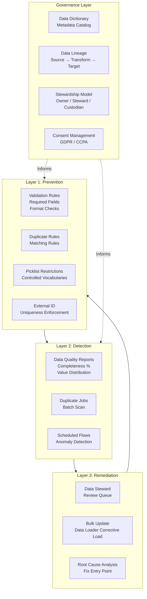

# Data Quality and Governance in Migration

## Exam Domain
Data Migration — 20% of exam weight

## Foundations

**What is data quality?** A dataset's fitness for its intended use. A phone number field with "N/A" values has poor quality for the use case of calling customers, even if it is not technically null. Data quality is always relative to purpose.

**Dimensions of data quality**:
- **Completeness**: Are required fields populated? What % of optional fields have values?
- **Accuracy**: Do values reflect reality? (A customer listed in Alabama who actually operates in California)
- **Consistency**: Are the same concepts represented the same way across records and systems?
- **Uniqueness**: Are records deduplicated? Is each entity represented once?
- **Timeliness**: Is the data current? Are addresses and phone numbers still valid?
- **Validity**: Do values conform to defined formats and acceptable ranges?

**Why data quality matters for architects**: Data quality is not a pre-go-live concern only. It is an ongoing operational requirement. An architect who designs data quality controls into the schema (validation rules, duplicate management, required fields) produces a better long-term outcome than one who cleans data once and hopes it stays clean.

---

## Core Concepts

### Data Quality Framework: The Three Layers

**Layer 1: Prevention (Architecture Layer)**
Prevent bad data from entering the system:
- Required field enforcement (validation rules)
- Field format validation (regex patterns on email, phone, ZIP)
- Picklist restrictions (closed picklists with controlled values)
- Duplicate rules (prevent duplicate records at create/update)
- External ID uniqueness (prevent duplicate External IDs)
- Cross-object validation (if Account Type = 'Prospect', then annual revenue field cannot be null)

**Layer 2: Detection (Monitoring Layer)**
Identify bad data that exists in the system:
- Duplicate Jobs (scan for duplicates across existing records)
- Data Quality Reports (% completeness per field, value distribution anomalies)
- Scheduled Apex or Flows that scan for invalid records
- Third-party data quality tools (Validity Data Intelligence, RingLead, etc.)

**Layer 3: Remediation (Process Layer)**
Fix bad data and address the root cause:
- Data Steward review queues (Duplicate Record Sets, data quality exception lists)
- Bulk update processes (Data Loader corrective loads, mass update automations)
- Root cause analysis (where is bad data entering the system? fix the entry point)
- Data quality SLA (time-to-remediate target per issue type)

### Validation Rules: Architecture Best Practices

Validation rules prevent records from being saved when they don't meet defined criteria. Architecture guidelines:

1. **Use for business rule enforcement, not data type enforcement**: Data types are enforced by the field definition. Validation rules handle business rules (e.g., close date must be in the future for open opportunities).

2. **Consider migration bypass**: Validation rules that enforce rules not applicable to historical data must be bypassed during migration. Use the migration bypass flag pattern.

3. **Error message quality matters**: A validation rule with "Error: Field validation failed" is useless. Write human-readable messages: "Close Date must be on or after today for opportunities in active stages."

4. **Performance at scale**: Validation rules run on every save. Complex validation rules with SOQL queries inside them (VLOOKUP()) can significantly slow save operations on high-volume objects.

5. **Avoid VLOOKUP in validation rules on high-volume objects**: `VLOOKUP()` in a validation rule executes a SOQL query on every save. On an object receiving thousands of inserts per hour, this creates significant overhead.

### Data Profiling Techniques

Before migration, a data profile must be produced for each source object. Minimum profile data points:

| Metric | Description | Why It Matters |
|---|---|---|
| Total record count | Total records in source | Migration volume estimate |
| Null rate per field | % of records with null values | Identifies completeness issues |
| Duplicate rate | % records with duplicate key values | Deduplication effort sizing |
| Value distribution | Count per picklist value | Identifies invalid/unexpected values |
| Format conformance | % of records matching expected format | Transformation effort sizing |
| Referential integrity | % child records with valid parent references | Load sequence and fix-up estimate |
| Age distribution | Record age based on create date | Archive candidacy assessment |

### Data Lineage

**Data lineage** documents where each data element in Salesforce came from, how it was transformed, and what systems consume it. A full data lineage model includes:
- Source: which system and field the data originated from
- Transformations: what changes were made during migration
- Current field: where it lives in Salesforce
- Downstream consumers: integrations, reports, AI features that use this field

Data lineage is required for:
- Regulatory compliance (GDPR, CCPA — who has this data and where did it come from?)
- Impact analysis (what breaks if this field changes?)
- AI model governance (what training data was used and is it trustworthy?)

### Data Dictionary

A **data dictionary** is a structured catalog of all objects and fields in a Salesforce org with:
- Business name and description
- Data type and length
- Valid values (for picklists)
- Business owner (data steward)
- Source system and migration history
- Data retention policy
- PII / sensitivity classification

Without a data dictionary, schema knowledge lives in individual team members' heads. When those people leave, the org becomes unmaintainable.

Building a data dictionary in Salesforce: Use the Object Manager export or tools like Salesforce Documenter, Metazoa Snapshot, or Element.io to extract metadata. Augment with business definitions.

### Data Stewardship Model

Data stewardship is the operational side of data governance:

- **Data Owner**: Business executive responsible for a data domain (e.g., VP of Sales owns the Account domain)
- **Data Steward**: Operational role responsible for day-to-day data quality (reviews duplicate record sets, investigates quality exceptions, approves bulk changes)
- **Data Custodian**: IT/technical role responsible for the data infrastructure (Salesforce admin, integration developer)

Without clear stewardship roles, data quality degrades over time regardless of technical controls.

### Consent Management at the Data Layer

For GDPR, CCPA, and similar regulations, consent must be tracked at the record level. Architectural considerations:

- **Consent Object**: Store consent records as child records of Contact (or Lead) with: consent type, consent given (boolean), date given, consent method, consent expiry
- **Do Not Contact flags**: `HasOptedOutOfEmail`, `DoNotCall` are standard Salesforce fields — use them, don't invent duplicates
- **Right to Erasure**: GDPR Article 17 requires the ability to delete an individual's data on request. Design must support locating and deleting all data about a specific contact across all objects, Big Objects, and integration systems
- **Data Residency**: Some regulations require data to be stored in specific geographic regions. Salesforce org data residency can be configured (requires Hyperforce and specific add-ons)

---

## PTA / SA Relevance

### When This Comes Up in Engagements

**Data governance workshops**: One of the highest-value advisory activities is a data governance workshop where you help a customer define their data quality standards, stewardship model, and data dictionary. This is strategic work that goes beyond technical delivery.

**GDPR/CCPA readiness assessments**: Privacy regulations are a common driver for data architecture engagements. Customers need to know: where is personal data stored? Can we delete it on request? Do we have consent records?

**AI readiness**: Einstein AI features require data quality. Einstein Activity Capture, Einstein Lead Scoring, and Next Best Action all depend on complete, accurate data. A data quality assessment before AI enablement is a standard advisory deliverable.

**Audit failures**: When a customer fails a compliance audit because of inconsistent or missing data in their CRM, the remediation engagement always includes a data quality program design.

### Common Implementation Failures

1. **Data quality controls removed for user convenience**: Users complain that required fields and validation rules slow them down. An admin removes or relaxes them "temporarily." Data quality degrades rapidly. Governance processes must include change management for data quality controls — removing a validation rule should require approval.

2. **No data dictionary**: Three years into a Salesforce implementation, the team has 800 custom fields across 30 objects. No one knows what half of them do. Field cleanup projects cost months of effort. A data dictionary built at the start prevents this.

3. **PII not classified**: Migration loads data from a source that contains Social Security Numbers, dates of birth, and health information into Salesforce custom fields without classifying them as PII. GDPR/CCPA audit finds uncontrolled sensitive data. Remediation is expensive.

4. **Stewardship without tools**: A stewardship program is designed but data stewards have no tools to find and fix quality issues. They can't efficiently query Duplicate Record Sets or find records with missing required fields. Build stewardship-enabling reports and list views as part of the governance implementation.

5. **Single-pass data cleansing**: The team cleanses data during migration but puts no controls in place to prevent re-contamination. Within 6 months, data quality has degraded back to pre-migration levels. Ongoing prevention controls (Layer 1) are as important as the initial cleanse.

### Enterprise Architecture Patterns

**Data Quality Scorecard**: Build a Salesforce report or dashboard that tracks: % completeness per key field, # duplicate records, # records violating business rules. Run weekly. Show to business stakeholders as a key performance indicator.

**Stewardship Workflow**: When a data quality issue is detected (Duplicate Record Set, validation exception, field completeness below threshold), an automated workflow creates a Task for the relevant data steward. The steward has a SLA (e.g., 48 hours) to resolve. Exception escalations go to the data owner.

**Data Governance Council**: For enterprise customers, a Data Governance Council meets monthly to: review data quality scorecards, approve schema changes, define new data standards, and resolve cross-team data ownership conflicts. The council is the organizational mechanism that makes technical data governance work.

---

## Architecture

**Limitations & Tradeoffs:**

- Validation rules with VLOOKUP() queries: Each VLOOKUP() in a validation rule executes a SOQL query at save time. On high-volume objects, this significantly degrades performance. Prefer simpler validation approaches or pre-populate lookup values in stored fields.
- Required fields vs. data collection realities: Making too many fields required frustrates users and reduces data entry completion rates. Balance data quality requirements with user experience.
- Duplicate rule limits (5 active per org, 5 per object): Forces prioritization of which objects get active duplicate prevention.
- GDPR right to erasure in a CRM: Deleting a Contact under GDPR may leave orphaned Activities, Cases, and custom records. Designing the "right to erasure" process for Salesforce requires careful planning — cascading deletes must be handled, and some related records may need to be retained (for legal/regulatory reasons) without the personal identifier.

---

## Key Facts to Memorize

- 3 data quality layers: **Prevention, Detection, Remediation**
- Validation rule `VLOOKUP()`: executes **SOQL at save time** — avoid on high-volume objects
- Data dictionary: object and field catalog with **business definitions, owners, data types**
- Data lineage: **source → transformation → target → consumers**
- Data stewardship roles: Owner (business executive), Steward (operations), Custodian (IT)
- GDPR right to erasure: must be able to **locate and delete all data** about a specific individual
- Consent record: child record of Contact with consent type, date, method, expiry
- `HasOptedOutOfEmail` and `DoNotCall`: **standard Salesforce fields** for marketing consent
- Data quality scorecard: completeness %, duplicate count, rule violation count
- PII classification must happen **before** migration — not retroactively

---

## Exam Traps

1. **"Validation rules prevent all bad data"** — Validation rules prevent bad data from being saved through the UI. They can be bypassed by Bulk API, System Mode Flows, and migration loads. They are Layer 1 (prevention) but not a complete data quality solution.
2. **"VLOOKUP in validation rules"** — The exam may test whether VLOOKUP() in a validation rule adds a SOQL query overhead. It does — this is a known performance issue on high-volume objects.
3. **"Data steward vs. data owner"** — Steward = operational day-to-day quality management. Owner = business executive accountability. The exam may present scenarios asking which role performs which activity.
4. **"GDPR right to erasure"** — This requires deleting data across ALL related objects, not just the Contact record. The exam may ask what additional objects must be considered.

---

## Practice Questions

**Q1.** A Salesforce validation rule uses `VLOOKUP(Territory__c.Tier__c, Territory__c.Id, Territory_Id__c)` to validate that an Account's territory tier is correct. After enabling this validation rule, save operations on Account become noticeably slower. What is the root cause?

A) The VLOOKUP formula syntax is incorrect  
B) The validation rule adds a SOQL query on every Account save, which increases save latency  
C) Territory__c needs a custom index before VLOOKUP can be used efficiently  
D) Validation rules cannot use VLOOKUP on custom objects

**Answer: B** — VLOOKUP() in a validation rule executes a SOQL query each time the record is saved. On a high-volume object (or an object saved frequently), this adds measurable latency. The architectural fix is to pre-populate the territory tier value on Account via a Flow when territory assignment changes, then validate the stored field value directly (no query needed).

---

**Q2.** A company is implementing GDPR compliance. A Contact record is flagged for deletion under Right to Erasure. Which concern should the architect raise before deleting the Contact?

A) Contact records cannot be deleted in Salesforce  
B) Deleting the Contact will leave orphaned Activities, Cases, and custom child records unless they are handled as part of the erasure process  
C) GDPR erasure only applies to the Contact's email and phone fields, not the full record  
D) The Contact must be merged with another Contact before deletion

**Answer: B** — A Contact may have related Activities (Tasks, Events), Cases, Custom object child records, and other related data. Deleting just the Contact leaves orphaned records that still contain personally identifiable information. A complete Right to Erasure process must identify and handle all related records.

---

**Q3.** A data quality team wants to monitor Account record completeness weekly and alert data stewards when completeness drops below 85% on key fields. What is the most appropriate Salesforce-native approach?

A) Create a scheduled Apex class that queries Accounts and sends emails  
B) Build a Salesforce Report on Account that shows records with null values on key fields; schedule the report to run weekly and email data stewards if record count exceeds a threshold  
C) Use Salesforce Shield to monitor field-level completeness  
D) Create a Flow that checks every Account on save and creates a Task for the steward if fields are empty

**Answer: B** — A report with filters for null key fields, combined with the scheduled report subscription feature (email when row count > 0), is the simplest, most maintainable solution. Answer A works but is over-engineered for a monitoring use case. Shield (C) is for audit and encryption, not completeness monitoring. Answer D creates a Task on every Account save — operationally overwhelming and does not aggregate to a weekly stewardship view.
