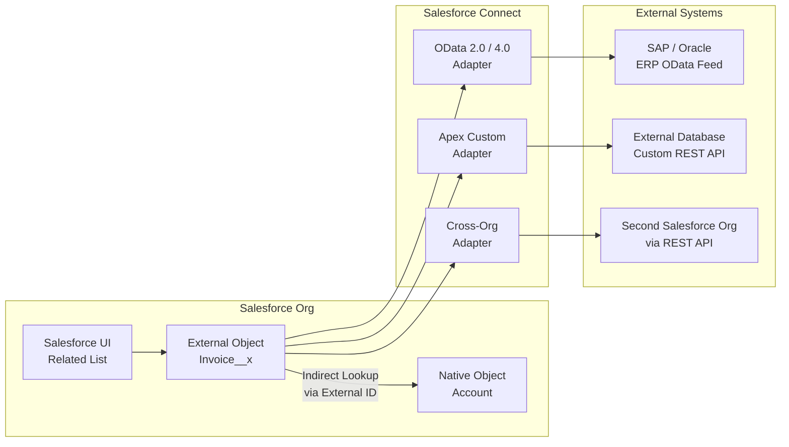

# External Objects and Salesforce Connect

## Exam Domain
Integration & Connectivity — 15% of exam weight

## Foundations

**The integration challenge**: Enterprise customers have data in multiple systems — ERP (SAP, Oracle), HR systems, financial databases, legacy CRMs. Users need to see this data in Salesforce without copying it. Traditional approaches require ETL pipelines that introduce latency, storage costs, and synchronization complexity.

**Salesforce Connect** solves a specific problem: providing a Salesforce-native view of external data without migrating it into Salesforce storage. External data appears in the Salesforce UI exactly like native records — with list views, detail pages, related lists, and search — but the data lives in the external system and is queried live.

**When to use Salesforce Connect vs. ETL migration**:
- Use Salesforce Connect when: data must remain in the source system (compliance, single system of record), data is too large to migrate, real-time accuracy is required
- Use ETL migration when: Salesforce is the system of record, complex Salesforce features (automation, duplicate management, reports) are needed on the data, long-term data ownership is in Salesforce

---

## Core Concepts

### External Objects

**External Objects** are Salesforce object definitions that map to external system data. They look and behave like custom objects in Salesforce but:
- Data is stored in the external system (not Salesforce storage)
- Records are queried live via an adapter when a user views them
- They have the `__x` API name suffix (not `__c`)
- They do not count toward Salesforce storage limits
- They do not support: Apex triggers, most automation, roll-up summaries, most reports
- They do support: list views, detail pages, related lists, Salesforce Connect API access

### Salesforce Connect Adapters

**OData 2.0 and OData 4.0 Adapters**: Connect to any system that exposes an OData feed. OData is an open REST-based protocol for data access. Most modern systems and data platforms support OData.

- Syncs field definitions from the OData service
- Supports pagination, filtering (passed to external system as OData query params)
- Requires external system to support OData protocol

**Apex Custom Adapter**: Implement the `DataSource.Connection` class in Apex to connect to any external system via custom code. Maximum flexibility — connect to any API.

- Full control over authentication, query translation, and response parsing
- More development effort than OData adapter
- Required when external system does not support OData

**Cross-Org Adapter**: Connect to another Salesforce org's data. Uses Salesforce REST API under the hood.

- Useful for multi-org architectures (hub/spoke, franchise models)
- Data from the connected org appears as External Objects in the primary org
- Row-level security is applied by the connected org

**Heroku Connect**: A specific adapter for bidirectional sync between Salesforce and a Heroku Postgres database. Not the same as Salesforce Connect External Objects — Heroku Connect actually syncs data INTO the Postgres database (it's a copy, not live query).

### External Object Relationship Types

**External Lookup**: Lookup from a Salesforce or External Object to an External Object. Uses the External ID field of the external object as the join key.

**Indirect Lookup**: Lookup from an External Object to a Salesforce standard or custom object. Uses an External ID field on the Salesforce object as the join key (instead of the Salesforce record ID). Required because external systems typically don't know Salesforce internal IDs.

**Standard Lookup**: Standard Salesforce lookup on an External Object (lookups to Account, Contact, etc.) using the Salesforce record ID.

### Performance and Limitations of Salesforce Connect

**Row limit per page load**: When a user views a related list of External Object records, Salesforce Connect fetches up to **100 rows** (configurable up to 2,000 in some adapters).

**Query translation**: Salesforce translates SOQL into OData (or adapter-specific) queries and sends them to the external system. The external system must execute these queries efficiently. If the external system is slow or under-loaded, Salesforce Connect views will be slow.

**Governor limits**: Each External Object query consumes a Salesforce API call. In high-traffic orgs, External Object views can consume significant API daily limits.

**Cache**: Salesforce Connect can be configured with a short cache TTL to reduce external system queries for frequently viewed records. Cached data is not real-time but reduces load.

**Not supported on External Objects**:
- Apex triggers
- Workflow rules, Process Builder, Flows (in most cases)
- Roll-up summary fields
- Sharing rules (External Objects use external system's security)
- Salesforce reports (standard report builder)
- Duplicate management

### Salesforce Connect Licensing

Salesforce Connect is an add-on license (not included in standard Salesforce editions). It is licensed per:
- Number of External Object definitions
- Number of concurrent external data source connections

This is an important commercial consideration — Salesforce Connect is not free.

### When Salesforce Connect is NOT the Answer

Salesforce Connect is the wrong pattern for:
1. **High-frequency access** (every page load queries the external system — at scale, this overwhelms the external system)
2. **Complex reporting** (External Objects don't work with the standard report builder)
3. **Automation triggers** (no triggers on External Objects)
4. **Long-term data ownership** (if Salesforce eventually needs to own this data, Connect is a temporary solution)
5. **Data that needs Salesforce feature richness** (if users need duplicate management, roll-up summaries, or full workflow on this data, migrate it into Salesforce)

---

## PTA / SA Relevance

### When This Comes Up in Engagements

**ERP integration design**: The most common Salesforce Connect use case is showing ERP data (invoices, orders, inventory) in Salesforce without migrating it. This is a common topic in manufacturing, distribution, and FSI customer discussions.

**Multi-org architecture**: When an enterprise has multiple Salesforce orgs (different BUs or regions) and needs users in one org to see data from another org, the Cross-Org Adapter is the enabling technology.

**Real-time data access discussions**: When a customer asks "Can users see live inventory levels from SAP in Salesforce?", the answer is Salesforce Connect (with the caveat about SAP needing to expose an OData feed or custom API).

**Licensing conversations**: Because Salesforce Connect is a paid add-on, the cost-benefit analysis matters. Is it cheaper to pay for Connect licenses and maintain the OData feed, or to run a nightly ETL sync? The answer depends on how real-time the access needs to be and the volume of records.

### Common Implementation Failures

1. **High-traffic External Object pages**: A Salesforce Connect implementation shows a related list of 500 invoice records on every Account page. Every Account page load now fires an OData query to the ERP. At a 100-user org with users browsing 50 accounts per day, that's 5,000 ERP queries per day just from this one feature. The ERP becomes the bottleneck.

2. **External system not indexed**: Salesforce Connect translates SOQL WHERE clauses into OData filters and sends them to the external system. If the external system's data is not indexed on the filtered fields, the external query is slow — which makes the Salesforce page load slow. External system indexing is as important as Salesforce-side optimization.

3. **Treating External Objects like native objects**: Developers write Apex that queries External Objects expecting trigger support, relationship queries via sub-selects, and aggregate SOQL. These features don't work on External Objects. The development team discovers this after writing significant code.

4. **No fallback for external system downtime**: The external system goes down for maintenance. All Salesforce Connect pages that depend on it show errors. No graceful degradation was designed. Users see "Connection failed" messages during normal business hours.

5. **Using Connect for data that should be migrated**: A 5-year-old Salesforce implementation uses Connect to show customer order history from an aging on-premise database. The database is being decommissioned, and now there is a scramble to migrate 10 years of order history into Salesforce. Connect was used because it was "easier at the time."

### Enterprise Architecture Patterns

**Hybrid Pattern: Connect for Current + Big Objects for Historical**: Show current records (last 2 years) via Connect for real-time data. Archive historical records (3+ years) in Big Objects in Salesforce for querying without hitting the external system. This reduces External Object query volume and ensures historical data is always accessible even if the external system is down.

**Caching Layer**: For frequently accessed External Object data that doesn't change in real-time, implement a caching layer (Redis, Salesforce cache partition) that serves recent queries without hitting the external system on every page load.

**OData Service Design**: When designing the OData service that backs Salesforce Connect, ensure: proper indexes on all OData filter fields, pagination support (Salesforce Connect pages results), reasonable row limits per call, and authentication that supports Salesforce's OAuth patterns.

---

## Architecture

**Limitations & Tradeoffs:**

- External Objects: no triggers, no standard reports, no automation. If business logic or reporting is needed on this data, migrate it into Salesforce.
- Row limit per page: External Objects return max 100 rows by default in related lists. Displaying large volumes of related external records requires custom LWC with pagination.
- API limit consumption: Each External Object access consumes Salesforce API calls. Large orgs with many users accessing External Objects can exhaust daily API limits.
- External system availability = Salesforce UI availability for those features. Plan for external system maintenance windows.
- Salesforce Connect licensing: add-on cost. Factor into project budget.

---

## Key Facts to Memorize

- External Objects: API name ends in **`__x`**
- External Object data is stored in the **external system**, not Salesforce storage
- Adapters: OData 2.0, OData 4.0, **Apex Custom Adapter**, Cross-Org
- External Lookup: External Object → External Object (using External ID)
- Indirect Lookup: External Object → Salesforce Object (using External ID field on SF object)
- External Objects do NOT support: **Apex triggers, standard reports, roll-up summaries, sharing rules, most automation**
- Row limit per page load: **100 rows** default (configurable)
- Salesforce Connect: **licensed add-on** — not included in base edition
- Cross-Org Adapter: connect to **another Salesforce org**
- Heroku Connect: **bidirectional sync** to Heroku Postgres — a copy, not live query

---

## Exam Traps

1. **"Which automation works on External Objects?"** — Almost none. Apex triggers, workflow rules, and most Flows do not fire on External Objects. The exam may offer these as plausible distractors.
2. **"Indirect Lookup vs. External Lookup"** — Indirect Lookup = External Object to Salesforce Object via External ID field. External Lookup = External Object to another External Object. Know the direction and the key type used.
3. **"Heroku Connect is the same as Salesforce Connect"** — It is not. Heroku Connect is a specific sync service for Heroku Postgres. Salesforce Connect is the platform for External Objects. They are different products.
4. **"Salesforce Connect is included in all editions"** — It is a paid add-on.

---

## Practice Questions

**Q1.** A company wants Salesforce users to view live inventory levels from their SAP ERP system in a related list on the Product object. SAP supports OData 4.0. No Salesforce storage should be used for inventory data. Which solution is most appropriate?

A) Create a scheduled Flow that syncs SAP inventory records to a custom Salesforce object nightly  
B) Use Salesforce Connect with an OData 4.0 External Data Source and define an External Object for inventory  
C) Use Salesforce Connect with the Cross-Org Adapter to pull from a second Salesforce org that stores SAP data  
D) Build a custom LWC component that calls SAP directly via Lightning Data Service

**Answer: B** — Salesforce Connect with OData 4.0 is the correct pattern for live access to external data without storing it in Salesforce. The Cross-Org Adapter (C) connects to another Salesforce org, not SAP. A scheduled sync (A) violates the "live" requirement and uses storage. A custom LWC calling SAP directly (D) is not architected for maintainability and bypasses Salesforce's data layer.

---

**Q2.** An External Object `Invoice__x` needs to be related to the native Salesforce Account object. The external ERP system uses its own Account identifier (not the Salesforce Account ID). Which relationship type is correct?

A) Standard Lookup from Invoice__x to Account using the Salesforce Account ID  
B) External Lookup from Invoice__x to Account  
C) Indirect Lookup from Invoice__x to Account using an External ID field on Account  
D) Master-Detail from Invoice__x to Account

**Answer: C** — An Indirect Lookup is used when the External Object links to a Salesforce object using an External ID field on the Salesforce object (not the Salesforce internal ID). This is the correct pattern when the external system uses its own identifier and doesn't know the Salesforce Account ID. External Lookup (B) connects External Object to External Object. Master-Detail (D) is not supported on External Objects.

---

**Q3.** After implementing Salesforce Connect with an OData adapter to an external inventory system, users report that Account pages with many related inventory items are loading very slowly. What are the TWO most likely root causes?

A) Salesforce Connect does not support OData 4.0  
B) The external inventory system's database tables are not indexed on the fields used in OData filter queries  
C) Each External Object related list load sends an OData query to the external system — the external system is the bottleneck  
D) External Objects have a 10-record limit per page load  
E) The External Object definition needs a custom index requested from Salesforce Support

B and C — The external system is queried live for every related list load. If the external system is slow (unindexed tables, high load) or returns large result sets, the Salesforce page will be slow. The fix involves indexing the external database and/or limiting the query result set with OData filters. Answer D is wrong (100 records default, not 10). E is not applicable to External Objects.
