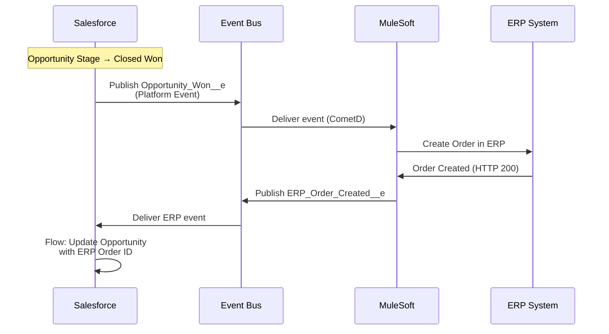
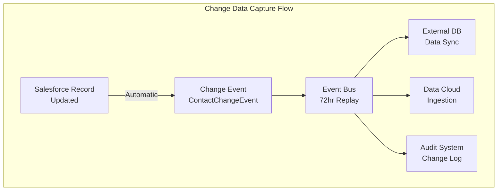

# Platform Events and Streaming Architecture

## Exam Domain
Integration & Connectivity — 15% of exam weight

## Foundations

**The problem with polling**: Traditional integrations work by polling — "Check every 5 minutes if anything has changed in Salesforce." Polling wastes API calls, introduces latency (up to 5 minutes behind), and is inefficient at scale. If nothing changed, you wasted an API call. If 10,000 records changed, you need complex delta detection logic.

**Event-driven integration**: Instead of polling, the producer (Salesforce) publishes an event when something happens. Consumers (external systems, Apex code, Flows) subscribe to events and react in real time. This is the modern integration pattern.

**Why architects care**: Event-driven architecture decouples producers from consumers. Salesforce doesn't need to know which systems care about a record change. It publishes the event; interested parties subscribe. This is more scalable, more maintainable, and more real-time than polling.

---

## Core Concepts

### Platform Events

**Platform Events** are Salesforce's publish-subscribe messaging framework. Key characteristics:
- Published by Salesforce Apex, Flows, or external systems via REST API
- Consumed by Apex triggers (`after insert`), Flows (Subscribe trigger), external systems via CometD streaming API, or MuleSoft/middleware
- **Schema defined in Setup** — a Platform Event is like a custom object definition but for events
- Events are **stored for 72 hours** (replay capability) — consumers that were offline can replay missed events
- Events are **not stored as records** permanently — they are transient messages

**Platform Event fields**: Platform Events have standard fields (`CreatedDate`, `CreatedById`, `ReplayId`) plus custom fields defined by the architect. Typical event payload fields:
- Record ID of the triggering record
- Status change value (old and new)
- Business process identifier
- Timestamp
- Any other data consumers need to react

### Platform Event vs. Change Data Capture vs. Streaming API

| Feature | Platform Events | Change Data Capture | Streaming API (PushTopic) |
|---|---|---|---|
| What it tracks | Custom business events | Record field changes | SOQL query results |
| Published by | Apex, Flow, REST API | Salesforce automatically | Salesforce automatically |
| Schema | Custom-defined fields | Standard change event schema | SOQL-defined |
| Replay window | 72 hours | 72 hours | 24 hours |
| Objects supported | Any (custom definition) | Standard + custom objects | Standard + custom objects |
| Use case | Custom business signals | Data sync, audit | Real-time query subscriptions |
| Filters | Custom logic | Field-level filter | SOQL WHERE clause |

### Platform Event Architecture Patterns

**Pattern 1: System-to-Salesforce Event**
An external system (ERP, logistics platform) publishes a Platform Event to notify Salesforce that something happened externally.

Example: An ERP publishes an `Order_Shipped__e` event. Salesforce subscribes via a Platform Event-Triggered Flow, creates a Case record, and updates the Opportunity stage.

```
ERP → REST API → Publish Order_Shipped__e → 
Salesforce Platform Event Bus → 
Flow Trigger subscribes → Creates Case
```

**Pattern 2: Salesforce-to-System Event**
Salesforce publishes a Platform Event when an internal business event occurs.

Example: An Opportunity stage changes to "Closed Won" → Apex trigger publishes `Opportunity_Won__e` → External provisioning system subscribes via CometD → Provisions the customer in ERP.

**Pattern 3: Async Decoupling within Salesforce**
Platform Events can decouple synchronous Apex from work that should happen asynchronously.

Example: A complex Apex trigger is hitting governor limits because it's doing too much. Refactor: the trigger publishes a Platform Event. A Platform Event-Triggered Apex handler processes the heavy work asynchronously (in its own transaction, separate from the trigger).

This is a key pattern for avoiding governor limit errors in complex trigger architectures.

### Change Data Capture (CDC)

**Change Data Capture** automatically generates change events whenever a Salesforce record is created, updated, deleted, or undeleted. These events are published to the Salesforce event bus automatically — no custom code or configuration needed beyond enabling CDC for the object.

**CDC Event Fields**:
- `ChangeEventHeader`: Contains change type (CREATE, UPDATE, DELETE, UNDELETE), changed fields list, record IDs
- Standard and custom fields from the changed record
- **Only changed fields are included in UPDATE events** (not the full record) — this is important for integration design

**CDC Use Cases**:
- Real-time data synchronization: External system subscribes to CDC events and mirrors changes
- Audit trail: Log all record changes to an external audit system
- Event-driven integration triggers: React to Salesforce record changes in external systems without polling

**CDC Replay Window**: 72 hours. If a subscriber goes offline, it can replay events from the last 72 hours using the ReplayId.

**CDC Limitations**:
- Only changed fields in the payload (UPDATE events) — consumer must maintain state of the full record if it needs the complete record
- 5 million CDC events per 24-hour period per org (default limit)
- CDC events include deleted record IDs but not the full record content (the record is gone)
- No support for Big Objects or External Objects

### Streaming API and PushTopics (Legacy)

**PushTopics** define a SOQL query, and Salesforce pushes notifications to subscribers whenever records matching the query change. This is the legacy streaming mechanism — newer development should use CDC or Platform Events instead.

PushTopic limitations that drove the move to CDC:
- 24-hour replay window (vs. 72 hours for CDC and Platform Events)
- SOQL-based filtering is limited
- Lower throughput than CDC
- Not available for all objects

**Generic Streaming** (via StreamingChannel): Publish arbitrary JSON payloads to named channels. Subscribers receive the payload. No record-triggered — purely custom messaging.

### Event Delivery Guarantees

**At-least-once delivery**: Salesforce event bus provides at-least-once delivery semantics. A consumer may receive the same event more than once (on retry). Design consumers to be **idempotent** — processing the same event twice produces the same result.

**Order**: Platform Events and CDC events are generally ordered by publication time within a partition, but strict global ordering is not guaranteed. Design consumers to handle out-of-order events if order matters.

### Event Bus Limits

| Limit | Platform Events | CDC |
|---|---|---|
| Event storage (replay) | 72 hours | 72 hours |
| Max events per day | Varies by license (typically 250k–1M) | 5M default |
| Max subscribers per channel | 20 | 20 |
| Max payload size | 1 MB | Per-record field payload |

---

## PTA / SA Relevance

### When This Comes Up in Engagements

**Integration architecture design**: When a customer asks "how do we integrate Salesforce with our ERP in real time?", the answer is usually either Platform Events (for custom business events) or CDC (for data synchronization). Polling via REST API is the legacy pattern — architects should recommend event-driven.

**MuleSoft + Salesforce architecture**: MuleSoft has native Platform Event and CDC connectors. The standard pattern for Salesforce + MuleSoft integration is: Salesforce publishes events → MuleSoft subscribes → MuleSoft routes to downstream systems. This is the "event-driven integration" architecture Salesforce and MuleSoft jointly recommend.

**Async governor limit relief**: Platform Events are the primary tool for decoupling complex Apex triggers from their governor limits. If a customer's triggers are hitting CPU time limits, a Platform Event refactor is often the solution.

**Data Cloud connectivity**: Salesforce Data Cloud ingests CDC events natively for real-time data updates. Understanding CDC is increasingly important as Data Cloud becomes central to enterprise Salesforce architectures.

### Common Implementation Failures

1. **Non-idempotent event consumers**: A Platform Event subscriber creates a record when it receives an event. Because Platform Events guarantee at-least-once delivery, the same event may arrive twice. The consumer creates duplicate records. Design: check if the record already exists before creating (idempotent insert using External ID upsert).

2. **72-hour replay window underestimated**: An integration subscriber goes offline for a weekend (hardware failure). It comes back online Monday morning. If more than 72 hours have passed since events were published, those events are lost. Architects must design for subscriber recovery within the replay window.

3. **Platform Events used for large payload delivery**: A developer tries to put a full Account record (200 fields) in a Platform Event payload. Events have a 1 MB limit. For large payloads, publish only the record ID and metadata in the event; let the consumer query for full details.

4. **CDC without state management on consumer side**: A CDC UPDATE event contains only changed fields, not the full record. A consumer that needs the full record must maintain a local copy and apply delta changes. Teams that don't understand this design CDC consumers that produce incomplete records in the target system.

5. **Polling after CDC was designed**: An integration team implements CDC correctly. Later, another team adds a polling integration to the same object for a different purpose. The org now has both event-driven and polling patterns for the same data — inconsistent, inefficient, and harder to maintain.

### Enterprise Architecture Patterns

**Event-Driven Integration Hub**: All Salesforce integrations publish and subscribe through a central event bus (MuleSoft Anypoint Exchange or similar). No direct point-to-point integrations. This is the enterprise integration pattern that scales to dozens of integrated systems.

**Idempotent Consumer Pattern**: Every event consumer must be designed with idempotency:
1. Check if the operation has already been performed (using the event's ReplayId or a custom idempotency key)
2. If already performed: skip (log as duplicate)
3. If not performed: execute the operation

**Saga Pattern for Long Transactions**: A business process that spans multiple systems uses a series of Platform Events to coordinate. Each step publishes an event upon completion; the next step subscribes and proceeds. If a step fails, a compensating event is published to roll back previous steps. This is the microservices saga pattern applied to Salesforce integrations.

---

## Architecture





**Limitations & Tradeoffs:**

- 72-hour replay window: not indefinite. Design subscriber recovery processes for within this window or implement dead-letter queue for events not processed before expiry.
- At-least-once delivery: every consumer must be idempotent. This adds development complexity.
- CDC UPDATE events contain only changed fields: consumers must maintain state or re-query Salesforce for the full record.
- Platform Event daily limits vary by Salesforce license tier. High-event-volume architectures may need add-on event capacity.
- PushTopics (Streaming API legacy): being deprecated in favor of CDC. New development should use CDC or Platform Events.

---

## Key Facts to Memorize

- Platform Events replay window: **72 hours**
- CDC replay window: **72 hours**
- PushTopic replay window: **24 hours** (legacy, being deprecated)
- Platform Event max payload: **1 MB**
- At-least-once delivery: design consumers to be **idempotent**
- CDC UPDATE events: contain only **changed fields** (not full record)
- CDC default event limit: **5 million per 24 hours**
- Platform Events can be published by: **Apex, Flow, REST API (external systems)**
- Platform Events consumed by: **Apex triggers (`after insert`), Flows (Subscribe trigger), CometD external subscribers**
- PushTopics: **legacy** — new development should use CDC or Platform Events

---

## Exam Traps

1. **"CDC includes the full record in every event"** — False for UPDATE events. Only changed fields are included. CREATE events include all populated fields.
2. **"PushTopics have a 72-hour replay window"** — False. PushTopics have 24 hours. Only Platform Events and CDC have 72 hours.
3. **"Platform Events guarantee exactly-once delivery"** — False. They guarantee at-least-once. Idempotent consumer design is required.
4. **"Platform Events are stored permanently like records"** — False. They expire after 72 hours and are not queryable via SOQL like records.

---

## Practice Questions

**Q1.** An external logistics system needs to be notified in real-time whenever a Salesforce Order record's status changes to "Shipped". The logistics system subscribes to a streaming endpoint. Which mechanism should the architect recommend?

A) A scheduled Apex class that polls Orders every 5 minutes  
B) A PushTopic based on a SOQL query for Orders with Status = 'Shipped'  
C) Change Data Capture on the Order object, with the logistics system subscribing via CometD  
D) A workflow rule that sends an outbound message to the logistics system

**Answer: C** — CDC automatically publishes change events when the Order Status field changes. The logistics system subscribes to the OrderChangeEvent channel via CometD. CDC has a 72-hour replay window and is the modern recommended pattern. PushTopics (B) are legacy and have a 24-hour replay window. Polling (A) adds latency. Outbound messages (D) are legacy workflow-based and have limited retry logic.

---

**Q2.** A Platform Event subscriber is processing `Payment_Received__e` events and creating Payment records in Salesforce. Due to a network issue, the subscriber received the same event twice. The result is duplicate Payment records. What architectural change should the architect make?

A) Switch from Platform Events to Change Data Capture  
B) Design the subscriber to be idempotent — check if a Payment with the event's transaction ID already exists before creating  
C) Enable Duplicate Rules on the Payment object  
D) Increase the Platform Event delivery window

**Answer: B** — Platform Events guarantee at-least-once delivery. The subscriber must be designed to handle duplicate event delivery. The correct pattern is idempotent consumer design: check for an existing record using a unique identifier from the event payload (transaction ID as External ID) before inserting. Duplicate Rules (C) would help but are a secondary defense; idempotent design is the architectural answer.

---

**Q3.** An architect is designing a CDC-based integration where an external data warehouse subscribes to ContactChangeEvent events to maintain a synchronized copy of Contact records. A developer notes that UPDATE events only contain changed fields. What must the external data warehouse consumer handle?

A) Nothing — Salesforce sends the full Contact record in every CDC event  
B) The consumer must store the full Contact record locally and apply delta changes from UPDATE events to maintain a current state  
C) The consumer should re-query Salesforce for the full Contact record after each UPDATE event  
D) The consumer should only process CREATE events and ignore UPDATE events

**Answer: B** — CDC UPDATE events include only the fields that changed. To maintain a current complete copy of the Contact record, the consumer must: store the full record (seeded from an initial data load), and apply delta changes from each UPDATE event. Option C (re-query for full record) is a valid fallback pattern but defeats some of the efficiency gains of CDC and adds query overhead.
