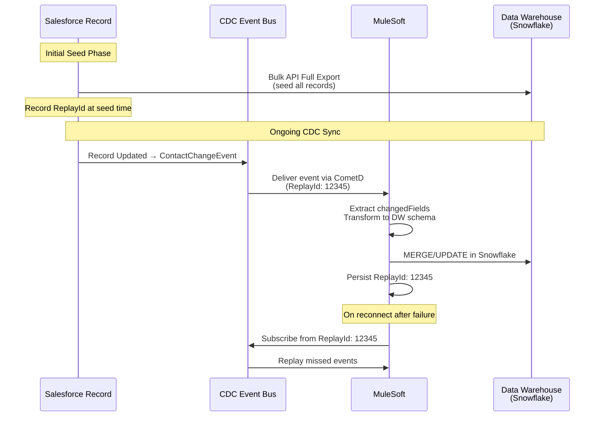

# Change Data Capture Design

## Exam Domain
Integration & Connectivity — 15% of exam weight

## Foundations

**What problem does CDC solve?** In traditional integration architectures, external systems need to stay synchronized with Salesforce data. The common approach — polling with `WHERE SystemModstamp >= :lastPolled` — has well-known problems:
- API limit consumption even when nothing changed
- Latency proportional to polling interval
- Clock drift and timezone issues on timestamp comparisons
- Miss events that occurred and then were reversed within a polling window
- No native support for deletions (a deleted record's SystemModstamp is no longer queryable)

CDC solves all of these: changes are pushed to subscribers in near-real-time, deletions are captured, the replay window handles transient subscriber failures, and no polling is needed.

**CDC as architecture**: CDC is not just a feature — it is a design pattern that changes how you architect integrations. Instead of "integration system queries Salesforce periodically," the pattern becomes "Salesforce emits changes; integration systems react." This is the shift from pull to push, from synchronous to event-driven.

---

## Core Concepts

### CDC Event Structure

Every CDC event has two sections:

**ChangeEventHeader** (metadata about the change):
```json
{
  "entityName": "Contact",
  "changeType": "UPDATE",
  "changedFields": ["LastName", "Email", "Phone"],
  "changeOrigin": "com/salesforce/api/soap/58.0;client=SfdcInternalAPI/null",
  "transactionKey": "000abc...",
  "sequenceNumber": 1,
  "commitTimestamp": 1704100800000,
  "recordIds": ["003000000001ABC"]
}
```

**Payload** (record field values):
- **CREATE**: All populated fields are included
- **UPDATE**: Only changed fields are included (plus Id and Header)
- **DELETE**: No field values; only the record Id in the header
- **UNDELETE**: All fields re-populated (record restored from Recycle Bin)

### Change Types

| Change Type | Description | Payload Content |
|---|---|---|
| CREATE | Record was created | All populated fields |
| UPDATE | Record fields were modified | Only changed fields |
| DELETE | Record was deleted | RecordId only (no field values) |
| UNDELETE | Record was restored from Recycle Bin | All fields |
| MERGE | Records were merged | Master record ID, absorbed record IDs |

**MERGE change type**: When two records are merged in Salesforce, CDC publishes a MERGE event on the master record. This event includes the absorbed record IDs so downstream systems can update their references.

### Enabling CDC

CDC is enabled per object in **Setup → Integrations → Change Data Capture**. Standard objects available by default; custom objects must be explicitly enabled.

Objects that support CDC:
- Most standard objects (Account, Contact, Lead, Opportunity, Case, etc.)
- Custom objects
- **NOT supported**: External Objects, Big Objects, some platform system objects

**Field-level selection**: You can configure which fields to include in CDC events for an object. By default, all fields are included. Limiting fields reduces payload size and can improve event processing efficiency.

### CDC and Field Encryption (Salesforce Shield)

When Salesforce Shield Platform Encryption is enabled on fields, CDC events for those fields contain **encrypted values** — the actual encrypted ciphertext, not plain text. Subscribers must have decryption access (typically via a named principal with the decryption permission) to read encrypted field values in CDC events.

This is an important security design consideration: CDC events traverse the event bus, which may be consumed by external systems. Ensure that subscribers are authorized to receive encrypted field data.

### CDC Filtering

**Event Filters** allow subscribers to receive only the change events they care about:
- Filter by record type
- Filter by specific field changes (receive only events where a specific field was in `changedFields`)

Filters reduce noise — a subscriber that only cares about status changes doesn't need to receive every minor field edit.

### CDC in Apex Triggers

CDC events can be consumed by Apex triggers:
```apex
trigger ContactChangeEventTrigger on ContactChangeEvent (after insert) {
    List<ContactChangeEvent> events = Trigger.new;
    for (ContactChangeEvent event : events) {
        EventBus.ChangeEventHeader header = event.ChangeEventHeader;
        if (header.changeType == 'CREATE') {
            // Handle new contact
        }
        if (header.changeType == 'UPDATE') {
            List<String> changedFields = header.changedFields;
            if (changedFields.contains('Email')) {
                // Handle email change
            }
        }
    }
}
```

**Key design consideration**: CDC Apex triggers run asynchronously — they do not run in the same transaction as the record change. This means:
- No access to the record's state before the change (no `Trigger.old`)
- Cannot roll back the record change from the CDC trigger
- The `changedFields` list in the header tells you what changed

### CDC vs. Flow (Triggered) for React-on-Change

CDC Apex triggers are asynchronous and run after the transaction. For simple automation reactions to record changes, a **Record-Triggered Flow (After Save)** is often more appropriate:
- Runs synchronously in the same transaction context
- Has access to old and new record values
- No external streaming subscription required

Use CDC when the consumer is **external to Salesforce** (a data warehouse, a middleware platform, an external database). Use Flow or Trigger for reactions **within Salesforce**.

### CDC Architecture for Data Synchronization

The canonical CDC data synchronization architecture:

1. **Initial Load**: Perform a full bulk export of Salesforce data to the external system (Data Loader or Bulk API). This seeds the external system with current state.

2. **Enable CDC**: Enable CDC on the objects being synchronized. Set the ReplayId to "replay from earliest event" (or from the timestamp of the initial load start).

3. **Subscribe and Process**: External system subscribes to CDC events via CometD. For each event:
   - CREATE: Insert the new record
   - UPDATE: Apply field changes to existing record
   - DELETE: Mark record as deleted in external system
   - MERGE: Consolidate absorbed record references

4. **Replay on Reconnect**: If the subscriber disconnects, reconnect with the last successfully processed ReplayId to avoid gaps.

5. **Idempotency**: Design the consumer to handle duplicate events (use the event's `transactionKey` as an idempotency key).

---

## PTA / SA Relevance

### When This Comes Up in Engagements

**Data Cloud integration design**: Salesforce Data Cloud ingests CDC events natively. When designing a Data Cloud implementation, understanding CDC's event structure and field-level filtering is important for optimizing ingestion performance.

**Snowflake / data warehouse sync**: A very common enterprise architecture is Salesforce + Snowflake with CDC-based synchronization. The pattern: CDC events → MuleSoft → Snowflake. This is a well-established integration pattern that PTAs should be able to whiteboard confidently.

**Audit and compliance integrations**: CDC provides a complete audit trail of all record changes. For customers with compliance requirements (financial audit, HIPAA audit trail), CDC provides a richer change log than Field History Tracking (which has an 18-month limit and only tracks specific fields).

**MDM synchronization**: When Salesforce is one of several systems feeding an MDM hub, CDC enables real-time MDM synchronization without polling.

### Common Implementation Failures

1. **Seeding the external system incorrectly**: A team enables CDC and starts subscribing without first seeding the external system with existing Salesforce data. The subscriber sees only events from the time of subscription forward — the historical data is missing. Always perform an initial full load before enabling CDC subscriptions.

2. **ReplayId not persisted**: The subscriber is connected and processing. It crashes and restarts. The team did not persist the last processed ReplayId. The subscriber starts from "earliest" (72 hours ago), re-processes thousands of duplicate events, and creates data quality issues in the target system. Always persist and recover ReplayIds.

3. **CDC trigger for within-Salesforce logic**: A developer uses a CDC Apex trigger to update a related record when a Contact changes. This is async and adds unnecessary complexity — a Record-Triggered Flow (After Save) is the right tool for within-Salesforce automation.

4. **Encrypted fields in CDC sent to unauthorized systems**: Shield-encrypted field values appear encrypted in CDC events. An external system receives these encrypted values and has no decryption capability — the data is unusable. Design: if encrypted fields are needed by an external system, ensure the subscriber has decryption authorization or exclude those fields from the CDC event payload.

5. **Not accounting for MERGE events**: A data warehouse synchronization processes CREATE, UPDATE, and DELETE CDC events but ignores MERGE events. When records are merged in Salesforce, the warehouse ends up with orphaned reference records pointing to absorbed (now-deleted) IDs.

### Enterprise Architecture Patterns

**CDC + MuleSoft as the Enterprise Integration Backbone**: The dominant enterprise pattern for Salesforce-to-data-warehouse or Salesforce-to-ERP synchronization. Salesforce publishes CDC events → MuleSoft subscribes via CometD connector → MuleSoft transforms and routes → Target systems (Snowflake, SAP, etc.) receive updates.

**CDC for AI Feature Data Quality**: Salesforce Einstein features (Lead Scoring, Opportunity Insights, Next Best Action) depend on fresh, accurate data. CDC-based synchronization of key objects ensures that downstream AI features always have current data. When AI quality degrades, stale data is often the cause — CDC solves this.

**Multi-Org CDC Topology**: In a multi-org Salesforce architecture, CDC events from satellite orgs can be consumed by a central data platform (MuleSoft, Data Cloud, or a data lake) to maintain a consolidated view of all org data. This is the foundation of enterprise-wide Salesforce reporting across org boundaries.

---

## Architecture



**Limitations & Tradeoffs:**

- 72-hour replay window: events older than 72 hours are lost. If a subscriber is down for more than 72 hours, there will be a gap requiring a full re-sync.
- UPDATE events contain only changed fields: consumers must maintain state. This adds consumer complexity but dramatically reduces event payload size for frequently-updated objects.
- 5M CDC events/24hrs default limit: high-velocity objects (e.g., a log object that receives 10M inserts/day) can exhaust CDC limits quickly. Plan for high-volume objects.
- CDC on custom objects must be explicitly enabled: forgetting to enable CDC before going live means events from before enablement are lost.
- Apex CDC triggers are asynchronous: they don't participate in the triggering transaction. Cannot use CDC triggers to roll back or block the originating change.

---

## Key Facts to Memorize

- CDC **changeTypes**: CREATE, UPDATE, DELETE, UNDELETE, **MERGE**
- CDC UPDATE event: contains only **changed fields** (not full record)
- CDC replay window: **72 hours** (same as Platform Events)
- CDC default event limit: **5 million per 24 hours**
- CDC must be **explicitly enabled** per object in Setup
- CDC NOT supported on: **External Objects, Big Objects**
- CDC Apex triggers run **asynchronously** (after transaction, no Trigger.old)
- Shield encrypted fields in CDC: sent as **encrypted ciphertext** — subscribers need decryption permission
- MERGE event: contains master record ID and **absorbed record IDs**
- Initial full load required: seed external system **before** subscribing to CDC events

---

## Exam Traps

1. **"CDC Apex trigger has access to Trigger.old"** — False. CDC triggers are asynchronous and do not have the old record state. Use `changedFields` in the header to know what changed.
2. **"CDC captures Big Object changes"** — False. CDC does not support Big Objects.
3. **"DELETE events contain the record field values"** — False. DELETE events contain only the record ID (the record is gone — its field values are not available).
4. **"CDC solves all integration patterns"** — CDC is for data synchronization. It is NOT a replacement for Platform Events (custom business event signaling) or REST API calls (request-response operations).
5. **"72-hour window means events are available for 3 days from any time"** — The window is 72 hours from publication. Events published more than 72 hours ago are gone. A subscriber offline for more than 72 hours will miss events.

---

## Practice Questions

**Q1.** An external data warehouse subscribes to CDC events on the Contact object. After a weekend maintenance window of 80 hours, the subscriber reconnects. What will happen to the CDC events published during the maintenance window?

A) The events will still be available for replay because Salesforce stores them indefinitely  
B) Events published more than 72 hours ago will no longer be available — the subscriber will have missed those events and needs a re-sync  
C) The subscriber can replay from any point using a full scan of the Contact object  
D) CDC events from the past 30 days are always available for replay

**Answer: B** — The CDC replay window is 72 hours. After an 80-hour outage, events from the first 8 hours of the maintenance window are expired and gone. The subscriber will have a gap. The correct recovery is to perform a full re-sync of the Contact object for the affected period.

---

**Q2.** A Contact record has 50 fields. A user edits the Contact's email address and nothing else. What does the CDC UPDATE event payload contain?

A) All 50 fields of the Contact record  
B) Only the Email field (the changed field) plus the ChangeEventHeader with RecordId  
C) The Email field, the Contact Name fields, and the SystemModstamp  
D) Only the ChangeEventHeader — no field values in UPDATE events

**Answer: B** — CDC UPDATE events contain only the fields that changed, plus the `ChangeEventHeader` (which includes the RecordId, changeType, and changedFields list). Unchanged fields are not included, reducing payload size dramatically.

---

**Q3.** A Salesforce administrator merges two duplicate Contact records (Contact A and Contact B) into Contact A as the master. What CDC event(s) are generated?

A) A DELETE event for Contact B only  
B) An UPDATE event for Contact A and a DELETE event for Contact B  
C) A MERGE event on Contact A with Contact B's ID listed as an absorbed record  
D) Two UPDATE events — one for each Contact

**Answer: C** — When records are merged, CDC publishes a MERGE change event on the master record (Contact A). The event header includes the absorbed record IDs (Contact B's ID). External systems subscribed to CDC can use this to update their references from Contact B's ID to Contact A's ID, maintaining referential integrity in downstream systems.
