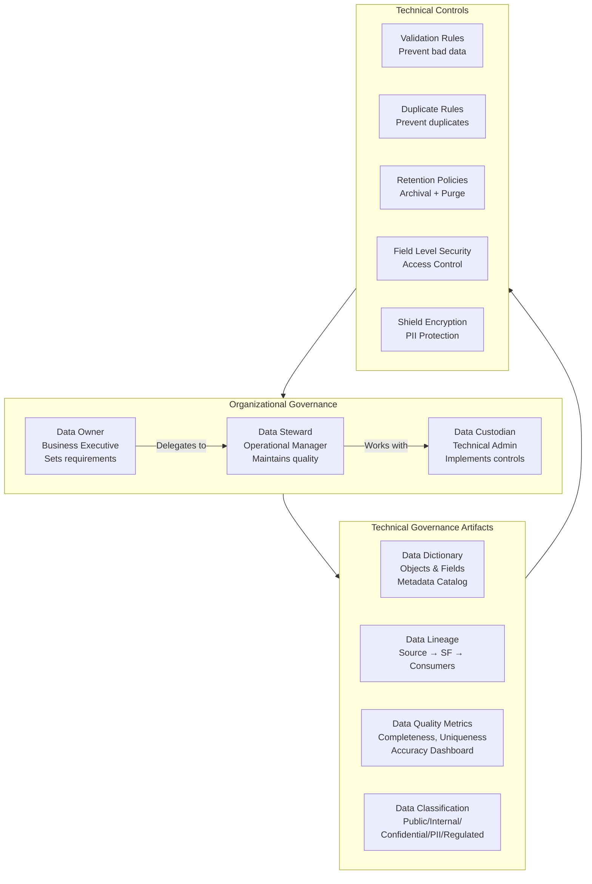

# Data Governance Framework

## Exam Domain
Data Governance — 15% of exam weight

## Foundations

**What is data governance?** Data governance is the set of policies, processes, standards, and organizational roles that define how data is collected, stored, managed, accessed, and used across an organization. It is not a technology — it is an organizational capability that technology enables.

**Why governance fails without architecture**: Many organizations treat data governance as a policy document and a steering committee. They define standards but have no technical enforcement. Within months, the standards are ignored. Effective data governance requires technical controls built into the data architecture:
- Validation rules that enforce data standards at entry
- Metadata (data dictionary) that documents what fields mean
- Stewardship workflows that route quality issues to accountable owners
- Access controls that prevent unauthorized changes to governed data

**The architect's role**: Not to govern data (that's a business role) but to build the technical infrastructure that makes governance possible and enforceable. An architect who ignores governance is building a system that will decay.

---

## Core Concepts

### The Data Governance Framework Components

**1. Data Policies**
High-level statements of intent: "Customer data will be updated within 30 days of a change notification." Policies are owned by business executives and enforced through standards and procedures.

**2. Data Standards**
Specific rules derived from policies: field naming conventions, accepted value sets, required fields per object, data format specifications (phone format: +1-555-555-5555), retention periods by data type.

**3. Data Dictionary**
A catalog of all data assets (objects, fields, datasets) with:
- Technical name and label
- Data type and length
- Business definition
- Valid values (if picklist)
- Field owner / data steward
- Source system and migration history
- PII / sensitivity classification
- Retention policy
- Integration dependencies (which systems use this field)

**4. Data Stewardship**
Operational roles responsible for maintaining data quality within a domain:
- **Data Owner**: Business executive; sets data quality requirements; approves policies
- **Data Steward**: Day-to-day quality manager; reviews exceptions; performs corrections
- **Data Custodian**: Technical role; implements controls; manages infrastructure

**5. Data Quality Rules**
Technical controls that enforce standards. In Salesforce:
- Validation rules (prevent bad data at entry)
- Duplicate rules (prevent duplicate records)
- Required fields (enforce completeness)
- Picklist restrictions (enforce controlled vocabulary)
- Cross-object validation (enforce referential integrity)

**6. Data Quality Metrics**
Quantitative measures of data health:
- Completeness: % of records with required fields populated
- Uniqueness: % of records without duplicates
- Accuracy: % of records passing accuracy checks (e.g., valid email format)
- Timeliness: % of records updated within the defined freshness window

**7. Data Lineage**
Documentation of where data comes from, how it is transformed, and where it goes. Essential for:
- Impact analysis (what breaks if this field changes?)
- Regulatory compliance (where did this personal data come from?)
- AI model governance (what training data was used and is it trustworthy?)

### Implementing Data Governance in Salesforce

**Metadata Dictionary as a Salesforce App**:
Many enterprises build their data dictionary directly in Salesforce using custom objects:
- `Data_Object__c`: one record per Salesforce object
- `Data_Field__c`: one record per field, child of Data_Object__c
- Fields: Business Name, Technical Name, Description, Data Owner (User lookup), PII Flag, Retention Period, Source System, etc.

This makes the data dictionary available to everyone in Salesforce and can be updated by data stewards directly. Connect it to the setup metadata using Apex or a third-party tool (Salesforce Documenter, Metazoa, Element.io).

**Stewardship Workflow**:
1. Detect quality issue (duplicate, missing field, invalid value)
2. Create a Data Quality Exception record (custom object)
3. Route to the responsible data steward via assignment rules or queue
4. Steward reviews and corrects (or escalates)
5. Track resolution time against SLA
6. Escalate unresolved exceptions to data owner after SLA breach

**Governance by Record Type**: Use Record Types to enforce different governance standards per business unit or data segment. The Marketing team's Account data may have different required fields than the Enterprise Sales team's Account data.

### Data Classification and Sensitivity Tiers

Classify all fields and objects by data sensitivity:

| Tier | Description | Examples | Controls |
|---|---|---|---|
| Public | Available externally | Product names, public pricing | Standard OWD |
| Internal | Available to all employees | Employee names, org structure | Login required |
| Confidential | Limited distribution | Customer contracts, financial data | Restricted profiles + Field-Level Security |
| Restricted / PII | Personal identifying data | SSN, DOB, health data | Shield Encryption + strict FLS |
| Regulated | Subject to legal retention | HIPAA, FINRA records | Compliance controls + retention policy |

This classification drives:
- Field-Level Security (FLS) settings
- Shield Platform Encryption decisions
- Data Export and integration authorization
- Retention policy design

### Data Retention and Purge Policy

A retention policy defines:
- **Retention period**: How long each type of record is kept in active Salesforce (e.g., Opportunities: 7 years after close)
- **Archive criteria**: When records move to warm/cold storage
- **Purge criteria**: When records are permanently deleted
- **Legal hold override**: Records subject to litigation hold are exempt from normal purge schedules
- **Regulatory overrides**: FINRA records = 7 years minimum; HIPAA PHI = 6 years minimum

The architect must design purge processes that:
1. Check legal hold before any deletion
2. Verify data has been archived before deletion from active storage
3. Log the purge action for audit purposes
4. Handle child records appropriately

### Change Control for Schema Governance

Schema changes (new objects, new fields, relationship changes) should go through a formal change control process:
1. **Request**: Field/object request submitted (with business justification, owner, data classification)
2. **Review**: Architecture review against naming conventions, field type selection, index implications
3. **Approval**: Data governance board approves; duplicate fields, naming violations rejected
4. **Implementation**: Changes deployed via metadata (DX/change sets), not manual org changes
5. **Documentation**: Data dictionary updated immediately upon deployment

Without change control, schemas accumulate unused fields, duplicate concepts, and technical debt that is very expensive to clean up.

---

## PTA / SA Relevance

### When This Comes Up in Engagements

**Data governance advisory**: One of the most valuable, non-technical advisory activities a PTA can provide. Customers know they have a data problem. They don't know how to organize governance. Walking them through the framework (policies → standards → stewardship → metrics) gives them a roadmap.

**Pre-AI activation**: Before enabling Einstein features or Data Cloud, customers need a data governance baseline. AI quality depends on data quality. A data governance readiness assessment is a standard advisory deliverable.

**Audit preparation**: Customers facing compliance audits (SOX, HIPAA, GDPR) need to demonstrate data governance controls. Having this framework in Salesforce architecture enables a confident audit response.

**Customer health assessments**: In renewal or expansion conversations, data governance gaps are a risk indicator. A customer with no data dictionary, no stewardship, and degraded data quality is at risk for churn. Proactively offering a governance remediation engagement addresses the risk.

### Common Implementation Failures

1. **Governance without stewardship**: The architecture team builds a beautiful data dictionary and quality metrics dashboard. But there is no data steward assigned. No one reviews exceptions. No one updates the dictionary. Six months later, everything is stale. Governance requires people, not just technology.

2. **Schema changes bypassing change control**: A developer adds a field directly in production "quickly." The field is not in the data dictionary. It has no owner. It has no retention policy. Three years later, no one knows what it does or if it can be deleted. Enforce change control via org policies and automation (ideally, schema changes go through source control and automated deployment — no direct production metadata edits).

3. **Data classification done post-implementation**: A team builds a Salesforce org for 2 years before someone asks "which fields contain PII?" They discover SSNs stored in plain text in a custom text field. GDPR compliance is now a crisis, not a design decision. PII classification must be done before fields are created.

4. **Retention policy without process**: A retention policy document is written and filed. No one implements the actual archival or purge processes. Salesforce storage fills up and costs escalate. Policy without process execution is just a document.

5. **Governance overhead kills agility**: An architecture review board that takes 3 weeks to approve a new field is worse than no governance. Balance rigor with speed — fast-track approvals for low-risk changes, detailed review for high-risk changes (new objects, changes to PII-classified fields, deletions).

### Enterprise Architecture Patterns

**Governance Operating Model**: Three tiers of governance rigor:
- **Fast Track** (< 1 business day): New custom fields on non-PII objects, picklist values, formula fields. Reviewed by Data Custodian only.
- **Standard Track** (3–5 business days): New custom objects, lookups to existing objects, changes to existing field types. Reviewed by Data Steward and Custodian.
- **Full Board Review** (2 weeks): New object models, PII-classified field additions, deletion of existing objects/fields, schema changes affecting integrations. Full Data Governance Council review.

**Data Catalog Integration**: Mature enterprises connect Salesforce metadata to an enterprise data catalog (Alation, Collibra, Informatica Axon). The data dictionary is maintained in the enterprise catalog and synchronized to Salesforce documentation. This ensures Salesforce data is part of the enterprise-wide data governance program, not siloed.

---

## Architecture

**Limitations & Tradeoffs:**

- Data governance requires ongoing organizational commitment, not just implementation. Technical controls degrade when not maintained. Stewardship roles are often the first cut in budget reductions — which leads to governance decay.
- The more fields classified as PII and encrypted with Shield, the higher the Salesforce Shield license cost and the more operational complexity for key management.
- Change control rigor vs. development speed: strict governance slows feature development. The governance overhead must be calibrated to organizational risk tolerance.
- Third-party data catalog tools (Collibra, Alation) add significant cost. Evaluate whether the Salesforce-native data dictionary approach (custom objects) is sufficient before purchasing enterprise catalog licenses.

---

## Key Facts to Memorize

- Data Owner: **business executive** — accountable for data quality in a domain
- Data Steward: **operational** — day-to-day quality management
- Data Custodian: **technical** — implements controls and infrastructure
- Data dictionary: catalog with technical name, business definition, **data type, owner, PII flag, retention period**
- Data classification tiers: Public, Internal, Confidential, **Restricted/PII**, Regulated
- Data governance = **policies + standards + stewardship + metrics + technical controls**
- Schema change control: change → review → approve → deploy → **document**
- Retention policy must include: **legal hold override** before any purge
- Governance without stewardship: policies and metrics become **stale and ignored**
- PII classification must happen **before** field creation, not retroactively

---

## Exam Traps

1. **"Who is the data owner?"** — Business executive, not the Salesforce admin. The admin is the data custodian. Steward is the operational role in between.
2. **"Data governance is about technology"** — False. Governance is an organizational capability. Technology enables it but does not replace the people and process components.
3. **"Validation rules enforce governance standards completely"** — False. Validation rules can be bypassed by System Mode automations, Bulk API loads, and SOAP/REST API in some configurations. They are a prevention control, not a complete enforcement mechanism.
4. **"Data dictionary should be built at project close"** — Wrong. Data dictionary should be built at object creation time and maintained throughout the project lifecycle.

---

## Practice Questions

**Q1.** A company is establishing a data governance program for their Salesforce org. They have documented data quality standards but find that the standards are not being followed by development teams. What is the most likely root cause and recommended solution?

A) The standards are too complex — simplify them  
B) Standards without technical enforcement and a change control process will be ignored; implement schema change approval, validation rules, and naming convention enforcement in the deployment pipeline  
C) Hire more developers who understand data governance  
D) Run training sessions on data governance standards

**Answer: B** — Technical controls and process enforcement are what make governance standards stick. Training (D) helps but does not enforce. Standards that rely solely on human compliance are ineffective at scale. Schema change control and technical validation are the architectural answer.

---

**Q2.** A Salesforce admin discovers a custom field `SSN__c` (Social Security Number) stored as an unencrypted Text field on Contact. The org is subject to GDPR and HIPAA requirements. What is the first step the architect should recommend?

A) Encrypt the field using Salesforce Shield Platform Encryption  
B) Delete the field immediately  
C) Classify the field as PII/Regulated and begin a remediation plan that includes encryption, access restriction, and a review of who has access to this data  
D) Move the SSN data to a Big Object for archiving

**Answer: C** — Immediate deletion (B) is not appropriate without understanding whether this data is still needed. Encrypting without first assessing access and policy (A) is incomplete. The correct first step is PII classification and a comprehensive remediation plan that includes: Shield encryption, FLS restriction, access audit, consent review, and integration impact assessment.

---

**Q3.** A Data Governance Council is reviewing a schema change request: a development team wants to add a new custom object `Patient_Record__c` to store HIPAA-regulated health information. What governance considerations should be raised?

A) Custom objects are not subject to governance review  
B) PII/Regulated classification, Shield Platform Encryption requirement, Field-Level Security design, retention policy aligned to HIPAA 6-year minimum, consent management, and integration security review  
C) The object name should follow naming conventions only  
D) The object must have an External ID field for integration

**Answer: B** — A new object for HIPAA-regulated health information triggers the full governance review: data classification (Regulated), encryption requirement (Shield), access control design (FLS + profiles), retention policy (6-year HIPAA minimum), consent (HIPAA consent management), and integration security (who can access this object via API). This is a Full Board Review scenario.
