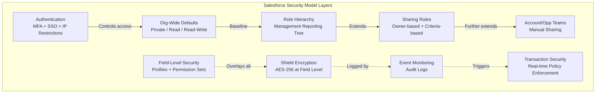

# Security and Data Architecture

## Exam Domain
Data Governance — 15% of exam weight

## Foundations

**Why security is a data architecture concern**: Security is often treated as a separate layer — "we'll add security after we build the data model." This is wrong. Security decisions are baked into the data model from the start:
- The choice of master-detail vs. lookup determines whether a child inherits the parent's OWD
- Which fields are PII determines whether Shield encryption is needed
- Record ownership model determines whether role hierarchy sharing achieves the required visibility
- Whether bulk API users have delete permissions is a schema design decision, not just a profile config

Data architects must design security into the schema — not as an afterthought.

**Salesforce security model hierarchy**:
```
OWD (Org-Wide Defaults) → role hierarchy → Sharing Rules 
→ Manual Sharing → Teams → Profile/Permission Set FLS
```
Each layer can **open** access (make more visible) but cannot **restrict** below OWD. OWD is the baseline ceiling for restriction.

---

## Core Concepts

### Object-Level Security (OLS)

Object-Level Security is controlled by Profiles and Permission Sets:
- **Read**: Can view records of this object type
- **Create**: Can create records
- **Edit**: Can modify existing records
- **Delete**: Can delete records
- **View All**: Can see all records regardless of sharing rules (bypasses OWD + sharing)
- **Modify All**: Can edit and delete all records regardless of sharing

**"View All" and "Modify All"** are the most dangerous permissions for data architecture:
- Any user with View All on Account can see ALL Account records regardless of OWD (Private)
- Assign these permissions sparingly — typically only to admins and data migration profiles
- In data migration profiles, temporarily grant Modify All, then revoke after migration

### Field-Level Security (FLS)

FLS controls which fields a user can see and edit on a record. Set on Profiles and Permission Sets per field per object.

**FLS and data architecture**:
- FLS does not prevent field access via Apex running in System Mode (without `with sharing`) — be aware of this bypass
- FLS is enforced in the UI, standard API calls (REST/SOAP with user context), and reports
- Bulk API can bypass FLS when the user has appropriate permissions — design migration profiles carefully
- Encrypted fields (Shield) have FLS applied to the encrypted value — but decryption is a separate permission

**Sensitive field handling pattern**:
1. Mark PII fields as Shield encrypted
2. Apply strict FLS (visible only to roles that need it)
3. Grant the "View Encrypted Data" permission only to specific Permission Sets
4. Audit access via Event Monitoring

### Salesforce Shield

**Salesforce Shield** is a suite of security features for enterprise compliance:

**1. Shield Platform Encryption (SPE)**
Encrypts data at rest at the field level using AES-256. Key characteristics:
- Customer-managed encryption keys (tenant secrets + Salesforce HSM)
- Works with standard text, email, phone, number, date, textarea fields
- Encrypted fields have functional limitations: cannot be used in SOQL WHERE clauses (encrypted values are not SOQL-searchable in standard mode), cannot be used in formulas, cannot be indexed
- **Deterministic encryption**: An optional mode that allows SOQL filtering on encrypted fields (same plaintext always produces same ciphertext) — at the cost of slightly reduced security vs. probabilistic encryption
- Does NOT encrypt field history, chatter posts, attachments (separate Shield features cover these)

**2. Shield Event Monitoring**
Provides detailed audit logs of all user activity:
- Login history (who logged in, from where, which IP, which browser)
- Record access (who viewed which record and when)
- API calls (what queries were run)
- Report exports (who exported what data and when)
- Field-level access logs

Event Monitoring data is stored in EventLogFile objects, queryable via SOQL. Typically exported to a SIEM (Splunk, Sumo Logic) for analysis.

**3. Shield Transaction Security**
Real-time policy enforcement on events:
- "Block login from unauthorized IP ranges"
- "Require MFA when accessing from new device"
- "Terminate session when user exports more than 2,000 report rows"

Implemented as policies in Setup that trigger on specific events and can block, alert, or log.

### Record-Level Security: Sharing Architecture

**Org-Wide Defaults (OWD)** establish the baseline visibility:
- **Private**: Only the owner (and those above in role hierarchy) can see/edit
- **Public Read Only**: Everyone can see; only owner and above can edit
- **Public Read/Write**: Everyone can see and edit
- **Controlled by Parent**: For master-detail children — inherits OWD from parent

**Role Hierarchy**: Defines a management reporting tree. Records owned by lower roles are visible to users in higher roles (with at least Read on the OWD, or via the sharing model).

**Sharing Rules**: Extend access beyond role hierarchy. Two types:
- **Owner-based**: Share records owned by users in a specific role/group
- **Criteria-based**: Share records matching specific field values (e.g., all Accounts with Industry = 'Healthcare' shared to the Healthcare team group)

**Manual Sharing**: Record-by-record sharing. Not scalable for large volumes. For edge cases.

**Account Teams and Opportunity Teams**: Structured sharing where multiple users collaborate on a single Account or Opportunity, each with defined access levels.

**Territory Management**: An alternative to role hierarchy for sales territory-based sharing. Accounts are assigned to territories; territory hierarchy drives visibility.

### Data Security in Integration Architecture

**API-Level Security Concerns**:
- Integration users should have the minimum permissions needed (principle of least privilege)
- An integration user with "View All" and "Modify All" on Account can read and modify every Account — this is a significant data breach vector
- Named Credentials: securely store integration credentials in Salesforce (not hard-coded in Apex)
- Connected Apps: control which external applications can access Salesforce via OAuth; define IP restrictions, session lengths, and scopes

**Bulk API and Data Security**:
- Bulk API jobs run in the context of the running user — their FLS and sharing rules apply
- However, the `hardDelete` operation requires the "Bulk API Hard Delete" permission — grant carefully
- Data Loader and ETL tools should use a dedicated integration user with only the permissions required for the specific load

**REST/SOAP API Security**:
- All API calls respect the calling user's FLS and sharing rules
- Exception: Apex code running in System Mode (without `with sharing`) bypasses sharing but not FLS in user context
- When in doubt, enforce sharing in Apex: `with sharing` keyword

---

## PTA / SA Relevance

### When This Comes Up in Engagements

**Security architecture reviews**: Every large implementation should include a security architecture review that covers OWD design, sharing model, Shield decisions, and API security. This is a deliverable PTAs should be able to produce.

**CISO and compliance conversations**: When a customer's CISO asks "how do we ensure that customer data is protected?", the answer involves Shield encryption, Event Monitoring, and a data classification-driven security model.

**ISV partner security reviews**: Salesforce requires ISV apps in AppExchange to pass a security review. Understanding Shield, FLS, and API security helps partners navigate the security review requirements.

**Data breach response**: When a customer reports a suspected data breach, the first investigation questions are: who had access to the compromised data? (Event Monitoring) Is the data encrypted at rest? (Shield) When was access granted? (audit logs). Having these controls in place determines how quickly a breach can be investigated and contained.

### Common Implementation Failures

1. **OWD set to Public Read/Write as "easy default"**: Early in a project, OWD is set to Public for speed. The project grows, and now the security model requires Private OWD — but changing OWD after go-live with millions of records requires extensive sharing rule reconfiguration and user acceptance testing. Set OWD correctly at the start; it is much harder to change later.

2. **Integration user with admin-level permissions**: An integration user is granted the System Administrator profile "because it's easier than figuring out the minimum permissions." This user can now read, create, modify, and delete every record in the org — a significant security risk. Always use minimum necessary permissions for integration users.

3. **Shield encryption on every field "for safety"**: A customer encrypts every field with Shield "just in case." Result: no fields are searchable, no formulas work on those fields, and reports on those fields fail. Shield encryption must be applied selectively based on data classification — PII/Regulated fields only.

4. **Deterministic vs. probabilistic encryption confusion**: Using probabilistic encryption on fields that are used in SOQL WHERE clauses causes query failures. If encrypted fields need to be filterable, use deterministic encryption mode. Not understanding this difference causes implementation failures.

5. **Event Monitoring not configured before an incident**: After a data breach, the customer asks "who accessed these records?" Event Monitoring was never enabled. There is no audit trail. The incident cannot be investigated. Event Monitoring should be enabled before any sensitive data is loaded, not after an incident.

### Enterprise Architecture Patterns

**Defense in Depth**: Multiple layers of security controls:
1. Authentication (MFA, SSO)
2. OWD + sharing (record-level access control)
3. FLS (field-level access control)
4. Shield encryption (data-at-rest protection)
5. Event Monitoring (detection and audit)
6. Transaction Security (real-time threat response)

**Least Privilege Integration Profile Design**: For each integration, define a dedicated profile/permission set with only the permissions needed:
- Create only (if the integration only creates records)
- Read only (if the integration only reads)
- Specific objects only (no cross-object permissions not needed by the integration)
- No View All, no Modify All

**Data Residency for Global Compliance**: For global enterprises with data sovereignty requirements (EU data must stay in EU, China data must stay in China), Salesforce Hyperforce allows org data to be hosted in specific geographic regions. This is a data architecture and compliance decision, not just an infrastructure choice.

---

## Architecture



**Limitations & Tradeoffs:**

- Changing OWD after go-live is extremely disruptive — requires sharing rule redesign, user retraining, and can temporarily expose records to unintended users during the transition period.
- Shield encryption functional limitations: encrypted fields cannot be indexed, cannot be used in formula fields, cannot be used in standard SOQL WHERE (except with deterministic encryption). Every field encrypted with Shield narrows what users and automations can do with that data.
- Event Monitoring storage: EventLogFile objects are retained for 1 day (free) or 30 days (Shield). For longer retention, export to an external SIEM.
- Transaction Security has a latency cost: real-time policy evaluation adds overhead to the events it inspects.
- Criteria-based sharing rules: up to 50 per object. At scale, complex sharing designs can hit this limit and require Apex sharing instead.

---

## Key Facts to Memorize

- OWD is the **baseline restriction** — sharing rules can only open, not restrict beyond OWD
- "View All" and "Modify All": bypass OWD and sharing rules — grant **sparingly**
- Shield Platform Encryption: **AES-256**, customer-managed keys, **field-level** encryption
- Shield encrypted fields: **cannot be indexed**, **cannot be used in SOQL WHERE** (standard mode)
- Deterministic encryption: allows SOQL filtering on encrypted fields at **slightly reduced security**
- Event Monitoring: audit of login, record access, API calls, report exports — retained **1 day free, 30 days with Shield**
- Criteria-based sharing rules: max **50 per object**
- Integration users: always use **minimum necessary permissions** (no admin profile)
- Named Credentials: securely store integration credentials — **not in code**
- `with sharing` keyword in Apex: enforces **sharing rules** but not FLS

---

## Exam Traps

1. **"Shield encryption protects data from Salesforce employees"** — Partially true. Salesforce staff cannot access customer data in encrypted fields without the tenant secret (which the customer controls). But this is not the primary security objective on the exam — the exam focuses on functional implications.
2. **"Encrypted fields can be used in SOQL WHERE clauses"** — Only with Deterministic Encryption. Standard (probabilistic) encrypted fields cannot be filtered in SOQL.
3. **"OWD can be set to Private after go-live without impact"** — This has significant impact: existing sharing rules designed for Public OWD no longer provide the same access. Users may suddenly lose visibility to records they previously had access to.
4. **"Apex with sharing enforces FLS"** — False. `with sharing` enforces **sharing rules** (record-level access). It does NOT enforce FLS. FLS is respected by the UI and API automatically but must be explicitly checked in Apex with `Schema.sObjectType.Contact.fields.SSN__c.isAccessible()` if needed.

---

## Practice Questions

**Q1.** A company has a custom object `Medical_Record__c` with a `Patient_SSN__c` text field containing Social Security Numbers. They need to ensure that: (1) the field data is encrypted at rest, (2) only users with a specific Permission Set can read the values, and (3) audit logs are maintained for every access to this field. Which combination of features is required?

A) Shield Platform Encryption + Field-Level Security + Salesforce Shield Event Monitoring  
B) Classic Encryption + Profiles + Login History  
C) Shield Platform Encryption + Profiles + Transaction Security  
D) Field-Level Security + Event Monitoring (no encryption required for text fields)

**Answer: A** — (1) Shield Platform Encryption for field-level encryption at rest; (2) FLS via Permission Set restricts who can view the field (and "View Encrypted Data" permission for decryption); (3) Shield Event Monitoring logs field-level access. Classic Encryption (B) is a less secure legacy option and doesn't provide granular access control. FLS alone (D) does not encrypt data at rest.

---

**Q2.** A new Salesforce integration with an ERP system requires: read access to all Account and Opportunity records, create access to Order__c records only, and no delete permissions on any object. The existing System Administrator profile would provide the required access. What should the architect recommend?

A) Use the System Administrator profile for the integration user — it already has the right access  
B) Create a dedicated Permission Set for the integration with only the specific object permissions required  
C) Use the Standard User profile and manually adjust permissions  
D) Create a new Profile that clones the System Administrator but removes delete permissions

**Answer: B** — Principle of least privilege. Create a dedicated Permission Set (or Profile) with only the required permissions: Read on Account and Opportunity, Create on Order__c. The System Administrator profile (A) gives far more access than needed — View All, Modify All, delete all objects, Apex execution, schema changes, etc. This is a significant security risk.

---

**Q3.** After enabling Shield Platform Encryption on the `Account.Phone` field, a developer reports that a SOQL query `SELECT Id FROM Account WHERE Phone = '555-1234'` is returning zero results even though records with that phone number exist. What is the most likely cause?

A) Shield encryption is not compatible with the Account object  
B) The Phone field requires a custom index before SOQL filtering works  
C) The Phone field is now encrypted with probabilistic encryption — each encryption produces a different ciphertext, so SOQL exact-match filtering cannot find the records  
D) The user does not have "View Encrypted Data" permission

**Answer: C** — Probabilistic encryption (the default Shield mode) generates different ciphertext every time, even for the same plaintext. SOQL cannot match `WHERE Phone = '555-1234'` because the stored ciphertext for that phone number is not comparable via SOQL. The solution is to either use Deterministic Encryption (if searching is required) or use SOSL search (which uses the search index, not direct field comparison). Answer D would make the field unreadable but would not prevent the query from returning records.
