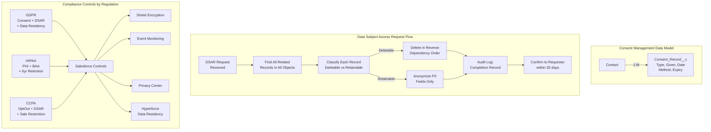

# Compliance and Privacy Architecture

## Exam Domain
Data Governance — 15% of exam weight

## Foundations

**What is privacy compliance in a CRM context?** Privacy regulations like GDPR (EU), CCPA (California), LGPD (Brazil), PIPL (China), and HIPAA (US Healthcare) impose legal obligations on how organizations collect, store, process, and delete personal data. Salesforce, as a CRM containing millions of individual records, is almost always in scope for these regulations.

**The architect's role**: Privacy compliance is not just a legal team concern. Technical implementation of privacy controls is an architecture responsibility:
- Where is personal data stored? (data mapping)
- Can we find all data about a specific person? (data subject access request)
- Can we delete all data about a specific person? (right to erasure)
- Do we have consent records for how we're using this data?
- Where does data flow outside Salesforce? (data transfer compliance)

An architect who has not designed for these requirements will find that compliance becomes a crisis instead of a built-in capability.

---

## Core Concepts

### GDPR Key Requirements for Salesforce Architects

**Lawful Basis for Processing**: Every use of personal data must have a documented legal basis. In CRM context:
- Legitimate interest (sales/marketing CRM data)
- Consent (email marketing, cookies)
- Contract performance (service delivery)
- Legal obligation (invoicing, tax records)

**Individual Rights Under GDPR**:
- **Right of Access (Article 15)**: Individual can request all data held about them
- **Right to Rectification (Article 16)**: Incorrect data must be corrected
- **Right to Erasure / Right to Be Forgotten (Article 17)**: Data deleted on request (unless overridden by legitimate retention requirement)
- **Right to Restriction (Article 18)**: Processing limited while a dispute is resolved
- **Right to Portability (Article 20)**: Data provided in machine-readable format
- **Right to Object (Article 21)**: Opt out of certain types of processing

**Data Subject Access Request (DSAR)**: Formal request by an individual to exercise their rights. Must be fulfilled within 30 days (GDPR) or 45 days (CCPA). Architects must design the technical capability to respond.

### Consent Management Architecture in Salesforce

Consent management in Salesforce typically involves:

**Standard Fields**:
- `Contact.HasOptedOutOfEmail` — email marketing opt-out
- `Contact.DoNotCall` — phone marketing opt-out
- `Lead.HasOptedOutOfEmail`
- `Lead.DoNotCall`

**Custom Consent Object**: For complex consent management (GDPR-level detail):
```
Contact__c (1) ← (M) Consent_Record__c
  Fields:
  - Consent_Type__c (picklist: Email Marketing, SMS, Analytics, Profiling)
  - Consent_Given__c (checkbox)
  - Consent_Date__c (datetime)
  - Consent_Method__c (web form, phone, in-person)
  - Consent_Expiry__c (date)
  - Consent_Version__c (which version of T&Cs)
  - Withdrawal_Date__c (when consent was withdrawn)
  - Withdrawal_Reason__c
```

This model gives a complete audit trail of consent history for each contact.

**Salesforce Privacy Center**: A Salesforce-provided compliance solution that enables:
- Data Subject Access Requests (locate all data about an individual)
- Right to Erasure processing (anonymize or delete individual's data)
- Consent tracking and management
- Data residency policy configuration

Privacy Center is available as an add-on product. For orgs without it, custom Apex/Flow-based DSAR handling must be designed.

### Right to Erasure: Technical Architecture

**The challenge**: A single Contact record may have related data across dozens of objects (Tasks, Events, Cases, Custom Objects, Big Objects, email logs, etc.). "Deleting" a Contact for GDPR purposes means:
1. Finding all records across all objects that reference this Contact
2. Determining which can be deleted and which must be retained (with personal data anonymized)
3. Deleting or anonymizing in the correct sequence (children before parents)
4. Confirming completion for audit purposes

**Anonymization vs. Deletion**:
- Some records cannot be deleted due to business or legal retention requirements (e.g., an invoice related to the contact must be retained for 7 years for tax purposes)
- For these records, **anonymize** the personal data: replace Name with "Deleted User", replace Email with null, replace Phone with null, replace SSN with null
- The record exists for business/compliance purposes but no longer contains personal identifiers

**Erasure process design**:
```
1. Receive DSAR erasure request
2. Query all objects for records related to the Contact/Individual
3. Check legal hold status for each record
4. For deletable records: delete in reverse dependency order
5. For retainable records: anonymize PII fields
6. Delete or anonymize the Contact record itself
7. Delete consent records (or retain for audit of the erasure itself)
8. Log the completion of erasure for audit purposes
9. Confirm completion to requestor within 30-day window
```

### HIPAA Architecture in Salesforce

HIPAA (Health Insurance Portability and Accountability Act) governs Protected Health Information (PHI). If a Salesforce org contains PHI:
- Salesforce must sign a **Business Associate Agreement (BAA)** with the customer
- PHI fields must be encrypted (Shield Platform Encryption)
- Access to PHI must be logged (Shield Event Monitoring)
- Minimum necessary access principle must be enforced (FLS, sharing rules)
- PHI must be retained for at least **6 years** (minimum; may be longer per state law)
- Breach notification: if PHI is compromised, HIPAA requires notification within 60 days

**Health Cloud**: Salesforce's HIPAA-eligible platform. Includes pre-built data models for patient data, PHI data masking, and compliance controls designed for healthcare use cases.

### Data Residency and Cross-Border Transfer

**Data Residency**: Some countries require that personal data of their residents must remain within the country's geographic borders (e.g., Russia, China, some EU interpretations).

**Salesforce Hyperforce**: Salesforce's re-architected infrastructure that allows deployment in specific AWS regions. Customers on Hyperforce can request that org data is stored in a specific geographic region (EU, US, India, etc.).

**Cross-border data transfer (GDPR)**:
- Data may not be transferred from the EU to countries without "adequate protection" without appropriate safeguards
- Salesforce provides **Standard Contractual Clauses (SCCs)** as the legal mechanism for EU-to-US data transfers
- Architects must understand which integrations and data flows move personal data across borders and ensure appropriate legal mechanisms are in place

### Data Retention Architecture

**Retention Policy Components**:
1. Retention schedule (how long each data type is kept, by regulatory requirement)
2. Retention execution (technical process to archive or delete aged records)
3. Legal hold system (flag records exempt from normal purge)
4. Audit trail (evidence of what was deleted and when)

**Common Retention Requirements**:
| Regulation | Data Type | Minimum Retention |
|---|---|---|
| HIPAA | PHI | 6 years |
| FINRA (US securities) | Trade records | 7 years |
| SOX (public companies) | Financial records | 7 years |
| GDPR | Personal data | No minimum — delete when no longer needed |
| Employment law (varies) | Employee records | 3–7 years |

These requirements directly drive the archiving strategy (Lecture 08) and data governance framework (Lecture 15).

### Privacy by Design Principles

Privacy by Design (PbD) — originally formulated by Ann Cavoukian — is now required by GDPR. Seven principles relevant to Salesforce architecture:

1. **Proactive not reactive**: Build privacy controls before implementation, not after a breach
2. **Privacy as the default**: Default settings should be the most privacy-protective
3. **Embedded into design**: Privacy controls are part of the schema and data model
4. **Full functionality**: Privacy should not compromise functionality
5. **End-to-end security**: Security from data collection to deletion
6. **Visibility and transparency**: Users and regulators can audit privacy controls
7. **Respect for user privacy**: Individual rights are technically actionable

---

## PTA / SA Relevance

### When This Comes Up in Engagements

**Every financial services, healthcare, and global enterprise deal**: Privacy compliance is top of mind in regulated industries. Being able to articulate how Salesforce supports GDPR, HIPAA, and CCPA requirements is a competitive differentiator.

**Data Cloud and AI discussions**: Data Cloud's identity resolution and AI features process personal data at scale. Privacy compliance questions are always part of these conversations. The answers involve consent management, data residency, and purpose limitation.

**Health Cloud and Financial Services Cloud**: Salesforce's industry clouds are built on top of privacy and compliance requirements. Understanding the compliance architecture gives you fluency in these verticals.

**International expansions**: When a customer is expanding from the US into the EU or other jurisdictions, privacy compliance is a critical element of the expansion architecture. This drives data residency, consent management, and cross-border transfer design decisions.

### Common Implementation Failures

1. **DSAR response not designed**: A customer receives a GDPR data subject access request. There is no technical process to find all data about the individual across all objects. The team manually searches for 3 days and misses records in several custom objects. The response is late (GDPR requires 30 days) and incomplete. Design DSAR response automation at build time.

2. **Consent without withdrawal process**: Consent fields are designed with `Consent_Given__c = true/false`. But there is no process to handle withdrawal — no consent withdrawal date, no downstream suppression of communications. A marketing team continues to email opted-out contacts because the suppression logic wasn't built.

3. **Anonymization that leaves PII in logs**: A Right to Erasure process deletes the Contact record but leaves the contact's email address in Apex debug logs, Email Log related records, and field history entries. These are often overlooked as personal data stores.

4. **BAA not signed before PHI enters Salesforce**: A healthcare customer loads patient data into a Salesforce org before the Business Associate Agreement is executed with Salesforce. This is a HIPAA violation. BAA must be in place before any PHI is processed in Salesforce.

5. **Data residency assumption without Hyperforce**: A customer assumes that because they are a US company using a US Salesforce data center, all their EU customer data stays in the US (which actually violates GDPR requirements for some transfer scenarios). The data residency assumption must be verified, not assumed.

### Enterprise Architecture Patterns

**Privacy Impact Assessment (PIA)**: Before adding a new data element or integration that processes personal data, conduct a Privacy Impact Assessment: What personal data is collected? What is the legal basis? How is it protected? How long is it retained? Where does it flow? This is a governance gate before implementation.

**Consent Preference Center**: A self-service interface (Experience Cloud site or external) where individuals can view and update their consent preferences. Changes update the Salesforce consent records in real time. This is required for GDPR compliance and is best practice for CCPA.

**Privacy Automation**: Build a Flow or Apex process that, when triggered by a DSAR request, automatically: queries all related objects, generates a data export (for right of access), or initiates the anonymization process (for right to erasure). Privacy Center provides this out of the box for licensed customers; custom orgs need to build it.

---

## Architecture



**Limitations & Tradeoffs:**

- Salesforce Privacy Center is a licensed add-on. Orgs without it must build custom DSAR processes, which require significant development investment.
- Right to Erasure is technically complex — personal data often appears in unexpected places (email logs, Chatter posts, debug logs, field history). A thorough erasure process requires a comprehensive data map.
- Anonymization vs. deletion trade-off: deleting records may break reporting history and referential integrity. Anonymization preserves records but may still expose some patterns. The legal team must define the minimum acceptable standard.
- Data residency via Hyperforce: not all Salesforce products are Hyperforce-enabled for all regions. Verify specific product support for the required region before committing to a data residency architecture.
- Consent record design: over-engineering consent (too many consent types, too many fields) creates stewardship overhead. Under-engineering misses compliance requirements. Balance detail against operational feasibility.

---

## Key Facts to Memorize

- GDPR Right to Erasure response SLA: **30 days**
- CCPA response SLA: **45 days**
- HIPAA minimum PHI retention: **6 years**
- HIPAA breach notification requirement: **60 days**
- Salesforce BAA: must be signed **before** any PHI is processed in Salesforce
- `HasOptedOutOfEmail` and `DoNotCall`: **standard Salesforce consent fields** on Contact and Lead
- Salesforce Privacy Center: handles **DSAR, Right to Erasure, Consent Management** — licensed add-on
- Hyperforce: allows **data residency** in specific geographic regions
- Anonymization: replace PII values with null/generic placeholder — **record stays, PII is removed**
- Standard Contractual Clauses (SCCs): legal mechanism for **EU-to-US data transfers**

---

## Exam Traps

1. **"Deleting a Contact fulfills GDPR Right to Erasure"** — False. Related records (Activities, Cases, Custom Objects) still contain personal data. Complete erasure requires handling all related records.
2. **"HIPAA requires data deletion after 6 years"** — False. HIPAA requires data retention for AT LEAST 6 years (minimum). Some state laws require longer. Do not delete before the minimum.
3. **"Salesforce is HIPAA-compliant by default"** — False. Salesforce can be used for HIPAA-compliant implementations, but this requires a BAA, Shield encryption, Event Monitoring, and specific configuration. Default Salesforce is not automatically HIPAA-compliant.
4. **"Consent can be managed with just the HasOptedOutOfEmail field"** — Sufficient only for simple email opt-out. GDPR requires granular consent by purpose (email, phone, analytics, profiling) with dates, methods, and withdrawal history. Complex consent requires the custom consent object pattern.

---

## Practice Questions

**Q1.** A healthcare organization wants to store Patient Health Information (PHI) in Salesforce Health Cloud. What must be in place BEFORE PHI data is loaded?

A) Shield Platform Encryption must be configured  
B) A Business Associate Agreement (BAA) must be signed between the organization and Salesforce  
C) Salesforce Event Monitoring must be enabled  
D) The org must be on Hyperforce

**Answer: B** — The BAA is the legal prerequisite for processing PHI in Salesforce. Without a BAA, loading PHI is a HIPAA violation. Shield encryption (A) and Event Monitoring (C) are technical controls that should also be in place, but the BAA is the first requirement. Hyperforce (D) addresses data residency — not required for HIPAA compliance specifically.

---

**Q2.** A European contact submits a GDPR Right to Erasure request. The company is legally required to retain their purchase history for 7 years for tax compliance. What is the correct approach?

A) Delete all records including purchase history — GDPR overrides tax law  
B) Reject the erasure request entirely — tax law means no data can be deleted  
C) Anonymize personal identifiers in the purchase history records while deleting the Contact record and other records without a legal retention basis  
D) Archive all records to a Big Object, which satisfies the erasure requirement

**Answer: C** — GDPR allows retention of personal data when there is a legal obligation (tax law). However, only the minimum data required for the legal obligation should be retained. Purchase history records should have PII fields anonymized (name, email, phone replaced with null/placeholder) while the financial transaction data is retained. The Contact record itself (with no retention legal basis) is deleted.

---

**Q3.** A company processes personal data of EU residents from a US-based Salesforce org. Under GDPR, what legal mechanism enables this cross-border data transfer?

A) A Salesforce Data Processing Addendum (DPA) between Salesforce and the customer  
B) Standard Contractual Clauses (SCCs) incorporated into the Salesforce Data Processing Addendum  
C) Shield Platform Encryption makes cross-border transfer GDPR compliant  
D) Hyperforce must be used to host EU data in the EU — cross-border transfer is not permitted

**Answer: B** — Salesforce incorporates Standard Contractual Clauses (SCCs) in its Data Processing Addendum. SCCs are the approved legal mechanism for transferring personal data from the EU to countries (like the US) without an EU adequacy decision. Shield encryption (C) protects data at rest but does not address the legal basis for cross-border transfer. Answer D is incorrect — Hyperforce provides an alternative (keep data in EU) but is not the only option.
