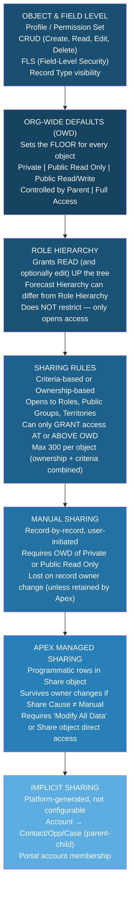
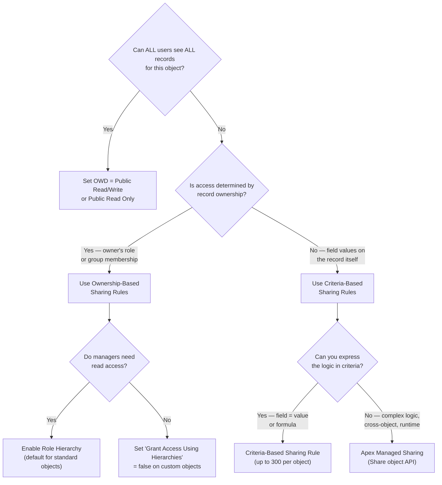

# Salesforce Certified Sharing & Visibility Designer (CRT-403) — Exam Reference

## Exam Facts

- **Exam Code:** CRT-403
- **Questions:** 60 multiple choice + multiple select (scored); up to 5 unscored pilot questions
- **Time:** 105 minutes
- **Passing Score:** 58% (~35/60 scored questions)
- **Cost:** $200 USD (retake: $100)
- **Format:** Multiple choice and multiple select
- **Delivery:** Online proctored or testing center
- **Credential role:** Contributes to **Application Architect**, **System Architect**, and **CTA** credential paths

---

## Exam Domain Weights

| Domain | Weight | Focus |
|--------|--------|-------|
| Record-Level Access | 35% | OWD, Role Hierarchy, Sharing Rules, Manual Sharing, Apex Sharing, Implicit Sharing |
| Object & Field Access | 20% | Profiles, Permission Sets, FLS, CRUD, Record Types |
| Communities / Experience Cloud | 15% | Sharing Sets, External OWD, Guest User, Super User Access |
| Performance & Scalability | 15% | Sharing skew types, LDV, async recalculation, deferring sharing |
| Auditing & Monitoring | 15% | Field History, Setup Audit Trail, Event Monitoring, Shield |

**Where to invest study time:**
Record-Level Access (35%) is the exam's backbone. If you master that domain cold, you need roughly 40% from the remaining four domains to pass. Communities and Performance are the hardest conceptually for practitioners who haven't hit them in production.

---

## PTA / SA Relevance

As a Partner Technical Architect, the Sharing & Visibility Designer exam codifies the most consequential architectural decisions on any Salesforce implementation. Sharing model design is irreversible in production without significant rework — it's the one place you cannot "refactor in Sprint 3."

### When This Comes Up in Engagements
- **Discovery:** Every enterprise org has sharing complexity. Ask "how many sharing rules do you have?" and "have you ever hit a governor limit related to sharing?" as early red-flag signals.
- **Architecture reviews (CTA boards, peer reviews):** Expect at least one scenario where you must choose between OWD strategies and justify the tradeoffs.
- **Customer advisory:** Customers routinely over-share (too many Public Read/Write OWDs) or under-share (Private + hundreds of manual sharing rules). Both patterns cause pain — one via compliance risk, the other via support load.
- **ISV partner assessments:** AppExchange security reviews care deeply about sharing: are you using `with sharing` or `without sharing` in your Apex? Are you leaking data via guest user access?

### Common Architecture Failures
- Setting Account OWD to Public Read/Write because "everyone needs to see everything" — then discovering you have HIPAA/GDPR requirements 18 months later.
- 300+ sharing rules on a single object (approaches the 300-rule limit) created iteratively over years with no governance.
- Ownership skew: a single integration user owns 2 million records, causing every sharing recalculation to hammer that user's sharing group.
- Communities deployed without auditing guest user OWD — creating anonymous read access to internal records.

### Enterprise Patterns
- Private OWD as the default for all custom objects unless there's a compelling reason to open it. Easier to expand access than restrict it post-go-live.
- Role hierarchy designed around *data access needs*, not org chart — these are two different things and conflating them is the most common role hierarchy mistake.
- Apex Managed Sharing reserved for logic that cannot be expressed as criteria-based sharing rules — not as a first-choice mechanism.

---

## The Complete Sharing Model Stack

**Critical principle:** Each layer can only GRANT access — nothing in this stack can REVOKE access that was opened by a lower layer (except removing records from ownership that triggered the rule). The OWD is the only setting that restricts.

---

## Decision Framework: Which Sharing Mechanism to Use

---

## Study Plan by Domain Weight

### Priority 1 — Record-Level Access (35%)
- Section 01: OWD, Role Hierarchy, Profiles/Permission Sets
- Section 02: All four sharing mechanisms
- Section 03: Implicit sharing, High-volume patterns

### Priority 2 — Object & Field Access (20%)
- Section 04: FLS, CRUD, Record Types, List Views

### Priority 3 — Communities & Performance & Auditing (15% each)
- Section 03 (Communities): Sharing Sets, External OWD, Guest User
- Section 05: Performance skew types, audit tools

---

## Topic Index

| Section | Topic | Exam Domain |
|---------|-------|-------------|
| 01-01 | Sharing Model Architecture Overview | Record-Level Access |
| 01-02 | OWD Deep Dive | Record-Level Access |
| 01-03 | Role Hierarchy Design | Record-Level Access |
| 01-04 | Profiles & Permission Sets Advanced | Object & Field Access |
| 02-05 | Sharing Rules Deep Dive | Record-Level Access |
| 02-06 | Manual Sharing & Teams | Record-Level Access |
| 02-07 | Apex Managed Sharing | Record-Level Access |
| 02-08 | Implicit Sharing | Record-Level Access |
| 03-09 | Territory Management Sharing | Record-Level Access |
| 03-10 | Communities / Experience Cloud Sharing | Communities |
| 03-11 | High-Volume Sharing | Performance |
| 03-12 | Sharing Architecture Patterns | Record-Level Access |
| 04-13 | FLS & CRUD Design | Object & Field Access |
| 04-14 | Record Types & Visibility | Object & Field Access |
| 04-15 | List Views & Search | Object & Field Access |
| 05-16 | Sharing Performance & Scalability | Performance |
| 05-17 | Sharing Audit & Governance | Auditing |

---

## Key Numbers to Memorize

| Fact | Value |
|------|-------|
| Sharing rules per object (total) | 300 (ownership + criteria combined) |
| Sharing group skew threshold | 10,000+ users in a sharing group |
| Ownership skew threshold | No hard limit, but single owner with millions of records |
| Lookup skew threshold | 10,000+ records with same lookup field value + Private OWD on child |
| Maximum role hierarchy depth (recommended) | 10 levels (platform supports more, but performance degrades) |
| External OWD options | Private, Public Read Only (no Public Read/Write for external) |
| Share object suffix | `__Share` for custom objects; e.g., `MyObject__Share` |
| Apex sharing causes | Must be unique per namespace per Share object |
| Field History tracking fields per object | Up to 20 fields per object |
| Setup Audit Trail retention | 6 months in UI; downloadable for longer |
