# Salesforce Sharing & Visibility Designer — CRT-403 Cheat Sheet

**Exam Code:** CRT-403 | **Questions:** 60 | **Pass Score:** 58% (35/60) | **Time:** 105 min
**Credential path:** Contributes toward App Architect, System Architect, and CTA

---

## Domain Weights

| Domain | Weight |
|---|---|
| Sharing & Visibility Design | 40% |
| Org & License Design (sharing impact) | 20% |
| Data Architecture & Access | 20% |
| Integration Architecture (sharing implications) | 10% |
| Identity & Access Management | 10% |

---

## The Sharing Model Stack

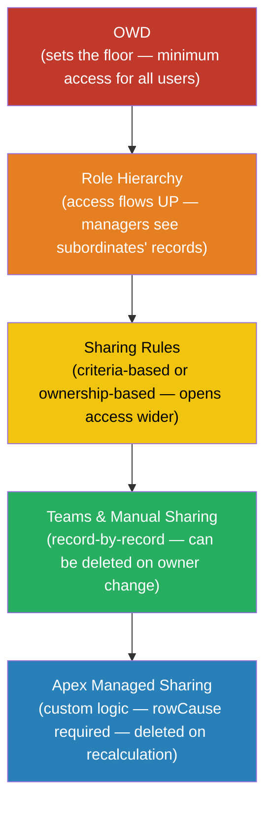

**Critical rule:** You can ONLY open access wider at each layer. Sharing rules CANNOT restrict access below the OWD floor. More permissive always wins.

---

## OWD Options Quick Reference

| OWD Setting | Who Can See Records? | Typical Use Case |
|---|---|---|
| Private | Owner + hierarchy above + explicit sharing | Sensitive data (HR, payroll, finance) |
| Public Read Only | Everyone reads; only owner/hierarchy edits | Reference data, product catalog |
| Public Read/Write | Everyone reads and edits | Highly collaborative data |
| Public Read/Write/Transfer | Everyone reads, edits, and changes owner | Leads (default) |
| Controlled by Parent | Inherits from the master record | Detail side of master-detail relationship |

**External OWD:** A separate OWD setting for Experience Cloud (portal/community) users. Can be set more restrictive than internal OWD to limit external user access without affecting internal users.

**Default OWDs to memorize for the exam:**

| Object | Default Internal OWD |
|---|---|
| Account | Private |
| Contact | Controlled by Parent (when linked to Account) |
| Opportunity | Private |
| Case | Private |
| Lead | Public Read/Write/Transfer |
| Campaign | Public Full Access |
| Custom Objects | Private (configurable) |

---

## Role Hierarchy

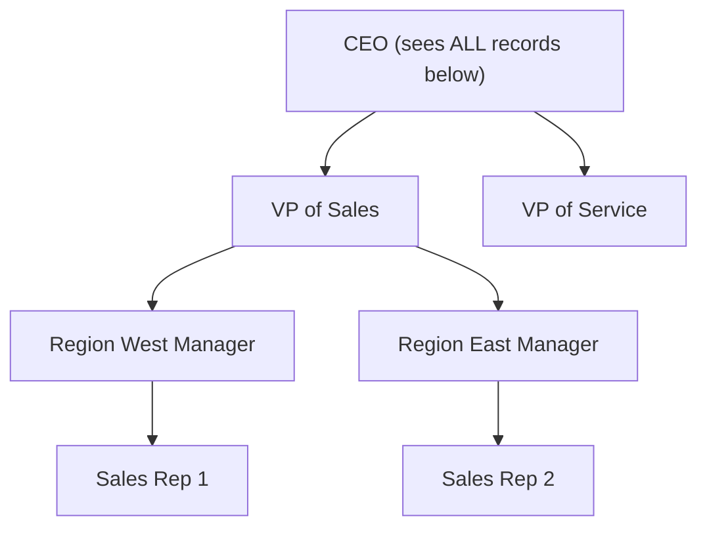

**Rules:**
- Access flows UP only — managers see subordinate records, not the other way down
- Granting access to a Role grants access to ALL roles above that role in the hierarchy
- `RoleAndSubordinates` — includes all users in role and subordinate roles (including portal users)
- `RoleAndSubordinatesInternal` — excludes portal/community users from the sharing group
- "Grant Access Using Hierarchies" checkbox: always enabled for standard objects; configurable OFF on custom objects (to prevent hierarchy-based access)

**Ownership skew:** When one user owns more than 10,000 records, the sharing group for that user becomes very large. Queries for records owned by that user degrade significantly. Fix: reassign records across multiple users or use queues.

---

## Sharing Mechanisms — Full Comparison

| Mechanism | Scope | Automated? | Deleted When? | Complexity | Limits |
|---|---|---|---|---|---|
| OWD | All records globally | Platform | Never | Low | N/A |
| Role Hierarchy | All records per role path | Platform | Never | Low | Max ~10 levels recommended |
| Ownership-Based Sharing Rule | Records owned by a role/group | Auto (async) | Owner changes role/group | Low | 300/object combined |
| Criteria-Based Sharing Rule | Records matching field criteria | Auto (async) | Field value changes | Medium | 300/object combined, 3 criteria |
| Territory Management | Accounts (and child records) by territory | Auto | Territory assignment removed | Medium | Enterprise Edition+ |
| Account Teams | Per Account record | Semi-auto | Owner change (default) | Medium | N/A |
| Opportunity Teams | Per Opportunity record | Semi-auto | Owner change (default) | Medium | N/A |
| Case Teams | Per Case record | Semi-auto | Owner change (default) | Medium | N/A |
| Manual Sharing | Per record | No (manual) | Owner change | High | Performance at scale |
| Apex Managed Sharing | Custom logic via code | Yes (Apex) | Sharing recalculation | High | Apex limits apply |

**Sharing rule limit:** 300 per object total (criteria-based + ownership-based combined)
**Criteria per sharing rule:** Maximum 3 filter criteria

---

## Implicit Sharing (Platform-Managed, Cannot Be Disabled)

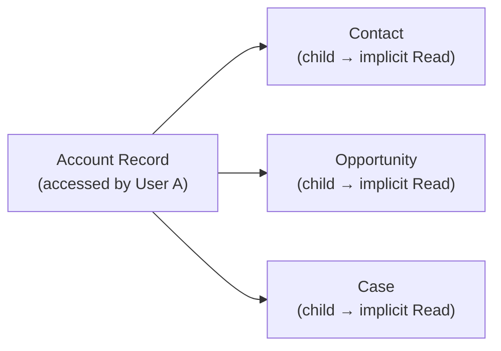

| Parent Object | Child Object | Implicit Access Granted |
|---|---|---|
| Account | Contact | Read access (even if Contact OWD = Private) |
| Account | Opportunity | Read access |
| Account | Case | Read access |
| Portal Account | Portal User | Community user sees their own Account |
| Case | CaseComment | Read/Write if Case is accessible |

**Key fact:** If a user has Read access to an Account, they automatically get Read access to that Account's related Contacts, Opportunities, and Cases — even if those objects have OWD = Private. This CANNOT be turned off.

---

## Apex Managed Sharing — Deep Dive

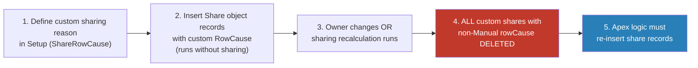

**Share object structure:**

| Field | Description |
|---|---|
| `ParentId` | ID of the record being shared |
| `UserOrGroupId` | ID of the User, Role, or Group receiving access |
| `AccessLevel` | `Read`, `Edit`, or `All` (All = full control) |
| `RowCause` | Reason for sharing — use custom reason, never `Manual` |

**Share object names:** `AccountShare`, `OpportunityShare`, `ContactShare`, `CaseShare`, `[CustomObject__Share]`

**Critical rules:**
- `Manual` rowCause is reserved for Manual Sharing — do NOT use it in Apex or your shares will be deleted on owner change
- Apex code inserting share records must run `without sharing` (or in a context with elevated permissions)
- When sharing recalculation is triggered (admin action or owner change), ALL shares with non-Manual rowCause are wiped — your Apex must re-create them
- Custom sharing reasons are defined under Setup > [Object] > Sharing Reasons

---

## Communities / Experience Cloud Sharing Model

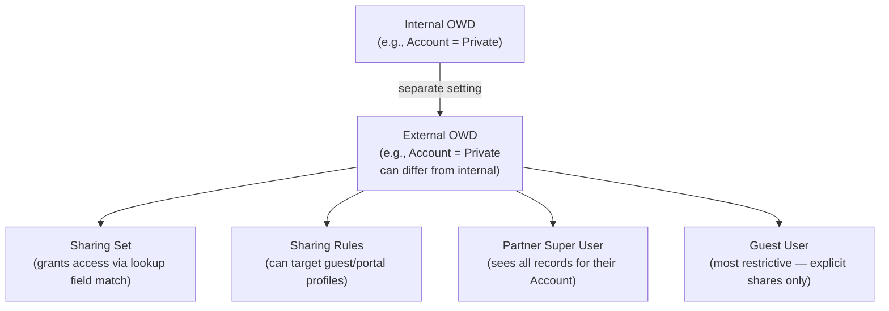

| Mechanism | Description | Use Case |
|---|---|---|
| External OWD | Separate OWD for portal/community users | Restrict external access without affecting internal |
| Sharing Sets | Grant access based on a lookup from the record to the portal user's Account or Contact | Customer portal — cases belong to the portal user's Account |
| Super User Access | Partner users with Manager portal role see all records under their Account | Partner community — account manager sees all partner activity |
| Guest User Sharing | Only records explicitly shared via sharing rules scoped to Guest User | Public-facing pages |

**Sharing Sets** — key facts:
- Available for Customer Community and Customer Community Plus licenses
- Grant access to records via a lookup chain (e.g., Case.AccountId = User.AccountId)
- Do not count against sharing rule limits
- Simpler than sharing rules for portal use cases

**Guest User risks:**
- Guest users can access records through public sites — always audit guest user access
- GDPR concern: any unauthenticated person browsing your site may be able to access records shared to the guest user profile

---

## Territory Management

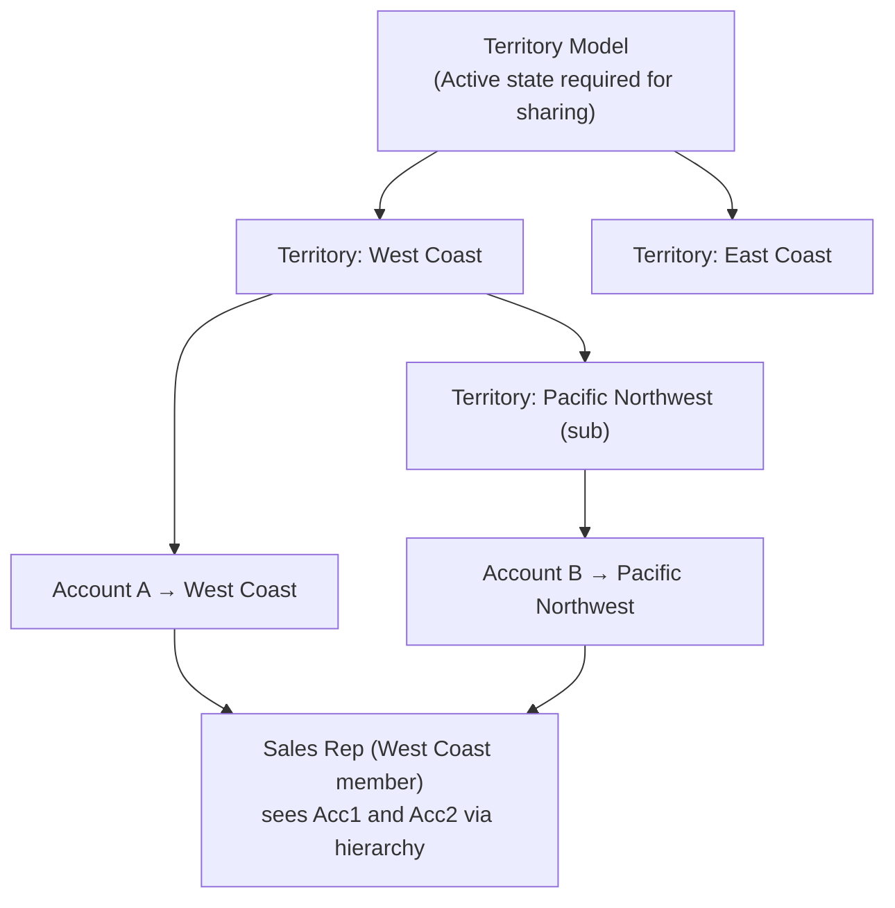

**Key facts:**
- Applies to Accounts and optionally Opportunities and Cases
- Territory hierarchy grants access UP (like role hierarchy)
- Additive with existing sharing model — does NOT replace OWD or role hierarchy
- Multiple territories can be assigned to one Account
- Territory Management 2.0 (TM2) is the current version — legacy TM is deprecated
- Requires Enterprise Edition or higher

---

## Performance & Skew Reference

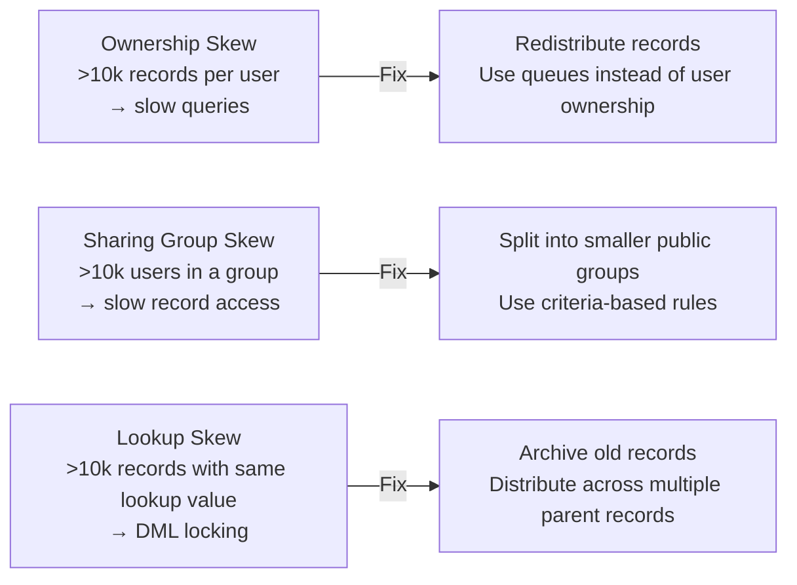

| Problem | Threshold | Symptom | Fix |
|---|---|---|---|
| Ownership Skew | >10,000 records per user | Slow queries, timeout on records owned by that user | Reassign to multiple users or queues |
| Sharing Group Skew | >10,000 users in a sharing group | Slow record-level queries, DML timeout | Split into smaller public groups |
| Lookup Skew | >10,000 records referencing same lookup | DML locking, row-level lock contention | Archive records, distribute parent references |
| ACL (Access Control List) Skew | Extremely large sharing tables | Full-table scan during recalculation | Review and simplify sharing architecture |

---

## Profiles vs. Permission Sets vs. Sharing

| Control | What it governs | Can it RESTRICT sharing? |
|---|---|---|
| Profile | Object-level CRUD, FLS, tab visibility, app access | Yes — a profile can prevent read/edit even if sharing grants it |
| Permission Set | Additional object CRUD, FLS, feature licenses | No — only adds permissions |
| OWD / Sharing Rules | Record-level visibility | OWD sets floor; rules only open wider |
| Field-Level Security (FLS) | Per-field access | Yes — FLS restricts field access regardless of sharing |

**Golden rule:** Profiles and FLS are evaluated BEFORE sharing. Even if sharing grants access to a record, if the Profile says no CRUD or FLS says no field access, the user cannot read/edit that record or field.

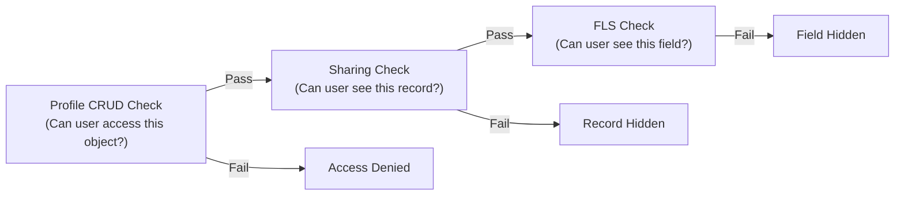

---

## Sharing Architecture Decision Tree

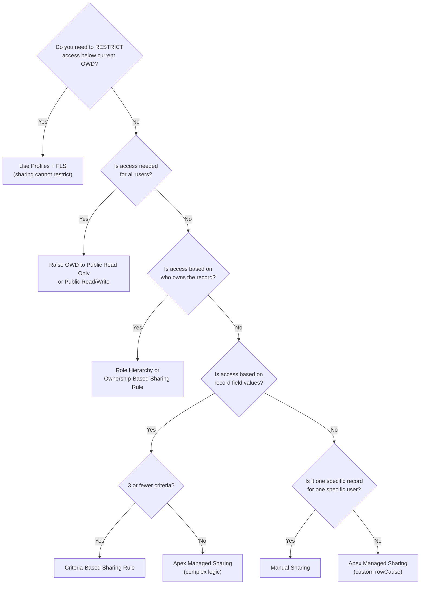

---

## Scenario → Solution Quick Reference

| Scenario | Correct Solution | Why NOT |
|---|---|---|
| Manager needs to see sales rep's records | Role hierarchy — manager above rep | Manual sharing doesn't scale |
| Only Finance role can see salary field | Field-Level Security (FLS) on the salary field | Sharing controls record access, not field access |
| Portal user needs access to their own cases | Sharing Set (Case.AccountId = User.AccountId) | Sharing rules add complexity; sharing sets are simpler |
| Share records where Account Type = Partner AND Tier = Gold (two conditions) | Criteria-based sharing rule (2 criteria) | Apex needed only if more than 3 criteria |
| Complex dynamic sharing (multi-object, 5+ conditions) | Apex Managed Sharing with custom rowCause | Criteria-based rules max at 3 criteria |
| Share one specific Account with one external consultant | Manual sharing | Too costly to build automation for one record |
| All reps in Region West need access to West Accounts | Criteria-based sharing rule (Account.Region = West) | Role hierarchy only works if reps are in the right roles |
| Partner community — account manager sees all their company's records | Super User Access (Partner Communities) | Manual sharing at scale is unmanageable |
| Prevent internal field from being seen in community | Field-Level Security on community profile | Sharing cannot hide fields |
| Org-wide access to a reference picklist object | Raise OWD to Public Read Only | Sharing rules are unnecessary overhead |

---

## Key Limits Summary

| Limit | Value |
|---|---|
| Sharing rules per object | 300 total (criteria-based + ownership-based combined) |
| Criteria per sharing rule | 3 max |
| Role hierarchy depth (recommendation) | 10 levels max |
| Users per sharing group before skew risk | ~10,000 |
| Ownership skew threshold | >10,000 records per single user |
| Sharing recalculation: Apex shares deleted | All non-Manual rowCause shares wiped on recalc |
| Territory models per org | 1 active at a time |
| Max members per Account Team / Opportunity Team | No hard limit; performance degrades at scale |

---

## Top 20 Exam Traps

1. **OWD is the floor** — sharing rules can ONLY open access wider; they CANNOT restrict below OWD
2. **Role hierarchy flows UP** — managers inherit access to subordinates' records, never the reverse
3. **Apex sharing recalculation deletes ALL custom shares** — when recalculation runs, every non-Manual rowCause share is wiped; Apex must re-insert them
4. **Manual sharing is deleted on owner change** — when a record is transferred, manual shares are removed (unlike role hierarchy and sharing rules)
5. **External OWD is separate from Internal OWD** — Experience Cloud users can have stricter access without touching internal settings
6. **Implicit sharing cannot be disabled** — Account → Contact/Opportunity/Case access is always granted by the platform
7. **Criteria-based sharing rule evaluates on creation** — it fires when a record is created, not only when a tracked field changes
8. **Granting access to a Role includes the entire hierarchy above** — sharing to "Region West Manager" also grants to VP Sales, CEO, etc.
9. **"Grant Access Using Hierarchies" is always on for standard objects** — you can only turn it OFF on custom objects
10. **Contact OWD defaults to "Controlled by Parent"** — Contacts inherit access from their parent Account
11. **Opportunity default OWD is Private** — most common scenario on the exam; access is through hierarchy or explicit sharing
12. **Sharing groups include role hierarchy automatically** — don't confuse "sharing to a Role" (includes subordinates and superiors) vs "sharing to a Public Group" (just members + sub-groups)
13. **Super User Access is for Partner Communities only** — it is NOT available in Customer Communities
14. **Sharing Sets do NOT count against sharing rule limits** — they are a different mechanism entirely
15. **Territory Management is additive** — it adds access on top of existing OWD/role hierarchy; it does not override them
16. **FLS and Profiles are evaluated before sharing** — a user with no object Read permission cannot see records even if sharing grants access
17. **`Manual` rowCause in Apex = shares deleted on owner change** — similar to manual sharing behavior; always use a custom rowCause in Apex
18. **Public Groups can contain roles, sub-groups, and individual users** — they're the most flexible grouping mechanism for sharing rules
19. **Ownership skew is per-owner, not per-object** — it's about one user owning a massive concentration of records
20. **Criteria-based sharing rules max at 3 criteria** — for more complex logic, you must use Apex Managed Sharing

---

## Sharing Rule Types — Side-by-Side

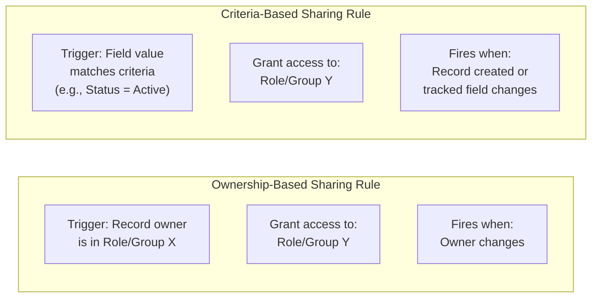

| Dimension | Ownership-Based | Criteria-Based |
|---|---|---|
| Trigger | Owner belongs to a role/group | Field value matches criteria |
| Max criteria | N/A (owner only) | 3 criteria |
| When re-evaluated | Owner change | Record creation or field change |
| Best for | Territory-aligned teams | Field-driven access (status, type, region) |

---

## Public Groups vs. Queues vs. Roles

| Construct | Purpose | Can Own Records? | Used in Sharing Rules? |
|---|---|---|---|
| Role | Hierarchical position; sharing flows up | No | Yes (share to role + subordinates) |
| Public Group | Arbitrary collection of users, roles, sub-groups | No | Yes (most flexible) |
| Queue | Holds unassigned records; members take ownership | Yes | Yes (assign ownership) |
| Permission Set Group | Bundles permission sets | No | No |

---

## Manual Sharing Behavior

- Added via "Sharing" button on a record (if enabled on the object's page layout)
- Access levels: Read Only or Read/Write
- Deleted automatically when the record owner changes — this is a top exam trap
- Can be re-created after ownership transfer by the new owner
- Admin can always manage manual shares
- Does not require any configuration — available on most standard and custom objects

---

## Record Access Evaluation Order (How Salesforce Resolves Access)

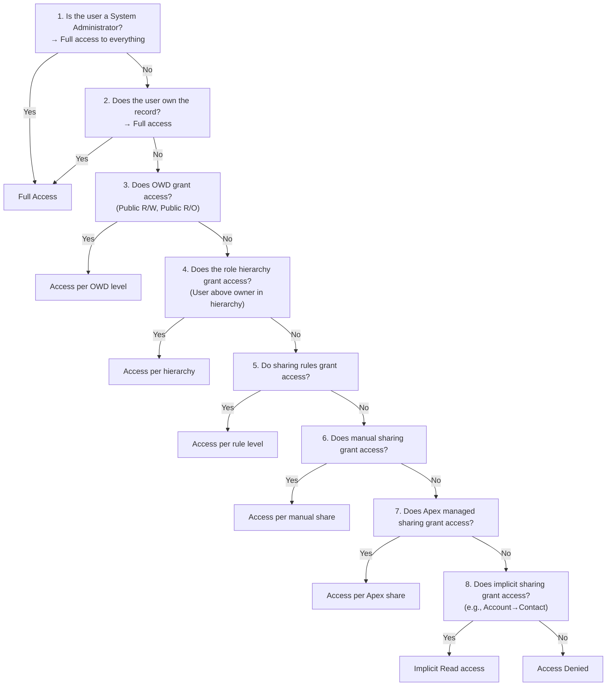

---

## Sharing Recalculation

- Triggered by: OWD changes, sharing rule changes, role hierarchy changes, admin-initiated recalculation
- Asynchronous — runs in background; large orgs can take minutes to hours
- During recalculation: users may temporarily see stale access
- After recalculation: ALL Apex Managed Sharing records with non-Manual rowCause are deleted and must be re-created by the Apex logic
- Admin can manually trigger: Setup > Defer Sharing Calculations > Recalculate

**Defer Sharing Calculations:**
- Allows admins to make multiple sharing changes without triggering recalculation after each
- Recalculation runs once when "Resume" is clicked
- Useful in large orgs to batch sharing model changes

---

## Org-Wide Defaults — What Changes When You Tighten OWD

| If you change OWD from | To | What happens |
|---|---|---|
| Public R/W | Public R/O | Users lose edit access; existing sharing rules still apply |
| Public R/O | Private | Users lose read access; must rely on hierarchy + rules |
| Private | Public R/O | Sharing recalculation runs; all records become readable |

Tightening OWD (making it more restrictive): Requires sharing recalculation — can be a major performance event in large orgs.

---

## License & Edition Constraints That Affect Sharing

| Feature | Minimum Edition | License Notes |
|---|---|---|
| Role Hierarchy | All editions | Available everywhere |
| Sharing Rules | All editions | Available everywhere |
| Apex Managed Sharing | Enterprise+ | Requires Apex code |
| Territory Management 2.0 | Enterprise+ | Add-on for some editions |
| Account Teams | All editions | Configurable in Setup |
| Experience Cloud (Communities) | Developer+ | Requires Community license |
| External OWD | Any with Communities | Requires Experience Cloud enabled |
| Sharing Sets | Enterprise+ (Communities) | Requires Customer Community license |

---

## Final Exam Checklist

Before answering any sharing scenario question, ask:

- [ ] What is the OWD for the object? (Is it Private, Public R/O, or Controlled by Parent?)
- [ ] Is this about restricting access (FLS/Profile) or granting access (sharing)?
- [ ] Is role hierarchy sufficient, or do I need explicit sharing rules?
- [ ] Is the sharing rule criteria 3 or fewer fields? (If more, Apex Managed Sharing)
- [ ] Does owner change matter? (Manual shares + Apex non-Manual rowCause shares are deleted)
- [ ] Is this an Experience Cloud scenario? (External OWD, Sharing Sets, Super User)
- [ ] Is there a skew risk? (>10k records per user, >10k users in a group)
- [ ] Is Territory Management involved? (It adds access, never restricts)
- [ ] Does the answer involve a field value? (That's FLS, not record sharing)
- [ ] Is implicit sharing providing unexpected access? (Account→Contact/Opp/Case is always on)
