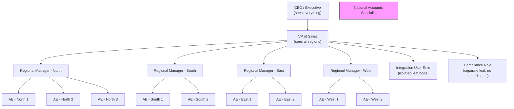

# Lab 01: Complex Multi-Layer Sharing Scenario Design

## Objective

Design and configure a multi-layer Salesforce sharing architecture for a financial services company that satisfies lateral isolation, hierarchical visibility, cross-team access, integration user ownership skew, and partner community requirements — all without using Apex sharing. Understand the decision points that distinguish rule-based sharing from code-driven sharing, and recognize the exam-level traps in each layer.

---

## Prerequisites

- Salesforce org with Sales Cloud (Developer or Sandbox)
- System Administrator profile
- Familiarity with: OWD settings, Role Hierarchy, Sharing Rules, Public Groups
- Understanding of the sharing evaluation order: OWD → Role Hierarchy → Sharing Rules → Manual Shares → Apex Shares

---

## Business Scenario

**Company:** TrustBank Financial Services
**Platform:** Salesforce Sales Cloud
**Scale:** ~500 internal users, 2M+ Account records (majority owned by integration user)

**Requirements:**

| # | Requirement | Type |
|---|---|---|
| R1 | Each Account Executive (AE) sees only their own Accounts | OWD / Role |
| R2 | Regional Managers see all Accounts in their region | Role Hierarchy |
| R3 | A "National Accounts" team (15 users) sees ALL Accounts nationwide | Sharing Rule |
| R4 | Compliance team needs Read-Only on ALL records, no Edit | Sharing Rule |
| R5 | Integration user owns 2M "Prospect" Accounts — invisible to sales users except via explicit share | Ownership / Skew mitigation |
| R6 | Partner Community users see only their own Account + related Contacts/Cases | External OWD |
| R7 | No lateral visibility between regions (North cannot see South, etc.) | Role Hierarchy design |

---

## Part 1: Analyze the Requirements

### 1.1 Determine the Baseline OWD

The most restrictive user group (individual AEs who must see only their own records) drives the OWD decision.

**Decision:** Account OWD = **Private**

With Private OWD:
- Record owners see their own records (R1 satisfied automatically)
- Role Hierarchy grants upward visibility (R2 satisfied by hierarchy design)
- Public Groups + Sharing Rules handle cross-team needs (R3, R4)
- External OWD handles community users (R6)

Do not set OWD to Public Read Only thinking it satisfies R4 — it would break R1 and R7 because all internal users would see all records.

### 1.2 Identify Sharing Mechanisms Needed

| Requirement | Mechanism |
|---|---|
| AE sees own records | OWD = Private (implicit) |
| Manager sees region | Role Hierarchy Grant Access Using Hierarchies = ON |
| National Accounts team | Sharing Rule: Criteria-based or Public Group |
| Compliance (Read-Only all) | Sharing Rule on All Internal Users / Public Group |
| Integration user skew | Role placement + Ownership skew architecture |
| Partner Community | External OWD = Private |
| Lateral isolation | Role Hierarchy shape (flat siblings, not shared parents) |

### 1.3 Lateral Isolation Analysis

This is the most common design mistake. If all four Regional Managers report to a single "VP of Sales" role, then the VP (and anyone above) sees everything — that's correct. But if you accidentally put AEs from different regions under the same parent role, lateral visibility leaks through the role hierarchy.

**Correct:** Each region is a discrete subtree. No AE role is a parent or peer-sibling of another region's AE role in a way that grants cross-region access.

**Incorrect pattern to avoid:** Placing all AEs in a single "AE" role and differentiating regions only by a field. The role hierarchy grants access to everyone above in the tree — not just the direct manager.

---

## Part 2: Design the Sharing Architecture

### 2.1 Role Hierarchy Design



Key design decisions:
- Integration user is on an isolated leaf role with no subordinates. No sales user's role is a parent of Integration User Role, so the hierarchy never grants visibility upward.
- Compliance role is a leaf with no subordinates — compliance users need Read-Only via sharing rule, not via hierarchy.
- National Accounts Specialists are handled via a Public Group + Sharing Rule, not via role hierarchy (which would require placing them above all regions).

### 2.2 Public Groups to Create

| Group Name | Members | Purpose |
|---|---|---|
| National Accounts Specialists | 15 named users | Target of sharing rule granting Read/Write to all Accounts |
| Compliance Team | All compliance users | Target of sharing rule granting Read-Only to all Accounts |
| All Sales Users | All 4 regions combined (role + subordinates) | Used in criteria-based rules if needed |

### 2.3 OWD Settings Summary

| Object | Internal Default | External Default |
|---|---|---|
| Account | Private | Private |
| Contact | Controlled by Parent | Private |
| Case | Private | Private |
| Opportunity | Private | (n/a for partners in this design) |

### 2.4 Sharing Rules Summary

| Rule Name | Type | Shares With | Access Level |
|---|---|---|---|
| National Accounts - All Accounts | Owner-based: All Internal Users | Public Group: National Accounts Specialists | Read/Write |
| Compliance Read-Only | Owner-based: All Internal Users | Public Group: Compliance Team | Read Only |

Note: You cannot use a criteria-based rule to share "all records" — use owner-based with "All Internal Users" as the source.

Note on Compliance: Do not give Edit access to Compliance even if an admin offers it as a "convenience." The requirement is explicit about Read-Only and there is no sharing rule access level of "Read-Only except for fields X and Y" — field-level security handles field restrictions on top of record access.

---

## Part 3: Configure in Salesforce (Step-by-Step)

### Step 1: Set OWD

1. Setup > Sharing Settings
2. Click **Edit** in the Organization-Wide Defaults section
3. Set **Account** default: **Private**
4. Set **Account** external default: **Private**
5. Uncheck "Grant Access Using Hierarchies" ONLY if you specifically need to block upward visibility — for this scenario, leave it checked (managers must see subordinates' records)
6. Click **Save** and wait for the sharing recalculation job to complete

### Step 2: Build the Role Hierarchy

1. Setup > Roles
2. Build the tree as diagrammed in Part 2
3. Create roles in top-down order: CEO > VP of Sales > Regional Managers > AEs
4. Create "Integration User Role" as a child of VP (or a neutral parent — see skew note below)
5. Create "Compliance Role" as a child of VP

Assign users to roles via the role detail page or via user record.

### Step 3: Create Public Groups

1. Setup > Public Groups > New
2. Create **National Accounts Specialists** — add the 15 users by name
3. Create **Compliance Team** — add all compliance users
4. Save both groups

### Step 4: Create Sharing Rules

**Sharing Rule 1 — National Accounts Specialists:**
1. Setup > Sharing Settings > Account Sharing Rules > New
2. Label: `National Accounts - Full Access`
3. Rule Type: **Based on record owner**
4. Share records owned by: **All Internal Users**
5. Share with: **Public Group: National Accounts Specialists**
6. Access Level: **Read/Write**
7. Save

**Sharing Rule 2 — Compliance Read-Only:**
1. Setup > Sharing Settings > Account Sharing Rules > New
2. Label: `Compliance - Read Only All Accounts`
3. Rule Type: **Based on record owner**
4. Share records owned by: **All Internal Users**
5. Share with: **Public Group: Compliance Team**
6. Access Level: **Read Only**
7. Save

### Step 5: Address the Integration User Ownership Skew

**The Problem:**

The integration user owns 2,000,000 Account records. Ownership skew occurs when a single user owns a very large number of records. This causes:
- Sharing recalculation timeouts when the user's role changes or new sharing rules are created
- Lock contention on the AccountShare table during batch operations
- Potential platform governor limit issues during sharing jobs

**The Solution Options:**

**Option A — Isolated Role with No Sharing Rules Targeting Integration User**

Place the integration user in a dedicated role that is NOT covered by broad sharing rules. If the Compliance or National Accounts rules use "All Internal Users" as the source, they will attempt to create share rows for all 2M records — acceptable if the one-time recalculation is tolerable, but ongoing mutations will be expensive.

Better: use a dedicated "Integration" profile or permission set with a custom OWD bypass, and ensure the integration role is excluded from rule sources where possible.

**Option B — Separate the Records, Not Just the User**

Create a separate Account record type "Prospect" for integration-owned records. Use criteria-based sharing rules scoped to RecordType = Standard Account only. Integration-owned Prospects are thus never touched by the broad sharing rules. Sales users who need specific Prospects get them via manual shares or Apex sharing triggered by workflow.

This is the recommended production architecture for ownership skew scenarios.

**Option C — Big Object or External Object for Prospects**

If the 2M Prospects are truly never visible to sales users and are only for nightly batch enrichment, consider whether they belong in Account at all. A Platform Event → Big Object pipeline can stage prospect data without creating AccountShare overhead.

### Step 6: Configure External OWD for Partner Community

1. Setup > Sharing Settings > Edit
2. Set **Account** external OWD: **Private**
3. Set **Contact** external OWD: **Private**
4. Set **Case** external OWD: **Private**
5. Save

For Partner Community users:
- Partner users inherit access to their own Account (the Account they are associated with as a Contact)
- They inherit access to Contacts and Cases "controlled by parent" — if Account OWD external = Private, they see only records where the parent Account is their Account
- Do NOT create broad sharing rules with "All Internal Users" as source if you want to isolate partners — external OWD and the portal user's Account relationship handle isolation

Verify partner users are on a Partner Community license and are associated with a Contact on the Account they should access.

---

## Part 4: Validate & Test

### 4.1 Validation SOQL Queries

**Check record ownership distribution (identify skew):**

```sql
SELECT OwnerId, COUNT(Id) recordCount
FROM Account
GROUP BY OwnerId
ORDER BY COUNT(Id) DESC
LIMIT 10
```

Run this in Developer Console or Workbench. If the integration user's Id appears at the top with millions of records, you have confirmed the skew scenario. Use the OwnerId values to investigate downstream.

**Check existing share rows for a specific Account:**

```sql
SELECT UserOrGroupId, AccessLevel, RowCause
FROM AccountShare
WHERE AccountId = '001XXXXXXXXXXXX'
```

Replace the AccountId with a real record Id. Expected rows after configuration:
- One row with RowCause = `Owner` for the record owner
- One or more rows with RowCause = `SharingRule` for the Compliance and National Accounts sharing rules
- Possibly a row with RowCause = `Role` if role hierarchy grants are materialized explicitly (Salesforce often handles these implicitly)

**Find all users in a specific role:**

```sql
SELECT Id, Name, UserRoleId, UserRole.Name
FROM User
WHERE UserRole.Name = 'AE - North Region'
AND IsActive = TRUE
```

Use this to confirm role assignments before testing sharing. Replace the role name with the exact API name used in your org.

**Verify a user's accessible records (test as a specific user):**

```sql
-- Run in Developer Console using "Use Tooling API" = OFF
-- First, get the user's Id
SELECT Id, Name FROM User WHERE Name = 'Jane Smith'

-- Then, in Execute Anonymous, run:
System.runAs([SELECT Id FROM User WHERE Name = 'Jane Smith' LIMIT 1][0]) {
    List<Account> visible = [SELECT Id, Name, OwnerId FROM Account LIMIT 200];
    System.debug('Jane can see ' + visible.size() + ' accounts');
}
```

**Check AccountShare rows created by a sharing rule:**

```sql
SELECT Id, AccountId, UserOrGroupId, AccountAccessLevel, OpportunityAccessLevel, RowCause
FROM AccountShare
WHERE RowCause = 'SharingRule'
LIMIT 50
```

This confirms the sharing rules are materializing rows in the share table.

### 4.2 Manual Test Checklist

- [ ] Log in as an AE - North. Confirm they see their own Accounts and no other region's Accounts.
- [ ] Log in as Regional Manager - North. Confirm they see all North AE accounts plus their own.
- [ ] Log in as Regional Manager - South. Confirm they do NOT see any North accounts.
- [ ] Log in as a National Accounts Specialist. Confirm they see Accounts from all regions.
- [ ] Log in as a Compliance user. Confirm they see all Accounts but cannot edit (Edit button absent or Save gives insufficient privileges error).
- [ ] Log in as a Partner Community user. Confirm they see only their own Account and its related Contacts/Cases.
- [ ] Confirm the Integration User's 2M Prospect Accounts are NOT visible to North AE login.

### 4.3 Where Apex Sharing Would Be Needed

This scenario is fully handled without Apex for the defined requirements. However, Apex sharing would be required if:

1. **Dynamic criteria based on related object fields** — e.g., "Share Account with all users who are on the Account's active Opportunity team." Sharing rules cannot traverse relationships.
2. **Time-based sharing** — e.g., "Share Account with a user for 30 days, then revoke." No declarative mechanism supports time-boxed sharing.
3. **Sharing based on junction object membership** — e.g., "Share Account with all members of the associated Account Team junction." Standard Account Teams are declarative, but custom team objects require Apex.
4. **Conditional sharing that depends on aggregate data** — e.g., "Share Account if its Opportunity value exceeds $1M." Criteria-based sharing rules support field values on the Account itself but not aggregated child values.

---

## Part 5: Architecture Diagram

```
TrustBank Account Sharing Architecture
=======================================

OWD: Private (Internal) | Private (External)
  |
  +-- Role Hierarchy Grant (upward visibility)
  |     VP of Sales sees: all 4 regions
  |     Regional Manager - North sees: AE-N1, AE-N2, AE-N3 records
  |     AE - North 1 sees: only own records
  |
  +-- Sharing Rule: National Accounts Specialists
  |     Source: All Internal Users
  |     Target: Public Group (15 users)
  |     Level: Read/Write
  |
  +-- Sharing Rule: Compliance Read-Only
  |     Source: All Internal Users
  |     Target: Public Group (compliance users)
  |     Level: Read Only
  |
  +-- Lateral Isolation
  |     North <-/-> South: No shared parent role below VP level
  |     No cross-region sharing rules exist
  |
  +-- Integration User Skew Mitigation
  |     Integration Role: leaf node, no sales user is a parent
  |     Prospect RecordType: excluded from broad sharing rules
  |
  +-- External OWD: Private
        Partner user sees: own Account + controlled-by-parent records
        No sharing rules extend to community users
```

---

## Common Mistakes in This Lab

**Mistake 1: Setting OWD to Public Read Only to satisfy the Compliance requirement.**

Public Read Only makes all internal users able to read all records — that breaks R1 (AEs should see only their own). Use Private OWD + a sharing rule for Compliance.

**Mistake 2: Forgetting that "Grant Access Using Hierarchies" affects ALL objects when turned off.**

You can only toggle Grant Access Using Hierarchies per object for custom objects. For standard objects like Account, it is always on. If a question asks you to prevent a manager from seeing subordinate records on Account, the answer is that you cannot — hierarchy grants on standard objects are permanent. Use a different role structure instead.

**Mistake 3: Creating a sharing rule with source = a specific role.**

Owner-based sharing rules can specify "Records owned by users in Role: X." If you create one for each region for the National Accounts team, you need 4 rules. It is simpler to use "All Internal Users" as the source. Understand the trade-off: "All Internal Users" includes the integration user's 2M records.

**Mistake 4: Assuming External OWD Private prevents portal users from seeing records they own.**

External OWD Private means portal users cannot see records they do not own (unless shared). It does not prevent them from seeing records they DO own. A portal user's Account is always visible to them because they are the owner (or it is the Account they are a Contact on, which Salesforce grants access to automatically for portal users).

**Mistake 5: Placing Integration User in a role that is a parent of any sales role.**

If the Integration User Role is a parent of AE roles, sales users' managers can accidentally see integration-owned Prospect records through the hierarchy. Always make the integration role a leaf or a peer branch completely isolated from sales roles.

**Mistake 6: Expecting sharing rules to fire immediately in production.**

Sharing rules trigger asynchronous recalculation jobs. In a high-volume org, you may need to wait or manually kick off recalculation. Do not assume test failures are configuration errors — check the sharing recalculation job status first.

---

## Exam Connections

| CRT-403 Topic | This Lab Covers |
|---|---|
| OWD decision matrix | Choosing Private based on most restrictive requirement |
| Role Hierarchy design | Lateral isolation, integration user placement, leaf vs. branch roles |
| Sharing rule types | Owner-based vs. criteria-based; source "All Internal Users" |
| External OWD | Partner community isolation |
| Ownership skew | Integration user problem, record type segmentation solution |
| Share object SOQL | AccountShare, RowCause values, verification pattern |
| When to use Apex sharing | Dynamic criteria, relationship-based, time-based sharing |
| Grant Access Using Hierarchies | Standard object limitation (always on) |

**Likely exam distractors for this scenario:**
- "Create a sharing rule for the Compliance team on all objects" — Sharing rules are per-object; you need one per object.
- "Add the Compliance team to the role hierarchy above all AEs" — This gives Edit access, not Read-Only, and violates lateral isolation.
- "Use field-level security to restrict Compliance from editing" — FLS cannot grant record access; it only restricts field visibility on records already accessible. You still need the sharing rule for record access.

**Key numbers to remember for the exam:**
- Maximum sharing rules per object: 300 (owner-based + criteria-based combined)
- Sharing recalculation: asynchronous, can be deferred via Defer Sharing Calculations
- Ownership skew threshold: no hard limit, but >10,000 records per user in a single transaction is a known risk area
