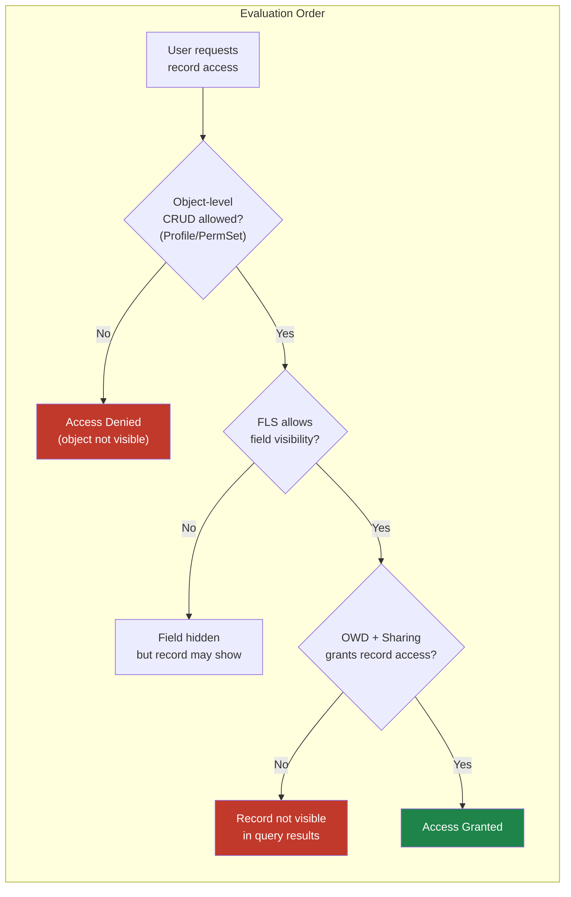
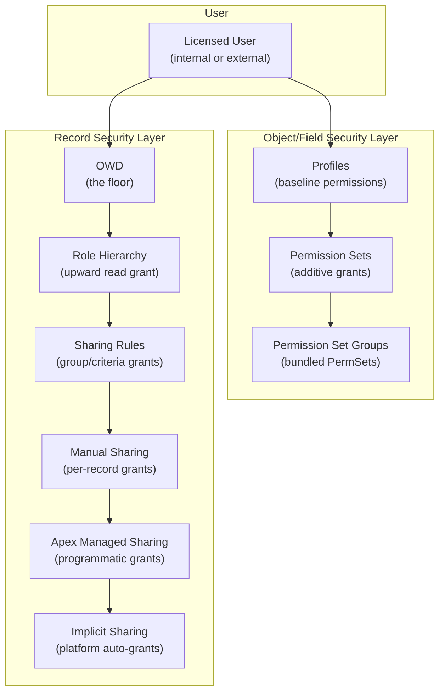

# Lecture 01 — Sharing Model Architecture

## Exam Domain
Record-Level Access — 35% of exam weight

## Foundations

Before diving into Salesforce specifics, understand the problem sharing models solve: in any multi-user system with sensitive data, you need to control *who can see and change what*. There are two classic approaches:

1. **Capability-based**: Give users explicit permissions to each resource (think: file system ACLs).
2. **Role-based**: Group users into roles and grant permissions to roles (think: RBAC in enterprise systems).

Salesforce uses a **hybrid model**: capability-based at the object/field level (Profiles and Permission Sets), and a layered role/criteria-based model at the record level (OWD + hierarchy + rules).

The key insight: Salesforce separates *what you can do* (object access) from *which records you can do it to* (record access). A user can have "Read" permission on Opportunity from their Profile, but if OWD is Private and they own no Opportunities, they will see zero records in a list view.

---

## Core Concepts

The Salesforce sharing model is a **layered, additive security stack**. Each layer can only grant additional access beyond what the previous layer allows. No layer except OWD can restrict access. Understanding this additive-only property is the single most important concept for the exam and for architecture.

### The Six Layers

| Layer | Who Controls It | Granularity | Can Restrict? |
|-------|----------------|-------------|---------------|
| OWD (Org-Wide Defaults) | Salesforce Admin | Per object | YES — it's the floor |
| Role Hierarchy | Admin (hierarchy config) | By role position | NO — only adds |
| Sharing Rules | Admin (rule config) | By group/role/criteria | NO — only adds |
| Manual Sharing | Record owner / admin | Per record | NO — only adds |
| Apex Managed Sharing | Developer / admin | Programmatic | NO — only adds |
| Implicit Sharing | Platform (automatic) | Parent-child relationship | NO — automatic |

### Two Distinct Dimensions of Access

Salesforce separates **object/field access** from **record access**. This separation trips up many candidates:

- **Object & Field Access**: Controlled by Profiles and Permission Sets. Determines *whether* a user can interact with an object or field at all. This is evaluated FIRST.
- **Record Access**: Controlled by OWD + sharing stack. Determines *which records* a user can see/edit. Only evaluated if object access passes.

### Sharing Architecture: Internal vs External

Salesforce maintains separate OWD settings for **internal users** and **external users** (portal/community users). This is often misunderstood:

- Internal OWD: Applies to standard licensed users
- External OWD: Applies to portal/community/guest users
- External OWD can be *equal to or more restrictive than* internal OWD — never more permissive
- External OWD available settings: Private, Public Read Only (NOT Public Read/Write)

### Standard vs Custom Object Sharing Behavior

| Aspect | Standard Objects | Custom Objects |
|--------|-----------------|----------------|
| Role Hierarchy default | Always enabled | Admin can disable ("Grant Access Using Hierarchies") |
| OWD options | Object-specific (e.g., Account has Controlled by Parent) | Private, Public Read Only, Public Read/Write, Controlled by Parent (if has master-detail) |
| Share object | AccountShare, ContactShare, etc. | `MyObject__Share` |
| Implicit sharing | Yes (for Account children) | No (unless explicitly designed) |

---

## PTA / SA Relevance

### When This Comes Up in Engagements

The sharing model architecture question comes up in **every** enterprise Salesforce engagement in some form. Common triggers:

- **Discovery call:** "We have users who see data they shouldn't" or "our reps can't see each other's accounts."
- **Architecture review:** "We need to evaluate whether this data model supports our security requirements."
- **Pre-go-live security audit:** Reviewing whether OWD settings expose HIPAA/PII/financial data.
- **ISV partner code review:** AppExchange security reviews check for `without sharing` Apex that might bypass access controls.

### Common Architecture Failures

1. **Treating sharing as an afterthought.** Customers configure objects, build automation, and then try to "add security" at the end. By then, hundreds of records are owned by the wrong users, role hierarchies aren't designed for data access, and reshaping everything causes a painful recalculation.

2. **Conflating the two dimensions.** A customer says "I need managers to see their team's records but not edit them." The admin sets the profile to Read Only — but that controls ALL records, not just "their team's." The correct fix is OWD = Private + Role Hierarchy for read + profile gives Read on the object. Knowing which dimension to pull is an architect-level skill.

3. **Not distinguishing internal from external.** A customer enables a community (Experience Cloud) and suddenly guest users can read internal Account data because the External OWD was never set. This is a data breach waiting to happen.

### Enterprise Patterns

- **Principle of Least Privilege from the start:** Begin all custom objects with Private OWD. Add access through explicit sharing rules as business requirements are confirmed. This approach is auditable, documented, and reversible.
- **Document the sharing matrix before implementation.** A simple table: Object × User Segment × Access Level. Validate it with the business before writing a single sharing rule.
- **Separate the "can access object" decision from the "can see this record" decision** in every data model conversation. Many stakeholders don't know these are separate controls.

---

## Architecture

**Limitations & Tradeoffs:**

- The sharing stack is **read-only from a restriction standpoint** below OWD. If you need to restrict access that OWD would grant, you must change OWD — there is no "restrict sharing rule."
- **Performance** degrades as sharing rules accumulate. Each rule adds rows to the sharing table; queries with sharing calculate group membership at runtime.
- **Sharing rules do not support cross-object criteria.** You cannot write a sharing rule that says "share this Opportunity if Account.Industry = Healthcare." That requires Apex Managed Sharing.
- **Role hierarchy and forecasting are separate.** The Forecast Hierarchy can differ from the Role Hierarchy — important for sales organizations with matrixed reporting.

---

## Key Facts to Memorize

- Sharing = ADDITIVE only below OWD layer
- OWD sets the floor — the most restrictive default
- Two dimensions: object/field access (Profile/PermSet) vs record access (OWD/sharing stack)
- External OWD: max setting is Public Read Only (never Read/Write)
- Custom objects: "Grant Access Using Hierarchies" can be disabled; standard objects cannot
- Share object naming: `{ObjectApiName}Share` (custom: `MyObject__Share`)
- Implicit sharing: automatic, platform-generated, not configurable by admin
- Sharing rules: criteria-based AND ownership-based; max 300 per object combined

---

## Exam Traps

1. **"Which mechanism can restrict access?"** — Only OWD can restrict. None of the upper layers can restrict what OWD grants. Answer: OWD.

2. **"A user has a profile with Read access on Opportunity and OWD is Private. Can they see all opportunities?"** — No. Profile grants object-level Read, but OWD Private means they only see records they own or have been explicitly shared with them.

3. **"Can you set External OWD to Public Read/Write?"** — No. External OWD maximum is Public Read Only.

4. **"Can you disable role hierarchy for standard objects?"** — No. Only custom objects support disabling "Grant Access Using Hierarchies."

5. **"Sharing rules can share down the role hierarchy."** — FALSE. Sharing rules share ACROSS or UP, not down. (Role hierarchy already handles down-to-up access.)

---

## Practice Questions

**Q1.** A sales manager needs to see all opportunities owned by their direct reports but cannot currently see any. OWD for Opportunity is Private. The role hierarchy is correctly configured with the manager above the reps. What is the most likely cause?

A) The manager's profile doesn't have Read access on Opportunity
B) "Grant Access Using Hierarchies" is enabled for Opportunity
C) "Grant Access Using Hierarchies" is disabled for Opportunity
D) The manager needs a sharing rule

**Answer: C** — Opportunity is a standard object and normally has role hierarchy enabled. If the manager can't see down, something disabled it. For standard objects this is not possible via UI (you can't disable Grant Access Using Hierarchies on standard objects) — this is a trick question about custom vs standard object behavior. For a CUSTOM opportunity-equivalent object, C would be the answer. For standard Opportunity, the answer is A (profile issue).

**Q2.** An architect needs to share Account records with users based on a custom field `Region__c` matching the user's `Region` custom field. Which mechanism supports this?

A) Ownership-based sharing rule
B) Criteria-based sharing rule using formula
C) Apex Managed Sharing
D) Manual Sharing

**Answer: C** — Criteria-based sharing rules can match record field values against static values but cannot compare a record field to a USER field value. Cross-object or user-field comparisons require Apex Managed Sharing.

**Q3.** Which OWD setting is NOT available for custom objects?

A) Private
B) Public Read Only
C) Public Read/Write
D) Full Access

**Answer: D** — "Full Access" is an internal access level value in the Share object (for record owners), not an OWD setting. OWD options for custom objects are Private, Public Read Only, Public Read/Write, and Controlled by Parent (only if there's a master-detail to a parent).
