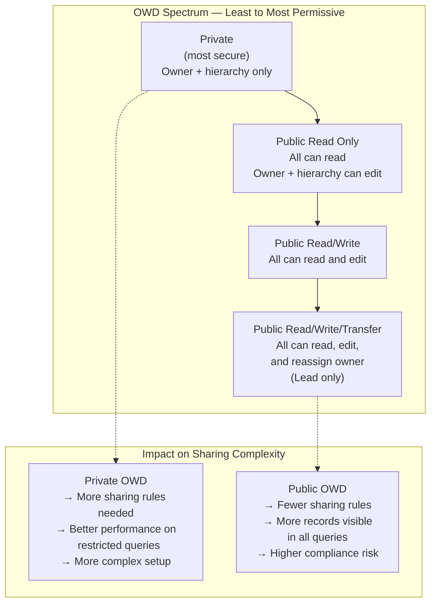
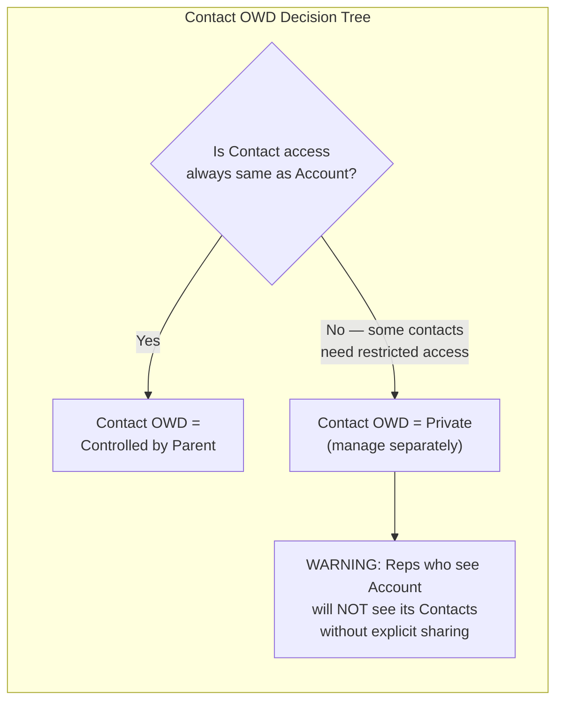

# Lecture 02 — Org-Wide Defaults (OWD) Deep Dive

## Exam Domain
Record-Level Access — 35% of exam weight

## Foundations

Think of OWD as the **water level in a pool** — it determines how deep the water is by default. Every sharing mechanism above OWD adds more water (more access), but nothing can drain water below OWD's level (except removing records from ownership).

Before Salesforce, enterprise systems often handled this with ACLs (Access Control Lists) — every record had an explicit list of who could access it. This is powerful but operationally impossible at scale (millions of records × thousands of users = hundreds of billions of entries). Salesforce's OWD + layered model is the scalable alternative: set a default, then express exceptions through rules.

The business question OWD answers is: **"For someone who has no special relationship with this record, what should they be able to do?"** If the answer is "nothing" → Private. "Read only" → Public Read Only. "Read and edit" → Public Read/Write.

---

## Core Concepts

Org-Wide Defaults (OWD) define the **baseline record access** for every object in your org. They answer the question: "If no other sharing mechanism applies, what can a user do with a record they don't own?"

This is the most important single configuration decision in Salesforce security architecture. It is also the hardest to change once data and business processes are in production.

### OWD Access Levels (Internal Users)

| Setting | Meaning | Use When |
|---------|---------|---------|
| **Private** | Users can only access records they own (or are above in hierarchy, if hierarchy enabled) | Default recommended for sensitive objects; most secure baseline |
| **Public Read Only** | All users can read all records; only owners + those above in hierarchy can edit | Shared reference data; accounts in team-selling orgs |
| **Public Read/Write** | All users can read and edit all records (not delete — delete requires profile permission) | Truly collaborative objects where all users need full edit access |
| **Public Read/Write/Transfer** | Like Read/Write plus can change record owner | Leads (standard object specific) — any user can reassign |
| **Controlled by Parent** | Access follows the parent record's sharing | Detail side of master-detail; child records in parent-child relationships |
| **Full Access** | Not an OWD setting — internal access level in Share objects for record owners | N/A as OWD |

### OWD Access Levels (External Users — Experience Cloud / Portal)

| Setting | Applies To | Notes |
|---------|-----------|-------|
| **Private** | External users cannot see records unless explicitly shared | Default; most secure for external |
| **Public Read Only** | External users can read all records of this type | Maximum available for external; use with care |
| **Controlled by Parent** | External user access follows parent record | Common for Contact when Account is shared |

**Critical:** External OWD can never be set *more permissive* than Internal OWD. If Internal = Private, External can only be Private. If Internal = Public Read Only, External can be Private or Public Read Only.

### Objects With Unique OWD Behaviors

| Object | Unique Behavior |
|--------|----------------|
| **Account** | Has separate Internal and External OWD; parent of Contact, Opportunity, Case for implicit sharing |
| **Contact** | Can be "Controlled by Parent" (default) or Private/Public independently |
| **Lead** | Only standard object with "Public Read/Write/Transfer" OWD option |
| **Price Book** | Has "Use" access level — controls who can add price book entries to opportunities |
| **Activity** | Controlled by parent by default; special behavior — visible to all users who can see the parent |
| **Document/Content** | Library-based sharing model separate from record sharing |
| **User** | OWD = Public Read Only by default; all users can see other users |
| **Case** | Commonly set to Private in service orgs for agent territory control |

### Contact OWD — The Notorious Edge Case

Contact has TWO independent OWD options:
1. **Controlled by Parent** (default): Contact visibility follows Account sharing. If you can see the Account, you can see its Contacts.
2. **Private**: Contact visibility is independent of Account. You must own the Contact OR have it explicitly shared.

The trap: If Contact OWD = Private and Account OWD = Public Read Only, a user who can see an Account cannot see its Contacts unless they own them or a sharing rule grants access. This breaks the expected "see account = see contacts" assumption.

---

## PTA / SA Relevance

### When This Comes Up in Engagements

OWD decisions come up at:
- **Data model design workshops** (pre-implementation): The right time to decide; changing OWD post-go-live triggers full sharing recalculation which can take hours or days on large orgs.
- **Security architecture reviews**: Auditors and compliance teams often ask for documentation of OWD settings per object.
- **Performance investigations**: "Why are our SOQL queries timing out?" often traces back to OWD = Private on a high-volume object, which forces the query optimizer to join against the sharing table on every query.
- **Experience Cloud builds**: External OWD misconfiguration is the #1 cause of data leakage in community deployments.

### Common Architecture Failures

**Failure 1: OWD set to Public Read/Write "to keep it simple"**
The most common mistake in SMB Salesforce orgs. An admin doesn't understand sharing, sets everything to Public Read/Write to avoid support tickets about "I can't see records," and years later the company discovers reps are editing each other's opportunities, changing pipeline data, and the org has compliance problems.
*Remediation cost: Very high.* Changing OWD post-go-live triggers async sharing recalculation; in large orgs with millions of records, this can run for 24-48 hours and cause degraded org performance during recalculation.

**Failure 2: Contact OWD mismatch with Account OWD**
Customer sets Account to Public Read Only for a team-selling model but leaves Contact at Controlled by Parent (default). Later, they add a restriction to Contact (set to Private for GDPR) without realizing it breaks the expected navigation from Account to Contact. Every rep who could see an Account can no longer see its Contacts.

**Failure 3: Not setting External OWD before enabling Experience Cloud**
When you enable Experience Cloud (communities), if External OWD is not explicitly set, external users may inherit more access than intended. The correct approach: always review and explicitly set External OWD before enabling any portal or community.

**Failure 4: Assuming OWD change is instantaneous**
On large orgs (LDV), changing OWD triggers a background sharing recalculation job. During this job:
- Users may see inconsistent results
- System performance is degraded
- The recalculation cannot be paused
Plan OWD changes for maintenance windows.

### Enterprise Patterns

**Pattern: OWD Decision Matrix**
Before implementation, complete this matrix for every object:

| Object | All Users Need Read? | All Users Need Edit? | Recommended OWD |
|--------|---------------------|---------------------|----------------|
| Account | Depends on sales model | No | Public Read Only or Private |
| Opportunity | No — territory-based | No | Private |
| Contact | Depends on Account OWD | No | Controlled by Parent |
| Case | No — assigned to agents | No | Private |
| Custom Object | Always Private first | Never until proven | Private |

**Pattern: External OWD Checklist**
Before any Experience Cloud go-live, explicitly document:
1. Every object accessible via community pages
2. Current External OWD for each
3. Expected access level for guest vs authenticated external user
4. Whether sharing sets or sharing rules are in place for each object

---

## Architecture

**Limitations & Tradeoffs:**

- **Changing OWD is expensive post-go-live.** Triggers full sharing recalculation. On a 10M-record org, this is a multi-hour background job.
- **No per-user-type OWD within internal users.** Internal OWD applies to all internal license types. If you need sales reps to have Private but admins to have full access, that's handled via profiles (Admin has View All/Modify All), not OWD.
- **Activities follow parent OWD implicitly.** Activities (Tasks/Events) visibility is tied to the parent record. There is no separate OWD for Activities.
- **Reports and list views respect OWD.** A report run by User A will only return records User A can access based on OWD + sharing. This means two users running the same report may see different results — this is a feature, not a bug, but confuses stakeholders.

---

## Key Facts to Memorize

- OWD is the ONLY mechanism that RESTRICTS access; all others only grant
- External OWD max = Public Read Only (never Read/Write)
- External OWD cannot be MORE permissive than Internal OWD
- Leads have unique OWD: Public Read/Write/Transfer
- Contact OWD "Controlled by Parent" = access follows Account sharing
- Contact OWD "Private" = independent from Account (causes loss of Account-to-Contact navigation)
- OWD change triggers background sharing recalculation (can take hours on large orgs)
- OWD for Activities = Controlled by Parent (follows the parent record)
- Price Book OWD has "Use" access level (not the standard CRUD model)

---

## Exam Traps

1. **"External OWD can be set to Public Read/Write."** — FALSE. External OWD maximum is Public Read Only. If you see this on the exam, it's wrong.

2. **"Changing OWD takes effect immediately."** — FALSE on large orgs. It triggers an asynchronous recalculation. Choose the option that mentions background processing or recalculation job.

3. **"A user with a profile that has Read access on Contact can see all contacts if Contact OWD is Private."** — FALSE. Profile gives object-level read (can interact with the object), but Private OWD means they can only see contacts they own or that are explicitly shared.

4. **"All standard objects support all OWD settings."** — FALSE. Lead has a unique Public Read/Write/Transfer setting. Price Book has Use. Activities don't have their own OWD. Case and Contract have some organization-specific settings.

5. **"Setting Account OWD to Public Read Only means users can see all Account-related Contacts and Opportunities."** — FALSE if Contact OWD is Private or Opportunity OWD is Private. Each object's OWD is independent.

---

## Practice Questions

**Q1.** A company wants all sales reps to see all Account records but only edit their own. Which OWD setting is appropriate for Account?

A) Private
B) Public Read Only
C) Public Read/Write
D) Controlled by Parent

**Answer: B** — Public Read Only allows all users to read all records, but only owners (and those above them in the role hierarchy) can edit.

**Q2.** A company is deploying Experience Cloud for customer self-service. The Internal OWD for Case is Private. What is the MAXIMUM External OWD they can set for Case?

A) Private
B) Public Read Only
C) Public Read/Write
D) Controlled by Parent

**Answer: B** — External OWD maximum is Public Read Only, and it cannot be more permissive than Internal OWD (which is Private). So the options are Private or Public Read Only. The maximum they CAN set is Public Read Only.

**Q3.** A company changes Account OWD from Public Read Only to Private. What happens?

A) Users immediately lose access to Account records they don't own
B) A background sharing recalculation job runs; during this period users may see inconsistent results
C) Nothing changes until the admin explicitly runs a sharing recalculation
D) Users lose access only to new records created after the change

**Answer: B** — OWD changes trigger an automatic background sharing recalculation. The change is not immediate on large orgs; Salesforce queues a recalculation job.

**Q4.** Contact OWD is set to "Controlled by Parent." A user has Read access to an Account record. Which statement is true about their access to that Account's Contacts?

A) They cannot see the Contacts because Contact OWD is "Controlled by Parent"
B) They can see the Contacts because their Account access grants implicit Contact access
C) They can only see Contacts where they are the Contact owner
D) They must have a sharing rule explicitly granting Contact access

**Answer: B** — "Controlled by Parent" means Contact access follows Account access. If you can read the Account, you can read its Contacts.
