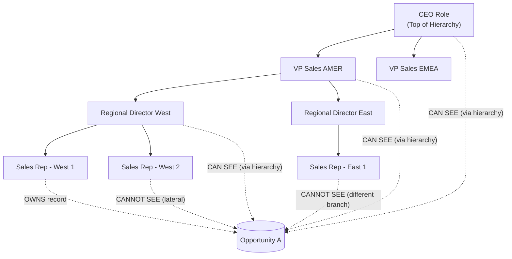
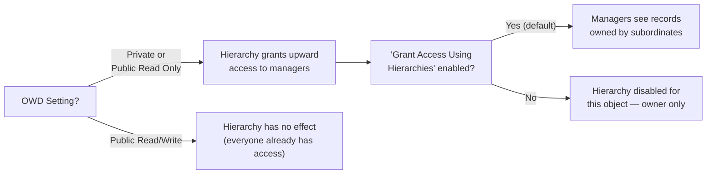

# Role Hierarchy Design

## Exam Domain
Record-Level Access — 35% of exam weight

## Foundations

Most Salesforce admins think of the role hierarchy as a mirror of the company org chart — the VP is above the Manager, who is above the Rep. That intuition is directionally useful but architecturally dangerous. The role hierarchy is not an org chart. It is a record-access escalation mechanism.

The single most important thing to internalize: **roles grant access UP the tree, not down.** A user at a higher position in the hierarchy can see records owned by users below them. The reverse is never true by default. A Sales Rep does not gain visibility into their VP's records simply because they share a hierarchy branch.

Why does this matter? Because when architects design a role hierarchy to mirror reporting lines one-to-one, they often create unintended exposure — a regional director suddenly sees all records owned by everyone in their region, including sensitive deals or service cases they were never supposed to see. The sharing model is a one-way valve: access flows upward.

Every internal user must be assigned a role. A user without a role effectively sits outside the hierarchy and will not benefit from upward visibility sharing. This is a common misconfiguration in orgs that automate user provisioning without enforcing role assignment.

## Core Concepts

### How the Role Hierarchy Actually Works with OWDs

The role hierarchy only has meaningful sharing effects when an object's Organization-Wide Default (OWD) is set to **Private** or **Public Read Only**. When OWD is **Public Read/Write**, all users already have full access regardless of position in the hierarchy — the hierarchy adds nothing.

For Private OWD objects:
- The record owner and their manager (and their manager's manager, all the way to the top) can see and edit the record.
- Users at the same level (siblings) have no access to each other's records unless a sharing rule explicitly grants it.
- Users below the owner in the hierarchy have no access.

For Public Read Only OWD objects:
- Everyone can read all records, but only owners/managers can edit.

### "Grant Access Using Hierarchies" Checkbox

Each object has a per-object setting: **Grant Access Using Hierarchies**. When this checkbox is enabled (the default), the role hierarchy applies to that object and managers inherit access. When it is **unchecked**, the hierarchy is completely disabled for that object — ownership alone determines access and no upward propagation occurs.

This checkbox is critical for objects where you explicitly do not want manager visibility — for example, a custom HR compensation object where you want strict need-to-know access. Architects must consciously decide this per object; many teams leave it checked by default and later discover unintended manager access.

Note: This checkbox cannot be disabled for standard objects in most cases; it is primarily useful for custom objects.

### Role Groups: RoleAndSubordinates vs. RoleAndSubordinatesInternal

Behind every role in Salesforce is a system-managed **sharing group**. These groups are used by the sharing engine when evaluating record access. Two group types are relevant:

| Group Type | Includes |
|---|---|
| RoleAndSubordinates | All users in the role + all users in subordinate roles, including portal/community users |
| RoleAndSubordinatesInternal | All users in the role + all users in subordinate roles, **excluding** portal/community users |

This distinction matters when your org has Experience Cloud (formerly Community) portals. If you create an owner-based sharing rule that grants access to the "RoleAndSubordinates" group of a role, portal users in subordinate roles will also receive access. If you only want internal employees to have that access, use RoleAndSubordinatesInternal. Getting this wrong is a common data exposure issue in orgs with both internal and external communities.

### Role Hierarchy Depth and Performance

Salesforce recommends keeping hierarchy depth to **10 levels or fewer**. Each additional level increases the complexity of sharing group calculation. When a record is created or ownership changes, Salesforce must recalculate which sharing groups include access to that record. Deep hierarchies with high record volumes create significant background processing overhead.

More practically: each SOQL query that uses the `WITH SECURITY_ENFORCED` or performs implicit sharing checks must traverse the hierarchy. Very deep hierarchies can push queries toward governor limit boundaries in high-volume automation.

**Performance anti-pattern — ownership skew:** If a single role "owns" millions of records (e.g., a system integration user assigned to a role, or an "unassigned" role used as a catch-all), the sharing recalculation for that role's group becomes extremely expensive. This is called **ownership skew** and is one of the hardest performance problems to remediate after go-live. Detect it with:

```sql
SELECT OwnerId, COUNT(Id)
FROM Opportunity
GROUP BY OwnerId
ORDER BY COUNT(Id) DESC
LIMIT 10
```

Cross-reference OwnerId against the UserRole hierarchy to find skewed roles.

### Lateral Access: The Gap the Hierarchy Does Not Fill

Role hierarchy provides zero lateral access. Two Sales Reps both reporting to the same Regional Director have no visibility into each other's records. Architects who design "team visibility" use cases frequently underestimate this gap. Lateral access must be handled through:

- Criteria-based sharing rules (e.g., "share all Opportunities where Region = West with the West Regional Team role")
- Manual sharing
- Apex managed sharing

Confusing "team" visibility with hierarchy visibility is a common design failure.

### Manager Field vs. Role Hierarchy

The `User.ManagerId` field (the Manager lookup on the User record) is **not** a sharing mechanism. It has no effect on record access. It exists for:
- Chatter feed visibility in certain configurations
- Workflow approval processes (manager approval step)
- Reporting/org chart display

New architects frequently assume that setting the Manager field alone establishes a sharing relationship. It does not. Record access flows through role hierarchy, not the Manager field.

### Territory Hierarchy vs. Role Hierarchy

Enterprise Territory Management (ETM) introduces a **separate, parallel hierarchy** that is additive to the role hierarchy. Territory-based sharing grants access based on territory assignment rules, not role position. A user can have both a role (granting access via hierarchy) and territory assignments (granting access via territory rules) — the union of both applies.

Key architectural point: Territory hierarchies should not be designed to mirror the role hierarchy. They serve different purposes. Role hierarchy = organizational authority. Territory hierarchy = geographic or account-segmentation access scope.

### Role Naming Conventions at Scale

In large orgs (500+ users, 10+ business units), role names become a governance problem. Recommended conventions:
- Include business unit prefix: `AMER_Sales_Enterprise_Rep`
- Avoid generic names like "Manager" — they become ambiguous at scale
- Document role purpose alongside the name (Role Description field)
- Use a spreadsheet/governance doc to maintain the intended hierarchy before building it in Salesforce

---

## PTA / SA Relevance

### When This Comes Up in Engagements

Role hierarchy design surfaces in almost every mid-to-large Sales Cloud, Service Cloud, or Health Cloud implementation. Common triggers:
- Customer says "our managers need to see their team's records" — this is a role hierarchy use case, but you must validate it against OWD settings
- Customer is migrating from a legacy CRM with a flat security model and needs to introduce manager visibility
- Mergers and acquisitions: two orgs being merged have different hierarchy depths and naming conventions
- Community/portal rollouts: customers don't realize portal users land in the hierarchy and may inherit access

### Common Architecture Failures

1. **Hierarchy too deep (15+ levels):** Usually a symptom of mapping org chart 1:1 to role hierarchy. Causes sharing recalculation timeouts and slow record ownership transfers.

2. **Ownership skew on integration users:** All records created by an API integration are owned by a single user in one role. That role's sharing group grows to cover millions of records, causing performance degradation across the org.

3. **Lateral access assumed from hierarchy:** Teams expect that users in the same peer role can see each other's records. They cannot. No sharing rules are built, and users complain about missing records post-launch.

4. **Portal users in wrong roles:** Experience Cloud users placed in internal roles give those external users upward visibility into internal records. This is a data exposure risk.

5. **"Grant Access Using Hierarchies" left enabled on sensitive objects:** Compensation, HR, or confidential deal data exposed to entire management chain because the checkbox was never evaluated.

### Enterprise Patterns

**Flatter is better:** The gold standard for role hierarchy design is: as few levels as necessary, using sharing rules for lateral and exception access. A well-designed enterprise org typically has 4–6 levels, not 12–15.

**Separation of hierarchy design from org chart design:** Run a dedicated sharing design workshop before building the hierarchy. The output is a sharing matrix, not an org chart. Many implementations skip this and pay for it in Phase 2 remediation.

**Named integration user roles:** Each system integration user should have its own role, distinct from human user roles. This prevents the integration from dragging human records into its sharing group.

---

## Architecture





**Limitations & Tradeoffs:**

- Role hierarchy depth beyond 10 levels degrades sharing recalculation performance, especially on high-volume objects (Opportunities, Cases, custom transaction objects).
- The hierarchy is a coarse-grained instrument — it grants access to ALL records owned by subordinates, not a filtered subset. For filtered access (e.g., "manager can only see closed deals, not open pipeline"), sharing rules or Apex sharing are required.
- Role hierarchy changes (reassigning a user to a different role, adding a new level) trigger asynchronous sharing recalculation. In large orgs this can take minutes to hours, during which record access is temporarily stale.
- There is no native "exclude this record from upward visibility" mechanism within the hierarchy — once a record is owned by a user in a role, all users above them can see it (if hierarchy is enabled and OWD is private/read-only). This is why the "Grant Access Using Hierarchies" checkbox and object-level OWD design are so critical.

---

## Key Facts to Memorize

- Role hierarchy grants access **UP** (managers see subordinates' records), never down
- Only affects objects where OWD is **Private** or **Public Read Only** — has no effect on Public Read/Write
- "Grant Access Using Hierarchies" checkbox disables hierarchy sharing per object when unchecked
- **RoleAndSubordinates** includes portal users; **RoleAndSubordinatesInternal** excludes them
- Salesforce recommends **max 10 hierarchy levels**
- Role hierarchy provides **no lateral access** — siblings are invisible to each other
- `User.ManagerId` (Manager field) does **NOT** grant record access
- Enterprise Territory Management hierarchy is **separate and additive** to role hierarchy
- Ownership skew (millions of records owned by one role) causes serious performance degradation
- "Flatter is better" — minimize depth, use sharing rules for lateral/exception access

## Exam Traps

- **"The manager can see the record but the user can't see the manager's records"** — this is expected behavior, not a bug. Hierarchy flows upward only.
- **"We unchecked Grant Access Using Hierarchies but the VP can still see everything"** — check the OWD. If the object is Public Read/Write, the VP sees everything regardless of the checkbox.
- **"We added a sharing rule to RoleAndSubordinates but our community users are seeing internal data"** — this is because RoleAndSubordinates includes portal users. Switch to RoleAndSubordinatesInternal.
- **Assuming the Manager field on the User record creates sharing** — it does not. Only role assignment matters for record access.
- **Confusing role hierarchy with Territory Management hierarchy** — they are independent mechanisms. A user can have both; both apply additively.

## Practice Questions

**Question 1**

A Sales Rep owns 50 Opportunity records. Her manager, a Regional Director, can see all 50 records. However, the Sales Rep cannot see the Regional Director's Opportunity records. A junior admin suspects this is a configuration error. What is the correct explanation?

A) The Sales Rep's profile is missing Read permission on the Opportunity object  
B) This is expected behavior — the role hierarchy grants upward access only; managers see subordinates' records, not vice versa  
C) The Regional Director has "View All" on the Opportunity object, which explains the discrepancy  
D) A sharing rule must be in place that grants the Regional Director access

**Answer: B**

**Explanation:** Role hierarchy is an upward access mechanism. Users higher in the hierarchy can see records owned by users below them. The reverse is not true by default. No sharing rule is needed for the Regional Director — hierarchy alone explains the access. The Sales Rep would need an explicit sharing rule or "View All" object permission to see her manager's records.

**Why others are wrong:**
- A: Object-level Read permission applies to both equally; this doesn't explain the directional asymmetry
- C: If the Director had "View All," so would the Rep have access issues in a different direction — this misidentifies the mechanism
- D: No sharing rule is needed; hierarchy alone grants the Director access

---

**Question 2**

A company has 8 business units, each with its own VP, Directors, and Reps. The current role hierarchy has 14 levels. Users are complaining of slow Opportunity record transfers during quarter-close. An architect reviews the org and finds that one integration user owns 3.2 million Opportunity records and is assigned to the "Integration Systems" role mid-hierarchy. What are the two most impactful recommendations?

A) Increase Salesforce governor limits and add more API request capacity  
B) Flatten the role hierarchy to 6 levels or fewer; move the integration user to a dedicated leaf role with no subordinates  
C) Enable Territory Management to bypass the role hierarchy for the integration user  
D) Delete and re-create all Opportunity records owned by the integration user  

**Answer: B**

**Explanation:** Two separate problems are identified. (1) 14-level depth is beyond Salesforce's recommended 10 and increases sharing recalculation cost. Flattening to 6 levels reduces traversal cost during record transfers. (2) Ownership skew — 3.2M records in one role's sharing group causes massive recalculation overhead on every ownership change. Moving the integration user to a leaf role (no subordinates, no upward propagation into the main hierarchy) isolates the skew.

**Why others are wrong:**
- A: Governor limits are not the root cause; the design is the problem
- C: Territory Management is a separate hierarchy and does not bypass role hierarchy recalculation for record ownership
- D: Re-creating records is destructive, does not address the structural problem, and would not be operationally feasible

---

**Question 3**

An architect is designing a custom HR Compensation object (OWD: Private) where only the record owner and HR Business Partners should ever see a record — NOT the owner's management chain. What is the correct configuration?

A) Set the object OWD to Public Read Only  
B) Uncheck "Grant Access Using Hierarchies" on the Compensation object and create a sharing rule for HR Business Partners  
C) Remove all roles from HR users so they fall outside the hierarchy  
D) Set OWD to Private and rely on the hierarchy to restrict manager access automatically

**Answer: B**

**Explanation:** With OWD set to Private and "Grant Access Using Hierarchies" unchecked, the role hierarchy no longer grants managers automatic visibility into subordinate-owned records for this object. Record access is limited to the owner only by default. Adding a criteria-based sharing rule for the HR Business Partners role grants the correct lateral access.

**Why others are wrong:**
- A: Public Read Only would give all users read access — worse than the current state
- C: Removing roles breaks the user's participation in all hierarchy-based sharing across the org — a disproportionate and harmful action
- D: With OWD Private and hierarchy enabled (the default), all managers can see the records — this is exactly the problem being solved

---

**Question 4**

An Experience Cloud portal is live. Internal Sales Reps are assigned to the "West Region Sales" role. External partner portal users are assigned to a role subordinate to "West Region Sales." An architect creates an owner-based sharing rule: "Share all Accounts owned by CEO role with RoleAndSubordinates of West Region Sales." After deployment, external partners report they can now see all Accounts owned by the CEO. What caused this?

A) The sharing rule should have used Criteria-Based instead of Owner-Based  
B) RoleAndSubordinates includes portal/community users; the architect should have used RoleAndSubordinatesInternal  
C) The CEO role OWD setting needs to be changed to Private  
D) Portal users should not be assigned to roles subordinate to internal roles

**Answer: B**

**Explanation:** RoleAndSubordinates includes all users in the target role and all subordinate roles, including Experience Cloud (portal) users. Because partner portal users are in a role subordinate to West Region Sales, they are members of its RoleAndSubordinates group and inherit the sharing rule access. RoleAndSubordinatesInternal is the correct group type when portal users should be excluded from a sharing grant.

**Why others are wrong:**
- A: Switching to criteria-based would not fix the problem — the group type (RoleAndSubordinates) is the issue, not the rule trigger type
- C: OWD is an object-wide setting; changing it for the CEO role is not how Salesforce security works
- D: Portal users being in subordinate roles is a valid and common design; the fix is group type selection, not hierarchy restructuring
