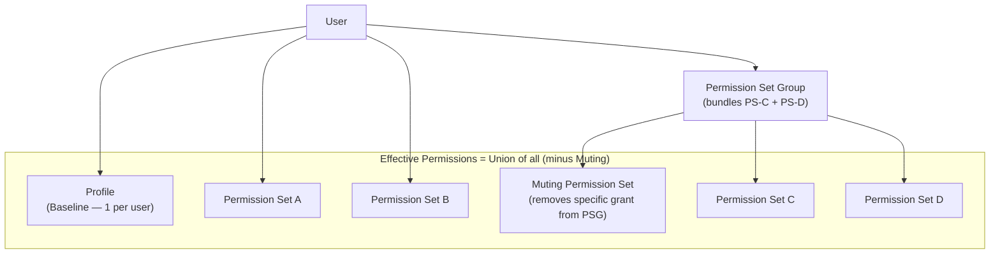
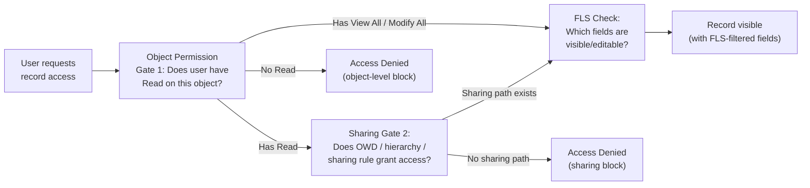

# Profiles & Permission Sets — Advanced

## Exam Domain
Object & Field Access — 20% of exam weight

## Foundations

Every Salesforce user has exactly one profile. That profile defines what the user can and cannot do at the baseline level — which objects they can create, read, edit, or delete; which fields they can see; when they can log in; and which apps appear in their navigation. Profiles are the floor of permissions.

Permission sets sit on top of that floor. A permission set can only add permissions — it can never take them away. A user assigned three permission sets gets the union of all three plus their profile. The most permissive setting always wins.

For administrators and architects, the critical mental model is this: **profiles are for organizational baselines, permission sets are for functional variance.** A Sales Rep profile covers every Sales Rep in the company. But not every Sales Rep needs access to the forecasting module, or to the contract management feature, or to Einstein opportunity scoring. Those targeted additions belong in permission sets.

This model breaks down badly in orgs that instead clone profiles every time a new permission combination is needed. A company with 200+ profiles has a governance failure — permissions become impossible to audit, changes require updates to dozens of profiles, and new hires frequently get assigned the wrong profile.

## Core Concepts

### What Profiles Control

Profiles are the comprehensive baseline configuration for a user type. They control:

- **Object permissions:** CRUD access (Create, Read, Edit, Delete) plus View All and Modify All
- **Field Level Security (FLS):** Read and Edit access per field, per object
- **App visibility:** Which Salesforce apps appear in the App Launcher
- **Login hours:** Time windows during which the user can authenticate
- **Login IP ranges:** Network restrictions for authentication
- **Page layouts:** (assigned per record type via profile-page layout matrix)
- **Record type availability:** Which record types a user can access and which is their default
- **Tab visibility:** Default On, Default Off, Hidden
- **Apex class and Visualforce access** (legacy)

### What Permission Sets Control

Permission sets can grant any of the following **on top of** the user's profile — they cannot restrict:

- Object-level CRUD, View All, Modify All
- Field-level Read and Edit
- App access
- System permissions (e.g., "API Enabled," "Manage Users," "View Setup and Configuration")
- Custom permissions
- Named credentials access
- Connected app access

### Permission Set Groups and Muting Permission Sets

**Permission Set Groups (PSGs)** allow you to bundle multiple permission sets into a single assignable unit. Instead of assigning five individual permission sets to every Sales Rep, you assign one Permission Set Group. This dramatically simplifies user management.

**Muting Permission Sets** are a feature within PSGs that allow you to remove specific permissions that are granted by one of the bundled permission sets. This is the only native mechanism to subtract permissions below the level of a bundled permission set — but it only works within a PSG context; you cannot use a muting permission set standalone to restrict a profile.

Example: PSG "Field Sales Package" bundles PS-Core-Sales, PS-Mobile, and PS-Analytics. PS-Mobile grants access to a sensitive field used for mobile check-in. You want everyone in the PSG to have PS-Mobile except the field-access-to-sensitive-field grant. A Muting Permission Set added to the PSG removes that specific field edit permission within the group.

### Permission Set Licenses (PSLs)

Some Salesforce features are gated not just by permissions but by **Permission Set Licenses**. A PSL is a license entitlement that must be assigned to the user before the relevant permission set can grant access to the feature.

Common examples:
- Sales Cloud Einstein requires a Sales Cloud Einstein PSL
- Salesforce Maps requires a Maps PSL
- Revenue Intelligence features require their own PSL

PSLs are visible in Setup under Company Information > Permission Set Licenses. Architects must account for PSL availability when designing permission set rollout — assigning a permission set without the required PSL either fails silently or results in a partially functional feature.

### Object-Level Permission Taxonomy

| Permission | What It Grants |
|---|---|
| Create | Insert new records |
| Read | View records the sharing model exposes |
| Edit | Modify records the sharing model exposes |
| Delete | Remove records the sharing model exposes |
| View All | Read ALL records of this object type, ignoring sharing rules and OWD |
| Modify All | Read + Edit + Delete + Transfer ALL records of this object type, ignoring sharing rules and OWD |

**View All vs. Read + Sharing:** A user with only "Read" object permission sees records determined by OWD + sharing rules + role hierarchy. A user with "View All" ignores all of that and sees every record regardless of ownership or sharing configuration. View All does NOT grant edit.

**Modify All** is the equivalent of "View All Data" scoped to one object — it bypasses all sharing for that single object's CRUD operations.

**View All Data / Modify All Data** are system-level permissions on the profile or permission set that apply across ALL objects. Assigning "View All Data" to a user means they can see every record in the org. "Modify All Data" means they can read, edit, delete, and transfer any record in the org. These are admin-class privileges and should be treated as such.

### The Two-Gate Model: Object Permissions + Sharing

Object-level permissions and record-level sharing are **orthogonal and additive gates**. Both must be satisfied for a user to access a record.

```
Gate 1: Object Permission (Can this user interact with this object at all?)
  └── If NO Read permission → access denied regardless of sharing
  └── If YES Read permission → proceed to Gate 2

Gate 2: Record-Level Sharing (Can this user see THIS specific record?)
  └── OWD + Role Hierarchy + Sharing Rules + Manual Sharing + Apex Sharing
  └── If no sharing path exists → access denied
```

A user with "View All" on the object bypasses Gate 2 entirely. A user without "Read" on the object cannot pass Gate 1, no matter how open the sharing is.

### Field Level Security (FLS)

FLS is controlled at the profile or permission set level, per field, per object. It is entirely independent from record sharing. A user can have full access to a record (they can open it) but still not see specific fields if FLS hides them.

FLS states per field:
- **Read** only: User sees the value but cannot edit it
- **Read + Edit**: User can view and modify
- **Hidden** (neither): Field does not appear anywhere for this user — not in list views, not on the record detail, not in reports, not in SOQL results via UI

FLS and record sharing are commonly confused:
- Record sharing determines: "Can this user open this record?"
- FLS determines: "Once the record is open, which fields can the user see?"

A user who has record access but is FLS-blocked on a field will see a blank where the field should be, or the field will be absent entirely from the page layout. They will NOT receive an error — the field is simply invisible.

This creates data quality issues: users can inadvertently save records with blank fields they cannot see, overwriting data they had no idea existed.

### Permission Precedence: Most Permissive Wins

When a user has multiple permission sets (or is in a PSG with multiple bundled sets), the effective permission is the union of all granted permissions. There is no "last one wins" or priority ordering — the most permissive state from any active permission set or profile applies.

The only exception is Muting Permission Sets within a PSG, which can subtract from the bundle's combined grants.

### Delegated Administration

Delegated Administrators can perform limited user management tasks without being a full System Administrator. They can:
- Create and edit users in designated roles
- Reset passwords
- Assign designated profiles and permission sets

They **cannot**:
- Create or modify profiles
- Create or modify permission sets
- Assign permission sets that are not in their delegated admin configuration
- Access Setup areas outside their delegation

Delegated admin is useful for large orgs with regional IT support teams, but it does not replace governance — the set of delegatable profiles and permission sets must be carefully controlled.

### Auditing Effective Permissions

- **Permission Set "View Summary":** On any permission set, clicking "View Summary" shows all permissions granted by that set in a single view
- **User Detail > Permission Set Assignments:** Shows all permission sets assigned to a specific user
- **Permission Analyzer (Health Check):** Available in Setup to compare permissions across profiles and permission sets; useful for SOX or compliance audits
- **SOQL approach for bulk audit:**
```sql
SELECT AssigneeId, PermissionSetId, PermissionSet.Name
FROM PermissionSetAssignment
WHERE Assignee.IsActive = true
ORDER BY AssigneeId
```

---

## PTA / SA Relevance

### When This Comes Up in Engagements

Profile and permission set design comes up in virtually every implementation conversation around security and compliance:

- Pre-go-live security reviews where the team has cloned profiles 30 times
- GDPR/CCPA data minimization requirements where FLS must hide PII from non-qualifying roles
- SOX compliance audits where customers must demonstrate who has Modify All Data and why
- Acquisitions where two Salesforce orgs are merging and profile rationalization is required
- ISV/AppExchange discussions where PSLs must be purchased before a managed package can be activated

### Common Architecture Failures

1. **Profile sprawl:** 200+ profiles in production because the team cloned a profile every time a permission difference was requested. Auditing becomes impossible. The fix (profile consolidation) is expensive and disruptive post-launch.

2. **FLS gaps causing silent data loss:** Users save records with fields they cannot see, overwriting values they were unaware of. This typically surfaces as "data corruption" complaints in QA or production.

3. **"View All Data" assigned too broadly:** System admins assign View All Data to power users or report builders for convenience. This bypasses all record-level security. In regulated industries this is an immediate audit finding.

4. **PSL not provisioned before permission set assignment:** Feature-specific permission sets are assigned to users, but the required PSL is not. Users get partial functionality or confusing error messages.

5. **Muting Permission Sets misunderstood:** Teams assume they can create a standalone "restriction permission set" to reduce a user's permissions. This does not work. Muting is only effective within a Permission Set Group.

### Enterprise Patterns

**Thin Profiles, Thick Permission Sets:** Minimize the number of profiles to the true minimum (typically 5–10 for most orgs: Standard Employee, Sales User, Service User, Partner Community, Customer Community, System Admin). All functional variance is handled through permission sets and PSGs. This makes audits manageable and permission changes low-risk.

**Permission Set Group per Persona:** Define a PSG per job function (Field Sales Rep, Inside Sales Rep, Service Agent, Sales Manager). Each PSG contains the permission sets appropriate to that function. When a function's access needs change, you update the PSG — all users in that function get the change automatically.

**Named PSG for Elevated Access:** Instead of modifying profiles or assigning broad permissions individually, create a PSG specifically for elevated access scenarios (e.g., "Data Quality Admin PSG" for the team allowed to mass-edit records). This makes elevated access explicit, auditable, and revocable.

---

## Architecture





**Limitations & Tradeoffs:**

- Permission sets can only add; they cannot restrict. If a profile grants a permission you want to remove for some users, you must use a separate (more restrictive) profile — not a permission set.
- Muting Permission Sets only work within a Permission Set Group. There is no standalone "remove permission" object.
- FLS operates independently from record sharing. You must design and test both layers separately. Many QA processes test sharing (can the user open the record?) but miss FLS testing (can the user see all the fields on the record?).
- "View All" and "Modify All" at the object level silently bypass the entire sharing model. These permissions are frequently assigned during development and forgotten before go-live.
- Profile changes are org-wide and immediate — changing a profile affects every user assigned to it. In large orgs, permission set changes are lower-risk because they can be scoped to specific users.
- Delegated Administration cannot modify permission sets or profiles — it is strictly a user-assignment mechanism.

---

## Key Facts to Memorize

- Profiles = baseline; permission sets = additive only — PSs can never restrict
- Muting Permission Sets can subtract within a PSG but cannot be used standalone
- **View All** bypasses sharing for reads; does NOT grant edit
- **Modify All** bypasses sharing for all CRUD on one object
- **View All Data / Modify All Data** bypass sharing across ALL objects — admin-class privileges
- Object permission is Gate 1; sharing is Gate 2 — both must pass for record access
- FLS is orthogonal to sharing — record access does not expose FLS-hidden fields
- Permission Set Licenses (PSLs) must be provisioned before feature-specific PSs can function
- Most permissive permission wins when multiple PSs are assigned
- "Thin Profiles, Thick Permission Sets" is the enterprise-standard pattern
- Profile sprawl (200+ profiles) is a governance failure and audit risk

## Exam Traps

- **"The user has full record access but can't see the Salary field"** — this is FLS, not a sharing problem. Record access and field visibility are independent.
- **"We created a permission set to remove admin access from a user"** — PSs can only add. You cannot remove profile-granted permissions via a PS; you must change the profile.
- **"View All means the user can edit all records"** — false. View All grants read access only, bypassing sharing. Modify All is required for edit/delete.
- **"We assigned a Muting Permission Set directly to the user"** — Muting PSs only work as part of a Permission Set Group. Standalone assignment has no effect.
- **"View All Data is automatically granted to all System Admins"** — true for the System Administrator standard profile, but this is why custom "admin-like" profiles must be audited — teams sometimes assign View All Data carelessly.

## Practice Questions

**Question 1**

A Service Agent can open a Case record and see all related activity. However, the "Annual Contract Value" field on the Account linked to the Case does not appear anywhere on the record — not on the page layout, not in related lists, and not in reports. The agent's profile shows Read access on the Account object. What is the most likely cause?

A) The Account OWD is set to Private and the agent does not have a sharing path to that Account  
B) The "Annual Contract Value" field is hidden via Field Level Security on the agent's profile or assigned permission sets  
C) The page layout assigned to the agent's profile does not include the field  
D) The agent needs the "View All" permission on the Account object to see all fields

**Answer: B**

**Explanation:** FLS operates independently from record sharing and object permissions. Even if the agent can open the record (sharing is satisfied) and has object-level Read, FLS can hide individual fields. A field hidden by FLS does not appear anywhere — page layout, reports, list views, or API results in UI context. This is the defining behavior of FLS.

**Why others are wrong:**
- A: If OWD were the issue, the agent couldn't open the Account at all, not just miss a field. The question states the agent can see related activity on the Case.
- C: Page layout exclusion would also hide the field on that layout, but FLS is a stronger restriction — it would hide the field even if it were on the page layout. The better (root cause) answer is B.
- D: "View All" bypasses the sharing model, not FLS. No object permission grants access to FLS-hidden fields.

---

**Question 2**

A Permission Set Group called "Enterprise Sales Package" bundles three permission sets: PS-CRM-Core, PS-Forecasting, and PS-Territory-Management. PS-Territory-Management grants Edit access to a custom field called "Territory_Notes__c." The security team requires that users in this PSG should NOT have Edit access to Territory_Notes__c. What is the correct approach?

A) Remove PS-Territory-Management from the PSG  
B) Create a new permission set that revokes Edit on Territory_Notes__c and assign it directly to affected users  
C) Create a Muting Permission Set that removes Edit on Territory_Notes__c and add it to the PSG  
D) Change the FLS on Territory_Notes__c in the users' profiles to Read Only

**Answer: C**

**Explanation:** Muting Permission Sets are designed exactly for this scenario — they allow you to subtract a specific permission granted by a bundled PS within a PSG, without removing the entire PS. Creating a Muting PS that removes Edit on Territory_Notes__c and adding it to the PSG achieves the desired state without removing all Territory Management access.

**Why others are wrong:**
- A: Removing PS-Territory-Management removes all territory management permissions, not just the one field edit — disproportionate
- B: A standalone permission set cannot revoke permissions. PSs are additive-only. This would have no effect.
- D: Changing the profile FLS would affect all users on that profile, not just those in this PSG — overly broad and potentially breaks other use cases

---

**Question 3**

A junior developer reports that a Sales Rep user can see a record in a list view but cannot see the "Competitor_Details__c" field anywhere on the record detail page, even though the field is on the assigned page layout. The rep's profile has Read and Edit on the Opportunity object, and the rep owns the record. What is the definitive explanation?

A) The rep's role does not include the Opportunity in its sharing group  
B) The field is hidden by FLS — it is not visible in the rep's profile or permission sets, regardless of page layout assignment  
C) The page layout is incorrect; the field must be added to the layout for this record type  
D) The rep needs the "Modify All" permission to see all fields on records they own

**Answer: B**

**Explanation:** FLS overrides page layout field placement. Even if a field appears on a page layout, if FLS marks it as hidden for that user's profile (or if no permission set grants visibility), the field will not render. Page layouts control display organization; FLS controls whether the field is accessible at all. Since the rep can see the record (owns it, has Read object permission), the field-level invisibility is definitively FLS.

**Why others are wrong:**
- A: The rep owns the record and can see it in a list view — sharing is clearly satisfied. Role has no bearing on the field visibility issue.
- C: Page layout assignment is a plausible red herring, but the question states the field IS on the layout. FLS takes precedence over layout.
- D: "Modify All" is a record-sharing bypass, not a field-visibility mechanism. Object permissions and FLS are separate axes.

---

**Question 4**

A newly hired Data Quality Manager needs to bulk-update records across all Accounts, Contacts, and Opportunities, including records they do not own. The security team wants the minimum permission necessary. Which single permission grant accomplishes this for all three objects?

A) Assign "View All Data" to the user's permission set  
B) Add "View All" on Account, Contact, and Opportunity to a permission set  
C) Assign "Modify All Data" to the user's permission set  
D) Add "Modify All" on Account, Contact, and Opportunity to a permission set

**Answer: D**

**Explanation:** "Modify All" per object grants the ability to read, edit, delete, and transfer all records of that object regardless of sharing — scoped to just those objects. This is the minimum permission to bulk-edit records the user doesn't own across the three specified objects. "Modify All Data" (option C) is the system-level equivalent but applies to ALL objects in the org — far exceeding the minimum required. Option B (View All) only grants read access, not edit. Option A (View All Data) similarly only grants read across all objects.

**Why others are wrong:**
- A: View All Data grants read across all objects — does not grant edit, and is too broad
- B: View All only allows reads, not the bulk updates required
- C: Modify All Data grants edit/delete across the entire org — exceeds minimum necessary privilege for a three-object use case and is a significant security risk
