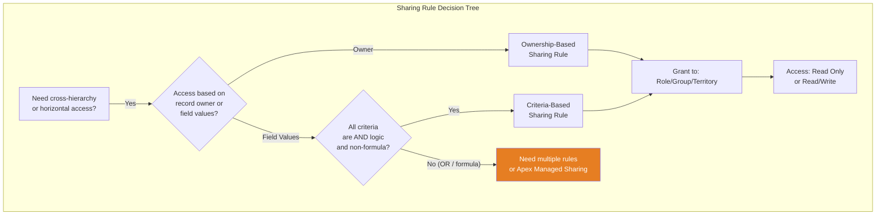
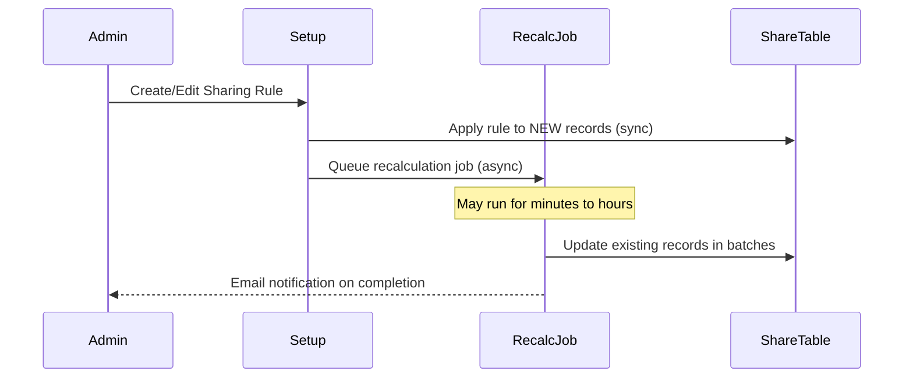

# Lecture 05 — Sharing Rules Deep Dive

## Exam Domain
Record-Level Access — 35% of exam weight

## Foundations

Org-Wide Defaults set the floor. Role hierarchies propagate access upward. But neither mechanism handles the most common enterprise need: "Everyone in the West region sales team should see each other's Opportunities, regardless of role." That gap is what sharing rules fill.

Sharing rules are declarative, admin-managed rules that extend access horizontally — across role branches, across criteria sets, to public groups — without changing the OWD or restructuring the role hierarchy.

The critical property: sharing rules only *open* access. They can never restrict what OWD already allows. If OWD is Public Read/Write, sharing rules are irrelevant (everyone already has full access). Sharing rules only matter when OWD is Private or Public Read Only.

---

## Core Concepts

### Two Types of Sharing Rules

#### 1. Ownership-Based Sharing Rules
Grant access to records based on *who owns the record*.

- Trigger: "Records owned by [User/Role/Group X]"
- Grant to: Role, Role and Subordinates, Public Group, Territory, Territory and Subordinates
- Access level: Read Only or Read/Write (can never exceed OWD's write level)
- Best for: role-based cross-territory access, partner-to-internal access

Example: "Records owned by **North Sales Team** (public group) are shared **Read/Write** with **South Sales Team** (public group)."

#### 2. Criteria-Based Sharing Rules
Grant access to records based on *field values on the record*.

- Trigger: Record meets filter conditions (up to 3 criteria, AND logic only — no OR)
- Filter fields: Most text, picklist, number fields; NOT formula fields, cross-object fields, or encrypted fields
- Grant to: Same targets as ownership-based
- Access level: Read Only or Read/Write
- Best for: status-driven access ("when Deal Stage = Closed Won, share with Finance"), geography-based access

Example: "Opportunities where **Region__c = 'EMEA'** are shared **Read Only** with **EMEA Viewer Group**."

### Limits — These Are Heavily Tested

| Limit | Value |
|-------|-------|
| Max sharing rules per object | 300 (ownership + criteria combined) |
| Max criteria per criteria-based rule | 3 (AND only) |
| Max sharing rules total (org) | No hard cap, but each rule adds recalculation time |
| Criteria filter operators | equals, not equal to, starts with, contains, less than, greater than |
| NOT supported in criteria | Formula fields, encrypted fields, cross-object references |

### Rule Stacking and Additive Behavior

Multiple sharing rules on the same object stack — Salesforce grants the *most permissive* access from all applicable rules. If Rule A grants Read Only and Rule B grants Read/Write for the same record and user, the user gets Read/Write.

Rules do not conflict or cancel each other. There is no concept of "deny" in the sharing rule stack.

### Order of Evaluation

Sharing rule evaluation is NOT sequential — all rules are evaluated simultaneously and the most permissive result wins. This differs from other systems (like IP allowlists) where order matters. Exam trap: candidates often assume later rules "override" earlier ones.

### Asynchronous Recalculation

When you create or edit a sharing rule, Salesforce queues a **sharing recalculation job**. This job runs asynchronously and may take minutes to hours on large orgs. During recalculation:

- New records *immediately* get the sharing rule applied
- Existing records are updated in batches by the background job
- You can monitor progress via Setup > Sharing Settings > Recalculate
- You can manually trigger recalculation by clicking the "Recalculate" button on a specific object's sharing rules

**Critical point**: If you deactivate a sharing rule, access is removed synchronously for new data but asynchronously for existing records — there can be a brief window where users retain access they shouldn't have.

### OWD + Sharing Rule Combinations

| OWD Setting | Sharing Rules Needed? | Effect |
|-------------|----------------------|--------|
| Public Read/Write | No | All users have full access; rules irrelevant |
| Public Read Only | Only if you need Write access for subsets | Can elevate specific groups to Read/Write |
| Private | Yes (for any cross-hierarchy access) | Core mechanism for horizontal access |
| Controlled by Parent | Governed by parent's OWD | Rules on parent propagate to child |

### Public Groups and Sharing Rules

Sharing rules work best with **Public Groups**. A public group can contain:
- Individual users
- Roles
- Roles and subordinates
- Other public groups
- Portal roles

When you add a portal role to a public group used in a sharing rule, that rule extends access to community/portal users — a common enterprise architecture pattern.

---

## PTA / SA Relevance

### When This Comes Up in Engagements

- Customer has Private OWD on Accounts but needs regional visibility (classic sharing rule use case)
- Finance team needs read access to all closed Opportunities (criteria-based: Stage = Closed Won)
- Partner community users need to see their account's Opportunities (portal role in public group)
- Customer reports "sharing rules aren't working" — almost always a recalculation or group membership issue

### Common Architecture Failures

1. **OR logic needed but not supported**: Customer needs "share if Region = EMEA OR if Status = Escalated" — criteria-based rules only support AND. Solution: create two separate rules (one per condition).

2. **Formula field in criteria**: Trying to use a formula field (e.g., `Owner_Region__c` formula) as a criteria filter — not supported. Solution: use a real field or Apex sharing.

3. **Hitting the 300-rule limit**: Orgs with many objects and complex visibility requirements accumulate rules fast. Symptom: "Cannot save sharing rule, limit reached." Solution: consolidate via public groups, or redesign with Apex sharing.

4. **Recalculation confusion**: Admin reports "I created the rule but users still can't see records." The background job hasn't completed yet — especially common on orgs with millions of records.

5. **Access level misconception**: Setting a sharing rule to Read/Write on an object where OWD is Private allows editing — but if the user's profile doesn't have Edit object permission, they still cannot edit. Sharing rules interact with profile-level CRUD.

### Enterprise Patterns

- **Tiered visibility model**: Private OWD + role hierarchy for vertical access + sharing rules for horizontal access is the standard enterprise pattern
- **Public group taxonomy**: Maintain a well-documented set of public groups that map to business units; sharing rules reference these groups, not individual roles (makes maintenance easier)
- **Criteria-based for lifecycle access**: Use criteria-based rules to automatically share records when they reach certain stages (e.g., share Contracts with Legal team when Status = "Under Review")

---

## Architecture

**Limitations & Tradeoffs:**

- 300 rules per object hard limit — plan your rule budget early in design
- Criteria-based rules: 3 conditions max, AND only — complex conditions require multiple rules or Apex
- Recalculation is async — access changes are not instant for existing records
- Cannot filter on formula fields, encrypted fields, or cross-object fields
- Sharing rules cannot restrict access — they can only grant more than OWD provides
- Rules targeting large public groups (millions of members) can cause sharing group skew

---

## Key Facts to Memorize

- Max **300 sharing rules per object** (ownership + criteria combined)
- Max **3 criteria** per criteria-based rule, **AND logic only** (no OR)
- Sharing rules use **asynchronous recalculation** — changes aren't instant for existing records
- Sharing rules are **additive only** — cannot restrict OWD-granted access
- **Formula fields and encrypted fields cannot be used** as criteria-based rule filters
- Criteria-based sharing rules evaluate the **current field value** — if the field changes, access is updated on next recalculation
- If OWD is **Public Read/Write**, sharing rules have no effect
- Sharing rules can target: Roles, Roles & Subordinates, Public Groups, Territories, Territory & Subordinates, and specific users (ownership-based only)
- External OWD sharing rules can only grant Read Only (not Read/Write) to community users on most objects

---

## Exam Traps

1. **"Order of evaluation"**: Rules are evaluated simultaneously — no sequential override. Most permissive wins.
2. **"Can a sharing rule restrict access?"**: No. OWD is the only restriction mechanism. Sharing rules only add.
3. **"Criteria-based rule with OR"**: Not possible in a single rule. Must create two separate rules.
4. **"Formula field as criteria"**: Not supported. This is a frequent wrong answer in scenario questions.
5. **"Sharing rule on Public Read/Write object"**: Functionally useless — everyone already has full access.
6. **"Recalculation timing"**: Exam loves to test whether candidates know recalculation is asynchronous.
7. **"Access level can exceed OWD"**: Partially true — sharing rules can grant Read/Write even if OWD is Read Only, but cannot grant access to something OWD blocks entirely.

---

## Practice Questions

**Question 1**
A Salesforce admin creates a criteria-based sharing rule on the Opportunity object: "Share records where Region__c = 'West' OR Industry__c = 'Healthcare' with the Finance public group." When the admin tries to save this rule, what happens?

A. The rule saves successfully and grants access to records matching either condition  
B. The rule saves successfully but only the first condition is evaluated  
C. The rule cannot be saved because criteria-based sharing rules only support AND logic, not OR  
D. The rule can be saved but requires Salesforce support to enable OR logic

**Answer: C**
**Explanation:** Criteria-based sharing rules support a maximum of 3 conditions joined by AND logic only. OR logic is not supported in a single sharing rule. To achieve OR-like behavior, the admin must create two separate sharing rules — one for each condition.

**Why the others are wrong:**
- A: OR logic is not supported in criteria-based sharing rules
- B: Salesforce would not silently ignore a condition — it rejects the rule configuration entirely
- D: No support enablement can unlock OR logic in sharing rules; it is a platform constraint

---

**Question 2**
An org has Account OWD set to Private. A criteria-based sharing rule is configured: "Accounts where Type = 'Customer' are shared Read/Write with the Account Management public group." A user in the Account Management group opens an Account record where Type = 'Customer'. The Account has 2 child Contacts. What is the user's access to those Contact records?

A. No access — the sharing rule only applies to Accounts, not Contacts  
B. Read Only — implicit sharing grants read access to child Contacts of accessible Accounts  
C. Read/Write — the sharing rule grants Read/Write to the Account, which cascades to all children  
D. Depends on Contact OWD setting

**Answer: D**
**Explanation:** Contact access is governed by Contact OWD. If Contact OWD is "Controlled by Parent," the user inherits the Account sharing (Read/Write in this case). If Contact OWD is Private or Public Read Only, a separate sharing mechanism determines Contact access. The Account sharing rule does not automatically grant Contact access unless Contact OWD is Controlled by Parent.

**Why the others are wrong:**
- A: Implicit sharing does apply, but the level depends on Contact OWD
- B: Implicit sharing grants Read access only when Contact OWD is Controlled by Parent AND the user's account access is read — but with Controlled by Parent, Write follows too
- C: True if Contact OWD is Controlled by Parent, but not universally true

---

**Question 3**
A company has 250 existing sharing rules on the Opportunity object. The admin needs to add 60 more rules to support a new regional structure. What is the correct approach?

A. Add the 60 rules; Salesforce allows up to 400 sharing rules per object  
B. Consolidate existing rules using public groups to reduce the count below 240, then add the new rules  
C. Use Territory Management instead, which has no sharing rule limits  
D. Enable "Extended Sharing Rules" in Setup to increase the limit to 500

**Answer: B**
**Explanation:** The hard limit is 300 sharing rules per object (ownership-based + criteria-based combined). With 250 existing rules, adding 60 more would exceed the limit. The correct approach is to consolidate rules — for example, combining multiple role-based rules into single rules targeting public groups that contain those roles.

**Why the others are wrong:**
- A: The limit is 300, not 400
- C: Territory Management is a different access mechanism but doesn't replace sharing rules; the comparison is not directly applicable
- D: No such "Extended Sharing Rules" feature exists

---

**Question 4**
An admin modifies an ownership-based sharing rule that affects 8 million Account records. Users report they can still see records they should no longer have access to, 30 minutes after the rule change. What is the most likely cause?

A. The sharing rule change requires Salesforce support to take effect  
B. The recalculation job is still running asynchronously — access will be updated when it completes  
C. The admin must manually remove sharing from each record  
D. The role hierarchy is overriding the sharing rule change

**Answer: B**
**Explanation:** Sharing rule recalculation runs asynchronously. On orgs with millions of records, the background job can take minutes to hours to complete. During this time, existing records retain their old sharing configuration. The admin can monitor job progress via Setup > Sharing Settings. This is expected behavior, not a bug.

**Why the others are wrong:**
- A: No support involvement is needed; recalculation is automatic
- C: Manual removal is not required or practical at scale
- D: Role hierarchy only adds access upward; it does not override sharing rule changes

---

**Question 5**
A developer needs to create a sharing rule that fires when the value of a formula field `Calculated_Region__c` equals "EMEA." The formula concatenates two fields. Can this be done with a criteria-based sharing rule?

A. Yes — formula fields are supported as criteria in sharing rules  
B. No — formula fields cannot be used as criteria in sharing rules; use a real field or Apex sharing  
C. Yes — but only if the formula is a simple text formula, not a cross-object formula  
D. Yes — formula fields are supported starting in API version 50.0

**Answer: B**
**Explanation:** Criteria-based sharing rules explicitly do not support formula fields as filter criteria. The workaround is to use a workflow/flow to copy the formula result into a regular custom field and use that field as the criteria, or to implement Apex managed sharing.

**Why the others are wrong:**
- A: Formula fields are not supported, regardless of simplicity
- C: Neither simple nor cross-object formula fields are supported
- D: This is false — no API version enables formula fields in sharing rule criteria
