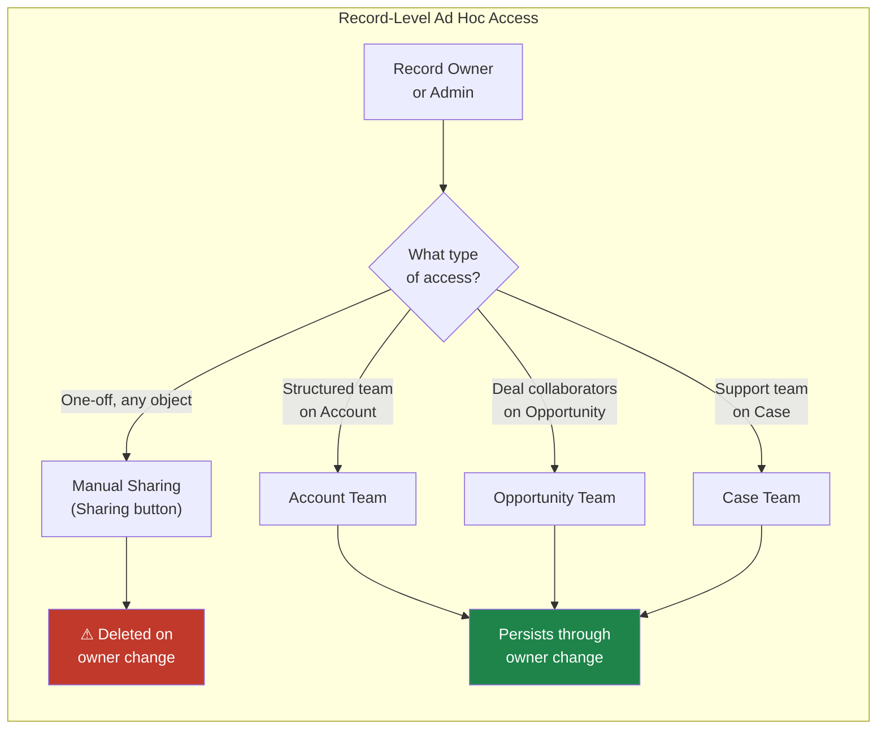
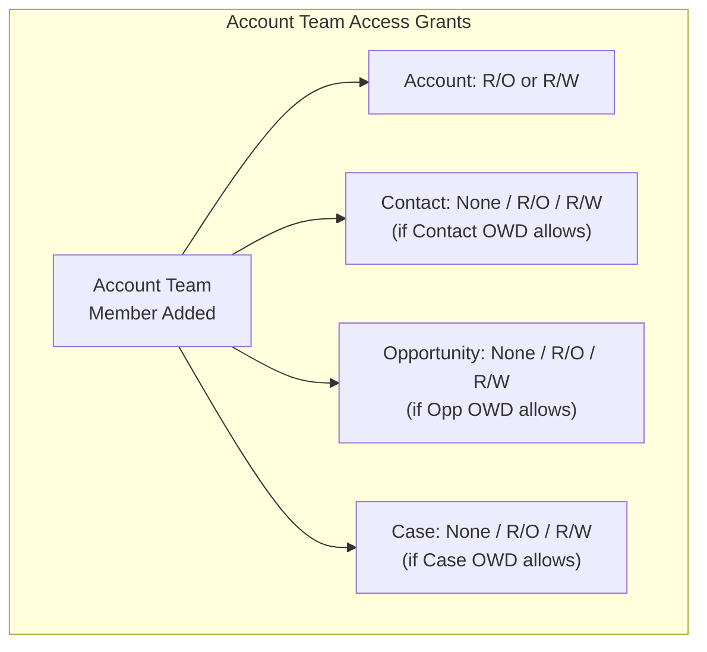

# Lecture 06 — Manual Sharing & Teams

## Exam Domain
Record-Level Access — 35% of exam weight

## Foundations

Sharing rules are admin-configured and apply uniformly across all qualifying records. But business relationships are messy — sometimes a record owner needs to grant a specific colleague access to one specific deal without any rule covering it. That's the gap manual sharing and teams fill.

Manual sharing is the "escape valve" in the sharing model: an ad hoc, per-record mechanism that lets record owners (and admins) extend access to users, roles, or groups on demand. Teams are a structured form of this — they let you pre-define a set of collaborators for an Account, Opportunity, or Case and assign each a specific access level.

Understanding when each mechanism applies — and critically, when access is revoked — is what the exam tests heavily.

---

## Core Concepts

### Manual Sharing

Manual sharing allows a record owner (or a user with "Modify All Data" or "Modify All" on the object) to share a specific record with:
- Individual users
- Roles
- Roles and Subordinates
- Public Groups

**How to use it**: The "Sharing" button appears on record detail pages when manual sharing is enabled. It is hidden on many Lightning pages by default and must be added to the page layout. In Classic, it appears automatically.

**Access levels**: Read Only or Read/Write (cannot grant Full Access via manual sharing unless you're the owner or an admin).

**Critical behavior — when manual shares are deleted**:
- When the **record owner changes**, all manual shares on that record are **automatically deleted**
- This is the #1 tested fact about manual sharing
- Exception: Owner-set shares (from the previous owner) are deleted; admin-set shares with "Modify All Data" may persist depending on how they were created

**Cannot do via manual sharing**:
- Grant "Full Access" (only Record Owners and Admins have this)
- Share with Guest Users (requires sharing rules or guest user profile)
- Survive an owner change (manual shares are owner-scoped)

### Account Teams

Account Teams let you define a set of users who collaborate on an Account, each with a specific role and access level.

**Configuration**:
- Setup > Account Teams
- Define team roles (e.g., Account Executive, Sales Engineer, CSM)
- Default team: users can configure a personal "Default Account Team" that auto-populates on new Accounts they own

**Access levels per team member**:
- Account Access: Read Only or Read/Write
- Contact Access: Read Only, Read/Write, or No Access (if Contact OWD permits)
- Opportunity Access: Read Only, Read/Write, or No Access
- Case Access: Read Only, Read/Write, or No Access

**Key behaviors**:
- Adding someone to an Account Team grants them access according to their configured access level
- Account Team members share the Account and optionally its related Opportunities, Contacts, and Cases
- Removing a member from the team revokes their team-granted access (but not access from other sharing mechanisms)
- Account Teams are governed by the "Account Teams" feature; must be enabled in Setup

### Opportunity Teams

Opportunity Teams define collaborators on a specific Opportunity deal.

**Configuration**:
- Team roles configured similarly to Account Teams
- Can have a Default Opportunity Team that auto-adds to new Opportunities
- Each team member gets: Read Only or Read/Write access to the Opportunity

**Key behaviors**:
- Opportunity Team members only access that specific Opportunity (not the parent Account unless separately shared)
- If Opportunity OWD is Private, team membership is required for cross-hierarchy access
- Team members do NOT automatically get Case or Contact access from the Opportunity Team

### Case Teams

Case Teams define collaborators on a support Case — typically used in complex support scenarios where multiple agents or external contacts work together.

**Configuration**:
- Can include internal users, portal users, and external contacts (with portal access)
- Each member assigned a Case Team Role
- Case Team Roles define access: Read Only or Read/Write

**Unique feature — Case Team Templates**:
- Admins can pre-define Case Team Templates with predefined roles
- Support agents can apply a template to add a standard set of team members to a Case in one action
- Useful for tiered support models (e.g., Tier 1 + Tier 2 + Engineering always work certain case types together)

### Template Teams

Both Account and Opportunity Teams support the concept of a **Default Team** (user-specific) and admin-defined **team templates**:

- **Default Account Team**: Configured per user; auto-adds to Accounts they create/own if enabled
- **Default Opportunity Team**: Same concept for Opportunities
- **Case Team Templates**: Admin-defined; applied by agents to Cases

### Manual Sharing vs Teams — Comparison

| Feature | Manual Sharing | Account/Opp Teams | Case Teams |
|---------|---------------|-------------------|-----------|
| Object scope | Any object | Account, Opp | Case |
| Granularity | Per record | Per record | Per record |
| Structured roles? | No | Yes | Yes |
| Survives owner change? | No | Yes (re-evaluated) | Yes |
| Auto-apply template? | No | Default Team | Team Template |
| Who can add? | Owner, Admin | Owner, Admin | Owner, Admin |
| External users? | Limited | No | Yes (portal) |
| Lightning button | Must add to page | Standard component | Standard component |

### When Manual Sharing Gets Deleted vs Retained

| Event | Manual Shares | Team Shares |
|-------|--------------|-------------|
| Record owner changes | **Deleted** | Re-evaluated (team persists) |
| User deleted from org | Shares removed | Team membership removed |
| Record deleted | Shares cascade delete | Team membership deleted |
| Sharing rule changes | Not affected | Not affected |
| OWD changes to more permissive | Still exist (harmless) | Still exist (harmless) |
| OWD changes to more restrictive | Still override (additive model) | Still override |

---

## PTA / SA Relevance

### When This Comes Up in Engagements

- Sales ops asks "why did my colleague lose access to that Opportunity when it was reassigned?" — classic manual sharing deletion on owner change
- Customer wants to track who is working an Account beyond the owner — Account Teams is the right answer
- Complex support model where multiple engineers need structured Case access — Case Team Templates
- Customer wants to automate team population when Accounts are created — Default Teams + flows that manage team membership programmatically

### Common Architecture Failures

1. **Manual sharing as a scalable mechanism**: Orgs that rely heavily on manual sharing accumulate thousands of ad hoc share records, creating performance issues and audit nightmares. Manual sharing is for exceptions, not the rule.

2. **Assuming manual shares survive owner changes**: The most common "bug" report from end users — "I shared this record and when it was reassigned, the person lost access." This is by design. Use Account Teams or Apex sharing if persistence is required.

3. **Teams not enabled**: Customer reports that Account Team functionality isn't working — it's a feature that must be explicitly enabled in Setup > Account Teams > Enable.

4. **Opportunity Team doesn't give Account access**: Adding someone to an Opp Team shares only the Opportunity. If they also need the parent Account, a separate sharing mechanism is needed.

5. **Lightning "Sharing" button missing**: In Lightning, the manual sharing button must be explicitly added to page layouts or Lightning pages. Classic showed it automatically. This surprises many orgs migrating from Classic.

### Enterprise Patterns

- **Overlay model**: Use Account Teams to represent the matrix of AE + SE + CSM overlaid on accounts — each role gets the right access level (AE: R/W, SE: R/O, CSM: R/W Contacts)
- **Deal room pattern**: Use Opportunity Teams to represent the deal team; auto-add via flow when opportunity stage changes to "Proposal"
- **Escalation team pattern**: Use Case Team Templates to pre-define the escalation team (Tier 2 agent + Engineering lead) that gets added when a Case is escalated

---

## Architecture

**Limitations & Tradeoffs:**

- Manual sharing: deleted on owner change — not suitable for persistent access requirements
- Cannot share with Guest Users via manual sharing (requires sharing rule or guest user profile settings)
- Account/Opportunity Teams: access levels cannot exceed what OWD + other sharing mechanisms provide as a floor
- Teams are record-specific — no org-wide team templates that auto-apply by rule (only Default Teams per user)
- Manual sharing at high volume creates performance issues (sharing group skew risk)
- The "Sharing" button must be explicitly added to Lightning page layouts — easy to miss during org-to-Lightning migrations
- Case Team Templates are powerful but require admin maintenance when team composition changes

---

## Key Facts to Memorize

- Manual shares are **deleted when the record owner changes** — this is the most tested manual sharing fact
- **Account Teams** grant access to the Account plus optionally Contacts, Opportunities, and Cases
- **Opportunity Teams** only grant access to the specific Opportunity — not the parent Account
- **Case Team Templates** are admin-defined templates that can be applied to Cases in bulk
- The **Sharing button** must be added to Lightning page layouts manually — it is not auto-included
- Manual sharing access levels: **Read Only or Read/Write** — no "Full Access" via manual sharing
- Account Teams must be enabled in **Setup > Account Teams > Enable Account Teams**
- **Default Account Team**: user-specific setting that auto-populates on new Accounts the user creates
- Teams survive owner changes (re-evaluated); manual shares do not
- Maximum team members per record: no hard platform limit documented, but large teams contribute to sharing skew

---

## Exam Traps

1. **Owner change deletes manual shares**: The most common trap. Exam presents a scenario where a rep loses access after reassignment — answer is manual shares were deleted.
2. **Opp Team = Account access?**: No. Opp Team shares the Opportunity only. A separate mechanism is needed for the parent Account.
3. **"Full Access" via manual sharing**: Not possible. Only record owners and admins with Modify All Data have Full Access.
4. **Lightning Sharing button**: Does not appear automatically in Lightning — must be added to page layout.
5. **Case Teams include external contacts**: Case Teams uniquely allow portal/community users and contacts — Account/Opportunity Teams do not include external contacts.
6. **Team feature enabled by default**: Account Teams are NOT enabled by default — a common trap when a question implies they should just work.

---

## Practice Questions

**Question 1**
A sales rep manually shares an Opportunity record with a colleague, granting Read/Write access. The following week, the Opportunity is reassigned to a different owner. What happens to the colleague's manual share?

A. The manual share persists — it was granted by the original owner and remains until explicitly removed  
B. The manual share is automatically deleted when the record owner changes  
C. The manual share is downgraded to Read Only but not deleted  
D. The manual share persists for 30 days, then is automatically cleaned up

**Answer: B**
**Explanation:** Manual shares are deleted automatically when the record owner changes. This is a fundamental characteristic of manual sharing — it is scoped to the owner who granted it. If persistent access is needed through owner changes, Account Teams or Apex managed sharing should be used instead.

**Why the others are wrong:**
- A: Manual shares do not persist through owner changes
- C: Shares are deleted, not downgraded
- D: There is no 30-day grace period — deletion is immediate on owner change

---

**Question 2**
A company uses Account Teams to manage their overlay sales model. A Solutions Engineer is added to an Account Team with Account Access = Read Only and Opportunity Access = Read/Write. Opportunity OWD is Private. What records can the Solutions Engineer access?

A. Only the Account record (Read Only)  
B. The Account (Read Only) and all Opportunities owned by the Account owner  
C. The Account (Read Only) and all Opportunities on that Account (Read/Write)  
D. The Account (Read/Write) — team membership elevates access to the highest level

**Answer: C**
**Explanation:** Account Team membership grants the configured access level to the Account and the related objects. With Account Access = Read Only and Opportunity Access = Read/Write, the SE can read the Account and read/write all Opportunities associated with that Account, regardless of OWD being Private.

**Why the others are wrong:**
- A: Account Teams grant access to related objects per the configured levels — Opportunity access is also granted
- B: "All Opportunities owned by the Account owner" is incorrect — the team grants access to Opportunities on that specific Account
- D: Access levels are set per object in the team configuration; the Account stays Read Only

---

**Question 3**
Which statement correctly describes the difference between Account Teams and Opportunity Teams?

A. Account Teams can include external community users; Opportunity Teams cannot  
B. Opportunity Teams grant access to the Opportunity and its parent Account; Account Teams only grant Account access  
C. Account Teams can grant access to Contacts, Opportunities, and Cases related to the Account; Opportunity Teams only grant access to the specific Opportunity  
D. Both Account Teams and Opportunity Teams automatically persist access when the record is deleted

**Answer: C**
**Explanation:** Account Teams are multi-object — they can grant configured access levels to the Account, related Contacts, Opportunities, and Cases. Opportunity Teams are single-object — they only grant access to the specific Opportunity record. They do not extend access to the parent Account.

**Why the others are wrong:**
- A: Case Teams (not Account Teams) can include portal/community users
- B: Opportunity Teams do NOT grant parent Account access
- D: All team memberships are deleted when the record is deleted

---

**Question 4**
A support manager wants to ensure that when a Case is escalated, a predefined set of Tier 2 agents and an Engineering lead are automatically available to add to the Case team in one action. What is the best configuration?

A. Create a Public Group containing the Tier 2 agents and Engineering lead; add the group via manual sharing  
B. Create a Case Team Template with the predefined roles and members; agents apply the template on escalation  
C. Create an Account Team with the engineering lead added; it will propagate to Cases automatically  
D. Use a sharing rule: Cases where Status = 'Escalated' are shared with the Engineering public group

**Answer: B**
**Explanation:** Case Team Templates are designed exactly for this scenario. An admin creates a template defining the team roles and members. Support agents can apply the template to a Case to add all team members at once. This is more structured than manual sharing and provides a repeatable, auditable pattern.

**Why the others are wrong:**
- A: Public group + manual sharing doesn't provide role-based team structure or template reuse
- C: Account Teams do not automatically propagate to Cases; Case access on Account Teams must be configured separately and doesn't auto-add team members
- D: A sharing rule grants access but doesn't add people to the Case Team or provide the structured role-based collaboration model

---

**Question 5**
A Salesforce admin is setting up a Lightning page for the Opportunity object. Users complain they cannot find the "Sharing" button to manually share records with colleagues. What is the most likely cause?

A. Manual sharing is not enabled for the Opportunity object  
B. The users' profiles do not have "Manage Sharing" permission  
C. The Sharing button must be added to the Lightning page layout; it is not included by default  
D. Manual sharing is only available in Salesforce Classic, not Lightning Experience

**Answer: C**
**Explanation:** In Lightning Experience, the Sharing button does not appear automatically on record pages. It must be explicitly added to the Lightning Record Page using the page layout editor or Lightning App Builder. This is a common post-migration issue when organizations move from Classic (where it appeared automatically) to Lightning.

**Why the others are wrong:**
- A: Manual sharing enablement is governed by OWD settings, not a separate per-object toggle
- B: There is no "Manage Sharing" permission — access to the Sharing button is based on record ownership and profile permissions (Modify All)
- D: Manual sharing is available in Lightning — it just requires the button to be added to the page
