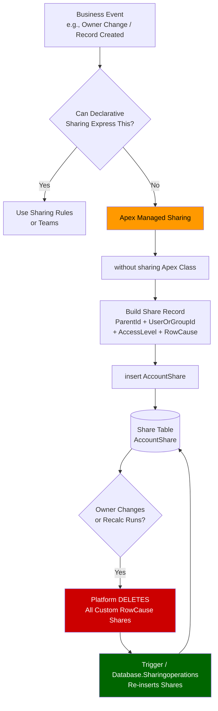

# Lecture 07 — Apex Managed Sharing

## Exam Domain
Record-Level Access — 35% of exam weight

---

## Foundations

Every declarative sharing mechanism in Salesforce has edges it cannot reach: OR logic across multiple fields, sharing based on related object fields, sharing that depends on external system data, time-based grants, or sharing that must survive owner changes while still being programmatically managed. When the business requirement cannot be expressed as a sharing rule, a team, or a territory assignment, Apex managed sharing is the answer.

Apex managed sharing lets developers directly insert, update, and delete records in the share object (`AccountShare`, `ContactShare`, `CustomObject__Share`) using standard Apex DML. It is the most flexible and powerful sharing mechanism in the Salesforce security model — and the one most likely to cause data integrity problems if implemented without understanding the platform's recalculation behavior.

The core mental model: **the sharing table is just another Salesforce table**. Apex writes to it, but the platform still owns the lifecycle of those rows when recalculations occur.

---

## Core Concepts

### Share Objects

Every shareable Salesforce object has a corresponding share object. These are platform-generated tables that store per-record, per-user/group access grants. They are never surfaced directly in the UI but are fully accessible in SOQL, Apex DML, and the Tooling API.

| Object | Share Object |
|---|---|
| Account | AccountShare |
| Contact | ContactShare |
| Opportunity | OpportunityShare |
| Lead | LeadShare |
| Case | CaseShare |
| Custom Object (Foo__c) | Foo__Share |

Standard objects use the `Share` suffix appended to the object API name. Custom objects use `__Share` in place of `__c`.

### Share Object Structure

Every share object has four critical fields:

| Field | Description |
|---|---|
| `ParentId` | ID of the record being shared (e.g., Account ID) |
| `UserOrGroupId` | ID of the User or Group (role, queue, public group) receiving access |
| `AccessLevel` | Level of access: `Read`, `Edit`, or `All` (owner-level) |
| `RowCause` | **Why** this share record exists — the sharing reason |

`RowCause` is the most exam-critical field. It determines whether a share record survives a recalculation.

### RowCause and Custom Sharing Reasons

The `RowCause` field can hold one of several system-defined values OR a developer-defined custom sharing reason:

**System RowCause values:**
- `Owner` — record owner (cannot be deleted manually)
- `Manual` — created by a user clicking the Sharing button (can be deleted by users with Modify All or higher)
- `Rule` — created by a sharing rule
- `Team` — created by an Account/Opportunity team
- `Territory` — created by territory management

**Custom RowCause (developer-defined):**
```apex
// In Setup: Object > Sharing Reasons, create "MyCustomReason"
// API name becomes: Schema.AccountShare.rowCause.MyCustomReason__c

AccountShare share = new AccountShare(
    ParentId       = acctId,
    UserOrGroupId  = userId,
    AccessLevel    = 'Edit',
    RowCause       = Schema.AccountShare.rowCause.MyCustomReason__c
);
insert share;
```

Key rule: **you must create the custom sharing reason in Setup before referencing it in Apex**. It will appear under Object Manager > [Object] > Sharing Reasons.

The system constant `Schema.[ObjectShare].rowCause.[Reason__c]` is the safe way to reference a custom sharing reason at compile time.

### Inserting Share Records

Apex managed sharing uses standard DML — no special syntax is required:

```apex
// Share an Account with a User at Edit level using a custom reason
AccountShare share = new AccountShare();
share.ParentId       = accountId;
share.UserOrGroupId  = userId;
share.AccessLevel    = 'Edit';
share.RowCause       = Schema.AccountShare.rowCause.RegionalPartner__c;
insert share;

// Bulk insert for governor limit efficiency
List<AccountShare> shares = new List<AccountShare>();
for (Id uid : userIds) {
    shares.add(new AccountShare(
        ParentId      = accountId,
        UserOrGroupId = uid,
        AccessLevel   = 'Read',
        RowCause      = Schema.AccountShare.rowCause.RegionalPartner__c
    ));
}
insert shares;
```

To delete a share record inserted by Apex:
```apex
// Query the exact share records you want to remove
List<AccountShare> toDelete = [
    SELECT Id FROM AccountShare
    WHERE RowCause = :Schema.AccountShare.rowCause.RegionalPartner__c
    AND ParentId = :accountId
];
delete toDelete;
```

You **cannot delete** share records with `RowCause = 'Owner'` or `RowCause = 'Rule'` — those are managed by the platform.

### Recalculation: The Critical Gotcha

This is the most exam-tested behavior of Apex managed sharing:

**When a record's owner changes, OR when a manual sharing recalculation runs, ALL share records with a non-`Manual` RowCause that were inserted by Apex are deleted by the platform.**

This means your Apex logic must re-insert the share records after an owner change. There are two architectural patterns:

**Pattern 1: Trigger-based re-insertion**
```apex
// AccountTrigger (after update)
trigger AccountTrigger on Account (after update) {
    List<Id> changedOwnerIds = new List<Id>();
    for (Account newAcct : Trigger.new) {
        Account oldAcct = Trigger.oldMap.get(newAcct.Id);
        if (newAcct.OwnerId != oldAcct.OwnerId) {
            changedOwnerIds.add(newAcct.Id);
        }
    }
    if (!changedOwnerIds.isEmpty()) {
        ApexSharingHandler.recalculate(changedOwnerIds);
    }
}
```

**Pattern 2: Implement `Database.Sharingoperations`**

For full recalculation support, implement the `Database.Sharingoperations` interface. This is called when an admin triggers "Recalculate" from Setup > Sharing Settings:

```apex
global class AccountSharingRecalc implements Database.Sharingoperations {
    global List<Database.SaveResult> recalculate(Id sharingGroupId) {
        // 1. Delete existing custom shares
        List<AccountShare> existing = [
            SELECT Id FROM AccountShare
            WHERE RowCause = :Schema.AccountShare.rowCause.RegionalPartner__c
        ];
        delete existing;

        // 2. Recalculate and re-insert
        List<AccountShare> newShares = buildShares();
        return Database.insert(newShares, false); // allOrNone = false
    }
}
```

### The `without sharing` Context

Apex that inserts share records must have the authority to write to the share table regardless of the running user's sharing access. By convention, the class that performs share DML is declared `without sharing`:

```apex
public without sharing class ApexSharingService {
    public static void grantAccess(Id recordId, Id userId) {
        AccountShare share = new AccountShare(
            ParentId      = recordId,
            UserOrGroupId = userId,
            AccessLevel   = 'Edit',
            RowCause      = Schema.AccountShare.rowCause.MyReason__c
        );
        insert share;
    }
}
```

If the class runs `with sharing`, the running user must already have access to write the share record — which defeats the purpose. `without sharing` ensures the sharing grant always succeeds regardless of context.

### When to Use Apex Managed Sharing

Use Apex managed sharing when:
- Sharing logic depends on a junction object relationship (e.g., "share this Account with all Users linked via a Project__c junction")
- Logic requires OR conditions across different fields
- Sharing must be conditional on values in related objects not reachable by criteria-based sharing rules
- Territory-like logic is needed for a custom object (territories only apply to Account/Contact/Lead/Opportunity by default)
- Access must be granted or revoked on a time-based schedule (scheduled Apex deletes/inserts shares)
- Access depends on data from an external system synchronized via integration

---

## PTA / SA Relevance

As a PTA advising enterprise customers:

**Architecture conversations:**
- When a customer proposes complex sharing logic using formula fields + criteria-based rules, validate whether the rule engine can actually express the logic. If not, Apex managed sharing is the right prescription.
- Custom sharing reasons must be documented in a data dictionary — they are object metadata and affect the sharing model's auditability.
- Warn customers that Apex managed sharing introduces a **maintenance dependency**: every owner-change path must be identified and trigger/recalculation logic must cover it. Missing a path leaves orphaned shares or missing shares.

**Common customer pitfalls:**
- Using `RowCause = 'Manual'` in Apex-inserted shares (not allowed; Manual is reserved for UI-created shares)
- Forgetting to handle the "owner reassignment" case — shares are silently deleted
- Not implementing `Database.Sharingoperations` — admin recalculations wipe shares with no automatic way to restore them
- Inserting share records in a `with sharing` context and getting silent failures or insufficient access errors

**Governance:**
- Apex managed sharing should be documented in the org's Security & Sharing Design document
- Custom sharing reasons are a deployment artifact — they must be included in change sets / unlocked packages

---

## Architecture Diagram



---

## Key Facts

1. Share objects follow naming convention: `ObjectShare` for standard, `Object__Share` for custom.
2. The four fields on every share object: `ParentId`, `UserOrGroupId`, `AccessLevel`, `RowCause`.
3. `RowCause = 'Manual'` is reserved — Apex cannot insert a share with this row cause.
4. Custom sharing reasons must be created in Setup (Object Manager > Sharing Reasons) before use in Apex.
5. `Schema.ObjectShare.rowCause.MyReason__c` is the compile-time safe reference.
6. When a record's owner changes, the platform **deletes all non-Manual Apex shares** for that record.
7. Admin-triggered recalculations also delete custom Apex shares.
8. Apex DML re-insertion is required after each owner change — typically via a trigger.
9. `Database.Sharingoperations` interface enables admin-triggered full recalculation.
10. Classes that manage shares should be declared `without sharing`.
11. Apex cannot set `AccessLevel = 'All'` — that is owner-only access.
12. Share DML is subject to governor limits (DML rows, SOQL queries).

---

## Exam Traps

- **Trap 1**: "Apex can use `RowCause = 'Manual'`" — FALSE. Manual is reserved for UI sharing. Apex must use a custom sharing reason.
- **Trap 2**: "Custom shares persist after the record owner changes" — FALSE. All custom RowCause shares are deleted on owner change.
- **Trap 3**: "You need to implement `Database.Sharingoperations` for Apex sharing to work" — FALSE. It is only required if you want admin-triggered recalculation to work. Trigger-based patterns work without it.
- **Trap 4**: "Apex in a `with sharing` class cannot insert share records" — MISLEADING. It may succeed if the user has access, but best practice is `without sharing` for reliability.
- **Trap 5**: "Deleting a share record with `RowCause = 'Owner'` is possible via Apex" — FALSE. Owner shares cannot be deleted.
- **Trap 6**: The interface is `Database.Sharingoperations` (lowercase 'o') — easy to mis-remember as `Database.SharingRecalculation`.

---

## Practice Questions

**Question 1**
A developer creates Apex code to share Account records with regional managers based on a custom junction object. Three months later, the sales operations team runs a mass owner reassignment tool that changes the OwnerId on 5,000 Account records. The regional managers report they can no longer see the Accounts. What is the most likely cause?

A. The Apex class was declared `with sharing`, preventing the shares from being created.
B. The platform deleted all custom RowCause share records when the owner changed, and there is no logic to re-insert them.
C. The custom sharing reason was not registered in Setup before the Apex ran.
D. The `Database.Sharingoperations` interface was not implemented, so the shares were never committed.

**Answer: B**
**Explanation:** When a record owner changes, the platform automatically deletes all share records with a custom RowCause. Without a trigger or recalculation class to re-insert them, the grants are permanently lost until Apex runs again.

**Why the others are wrong:**
- A: A `with sharing` declaration affects whether the Apex logic sees records, not whether it can insert share records — and the shares had been working for three months.
- C: If the custom sharing reason wasn't registered, the original insert would have thrown an exception; shares would never have been created.
- D: `Database.Sharingoperations` handles admin-triggered recalculations, not owner-change events. Its absence doesn't cause shares to be deleted.

---

**Question 2**
A developer writes the following Apex to share an Account:

```apex
AccountShare s = new AccountShare(
    ParentId      = acctId,
    UserOrGroupId = userId,
    AccessLevel   = 'Edit',
    RowCause      = 'Manual'
);
insert s;
```

What will happen when this code runs?

A. The share record is created successfully and the user gets Edit access.
B. A compile-time error occurs because `'Manual'` is not a valid RowCause.
C. A runtime exception is thrown because `'Manual'` is reserved for UI-created shares and cannot be set via Apex.
D. The share record is created but is immediately deleted because Manual shares are not persistent.

**Answer: C**
**Explanation:** `Manual` is a reserved RowCause value and cannot be assigned via Apex DML. The platform throws a runtime exception. Apex-inserted shares must use a custom sharing reason defined in Setup.

**Why the others are wrong:**
- A: The insert will fail at runtime — `Manual` is reserved.
- B: There is no compile-time validation of string values assigned to `RowCause` in older API versions; the error surfaces at runtime.
- D: Manual shares are persistent (until deleted by the user or admin), but the premise is wrong — the insert itself fails.

---

**Question 3**
An administrator navigates to Setup > Sharing Settings and clicks "Recalculate" for the Account object. A developer had previously implemented Apex managed sharing using a custom sharing reason `RegionalPartner__c`. After the recalculation completes, what is the state of those share records?

A. They remain intact because admin recalculations only affect sharing rules, not Apex shares.
B. They are deleted by the platform and restored automatically from the sharing rule cache.
C. They are deleted by the platform. If `Database.Sharingoperations` is not implemented, they will not be re-created.
D. They are deleted and then immediately re-inserted by the platform using the last known Apex logic.

**Answer: C**
**Explanation:** Admin-triggered recalculations delete all custom RowCause share records, just like an owner change. Unless the org implements `Database.Sharingoperations` (which is called during recalculation), those shares are permanently gone until the Apex is re-run by another event.

**Why the others are wrong:**
- A: Admin recalculations DO affect Apex shares with custom RowCause values.
- B: There is no "sharing rule cache" — shares must be programmatically re-created.
- D: The platform does not store or replay Apex logic; it cannot re-insert shares on its own.

---

**Question 4**
Which of the following is a valid reason to choose Apex managed sharing over criteria-based sharing rules?

A. The sharing grant depends on the OwnerId of the record, which criteria-based rules cannot reference.
B. The sharing logic requires evaluating a condition on a related object that is two levels above the target object in the hierarchy.
C. More than 300 sharing rules have already been defined for the object, which is the platform maximum.
D. The access level required is "All" (owner-level), which sharing rules cannot grant.

**Answer: B**
**Explanation:** Criteria-based sharing rules can reference fields on the object itself or its parent (one level up). Logic that depends on a grandparent object or a sibling/junction object requires Apex to query and evaluate those relationships and then insert the appropriate share records.

**Why the others are wrong:**
- A: Ownership-based sharing rules can reference `OwnerId` — that is their primary use case.
- C: The sharing rule limit per object is 300 total (criteria + ownership combined), but this alone doesn't mandate Apex — it might indicate a consolidation problem.
- D: `AccessLevel = 'All'` cannot be granted by Apex either; it is exclusive to the record owner. Neither sharing rules nor Apex can grant owner-level access.
