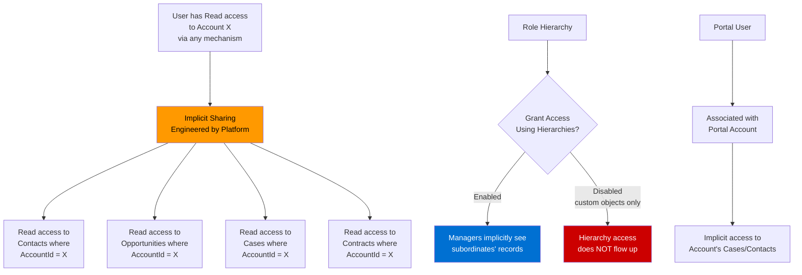

# Lecture 08 — Implicit Sharing

## Exam Domain
Record-Level Access — 35% of exam weight

---

## Foundations

Most sharing in Salesforce is explicit: you can point to the rule, the team entry, the group membership, or the Apex code that created it. Implicit sharing is different — it is access granted automatically by the platform based on relationships between records, without any sharing rule or configuration required.

Implicit sharing exists because Salesforce's data model has well-established parent-child relationships (Account → Contact, Account → Opportunity, Account → Case), and the platform assumes that if you can see the parent, you should be able to see its children. This assumption is baked into the core platform and **cannot be disabled**.

The practical consequence for architects: implicit sharing can cause unexpected record access. A user who has Read access to an Account will automatically see that Account's Contacts, Opportunities, and Cases — even if those child objects have a Private OWD and no sharing rule has been created.

The mental model: **implicit sharing flows downward from parent to child, and upward in the role hierarchy**.

---

## Core Concepts

### Account → Contact Implicit Sharing

If a user has Read or Read/Write access to an Account record (by any mechanism — ownership, sharing rule, manual share, or role hierarchy), that user automatically receives **Read access** to all Contacts whose AccountId field points to that Account.

This is true even if:
- Contact OWD is set to Private
- No sharing rule exists for Contact
- The user does not own any Contact records

The access level is always **Read** — you cannot implicitly get Edit access to Contacts via the Account relationship alone.

```
Account OWD: Public Read Only
Contact OWD: Private

User A owns Account X
  → User A has Read access to Account X's Contacts (implicit)

User B is granted Read access to Account X via a sharing rule
  → User B also has Read access to Account X's Contacts (implicit)
```

### Account → Opportunity Implicit Sharing

The same pattern applies to Opportunities. If a user has Read access to an Account, they automatically receive Read access to all Opportunities where `AccountId` equals that Account's ID.

This is why setting Contact and Opportunity OWD to Private does not fully isolate those records from Account viewers — the Account relationship creates an implicit read floor.

### Account → Case Implicit Sharing

Identical behavior for Cases. A user with Read access to an Account gets Read access to all Cases where `AccountId` references that Account.

### The Implicit Sharing Table

| Parent Object | Child Object | Implicit Access Granted | Condition |
|---|---|---|---|
| Account | Contact | Read | User can read the Account |
| Account | Opportunity | Read | User can read the Account |
| Account | Case | Read | User can read the Account |
| Account | Contract | Read | User can read the Account |

Note: The implicit grant is always Read, never Edit. Edit access to child records still requires the child OWD to be Public Read/Write, a sharing rule granting Edit, or ownership.

### Portal / Experience Cloud Implicit Sharing

External users (Customer Community, Partner Community, Experience Cloud) have a special implicit sharing relationship with their Account:

- A portal user is associated with a **portal Account** (the Account that owns the Contact which is the portal user's Person Contact).
- The portal user automatically receives access to that Account record and, by extension, to Cases and other child records linked to that Account.

This is how "customer can see their own cases" works without explicit sharing rules — the portal user's Account relationship implicitly surfaces those Cases.

For Partner Community users, implicit sharing extends further:
- A Partner user can see the Accounts and Opportunities associated with their partner portal account.

### Manager / Role Hierarchy Implicit Sharing

When **Grant Access Using Hierarchies** is enabled on an object (it is enabled by default and cannot be disabled for standard objects), managers in the role hierarchy automatically receive the **same level of access** as their subordinates to those subordinates' records.

This is implicit because no sharing rule is created. The platform computes the hierarchy access at query time.

```
Role Hierarchy:
  VP of Sales
    Regional Manager (West)
      Sales Rep A — owns Account X
      Sales Rep B — owns Account Y

If Grant Access Using Hierarchies = enabled:
  Regional Manager (West) implicitly sees Account X and Account Y
  VP of Sales implicitly sees ALL Accounts owned below them
```

For custom objects, "Grant Access Using Hierarchies" can be disabled — this is the only way to prevent role hierarchy implicit access on those objects.

### What Implicit Sharing Is NOT

- It is not a sharing rule — there are no rows in the SharingRule table for it
- It is not visible in any "Why can this user access this record?" audit tool (it is implied by the relationship itself)
- It cannot be disabled for standard objects
- It cannot be scoped — you cannot say "only implicit share Contacts for Accounts the user owns, not for Accounts they see via a sharing rule"

---

## PTA / SA Relevance

As a PTA advising enterprise customers:

**Security design conversations:**
- Customers often model Contact OWD as Private to protect sensitive personal data, then are surprised that users with Account access can see those Contacts. The architecture must account for implicit sharing when modeling data access requirements.
- The "need-to-know" analysis for child objects must include the question: "Who has access to the parent Account?" — because all of those users also see the child records.

**Common customer scenarios:**
- **Healthcare/Financial Services**: Contact records contain sensitive personal information. Even with Contact OWD = Private, all Account viewers see those Contacts. Solution: consider whether the business model should have Contacts related to a different Account, or whether a custom object with explicit sharing is needed.
- **Shared Account model**: Multiple teams share ownership of Account records (e.g., an Account team or Public Group owns the Account). Every member sees all linked Opportunities and Cases — this may be intentional or a security gap.
- **Experience Cloud**: Portal users see all Cases linked to their Account, which can be a feature (customer sees all company cases) or a liability (users see each other's support tickets).

**Mitigation options** (since implicit sharing cannot be disabled):
1. Use a separate "shell" Account for sensitive child records that fewer people have access to.
2. Ensure that only the appropriate users have Account access in the first place — implicit sharing is bounded by Account access.
3. For Cases in Experience Cloud, use Case visibility settings to further restrict what portal users see.

---

## Architecture Diagram



---

## Key Facts

1. Implicit sharing is **not configurable** — it is baked into the Salesforce platform.
2. Account → Contact, Opportunity, and Case implicit sharing grants **Read** access only.
3. Implicit sharing fires regardless of how the user obtained Account access (ownership, rule, manual share, hierarchy, Apex).
4. Setting Contact/Opportunity/Case OWD to Private does NOT prevent implicit sharing from the Account.
5. "Grant Access Using Hierarchies" is always enabled for standard objects and cannot be disabled.
6. For **custom objects**, "Grant Access Using Hierarchies" can be disabled — and this is the only object-level lever to suppress hierarchy-based implicit sharing.
7. Portal/Experience Cloud users receive implicit access to their portal Account's child records.
8. Implicit sharing is not visible as a discrete sharing rule in Setup — it is inferred from the data model.
9. Manager implicit sharing grants the same access level the subordinate has — not necessarily Edit.
10. Implicit sharing is evaluated **at query time** — there are no share rows in the share table for it.

---

## Exam Traps

- **Trap 1**: "Setting Contact OWD to Private prevents users with Account access from seeing Contacts" — FALSE. Implicit sharing overrides the Contact OWD floor.
- **Trap 2**: "Implicit sharing can be turned off for standard objects" — FALSE. It is a platform behavior, not a configuration.
- **Trap 3**: "A sharing rule is created behind the scenes for implicit sharing" — FALSE. No sharing rule rows are created; access is computed from the relationship.
- **Trap 4**: "Manager implicit sharing always gives Edit access" — FALSE. Managers get the same access level the subordinate record's OWD allows plus whatever the subordinate has — typically Read unless the OWD or a sharing rule grants Edit.
- **Trap 5**: "Implicit sharing only applies when Account OWD is Public Read Only" — FALSE. It applies regardless of Account OWD; any access to the Account triggers implicit access to children.
- **Trap 6**: "Experience Cloud users do not benefit from implicit sharing" — FALSE. Portal users have the most complex implicit sharing behavior, tied to their portal Account relationship.

---

## Practice Questions

**Question 1**
A company has the following OWD settings: Account = Public Read Only, Contact = Private, Opportunity = Private. A sales user owns an Account record. A colleague in a different role who does not own any Accounts or Contacts has been granted Read access to the owned Account via a sharing rule. What access does the colleague have to Contacts associated with that Account?

A. No access — Contact OWD is Private and no Contact sharing rule exists.
B. Read access — implicit sharing grants Read to Account-related Contacts.
C. Edit access — the Account sharing rule passes through to child records.
D. Read access only if the Contact is also owned by the same user as the Account.

**Answer: B**
**Explanation:** Implicit sharing grants Read access to all Contacts related to an Account whenever a user has any level of access to that Account. The Contact OWD being Private does not prevent this — implicit sharing is a platform behavior that sits below the OWD.

**Why the others are wrong:**
- A: Contact OWD being Private sets the baseline but does not block implicit sharing from the Account.
- C: Implicit sharing grants Read only — never Edit — regardless of the access level on the Account.
- D: Contact ownership is irrelevant; the relationship is between the Account and the Contact, not between the users.

---

**Question 2**
An Experience Cloud customer portal allows customers to submit support cases. The portal is built on a Customer Community license. A user from Company A logs into the portal and can see Cases submitted by their colleague from Company A who used a different login. There are no sharing rules configured. What is the most likely cause?

A. A public group sharing rule is granting access across the company.
B. Portal users have "View All" access on the Case object by default.
C. Implicit sharing gives portal users Read access to all Cases linked to their portal Account.
D. The portal administrator manually shared each case with the customer community.

**Answer: C**
**Explanation:** Experience Cloud portal users have an implicit sharing relationship with their associated Account. All Cases where AccountId points to that Account are implicitly visible to all portal users of that Account. This is the default behavior and requires no sharing rule configuration.

**Why the others are wrong:**
- A: No public group sharing rule was configured per the scenario.
- B: Customer Community licenses do not grant "View All" on Cases by default — that would be a significant security gap.
- D: Manual sharing at scale for every Case is not feasible and is not the default behavior described.

---

**Question 3**
An architect is designing a custom object called Sensitive_Note__c that should only be visible to the owning user — not to managers in the role hierarchy, and not to anyone else. Which combination of settings achieves this?

A. Set Sensitive_Note__c OWD to Private; the role hierarchy is automatically excluded.
B. Set Sensitive_Note__c OWD to Private and disable "Grant Access Using Hierarchies" on the object.
C. Set Sensitive_Note__c OWD to Private and set the org-wide default for role hierarchy to "No Hierarchy."
D. Use Apex managed sharing with a custom RowCause to explicitly grant access only to the owner.

**Answer: B**
**Explanation:** For custom objects, "Grant Access Using Hierarchies" can be disabled in Setup. With OWD = Private and hierarchy sharing disabled, no implicit upward access flows to managers. The record is visible only to its owner and System Administrators with "View All Data."

**Why the others are wrong:**
- A: Setting OWD to Private makes records visible only to owners by default, but "Grant Access Using Hierarchies" is still enabled, so managers still see subordinates' records implicitly.
- C: There is no org-wide "No Hierarchy" setting — "Grant Access Using Hierarchies" is controlled per object (custom objects only).
- D: Apex managed sharing is used to grant additional access, not to restrict implicit hierarchy sharing. You can't use Apex to block the hierarchy.

---

**Question 4**
Which statement most accurately describes implicit sharing between Account, Contact, and Opportunity objects?

A. Implicit sharing between Account and Contact is configurable in Setup; it can be disabled per Account record type.
B. A user with Edit access to an Account automatically receives Edit access to that Account's related Contacts and Opportunities.
C. A user with any level of access to an Account automatically receives Read access to that Account's related Contacts and Opportunities, regardless of OWD settings on those objects.
D. Implicit sharing only applies if the Account OWD is set to Public Read Only or higher.

**Answer: C**
**Explanation:** Implicit sharing is an unconditional platform behavior. Any access to the Account (Read or Edit) triggers Read access to its related Contacts and Opportunities. The child objects' OWD settings do not block this — OWD determines the baseline for users who have no explicit or implicit access, but implicit sharing from the Account overrides that floor.

**Why the others are wrong:**
- A: Implicit sharing between Account and Contact is not configurable — it cannot be disabled or scoped by record type.
- B: Implicit sharing always grants Read access only, never Edit, regardless of the access level on the Account.
- D: The Account OWD is irrelevant to whether implicit sharing fires; it fires whenever any user gets any access to an Account record, by any mechanism.
