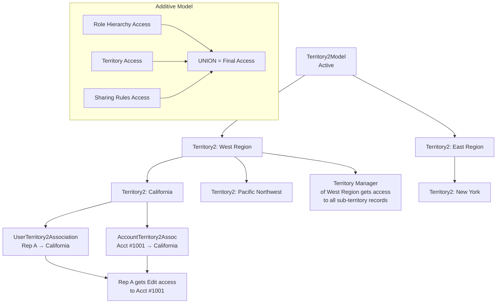
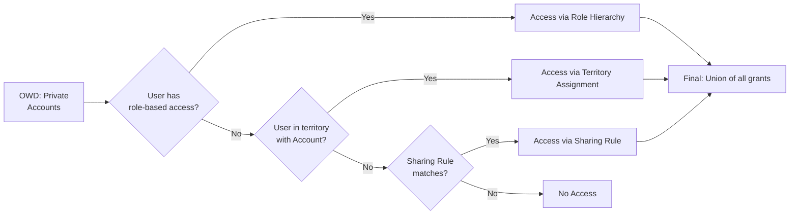

# Territory Management & Sharing

## Exam Domain
Record-Level Access — 35% of exam weight

## Foundations

Enterprise Territory Management (ETM) exists because Salesforce's standard role hierarchy was built around reporting structure — who reports to whom. But sales organizations also need to control access by geographic region, product line, or named account segment. A rep in the Northeast shouldn't automatically see Southeast accounts just because they share a VP.

ETM solves this by introducing a parallel, independent hierarchy of territories. Think of it as a second access tree that runs alongside the role tree. A user can belong to multiple territories simultaneously. Access from both trees is additive — the user always gets the union of what both grant.

ETM is available in Enterprise Edition and above. It applies natively to Accounts and Opportunities. It is the mechanism Salesforce recommends when your access design is driven by business territory alignment rather than org chart position.

## Core Concepts

**Territory Model States**

A Territory2Model object tracks the lifecycle of a territory model. The three states are Planning, Active, and Archived. Only one model can be in Active state at a time per org. Planning lets you build and test a model without affecting live sharing. Activating a new model deactivates the current one. Archiving a model removes it from active use but retains historical data.

Changing territory model state while Active triggers a sharing recalculation across all associated records — this can be significant in large orgs and should be planned during off-peak windows.

**ETM Object Model**

| Object | Purpose |
|---|---|
| Territory2Model | The container — represents one full territory model |
| Territory2Type | A category label for territories (e.g., "Region", "Named Account") |
| Territory2 | An individual territory node within the model |
| UserTerritory2Association | Links a user to a territory |
| AccountTerritory2Assoc | Links an Account to a territory |
| ObjectTerritory2Association | Configures which standard objects participate in territory sharing |

**Account Assignment — Rule-Based and Manual**

Territory assignment rules are criteria-based filters (e.g., BillingState = "CA"). When criteria are met, an AccountTerritory2Assoc record is created automatically. Accounts can match multiple territories and be assigned to all of them simultaneously.

Manual assignment bypasses rules — useful for named accounts or exceptions that don't fit standard criteria.

Assignment rules run **asynchronously**. In large orgs with complex rule sets and hundreds of thousands of accounts, rule evaluation can take hours and generates async jobs. This is a critical design consideration when territory models are first activated or when rules change.

**Access Levels Granted by Territory**

When a user is assigned to a territory, they receive access to Accounts in that territory at the territory's configured access level:
- View — read-only
- Edit — read/write
- Full — read/write/delete/transfer (rarely used for territories)

**Opportunity Access via Territory**

By default, Opportunities inherit the territory of their parent Account. If an Account is in Territory A, Opportunities on that Account are accessible to Territory A members. Territory can also be set manually on the Opportunity record.

**Territory Hierarchy — Manager Access**

The Territory2 hierarchy functions like the role hierarchy for territory members. If a user manages a parent territory, they gain access to records in all subordinate territories. This is controlled by the territory model's hierarchy structure, not the role hierarchy.

**Territory vs. Role Hierarchy — Critical Distinction**

These are completely independent trees. A user participates in both simultaneously. Access from role hierarchy and access from territory assignment are combined additively — the user always receives the union of both grants plus any applicable sharing rules.

This means: even if a user has no access via role hierarchy to a given Account, they can still access it if their territory assignment covers it. The converse is also true.

**Territory-Based Forecasting**

When ETM is enabled, forecasting can use the territory hierarchy rather than the role hierarchy. This is a key differentiator — sales forecasts roll up along territory lines, not management reporting lines, which is the expected behavior for most sales orgs.

**When NOT to Use ETM**

- When access segmentation is not geographic or segment-based (use sharing rules instead)
- When your org has very few users and simple account assignment needs
- When administrative overhead of maintaining territory models outweighs the benefit
- When records requiring territory access are not Accounts or Opportunities (ETM has limited native object support)

ETM adds substantial administrative complexity. Territory rule maintenance, model lifecycle management, and async recalculation behavior all require ongoing operational effort. Architects should qualify whether the access model actually demands territory management or whether criteria-based sharing rules would be sufficient.

---

## PTA / SA Relevance

### When This Comes Up in Engagements

Territory Management surfaces most often in Sales Cloud implementations for mid-to-large enterprises with defined regional or segment-based sales structures. Common triggers: the customer has a named-account program, geographic territories, or overlay sales teams. It also comes up when customers want Salesforce forecasting to align to territory structure rather than management hierarchy.

Account executives and sales ops teams often conflate "territory" with "role hierarchy" — the architect's job is to clarify these are separate mechanisms and that both are needed in most mature sales orgs.

### Common Architecture Failures

- **Using role hierarchy alone to model territories** — creates a bloated role tree with hundreds of nodes, one per territory combination; extremely difficult to maintain and causes deep hierarchy performance issues.
- **Activating a new territory model during business hours** — triggers large-scale async sharing recalculation; should always be done in a maintenance window.
- **Expecting synchronous rule evaluation** — teams build integrations or automations that assume territory assignment is immediate after account creation; async latency breaks downstream logic.
- **Over-relying on manual territory assignment** — at scale (10,000+ accounts), manual assignment is unmanageable; proper criteria-based rules are required.
- **Mixing territory and role hierarchy forecasting without alignment** — if some users forecast by territory and the hierarchy doesn't match expectations, rollups are incorrect.

### Enterprise Patterns

- **Overlay/Specialist Model**: Field sales reps own accounts by geography; overlay specialists (product specialists, solution engineers) are assigned to territories without owning records. ETM handles the read access for overlays cleanly without changing ownership.
- **Named Account Program**: Key accounts are manually assigned to a "Named Accounts" territory and also managed by a dedicated territory type; this ensures the named account team always has access regardless of geographic territory boundaries.
- **Territory + Role Hybrid**: Role hierarchy governs manager access for performance reviews and standard reports; ETM governs sales territory access for record visibility. Both coexist and complement each other.

---

## Architecture

**Limitations & Tradeoffs:**

- Only one Active territory model at a time — model transitions require planning and carry recalculation risk
- Territory assignment rules run asynchronously — not suitable for use cases that require immediate access after record creation
- ETM is natively supported on Accounts and Opportunities; other objects require custom configuration
- Territory hierarchy manager access mirrors role hierarchy behavior but is a separate grant — does not replace role hierarchy for standard manager visibility
- Complex territory models with hundreds of territories and thousands of accounts have known performance implications during rule evaluation
- Territory model changes (rule edits, user assignment changes) all trigger async recalculation jobs

---

## Key Facts to Memorize

- Territory2, Territory2Model, Territory2Type, UserTerritory2Association, AccountTerritory2Assoc, ObjectTerritory2Association are the six key ETM objects
- Only ONE territory model can be Active at a time
- Territory assignment rules run ASYNCHRONOUSLY
- Territory access is ADDITIVE with role hierarchy — users get the union
- Territory hierarchy grants managers access to sub-territory records (mirrors role hierarchy behavior for territories)
- ETM primarily applies to Accounts and Opportunities
- Territory-based forecasting uses the territory hierarchy, not the role hierarchy
- Changing territory model state triggers sharing recalculation
- Territory model states: Planning → Active → Archived

---

## Exam Traps

- **Trap**: "Territory access replaces role hierarchy access." — FALSE. They are independent and additive.
- **Trap**: "Multiple territory models can be active simultaneously." — FALSE. Only one can be Active at a time.
- **Trap**: "Territory assignment rules run immediately when an Account is saved." — FALSE. Rules run asynchronously.
- **Trap**: "A territory manager automatically manages all records their reports own." — Partially true but wrong framing. Territory manager access flows through the territory HIERARCHY, not through user reporting relationships.
- **Trap**: Assuming territories apply to all objects equally — ETM natively covers Accounts and Opportunities; other objects need separate configuration.

---

## Practice Questions

**Question 1**

A global company uses both Enterprise Territory Management and a role hierarchy. A sales rep is assigned to the "West Coast" territory, which includes Account #5500. The same rep is two levels below the Account owner in the role hierarchy and does NOT have role-based access to Account #5500. The Account OWD is Private. Can the rep access Account #5500?

A) No — OWD is Private and the rep has no role-based access  
B) No — territory access only supplements role hierarchy access, it cannot grant independent access  
C) Yes — territory assignment grants access independently of role hierarchy  
D) Yes — but only if a sharing rule also exists  

**Answer: C**

Territory access is completely independent of role hierarchy access. Because access from all mechanisms is additive (union), the rep receives access through their territory assignment even though role hierarchy grants nothing. OWD sets the floor but sharing mechanisms — including territories — can open access above that floor.

Why A is wrong: OWD Private means access is closed by default, but sharing mechanisms (including territory) can open it.  
Why B is wrong: Territory access is an independent grant, not a supplement that requires a role-based floor.  
Why D is wrong: No sharing rule is needed; territory assignment alone is sufficient.

---

**Question 2**

A territory manager is assigned to the "West Region" territory. West Region has two child territories: California and Pacific Northwest. The territory manager is NOT directly assigned to California or Pacific Northwest. Which records does the territory manager have access to?

A) Only records in the West Region territory itself  
B) Records in West Region, California, and Pacific Northwest territories  
C) Records in California and Pacific Northwest only, not West Region  
D) No records — territory managers must be directly assigned to each territory  

**Answer: B**

The territory hierarchy functions like the role hierarchy. A user assigned to a parent territory gains access to records in all subordinate territories, in addition to records in the parent territory itself. This is the "manager access" behavior of the territory hierarchy.

Why A is wrong: The hierarchy grants access downward to all child territories.  
Why C is wrong: The manager has access to the parent territory as well as all children.  
Why D is wrong: Explicit assignment to each child territory is not required; hierarchy inheritance handles it.

---

**Question 3**

An architect is configuring a new territory model for an org that already has an Active territory model. The new model has been built and tested in Planning state. What must be true when the architect activates the new model?

A) Both models can be Active simultaneously during a transition period  
B) The existing Active model will automatically move to Archived state  
C) The existing Active model will automatically move to Planning state  
D) The existing Active model must be manually deactivated first, then the new model can be activated  

**Answer: D**

Only one territory model can be Active at any time. Before activating a new model, the current Active model must be deactivated (moved to Planning or Archived). This triggers sharing recalculation and should be planned carefully.

Why A is wrong: Simultaneous active models are not supported — there is always exactly one Active model or none.  
Why B is wrong: The transition does not happen automatically; the existing model does not auto-archive.  
Why C is wrong: Returning an Active model to Planning is not the standard transition path and does not happen automatically.

---

**Question 4**

A company has 50 sales territories and 10,000 Accounts. Their Account OWD is Private. Territory assignment rules are criteria-based (BillingState). An integration creates 500 new Accounts every night. The integration team reports that territory-based access is not available on new accounts until the following morning. What is the most likely cause?

A) The territory model is in Planning state and not Active  
B) Territory assignment rules run asynchronously and there is a processing delay  
C) Integration users cannot trigger territory assignment rules  
D) Territory assignment requires manual approval for bulk-created records  

**Answer: B**

Territory assignment rules evaluate asynchronously. When records are created in bulk — especially via integration — the async jobs that evaluate rules and create AccountTerritory2Assoc records run in a queue. For large orgs with complex rules and high record volumes, this queue processing can take hours, creating the delay described.

Why A is wrong: If the model were in Planning state, no territory access would exist at all, not just a delay.  
Why C is wrong: Integration users trigger territory rules the same as any other context; rule evaluation is not user-context-dependent.  
Why D is wrong: No manual approval mechanism exists in standard territory rule processing.
