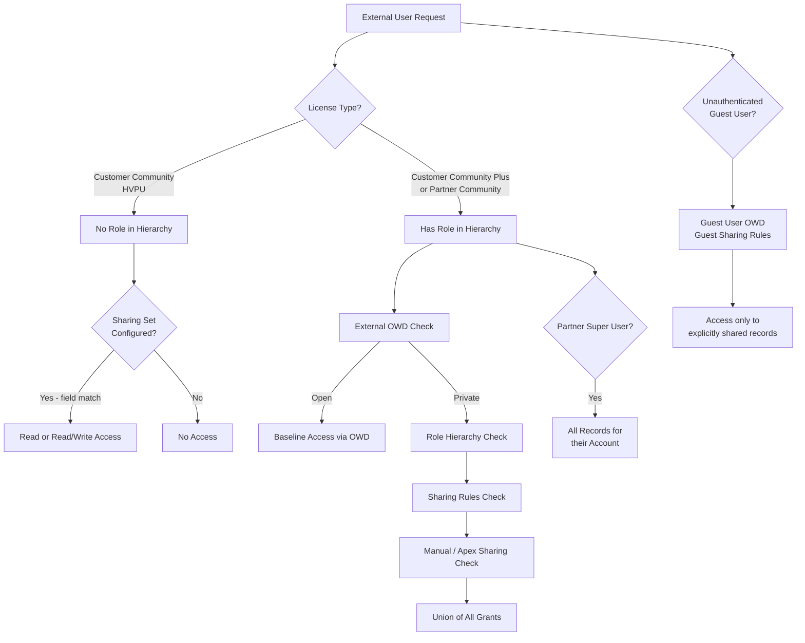

# Communities & Partner Sharing (Experience Cloud)

## Exam Domain
Communities / Experience Cloud — 15% of exam weight

## Foundations

Salesforce's standard sharing model was designed for internal employees — people inside the org who have Salesforce licenses and participate in the role hierarchy. Experience Cloud (formerly Communities) extends access to external users: customers, partners, and unauthenticated guests.

The moment external users are introduced, the sharing model bifurcates. Internal users and external users can have different baseline access to the same objects. A customer portal user should not see all Accounts in the org just because an employee can. This is enforced through the External OWD setting and a separate set of sharing mechanisms designed specifically for external access.

Getting this wrong is one of the most common security vulnerabilities in Salesforce implementations. Architects must understand not just how to grant access to external users, but also the hard constraints on what mechanisms can be used for which license types.

## Core Concepts

**External OWD — The Second Floor**

Every object with an OWD setting has a separate External OWD setting for objects exposed to Experience Cloud. The External OWD can be equal to or MORE restrictive than the Internal OWD. It cannot be more permissive.

Examples:
- Internal: Public Read Only / External: Private — valid
- Internal: Public Read/Write / External: Public Read Only — valid
- Internal: Private / External: Private — valid (same)
- Internal: Private / External: Public Read Only — INVALID (external more permissive than internal)

Objects with External OWD settings include: Accounts, Contacts, Leads, Opportunities, Cases, and others. The External OWD is set under Setup > Sharing Settings alongside the internal OWD.

**Experience Cloud License Types**

| License | Has Role in Hierarchy | Sharing Mechanism |
|---|---|---|
| Customer Community | No | Sharing Sets only |
| Customer Community Plus | Yes | Role hierarchy + Sharing Rules |
| Partner Community | Yes (full role) | Role hierarchy + Sharing Rules |
| External Apps | Varies | Configuration-dependent |

The critical divide is between High-Volume Portal Users (HVPU) — Customer Community license holders — and standard portal users who have roles.

**High-Volume Portal Users (HVPU)**

HVPU (Customer Community license) are designed for consumer-scale portals — hundreds of thousands or millions of users. They have NO role in the role hierarchy. This is intentional: placing millions of external users into the role hierarchy would destroy sharing performance.

Because they have no role, standard sharing rules and role-based access do not apply to HVPU. The only sharing mechanism for HVPU is Sharing Sets.

**Sharing Sets**

A Sharing Set grants HVPU access to records based on a relationship between the user and the record. The configuration specifies: "Share records where [User field] matches [Record field]." The most common configuration: User.AccountId = Record.AccountId — gives the portal user access to all records associated with their Account.

Sharing Sets have important constraints:
- Only work on a subset of objects (Accounts, Contacts, Cases, Service Contracts, and a few others — not Opportunities natively)
- Grant only Read or Read/Write access (not Full)
- Do NOT support complex logic — only direct field-to-field relationship matching
- Cannot be used to share to specific users directly — access is always based on field relationships

**Standard Portal Users (Customer Community Plus / Partner Community)**

These users DO have roles in the role hierarchy. Their role sits below the Account Executive (internal user) who owns their Account. They participate in standard sharing rules, ownership-based sharing, and role hierarchy access.

For these users, the full sharing toolkit applies: OWD, role hierarchy, sharing rules (ownership-based and criteria-based), manual sharing, and Apex sharing.

**Sharing Groups for Experience Cloud**

Salesforce auto-creates special sharing groups for each Experience Cloud site:
- AllCustomerPortalUsers — all Customer Community and Customer Community Plus users
- AllPartnerUsers — all Partner Community users
- AllExternalUsers — all external users across all sites

These groups can be used as targets in internal sharing rules to expose records to all portal users of a given type.

**Partner Super User Access**

Partner Community users can be granted the "Portal Super User" permission. A Partner Super User can see ALL records (Opportunities, Cases, Contacts) associated with their Account — not just the records they personally own or are directly shared to them.

This effectively gives the partner user "View All" scoped to their Account's data. It is the correct pattern when a partner company needs an admin user who manages all business for their account in the portal.

Without Super User access, a Partner Community user only sees records they own or that are explicitly shared to them. Two reps at the same partner company cannot see each other's opportunities by default.

**Guest User Sharing**

Guest users are completely unauthenticated — they have no user record in the system in the traditional sense. They use the "Guest User" profile associated with the Experience Cloud site. Guest users cannot participate in the role hierarchy.

Sharing for guest users:
- Objects must have "Guest User Sharing Rules" enabled (a separate setting in Sharing Settings)
- Criteria-based sharing rules can be created to share records with the Guest User group for that site
- A separate "Guest User Default Access" OWD setting controls the baseline (typically Private or Read Only)
- Least-privilege is critical — improperly configured guest access is a major security risk

**Account Hierarchy and Portal Access**

A portal user's Account parent hierarchy does NOT grant upward access. A contact associated with a child Account does not see records belonging to the parent Account. This differs from how internal role hierarchy works and surprises many architects.

**Contact-to-Multiple-Accounts**

A Contact can be related to multiple Accounts via the AccountContactRelationship object. However, this relationship does not automatically grant portal access to records of the secondary accounts. Portal access is still driven by the user's primary Account (the AccountId on the User record).

**Person Accounts and Portal**

Person Accounts (where Account and Contact merge into a single record) can be enabled as portal users. The person contact is the portal user. This is common in B2C scenarios. Standard sharing behaviors apply with some nuances around the merged Account/Contact record.

**Communities + Territory**

External portal users are generally NOT participants in Enterprise Territory Management. Territory assignment and territory hierarchy access do not apply to external users. Access for external users is governed entirely by OWD, Sharing Sets, sharing rules, and portal-specific mechanisms.

---

## PTA / SA Relevance

### When This Comes Up in Engagements

Any time a customer wants to expose Salesforce data to external parties — customers, partners, distributors, suppliers — Experience Cloud sharing architecture becomes the design challenge. Common scenarios: customer self-service portals (HVPU at scale), partner relationship management portals (Partner Community with full role participation), and public-facing websites (Guest user).

The "External OWD is too open" problem is one of the most common security findings in Salesforce health checks. Architects frequently encounter orgs where External OWD was left at Public Read Only, inadvertently exposing internal Account and Contact data to all portal users.

### Common Architecture Failures

- **Leaving External OWD at default (Public Read Only) when the org has a portal** — all portal users can read all Accounts and Contacts; major data exposure risk
- **Using sharing rules to share records to HVPU** — standard sharing rules do not apply to HVPU; only Sharing Sets work; the sharing rule silently does nothing for these users
- **Assuming portal user role hierarchy access works the same as internal** — portal users have roles, but their role is below their Account Executive; access upward through parent Accounts does not follow the same path as internal users expect
- **Not enabling Partner Super User when partner admins need account-wide visibility** — results in partners unable to see colleague records, driving constant manual sharing requests
- **Granting guest users broad access by misconfiguring the Guest User profile** — guest users should have the most restrictive access possible; profile permissions compound with sharing

### Enterprise Patterns

- **Consumer Portal at Scale**: Use Customer Community (HVPU) + Sharing Sets. Never put millions of users in the role hierarchy. Design Sharing Set relationships carefully — typically User.AccountId = Case.AccountId for customer service scenarios.
- **Partner Relationship Management**: Use Partner Community + role hierarchy. Grant Super User access to one designated admin per partner account. Use criteria-based sharing rules for segmented record access.
- **Authenticated + Guest Hybrid Portal**: Public pages use Guest User with criteria-based rules on a "IsPublic" field. Authenticated users get Customer Community license + Sharing Sets for personalized data.
- **Internal + External Collaboration**: Chatter groups, Files, and record-level collaboration between internal and external users — use the AllPartnerUsers group in sharing rules to expose specific record subsets to all partner users without individual sharing.

---

## Architecture

**Limitations & Tradeoffs:**

- Sharing Sets only support a limited set of objects — cannot use them natively for Opportunities
- Sharing Sets grant only Read or Read/Write — no Full access for HVPU
- External OWD cannot be more permissive than Internal OWD — a constraint that sometimes forces Internal OWD to be more restrictive than desired for internal users
- Partner Super User grants account-wide access — there is no middle ground between "own records only" and "all account records" without custom Apex sharing
- Guest User sharing is powerful but dangerous — misconfiguration is a leading cause of data exposure in Salesforce orgs
- Portal user role hierarchy is subordinate to the Account Executive role — hierarchy depth can grow quickly in partner-heavy orgs

---

## Key Facts to Memorize

- External OWD can be MORE restrictive but NEVER MORE permissive than Internal OWD
- Customer Community (HVPU) users have NO role — only Sharing Sets apply
- Sharing Sets work by field-to-field relationship matching (User field = Record field)
- Sharing Sets grant Read or Read/Write only (no Full access)
- Customer Community Plus and Partner Community users HAVE roles in the hierarchy
- Partner Super User = access to ALL records (Opps, Cases, Contacts) for their Account
- Guest users = unauthenticated; require Guest Sharing Rules and careful OWD config
- Standard sharing rules DO NOT work for HVPU
- AllCustomerPortalUsers, AllPartnerUsers, AllExternalUsers are auto-created sharing groups
- Portal user Account hierarchy access does NOT propagate upward to parent Accounts

---

## Exam Traps

- **Trap**: "You can use sharing rules to give HVPU users access to records." — FALSE. Standard sharing rules are ignored for HVPU. Only Sharing Sets work.
- **Trap**: "External OWD can be set to Public Read/Write even if Internal OWD is Private." — FALSE. External can only be equal to or more restrictive than Internal.
- **Trap**: "A portal user's role hierarchy access works exactly like an internal user's." — FALSE. Portal user roles sit below the Account Executive and have different inheritance behavior, especially around Account parent hierarchies.
- **Trap**: "Partner Super User can see records across all Accounts in the portal." — FALSE. Super User access is scoped to records associated with their OWN Account.
- **Trap**: "Guest users automatically see records based on object OWD." — FALSE. Guest User OWD is a separate setting; by default guests see nothing without explicit sharing configuration.

---

## Practice Questions

**Question 1**

A retail company has 2 million customer portal users on Customer Community (HVPU) licenses. Customers need to see their own Cases. Which mechanism correctly grants this access?

A) Create a sharing rule that shares Cases owned by portal users with the AllCustomerPortalUsers group  
B) Create a Sharing Set on Cases where User.AccountId equals Case.AccountId  
C) Grant portal users the "View My Cases" custom permission  
D) Set the Case External OWD to Public Read Only  

**Answer: B**

HVPU users have no role and cannot participate in sharing rules. The only sharing mechanism that works for HVPU is a Sharing Set. The correct configuration shares Cases where the portal user's AccountId matches the AccountId on the Case, giving each customer access to their own account's cases.

Why A is wrong: Sharing rules are not evaluated for HVPU users — they are silently ineffective for this license type.  
Why C is wrong: Custom permissions control feature access, not record visibility. They do not grant sharing access.  
Why D is wrong: Setting External OWD to Public Read Only would expose ALL Cases to ALL portal users, not just their own.

---

**Question 2**

An architect is configuring an Experience Cloud portal. Internal OWD for Accounts is set to Private. The business wants internal users to have Public Read/Write access to Accounts, but external portal users should see only their own Account. Which External OWD setting is valid?

A) Set External OWD to Public Read Only  
B) Set External OWD to Public Read/Write  
C) Set Internal OWD to Public Read/Write; External OWD cannot be more restrictive  
D) Set Internal OWD to Public Read/Write; set External OWD to Private  

**Answer: D**

External OWD can be more restrictive than Internal OWD. To give internal users Public Read/Write access while restricting external users to only their own Account (Private), set Internal OWD to Public Read/Write and External OWD to Private. Then use Sharing Sets to grant each portal user access to their specific Account.

Why A is wrong: Public Read Only External OWD would expose all Accounts to all portal users, not just their own.  
Why B is wrong: Public Read/Write External OWD would give all portal users write access to all Accounts — a security disaster.  
Why C is wrong: External OWD CAN be more restrictive than Internal OWD; that is exactly the intended use case.

---

**Question 3**

A company uses a Partner Community portal. A partner company has 50 employees who all need to see each other's Opportunities in the portal. What is the correct architectural approach?

A) Create 50 manual sharing rules sharing each user's Opportunities to each other user  
B) Create a criteria-based sharing rule sharing all Opportunities to the AllPartnerUsers group  
C) Grant one designated partner employee the Portal Super User permission  
D) Change the Opportunity External OWD to Public Read Only  

**Answer: C**

Partner Super User access grants a portal user visibility into ALL Opportunities, Cases, and Contacts associated with their Account — not just their own. This is the purpose-built mechanism for partner account admins. With one Super User per partner company, that user can see all 50 employees' Opportunities.

Why A is wrong: Manual sharing at this scale is operationally unmanageable and requires maintenance every time the team changes.  
Why B is wrong: This would expose ALL partner users' opportunities to ALL partner users across all companies — a major cross-tenant data exposure risk.  
Why D is wrong: Public Read Only External OWD would expose all Opportunities to all external users, not just those at the same partner company.

---

**Question 4**

A public marketing website is built on Experience Cloud. Unauthenticated visitors should be able to view published Knowledge articles tagged as "Public." Which configuration is required?

A) Set the Article External OWD to Public Read Only  
B) Enable Guest User sharing, set up Guest User Sharing Rules on Knowledge articles where Tag = "Public"  
C) Add the Guest User profile to the AllExternalUsers sharing group  
D) Create a Sharing Set matching Guest User records to articles  

**Answer: B**

Guest users require two things: Guest User sharing must be enabled in Sharing Settings, and then criteria-based Guest User Sharing Rules can be created to share specific records to the Guest User. A criteria-based rule matching Tag = "Public" exposes only the appropriate articles.

Why A is wrong: External OWD settings apply to authenticated portal users, not the separate Guest User OWD. Even if set, this exposes ALL articles to guests, not just tagged ones.  
Why C is wrong: Guest Users are not part of the standard sharing group structure and cannot be added to AllExternalUsers.  
Why D is wrong: Sharing Sets are designed for HVPU (High-Volume Portal Users) with a Salesforce license, not for unauthenticated Guest Users.
