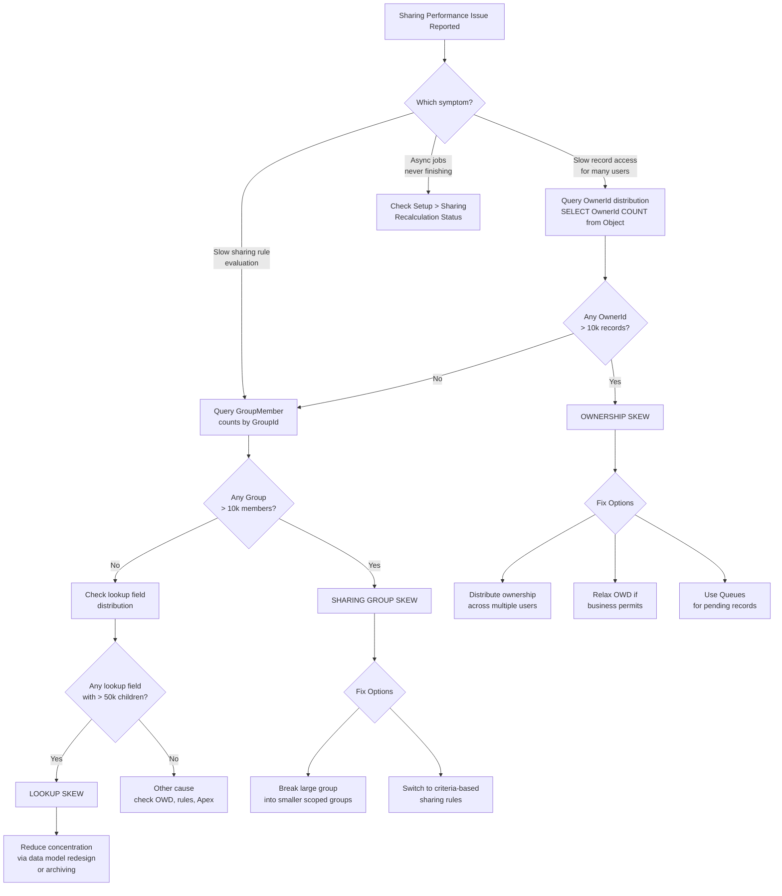

# High-Volume Sharing & Performance

## Exam Domain
Performance & Scalability — 15% of exam weight

## Foundations

Salesforce's sharing architecture is powerful but carries a fundamental performance cost: every time a user tries to access a record, the platform must evaluate whether that user has permission. For small orgs this is trivial. For large orgs with millions of records, complex role hierarchies, and many sharing rules, this evaluation can become the single biggest performance bottleneck in the system.

The root cause is the Share table. Every record that is shared beyond OWD has rows in an object's Share table (e.g., AccountShare, OpportunityShare). These tables can grow to hundreds of millions of rows. Every record access involves querying these tables. Every ownership change, role change, or sharing rule modification triggers recalculation — potentially writing or deleting millions of rows.

Architects who design sharing models without considering data volume will eventually produce systems that degrade under load. The three sharing skew patterns are the most common root causes of this degradation, and they appear on the CRT-403 exam because recognizing and resolving them is a core architect competency.

## Core Concepts

**The Three Types of Sharing Skew**

**1. Ownership Skew**

Ownership skew occurs when a single user or queue owns a disproportionately large number of records — typically more than 10,000 records. The problem is structural: Salesforce maintains a "sharing group" for each record owner. When records need to be shared (e.g., via sharing rules or role hierarchy), the platform creates Share table rows mapping that group to the target principals. If one user owns 500,000 records and is in a role hierarchy with 50 users above them, that potentially means 50 × 500,000 = 25 million Share table rows for just that one owner's records.

Ownership skew is the most commonly encountered skew pattern in enterprise orgs because integration users and data migration processes frequently load all records under a single owner.

Detecting ownership skew:
```sql
SELECT OwnerId, COUNT(Id) recordCount
FROM Account
GROUP BY OwnerId
ORDER BY COUNT(Id) DESC
LIMIT 10
```

Run this across your high-volume objects (Account, Opportunity, Case). Any single OwnerId returning more than 10,000 records is a candidate for remediation.

**2. Sharing Group Skew**

Sharing group skew occurs when a sharing group (a Role, Public Group, or Queue) has too many members — typically more than 10,000 users. Sharing rules that target this group must fan out access to all members. When the group is very large, every sharing calculation involving that group degrades.

This is less common than ownership skew but appears in very large orgs where, for example, a "All Sales Reps" public group is used as a target in sharing rules and the company has 50,000 sales users.

Detecting sharing group skew:
```sql
SELECT GroupId, COUNT(UserOrGroupId) memberCount
FROM GroupMember
GROUP BY GroupId
ORDER BY COUNT(UserOrGroupId) DESC
LIMIT 10
```

**3. Lookup Skew**

Lookup skew occurs when a non-owner lookup field on a record (e.g., AccountId on Opportunity) points to the same record from an extremely large number of child records. This is not strictly a sharing table issue, but it degrades performance in a very similar way — queries on the lookup field result in massive join operations, and any sharing recalculation triggered by the parent record is amplified.

Example: a single "Corporate Headquarters" Account record with 500,000 Opportunities all pointing to it as AccountId. Any access check that traverses this relationship, or any sharing recalculation on that Account, processes all 500,000 child records.

**Fixing Ownership Skew**

| Solution | When to Use |
|---|---|
| Distribute ownership across multiple integration users | When integration or data load owns most records; shard by geography, segment, or date range |
| Relax OWD to Public Read/Write | When the data sensitivity allows it; eliminates the need for sharing calculations entirely |
| Use Queues instead of individual users | For records awaiting assignment; queues are designed for high-volume ownership |
| Apex batch reassignment | To migrate existing records from the overloaded owner to distributed owners |

**Fixing Sharing Group Skew**

- Break one large public group into smaller, scoped groups (by region, business unit)
- Replace group-based sharing rules with criteria-based sharing rules that target smaller populations
- Review whether the sharing rule is even necessary — if OWD is already Public Read Only, many sharing rules are redundant

**Apex Sharing at Scale**

Programmatic Apex sharing inserts rows directly into Share tables. At scale, inserting millions of Share records via Apex can itself cause performance issues. Best practices:
- Use batch Apex with appropriate chunk sizes (200-500 records per batch)
- Avoid recursive sharing logic
- Delete Share records before recreating them rather than creating duplicates

**Async Sharing Recalculation**

Large sharing changes — activating a sharing rule, changing a role's position, modifying a public group — queue as async jobs rather than executing synchronously. Monitor these jobs under Setup > Sharing Settings > View Sharing Recalculation Status (in some API versions: Setup > Defer Sharing Calculations).

While recalculation is running, the system is in a partially-updated state. Some records may have old sharing until the job completes. Concurrent DML on records being recalculated can fail or queue.

**Deferring Sharing Recalculation**

For bulk Apex operations, Salesforce provides a mechanism to temporarily suspend sharing recalculation:

```apex
System.setAllSharingCalculationDisabled(true);
// ... bulk DML operations ...
System.setAllSharingCalculationDisabled(false);
```

CRITICAL: Once re-enabled, the platform triggers recalculation for all deferred changes. This must be used carefully:
- Must always be re-enabled — leaving it disabled is a production incident
- Use only in batch contexts with known data volumes
- Test thoroughly — deferred recalculation still runs; you are only postponing it, not eliminating it

**The "Sharing Recalculate" Button**

Under Setup > Sharing Settings, a "Recalculate" button forces a full sharing recalculation for an object. On large orgs, this can take hours. It should only be initiated during planned maintenance windows. It is useful when sharing rules or OWD changes have left the system in an inconsistent state.

**Impact of Role Hierarchy Changes**

When a role is moved to a new position in the hierarchy, the system must recalculate sharing for all records owned by users in that role (and all subordinate roles). Moving a role with 10,000 users and 1 million owned records is an expensive operation. Role hierarchy restructuring should be planned and executed during off-peak hours with monitoring in place.

**Impact of Public Group Changes**

Adding or removing members from a public group triggers recalculation for all sharing rules that target that group. For large groups used in many sharing rules, even a single membership change can trigger a cascade of recalculation jobs.

**Monitoring Tools**

- Debug logs with SHARING_EVAL category: shows individual sharing decisions
- Event Monitoring (Shield): ShareInsert and ShareDelete events; DetailedShareEvent captures sharing rule evaluation details
- SOQL on Share tables: profile the size of AccountShare, OpportunityShare, etc.
- Async job monitoring: Setup > Apex Jobs and Setup > Sharing Settings recalculation status

**When to Recommend OWD Relaxation**

If ownership skew cannot be resolved (e.g., technical constraints prevent distributing ownership), and the data sensitivity permits it, relaxing OWD for the affected object is a valid architectural decision. Moving from Private to Public Read Only eliminates the need for role hierarchy sharing calculations entirely. Moving to Public Read/Write eliminates all sharing table calculations.

This decision requires a security review — the business must accept that all users can see (and potentially edit) all records of that type. For non-sensitive objects (e.g., Product Catalog, Price Books, some custom objects), this is often acceptable.

---

## PTA / SA Relevance

### When This Comes Up in Engagements

Sharing performance issues surface most often in post-go-live health checks and incident response. Symptoms: slow page loads on record lists and related lists, SOQL timeout errors on sharing-intensive objects, scheduled batch jobs that run far longer than expected, and report generation failures on large datasets.

The most common trigger: a data migration or integration ran, loaded millions of records under a single system user, and now the sharing model is broken. The architect is called in to diagnose and remediate.

### Common Architecture Failures

- **Integration users owning business records** — the most common cause of ownership skew; integration accounts should be service accounts that process records and hand off ownership, not permanent record owners
- **"All Users" or giant public groups as sharing rule targets** — architects often use these as a shortcut to share broadly; it becomes a sharing group skew bomb as the org grows
- **Criteria-based sharing rules on frequently-changing fields** — every time the field value changes, recalculation fires; for a field that changes daily on millions of records, this creates continuous recalculation load
- **Running System.setAllSharingCalculationDisabled(true) and forgetting to re-enable** — this has caused production incidents where users lost access to records
- **Not monitoring async recalculation jobs** — sharing changes look instantaneous in UI but may take hours to propagate; access anomalies during recalculation cause support tickets that are hard to diagnose

### Enterprise Patterns

- **Integration User Pool**: Instead of one integration user owning all records, create a pool of 10-20 integration service users. Distribute record ownership across the pool by region, business unit, or record type. Keeps any single owner below 10,000 records.
- **Staging OWD**: For objects that are initially loaded by integration and then transferred to business users, temporarily relax OWD during bulk load, then tighten after ownership is distributed.
- **Sharing Recalculation Windows**: Establish a formal process for changes that trigger recalculation (role moves, large public group changes, sharing rule additions) — execute only during defined maintenance windows with monitoring.
- **Proactive Share Table Monitoring**: Build a scheduled Apex job that queries Share table sizes and sends alerts when any table exceeds a threshold (e.g., 5M rows for a given object).

---

## Architecture



**Limitations & Tradeoffs:**

- System.setAllSharingCalculationDisabled(true) is a blunt instrument — it suppresses all sharing recalculation, not just for the object in question; must always be paired with re-enable
- Relaxing OWD solves the performance problem but creates a security tradeoff; not appropriate for regulated data
- Distributing ownership across multiple integration users solves skew but complicates downstream reporting (records appear owned by service users, not business users)
- Async recalculation cannot be cancelled once started; a triggered recalculation on a large org must complete
- Share table size is not directly configurable; the only lever is reducing the number of sharing rules and the complexity of the sharing model
- Criteria-based sharing rules on stable fields are safe; on volatile fields they create ongoing recalculation load

---

## Key Facts to Memorize

- Ownership skew threshold: more than 10,000 records owned by a single user or queue
- Sharing group skew threshold: more than 10,000 members in a single group
- Lookup skew: non-owner lookup pointing to same record from excessive child records
- SOQL to detect ownership skew: SELECT OwnerId, COUNT(Id) FROM Object GROUP BY OwnerId ORDER BY COUNT(Id) DESC
- System.setAllSharingCalculationDisabled(true) MUST always be paired with re-enable (false)
- Sharing recalculation runs ASYNC; monitor under Setup > Sharing Settings
- "Sharing Recalculate" button triggers full recalculation — schedule during off-peak only
- Role hierarchy changes trigger recalculation for ALL records owned by users in that role
- Public group membership changes trigger recalculation for ALL sharing rules using that group
- Primary fix for ownership skew: distribute ownership across multiple users/queues

---

## Exam Traps

- **Trap**: "Sharing recalculation after a sharing rule change happens immediately." — FALSE. Large sharing changes are asynchronous and can take hours.
- **Trap**: "System.setAllSharingCalculationDisabled(true) permanently disables sharing." — FALSE. It temporarily defers recalculation. Setting it to true and not re-enabling is a bug.
- **Trap**: "Lookup skew is a sharing configuration issue that can be fixed with sharing rules." — FALSE. Lookup skew is a data distribution issue; sharing rules do not address it.
- **Trap**: "The only fix for ownership skew is to change OWD to Public Read/Write." — FALSE. Distributing ownership is the preferred fix; OWD relaxation is a last resort.
- **Trap**: "Adding a user to a public group only affects that user's access." — FALSE. It triggers recalculation for all sharing rules targeting that group, affecting performance across the org.

---

## Practice Questions

**Question 1**

An architect reviews an org where the Opportunity object has 8 million records. A SOQL query reveals that a single OwnerId (an integration service user) owns 7.6 million of those records. The OWD for Opportunity is Private. Users report slow access to Opportunity lists and related records. What type of sharing issue is this?

A) Sharing group skew — the integration user's role group has too many members  
B) Lookup skew — the AccountId field on Opportunity points to too few Accounts  
C) Ownership skew — a single user owns a disproportionate number of records  
D) OWD misconfiguration — Private OWD causes full table scans on the Share table  

**Answer: C**

This is a classic ownership skew scenario. The integration user owns 7.6 million of 8 million records. The sharing group for this user is enormous. Every sharing calculation (role hierarchy access, sharing rules) involving these records must process millions of Share table rows, causing the reported performance degradation.

Why A is wrong: Sharing group skew refers to a role or group with too many MEMBERS, not too many owned records.  
Why B is wrong: Lookup skew is about too many child records pointing to the same parent via a lookup field — not about record ownership.  
Why D is wrong: Private OWD is correct and expected; the problem is the ownership distribution, not the OWD setting itself.

---

**Question 2**

A company has a "Global Sales Team" public group used in a sharing rule for Accounts. The group has 85,000 members. The Salesforce admin reports that adding or removing any user from this group causes the system to take 4-6 hours to complete background processing. What is the root cause?

A) The sharing rule referencing the group is criteria-based, which requires full recalculation on any group change  
B) Sharing group skew — the group's size means any membership change triggers massive recalculation  
C) The Account OWD should be set to Public Read Only to avoid this processing  
D) Ownership skew on the Account records assigned to this group  

**Answer: B**

This is sharing group skew. A public group with 85,000 members that is referenced in a sharing rule means every membership change requires recalculating sharing for all Accounts covered by that rule, fanning out to all 85,000 current members. The solution is to break the monolithic group into smaller, more targeted groups or replace the group-based sharing rule with criteria-based sharing rules.

Why A is wrong: The recalculation trigger here is group MEMBERSHIP change, not whether the rule is criteria-based.  
Why C is wrong: Changing OWD may reduce the need for the sharing rule but does not address the architectural problem of having a group this large.  
Why D is wrong: Ownership skew is about record ownership concentration, not group membership.

---

**Question 3**

An integration batch process needs to load 5 million Account records overnight. The org has a complex sharing model with role hierarchy and multiple sharing rules. The architect wants to prevent sharing recalculation from firing for each of the 5 million records during the load, then allow recalculation to run once after all records are inserted. Which approach is correct?

A) Set the Account OWD to Public Read Only before the load, then revert after  
B) Use System.setAllSharingCalculationDisabled(true) before the batch, set it back to false after  
C) Use a separate Salesforce org for the load, then migrate records to production  
D) Disable all sharing rules before the load, then re-enable them after  

**Answer: B**

System.setAllSharingCalculationDisabled(true) defers sharing recalculation during the bulk operation. After the batch completes and the method is called with false, the platform runs the deferred recalculation once, covering all inserted records. This is the purpose-built mechanism for exactly this scenario.

Why A is wrong: Changing OWD would expose records to all users during the load window and requires a sharing recalculation of its own when changed back.  
Why C is wrong: Cross-org migration adds enormous complexity and is not a standard approach to this problem.  
Why D is wrong: Disabling sharing rules via the UI requires separate actions per rule, triggers recalculation when re-enabled per rule, and is far more disruptive than the purpose-built deferral mechanism.

---

**Question 4**

After a large sharing rule change is deployed to production, an admin uses the "Sharing Recalculate" button on the Account object. The system shows a background job running for 6 hours with no progress indication. Users are reporting that some Accounts that should be shared still show "No Access." What should the architect advise?

A) Cancel the job and revert the sharing rule change  
B) This is expected behavior — large recalculation jobs run async and can take hours; do not cancel; monitor the job queue  
C) The recalculation button only applies to OWD changes, not sharing rule changes  
D) Run the recalculation again to force it to restart faster  

**Answer: B**

On large orgs, sharing recalculation is an asynchronous job that can legitimately run for hours. The system is in a partially-updated state during recalculation — some records will reflect old sharing until the job completes. The correct advice is to monitor the job and wait for completion. Cancelling and restarting would reset the clock. Running it again while it is still running would queue a second recalculation job.

Why A is wrong: Cancelling the job does not restore the previous state and adds complexity. Reverting would require another recalculation.  
Why C is wrong: The Recalculate button applies to the full sharing model for that object, including sharing rules.  
Why D is wrong: Running it again while still in progress queues a second job; it does not speed up the current one.

---

**Question 5**

An architect wants to identify whether ownership skew exists on the Case object before redesigning the sharing model. Which SOQL query correctly surfaces this information?

A) `SELECT AccountId, COUNT(Id) FROM Case GROUP BY AccountId ORDER BY COUNT(Id) DESC`  
B) `SELECT OwnerId, COUNT(Id) FROM Case GROUP BY OwnerId ORDER BY COUNT(Id) DESC`  
C) `SELECT CreatedById, COUNT(Id) FROM Case GROUP BY CreatedById ORDER BY COUNT(Id) DESC`  
D) `SELECT RecordTypeId, COUNT(Id) FROM Case GROUP BY RecordTypeId ORDER BY COUNT(Id) DESC`  

**Answer: B**

Ownership skew is about the distribution of record OWNERSHIP — the OwnerId field. Grouping by OwnerId and ordering by count descending immediately surfaces whether any single user or queue owns a disproportionate number of records.

Why A is wrong: AccountId groups cases by Account (lookup skew analysis), not by owner. This would surface lookup skew, not ownership skew.  
Why C is wrong: CreatedById shows who created the records, not who owns them. Ownership can be transferred after creation.  
Why D is wrong: RecordTypeId groups cases by record type — useful for volume analysis but irrelevant to ownership skew diagnosis.
