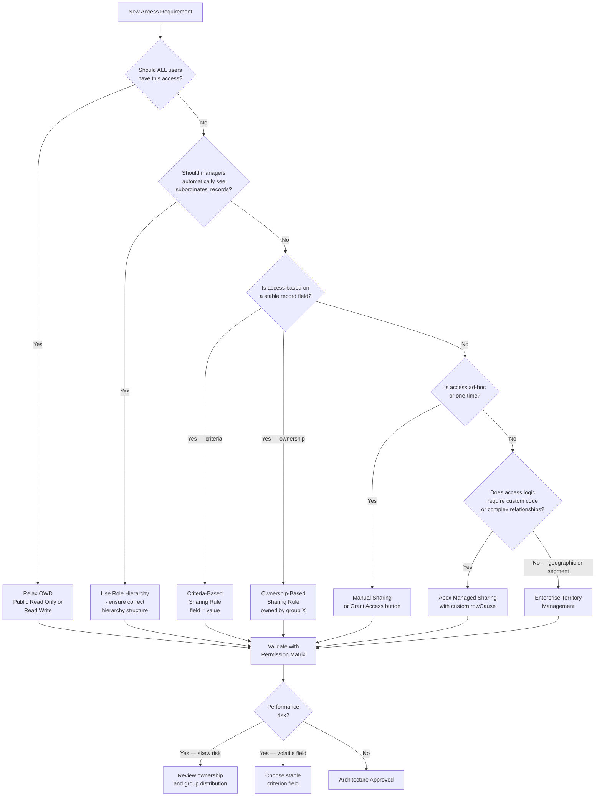

# Sharing Architecture Patterns

## Exam Domain
Record-Level Access — 35% of exam weight

## Foundations

The individual sharing mechanisms — OWD, role hierarchy, sharing rules, manual sharing, Apex sharing — are not complicated in isolation. What makes sharing architecture hard is combining them correctly for complex business requirements, recognizing which mechanism belongs in which layer, and knowing which combinations create security gaps or performance traps.

This lecture synthesizes the full sharing stack and presents the architectural patterns that appear on the CRT-403 exam. The exam tests pattern recognition: given a business scenario, select the correct combination of mechanisms. It also tests anti-pattern recognition: identify what is wrong with a proposed design.

The most important skill for both the exam and real engagements is being able to explain why a particular mechanism is the right choice — not just that it works, but why the alternatives fail.

## Core Concepts

**The Sharing Architecture Stack**

Salesforce sharing mechanisms apply in layers. Each layer can only open access above the floor set by the layer below. Object permissions act as an absolute ceiling — no amount of sharing can grant access to records if the user's profile or permission sets do not give them Read on the object.

```
Object Permissions (ceiling gate — no record access without object Read)
         |
     Apex Sharing (programmatic, custom rowCause)
         |
   Manual Sharing (ad-hoc, user-initiated)
         |
    Sharing Rules (lateral — criteria-based or ownership-based)
         |
   Role Hierarchy (vertical escalation — managers see subordinates' records)
         |
  OWD (floor — default access when no other mechanism applies)
```

The design principle: set OWD as restrictively as security requires, then use the higher layers to open access to the right people. Never use OWD as the primary access control mechanism for targeted access — that is what the upper layers are for.

**Pattern 1: Hub-and-Spoke Territory Model**

Scenario: A central admin team needs access to all records. Regional sales teams need access only to their region's accounts and opportunities. There is geographic territory alignment.

Design:
- OWD: Private on Account and Opportunity
- Role hierarchy: Regional roles sit under a National Sales role; Admin team sits at the top
- Enterprise Territory Management: territory hierarchy mirrors the geographic structure
- Sharing rules: not needed if territory + role hierarchy cover all cases
- Territories handle the geographic segmentation; role hierarchy handles manager escalation

Key insight: Role hierarchy alone creates a monolithic tree that does not express geography cleanly. ETM adds the geographic dimension without distorting the reporting hierarchy.

**Pattern 2: Data Segmentation by Account Type**

Scenario: The org has two account segments — Enterprise and SMB — and sales teams should not see each other's accounts. No geographic structure exists.

Design:
- OWD: Private on Account
- Criteria-based sharing rules: Share Accounts where Account.Type = "Enterprise" with the Enterprise Sales Team role; Share Accounts where Account.Type = "SMB" with the SMB Sales Team role
- No territory management needed
- Role hierarchy is flat or shallow — managers of each team have role-based escalation

Key insight: Criteria-based sharing rules segment access by data attribute without needing a complex hierarchy. This is the correct pattern when the access boundary is a field value, not an org chart position.

**Pattern 3: Integration User Isolation**

Scenario: An integration loads records into Salesforce nightly. The integration user currently owns all records it creates.

Design:
- NEVER let a single integration user own business records long-term
- Create a pool of service accounts (e.g., IntegrationUser_East, IntegrationUser_West)
- Distribute record ownership across the pool at load time using a routing key (geography, segment, alphabetical)
- After load, batch Apex (or a flow) transfers final ownership to the appropriate business user
- Integration service accounts sit in a dedicated role at the bottom of the hierarchy (or in a special segregated role that does not participate in hierarchy escalation)

Anti-pattern to avoid: one integration user owning 5M records. This is the primary cause of ownership skew.

**Pattern 4: External Collaboration Portal**

Scenario: Customers need to self-service their cases; partners need to manage opportunities; public site visitors need to browse published content.

Design:
- External OWD: Private on all objects exposed externally
- Customer Community (HVPU) users: Sharing Sets for Cases (User.AccountId = Case.AccountId)
- Partner Community users: Role hierarchy participation + sharing rules for Opportunities; Super User for partner admins
- Guest users: Criteria-based Guest Sharing Rules for publicly-visible records only
- Internal users: unaffected by External OWD changes (Internal OWD governs them)

Key insight: Each user type gets a different mechanism tier. One-size-fits-all sharing does not work when license types differ this significantly.

**Pattern 5: Regulated Industry Data Walls**

Scenario: A financial services firm requires "Chinese walls" between teams — a wealth management team must not see corporate banking team client records, even if they share a manager. Standard sharing rules cannot model "only records your team manages."

Design:
- OWD: Private
- Apex Managed Sharing with a custom rowCause (e.g., "TeamAccess__c")
- Custom logic determines team membership and creates Share records programmatically
- Regular sharing rules cannot express "team membership" as a criteria unless a field on the record explicitly records the team; in regulated scenarios, that field is the controlled variable
- Audit logging of all share record changes is required for compliance

Key insight: When access control logic is too complex for declarative mechanisms — when it depends on relationships, conditions, or business rules that cannot be expressed as OWD + criteria — Apex Managed Sharing with a custom rowCause is the correct tool. The custom rowCause persists even when the record owner changes, unlike manual sharing.

**Pattern 6: Merger and Acquisition Temporary Sharing**

Scenario: Two companies merge. During integration, employees from Company B temporarily need visibility into Company A's accounts and vice versa. This access is time-limited and will be removed after migration.

Design:
- Create two Public Groups: "CompanyA_Users" and "CompanyB_Users"
- Create ownership-based sharing rules: Share Company A records owned by CompanyA users with the CompanyB_Users group (and vice versa)
- Set an expiration reminder or automation to remove these rules after migration
- Document the rules explicitly as temporary in the rule description

Key insight: Public Groups + ownership-based sharing rules are the correct pattern for temporary, cross-team access grants. They are easier to create and remove than modifying the role hierarchy, and they leave a clear audit trail.

**Architecture Decision Matrix**

| Requirement | Correct Mechanism |
|---|---|
| All users need same access level | OWD Public Read Only or Read/Write |
| Managers need to see subordinates' records | Role Hierarchy |
| Department A needs to see Department B's records | Sharing Rule (ownership-based) |
| Users need access to records matching a field value | Sharing Rule (criteria-based) |
| One user needs ad-hoc access to one record | Manual Sharing |
| Access logic depends on complex relationships | Apex Managed Sharing |
| Geographic/segment-based access overlay | Enterprise Territory Management |
| HVPU portal users need record access | Sharing Sets |
| Partner portal admin needs all-account visibility | Partner Super User |
| Compliance requires persistent access that survives ownership changes | Apex Sharing with custom rowCause |

**Designing a Sharing Architecture from Scratch**

Step 1 — Set OWD: Ask "What is the most restrictive access level that is correct for users who should have NO special access?" Set OWD there. When in doubt, start with Private.

Step 2 — Design the Role Hierarchy: Model the management reporting structure. Keep it as flat as possible (target 5 levels maximum; 7 is the practical performance ceiling). Validate that manager access via role hierarchy is actually desired — not all managers should see all subordinate records in all orgs.

Step 3 — Identify Gaps: After OWD + role hierarchy, which users still cannot access records they legitimately need? These gaps are filled by sharing rules.

Step 4 — Fill Gaps with Sharing Rules: Use criteria-based rules where possible (more maintainable than ownership-based). Limit the total number of sharing rules per object (Salesforce limit: 300 sharing rules per object).

Step 5 — Identify Complex Cases: Any remaining access requirement that cannot be expressed declaratively requires Apex Managed Sharing. Identify these before go-live.

Step 6 — Layer on Apex Sharing: Design the Apex sharing logic with a custom rowCause. Test that Share records are created, updated, and deleted correctly as the underlying data changes.

Step 7 — Validate with a Permission Matrix: Build a matrix of user personas × record scenarios × expected access. Test every cell before go-live.

**Anti-Pattern: The "Grant Me View All" Request**

Business users frequently request "View All Data" permission when they cannot see a record they need. This is almost never the correct answer. View All Data bypasses all sharing controls. It is an administrative escalation, not a sharing solution.

The architect's response: understand why the user cannot see the record, trace the sharing mechanism that should grant access, and fix the mechanism. If no mechanism should grant this user access to that record, the request should be denied.

**Anti-Pattern: Proliferating Profiles**

An org with 150 profiles for minor field-level security variations is a maintenance disaster. The correct pattern: thin profiles that define object permissions and record type access; permission sets and permission set groups that layer additional permissions. This is the Salesforce recommended architecture as of API v54+.

**Anti-Pattern: Criteria-Based Sharing Rules on Mutable Fields**

A sharing rule that fires on Account.Status — which changes every time a deal stage changes — triggers recalculation every time that field changes. For high-volume objects, this creates continuous background recalculation load. Architects should choose stable, low-churn fields for sharing rule criteria wherever possible.

**Anti-Pattern: Deep Role Hierarchy**

Hierarchies beyond 7 levels add measurable query overhead. Every record access check traverses the hierarchy to determine all principals above the owner. A 15-level hierarchy means 14 lookups per access check. Flat hierarchies with sharing rules outperform deep hierarchies with equivalent effective access.

**Salesforce Sharing Model Limits Reference**

| Limit | Value |
|---|---|
| Sharing rules per object | 300 (300 ownership-based + 300 criteria-based, 300 total guest sharing rules) |
| Role hierarchy levels (practical) | 500 roles max, performance degrades beyond ~7 levels |
| Public groups | 100,000 |
| Manual sharing rows | No hard limit but Share table size affects performance |
| Territory models | Multiple (only 1 Active) |

---

## PTA / SA Relevance

### When This Comes Up in Engagements

Pattern selection is the core deliverable of a sharing architecture engagement. Customers come with business requirements; the architect must translate those requirements into the correct combination of sharing mechanisms. This mapping is what differentiates a Salesforce architect from a developer who simply knows how sharing works.

The anti-patterns come up constantly in health checks and re-architecture engagements. "View All" proliferation, deep role hierarchies, and criteria-based rules on volatile fields are among the most common findings.

### Common Architecture Failures

- **Using Apex sharing when declarative mechanisms would suffice** — Apex sharing is harder to maintain, requires code coverage, and is a deployment dependency. Architects sometimes reach for it prematurely to solve problems that criteria-based sharing rules handle cleanly.
- **Using OWD to do what sharing rules should do** — relaxing OWD to Public Read Only to avoid the complexity of designing sharing rules; this exposes all records to all users and is not a sharing architecture, it is the absence of one.
- **Designing the role hierarchy to model territories or business segments** — creates an unmaintainable tree with hundreds of roles; use ETM or sharing rules for non-reporting access.
- **Not documenting the sharing architecture** — sharing models are invisible in the UI; undocumented sharing rules and Apex sharing become orphaned logic that no one understands after the original team moves on.
- **Ignoring the Permission Matrix** — go-live without testing the matrix of user types × record types × expected access; access defects in production are costly to diagnose.

### Enterprise Patterns

- **Layered Defense**: OWD Private + role hierarchy for baseline + criteria-based rules for cross-team lateral access + Apex for compliance-driven walls. Each layer is independently testable.
- **The Sharing Architecture Document**: For every enterprise engagement, produce a sharing matrix that maps each user persona to each object and specifies which mechanism grants their access. This document is the architect's deliverable and the admin's operational guide.
- **Sharing Regression Test Suite**: A set of Apex test methods or manual test scripts that validate the permission matrix. Run before every sharing model change.

---

## Architecture



**Limitations & Tradeoffs:**

- 300 sharing rules per object — architects must budget rules across multiple teams' requirements; criteria-based rules can serve multiple access patterns if designed broadly
- Apex sharing requires code maintenance, test coverage, and deployment management — adds lifecycle cost compared to declarative rules
- Custom rowCause in Apex sharing must be registered as a static string in a custom object — an often-forgotten implementation detail
- Manual sharing is removed when record ownership changes (unlike Apex sharing with custom rowCause)
- OWD changes affect ALL records on the object — cannot be applied to a subset; sharing rules must handle the exceptions
- Role hierarchy is global — a role structure designed for one business unit's needs constrains all other units

---

## Key Facts to Memorize

- Sharing stack order: OWD → Role Hierarchy → Sharing Rules → Manual Sharing → Apex Sharing; Object Permissions are the ceiling gate
- Apex sharing with custom rowCause PERSISTS through ownership changes; manual sharing does NOT
- Sharing rules limit: 300 per object
- Criteria-based sharing rules should use STABLE fields — volatile fields cause continuous recalculation
- Role hierarchy target: 5 levels practical, 7 levels max before performance degrades
- One integration user owning millions of records = ownership skew = performance anti-pattern
- "View All Data" is an admin escalation, not a sharing architecture solution
- Thin profiles + permission sets = correct long-term architecture; 150 profiles = anti-pattern
- OWD is the floor; all mechanisms above it only open access, never restrict further

---

## Exam Traps

- **Trap**: "Apex sharing can override OWD to grant access to records even without any sharing mechanism." — FALSE. Apex sharing still operates within the sharing model; it cannot grant access beyond what Object Permissions allow.
- **Trap**: "Manual sharing persists if the record owner changes." — FALSE. Manual sharing grants are removed when ownership changes. Use Apex sharing with a custom rowCause for persistent grants.
- **Trap**: "Criteria-based sharing rules are always better than ownership-based rules." — FALSE. Each has its use case; criteria-based rules on volatile fields can cause performance issues worse than ownership-based rules.
- **Trap**: "You can have any number of sharing rules per object." — FALSE. The limit is 300 sharing rules per object.
- **Trap**: "Setting OWD to Public Read Only solves all sharing requirements." — FALSE. It opens access for everyone, which is the correct solution only when universal access is the intent.

---

## Practice Questions

**Question 1**

An architect is reviewing an org where the system has a single integration service account (IntegrationSvc) that owns all 4 million Opportunity records loaded by a nightly ETL process. Business users report degraded Opportunity list view performance. The architect has identified ownership skew. Which recommendation is MOST appropriate?

A) Change the Opportunity OWD from Private to Public Read Only to eliminate the need for sharing calculations  
B) Grant IntegrationSvc a role at the top of the hierarchy so sharing calculations are simpler  
C) Create a pool of integration service users and distribute Opportunity ownership across the pool at load time  
D) Set up a sharing rule that shares all IntegrationSvc-owned Opportunities with all sales roles  

**Answer: C**

The root cause is ownership skew — one user owns too many records. The correct fix is to distribute ownership so no single user has more than ~10,000 records. Creating a pool of service users and routing records to them at load time (by segment, region, or alphabetical key) solves the skew without changing the security model.

Why A is wrong: Relaxing OWD resolves the sharing performance problem but at the cost of exposing all Opportunities to all users. This is a security tradeoff that should only be accepted if the business explicitly approves universal visibility — not the first recommendation for a Private object.  
Why B is wrong: Placing the integration user at the top of the hierarchy makes sharing calculations more expensive for the records owned by that user, not less. All managers above a user in the hierarchy share in the sharing group calculations.  
Why D is wrong: Adding a sharing rule that covers 4 million records does not reduce the skew — it adds additional Share table rows and compounds the performance problem.

---

**Question 2**

A financial services firm requires that wealth management advisors never see records belonging to corporate banking clients, even if both teams report to the same division head. Standard criteria-based sharing rules have been evaluated and cannot express this access boundary because the access logic is determined by team membership in an external HR system, not a field value on the record. Which sharing mechanism is correct?

A) Create a sharing rule using the Division Head's role as the sharing group  
B) Use Apex Managed Sharing with a custom rowCause that reflects team membership  
C) Set the OWD to Private and rely on role hierarchy to enforce the separation  
D) Use the "Restrict Access" checkbox on each record to prevent cross-team visibility  

**Answer: B**

When access logic cannot be expressed declaratively — because it depends on an external system, complex relationships, or conditions that do not map to a single field value — Apex Managed Sharing with a custom rowCause is the correct tool. The custom rowCause identifies the sharing grant, persists through ownership changes, and can be managed programmatically based on team membership synced from the HR system.

Why A is wrong: Sharing via the Division Head's role would give division-level managers visibility across both teams — exactly the cross-team exposure the requirement prohibits.  
Why C is wrong: Private OWD + role hierarchy would still allow the division head to see all records; it cannot enforce Chinese walls within the hierarchy.  
Why D is wrong: There is no standard "Restrict Access" checkbox on Salesforce records that overrides sharing rules.

---

**Question 3**

An architect is deciding between a criteria-based sharing rule and Apex Managed Sharing for the following requirement: "Share Account records with the Regional Sales Team when Account.Region__c matches the team's region." The Region__c field is set at account creation and changes approximately 0.5% of accounts per year. Which is the better approach and why?

A) Apex Managed Sharing — because criteria-based sharing rules cannot use custom fields  
B) Criteria-based sharing rule — the field is stable and the requirement maps cleanly to a declarative rule  
C) Apex Managed Sharing — because it persists through ownership changes while criteria-based rules do not  
D) Criteria-based sharing rule — but only if there are fewer than 100 accounts  

**Answer: B**

Criteria-based sharing rules can use custom fields. The Region__c field is stable (0.5% annual change rate) — there is no performance concern from frequent recalculation. The requirement is a direct field-value match, which is exactly what criteria-based rules are designed for. Apex sharing is unnecessary complexity here.

Why A is wrong: Criteria-based sharing rules absolutely support custom fields. This is a common misconception.  
Why C is wrong: While it is true that Apex sharing with a custom rowCause persists through ownership changes, so does a criteria-based sharing rule — both are re-evaluated based on the record's current field values. This is not a differentiating factor here.  
Why D is wrong: There is no record count limit that gates when criteria-based rules are appropriate; they scale to millions of records.

---

**Question 4**

Two companies have merged. During the 6-month integration period, Team A users need read/write access to Team B's Accounts and vice versa. After 6 months, this cross-access will be removed. What is the most appropriate sharing mechanism?

A) Move all Team A and Team B users under a single shared role for the integration period  
B) Create two Public Groups (TeamA_Users, TeamB_Users) and create ownership-based sharing rules cross-sharing records between the groups  
C) Use Apex Managed Sharing to programmatically grant access based on a custom field set during migration  
D) Change the Account OWD to Public Read/Write for the integration period, then revert  

**Answer: B**

Public Groups + ownership-based sharing rules is the correct pattern for temporary, defined-scope cross-team access. The rules are easy to create, clearly documented, and easy to remove after the integration period ends. This leaves no lasting changes to the org structure.

Why A is wrong: Moving users under a shared role is a structural change to the role hierarchy that is difficult to undo cleanly and has broad implications beyond just this access requirement.  
Why C is wrong: Apex Managed Sharing adds development and deployment overhead for a straightforward, temporary requirement that declarative mechanisms handle well.  
Why D is wrong: Changing OWD to Public Read/Write exposes ALL Accounts to ALL users, not just Team A and Team B to each other. It is far broader than the requirement and is a significant security risk during a sensitive merger period.
