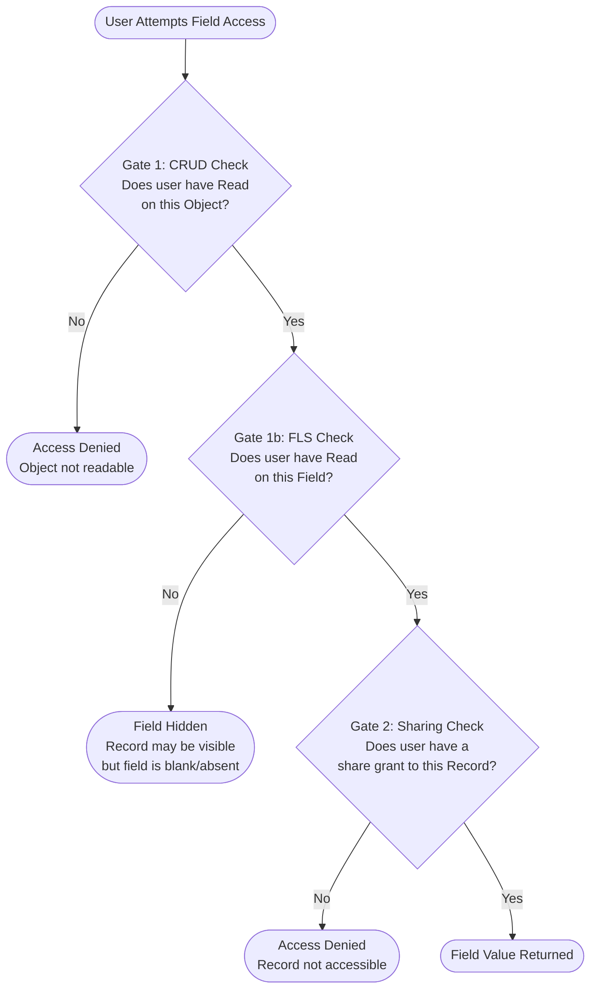
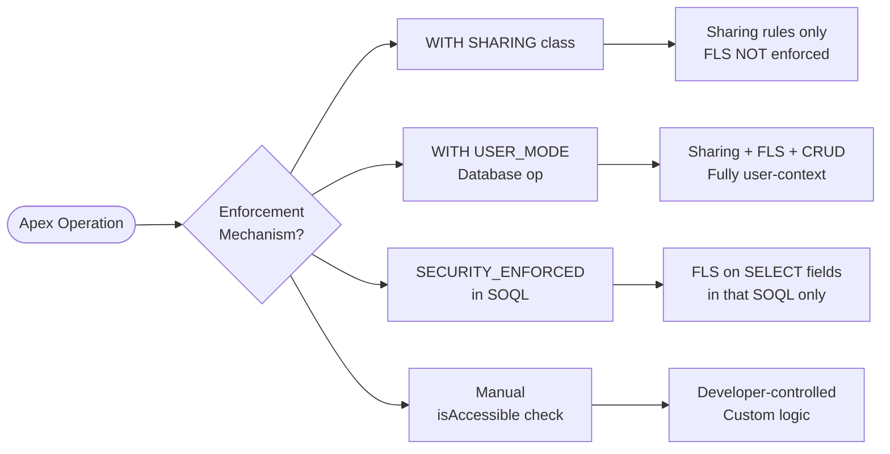

# FLS and CRUD Design

## Exam Domain
Object & Field Access — 20% of exam weight

## Foundations

Before a user can interact with any data in Salesforce, the platform evaluates two separate and independent access gates. Most implementation teams focus on record sharing — who can see which records — and treat field and object permissions as an afterthought. That inversion is the source of the most common security vulnerabilities in enterprise Salesforce deployments.

**Object-level CRUD permissions** answer: "Can this user interact with this object type at all?" CRUD stands for Create, Read, Edit, Delete. These permissions live on a profile or permission set and apply universally — they do not vary by record. If a user lacks Read on the Account object, they cannot read any Account, regardless of how sharing is configured.

**Field Level Security (FLS)** answers: "Can this user see or edit this specific field?" FLS is also set on profiles and permission sets. It is entirely independent of record access. A user can have full sharing access to a record and still be blocked from seeing a sensitive field on it.

The critical insight for the exam: **sharing determines which records a user can access; CRUD/FLS determines which objects and fields they can touch within those records.** These are separate systems that run in sequence.

## Core Concepts

### The Two-Gate Model

Every data access attempt in Salesforce passes through two sequential gates:

- **Gate 1 — Object & Field Permissions (CRUD/FLS):** Enforced by profiles and permission sets. Evaluated first. If the user fails here, access is denied regardless of sharing.
- **Gate 2 — Record Sharing (OWD, sharing rules, role hierarchy, manual shares):** Evaluated second. Even if the user passes Gate 1, they still need a sharing grant to reach a specific record.

A user must pass BOTH gates to successfully read a field on a record.

### FLS Specifics

FLS has three axes for each field per profile/permission set:
- **Read:** Can the user see the field value?
- **Edit:** Can the user change the field value?
- (No Read + No Edit = field is hidden entirely from that user)

FLS interacts with the rest of the platform as follows:
- **Reports:** FLS-restricted fields do not appear in report builder or report output for that user.
- **List Views:** FLS-hidden fields cannot be added to list views by that user and are stripped from existing list views.
- **Search results:** Hidden fields are excluded from search result snippets.
- **Apex (system context):** By default, Apex ignores FLS entirely — this is the most dangerous behavior for architects to understand.

Some standard fields — particularly `Id` and `Name` on most objects — cannot have FLS restricted. They are always visible.

### CRUD Specifics

CRUD operates at the object level:
- **Create:** Can insert new records of this type.
- **Read:** Can query/view records of this type.
- **Edit:** Can update existing records.
- **Delete:** Can delete records.

"View All" and "Modify All" on an object are elevated permissions that bypass OWD and sharing rules for record access — but they do NOT bypass FLS. A user with View All on Account who lacks FLS read on `AnnualRevenue` still cannot see that field.

### FLS and CRUD Enforcement in Apex

Apex code runs in **system context** by default. This means it executes with elevated permissions, ignoring both FLS and sharing rules. This is intentional for many use cases (batch jobs, automated processes) but is a security liability when Apex handles user-initiated data operations.

Architects have four mechanisms to enforce FLS and CRUD in Apex:

| Mechanism | What It Enforces | Scope |
|---|---|---|
| `WITH SHARING` keyword on class | Sharing rules (record access) only | DML + SOQL |
| `WITH USER_MODE` on Database operations | Sharing + FLS + CRUD | SOQL/DML operations using `Database.*` |
| `SECURITY_ENFORCED` in SOQL | FLS on selected fields only | SOQL query only |
| `Schema.describeSObjectType()` / `isAccessible()` / `isCreateable()` / `isUpdateable()` | Programmatic FLS/CRUD check | Any context |

**`WITH SHARING` vs `WITH USER_MODE`:** These are frequently confused on the exam.
- `WITH SHARING` enforces only record-level sharing. It does NOT enforce FLS.
- `WITH USER_MODE` (introduced in API 56.0) enforces everything: sharing, FLS, and CRUD. It is applied per Database operation, not per class.
- `SECURITY_ENFORCED` is inline in SOQL and only covers the fields in the SELECT clause of that query.

Programmatic check example:
```apex
if (!Schema.sObjectType.Account.fields.AnnualRevenue.isAccessible()) {
    throw new AuraHandledException('Insufficient field access');
}
```

### Page Layouts vs FLS: A Critical Distinction

Page layouts control what is *displayed* in the UI. Hiding a field on a page layout removes it from the page — but:
- The field is still accessible via API (REST, SOAP, Bulk, Metadata)
- The field is still accessible in Apex (system context)
- The field still appears in reports and list views where FLS permits
- Users with API access can query it directly

**Page layout hiding is a UX convenience, not a security control.** FLS is the only enforcement mechanism that applies across all access vectors. The architect rule: any field that must be hidden for compliance or security reasons requires FLS restriction, not just page layout removal.

### Sensitive Field Architecture Pattern

For PII, financial, or regulated fields (SSN, salary, credit card data):
1. **FLS restriction** on all profiles except those with legitimate access.
2. **Shield Platform Encryption** for data at rest (if regulatory requirement).
3. **Field Audit Trail** (Shield) for 10-year change history.
4. **Event Monitoring** to log who queried/exported fields.
5. **Explicit FLS checks in all Apex code** that touches the field.

### FLS Audit Tooling
- **Health Check:** Surfaces profiles with overly permissive FLS settings; compares against Salesforce Baseline Standard.
- **Permission Analyzer:** Generates field accessibility matrices showing which users/profiles have access to which fields.
- **Setup Audit Trail:** Logs changes to FLS settings (who changed field permissions on which profile, when).

---

## PTA / SA Relevance

### When This Comes Up in Engagements

- **Data migration projects:** ETL tools running as integration users often run in system context; architects must confirm the integration profile has appropriate CRUD/FLS for the migration target objects without inadvertently granting production access.
- **Custom Lightning components / Apex controllers:** "The field shows in the page but not in reports" is a classic symptom of FLS inconsistency between profile and object manager.
- **Compliance-driven field restriction:** HIPAA, GDPR, and financial regulations often require demonstrating that specific fields are inaccessible to certain user populations. FLS is the control; the evidence is the permission set/profile configuration and Field Audit Trail.
- **ISV/AppExchange apps:** Managed package Apex runs in system context; IVS architects must explicitly handle FLS enforcement in package code.

### Common Architecture Failures

1. **Relying on page layout to hide sensitive data.** Every security-aware customer has been burned by a consultant who hid a salary field in the page layout but left it visible in reports.
2. **Apex controllers that ignore FLS.** A Lightning component that calls an Apex controller without `WITH USER_MODE` or manual FLS checks exposes all fields to any user who can invoke the method.
3. **"View All" granted to bypass sharing issues.** Operations teams often request View All to get their jobs done; without FLS restrictions, this exposes sensitive fields across the entire object.
4. **FLS not set on cloned profiles.** When a new profile is cloned from System Administrator and then supposedly locked down, FLS settings are often overlooked — the new profile retains wide-open field access.

### Enterprise Patterns

- **Least Privilege by Default:** Start with no field access and grant explicitly via permission sets. Avoid granting FLS at the profile level except for the minimum needed to use the object.
- **Permission Set Groups for role-based field access:** Group FLS grants by job function (e.g., "HR — Compensation Viewer" permission set grants FLS read on salary fields).
- **Apex standard:** All custom Apex that performs DML or SOQL on behalf of a named user should use `WITH USER_MODE` or explicit `isAccessible()` / `isUpdateable()` checks.

---

## Architecture

### Two-Gate Access Model



### Apex Enforcement Options



**Limitations & Tradeoffs:**

- `WITH USER_MODE` was introduced in API 56.0 (Summer '22). Older orgs or managed packages may not support it; verify API version before relying on it.
- `SECURITY_ENFORCED` throws a runtime exception if a field in SELECT is inaccessible — callers must handle the exception or pre-check FLS. It does not enforce CRUD or sharing.
- Manual `isAccessible()` checks add code overhead and must be maintained as fields are added; easy to miss new fields during development.
- FLS restrictions on encrypted fields (Shield) have additional constraints — encrypted fields cannot be used in criteria-based sharing rules.

---

## Key Facts to Memorize

- CRUD and FLS are enforced at profile + permission set level, NOT at sharing level.
- A user must pass Gate 1 (CRUD/FLS) AND Gate 2 (sharing) to read a field value.
- Page layout hides a field from the UI only; FLS hides it from all access vectors.
- Apex runs in system context by default — it ignores FLS and sharing.
- `WITH SHARING` = sharing rules only. `WITH USER_MODE` = sharing + FLS + CRUD.
- `SECURITY_ENFORCED` is SOQL-inline and covers only the SELECT clause fields.
- `View All` on an object does NOT bypass FLS.
- Standard fields `Id` and `Name` on most objects cannot have FLS restricted.
- Health Check and Permission Analyzer are the native FLS audit tools.
- Field history tracking and Shield Field Audit Trail are the retention mechanisms, not FLS enforcement tools.

## Exam Traps

- **"WITH SHARING enforces FLS"** — False. WITH SHARING enforces sharing rules only.
- **"Hiding a field on a page layout secures it from API access"** — False. FLS is required for API-level restriction.
- **"View All bypasses FLS"** — False. View All bypasses record sharing only.
- **"SECURITY_ENFORCED enforces CRUD"** — False. SECURITY_ENFORCED only applies to FLS on SOQL fields.
- **"A user without record sharing access is blocked by Gate 1"** — Partially false. Gate 1 is CRUD/FLS. They may pass Gate 1 but fail Gate 2 (sharing). The block happens at Gate 2.

## Practice Questions

**Question 1**

A developer has written an Apex controller for a Lightning component that queries Account records including the `AnnualRevenue` field. The class is declared `with sharing`. A compliance review finds that users without the "Finance Viewer" permission set are able to see `AnnualRevenue` values when they use the component. What is the root cause?

A. The sharing rules are misconfigured to grant access to all users.
B. `with sharing` does not enforce FLS; the SOQL runs in system context and returns all field values regardless of FLS settings.
C. The Lightning component is caching field values from a privileged user session.
D. The Account OWD is set to Public Read/Write, which overrides FLS restrictions.

**Answer: B**

**Explanation:** `with sharing` only enforces record-level sharing rules — it controls which Account records are returned. It does NOT enforce FLS. The SOQL query returns `AnnualRevenue` for every user who invokes the controller, regardless of their FLS settings on that field. To enforce FLS, the developer must use `WITH USER_MODE` on the Database operation, use `SECURITY_ENFORCED` in the SOQL, or add explicit `isAccessible()` checks.

**Why others are wrong:**
- A: Sharing rules determine which records are returned, not which fields. This would cause a record visibility problem, not a field visibility problem.
- C: LWC does not cache field data between user sessions in this way.
- D: OWD affects record access, not field access. Public Read/Write cannot override FLS.

---

**Question 2**

A Salesforce architect is designing a solution to protect a custom field `SSN__c` on the Contact object. The requirement is that only users with the "HR Administrator" profile can read the field. The current implementation hides the field on all page layouts except the HR Administrator layout. A security auditor finds that users with API access can query the field. What must the architect do?

A. Remove the field from the Contact search layout.
B. Encrypt the field using Shield Platform Encryption.
C. Apply FLS restrictions on all profiles except HR Administrator to remove Read access to `SSN__c`.
D. Change the Contact OWD from Public Read Only to Private.

**Answer: C**

**Explanation:** Page layout hiding only controls the UI. Users with API access (via REST, SOAP, or tools like Workbench) can still query any field they have FLS Read access to, regardless of whether it appears on a page layout. FLS must be explicitly restricted on all profiles (and permission sets) that should not see the field.

**Why others are wrong:**
- A: Search layout affects which fields appear in search result snippets, not whether the field can be queried via API.
- B: Shield Encryption protects data at rest and affects indexing/search behavior but does not restrict who can read the field value. A user with FLS Read can still read an encrypted field.
- D: OWD changes affect which records users can access, not which fields they can read. This does not solve the field-level problem.

---

**Question 3**

An architect needs to write Apex code that enforces both FLS and record-level sharing when querying Opportunity records. The code must throw an error if the running user lacks FLS access to any field in the SELECT clause. Which approach satisfies both requirements with the least custom code?

A. Declare the class as `with sharing` and add `SECURITY_ENFORCED` to the SOQL query.
B. Use `Database.query()` with `AccessLevel.USER_MODE`.
C. Declare the class as `without sharing` and manually call `isAccessible()` for each field.
D. Use a `@RemoteAction` method on a Visualforce controller declared `with sharing`.

**Answer: B**

**Explanation:** `Database.query(soql, AccessLevel.USER_MODE)` (or `[SELECT ... WITH USER_MODE]` syntax depending on API version) enforces both record-level sharing AND FLS in a single operation. It is the most complete, concise enforcement mechanism available.

**Why others are wrong:**
- A: `with sharing` + `SECURITY_ENFORCED` is incomplete. `with sharing` enforces sharing; `SECURITY_ENFORCED` enforces FLS on SELECT fields. Together they cover the requirement, but this combination is more verbose and `SECURITY_ENFORCED` throws a different exception type than `USER_MODE`. Answer B is a cleaner single mechanism.
- C: `without sharing` removes sharing enforcement entirely. Manual `isAccessible()` checks FLS but does not enforce sharing.
- D: `@RemoteAction` with `with sharing` enforces sharing only, not FLS.

---

**Question 4**

A user has been granted "View All" on the Opportunity object by their profile. Their FLS settings for the custom field `Margin__c` do not include Read access. Which of the following is true?

A. "View All" grants full field access; the user can read `Margin__c`.
B. The user can see all Opportunity records but cannot see the `Margin__c` field value.
C. The user receives a permission error when opening any Opportunity record.
D. "View All" implies CRUD Read, which includes FLS Read for all fields.

**Answer: B**

**Explanation:** "View All" is a record-access permission that bypasses OWD and sharing rules — the user can see every record of that object type regardless of ownership or sharing configuration. However, "View All" operates at Gate 2 (sharing). Gate 1 (FLS) is evaluated independently. Since the user lacks FLS Read on `Margin__c`, that field will be hidden even though they can access the records. FLS and record sharing are entirely separate controls.

**Why others are wrong:**
- A: Incorrect. View All does not grant FLS access.
- C: Incorrect. The user has Read CRUD and can open Opportunity records; they simply cannot see the FLS-restricted field.
- D: Incorrect. CRUD Read grants the ability to read records of the object type; it does not grant FLS read on individual fields.
