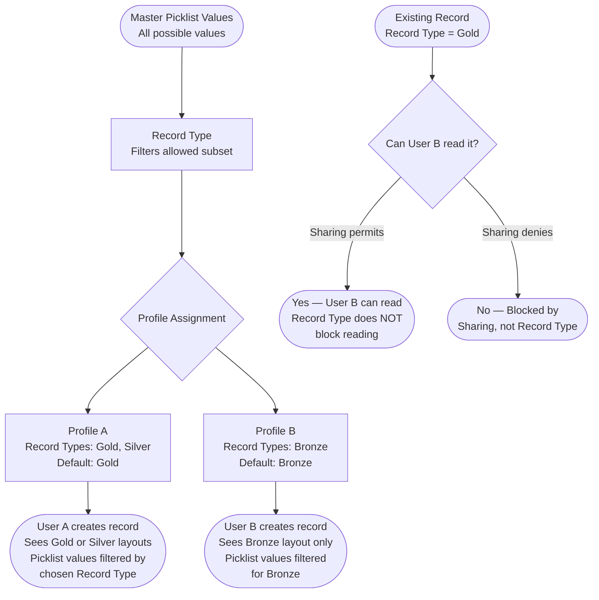
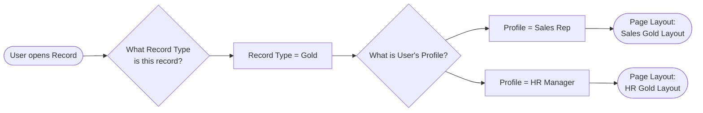

# Record Types and Visibility

## Exam Domain
Object & Field Access — 20% of exam weight

## Foundations

Record Types are one of the most widely used and most frequently misunderstood features in Salesforce. Nearly every enterprise implementation uses them, yet architects regularly make fundamental errors in how they apply them — most commonly by treating Record Types as an access control mechanism when they provide no security enforcement whatsoever.

A Record Type is a way to categorize records of the same object into distinct groups. Each group can have its own page layout, its own set of available picklist values, and its own business process. Record Types are fundamentally a **user experience and data quality tool**, not a security tool.

Understanding Record Types at architect level means knowing exactly what they do control (layout, picklists, business process) and what they absolutely do not control (record access, field visibility, sharing). The exam tests this distinction repeatedly.

## Core Concepts

### What Record Types Control

1. **Page Layout Assignment:** Each combination of Record Type + Profile maps to exactly one page layout. A single record type can display different layouts to different profiles. This allows the HR profile to see a richer Account layout than the Sales profile, even when both are looking at records of the same Record Type.

2. **Picklist Value Filtering:** Salesforce maintains a master list of values for each picklist field on an object. A Record Type does not define picklist values — it *filters* which values from the master list are available when creating or editing records of that type. The master list is the source of truth; the Record Type selection restricts the available subset.

3. **Business Processes:** For standard objects with stage-like fields (Opportunity Stage, Case Status, Lead Status, Solution Status), Record Types are linked to a Business Process — a named subset of stage values. Record Types on standard objects must reference a Business Process for the relevant stage field.

4. **Developer Name:** Each Record Type has a Label (UI-facing) and a DeveloperName (API-facing, used in SOQL, Apex, and Validation Rules). The DeveloperName cannot contain spaces and is used in formulas and Apex as `RecordType.DeveloperName`.

### What Record Types Do NOT Control

- **Record-level sharing:** A record being of Type A vs Type B does not grant or restrict any user's ability to access that record. OWD, sharing rules, role hierarchy, and manual shares control record access — Record Type is invisible to the sharing engine.
- **Field Level Security:** FLS is set at profile/permission set level and is independent of Record Type. Hiding a field on the page layout for a specific Record Type is a UI convenience only (see Lecture 13 for the page layout vs FLS distinction).
- **Visibility of records to external users:** Communities/Experience Cloud users can have profiles with limited Record Type access, but this limits what types they can *create* — not which records they can *read*.

### Record Type Access: Profile Assignment

Each profile has a list of available Record Types per object. The profile configuration specifies:
- Which Record Types the user can see (and therefore create records with).
- Which Record Type is the **default** — the type pre-selected when the user creates a new record.

If a user's profile includes only one Record Type for an object, they will not see the Record Type selection dialog when creating records — they are taken directly to the new record form. If a user has access to two or more Record Types, the selection dialog appears first.

### Inactive Record Types

Record Types can be deactivated. When deactivated:
- The Record Type no longer appears as an option when creating new records.
- Existing records that were assigned to the now-inactive Record Type **still exist** and still display that Record Type.
- Users whose profiles do not include the inactive Record Type can still view records of that type — they simply cannot create new records assigned to it.
- Reports can still filter by or group by an inactive Record Type.

This means deactivating a Record Type does NOT orphan records or cause errors. It only blocks future assignment.

### Record Types in SOQL and Apex

Querying Record Type in SOQL uses the `RecordType.DeveloperName` or `RecordType.Name` relationship field:

```apex
List<Opportunity> opps = [
    SELECT Id, Name, RecordType.DeveloperName
    FROM Opportunity
    WHERE RecordType.DeveloperName = 'Enterprise_Deal'
];
```

To get the Record Type ID from the DeveloperName programmatically:
```apex
Id rtId = Schema.SObjectType.Opportunity.getRecordTypeInfosByDeveloperName()
    .get('Enterprise_Deal').getRecordTypeId();
```

Hardcoding Record Type IDs is an anti-pattern — IDs differ between orgs. Always use DeveloperName-based lookup.

### Record Types and Validation Rules

Validation Rules can branch by Record Type:
```
AND(
    RecordType.DeveloperName = 'Enterprise_Deal',
    ISBLANK(Contract_Value__c)
)
```
This allows different validation behavior for different record categories without creating separate objects.

### Record Types and Approval Processes

Approval Processes can include entry criteria that filter by Record Type. This allows different approval workflows for different categories of the same object without managing separate objects.

### Record Types and Experience Cloud (Communities)

External users in Experience Cloud have profiles that may grant access to a limited set of Record Types. This controls what types of records they can create — for example, a Partner user profile might only have access to the "Partner Opportunity" Record Type, preventing them from creating "Internal Opportunity" type records. However, this is still not a security control on record reading — it is a creation-time restriction.

### Person Accounts

When Person Accounts are enabled, the Account object has two distinct sets of Record Types: Business Account Record Types and Person Account Record Types. These are architecturally segregated at the object level — a single Account record is either a Business Account or a Person Account, determined by whether a Person Account Record Type was used. This distinction affects related object behavior, UI rendering, and integration patterns.

### Multi-Record-Type Governance

When an object has many Record Types, the matrix of (Record Type × Profile × Page Layout) assignments becomes complex. Governance concerns include:
- **Naming conventions:** DeveloperName must be descriptive and consistent (e.g., `SMB_New_Business`, `Enterprise_Renewal`).
- **Master picklist hygiene:** Values added to the master picklist are not automatically included in any Record Type's allowed set. Administrators must explicitly add them.
- **Unused Record Types:** Old or unused Record Types should be deactivated and documented rather than deleted (deletion can cause issues if records still reference them).

---

## PTA / SA Relevance

### When This Comes Up in Engagements

- **Product variation modeling:** Customers often ask whether they should create separate objects or Record Types to handle different product lines. Record Types are the right answer when the data structure is the same and only the UI/process differs.
- **Multi-cloud orgs:** Health Cloud, Financial Services Cloud, and other Salesforce clouds add their own Record Types. Architects must understand which Record Types come with the cloud and which they are adding, to avoid naming conflicts and picklist pollution.
- **B2B + B2C in one org:** Person Accounts + Business Accounts is a common pattern; the Record Type architecture is the enabling mechanism.
- **Compliance reviews:** Customers frequently try to use Record Types to restrict data visibility. Architects must redirect to FLS and sharing mechanisms.

### Common Architecture Failures

1. **Using Record Types as security controls.** Teams assume that because a user's profile doesn't include Record Type X, users can't see records of Type X. This is false — they can read/view those records (if sharing permits); they just can't create new ones.
2. **Too many Record Types.** Each new Record Type multiplies the layout matrix. Organizations with 20+ Record Types per object become unmanageable. Architects should push back and explore whether field-level branching, validation rules, or path configurations can reduce the number of types needed.
3. **Hardcoded Record Type IDs in code or flows.** IDs differ between sandbox and production. Deployments break when IDs are hardcoded. Always retrieve by DeveloperName at runtime.
4. **Forgetting to add new picklist values to Record Types.** A developer adds a new value to the master picklist; it appears in API/Apex but not in the UI for users because no Record Type's allowed value list was updated.

### Enterprise Patterns

- **Record Type as product line segmentation:** Use one Record Type per product line (e.g., `Commercial_Insurance`, `Life_Insurance`) on Opportunity to drive different stages, layouts, and approval processes.
- **Record Type + Permission Set for controlled creation:** Restrict which users can create a specific Record Type by removing it from profiles and granting it via permission set — this controls who can create records of that type (though not who can read them).
- **Record Type DeveloperName in formula fields:** Build derived classification fields using `RecordType.DeveloperName` in formula fields to drive downstream logic in flows and reports.

---

## Architecture

### Record Type Assignment Model



### Page Layout Resolution



**Limitations & Tradeoffs:**

- Record Types add UI complexity — each additional Record Type multiplies administrative overhead in picklist management, page layout assignments, and approval process configuration.
- Record Type labels can be translated (via Translation Workbench) but DeveloperNames cannot be changed after creation without risk (changing a DeveloperName used in Apex/flows requires coordinated updates).
- Record Types cannot be used in sharing rule criteria — the sharing engine does not evaluate Record Type when calculating access.
- Experience Cloud profiles with single Record Type assignment still give users visibility into all record types on existing records they can share-access.

---

## Key Facts to Memorize

- Record Types control: page layout, picklist value filtering, business process assignment.
- Record Types do NOT control: record-level sharing, field-level security, or who can read existing records.
- Profile assignment controls which Record Types a user can CREATE records with. It does not restrict reading.
- Inactive Record Types: existing records retain the type; users can still read those records; new records cannot be assigned to inactive types.
- Page Layout = (Record Type × Profile) mapping. One Record Type can show different layouts to different profiles.
- Picklist values: Record Type filters from the master list; must explicitly add new master values to each Record Type's allowed set.
- DeveloperName is used in SOQL, Apex, Validation Rules, and Flows — never use Id directly in code.
- Record Types are entirely separate from and invisible to the sharing engine.

## Exam Traps

- **"A user whose profile excludes Record Type X cannot see records of Type X"** — False. Profile-based Record Type assignment only blocks creation. Reading is controlled by sharing.
- **"Page layouts assigned per Record Type are a security feature"** — False. They are a UX feature.
- **"Deactivating a Record Type deletes or orphans existing records with that type"** — False. Records retain the type; deactivation only prevents new assignment.
- **"Record Type restriction in Experience Cloud prevents external users from reading those records"** — False for reading; it only restricts creation.
- **"A validation rule referencing RecordType.DeveloperName will break if the Record Type is inactive"** — False. Inactive Record Types still have valid DeveloperNames; validation rules referencing them continue to function for existing records.

## Practice Questions

**Question 1**

A sales operations manager tells an architect: "We've set up a separate Record Type for our government contracts. Since our standard Sales Rep profiles don't include that Record Type, reps can't see government contract opportunities." Is this statement correct? What should the architect advise?

A. The statement is correct. Profile-based Record Type access controls both creation and visibility of records.
B. The statement is incorrect. Record Types do not control record-level visibility. Sales Reps can still read government contract opportunities if sharing rules or OWD grant access.
C. The statement is correct only if the OWD for Opportunity is set to Private.
D. The statement is partially correct. Sales Reps cannot see the records in list views but can find them via search.

**Answer: B**

**Explanation:** Record Type access on a profile controls only which Record Types the user can select when creating a new record. It has no effect on the user's ability to read, edit, or find existing records. If the Opportunity OWD or sharing rules grant the Sales Rep access to a government contract opportunity, they will see it regardless of their Record Type assignments. The architect must implement appropriate OWD settings, sharing rules, or role hierarchy restrictions if genuine data access segregation is required.

**Why others are wrong:**
- A: Incorrect. Record Type profile assignment does not control visibility.
- C: Incorrect. Even with Private OWD, sharing rules or role hierarchy could still surface the records to reps. And with non-Private OWD, reps would definitely see them.
- D: Incorrect. Record Type has no differential effect on list views vs. search — both respect sharing, not Record Type.

---

**Question 2**

A company has a Case object with three Record Types: Technical Support, Billing Inquiry, and Executive Escalation. A new case field `Internal_Notes__c` should be visible only when the Record Type is Executive Escalation, and only to users in the Support Manager profile. What is the correct architecture?

A. Remove `Internal_Notes__c` from the page layouts for Technical Support and Billing Inquiry Record Types.
B. Set FLS on `Internal_Notes__c` so only the Support Manager profile has Read access, and remove the field from non-Escalation page layouts for all other profiles.
C. Create a Validation Rule that blocks entry of `Internal_Notes__c` for non-Executive Escalation records.
D. Use a Record Type-based sharing rule to restrict access to the field.

**Answer: B**

**Explanation:** Two requirements exist: (1) the field should be visible only to Support Managers — this requires FLS restriction, removing Read from all other profiles; (2) the field should appear in the UI only for Executive Escalation records — this is handled by page layout assignment (remove field from Technical Support and Billing Inquiry layouts). Together, FLS ensures the security enforcement and page layout controls the UI experience.

**Why others are wrong:**
- A: Removing from page layouts only addresses the UI. Users with FLS Read can still access the field via API or reports.
- C: A Validation Rule blocks writing but does not restrict reading. It does not prevent users from seeing the field.
- D: Sharing rules control record access, not field access. There is no such thing as a "field-level sharing rule."

---

**Question 3**

During a deployment from sandbox to production, a Flow that references a Case Record Type by its 18-character ID fails with a "Record Type not found" error in production. What is the root cause and best resolution?

A. The Record Type DeveloperName is different between sandbox and production. Use the label instead.
B. Record Type IDs are org-specific. The ID in sandbox does not match the ID in production. The Flow should reference the Record Type by DeveloperName, not ID.
C. The Record Type must be activated in production before the Flow can reference it.
D. Flows cannot reference Record Types by ID; they must use the full API name including the object name prefix.

**Answer: B**

**Explanation:** Record Type IDs are generated when the Record Type is created in a specific org. Sandbox and production have different IDs for the same Record Type, even if the DeveloperName is identical. Hardcoding IDs in Flows, Apex, or any automation is an anti-pattern that breaks on deployment. Flows should use the "Get Records" element or a formula referencing RecordType.DeveloperName to resolve the correct ID at runtime in each environment.

**Why others are wrong:**
- A: DeveloperNames (not labels) are the stable cross-org identifiers. Labels can also differ.
- C: If the Record Type was deployed as part of the change set or already exists in production, activation state would cause a different type of error. The ID mismatch is the actual cause.
- D: This is not accurate — Flows have legitimate ways to reference Record Types, but hardcoded IDs remain org-specific regardless.
