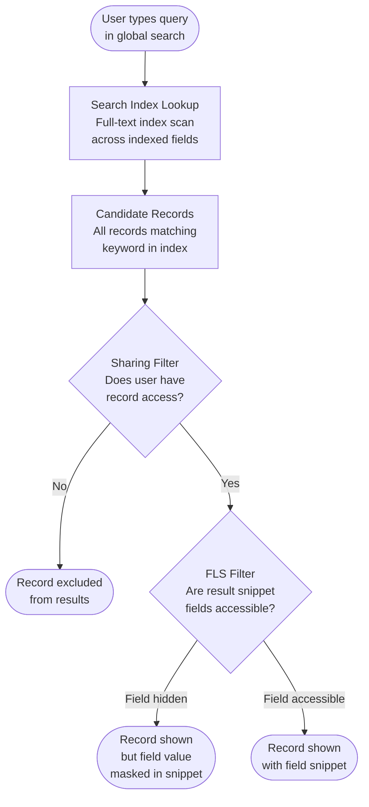
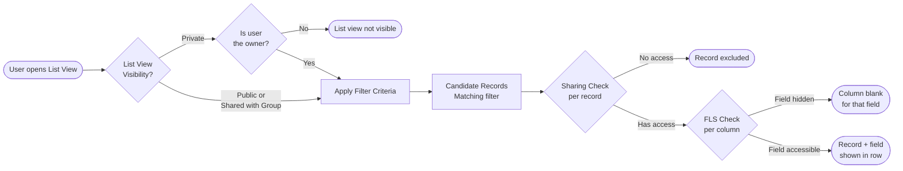

# List Views and Search Visibility

## Exam Domain
Object & Field Access — 20% of exam weight

## Foundations

List views and search are the two primary ways users discover records in Salesforce outside of direct navigation. Understanding how access controls flow through both mechanisms is essential for architects because they represent a read surface that is often underestimated in data access design.

A list view is a saved filter configuration — a set of criteria that determines which records appear and which columns are displayed. It is a query, not a data container. The records in a list view come from the sharing model; the columns come from FLS.

Search — whether the global search bar, SOSL in code, or Einstein Search — also respects the sharing model. Users can only discover records through search that they have sharing access to. FLS controls which field values contribute to the search index for a given user.

Neither list views nor search can be used to circumvent the Two-Gate model from Lecture 13. They are surfaces built on top of the same access infrastructure.

## Core Concepts

### List View Visibility Types

List views have three visibility levels:

| Visibility | Who Can See It |
|---|---|
| **Visible to Me (Private)** | Only the owner (creator) of the list view |
| **Visible to All Users** | All users with Read access to the object |
| **Visible to Certain Groups** | Specific public groups, roles, or territories |

A critical distinction: **list view sharing shares the filter configuration, not the underlying data.** When a manager shares a "High Priority Cases" list view with their team, each team member sees only the records within that filtered view that they individually have sharing access to. Two users looking at the same shared list view may see different records because their sharing grants differ.

This is a common exam trap: sharing a list view is not a way to grant record access. It only distributes the filter definition.

### List View FLS Interaction

Columns in a list view are limited by FLS. A user cannot add a field to a list view if they do not have FLS Read access to that field. If a field is removed from a user's FLS after a list view was created with that field as a column, the field column disappears from their view of the list view (though the list view itself is not modified for other users).

### List View Record Count Limit

Salesforce list views display a maximum of 2,000 records. When more than 2,000 records match the filter criteria, the list view shows the first 2,000 (ordered by the active sort). Users are not notified that additional records exist beyond that cap unless they observe the record count. This is a performance boundary, not a security boundary — records beyond 2,000 are not hidden for access reasons; they simply are not displayed in the UI.

### List View Performance and Indexed Fields

List view performance degrades significantly when filter criteria use non-selective, non-indexed field conditions on large objects. Factors:

- **Indexed fields** (standard): `OwnerId`, `CreatedDate`, `LastModifiedDate`, `Name`, `RecordTypeId`, and most standard lookup/ID fields are indexed by default.
- **Custom indexed fields:** Custom fields can be indexed via a Salesforce Support request (custom index) or through selective criteria in certain contexts.
- **Negation conditions** (`!= 'Closed'`, `NOT IN`) are inherently non-selective — they don't help narrow the result set effectively and can cause full table scans on large objects.
- **Leading wildcards** in text searches (`LIKE '%keyword%'`) are not index-friendly.

The architect pattern for list view performance: design filter criteria around indexed fields, especially `OwnerId` (which is automatically filtered by sharing for private OWD objects) or `RecordTypeId`.

### SOQL vs SOSL

These two query languages serve different purposes:

| | SOQL | SOSL |
|---|---|---|
| **Scope** | One object at a time (with related objects via subquery) | Multiple objects simultaneously |
| **Use case** | Structured data retrieval | Full-text search across objects |
| **Example** | `SELECT Id FROM Account WHERE Name = 'Acme'` | `FIND 'Acme' IN ALL FIELDS RETURNING Account, Contact` |
| **Sharing** | Respects sharing rules (with `with sharing` or `USER_MODE`) | Respects sharing rules |
| **Index** | Uses standard DB indexes | Uses search index |

For architects: SOSL is used for keyword-based search (like the global search bar). SOQL is used for structured data queries. Both must be sharing-enforced when running in user context.

### Salesforce Search Architecture

The global search bar in Salesforce Lightning Experience uses an asynchronous search index. Key behaviors:

1. **Sharing enforcement:** Search results only include records the running user has share access to.
2. **FLS enforcement:** Fields hidden by FLS do not contribute to search snippets shown to that user, and field values from FLS-restricted fields do not appear in search results even if the record matches.
3. **Index lag:** The search index is updated asynchronously after record creation or modification. A newly created record may not appear in search results immediately (typically seconds to a couple of minutes in normal conditions, longer under high load).
4. **Searchable fields:** Not all fields are indexed for search. Salesforce limits which fields contribute to the full-text search index per object. Standard fields like Name, email, phone, and most text fields are indexed. Long text areas and some field types are excluded.
5. **Recently Viewed:** The recently viewed list is populated from the user's own navigation history and is not share-filtered at display (it only shows records the user accessed, which by definition they had access to at that time — though access could later be revoked).

### Search Layout vs Page Layout

Search layouts control which fields appear in search result rows when a user searches globally or on a lookup field. They are configured per object in Object Manager. Unlike page layouts, search layouts are not profile-specific — they apply to all users. However, FLS still filters out individual field values a user cannot see.

Search layouts affect:
- Global search result columns
- Lookup dialog columns
- Recently Viewed columns

### Lookup Search Filters

Lookup filters constrain which records are eligible for selection in a lookup field. For example, an Account lookup on Opportunity can be filtered to only show Accounts where `Active__c = true`. Lookup filters are:
- **UI enforcement only:** They prevent selection in the UI but do not prevent setting the field value via API or DML.
- **Not a security control:** A user can still relate an inactive Account to an Opportunity via API.
- Required vs. optional: Lookup filters can be set as Required (blocks save if filter not met) or Optional (warns but allows).

### Einstein Search

Einstein Search adds semantic/NLP understanding to global search — it can interpret natural language queries and provide personalized results based on user patterns. From a security architecture perspective, Einstein Search still respects sharing rules and FLS. The AI layer does not create any new access surface.

---

## PTA / SA Relevance

### When This Comes Up in Engagements

- **Service cloud implementations:** Agents need list views scoped to their queue. Architects must design list views that filter by queue ownership so agents only see cases relevant to them, while respecting that Case OWD and sharing rules are the actual access controls.
- **Large-volume objects:** When objects have millions of records, list view filter design is a performance engineering concern. Architects must push customers to use indexed fields.
- **Self-service portals (Experience Cloud):** External users perform search. Architects must verify that the sharing model correctly limits what external users can discover through search, especially when internal records should not be surfaced externally.
- **Data masking and search:** If a field is FLS-restricted (e.g., SSN), ensuring it does not appear in search result snippets requires FLS to be set correctly.

### Common Architecture Failures

1. **Sharing a list view as a data access workaround.** Teams use "share list view with role X" thinking it grants record access. It does not. Recipients may see an empty list view if sharing rules don't give them access to the records.
2. **Non-indexed filter criteria on large objects.** A list view on a 5M-record object filtered by `Custom_Status__c = 'Open'` (unindexed custom field) causes full table scans and times out for users.
3. **Lookup filters treated as security controls.** A developer adds a lookup filter to prevent associating inactive accounts, but a batch job bypasses the filter via DML and creates data integrity issues.
4. **Not accounting for search index lag in integrations.** A process creates a record and immediately searches for it; search returns no results because the index hasn't updated.

### Enterprise Patterns

- **Queue-based list views for service operations:** Each service queue owns a list view filtered to "My Team's Cases" (by OwnerId IN current user's teams); sharing enforces record access; list view provides the UI.
- **Split list views by role for sales:** Private list views per sales rep ("My Open Opportunities") plus shared views at the team level ("Team Q3 Pipeline") using role-based visibility.
- **Custom search layouts per object:** Configure search layouts to surface the most decision-relevant fields (account name, industry, revenue range) so users can triage from search results without opening each record.

---

## Architecture

### Search Request Flow

### List View Access Resolution

**Limitations & Tradeoffs:**

- List views cap at 2,000 records; for objects with high record volume, users working exclusively via list views have an inherently limited view. Reports or custom apps are needed for full-volume queries.
- Search index updates are asynchronous — near-real-time is not guaranteed. Process designs that rely on immediately searching for a just-created record are fragile.
- Search layouts are not profile-specific, meaning all users see the same column configuration in search results (FLS still filters individual values, but column structure is uniform).
- Lookup filters are UI-only and can be bypassed via API — they should not be used to enforce referential integrity for security-critical relationships.

---

## Key Facts to Memorize

- List views share the filter configuration, not the data. Recipients see only records their sharing allows.
- List view maximum display: 2,000 records.
- Private list views are visible to the owner only. Public views are visible to all users with object Read.
- Search respects sharing rules and FLS — users cannot discover records or field values they lack access to.
- Search index updates are asynchronous — newly created records may not appear in search immediately.
- Search layout ≠ page layout. Search layouts control search result columns and apply to all users (FLS still filters values).
- Lookup filters are UI-only; they cannot be used as security controls.
- FLS-hidden fields do not appear in list view columns or search result snippets for that user.
- SOSL = multi-object full-text search. SOQL = single-object structured query.
- Einstein Search respects sharing and FLS — it does not create new access.

## Exam Traps

- **"Sharing a list view grants record access to recipients"** — False. It shares the filter; records shown are still governed by sharing rules.
- **"Lookup filters prevent API-based assignment of records that don't meet filter criteria"** — False. Lookup filters are UI-only.
- **"Search surfaces records regardless of sharing because the index is global"** — False. Sharing is enforced on search results.
- **"A user who lacks FLS on a field cannot have that field in any list view column"** — True (they cannot add it and it disappears if previously added).
- **"The search index is updated synchronously on record save"** — False. Index updates are asynchronous; there is a lag.

## Practice Questions

**Question 1**

A sales manager creates a "Top Accounts Q4" list view on the Account object, sets it as "Visible to All Users," and populates it with filter criteria for `AnnualRevenue > 1,000,000`. A junior sales rep on the team opens the list view and sees only 12 records, while the manager sees 47. What is the most likely explanation?

A. The list view has a 12-record display limit for non-admin users.
B. The junior sales rep has FLS restrictions on the AnnualRevenue field, which is the filter criterion.
C. The Account OWD is Private and the junior rep only has sharing access to 12 Accounts that meet the filter criteria.
D. The list view is cached from the manager's session and has not refreshed for the junior rep.

**Answer: C**

**Explanation:** List views apply the filter criteria across all records in the database, then show only the records each user has sharing access to. With a Private OWD on Account, the junior rep's sharing access is limited to accounts they own or that have been shared with them via rules, hierarchy, or manual shares. The manager likely has a higher role in the hierarchy and sees records owned by everyone below them. The list view itself is correct — it distributes the filter, not the data.

**Why others are wrong:**
- A: There is no record display limit based on user type (other than the 2,000-record overall limit).
- B: FLS on `AnnualRevenue` affects whether the field value is visible as a column in the results, not whether the filter logic runs. The filter runs in the database — a user without FLS Read on AnnualRevenue would still see matching records (just without the AnnualRevenue column value), unless FLS also prevents the field from being used as a filter criterion (which in some contexts it can, but the primary explanation here is sharing).
- D: List views are not user-session cached across users in this way.

---

**Question 2**

A developer writes a process that creates a new Contact record and then immediately uses SOSL to search for the Contact by name to retrieve its ID for a follow-up operation. In testing, the SOSL search occasionally returns zero results. What is the cause?

A. SOSL does not search the Contact object by default.
B. The Contact was created without sharing access from the developer's profile, so search cannot find it.
C. The search index is updated asynchronously; the newly created Contact may not yet appear in search results.
D. SOSL requires a minimum of 2 characters to return results; the Contact name is too short.

**Answer: C**

**Explanation:** Salesforce's search index is populated asynchronously after record creation and modification. Immediately after a `INSERT` DML, the record exists in the database but may not yet be indexed for search. SOSL queries the search index, so the contact may not be found. The correct architecture for this pattern is to use SOQL (not SOSL) to retrieve the ID of a just-created record — SOQL queries the database directly and will immediately find a committed record.

**Why others are wrong:**
- A: SOSL searches Contact records by default and can be configured with RETURNING clauses for specific objects.
- B: The developer created the record, so they have ownership-based sharing access to it. This is not the cause.
- D: SOSL does have minimum character requirements in some contexts, but the scenario describes "occasional" failures — suggesting an asynchronous timing issue rather than a consistent configuration problem.

---

**Question 3**

An architect is designing list views for a service operations team working on a Case object with 8 million records and a Private OWD. The team manager requests a list view filtered by `Priority != 'Low'` to show all high-priority and medium-priority cases. During UAT, the list view times out. What is the most appropriate resolution?

A. Increase the list view record limit from 2,000 to 10,000 via a Salesforce Support request.
B. Refactor the filter to use indexed fields, such as `OwnerId = Current User` combined with `Priority IN ('High', 'Medium')`, to create a selective query.
C. Change the Case OWD to Public Read/Write to eliminate sharing overhead.
D. Use a Report instead of a list view, as reports have higher record limits.

**Answer: B**

**Explanation:** The filter `Priority != 'Low'` is a negation condition that is non-selective — it cannot use an index effectively and forces a scan of all 8 million records before applying sharing filters. Adding a highly selective indexed condition (such as `OwnerId` which is indexed and reduces the set to records the user owns) dramatically reduces the scan. The combination of `OwnerId = Current User` plus `Priority IN ('High','Medium')` lets the database use the OwnerId index to narrow the result set first, then applies the priority filter to a much smaller subset.

**Why others are wrong:**
- A: The 2,000-record display limit is a UI rendering limit, not the cause of the timeout. Increasing it would make performance worse, not better.
- C: Changing OWD to Public Read/Write would reduce sharing filter overhead, but it also eliminates record-level security for all Cases — an unacceptable tradeoff for sensitive case data, and not the right solution to a query performance problem.
- D: Reports do support more records than list views (up to 2,000 rows in standard export, configurable higher), but they have the same underlying query performance constraints. Moving the same poorly-designed filter to a report does not solve the performance problem.
