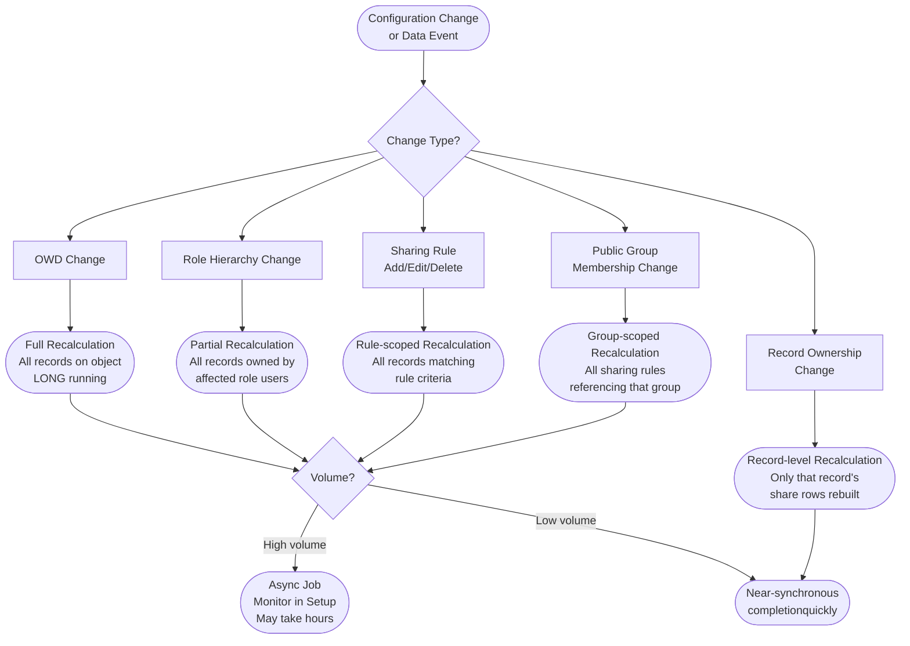
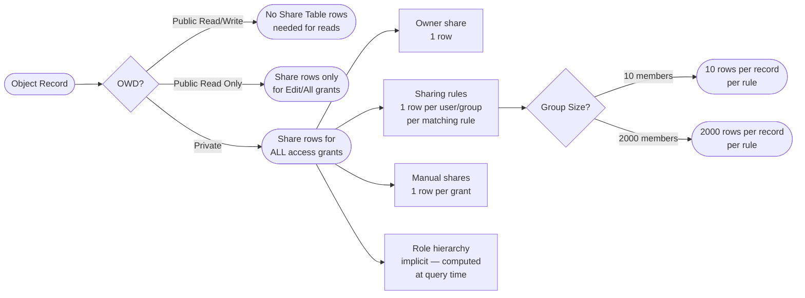

# Sharing Performance and Scalability

## Exam Domain
Performance & Scalability — 15% of exam weight

## Foundations

Sharing in Salesforce is not free. Every sharing grant — whether from OWD, a sharing rule, the role hierarchy, or a manual share — is stored or computed, and the machinery that maintains this system has measurable cost at scale. Architects who design complex sharing models without understanding the performance implications discover the consequences in production: slow list views, sharing recalculation jobs that run for hours, and time-out errors on bulk operations.

The core insight is this: **the more restrictive the OWD and the more complex the sharing rules, the larger and more expensive the sharing system becomes.** A Private OWD object with 10 sharing rules and 1 million records requires the platform to maintain far more share records and perform far more computation than the same object with a Public Read/Write OWD.

Performance-first sharing architecture does not mean compromising security — it means choosing the least-restrictive OWD that meets the actual requirement, and being surgical about where complexity is added.

## Core Concepts

### The Share Table Architecture

For every object with private or restricted sharing, Salesforce maintains an implicit **Share table**. For standard objects, these are named `AccountShare`, `ContactShare`, `OpportunityShare`, etc. For custom objects, the Share table is named `[ObjectAPIName]__Share`.

Each row in a Share table represents one sharing grant:
- **UserOrGroupId:** The User, Role, or Public Group receiving the share.
- **AccessLevel:** `Read`, `Edit`, or `All` (for manual shares; Rules create Read or Edit).
- **RowCause:** Why this share exists — `Owner` (ownership), `Rule` (sharing rule), `Manual` (manual share), `ImplicitParent` (child of accessible parent), etc.

For an Account with 5 sharing rules where each rule covers a role group of 100 users, the platform may need to expand that to individual User-level shares internally — potentially 500+ share rows per record. Multiply by 1M records and the Share table has 500M+ rows.

### Share Table SOQL for Debugging

Architects and developers can inspect the Share table directly:

```apex
List<AccountShare> shares = [
    SELECT UserOrGroupId, AccessLevel, RowCause
    FROM AccountShare
    WHERE AccountId = :targetAccountId
];
```

For custom objects:
```apex
List<Project__Share> shares = [
    SELECT UserOrGroupId, AccessLevel, RowCause
    FROM Project__Share
    WHERE ParentId = :targetProjectId
];
```

This is the primary debugging technique when a user unexpectedly has or lacks access to a record — query the Share table to see every explicit grant and its cause.

### When Sharing Recalculation Is Triggered

Salesforce recalculates sharing whenever something changes that could affect who can access which records. Major triggers:

| Change | Recalculation Scope |
|---|---|
| OWD setting change | Full recalculation for that object — ALL records |
| Role hierarchy restructure (add/remove/move role) | All records owned by users in affected roles |
| Sharing rule added, modified, or deleted | All records that could match the rule criteria |
| Public Group membership change | All sharing rules that reference the modified group |
| Record ownership change (Private OWD object) | That specific record's share rows are rebuilt |
| Territory assignment change | Records in the affected territory |

**OWD changes and role hierarchy changes are the most expensive triggers** — they require a full recalculation across all records of the affected object. For large orgs (millions of records, complex hierarchies), these jobs can take hours.

### Asynchronous Recalculation

When a recalculation-triggering event occurs, Salesforce does not immediately recalculate all shares synchronously. Instead:
1. The change is committed.
2. A background sharing recalculation job is queued.
3. The job processes records in batches asynchronously.

During the recalculation period, some records may temporarily show the old sharing state. For most use cases this is acceptable. For time-sensitive sharing requirements (e.g., a record that must be immediately accessible after ownership change), architects must account for this lag.

**Monitoring recalculation jobs:** Setup > Sharing Settings > shows currently running and queued recalculation jobs with progress indicators. For programmatic monitoring, query the `UserRecordAccess` object and check for delays, though native job status is best observed in Setup.

**Manual Recalculate:** Each object in Setup > Sharing Settings has a "Recalculate" button that forces a full rebuild of all Share records for that object. Use this during maintenance windows when corruption or inconsistency is suspected.

### Deferring Sharing Recalculation in Batch Apex

When a batch job inserts or updates a large number of records, triggering per-record sharing recalculation for each record is extremely inefficient. Salesforce provides a mechanism to defer recalculation until the batch completes:

```apex
Database.DeferSharingCalculation sharingDeferral = new Database.DeferSharingCalculation();
```

Or in batch execute context, using the system-level deferral:

```apex
// Typically available in Batch Apex context:
System.setAllSharingCalculationDisabled(true);
// ... perform bulk DML ...
System.setAllSharingCalculationDisabled(false);
// Sharing recalculation is triggered once after re-enable
```

The exact API depends on the Salesforce version and context. The principle: batch operations should defer sharing recalculation to happen once after all records are processed, not once per record.

**When to use deferral:**
- Bulk data loads (initial data migration, large-scale automated updates)
- Nightly batch jobs that update ownership on thousands of records
- Queue-based reassignment jobs

**When NOT to defer:**
- Real-time user-initiated operations where immediate access is expected
- Processes where another downstream component immediately relies on share grants being in place

### Bulk API and Sharing

The Bulk API is designed for high-throughput data operations. When using Bulk API:
- Record sharing recalculation is batched internally — the platform groups records and recalculates in batches rather than per-record.
- This is a performance feature; it does not change the eventual sharing outcome.
- For Bulk API inserts with Private OWD objects, there is a short period after insert before sharing rules are fully applied to new records.

### Performance-First Design Decisions

Architecture choices that directly reduce sharing system overhead:

1. **Relax OWD where security does not require restriction.** An object with Public Read Only OWD requires no Share table maintenance for reads. Only write access needs control. The highest-impact performance decision in a sharing model is OWD.

2. **Prefer criteria-based sharing rules over ownership-based sharing rules.** Criteria-based rules apply only to records matching the criteria — the scope is smaller. Ownership-based rules apply to all records owned by a user/role, which can be a larger set.

3. **Keep Public Groups lean.** Large public groups (hundreds or thousands of members) in sharing rules force the platform to expand the group to individual users when building the Share table — the more members, the more share rows per record.

4. **Keep the role hierarchy flat.** Sharing via role hierarchy is additive upward — a user sees all records owned by anyone below them. Deeper hierarchies mean more record traversal. Target 5-7 levels maximum for most enterprise implementations.

5. **Use queues for high-volume record ownership.** In bulk scenarios (e.g., incoming leads assigned to a queue before distribution), records owned by a Queue have simpler sharing mechanics than records with individual user ownership when sharing rules reference that queue.

6. **Avoid mixing OWD Private with large sharing rules on the same high-volume object.** The combination creates the worst-case Share table size.

### Record Count Thresholds

- Objects with >1M records and Private OWD: require explicit sharing architecture review; Share table can reach 100M+ rows.
- Sharing rule changes on objects with >500K records: schedule during maintenance windows; recalculation will take significant time.
- Objects with <100K records: sharing complexity has minimal performance impact; design for correctness first.

### Shield Event Monitoring for Sharing

Shield Event Monitoring captures sharing-related events:
- `DataExportEvent`: when a user exports data (could indicate overly broad sharing)
- `ContentDistributionEvent`: when content is shared externally
- Custom anomaly detection can be built on top of Event Monitoring to flag unusual access patterns that may indicate misconfigured sharing

### Custom Sharing Recalculation via Apex

For objects that use Apex-managed sharing (programmatic share row creation), Salesforce provides the `SharingRecalculation` interface. When a manual recalculation is triggered in Setup, Salesforce invokes the `recalculate()` method on classes implementing this interface:

```apex
global class ProjectSharingRecalculation implements SharingRecalculation {
    global void recalculate(SObject so) {
        // Custom logic to rebuild sharing for this record
    }
}
```

This allows architect-controlled logic to determine share grants — useful for complex sharing models that cannot be expressed through standard sharing rules.

---

## PTA / SA Relevance

### When This Comes Up in Engagements

- **Go-live performance issues:** Customer goes live with a complex sharing model and experiences slow list views, SOQL timeouts, and Share table queries timing out. Root cause is almost always OWD + sharing rule complexity on high-volume objects.
- **Org mergers:** When two Salesforce orgs merge, role hierarchy consolidation triggers massive recalculation. Architects must plan maintenance windows and potentially defer sharing recalculation.
- **Annual territory realignment:** Changing territory assignments in large Enterprise Territory Management deployments triggers recalculation across all territory-shared objects. This is a known annual pain point.
- **Large-scale data migration:** Migrating millions of records with Bulk API into a Private OWD object; architects must understand sharing is applied asynchronously.

### Common Architecture Failures

1. **OWD Private on all objects "for security."** Teams default to Private OWD everywhere without assessing actual access requirements. This creates unnecessary sharing infrastructure on objects that don't need it.
2. **Large public groups in sharing rules.** A sharing rule that says "Share all Accounts where Type = 'Enterprise' with the All Sales Users group (2,000 members)" creates a share row for each of 2,000 users per matching Account.
3. **Sharing rule changes in production during business hours.** A sharing rule modification kicks off a long recalculation job during peak usage, degrading performance for all users.
4. **No monitoring of recalculation jobs.** Administrators make a sharing change, the recalculation job fails silently or runs for 8 hours, and users experience access inconsistencies without anyone being alerted.

### Enterprise Patterns

- **Tiered OWD strategy:** Apply Private OWD only to objects with genuine need-to-know requirements (HR data, financial pipeline). Apply Public Read Only to objects where all users benefit from read access (reference data, product catalog). Apply Public Read/Write only to objects with no sensitivity.
- **Maintenance window protocol for sharing changes:** Treat OWD changes and large sharing rule additions as infrastructure changes — change control, sandbox testing of recalculation time, and scheduled off-hours deployment.
- **Share table health check:** Periodically query `__Share` tables for the highest-volume private objects to monitor row counts. Unexpected growth signals a sharing rule or ownership pattern creating excessive grants.

---

## Architecture

### Sharing Recalculation Trigger Matrix



### Share Table Scale Model



**Limitations & Tradeoffs:**

- `System.setAllSharingCalculationDisabled(true)` is a powerful tool but must be re-enabled in the same transaction or the next save event; failing to re-enable causes all sharing to be suspended until the next recalculation trigger.
- Deferring sharing recalculation means there is a window where newly inserted or reassigned records are accessible only to the owner — other sharing rule grants are not yet applied.
- The "Recalculate" button in Setup initiates a full rebuild — for objects with millions of records, this is a long-running operation that should only be done in maintenance windows.
- Custom `SharingRecalculation` implementations are invoked synchronously during the manual recalculation; long-running implementations can cause governor limit issues on large datasets.

---

## Key Facts to Memorize

- Share tables are named `[Object]Share` for standard objects and `[APIName]__Share` for custom objects.
- Share table rows contain: UserOrGroupId, AccessLevel, RowCause.
- Sharing recalculation is asynchronous for large-scale changes.
- Most expensive triggers: OWD changes and role hierarchy restructuring.
- Monitor recalculation jobs: Setup > Sharing Settings.
- Defer sharing recalculation in batch Apex for bulk operations; don't defer for real-time user operations.
- Performance decisions: Relax OWD > keep groups lean > flatten hierarchy > prefer criteria-based rules.
- Large Public Groups in sharing rules create O(group members) share rows per record.
- The "Recalculate" button forces a full rebuild — use in maintenance windows only.
- Bulk API batches sharing recalculation internally; sharing is not immediate on insert.

## Exam Traps

- **"Sharing recalculation happens synchronously for all changes"** — False. Large-scale changes are asynchronous background jobs.
- **"The Recalculate button is safe to use any time in production"** — False. For large objects it triggers long-running jobs that can degrade performance.
- **"Criteria-based sharing rules are more expensive than ownership-based rules"** — False (generally). Criteria-based rules apply to a subset of records; ownership-based rules apply to all records owned by specified roles.
- **"Deferring sharing calculation means sharing is never applied"** — False. Sharing is applied when the deferral ends or at the next recalculation trigger.
- **"Public Read/Write OWD eliminates all sharing overhead"** — True for read operations; some overhead remains for edit-grant tracking.

## Practice Questions

**Question 1**

A batch Apex job reassigns ownership of 500,000 Opportunity records from a retiring sales rep to other reps. The Opportunity object has Private OWD. The job runs successfully but performance monitoring shows thousands of individual sharing recalculation events being triggered during the batch. What is the most appropriate remediation?

A. Change the Opportunity OWD to Public Read Only to eliminate sharing recalculation on ownership changes.
B. Split the batch into smaller batches of 200 records each to reduce recalculation load per batch.
C. Use `Database.DeferSharingCalculation` or the equivalent deferral mechanism in the batch to defer per-record sharing recalculation until the batch completes.
D. Run the batch during peak business hours to leverage Salesforce's auto-scaling infrastructure.

**Answer: C**

**Explanation:** Each ownership change on a Private OWD object triggers sharing recalculation for that record. For 500,000 records, this is 500,000 individual recalculation events. Deferring sharing calculation during the batch allows all DML to complete first, then triggers a single recalculation pass over the affected records. This is dramatically more efficient and is the designed mechanism for this use case.

**Why others are wrong:**
- A: Changing OWD is a significant architectural decision and would eliminate legitimate security controls. It solves the problem by removing the security requirement, not by optimizing the sharing system. Not appropriate.
- B: Smaller batches still trigger per-record recalculation; the total recalculation work is the same. This does not solve the problem.
- D: Running during peak hours makes the problem worse by adding sharing recalculation load during high user activity.

---

**Question 2**

An administrator changes the Account OWD from Public Read Only to Private in a production org with 2 million Account records. Users immediately report that some accounts they previously accessed are no longer visible. The administrator is alarmed. What should the architect explain?

A. The OWD change was applied incorrectly and must be reverted immediately.
B. The OWD change has permanently removed sharing access for all users who are not record owners.
C. The sharing recalculation triggered by the OWD change is running asynchronously in the background. Access will normalize as recalculation completes; monitor the job in Setup > Sharing Settings.
D. Users must request manual shares for each Account they need to access under the new Private OWD.

**Answer: C**

**Explanation:** An OWD change on a high-volume object triggers a full asynchronous recalculation of sharing across all records. During this period, some records may temporarily appear inaccessible as the sharing system transitions from the old state to the new state. This is expected behavior. The administrator should monitor the recalculation job in Setup > Sharing Settings and communicate to users that access will stabilize once the job completes. If sharing rules were configured to grant appropriate access under the new Private OWD, users should regain expected access once recalculation finishes.

**Why others are wrong:**
- A: Reverting the OWD would trigger another full recalculation, compounding the issue. This should only be done if the change was made in error.
- B: The sharing rules, role hierarchy, and other sharing mechanisms still apply once recalculation completes — users who should have access via those mechanisms will regain it.
- D: If the sharing model (rules, hierarchy) is correctly designed for Private OWD, manual shares should not be needed en masse.

---

**Question 3**

An architect is reviewing a high-volume custom object `Project__c` with 3 million records and Private OWD. There are two sharing rules: (1) share all records with the "All Internal Users" public group (5,000 members) where `Status__c = 'Active'`, and (2) share records with the "Executive Team" public group (50 members) where `Region__c = 'APAC'`. Approximately 80% of records have `Status__c = 'Active'`. What is the primary performance concern?

A. The "Executive Team" group is too large and should be replaced with a role.
B. Sharing rule 1 will generate approximately 12 million share rows (2.4M active records × 5,000 members), creating extreme Share table size and recalculation overhead.
C. The Private OWD is inappropriate for a 3-million-record object; it should be changed to Public Read/Write.
D. Criteria-based sharing rules cannot be used on custom objects; they must be replaced with Apex sharing.

**Answer: B**

**Explanation:** The math is the concern. 80% of 3M records = 2.4M Active records. Each of those records needs a share row for all 5,000 members of "All Internal Users." That is 2.4M × 5,000 = 12 billion share rows — a catastrophic Share table size. The architect should recommend replacing the large public group with a role (which uses implicit hierarchy sharing rather than individual rows), relaxing the OWD to Public Read Only if all internal users genuinely need read access to all active projects (which would eliminate the need for this sharing rule entirely), or scoping the sharing rule more narrowly.

**Why others are wrong:**
- A: The Executive Team (50 members) is small and creates only 50 × the matching record count share rows — manageable.
- C: Changing OWD to Public Read/Write is one valid architectural option but it requires justification against security requirements. The question asks for the performance concern, not the solution.
- D: Criteria-based sharing rules are supported on custom objects; this is not accurate.

---

**Question 4**

A developer needs to debug why a specific user cannot access a custom object record `Project__c` with ID `a01XX000000XXXX`. The user has the correct Profile with CRUD Read on the object and the OWD is Private. What is the most direct debugging approach?

A. Check the user's role in the role hierarchy and compare against the record owner's role.
B. Query the `Project__Share` table for the record ID and review all UserOrGroupId and RowCause entries to determine which sharing grants exist.
C. Open the record as a System Administrator and review the Sharing button to see all sharing grants.
D. Run the Health Check to verify the sharing model is compliant.

**Answer: B**

**Explanation:** The Share table is the definitive source of truth for explicit sharing grants. A SOQL query on `Project__Share WHERE ParentId = :recordId` returns every explicit sharing grant for that record — including which User or Group has access and why (RowCause). If the user (or a group they belong to) does not appear in the results and the user is not the record owner, that explains the access gap. This is the most direct and complete debugging method.

**Why others are wrong:**
- A: Checking role hierarchy is one hypothesis but requires manual cross-referencing. The Share table query gives a complete, definitive answer more efficiently.
- C: The Sharing button in Setup > record detail provides a UI view of shares, which is useful but less queryable and scriptable than SOQL against the Share table. For systematic debugging or automation, the SOQL approach is more robust. (This is a close second-best answer but B is more direct and programmatic.)
- D: Health Check evaluates security configuration at an org-wide level; it does not diagnose individual record-level sharing issues.
