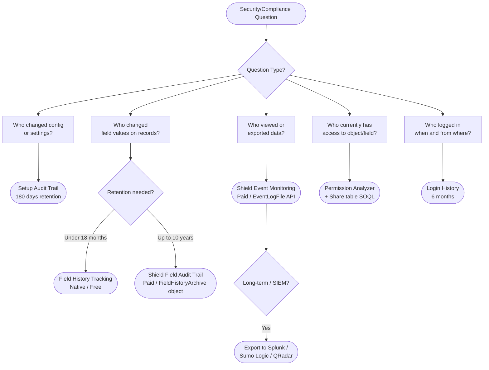
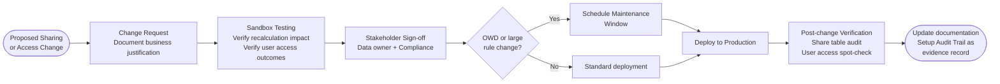

# Sharing Audit and Governance

## Exam Domain
Auditing & Monitoring — 15% of exam weight

## Foundations

Security without audit is not security — it is hope. An architect can design a technically correct sharing model, but without ongoing monitoring and governance, access creep, configuration drift, and undetected misuse will erode the model over time. Compliance frameworks like SOX, HIPAA, and GDPR don't just require that access be configured correctly at a point in time; they require demonstrable evidence that access has been appropriate continuously and that changes have been controlled.

This lecture covers the native tools Salesforce provides for audit, the Shield platform's extended capabilities, and the governance processes architects must design around these tools. The exam tests both knowledge of what each tool does (and its limitations) and the ability to select the right tool for a given compliance or investigation scenario.

## Core Concepts

### Native Audit Tools Overview

Salesforce provides several native audit and monitoring capabilities, each with different scope, retention, and purpose:

#### 1. Setup Audit Trail

**What it captures:** Configuration changes made in Setup — changes to sharing settings, profiles, permission sets, OWD changes, sharing rule additions/modifications, public group membership changes, custom field creation, login IP range changes, and more.

**Retention:** 180 days (6 months). Downloadable as CSV for longer retention.

**Key characteristic:** Captures the **who, what, and when** of configuration changes. It does NOT capture what data users accessed or viewed — only admin/configuration actions.

**Access:** Setup > Audit Trail.

**Exam relevance:** If the question asks "who changed the OWD on Account last Tuesday?" — Setup Audit Trail. If the question asks "who viewed this Contact record?" — Event Monitoring (Shield).

#### 2. Field History Tracking

**What it captures:** Changes to field values on individual records. For each tracked field, Salesforce stores: old value, new value, who made the change, when.

**Limits:** Up to 20 fields tracked per object (standard). The related list shows the tracked history inline on the record.

**Retention:** 18 months (standard). With Shield Field Audit Trail: up to 10 years, stored in a separate retention policy data model, queryable via API.

**Key characteristic:** Field History Tracking captures data changes, not data access. It answers "who changed this field value?" not "who read this record?"

**Not captured:** Read access (viewing a record), bulk API queries, report exports.

#### 3. Login History

**What it captures:** User login events — timestamp, login type (UI, API, mobile), source IP, status (success, failure).

**Retention:** 6 months in the UI; downloadable for longer storage.

**Use case:** Security investigation (failed login attempts, unusual IP addresses, API logins from unexpected locations).

#### 4. Event Monitoring (Shield — paid add-on)

**What it captures:** Detailed log of every user interaction — record views, API queries, report exports, data exports, dashboard views, login events, and more. Each event type is a separate log file available via API.

**Retention:** 1 day for most events (downloadable for longer retention); some events have 30-day retention. Requires external storage for long-term retention.

**Key capability:** Event Monitoring answers "who viewed this record?" — which is something none of the native free tools can answer. It is the primary tool for detecting data exfiltration, unauthorized access patterns, and anomalous behavior.

**Access:** Via the EventLogFile object in the API (`SELECT EventType, LogDate, LogFile FROM EventLogFile`).

**Cost:** Paid Shield add-on. Not available in all org types.

### Comparing the Tools

| Tool | Captures Config Changes | Captures Data Changes | Captures Data Access | Retention | Cost |
|---|---|---|---|---|---|
| Setup Audit Trail | Yes | No | No | 180 days | Free |
| Field History Tracking | No | Yes | No | 18 months (10yr w/Shield) | Free (limited fields) |
| Login History | N/A | No | Login only | 6 months | Free |
| Event Monitoring | No | No | Yes (all interactions) | 1-30 days + export | Shield (paid) |
| Shield Field Audit Trail | No | Yes (extended) | No | Up to 10 years | Shield (paid) |

### "Who Can See This Record?" — The Gap

Salesforce does not have a native single-click "who has access to this record?" button that shows all users with access. Determining complete access requires:
1. **Query the Share table** for explicit shares (Lecture 16).
2. **Know the role hierarchy** — anyone in a role above the owner (in a private OWD model) has implicit access via hierarchy.
3. **Check OWD** — if Public Read/Write, all users have access.
4. **Check team sharing** — Account Teams, Case Teams, Opportunity Teams grant access outside of standard rules.

For investigation purposes, the closest native tool is Setup > Users > (user) > Object Permissions to check CRUD, combined with Share table SOQL for specific records.

### Sharing Debug Log

Salesforce provides a Sharing Debug Log that traces the sharing recalculation steps for a specific user. Enable it in Setup > Sharing Settings > Sharing Debug. When enabled for a user, subsequent recalculation events for that user are logged with step-by-step detail about which rules matched and which grants were created. This is distinct from the Apex Debug Log and is specifically for diagnosing sharing issues.

### Permission Analyzer

Permission Analyzer (Setup > Permission Analyzer) allows an administrator to:
- Query effective permissions for a user, profile, or permission set.
- Generate reports showing who has access to specific objects, fields, or system permissions.
- Identify which profiles have View All Data, Modify All Data, or other elevated permissions.
- Find users who have access to a sensitive field across all profiles and permission sets.

This is the primary tool for the audit question "who in this org has access to field X?" without writing SOQL.

### Effective Permissions: The Additive Model

A user's effective permissions are the union of:
- Their Profile permissions
- All Permission Sets assigned to them
- All Permission Set Groups assigned to them

There is no single screen in the native UI that shows the complete effective permission set for a user (Profile + all PSets combined). Permission Analyzer bridges this gap by computing the union and displaying it.

### Governance Frameworks

#### Quarterly/Annual Access Review

Best practice for compliance-driven orgs:
1. Export user + profile + permission set assignments.
2. Run Permission Analyzer to identify elevated permissions (View All Data, Modify All Data, API Enabled, sensitive field access).
3. Cross-reference against HR data (job function, active employment).
4. Remove access that no longer matches business role.
5. Document findings and sign-off for auditors.

#### Profile and Permission Set Change Management

- Changes to profiles and permission sets should go through a formal change request process.
- Sandbox testing required before production deployment.
- Change sets or Salesforce DX (source control) for tracking changes.
- Approval required from data owner (business owner of the affected data).
- Setup Audit Trail provides the evidence trail for auditors.

#### OWD Change Governance

OWD changes are among the highest-impact configuration changes in Salesforce:
- They trigger full sharing recalculation (potentially hours for large orgs).
- They can grant or revoke access to millions of records simultaneously.
- They must be treated as significant architectural changes, not routine configuration.

Governance requirements:
- Formal change request with business justification.
- Sandbox testing of recalculation impact and user access outcomes.
- Stakeholder sign-off from data owners and compliance.
- Scheduled maintenance window for production deployment.
- Post-change verification of Share table state.

#### Role Hierarchy Governance

- Role additions/removals trigger sharing recalculation.
- Role restructuring should be infrequent and scheduled.
- Document the business rationale for each role.
- Quarterly review of role assignments vs. active employees.

### Shield Platform Components

Shield is a set of paid Salesforce features for enhanced security and compliance. The three components:

**1. Platform Encryption**
Encrypts data at rest using AES-256 encryption. Key management through Salesforce or customer-managed keys (Bring Your Own Key / BYOK).

Critical architectural constraint: **Encrypted fields cannot be used as criteria in criteria-based sharing rules.** The sharing engine cannot evaluate encrypted field values when calculating access. Architects must plan sharing models before enabling encryption, as encryption may force redesign of sharing rules.

Additional constraints: encrypted fields cannot be used in SOQL WHERE clauses (except for deterministic encryption), cannot be used in formula fields, cannot be used in process builder criteria.

**2. Event Monitoring**
Detailed user activity logs as described above. Key for compliance (who accessed what, when) and anomaly detection.

**3. Shield Field Audit Trail**
Extends Field History Tracking to 10-year retention with a defined data retention policy. Uses a separate `FieldHistoryArchive` object queryable via API. Required for SOX, HIPAA, and other regulations that mandate long-term audit trails of data changes.

### Encryption + Sharing Interaction (Critical Exam Topic)

If a field is encrypted with Shield Platform Encryption and criteria-based sharing rules reference that field as criteria, the sharing rule will not function correctly. The sharing engine cannot decrypt and evaluate field values at rule application time. The architect must either:
- Use non-encrypted fields for sharing rule criteria.
- Redesign sharing to use ownership-based rules instead of criteria-based.
- Use Apex-managed sharing that explicitly handles the field value access.

This is a high-probability exam trap.

### SIEM Integration Pattern

For enterprise compliance, Event Monitoring logs are commonly pushed to a Security Information and Event Management (SIEM) system:
- **Splunk:** Most common. Salesforce has a native Splunk app for Event Monitoring log ingestion.
- **Sumo Logic, IBM QRadar, Microsoft Sentinel:** Also supported.

The integration pattern: a scheduled job pulls `EventLogFile` records from the Salesforce API and ships the log data to the SIEM. The SIEM then runs correlation rules, anomaly detection, and compliance reports centrally across multiple systems.

### Connected App OAuth Access

OAuth tokens granted to connected apps are part of the access surface. A user who authenticates via OAuth grants the connected app API access under their identity. If the user's sharing model is broad, the connected app inherits that access. Administrators can:
- Revoke OAuth tokens per user (Setup > Users > (user) > Connected App OAuth Usage).
- Set IP restrictions and OAuth policies on connected apps.
- Use Event Monitoring to track API access patterns from connected apps.

### Compliance-Specific Patterns

**SOX (Sarbanes-Oxley):**
- Segregation of duties: users with Create/Edit on financial objects should not have Delete; approvers should not be the same as submitters.
- Audit trail: Setup Audit Trail + Shield Field Audit Trail for 7-year financial data retention.
- Access review: quarterly review of all users with financial object access.

**HIPAA (Health Insurance Portability and Accountability Act):**
- PHI (Protected Health Information) fields must have FLS restrictions.
- Access logging: Event Monitoring to log who accessed PHI records.
- Minimum necessary access: private OWD on patient records with role-based sharing.
- Breach detection: Event Monitoring anomaly alerts for unusual access volumes.

**GDPR (General Data Protection Regulation):**
- Right to erasure: data retention policies; automated deletion flows for inactive contacts.
- Data minimization: FLS to restrict access to personal data fields.
- Audit trail: demonstrate lawful basis for data processing; Setup Audit Trail for consent field changes.

---

## PTA / SA Relevance

### When This Comes Up in Engagements

- **Pre-go-live security review:** Customer's security/compliance team asks for evidence of access controls before production launch. Architect must demonstrate: FLS configuration, OWD, sharing rules, and the monitoring plan.
- **Incident investigation:** "We think an employee exported customer data before leaving." Event Monitoring is the answer — check DataExportEvent and ReportEvent for the user's activity in the relevant time period.
- **Compliance audit:** External auditor requests evidence of who has access to financial fields and what changes have been made to sharing configuration in the last year. Setup Audit Trail + Permission Analyzer + Shield Field Audit Trail.
- **Access creep remediation:** Org has grown and accumulated permission sets; quarterly review reveals users with permissions well beyond their role. Permission Analyzer + removal campaign.

### Common Architecture Failures

1. **No audit plan designed.** Architect designs the sharing model but never specifies which events need to be logged, what retention period is required, or who reviews the logs. Compliance teams discover the gap during audit.
2. **Relying on Field History Tracking for compliance when 10-year retention is required.** Standard tracking retains 18 months; compliance teams expecting HIPAA-compliant audit trails need Shield Field Audit Trail.
3. **Encrypting sharing rule criteria fields.** Architect encrypts a Status field for compliance, then discovers the criteria-based sharing rules that use Status no longer work. The sharing model must be redesigned.
4. **No change management for OWD changes.** An admin changes OWD in sandbox, moves it to production via change set without stakeholder review, triggers a 6-hour recalculation during business hours, and users lose access to records during the window.

### Enterprise Patterns

- **Audit-first design:** Before implementing the sharing model, define the audit requirements (what events, retention, reporting). Design the tooling stack (native vs Shield vs SIEM) to meet those requirements. Then implement the sharing model.
- **Evidence binder for compliance:** A documented package maintained quarterly: Permission Analyzer export, Setup Audit Trail download, Event Monitoring anomaly report, access review sign-off. This is what auditors ask for.
- **Role-based access review workflow:** Use a Salesforce-internal approval process where role managers review and confirm their team's access quarterly. Results stored as Approval History records for audit evidence.

---

## Architecture

### Audit and Governance Toolchain

### Governance Process Flow

**Limitations & Tradeoffs:**

- Setup Audit Trail has a 180-day retention limit. Organizations with annual compliance cycles must download and archive the trail regularly or face gaps in evidence.
- Event Monitoring (Shield) logs are available for only 1-30 days in Salesforce storage — they must be exported and stored externally for longer retention. This requires an integration/ETL investment.
- Field History Tracking is limited to 20 fields per object. On objects with many sensitive fields, architects must prioritize which fields to track.
- Permission Analyzer is powerful but does not show time-based access history — it shows current state only. Historical access queries require combining Setup Audit Trail with archived user/profile/permset assignments.
- Shield is a paid add-on — smaller orgs or lower-tier licenses may not have budget for it. Architects must design governance approaches that work within the available toolset.

---

## Key Facts to Memorize

- Setup Audit Trail: configuration changes, 180-day retention, free.
- Field History Tracking: field value changes, 18-month retention, max 20 fields/object, free.
- Login History: login events, 6-month retention, free.
- Event Monitoring: all user interactions (views, exports, API calls), 1-30 days in platform, paid Shield.
- Shield Field Audit Trail: field value changes, up to 10 years, paid Shield.
- Encrypted fields (Shield Platform Encryption) CANNOT be used as criteria in criteria-based sharing rules.
- Permission Analyzer: current effective permissions across profiles/permission sets, free native tool.
- "Who can see this record?": requires Share table SOQL + knowledge of role hierarchy + OWD check.
- Connected App OAuth tokens are part of the access surface; revocable per user in Setup.
- SOX/HIPAA/GDPR each require specific combinations of tools; know which fits which regulation.

## Exam Traps

- **"Field History Tracking shows who viewed the record"** — False. It shows who changed field values, not who read the record. Event Monitoring shows views.
- **"Setup Audit Trail captures all user activity including record views"** — False. It captures configuration changes only.
- **"Encrypting a field with Shield Encryption blocks it from criteria-based sharing rules"** — True. This is an architectural constraint.
- **"Event Monitoring is available in all Salesforce editions"** — False. It is a paid Shield add-on.
- **"Field History Tracking retains data for 10 years"** — False for standard. Only Shield Field Audit Trail provides 10-year retention.
- **"Permission Analyzer shows historical access (who had access last quarter)"** — False. It shows current state only.

## Practice Questions

**Question 1**

A compliance officer at a financial services company needs to produce evidence that no unauthorized changes were made to the Account OWD or sharing rules in the past 5 months. Which tool provides this evidence?

A. Field History Tracking on the Account object.
B. Setup Audit Trail, downloadable as CSV and filtered for sharing-related configuration changes.
C. Shield Event Monitoring, filtered for AdminEvent log type.
D. Permission Analyzer, run against the System Administrator profile.

**Answer: B**

**Explanation:** Setup Audit Trail records all configuration changes in Setup, including OWD changes and sharing rule modifications. It retains 180 days (just under 6 months) and can be downloaded as CSV. For a 5-month lookback, this falls within the retention window. Filtering the export for Account OWD and sharing rule entries provides a point-in-time record of every change, who made it, and when.

**Why others are wrong:**
- A: Field History Tracking captures changes to field values on data records, not changes to configuration/sharing settings.
- C: Event Monitoring captures user interaction events (record views, API calls, exports). Admin configuration changes are captured in Setup Audit Trail, not Event Monitoring.
- D: Permission Analyzer shows current permissions — it does not provide historical data about when or how permissions were changed.

---

**Question 2**

An architect is designing a sharing model for a healthcare org. The `Patient_Record__c` object has a custom field `Diagnosis__c` that must be encrypted using Shield Platform Encryption. The initial design includes a criteria-based sharing rule: "Share Patient Records where `Diagnosis__c` contains 'Oncology' with the Oncology Care Team role." What problem will this design cause?

A. The sharing rule will cause performance degradation because encrypted fields require more processing time.
B. Encrypted fields cannot be used as criteria in criteria-based sharing rules; the rule will not function as intended.
C. The Oncology Care Team will have full Edit access because encryption grants elevated permissions.
D. The sharing rule will work correctly during recalculation but will fail on individual record saves.

**Answer: B**

**Explanation:** Shield Platform Encryption encrypts field values at rest. The sharing calculation engine cannot evaluate encrypted field values when applying sharing rule criteria — it cannot compare an encrypted value to a plaintext search string. The criteria-based sharing rule using `Diagnosis__c` as criteria will not function. The architect must redesign: either use a non-encrypted field (such as a separate `Care_Team__c` picklist field) as the sharing criteria, switch to ownership-based sharing, or implement Apex-managed sharing that handles the field access explicitly.

**Why others are wrong:**
- A: Performance degradation is a secondary concern; the functional problem is that the rule won't work at all.
- C: Encryption does not grant or modify access levels; it only affects whether the field value is visible and usable in criteria.
- D: The failure is not timing-dependent — it is a structural incompatibility between encryption and criteria evaluation.

---

**Question 3**

A security analyst suspects that a recently departed employee exported a large volume of Contact records in the week before their departure. Which Salesforce tool provides the evidence needed to investigate this?

A. Setup Audit Trail — filter for the user's activity during the relevant period.
B. Field History Tracking on the Contact object — review changes made by the user.
C. Shield Event Monitoring — review the DataExportEvent and ReportEvent log files for the user during the relevant period.
D. Login History — review the user's login sessions during the relevant period.

**Answer: C**

**Explanation:** Shield Event Monitoring is the only tool that captures what data a user accessed or exported. The `DataExportEvent` log captures use of the Data Export feature; `ReportEvent` logs report executions (which could be used to export large data sets); there are also `ApiEvent` and `BulkApiResultEvent` log types for API-based access. Reviewing these logs for the user during the relevant period can provide evidence of bulk data access or export.

**Why others are wrong:**
- A: Setup Audit Trail captures configuration changes, not data access or exports. It would not show if the user exported Contact records.
- B: Field History Tracking shows who modified field values — it does not show who read or exported records.
- D: Login History shows when the user logged in and from where, which provides context but not evidence of which data was accessed or exported.

---

**Question 4**

A Salesforce administrator is conducting a quarterly access review. They need to identify every user in the org who currently has Read access to the custom field `Compensation__c` on the Employee__c object. What is the most efficient approach?

A. Manually open each profile in Setup and check the field-level security settings for `Compensation__c`.
B. Use the Permission Analyzer to generate a report of all profiles and permission sets with Read access to `Compensation__c`, then cross-reference against user assignments.
C. Run a SOQL query against the `PermissionSet` and `PermissionSetAssignment` objects.
D. Check the Health Check report for FLS compliance violations on the `Compensation__c` field.

**Answer: B**

**Explanation:** Permission Analyzer is designed for exactly this use case: generating a field accessibility matrix that shows which profiles and permission sets grant access to a specific field, and which users are assigned those profiles/permission sets. It produces this in a report format suitable for compliance evidence without requiring manual navigation through each profile or complex SOQL construction.

**Why others are wrong:**
- A: Manual review of each profile is feasible for small orgs but is extremely time-consuming for enterprise orgs with dozens of profiles and hundreds of permission sets. It is also error-prone and not auditor-friendly.
- C: SOQL against PermissionSet objects can work but requires joining multiple objects (PermissionSet, FieldPermissions, PermissionSetAssignment, User) and is complex to write correctly. Permission Analyzer provides the same information with less effort.
- D: Health Check evaluates org-level security settings against Salesforce's baseline standard. It does not produce per-field, per-user access reports for specific custom fields.
