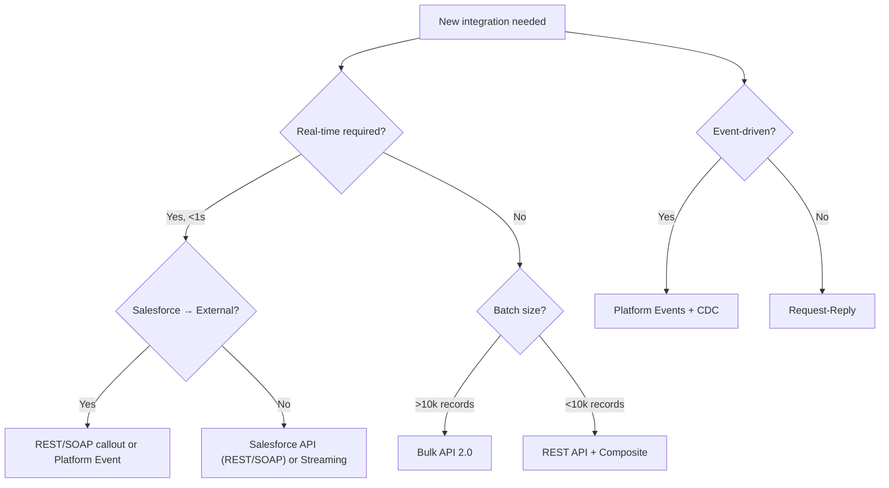
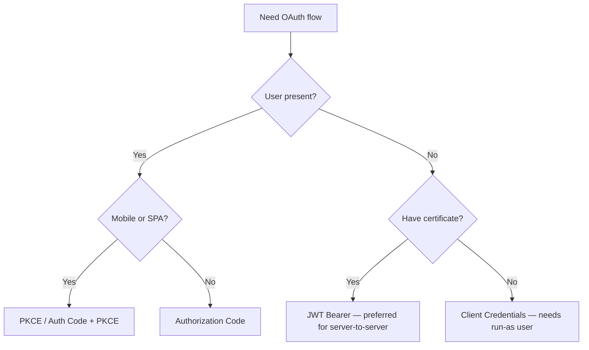
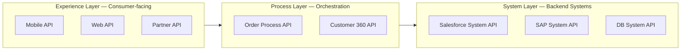
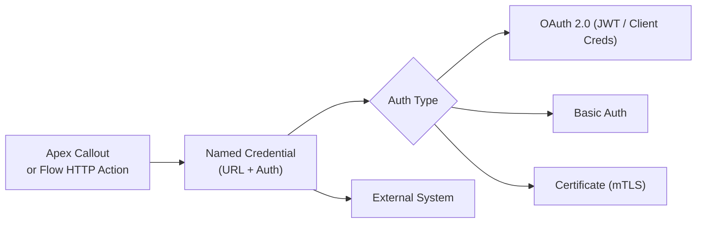
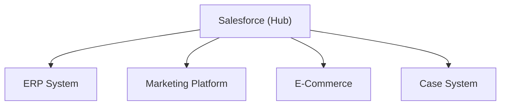
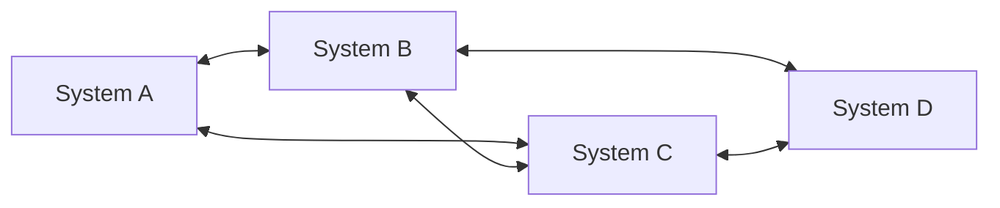
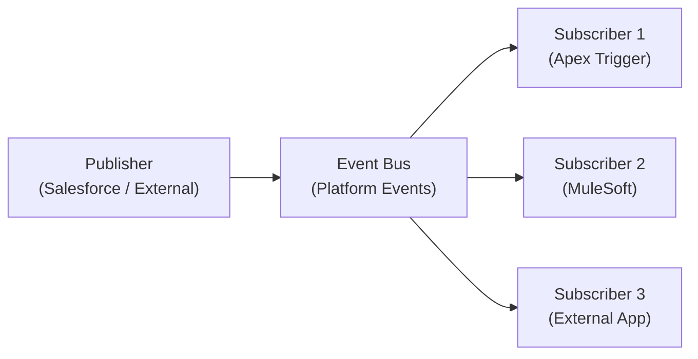

# Integration Architecture Designer Cheat Sheet (CRT-404)

## Exam Quick Stats
Code: CRT-404 | 60 questions | 63% pass (38/60) | 120 min

---

## Domain Weights Table

| Domain | Weight | Key Topics |
|---|---|---|
| Translate Business Requirements | 22% | Stakeholder needs → integration patterns, NFRs, constraints |
| Define Integration Architecture | 21% | Pattern selection, protocol, middleware choice |
| Design Integration Solutions | 23% | API design, error handling, data transformation |
| Identify Risks and Constraints | 12% | Limits, security, compliance, governance |
| Maintain and Monitor Integrations | 12% | Observability, logging, versioning, retry |
| Design Data Governance | 10% | MDM, data quality, ownership, mastering |

---

## API Selection Quick Reference

| API | Best For | Max Records | Auth | Format |
|---|---|---|---|---|
| REST API | General CRUD, mobile | N/A (by query) | OAuth, Basic | JSON/XML |
| SOAP API | Enterprise, legacy | N/A | OAuth, Basic | XML only |
| Bulk API 2.0 | >10k record operations | 100M/day | OAuth | CSV/JSON |
| Streaming (PushTopic) | Real-time push (legacy) | 200 subscribers | OAuth | JSON |
| Platform Events | Event-driven architecture | 250k/day (default) | OAuth | JSON |
| CDC | Changed data capture | 25k/day (default) | OAuth | JSON |
| Composite API | Reduce round trips | 25 subrequests | OAuth | JSON |
| GraphQL | Flexible queries | N/A | OAuth | JSON |

---

## Integration Pattern Decision Matrix

---

## Integration Pattern Comparison

| Pattern | Latency | Coupling | Use Case | SF Implementation |
|---|---|---|---|---|
| Request-Reply (sync) | Low | Tight | Real-time lookup, validation | REST/SOAP callout |
| Fire-and-Forget (async) | Variable | Loose | Notifications, one-way data push | Platform Events, Outbound Msg |
| Batch/Bulk | High | Loose | Nightly sync, data migration | Bulk API 2.0, Scheduled Apex |
| Event-Driven | Near-real-time | Very loose | CDC, state changes, decoupled systems | Platform Events, CDC, Streaming |
| Pub/Sub | Near-real-time | Loose | Multi-consumer fan-out | Platform Events |
| ETL | High | Loose | Data warehouse, reporting | Bulk API + External scheduler |
| Remote Call-In | Low | Tight | External system writes to SF | REST/SOAP API |
| Remote Call-Out | Low | Tight | SF reads/writes external system | Apex callout + Named Credentials |
| Data Virtualization | Low | Tight | Real-time without data copy | Salesforce Connect / OData |

---

## OAuth Flow Selection Table

| Flow | Use Case | User Interaction | Tokens |
|---|---|---|---|
| Authorization Code | Web server apps with user login | Yes — browser redirect | Access + Refresh |
| PKCE (Auth Code + PKCE) | Mobile/SPA apps | Yes — browser redirect | Access + Refresh |
| Client Credentials | Server-to-server, no user | No | Access only |
| JWT Bearer | Server-to-server with certificate | No | Access only |
| Device Flow | IoT / CLI tools | Minimal | Access + Refresh |
| Username-Password | Legacy only — AVOID | No | Access + Refresh |

### OAuth Decision Flowchart

---

## Platform Events vs CDC vs Streaming API

| | Platform Events | CDC | Streaming API (PushTopic) |
|---|---|---|---|
| Who publishes | Anyone (Apex, Flow, API) | Salesforce platform | Salesforce platform |
| Replay | Yes (72 hours) | Yes (72 hours) | No |
| Filter | No | Object-level | SOQL WHERE clause |
| Trigger support | Yes | Yes | No |
| Daily limit | 250k | 25k | 1000 events/hour |
| Use case | Custom events, integration | Downstream sync | Legacy real-time |
| Schema | Custom (you define) | Salesforce-defined (ChangeEventHeader) | Based on object fields |
| Rollback behavior | Published even if TX rolls back (with `publishImmediately`) | Not published if TX rolls back | N/A |

---

## Salesforce Connect / External Objects

| Feature | Detail |
|---|---|
| Protocol | OData 2.0, 4.0, or custom adapter |
| Record limit | 20k rows per query (OData) |
| Use case | Real-time access to external data without copying into Salesforce |
| Relationship support | External lookup, Lookup, Indirect lookup |
| Storage | No Salesforce data storage consumed |
| Write support | Yes, if the adapter supports it |
| Key limit | 25 high-data volume external objects per org |

---

## Callout Limits & Constraints

| Limit | Value |
|---|---|
| Max callouts per Apex transaction | 100 |
| Max callout timeout | 120 seconds |
| Max callout response size | 6 MB (synchronous), 12 MB (async future) |
| Concurrent long-running requests (>20s) | 25 per org |
| Max SOQL queries per transaction | 100 (sync), 200 (async) |
| Heap size | 6 MB (sync), 12 MB (async) |

---

## MuleSoft API-Led Connectivity

| Layer | Responsibility | Changes Frequently? |
|---|---|---|
| System | Direct connectivity to backend systems | Rarely |
| Process | Business logic, orchestration, transformations | Moderately |
| Experience | Shape data for each consumer channel | Often |

---

## Middleware Comparison

| Tool | Best For | Salesforce Integration |
|---|---|---|
| MuleSoft | Complex multi-system orchestration, API-led, enterprise | Native Salesforce connector, full platform |
| Heroku | Custom compute, new apps, consumer-grade workloads | Heroku Connect (Postgres ↔ Salesforce) |
| Salesforce Connect | Real-time virtual data access (no sync needed) | Native, OData-based |
| AWS/Azure/GCP | Cloud compute, AI/ML, storage | REST APIs, Event Grid, S3 integration |
| Informatica | Data quality, MDM, ETL | Common SF partner for data governance |
| Boomi / Tibco | Legacy iPaaS alternatives | REST/SOAP connectors |

**Rule of thumb:** MuleSoft = integration middleware; Heroku = custom app runtime.

---

## Error Handling & Retry Patterns

| Pattern | When to Use | Notes |
|---|---|---|
| Immediate retry | Transient failures (network timeout) | 1–3 retries max |
| Exponential backoff | Rate limiting, service overload | Double delay each attempt |
| Dead Letter Queue (DLQ) | Persistent failures needing manual review | Required for compliance/audit |
| Circuit Breaker | Prevent cascade failures to downed service | Open → Half-open → Closed states |
| Idempotency key | Ensure duplicate calls don't create duplicate records | Use `External_Id__c` or Upsert |
| Compensating transaction | Undo partial work in a distributed transaction | Use when rollback is needed across systems |
| Saga pattern | Long-running distributed transactions | Choreography or orchestration-based |

---

## Data Transformation Approaches

| Approach | Where it Runs | Best For |
|---|---|---|
| Apex (code) | Salesforce server | Complex logic, Salesforce-specific operations |
| Flow / Process Builder | Salesforce server | Admin-configurable, moderate complexity |
| MuleSoft DataWeave | Middleware | Rich format transformation (JSON, XML, CSV, Java) |
| External ETL | Outside Salesforce | Pre-processing before Bulk API load |
| Formula fields | Salesforce runtime | Display-time calculation, no storage |
| External calc (Heroku) | Heroku dyno | Heavy compute offloaded from SF |

---

## Key Limits Reference Card

| Category | Limit |
|---|---|
| REST/SOAP API calls | 1,000 calls/user/license/day (stackable by license count) |
| Bulk API records/day | 100M records/day |
| Bulk API jobs/day | 10,000 jobs/day |
| Platform Events/day | 250k default (purchasable add-on for more) |
| CDC events/day | 25k default |
| Composite subrequests | 25 per call (max 5 can modify records) |
| Concurrent long requests | 25 per org (requests >20s) |
| Streaming subscribers | 200 concurrent |
| Outbound Message retry window | 24 hours |
| Platform Event replay window | 72 hours |
| CDC replay window | 72 hours |
| Named Credentials | Unlimited (best practice: one per endpoint) |
| External Objects (HDV) | 25 per org |
| Callouts per transaction | 100 |
| Callout timeout | 120 seconds |

---

## Security Patterns

| Concern | Recommended Approach |
|---|---|
| Credential storage | Named Credentials — never store secrets in code or custom settings |
| Certificate-based auth | JWT Bearer flow + Connected App certificate |
| Mutual TLS (mTLS) | Named Credentials with client certificate |
| IP restrictions | Connected App IP ranges or org-wide trusted IP ranges |
| Data in transit | TLS 1.2+ enforced by Salesforce |
| Data at rest | Salesforce Shield (Platform Encryption) for field-level encryption |
| Audit trail | Event Monitoring (API usage, logins, data export) |
| Token expiry | Refresh tokens should be rotated; short-lived access tokens |
| PII in events | Encrypt payload fields; don't include sensitive data in event body |

---

## Salesforce to Salesforce (S2S) Options

| Option | Use Case | Notes |
|---|---|---|
| Salesforce-to-Salesforce (S2S) | Native org-to-org record sharing | Point-and-click; no code |
| REST API | Org-to-org with custom logic | Use Named Credentials for auth |
| Platform Events | Async event passing between orgs | Subscriber org listens on its own channel |
| External Objects | Real-time data virtualization from another org | OData adapter on source org |

---

## Outbound Messaging vs Platform Events

| | Outbound Messages | Platform Events |
|---|---|---|
| Trigger | Workflow Rule (legacy) | Apex, Flow, Process Builder, API |
| Protocol | SOAP | CometD (streaming) |
| Sync/Async | Synchronous (blocks Salesforce transaction) | Asynchronous |
| Retry | Yes — up to 24 hours | Subscriber handles replay |
| Ordering | Guaranteed per object | Best effort (no strict ordering) |
| Consumer tech | Any SOAP endpoint | CometD client, Apex trigger, Flow |
| Modern? | Legacy (no new development) | Yes — preferred |

---

## Named Credentials Summary

- Stores endpoint URL and authentication in Salesforce — no credentials in code
- Supports per-user or per-org credentials
- Supports certificate-based auth (mTLS)
- External Credentials (newer model): separates the credential from the Named Credential definition

---

## Integration Architecture Decision Framework

### Step 1: Classify the requirement

| Question | Answer → Pattern |
|---|---|
| Who initiates? | Salesforce → callout; External → API inbound |
| Real-time or batch? | Real-time → sync callout or streaming; Batch → Bulk API |
| Volume? | >10k → Bulk API; <10k → REST + Composite |
| Event-driven? | Platform Events or CDC |
| Legacy system? | SOAP API or middleware (MuleSoft) |
| Multi-system orchestration? | Middleware (MuleSoft, Boomi) |
| Custom compute needed? | Heroku or external cloud function |

### Step 2: Select the right API (use the API table above)

### Step 3: Choose auth pattern (use the OAuth table above)

### Step 4: Design for failure

- Always add retry with backoff
- Log to a Custom Object or external log store
- Use DLQ for critical messages
- Monitor with Event Monitoring + custom dashboards

---

## Common Integration Architectures

### Hub-and-Spoke (Salesforce as Hub)

- Salesforce is the system of record / master
- Simple to govern; single point of failure risk

### Point-to-Point (Anti-pattern at scale)

- Works for 2–3 systems; becomes unmaintainable at scale
- Replace with middleware (MuleSoft) when complexity grows

### Event-Driven (Decoupled)

- Loosely coupled; publishers don't know consumers
- Preferred for scalable, resilient architectures

---

## Data Governance & MDM Concepts

| Concept | Definition | SF Relevance |
|---|---|---|
| System of Record (SoR) | Authoritative source for a data entity | Which system "owns" Account, Contact, etc. |
| Master Data Management | Centralized governance of key entities | MDM hub pattern; Salesforce often as MDM |
| Golden Record | Single trusted version of a data entity | Deduplication → merge in Salesforce |
| Data Stewardship | Roles/process for maintaining data quality | Governance model, not just technology |
| Data Lineage | Tracking data origin and transformations | Required for compliance (GDPR, CCPA) |
| Canonical Data Model | Agreed-upon data format across systems | Used in MuleSoft API design |

---

## Top 15 Exam Traps

1. **Platform Events vs Outbound Messages:** PE is async (doesn't block transaction); Outbound Messages are synchronous and block the SF transaction.

2. **Bulk API 2.0 vs 1.0:** v2.0 is simpler (no batch management, auto-chunking), v1.0 has more granular control over batches — exam often asks when to use which.

3. **CDC publishes changes even when done via API** (including Data Loader) — not just UI changes. All DML paths trigger CDC.

4. **Streaming API replay:** PushTopics do NOT support replay (events are lost if subscriber is disconnected). Platform Events DO support 72-hour replay.

5. **Named Credentials:** Certificate-based auth stores the cert in Salesforce — no secret in code. This is the security best practice answer.

6. **Client Credentials OAuth:** No user context — the "Run As" user is the Connected App's configured run-as user (must be a real Salesforce user with appropriate permissions).

7. **Composite API reference IDs:** Use `@{referenceId.id}` syntax to chain records in a single call (e.g., create Account then use its ID to create Contact in same request).

8. **JWT Bearer flow requires:** Connected App with uploaded certificate, pre-authorized user (admin approval or named user), no browser redirect, no user interaction.

9. **API-led connectivity layers:** System layer calls the backend (SAP, DB); Process layer orchestrates; Experience layer serves the consumer. Don't mix responsibilities across layers.

10. **Platform Events in Flow / fired in transaction:** Events published with `publishImmediately` fire even if the transaction rolls back. Events published normally are rolled back with the transaction.

11. **Heroku vs MuleSoft:** Heroku = custom app compute, not integration middleware. MuleSoft = integration middleware, API management, iPaaS. These are distinct — don't conflate.

12. **Inbound to Salesforce:** External systems always call Salesforce REST or SOAP API — there is no "reverse callout" or Salesforce-initiated inbound. SF is always the server for inbound.

13. **Rate limiting direction:** Salesforce enforces API call limits on the org side (outbound API calls from external systems into SF). Salesforce callouts to external systems are limited by the external system's rate limits.

14. **CDC tracks last state:** CDC only delivers the LAST change per record per delivery window — it does not deliver every intermediate state. If a record changes 5 times rapidly, subscribers may only see one event.

15. **Outbound Message retry window:** Retries for 24 hours if the endpoint is unavailable — NOT indefinitely. After 24 hours, messages are dropped. Design a DLQ or monitoring for this.

---

## Bonus: Scenario → Answer Cheat Sheet

| Scenario | Best Answer |
|---|---|
| Migrate 50M records from legacy to Salesforce | Bulk API 2.0 |
| External system needs to react when SF Opportunity closes | Platform Events or CDC |
| Real-time product inventory lookup from ERP on Opportunity | Salesforce Connect (External Objects) or Apex callout |
| Mobile app needs to authenticate users via Salesforce | OAuth Authorization Code + PKCE |
| Nightly sync of 500k records from SF to data warehouse | Bulk API 2.0 (query) + Scheduled job |
| Reduce 10 API calls into 1 call to create related records | Composite API |
| Server-to-server integration, no user, using certificate | JWT Bearer OAuth flow |
| Legacy Java system using WSDL-based integration | SOAP API |
| Need to decouple publisher and subscriber across systems | Platform Events |
| Governor limit: too many callouts per transaction | Async via Queueable Apex or Platform Events |
| Salesforce + SAP + Oracle multi-system orchestration | MuleSoft API-led connectivity |
| Custom app needing Salesforce data without copying it | Salesforce Connect / External Objects |
| Org-to-org record sharing with no code | Salesforce-to-Salesforce (S2S) |
| Prevent storing API credentials in Apex code | Named Credentials |
| Guarantee a callout doesn't re-create a record if retried | Idempotency key via External Id + Upsert |
