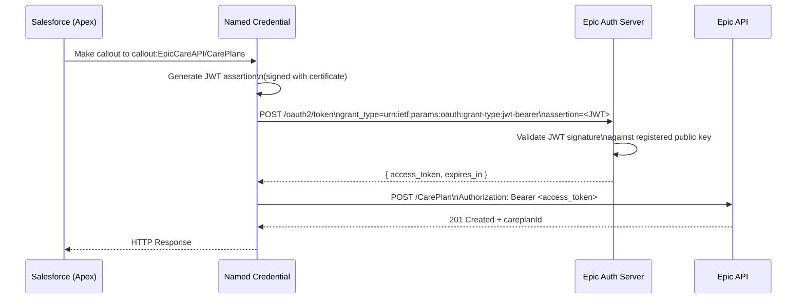
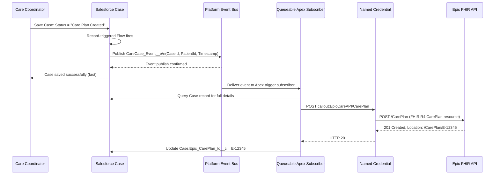
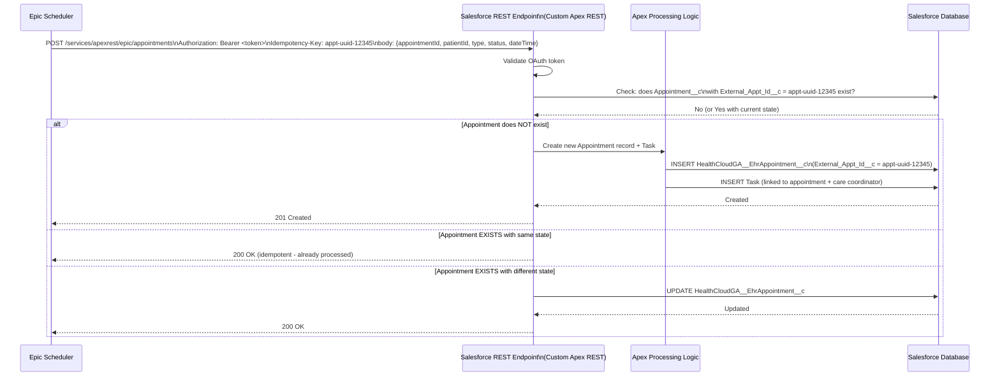

# Lab 01: Designing a REST API Integration

## Lab Overview

This lab walks through the end-to-end design of a bi-directional REST API integration between Salesforce Health Cloud and Epic (Electronic Health Record system). You will apply API selection criteria, authentication design, Named Credentials, error handling, and idempotency in a realistic HIPAA-regulated context.

This is an architecture design lab — you're building the blueprint, not writing Apex code. The goal is to develop the habit of decomposing integration requirements into architectural decisions, documenting trade-offs, and validating the design against exam domains.

**Time estimate**: 60-90 minutes

---

## Learning Objectives

By the end of this lab, you will be able to:

1. Select the appropriate Salesforce API (REST vs. SOAP vs. Bulk vs. Streaming) based on requirements
2. Design an OAuth JWT Bearer Token authentication flow for server-to-server integration
3. Configure Named Credentials architecture for secure, code-free endpoint management
4. Design both outbound (Salesforce → Epic) and inbound (Epic → Salesforce) integration flows
5. Specify error handling, retry, and idempotency requirements for each flow
6. Identify HIPAA-relevant security considerations in an integration design

---

## Scenario

**Company**: St. Regis Health Network  
**Salesforce Platform**: Health Cloud (Service Cloud base + Health Cloud license)  
**External System**: Epic EHR (Electronic Health Records)

**Business Requirement**:

The clinical operations team needs two-way data flow between Salesforce and Epic:

**Flow A — Outbound (Salesforce → Epic)**:
When a patient Case record is created or updated with a status of "Care Plan Created" in Salesforce Health Cloud, Epic must receive the Case details within 30 seconds so a clinical care plan can be initiated in the EHR. Epic provides a REST API endpoint.

**Flow B — Inbound (Epic → Salesforce)**:
When an appointment is scheduled, completed, or cancelled in Epic, Salesforce must create or update a corresponding `HealthCloudGA__EhrAppointment__c` record and a linked `Task` record for the care coordinator. Epic sends webhook-style POST requests to an HTTP endpoint.

**Technical constraints**:
- HIPAA compliance required — data in transit must be encrypted (TLS 1.2+)
- No user login during integration — server-to-server only
- Epic API uses OAuth 2.0 with JWT Bearer authentication
- Epic can call a maximum of 200 webhook deliveries per minute into Salesforce
- The integration must not slow down the case save operation (no synchronous callout from the trigger)
- Duplicate appointment webhook deliveries must be handled gracefully (Epic occasionally sends twice)

---

## Architecture Challenge

Before reading the design walkthrough, answer these questions yourself:

1. Which Salesforce API should receive the inbound Epic webhooks?
2. Which OAuth flow should authenticate Salesforce-to-Epic calls?
3. Should Flow A use a synchronous trigger callout or an asynchronous pattern? Why?
4. How do you handle duplicate appointment webhooks from Epic?
5. Where should Named Credentials be configured for the Epic REST endpoint?
6. What happens if Epic returns 503 when receiving a care plan notification?

---

## Step-by-Step Design Walkthrough

### Step 1: API Selection

**Flow A (Outbound: Salesforce → Epic)**

Requirements analysis:
- Volume: Low (only Cases reaching "Care Plan Created" status — perhaps 50-200/day)
- Latency: 30-second SLA — near real-time, not sub-second
- Direction: Salesforce → External
- Data size: Single record per call (one Case at a time)
- Pattern: Remote process invocation (notify Epic of a state change)

**Decision: REST API callout from Salesforce to Epic's REST endpoint.**

Why not SOAP: Epic's modern API layer is REST-based (FHIR R4). SOAP would require WSDL parsing and is appropriate only for Epic's legacy interfaces.

Why not Bulk API: Volume is too low (50-200 records/day), and Bulk API is asynchronous batch. The 30-second SLA requires near-real-time delivery, which Bulk cannot guarantee.

Why not Streaming API: Streaming API is for inbound data delivery to Salesforce, not outbound callouts.

**Flow B (Inbound: Epic → Salesforce)**

Requirements analysis:
- Volume: Up to 200 webhook deliveries per minute = 288,000/day
- Direction: External → Salesforce
- Pattern: Remote call-in to Salesforce
- Data: Appointment data that creates/updates records in Salesforce

**Decision: Salesforce REST API exposed via a custom Apex REST resource OR via a Site.com Community endpoint that receives unauthenticated POSTs with token validation.**

More specifically: Custom Apex class annotated with `@RestResource(urlMapping='/epic/appointments/*')` deployed to a Salesforce Site (guest user access) or a Connected App with OAuth.

Why not Outbound Messages (the other way): Outbound Messages push FROM Salesforce TO external. This is the reverse direction.

Why not Platform Events (receiving end): Epic cannot publish directly to Salesforce Platform Events via standard webhook. Epic sends HTTP POST, so Salesforce needs an HTTP endpoint (REST API).

### Step 2: Authentication Design

**Flow A (Salesforce → Epic) — JWT Bearer Token**

Epic supports OAuth 2.0 JWT Bearer Token flow. This is the correct choice because:
- Server-to-server: no user interaction required
- No user login prompt: the integration runs in background, 24/7
- JWT signed with Salesforce certificate proves identity
- Tokens auto-refresh — no stored passwords



**JWT components**:
- `iss` (issuer): Salesforce Connected App client ID
- `sub` (subject): Epic API client ID or Epic user principal
- `aud` (audience): Epic token endpoint URL
- `exp` (expiration): Current time + 5 minutes (maximum JWT lifetime)
- **Signature**: RS256 signed with Salesforce certificate private key

Epic validates the JWT signature using the public key registered during the integration setup.

**Flow B (Epic → Salesforce) — Shared Secret / OAuth Client Credentials**

Epic webhooks calling Salesforce need to authenticate. Options:
- **Connected App OAuth 2.0**: Epic obtains an access token using client credentials flow, includes it as `Authorization: Bearer` header
- **Shared secret validation**: Salesforce Apex validates an HMAC signature in the webhook header (simpler but less standard)

For this design: **Connected App with OAuth 2.0 client credentials flow** — Epic registers as a Connected App consumer, uses `client_id` + `client_secret` to obtain tokens, includes bearer token in webhook calls.

### Step 3: Named Credentials Configuration

Named Credentials abstract the Epic endpoint and authentication from the Apex code:

**New External Credential** (Spring '23+ pattern):
- **Name**: EpicFHIR_Credential
- **Authentication Protocol**: OAuth 2.0
- **Flow Type**: JWT Bearer Token
- **Identity Provider URL**: `https://epic-instance.stregishealth.org/oauth2/token`
- **Certificate**: Select the org certificate used to sign the JWT
- **Scopes**: `system/CarePlan.write system/Observation.read`

**Named Credential**:
- **Name**: EpicCareAPI
- **URL**: `https://epic-instance.stregishealth.org/api/FHIR/R4`
- **External Credential**: EpicFHIR_Credential
- **Allow Formula Fields in HTTP Header**: Enabled (to pass CorrelationId)
- **Allow Merge Fields in HTTP Body**: Enabled

**Apex usage**:
```apex
HttpRequest req = new HttpRequest();
req.setEndpoint('callout:EpicCareAPI/CarePlan');
req.setMethod('POST');
req.setHeader('Content-Type', 'application/fhir+json');
req.setBody(buildCarePlanFHIR(caseId));
HttpResponse res = new Http().send(req);
```

The endpoint URL and auth token are never hardcoded. Rotating credentials requires only updating the Named Credential — no code deployment.

### Step 4: Flow A — Outbound Design (Salesforce → Epic)

**Decision: Asynchronous via Platform Events (not direct trigger callout)**

A direct synchronous callout from a trigger violates the requirement "must not slow down the case save operation." Synchronous callouts also risk timeout failures rolling back the case save.

**Recommended pattern**:



**Why Platform Events over Future Method**:
- Future methods cannot be chained — if processing fails, there's no retry mechanism built in
- Platform Events have 9 built-in retries if the subscriber Apex fails
- Platform Events provide a natural DLQ opportunity (error logging in the catch block)
- Platform Events are visible and monitorable

**Idempotency for Flow A**:
- Store the `Epic_CarePlan_Id__c` on the Case after successful creation
- Before calling Epic, check if `Epic_CarePlan_Id__c` is already populated
- If populated: the care plan was already created. Do not re-create. Update only if needed (use PATCH).
- The Epic `CarePlan` resource uses the Salesforce Case ID as the `identifier` value, enabling upsert.

### Step 5: Flow B — Inbound Design (Epic → Salesforce)

**Architecture**:



**Apex REST resource skeleton**:
```apex
@RestResource(urlMapping='/epic/appointments/*')
global class EpicAppointmentResource {

    @HttpPost
    global static void receiveAppointment() {
        RestRequest req = RestContext.request;
        RestResponse res = RestContext.response;

        String idempotencyKey = req.headers.get('Idempotency-Key');
        Map<String, Object> body = (Map<String, Object>)
            JSON.deserializeUntyped(req.requestBody.toString());

        // Check idempotency
        List<HealthCloudGA__EhrAppointment__c> existing = [
            SELECT Id, Epic_Status__c
            FROM HealthCloudGA__EhrAppointment__c
            WHERE External_Appointment_Id__c = :idempotencyKey
            LIMIT 1
        ];

        if (!existing.isEmpty() && existing[0].Epic_Status__c == (String)body.get('status')) {
            res.statusCode = 200;
            res.responseBody = Blob.valueOf('{"result":"already_processed"}');
            return;
        }

        // Upsert appointment
        HealthCloudGA__EhrAppointment__c appt = new HealthCloudGA__EhrAppointment__c(
            External_Appointment_Id__c = idempotencyKey,
            Epic_Status__c = (String)body.get('status')
            // ... other fields
        );
        upsert appt External_Appointment_Id__c;

        res.statusCode = 201;
        res.responseBody = Blob.valueOf('{"result":"created","id":"' + appt.Id + '"}');
    }
}
```

### Step 6: Error Handling Design

**Flow A Error Handling**:

| Error | Handling |
|-------|---------|
| Epic returns 5xx | Retry with exponential backoff (3 attempts). If all fail, write to `Integration_Error_Log__c` and alert. |
| Epic returns 429 | Retry after `Retry-After` header value. |
| Epic returns 4xx | Log as permanent failure. Alert integration team. Do NOT retry. |
| Network timeout | Retry (treat as transient). Log timeout duration. |
| Epic returns 200 but invalid response body | Log as data error. Alert. Manual review. |

**Platform Events subscriber error handling** (Apex trigger):
```apex
trigger CaseCareEventSubscriber on CareCase_Event__e (after insert) {
    for (CareCase_Event__e event : Trigger.new) {
        try {
            EpicIntegrationService.notifyEpicCarePlan(event.Case_Id__c);
        } catch (CalloutException e) {
            // Will retry up to 9 times automatically
            // On final failure, log to Integration_Error_Log__c
            if (isLastRetry()) {
                logToDLQ(event, e);
            }
            throw e; // Re-throw to trigger Platform Event retry
        }
    }
}
```

**Flow B Error Handling** (Inbound):

Epic's webhook delivery system has its own retry logic. Salesforce must:
1. Return 2xx immediately upon receiving the webhook (within 30 seconds)
2. Process asynchronously if needed (publish to another Platform Event for async processing)
3. Return the same 2xx for duplicate deliveries (idempotency ensures this is safe)

### Step 7: Security Considerations (HIPAA Context)

HIPAA requires:
1. **Encryption in transit**: TLS 1.2+ (Salesforce enforces TLS 1.2+ by default)
2. **Authentication**: Named Credentials with JWT — no plaintext credentials in code
3. **Authorization**: Minimum necessary access — Connected App scopes limited to only required FHIR resources
4. **Audit trail**: Salesforce Field Audit Trail enabled for PHI fields; Platform Events provide event log
5. **PHI in payloads**: Epic Patient ID and clinical data in event payloads must be treated as PHI
6. **Named Credential**: Never log full request/response bodies containing PHI — log only metadata (correlation ID, status code, timestamp)
7. **IP restrictions**: Epic's IP range allowlisted on the Connected App receiving inbound webhooks
8. **Certificate rotation**: Calendar reminder to rotate JWT signing certificate before expiry

**What NOT to do**:
- Do NOT store Epic credentials in Custom Settings (visible to anyone with admin access)
- Do NOT log PHI data to Integration_Error_Log__c text fields (store only correlation IDs)
- Do NOT use Username-Password OAuth flow (password stored in configuration, revoked by any password change)

---

## Discussion Questions

1. **Why not use Outbound Messages for Flow A?**
   Outbound Messages are synchronous (Salesforce waits for Epic's ACK before completing), deprecated for new development, and do not support custom authentication. Named Credential + REST callout is the current recommended approach.

2. **The product team proposes using a nightly Bulk API pull from Epic instead of real-time webhooks for appointment data. When would this be appropriate?**
   A nightly Bulk pull is appropriate when the 30-second real-time SLA is not required — for example, a daily appointment report for scheduling dashboards. For real-time care coordination (care coordinator needs to act within minutes), webhooks/near-real-time is required.

3. **What changes if Epic supports Platform Events publishing directly?**
   If Epic (or a middleware layer) can publish to Salesforce Platform Events, Flow B becomes: Epic → MuleSoft → Publish Platform Event → Salesforce Process. This is architecturally cleaner — the inbound REST endpoint is replaced by an event subscription, and retries are handled by the event bus.

4. **How would you test this integration end-to-end before go-live?**
   - Unit test: Mock HTTP callout responses in Apex using `HttpCalloutMock`
   - Integration test: Epic sandbox environment + Salesforce sandbox
   - Load test: Simulate 200 webhook deliveries/minute to the inbound endpoint
   - Failure test: Return 503 from Epic to verify retry logic fires
   - Duplicate test: Send same webhook twice — verify idempotency returns 200 without creating duplicate

---

## Exam Application

This lab covers these exam-tested concepts:
- API selection criteria (Flow A: REST callout; Flow B: custom REST resource)
- OAuth JWT Bearer Token flow (server-to-server, no user interaction)
- Named Credentials preventing hardcoded endpoints and credentials
- Async pattern via Platform Events (decoupling trigger from callout)
- Idempotency with external ID upsert (duplicate webhook handling)
- Error handling: retry on 5xx, fail-fast on 4xx, DLQ for exhausted retries
- HIPAA-aligned security: TLS, minimum access scopes, no PHI in logs

**Exam question style this lab prepares you for**:

> A healthcare company's integration triggers an Apex callout to their EHR system every time a Case is updated. The EHR API occasionally returns 503 errors, causing the Case update to fail and roll back. What should the architect recommend?
> - A. Use Outbound Messages instead
> - **B. Publish a Platform Event from the trigger; subscribe to the event in async Apex that handles the callout and retry**
> - C. Increase the callout timeout limit
> - D. Use a Future method in the trigger

**Answer: B** — The trigger fails because the synchronous callout fails and rolls back the DML. Decoupling via Platform Events means the Case saves regardless of EHR availability. The async subscriber handles retry independently.
