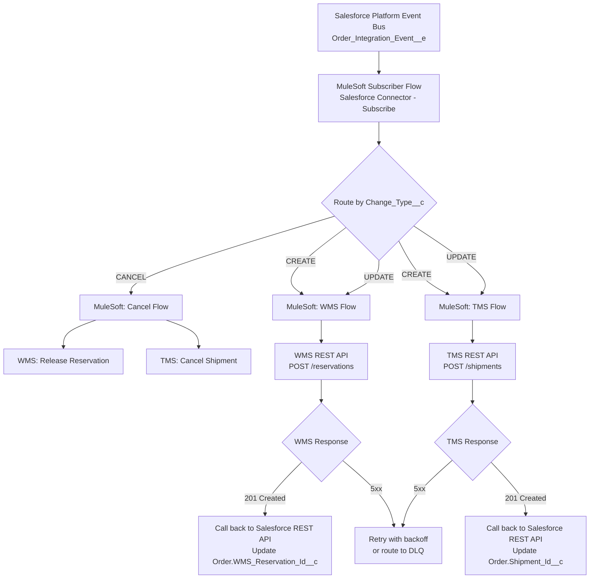
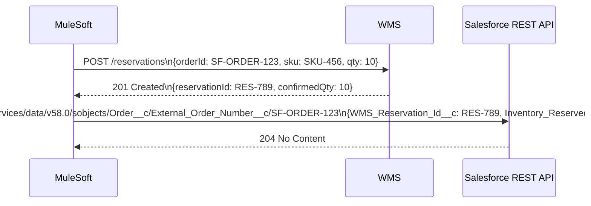
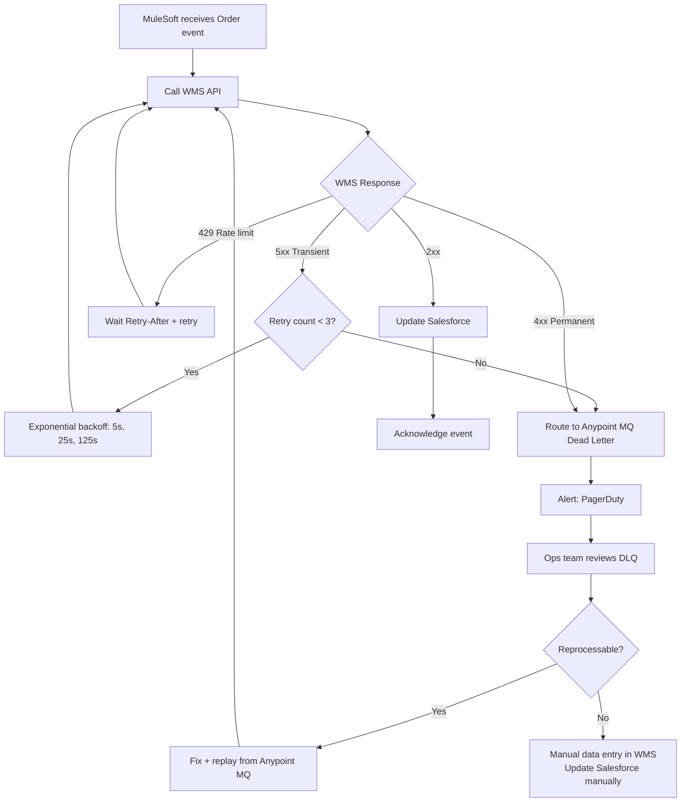
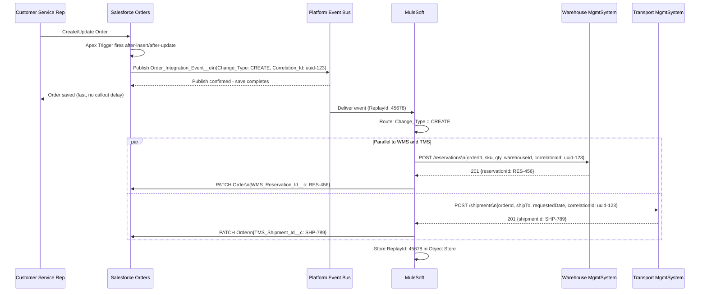

# Lab 02: Platform Events Architecture Design

## Lab Overview

This lab designs a Platform Events-based integration architecture for a retail order management scenario involving three enterprise systems: Salesforce (Order Management), a Warehouse Management System (WMS), and a Transportation Management System (TMS). You'll design event schemas, publisher patterns, subscriber routing, error handling, and compare the design against a CDC alternative.

**Time estimate**: 60-90 minutes

---

## Learning Objectives

1. Design a Platform Events schema for a multi-system integration
2. Select between Platform Events publisher options (Apex trigger vs. Record-triggered Flow)
3. Design a MuleSoft subscriber that routes events to multiple downstream systems
4. Implement ReplayId-based recovery for subscriber downtime
5. Design error handling for Platform Events including DLQ patterns
6. Evaluate the trade-offs between Platform Events and CDC for this use case

---

## Scenario

**Company**: Peak Retail Co.  
**Systems**:
- **Salesforce** (Order Management Cloud): System of record for customer orders
- **WMS** (Manhattan Associates): Warehouse management, inventory reservation, fulfillment
- **TMS** (Oracle Transportation Management): Shipment creation, carrier assignment, tracking

**Business Requirements**:

1. When an Order is **Created** in Salesforce, WMS must reserve inventory within 60 seconds, and TMS must create a shipment record within 60 seconds.

2. When an Order is **Updated** (quantity change, address change, cancellation), both WMS and TMS must be notified within 60 seconds.

3. When WMS confirms inventory reservation, Salesforce must update the Order's `Inventory_Reserved__c` field and `WMS_Reservation_Id__c`.

4. When TMS creates a shipment, Salesforce must update the Order's `Shipment_Id__c` and `Estimated_Ship_Date__c`.

5. **Cancellation**: If an Order is cancelled in Salesforce after WMS has reserved inventory, WMS must release the reservation, and TMS must cancel the shipment.

**Technical constraints**:
- Peak volume: 5,000 orders/hour during sale events
- MuleSoft is the integration middleware (already licensed)
- WMS and TMS have REST APIs — they cannot subscribe to Platform Events directly
- The integration must survive WMS/TMS downtime of up to 2 hours without losing events
- Order status changes must be processed in order (an UPDATE must not arrive before the CREATE)

---

## Architecture Challenge

Before reading the walkthrough, answer these:

1. Why use Platform Events here instead of direct API callouts from Apex triggers?
2. What fields should the Order Platform Event contain?
3. How do you ensure WMS receives CREATE before UPDATE for the same order?
4. What happens if MuleSoft is down for 45 minutes? Can events be recovered?
5. What happens if WMS returns 503 when MuleSoft tries to call it?
6. Would CDC work for this use case instead of Platform Events? What would change?

---

## Step-by-Step Design Walkthrough

### Step 1: Why Platform Events (Not Direct Callouts)

**Option A (rejected): Apex trigger → direct callout to WMS and TMS**

```
Order saved → Apex trigger fires → HTTP POST to WMS → HTTP POST to TMS
```

Problems:
- Salesforce callout limit: 100 callouts per transaction. Two simultaneous callouts per order is fine for normal volume but risky.
- Synchronous callouts make the order save dependent on WMS/TMS availability. If either is slow or down, the order save fails or times out.
- No retry: if the callout fails, the event is lost unless you build retry logic in Apex.
- Callout timeout: Salesforce has a max 120-second callout timeout. A slow TMS can hold up the order save.
- No fan-out to future consumers: when a 4th system needs to be notified, you need a code change.

**Option B (chosen): Platform Events + MuleSoft**

```
Order saved → Apex trigger publishes Platform Event → MuleSoft subscribes →
MuleSoft routes to WMS and TMS in parallel
```

Benefits:
- Order saves INSTANTLY — publishing a Platform Event is sub-millisecond
- MuleSoft buffers: if WMS is down, MuleSoft retries the WMS call without losing the event
- ReplayId: if MuleSoft itself goes down, it can replay missed events on restart (within 72 hours)
- New consumers: adding a 4th subscriber system requires no Salesforce code change
- Error handling centralized in MuleSoft
- Parallel delivery to WMS and TMS (not sequential)

### Step 2: Platform Events Schema Design

Create a Platform Event object: `Order_Integration_Event__e`

**Fields**:

| Field API Name | Type | Description |
|----------------|------|-------------|
| `Order_Id__c` | Text(18) | Salesforce Order record ID |
| `External_Order_Number__c` | Text(50) | Human-readable order number |
| `Change_Type__c` | Text(20) | CREATE, UPDATE, CANCEL |
| `Customer_Id__c` | Text(18) | Salesforce Account ID |
| `Customer_External_Id__c` | Text(50) | Customer ERP ID for WMS/TMS lookup |
| `Quantity__c` | Number | Order quantity |
| `Product_SKU__c` | Text(50) | Product SKU for inventory reservation |
| `Warehouse_Id__c` | Text(20) | Target warehouse code |
| `Ship_To_Address__c` | LongTextArea | JSON: {street, city, state, zip, country} |
| `Requested_Ship_Date__c` | DateTime | |
| `WMS_Reservation_Id__c` | Text(50) | Populated if cancelling a reserved order |
| `TMS_Shipment_Id__c` | Text(50) | Populated if cancelling a shipped order |
| `Correlation_Id__c` | Text(36) | UUID for end-to-end tracing |
| `Published_At__c` | DateTime | When the event was published |

**Design decisions**:

1. **Include denormalized data**: Include `Customer_External_Id__c`, `Product_SKU__c`, `Warehouse_Id__c` directly in the event. WMS and TMS use their own identifiers, not Salesforce IDs. Including them avoids a lookup call by MuleSoft/WMS/TMS.

2. **Correlation ID**: Generate a UUID in Apex before publishing. Include in all downstream API calls. Enables end-to-end request tracing across Salesforce + MuleSoft + WMS + TMS logs.

3. **Change_Type__c**: Instead of separate event types, use a single event type with a change type field. Simpler to manage one subscription than three.

4. **What NOT to include**: Full product catalog data, pricing details, customer payment information. Include only what WMS and TMS need. Lean events are faster and smaller.

### Step 3: Publisher Design

**Option A: Record-triggered Flow**

A Flow on the `Order__c` object, after-save trigger, publishes the Platform Event.

Pros:
- No Apex code (admin-friendly)
- Easy to add fields to the event without a deployment
- Works for all DML changes (including data imports that bypass triggers if you use "after-save" record trigger)

Cons:
- Flow has limits per transaction (250 events in a single transaction)
- Flow callout limits still apply if mixing with callouts
- Less control over error handling (Flow error handling is limited vs. Apex try/catch)

**Option B: Apex Trigger (chosen for this design)**

```apex
trigger OrderIntegrationPublisher on Order__c (after insert, after update) {
    List<Order_Integration_Event__e> events = new List<Order_Integration_Event__e>();

    for (Order__c order : Trigger.new) {
        Order__c oldOrder = Trigger.oldMap?.get(order.Id);

        // Only publish if relevant fields changed
        if (Trigger.isInsert || hasRelevantChanges(order, oldOrder)) {
            String changeType = Trigger.isInsert ? 'CREATE' :
                order.Status__c == 'Cancelled' ? 'CANCEL' : 'UPDATE';

            events.add(new Order_Integration_Event__e(
                Order_Id__c = order.Id,
                External_Order_Number__c = order.OrderNumber,
                Change_Type__c = changeType,
                Customer_External_Id__c = order.Customer_External_Id__c,
                Product_SKU__c = order.Product_SKU__c,
                Quantity__c = order.Quantity__c,
                Warehouse_Id__c = order.Warehouse_Id__c,
                Ship_To_Address__c = buildAddressJSON(order),
                Requested_Ship_Date__c = order.RequestedDeliveryDate__c,
                WMS_Reservation_Id__c = order.WMS_Reservation_Id__c,
                TMS_Shipment_Id__c = order.TMS_Shipment_Id__c,
                Correlation_Id__c = generateUUID(),
                Published_At__c = Datetime.now()
            ));
        }
    }

    if (!events.isEmpty()) {
        List<Database.SaveResult> results = EventBus.publish(events);
        for (Database.SaveResult sr : results) {
            if (!sr.isSuccess()) {
                // Log publish failure — rare but possible
                System.debug('Event publish failed: ' + sr.getErrors());
            }
        }
    }
}
```

**Key behavior**: `EventBus.publish()` publishes the event AFTER the transaction commits (default behavior). This means the event fires only if the Order save succeeds — no phantom events for rolled-back transactions.

### Step 4: MuleSoft Subscriber Design

**Subscription topology**:



**MuleSoft Subscriber configuration**:
- Channel: `/event/Order_Integration_Event__e`
- ReplayId strategy: `EARLIEST` on first start (to replay from beginning of 72-hour window if needed), then `LAST_RECEIVED` for ongoing operation
- Reconnection: Automatically reconnect on disconnect with exponential backoff

**Parallel routing**: MuleSoft routes CREATE/UPDATE events to BOTH WMS and TMS in parallel using a parallel flow (scatter-gather or parallel for-each). The 60-second SLA is met because WMS and TMS are called simultaneously, not sequentially.

### Step 5: WMS and TMS Callback to Salesforce

When WMS successfully reserves inventory, it calls back to update Salesforce:



The MuleSoft flow uses an upsert (PATCH with external ID) to update Salesforce — idempotent, safe to retry.

### Step 6: ReplayId Strategy for Recovery

**Scenario**: MuleSoft is down for 45 minutes (deployment, maintenance, crash).

**Recovery**:
1. When MuleSoft restarts, the Salesforce Connector subscriber reconnects to the Platform Event channel
2. Configure `replayId = LAST_RECEIVED` stored in Anypoint Object Store (persisted across restart)
3. MuleSoft replays all events from the last successfully processed ReplayId
4. Events published during the 45-minute outage are delivered in order

**ReplayId configuration in MuleSoft Salesforce Connector**:
```xml
<sfdc:subscribe-channel
    config-ref="Salesforce_Config"
    channel="/event/Order_Integration_Event__e"
    replayId="-1"  <!-- -1 = tip (only new events), -2 = earliest available -->
/>
```

For production disaster recovery: persist the last successfully processed ReplayId to Anypoint Object Store before acknowledging each event. On restart, read the stored ReplayId and replay from that point.

**72-hour window**: If MuleSoft is down for MORE than 72 hours, events are lost. Design mitigation: monitoring alert fires at 1 hour of MuleSoft downtime to prevent this scenario.

### Step 7: Gap Event Handling

If there's a gap in Platform Event delivery (Salesforce's event bus was briefly overloaded), Salesforce inserts `GAP_*` events:

| Gap Event Type | Meaning |
|----------------|---------|
| `GAP_CREATE` | Creates may have been missed |
| `GAP_UPDATE` | Updates may have been missed |
| `GAP_DELETE` | Deletes may have been missed |
| `GAP_OVERFLOW` | Too many events; some were dropped |

**MuleSoft gap handling logic**:
```
When MuleSoft receives a GAP_CREATE or GAP_UPDATE event:
  1. Log the gap event with timestamp
  2. Alert operations team
  3. Trigger a reconciliation query:
     - Query Salesforce REST API for Orders modified since last known good event timestamp
     - Compare with WMS and TMS records
     - For any Order in Salesforce not in WMS/TMS: re-process
```

This requires a gap recovery procedure — automated or manual. The presence of gap events means event-driven alone is insufficient for guaranteed delivery at high volumes. Supplement with periodic reconciliation.

### Step 8: Ordering Guarantee

Platform Events are delivered in the order published WITHIN a single channel. However, multiple Apex trigger bulkification can publish events in the same transaction for different orders simultaneously.

**Ordering consideration**: If an order is CREATED and then immediately UPDATED (e.g., by a process builder in the same second), both events may be in the same transaction or consecutive transactions. MuleSoft must handle them in order.

**Design safeguard**:
- Each event includes `Published_At__c` timestamp
- MuleSoft checks: before calling WMS with an UPDATE, verify that a corresponding reservation (from the CREATE) already exists. If not, queue the UPDATE for 10 seconds and retry.
- Include `Order_Id__c` in all calls so WMS/TMS can detect out-of-order delivery

### Step 9: Error Handling for Platform Events



**Apex trigger error logging** (for the Salesforce side):
If `EventBus.publish()` fails (rare — platform event publish failure):
```apex
for (Database.SaveResult sr : results) {
    if (!sr.isSuccess()) {
        Integration_Error_Log__c log = new Integration_Error_Log__c(
            Error_Type__c = 'PUBLISH_FAILURE',
            Error_Message__c = sr.getErrors()[0].getMessage(),
            Order_Id__c = orderIds[i]
        );
        errorLogs.add(log);
    }
}
insert errorLogs;
```

### Step 10: CDC Alternative Analysis

**Could Change Data Capture (CDC) replace Platform Events here?**

| Factor | Platform Events | CDC |
|--------|----------------|-----|
| Event source | Explicitly published in trigger | Auto-generated by Salesforce on any DML |
| Fields included | Custom fields you choose | Only changed fields (delta) |
| Custom payload | Yes — include denormalized data | No — only changed SF fields |
| Publisher control | You decide when/if to publish | Fires on every qualifying DML |
| External system IDs in event | Yes (`Customer_External_Id__c`) | No — only SF data |
| Filtering by criteria | Can add `if` logic in trigger | Cannot filter — fires on all changes |
| Ordering | Channel-level ordering | Per-channel ordering |
| Retention | 72 hours | 72 hours |
| Limit | 100K-250K/day | 50K/day (included), purchasable |

**For this use case, Platform Events is the better choice because**:
1. WMS and TMS need denormalized data (external IDs, SKU, warehouse code) that CDC doesn't include
2. We want explicit control: only publish when integration-relevant fields change, not on every update
3. We need to include computed values (e.g., the JSON shipping address)

**When CDC would be preferred**:
- When the consumer is primarily interested in changed SF field values (e.g., a data replication to a data warehouse)
- When you want zero code on the publisher side (CDC is automatic, no Apex trigger needed)
- When you have many consumers and don't want to maintain a custom event schema

**Hybrid pattern**: Use CDC to detect that an Order changed → MuleSoft subscriber calls Salesforce REST API to query the full order details → calls WMS/TMS with complete data. More calls, but avoids denormalization in the event schema.

---

## Full Architecture Diagram



---

## Discussion Questions

1. **The business wants sub-5-second delivery to WMS and TMS. Can this architecture meet that SLA?**
   Yes. Platform Events are delivered to MuleSoft typically within 1-3 seconds of publication. MuleSoft-to-WMS/TMS REST calls add 1-2 seconds. End-to-end delivery is typically under 5 seconds under normal conditions.

2. **What monitoring would you set up for this integration?**
   - Platform Events delivery lag monitoring (time from publish to MuleSoft receipt)
   - WMS/TMS API call success rate (target >99.9%)
   - DLQ depth alert (>0 messages = immediate investigation)
   - ReplayId age monitoring (if MuleSoft is processing events from >30 minutes ago, there's a backlog)
   - Salesforce API consumption for the update-back calls

3. **If WMS and TMS both need to be aware of the same cancellation, but WMS takes 10 seconds to respond, should MuleSoft wait before calling TMS?**
   No — call both in parallel (scatter-gather). The cancel calls are independent. If WMS is slow, TMS shouldn't be delayed. If WMS cancel fails, compensating logic handles it independently of TMS.

4. **How would you test event ordering guarantees?**
   Create a test that rapidly creates and then updates the same order within 1 second. Verify in WMS/TMS logs that the CREATE processing completes before the UPDATE is applied.

---

## Exam Application

This lab reinforces these exam domains:

- **Integration Architecture Patterns**: Pub/Sub, Fan-out, Scatter-Gather, event-driven decoupling
- **Salesforce API Use**: Platform Events (schema, publisher, subscriber, ReplayId, limits, gap events)
- **Problem-Solving**: Ordering guarantees, gap handling, downtime recovery, duplicate delivery

**Exam question style**:

> A retail company needs to notify their WMS and TMS whenever an Order is created in Salesforce. The solution must not impact Order save performance and must survive a WMS outage of up to 2 hours. Which architecture should the architect recommend?
> - A. Apex trigger with synchronous callouts to WMS and TMS REST APIs
> - B. Outbound Messages triggered by Workflow Rules
> - **C. Record-triggered Flow publishes a Platform Event; MuleSoft subscribes and routes to WMS and TMS with retry and DLQ**
> - D. Scheduled Apex batch job queries new orders every 5 minutes and calls WMS/TMS

**Answer: C** — Platform Events decouple the save from delivery (no performance impact), MuleSoft's retry handles WMS outage, and ReplayId recovery handles MuleSoft downtime within 72 hours.
