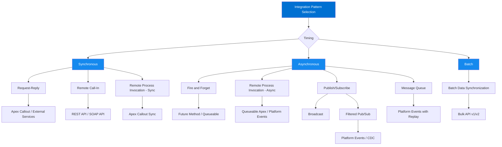
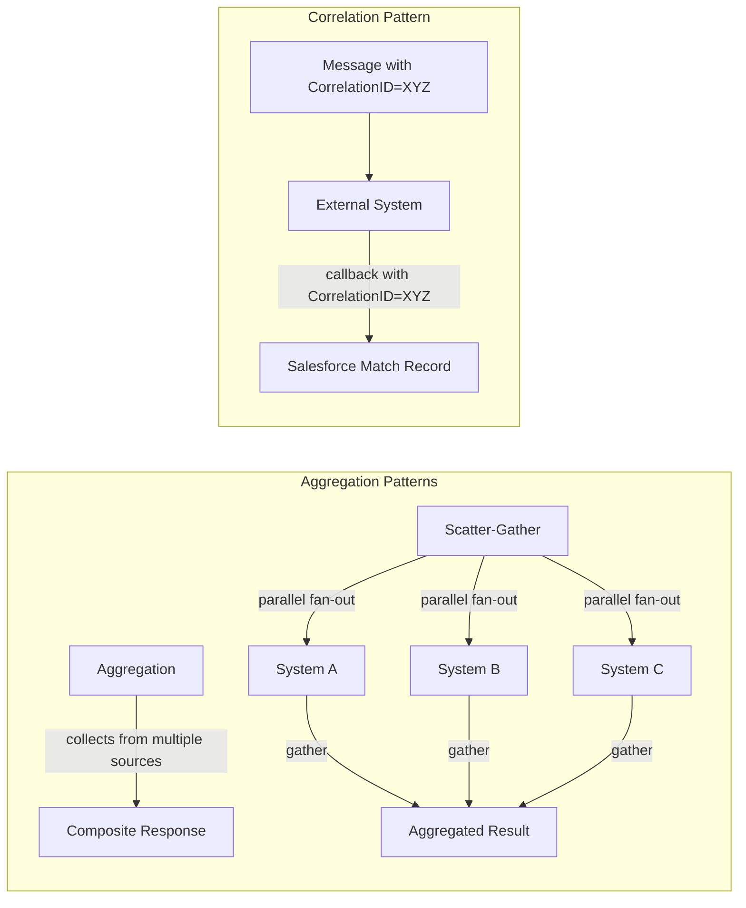

# Integration Patterns Overview

## Exam Domain
**Integration Problem Design — 26% of exam weight**
This is the highest-weighted domain. Master every pattern here.

---

## Foundations

### What Is Integration and Why Does It Exist?

Software systems don't exist in isolation. Every enterprise has a portfolio of applications — CRM, ERP, HRIS, eCommerce, data warehouse, customer portal — each built at different times, by different vendors, using different data models and protocols. Integration is the discipline of making these systems exchange data and coordinate behavior in a reliable, secure, and maintainable way.

**The core problems integration solves:**
1. **Data Silos** — The same customer exists in five systems with five different representations. Which one is the system of record?
2. **Process Fragmentation** — An order-to-cash process touches five systems. How do you orchestrate a business process that spans system boundaries?
3. **Technology Heterogeneity** — System A speaks REST/JSON, System B speaks SOAP/XML, System C uses a proprietary binary protocol. How do you make them talk?
4. **Temporal Mismatch** — System A processes in real-time; System B runs batch jobs nightly. How do you bridge synchronous and asynchronous worlds?
5. **Organizational Ownership** — Different teams own different systems. Integration governance is as much a people problem as a technical one.

### The Integration Problem Taxonomy

Before choosing a pattern, classify the problem:

**By directionality:**
- Unidirectional (A → B): data flows one way
- Bidirectional (A ↔ B): data flows both ways, with potential for conflict
- Fan-out (A → B, C, D): one source, many consumers
- Fan-in (A, B, C → D): many sources, one destination

**By timing:**
- Synchronous: caller waits for response before continuing
- Asynchronous: caller fires and continues; response comes later (or not at all)
- Batch: accumulate changes, process at scheduled intervals

**By coupling:**
- Tight coupling: systems must both be available for the integration to work
- Loose coupling: systems can operate independently; integration failure doesn't cascade

**By data model ownership:**
- Source of record: one system owns the canonical version
- Bidirectional ownership: dangerous, requires conflict resolution
- Derived data: downstream systems hold read-only copies

---

## Core Concepts: Integration Pattern Taxonomy

### Pattern 1: Request-Reply (Synchronous)

**Description:** The calling system sends a request and blocks until it receives a response. The caller and callee must both be available simultaneously.

**When to use:**
- When the caller needs the response data to complete its current operation
- When the latency is acceptable (sub-second to a few seconds)
- When the callee has high availability (99.9%+)
- User-facing operations where the UI is waiting
- Validation scenarios where a "yes/no" answer is needed before proceeding

**When NOT to use:**
- High-volume batch operations (thousands of records)
- When the callee is unreliable, slow, or has maintenance windows
- When the caller can proceed without the response
- Long-running operations (> 5 seconds) — creates poor user experience and timeout risk
- When the callee is behind a firewall that doesn't support inbound connections

**Salesforce implementation options:**
- Apex callouts (HttpRequest) — synchronous HTTP call from Apex
- External Services — declarative REST callouts with schema validation
- Salesforce Connect (OData) — external data surfaced as virtual Salesforce objects
- Named Credentials — abstracts the endpoint and authentication

**Governor limit considerations:**
- Max callout timeout: 120 seconds
- Max callouts per transaction: 100
- Total callout time: 120 seconds across all callouts in a transaction
- Cannot make callouts from triggers that are called from batch context

---

### Pattern 2: Fire and Forget (Async, One-Way)

**Description:** The calling system sends a message and immediately continues without waiting for acknowledgment or response. The message is delivered asynchronously.

**When to use:**
- When the caller does not need a response to continue
- Notifications, audit logging, analytics events
- High-volume event streams where the consumer can process independently
- When the consumer may be temporarily unavailable (message can be queued)
- Decoupling producer and consumer lifecycle

**When NOT to use:**
- When the caller must confirm the message was processed successfully
- When the operation must be atomic with the caller's operation
- When the consumer's response affects the caller's next action
- Real-time validation scenarios

**Salesforce implementation options:**
- Platform Events (publish from Apex, Flow, or API)
- Queueable Apex with external callout (async, survives beyond transaction)
- Future methods with callouts (@future(callout=true))
- Outbound Messages (SOAP-based, declarative, but legacy)
- Change Data Capture (CDC) for object change notifications

**Key distinction from Request-Reply:**
The caller continues processing immediately. If the downstream system is unavailable, the message is queued (if durable messaging is used) rather than failing the caller's operation.

---

### Pattern 3: Batch Data Synchronization

**Description:** Data is accumulated over a period and transferred in bulk at scheduled intervals. No individual record triggers the sync — the schedule does.

**When to use:**
- Large volumes of data (thousands to millions of records)
- When latency of hours is acceptable (overnight batch, hourly sync)
- Data warehouse loading (ETL/ELT patterns)
- Reporting and analytics data feeds
- Initial data migration / historical load
- When the source system only supports batch exports (legacy ERP, mainframe)

**When NOT to use:**
- When near-real-time data is required (use CDC or event-driven)
- When individual record failures need immediate remediation
- When the source data changes faster than the batch interval
- When the operation must be atomic across systems

**Salesforce implementation options:**
- Bulk API v1 / v2 — designed for this; handles up to 150MB per file, 10K records per batch (v1)
- Data Loader (declarative, built on Bulk API)
- MuleSoft batch jobs
- Scheduled Apex + Bulk API
- External ETL tools (Informatica, Talend, DBT) connecting via Bulk API

**Key design considerations:**
- Define the "changed since" query strategy — full extract vs delta extract
- Upsert vs insert — using external IDs to prevent duplicates
- Error file review — bulk jobs have a separate error file, not exceptions
- Job monitoring — Bulk API jobs are stateful; you can query job/batch status

---

### Pattern 4: Remote Call-In

**Description:** An external system initiates a call INTO Salesforce. Salesforce acts as the server (callee). This is the inverse of the callout pattern.

**When to use:**
- External system needs to create, read, update, or delete Salesforce records
- External system needs to trigger a Salesforce process or workflow
- Customer portals, mobile apps, partner systems accessing Salesforce data
- ERP writing confirmed order data back to Salesforce Opportunities

**When NOT to use:**
- When the external system cannot initiate connections (firewall-restricted network)
- When the external system operates in batch mode and Salesforce data should be pushed

**Salesforce implementation options:**
- REST API (most common — CRUD operations, query, describe)
- SOAP API (legacy, enterprise WSDL, partner WSDL)
- Bulk API (for high-volume external-initiated writes)
- Apex REST (custom endpoints via @RestResource annotation)
- Experience Cloud API / Headless sites

**Security considerations:**
- Always use OAuth 2.0 (Web Server Flow or JWT Bearer for server-to-server)
- Never use Username-Password OAuth flow in new integrations (deprecated, insecure)
- Use Connected Apps with explicit OAuth scopes — principle of least privilege
- IP restrictions on Connected Apps for server-to-server integrations

---

### Pattern 5: Remote Process Invocation — Request and Reply

**Description:** Salesforce initiates a call to an external system to invoke a process and waits synchronously for the result. The result is used in the current transaction.

**When to use:**
- Credit check before opportunity approval
- Address validation on Contact save
- Pricing calculation from external pricing engine
- Inventory availability check before order creation

**When NOT to use:**
- High-volume batch operations
- When the external process takes more than a few seconds
- Non-critical operations that can happen asynchronously

**Salesforce implementation options:**
- Apex callouts (synchronous HTTP) via triggers, classes, or Flow
- External Services (declarative, OpenAPI spec-based)
- Flow with HTTP Callout action
- Named Credentials for secure endpoint management

**Architecture trap:** Many developers use triggers for this pattern. The architectural concern is: what happens when the external service is down? The Salesforce transaction fails. For non-critical processes, prefer the Fire and Forget variant.

---

### Pattern 6: Remote Process Invocation — Fire and Forget

**Description:** Salesforce triggers a process on an external system but does NOT wait for the result. Processing continues immediately.

**When to use:**
- Kicking off a fulfillment process in ERP after Opportunity close
- Triggering a notification in an external system
- Starting a long-running process that will complete asynchronously
- When the Salesforce transaction must not be blocked by external system performance

**Salesforce implementation options:**
- Queueable Apex with callout (runs after the triggering transaction commits)
- Future methods (@future(callout=true))
- Platform Events (publish event; subscriber makes the external call)
- Outbound Messages (legacy SOAP webhook pattern)
- Flow with async action

**Key design insight:** The "after commit" nature of async callouts is intentional — it ensures that Salesforce data is saved before the external system is notified, preventing a situation where the external system acts on data that Salesforce later rolls back.

---

### Pattern 7: Publish/Subscribe (Pub/Sub)

**Description:** Publishers emit events without knowledge of who (or how many) consumers will receive them. Consumers subscribe to event types and receive events independently. The message broker decouples producers from consumers.

**When to use:**
- When multiple downstream systems need to react to the same event
- When producers and consumers should evolve independently
- When the number of consumers may change over time
- Fan-out scenarios (one event → many reactions)
- Audit trails, analytics, and operational intelligence feeds

**When NOT to use:**
- When strict ordering of events is required and the broker doesn't guarantee it
- When exactly-once delivery is critical and the broker only guarantees at-least-once
- Simple two-system integrations where the overhead of a broker isn't justified
- When the consumer's response is needed by the publisher

**Salesforce implementation options:**
- Platform Events — native Salesforce pub/sub; Apex, Flow, or API can publish; CometD subscribers
- Change Data Capture (CDC) — Salesforce automatically publishes change events for objects
- Streaming API (Push Topics) — legacy, query-based streaming
- MuleSoft Anypoint MQ (external broker that Salesforce can connect to)
- External brokers: Apache Kafka, AWS SNS/SQS, Azure Service Bus via MuleSoft or direct API

**Platform Events specifics:**
- 72-hour replay window (can replay missed events by replayId)
- 250,000 daily event delivery allocation (base org)
- Published transactionally — if the parent transaction rolls back, the event is NOT published
- High-volume Platform Events bypass the 24-hour Streaming API window

---

### Pattern 8: Broadcast

**Description:** A message is sent from one source to ALL subscribers simultaneously. Unlike pub/sub with topic filtering, all consumers receive all messages.

**When to use:**
- System-wide notifications (maintenance windows, global config changes)
- Price list updates that every system must receive
- Master data (product catalog) sync to all dependent systems
- Emergency broadcasts

**When NOT to use:**
- When consumers need only a subset of the data (use filtered pub/sub instead)
- When volume of messages is high — broadcasting everything to all consumers is wasteful

**Salesforce context:**
Platform Events with no topic segmentation effectively become broadcasts. Change Data Capture is broadcast-like — all subscribers for an object receive all changes.

---

### Pattern 9: Aggregation

**Description:** Data from multiple sources is collected, combined, and presented as a unified response. The aggregator assembles a composite message from multiple inputs.

**When to use:**
- 360-degree customer view assembled from CRM + billing + support + order data
- Product catalog assembled from multiple PIM systems
- Financial consolidation across multiple ERP instances
- Dashboard that shows combined metrics from disparate systems

**Salesforce implementation options:**
- Salesforce Connect (virtual Salesforce objects from external OData sources)
- Platform Cache + Apex aggregator pattern
- MuleSoft as the aggregation layer (recommended for complex aggregations)
- External Services calling multiple backends and merging results (antipattern at scale — sequential calls)

**Key design concern:** Aggregation introduces latency. Each source contributes its own latency. Parallel calls (scatter-gather) are preferred over sequential calls for multi-source aggregation.

---

### Pattern 10: Scatter-Gather

**Description:** A message is sent to multiple systems simultaneously (scatter). Responses are collected and aggregated into a single composite response (gather). This is parallel aggregation.

**When to use:**
- Real-time insurance or loan quote from multiple providers
- Inventory check across multiple warehouses
- Federated search across multiple data sources
- Parallel validation rules executed across systems

**When NOT to use:**
- When systems respond at wildly different speeds (fastest must wait for slowest)
- When any single failure should fail the entire operation
- When responses must be ordered (sequential, not parallel)

**Salesforce considerations:**
Apex does not natively support parallel callouts. Each callout in a transaction is sequential. To implement scatter-gather in Salesforce: use multiple Queueable jobs, or delegate to MuleSoft/iPaaS which handles parallel HTTP calls natively.

---

### Pattern 11: Correlation Identifier

**Description:** Each message carries a unique identifier that correlates request and response messages across asynchronous exchanges. The receiver echoes the correlation ID back so the sender can match the response to the original request.

**When to use:**
- Asynchronous request-reply where you need to match responses to requests
- Long-running processes where the original request context must be maintained
- Audit trails for distributed transactions
- Error tracking across systems

**Salesforce implementation:**
- Include a UUID or Salesforce Record ID in every outbound event/message
- Store the correlation ID on the Salesforce record as an External ID field
- The receiving system echoes the ID back in the callback/webhook
- Use External ID matching for upsert operations — this IS the correlation identifier pattern

**Key exam point:** External IDs in Salesforce serve as correlation identifiers in integration scenarios. When a system sends data to Salesforce and later needs to update that record, the External ID is how it finds the record without a Salesforce ID.

---

### Pattern 12: Message Queue

**Description:** Messages are placed in a durable queue by producers and consumed by consumers at their own pace. The queue decouples producer and consumer throughput, provides buffering, and enables guaranteed delivery.

**When to use:**
- Smoothing out traffic spikes (queue absorbs burst, consumer processes steadily)
- Ensuring messages are not lost if the consumer is temporarily unavailable
- Load leveling between fast producer and slow consumer
- Guaranteed at-least-once delivery requirement

**Salesforce implementation:**
- Platform Events act as a durable queue (72-hour replay)
- Apex jobs in the Salesforce Flex Queue (up to 100 queued jobs)
- MuleSoft Anypoint MQ, AWS SQS, Azure Service Bus as external queues
- Dead Letter Queue pattern: messages that fail after N retries go to a DLQ for manual review

---

## PTA / SA Relevance

### When This Comes Up in Engagements

Real discovery questions that expose integration pattern decisions:

**"How often does this data need to be current?"**
Answer reveals sync vs async vs batch. "Immediately" → sync or event-driven. "Within 5 minutes" → Platform Events. "Next day is fine" → batch.

**"What happens if the external system is down during business hours?"**
Answer reveals tolerance for coupling. "Nothing should fail in Salesforce" → async, fire-and-forget with retry. "Users need the data to proceed" → sync with circuit breaker and fallback.

**"How many records are we talking about?"**
The volume threshold determines whether REST API is appropriate or Bulk API is required. Greater than 50K records per day: Bulk API. Greater than 1M records per day: Bulk API plus scheduled jobs.

**"Do multiple teams/systems need to know when this changes?"**
If yes → pub/sub (Platform Events or CDC). If one-to-one → direct callout or webhook.

**"Do you have an enterprise integration platform already?"**
If yes (MuleSoft, Boomi, Informatica) → the pattern decision shifts. Salesforce becomes one system on the bus. If no → you're designing the integration layer.

### Common Architecture Failures

**Failure 1: Point-to-Point Spaghetti**
Ten systems each talking directly to each other = N×(N-1)/2 connections. With 10 systems, that's 45 integration points to maintain. Every system change ripples to all connected systems. The fix: hub-and-spoke with a canonical data model.

**Failure 2: Synchronous Everything**
Customer builds all integrations as synchronous callouts from Apex triggers. System works fine in dev with 10 records. In production with 10,000 records in a batch import, every record triggers a callout, hits the 100-callout limit, and the import fails. The fix: event-driven with async processing.

**Failure 3: No Idempotency**
Network timeout causes a retry. The retried callout creates a duplicate record in the ERP. No external ID means no upsert capability. The fix: design every integration with idempotency from day one — external IDs, dedupe checks, or at-most-once delivery guarantees.

**Failure 4: Missing Dead Letter Queue**
Integration fails silently. No monitoring. No retry. No alerting. Business discovers the problem three days later when a customer calls about a missing order. The fix: every message queue must have a DLQ with alerting and a manual review process.

**Failure 5: Treating Events as Commands**
A Platform Event is published that says "CreateOrderInERP". This is a command disguised as an event. If the ERP subscriber fails, the command never executes. Events should be facts: "OrderClosed". The subscriber decides what to do with that fact.

### Enterprise Patterns

**Fortune 500 / Large Enterprise:**
- Almost always have an iPaaS (MuleSoft, Boomi) or legacy ESB (IBM MQ, TIBCO) as the integration backbone
- Salesforce is one node on the bus, not the integration hub
- Change Data Capture or Platform Events publish to the enterprise bus; the bus routes to other systems
- Governance is strict: every integration registered in an API registry, versioned, SLA-bound
- Integration teams are separate from Salesforce teams — expect organizational friction

**Mid-Market:**
- Often direct integrations (no iPaaS)
- MuleSoft or Zapier/Make for simpler workflows
- Salesforce is often the de facto system of record for customer data
- Less governance, more pragmatism — but this creates technical debt
- Integration sprawl is common — dozens of point-to-point connections with no documentation

---

## Architecture

### Limitations and Tradeoffs

| Pattern | Tradeoff 1 | Tradeoff 2 | Tradeoff 3 |
|---------|------------|------------|------------|
| Request-Reply | Tight temporal coupling — both systems must be up simultaneously | Latency is added to the caller's response time | Cascading failures — callee outage causes caller failure |
| Fire and Forget | No confirmation of processing — silent failures are possible | Requires monitoring/alerting to detect failures | Message ordering not guaranteed |
| Batch Sync | High latency — hours between refreshes | Large batches can overwhelm target system if not throttled | No individual record error handling without error file processing |
| Pub/Sub | At-least-once delivery requires idempotent consumers | Event schema changes can break consumers | Debugging asynchronous flows is harder than synchronous |
| Message Queue | Adds infrastructure complexity (broker) | Queue depth monitoring required to detect backlogs | Exactly-once delivery is hard to achieve |
| Scatter-Gather | Slowest system determines total response time | Any single system failure can block the gather step | High fan-out creates load on all target systems simultaneously |

---

## Key Facts to Memorize

- **Request-Reply** = synchronous, both systems must be available simultaneously
- **Fire and Forget** = async, caller continues without waiting; no response expected
- **Batch Synchronization** = scheduled, volume-optimized, latency-tolerant
- **Platform Events** = durable (72-hour replay), transactional publish, 250K/day base allocation
- **Bulk API v1** = 10,000 records per batch; **Bulk API v2** = 150MB per file
- **Apex callout max timeout** = 120 seconds; **max callouts per transaction** = 100
- **CDC (Change Data Capture)** = Salesforce automatically publishes change events; 72-hour retention
- **External ID** = the Salesforce implementation of the Correlation Identifier pattern
- **Outbound Messages** = legacy SOAP-based Fire-and-Forget; being replaced by Platform Events
- **Queueable Apex** runs AFTER the triggering transaction commits — critical for callout-after-save patterns
- **Future methods** cannot be called from Batch Apex or other future methods — use Queueable instead
- **Scatter-Gather in Apex** is not natively parallel — requires iPaaS or external orchestration
- **Canonical Data Model** = shared neutral data format; lives in the middleware layer, not in Salesforce or the ERP

---

## Exam Traps

**Trap 1: "Real-time" defaults to synchronous callout from trigger**
Wrong. Platform Events plus async subscriber is often the correct architecture for "real-time" business events. The exam often presents a scenario where a trigger callout will fail under load — the correct answer is Platform Events.

**Trap 2: Batch API = Bulk API**
These are different. Bulk API is the exam answer for high-volume data loading. Batch Apex is Apex code that runs in batch mode — different from Bulk API.

**Trap 3: Future methods for callouts are equivalent to Queueable**
Not true. Future methods have severe limitations: cannot be called from Batch Apex, cannot chain, no monitoring, no queuing priority. Queueable is the modern replacement.

**Trap 4: Pub/Sub means Salesforce IS the broker**
Not necessarily. In enterprise scenarios, Salesforce publishes Platform Events TO an external broker (Kafka, Azure Service Bus via MuleSoft). The broker is not Salesforce itself.

**Trap 5: Correlation ID = just a tracking number**
On the exam, External IDs serve as correlation identifiers. If a question asks how an external system finds the Salesforce record it originally created, the answer is External ID.

**Trap 6: Fire and Forget = no error handling**
Wrong. Fire and Forget means the caller doesn't wait. Error handling still exists — it's on the consumer side (DLQ, retry, alerting). The caller is just decoupled from the error.

---

## Practice Questions

**Q1.** A manufacturing company runs a nightly job that extracts 500,000 updated inventory records from their ERP and needs to update corresponding Product2 records in Salesforce. Which integration pattern and API combination is most appropriate?

A) Synchronous REST API calls triggered by an Apex scheduled job
B) Batch Data Synchronization using Bulk API v2 with upsert on External ID
C) Platform Events published from ERP, consumed by Salesforce trigger
D) SOAP API using the Enterprise WSDL with a batch size of 200

**Correct Answer: B**
*Explanation: 500,000 records is a volume scenario that requires Bulk API. REST API with individual callouts would hit governor limits (100 callouts/transaction) and be far too slow. Bulk API v2 supports 150MB files and is designed for this pattern. Upsert on External ID implements the Correlation Identifier pattern — the ERP's item number is the External ID. SOAP API could technically work but is not the right tool for volume. Platform Events are for event-driven scenarios, not batch data loads.*

---

**Q2.** A financial services company needs Salesforce Opportunity stage changes to trigger a compliance check in an external regulatory system. The compliance check takes up to 45 seconds to complete. Which pattern should be used?

A) Apex trigger making a synchronous callout to the compliance system on Opportunity stage change
B) Apex trigger publishing a Platform Event; a separate process invokes the compliance system and updates Salesforce asynchronously
C) Scheduled Apex batch job polling for unchecked Opportunities every 5 minutes
D) Workflow Rule with Outbound Message to the compliance system

**Correct Answer: B**
*Explanation: The 45-second processing time eliminates synchronous options — holding a user's save for 45 seconds is unacceptable UX and risks timeouts. Platform Events decouple the trigger from the callout: the trigger publishes the event instantly (the save completes immediately), and a separate subscriber performs the 45-second compliance call asynchronously. When the compliance check completes, it updates Salesforce via REST API. Option C has 5-minute latency. Option D (Outbound Message) is legacy.*

---

**Q3.** An enterprise customer has Salesforce, SAP, and Workday. Today each system talks directly to the other two. They are adding three more systems. An architect is recommending a new integration topology. Which statement best describes the benefit of moving from point-to-point to hub-and-spoke architecture?

A) Hub-and-spoke eliminates the need for a canonical data model
B) Hub-and-spoke reduces the number of integration points from N×(N-1)/2 to N
C) Hub-and-spoke guarantees exactly-once message delivery
D) Hub-and-spoke removes the need for authentication between systems

**Correct Answer: B**
*Explanation: The mathematical argument for hub-and-spoke is compelling. With 6 systems in point-to-point: 6×5/2 = 15 integration points. With hub-and-spoke: 6 connections (one per system to the hub). Each system only needs to know how to talk to the hub. Option A is wrong — the hub typically requires a canonical data model even more than point-to-point. Option C is wrong — delivery semantics depend on the broker, not the topology. Option D is wrong — authentication is still required.*

---

**Q4.** A Salesforce org publishes a Platform Event called Order_Shipped__e whenever an order is shipped. Three external systems need to receive this event: the warehouse management system, the customer notification service, and the analytics platform. Which pattern does this exemplify?

A) Scatter-Gather
B) Request-Reply
C) Broadcast / Publish-Subscribe
D) Aggregation

**Correct Answer: C**
*Explanation: One publisher (Salesforce), multiple independent subscribers (WMS, notification service, analytics). The publisher doesn't know how many consumers exist. This is the Publish-Subscribe (Pub/Sub) pattern. Since all subscribers receive the same event without filtering, it also has characteristics of Broadcast. Scatter-Gather is the inverse — one sender to many receivers who then reply with results that are gathered. Aggregation collects from multiple sources into one. Request-Reply is synchronous with a single expected response.*

---

**Q5.** An integration between Salesforce and an ERP system uses Apex triggers to make synchronous callouts when Accounts are updated. During a data migration, 50,000 Accounts are updated via Data Loader. Which problem will occur and what is the architectural fix?

A) The Data Loader will fail because it uses SOAP API, which doesn't support Account updates; fix by using REST API
B) The Apex trigger callouts will exceed the 100-callout-per-transaction limit; fix by using Platform Events to decouple the trigger from the callout
C) The ERP will reject the calls because Bulk API is required for high-volume operations; fix by switching to Bulk API
D) The Data Loader will time out because synchronous callouts must complete within 5 seconds; fix by increasing the timeout to 120 seconds

**Correct Answer: B**
*Explanation: This is a classic "synchronous trigger callout at scale" failure. Data Loader with a batch size of 200 means up to 200 Account records per transaction. If the trigger makes one callout per record, 200 callouts per transaction exceeds the 100-callout limit and the transaction fails. The architectural fix is to decouple: the trigger publishes a Platform Event (no callout, no limit hit), and a Platform Event subscriber (Apex trigger on the event) processes the callouts asynchronously in smaller batches. The architectural principle holds regardless of API mode used.*

---

*Next: [Lecture 02 — API Design: REST vs SOAP](lecture-02-api-design-rest-soap.md)*
