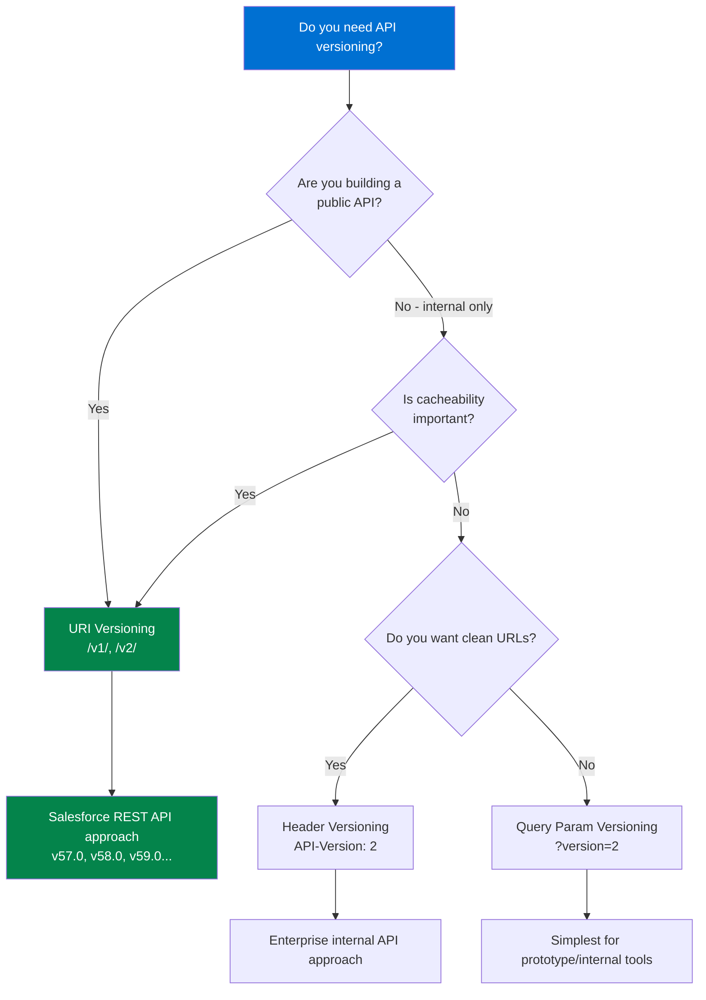
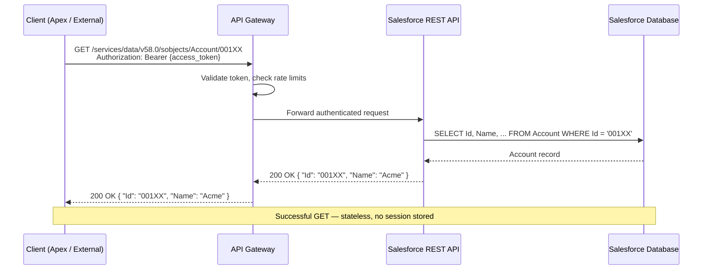
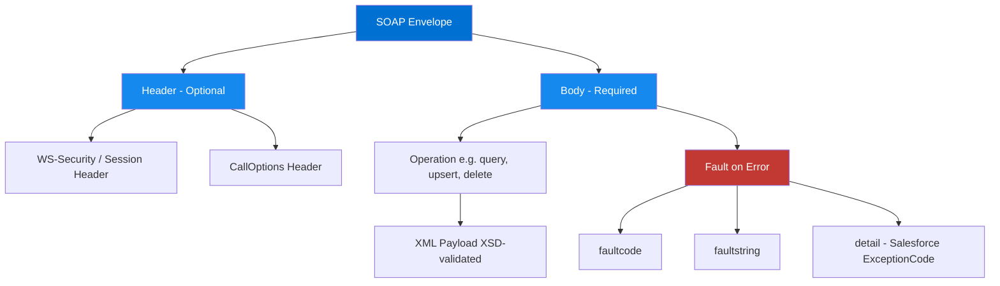
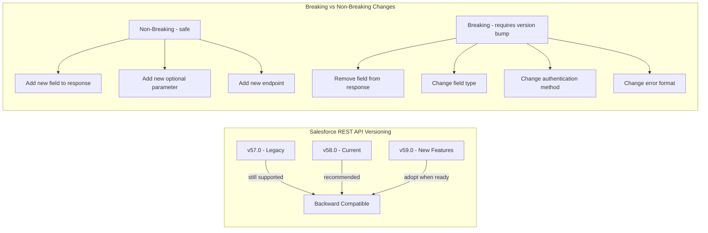

# API Design — REST vs SOAP

## Exam Domain
**Salesforce API Use — 22% of exam weight**
Understanding REST and SOAP at an architectural level is foundational for the entire exam.

---

## Foundations

### What Is an API?

An API (Application Programming Interface) is a formally defined contract between a producer and a consumer. The contract specifies:
- **What operations are available** (the interface)
- **What data formats are used** (the message schema)
- **How authentication works** (the security model)
- **What errors can occur and how they're communicated** (the error model)
- **What performance guarantees exist** (the SLA)

The word "contract" is the key architectural concept. An API that changes without versioning breaks its consumers. An API with no formal schema (no WSDL, no OpenAPI spec) creates an implicit contract that is never validated.

### The API Spectrum

From most structured/strict to least:

```
SOAP (WSDL-enforced, XSD-validated) 
  → REST with OpenAPI Spec (documented, optionally validated)
    → REST without spec (implicit contract)
      → Webhook (event delivery, consumer defines handling)
        → Direct database access (no API — never acceptable in modern integration)
```

The CRT-404 exam tests whether you know when each level of structure is appropriate.

---

## REST: Representational State Transfer

### The Six Constraints (Roy Fielding's Original Dissertation)

REST is not a protocol or a standard — it is an architectural style defined by six constraints. A system that satisfies all six is "RESTful."

**1. Client-Server Separation**
The client and server are independent. The client does not concern itself with data storage; the server does not concern itself with UI. This constraint enables independent evolution of client and server.

**2. Stateless**
Each request from a client to a server must contain all information needed to understand and complete the request. The server does not store client session state between requests. This is why OAuth tokens are included in every request header — the server cannot rely on a prior login session.

Implications: Horizontal scaling is easy (any server can handle any request). But: large requests because every call is self-contained.

**3. Cacheable**
Responses must define themselves as cacheable or non-cacheable. When caching is appropriate, it can eliminate client-server interactions and improve scalability.

In practice: GET requests should be idempotent and cacheable. POST/PUT/DELETE are not cacheable. HTTP Cache-Control headers govern this.

**4. Uniform Interface**
The interface between client and server must be uniform, consisting of:
- **Resource identification** (URIs identify resources, not operations)
- **Resource manipulation through representations** (client holds a representation of the resource and uses it to manipulate the resource)
- **Self-descriptive messages** (each message includes enough information to describe how to process it)
- **Hypermedia as the engine of application state (HATEOAS)** (responses include links to next possible actions)

Note: HATEOAS is rarely implemented in practice. The exam acknowledges this.

**5. Layered System**
A client cannot ordinarily tell whether it is connected directly to the end server or an intermediary. Load balancers, API gateways, and caches are transparent to the client.

**6. Code on Demand (Optional)**
Servers can extend client functionality by transferring executable code (e.g., JavaScript). This is the only optional constraint.

### HTTP Methods and Their Semantics

The exam tests understanding of HTTP method semantics — not just what they do, but their safety and idempotency guarantees.

| Method | Semantics | Safe? | Idempotent? | Use Case |
|--------|-----------|-------|-------------|----------|
| GET | Retrieve resource | Yes | Yes | Read a record, execute a query |
| POST | Create resource or submit data | No | No | Create new record, trigger action |
| PUT | Replace resource entirely | No | Yes | Full update — replaces all fields |
| PATCH | Partial update | No | No (by default) | Update specific fields only |
| DELETE | Remove resource | No | Yes | Delete a record |
| HEAD | Retrieve headers only (no body) | Yes | Yes | Check if resource exists |
| OPTIONS | Get available methods | Yes | Yes | CORS preflight, capability discovery |

**Safe** = No side effects on the server. GET and HEAD should never modify data.

**Idempotent** = Making the same request N times has the same effect as making it once. PUT is idempotent because `PUT /accounts/001 {name: "Acme"}` called 100 times leaves the same result as called once. PATCH is technically not idempotent because a PATCH might say "increment counter by 1" — called 100 times has a different result.

**Why this matters for integration design:** When designing retry logic, only retry idempotent operations without checking for duplicates first. A failed POST (non-idempotent) must check whether the resource was created before retrying, or you'll create duplicates.

### REST API Design Best Practices

**Resource Naming:**
- Use nouns, not verbs: `/accounts` not `/getAccounts`
- Use plural nouns: `/accounts/001` not `/account/001`
- Hierarchical for relationships: `/accounts/001/contacts`
- Lowercase with hyphens: `/opportunity-line-items`

**HTTP Status Codes:**

| Code | Meaning | Integration Context |
|------|---------|---------------------|
| 200 OK | Successful GET, PUT, PATCH | Response contains the resource |
| 201 Created | Successful POST | Response Location header has the new resource URI |
| 204 No Content | Successful DELETE or PUT | No response body |
| 400 Bad Request | Invalid request syntax/parameters | Client bug — do not retry without fixing |
| 401 Unauthorized | Missing or invalid credentials | Refresh OAuth token and retry |
| 403 Forbidden | Authenticated but not authorized | Permission issue — do not retry |
| 404 Not Found | Resource doesn't exist | Might be a deleted record — check before retrying |
| 409 Conflict | Resource state conflict (duplicate) | Idempotency issue — check if resource exists |
| 422 Unprocessable Entity | Valid syntax but semantic error | Validation failure — do not retry without fixing |
| 429 Too Many Requests | Rate limit exceeded | Backoff and retry after Retry-After header |
| 500 Internal Server Error | Server-side error | May retry with backoff |
| 503 Service Unavailable | Server temporarily overloaded | Retry with exponential backoff |

**Pagination Strategies:**

*Offset Pagination:*
`/accounts?limit=200&offset=400`
Simple to implement. Problem: if records are inserted during pagination, you miss records or get duplicates.

*Cursor/Token Pagination:*
`/accounts?nextRecordsUrl=/services/data/v58.0/query/01gXXXXXXX`
Salesforce REST API uses this pattern (nextRecordsUrl). Consistent even if records change during iteration. The correct approach for Salesforce query pagination.

*Keyset Pagination:*
`/accounts?after_id=001XXXX&limit=200`
Uses a sorted field as the pagination anchor. Highly performant at scale.

**Filtering:**
`/contacts?LastName=Smith&AccountId=001XXX`
Salesforce REST API uses query parameters for filtering via SOQL: `?q=SELECT+Id+FROM+Contact+WHERE+LastName='Smith'`

**Versioning (covered in depth below).**

---

## SOAP: Simple Object Access Protocol

### SOAP Fundamentals

SOAP is a protocol (not just an architectural style) for exchanging structured information in distributed computing. It uses XML exclusively. It is defined by a WSDL (Web Services Description Language) that serves as the formal contract.

### SOAP Message Structure

A SOAP message is an XML document with a mandatory structure:

```xml
<soap:Envelope xmlns:soap="http://schemas.xmlsoap.org/soap/envelope/">
  <soap:Header>
    <!-- Optional: authentication, transaction context, routing info -->
    <wsse:Security>
      <wsse:UsernameToken>
        <wsse:Username>user@example.com</wsse:Username>
        <wsse:Password>sessionId</wsse:Password>
      </wsse:UsernameToken>
    </wsse:Security>
  </soap:Header>
  <soap:Body>
    <!-- Required: the actual message/operation payload -->
    <query xmlns="urn:enterprise.soap.sforce.com">
      <queryString>SELECT Id, Name FROM Account LIMIT 10</queryString>
    </query>
  </soap:Body>
</soap:Envelope>
```

**Envelope:** The root element. Identifies the document as a SOAP message.
**Header:** Optional. Contains metadata — authentication tokens, transaction IDs, routing instructions.
**Body:** Required. Contains the actual request or response payload.
**Fault:** Special body element returned when an error occurs. Has Code, Reason, and Detail elements.

### WSDL: The SOAP Contract

The WSDL (Web Services Description Language) is an XML document that formally describes the web service:
- What operations are available
- What XML types are used in requests and responses
- Where the service endpoint is located
- What protocol bindings are used

**Salesforce WSDL types:**
- **Enterprise WSDL**: Org-specific. Includes your custom objects and fields. Must be re-downloaded when schema changes. Used for custom integrations to a specific org.
- **Partner WSDL**: Generic. Works with any org. The integration code handles the weakly-typed SObject structure. Used by tools that work across multiple orgs (ISVs, AppExchange apps).
- **Metadata WSDL**: For deploying/retrieving org configuration (custom fields, workflows, etc.)
- **Tooling WSDL**: For development tooling integration (IDE integration, code coverage, etc.)

### SOAP vs REST: When to Use Which

| Factor | REST | SOAP |
|--------|------|------|
| Data format | JSON (preferred), XML | XML only |
| Protocol | HTTP | HTTP, SMTP, TCP (protocol-agnostic) |
| Contract | Optional (OpenAPI spec) | Required (WSDL) |
| State | Stateless | Can be stateful |
| Security | OAuth, API keys, TLS | WS-Security, WS-Trust, TLS |
| Performance | Lighter weight | Heavier (XML parsing, envelope overhead) |
| Tooling | Widely supported | Strong in Java/.NET enterprise |
| Versioning | URL, header, or query param | Namespace versioning in WSDL |
| Error handling | HTTP status codes | Fault elements |
| Transactions | Not native | WS-AtomicTransaction (distributed txns) |

**Choose SOAP when:**
- The integration partner requires it (often financial services, healthcare, government systems)
- You need WS-Security features (message-level encryption, digital signatures)
- You need distributed transaction support (WS-AtomicTransaction)
- Existing enterprise systems only expose SOAP endpoints (legacy ERP, mainframe)
- Formal contract enforcement is critical (WSDL provides XSD validation at the protocol level)
- You are using Salesforce SOAP API specifically (query, queryMore patterns)

**Choose REST when:**
- Building new integrations where you control both sides
- Mobile or web browser clients (JSON is far more efficient than XML)
- Public-facing APIs (REST is the internet standard)
- Microservices integration
- When performance and payload size matter
- When you need HTTP caching

---

## XML vs JSON Tradeoffs

| Dimension | JSON | XML |
|-----------|------|-----|
| Verbosity | Compact | Verbose (tags repeated) |
| Parsing | Fast (native in JS, simple in Java/Python) | Slower (DOM/SAX parsing overhead) |
| Schema validation | JSON Schema (optional) | XSD (rigorous, part of SOAP) |
| Namespace support | Limited | Full namespace support |
| Comments | Not supported | Supported |
| Attribute vs element model | Object/array natural model | Attribute/element distinction |
| Mixed content | N/A | Supports mixed (text + elements) |
| Binary data | Base64 string | Base64 or MTOM attachment |
| Human readability | High | High (more verbose) |

**Exam note:** JSON is the default for Salesforce REST API. XML is required for SOAP API. The exam may ask about when XML is preferable — the answer is almost always "when the integration partner requires SOAP" or "when message-level encryption via WS-Security is needed."

---

## GraphQL: Brief Overview

GraphQL is a query language for APIs developed by Facebook. It allows clients to specify exactly what data they need, avoiding over-fetching (getting too much data) and under-fetching (making multiple calls to assemble data).

**Why Salesforce doesn't heavily use GraphQL (exam-relevant facts):**
- Salesforce introduced GraphQL API in 2022 (Beta) but it is limited in scope
- SOQL already solves the "specify exactly what you need" problem for Salesforce data
- The exam (current version) does not heavily test GraphQL
- For the CRT-404 exam, know that GraphQL exists, know its core benefit (client-specified queries), but do not expect deep GraphQL questions
- Salesforce's primary API is REST, with SOQL as the query language — this is what the exam tests

---

## OpenAPI / Swagger Specification

OpenAPI (formerly Swagger) is a standard for describing REST APIs in a machine-readable format (JSON or YAML). It documents:
- Endpoints and HTTP methods
- Request parameters and request body schema
- Response schema and status codes
- Authentication methods
- API metadata (version, contact, license)

**Why OpenAPI matters for Salesforce:**
- **External Services** in Salesforce requires an OpenAPI 2.0 spec to create declarative callout actions
- External Services generates Apex classes from the spec — the spec IS the integration contract
- MuleSoft RAML is similar (REST API Modeling Language) — MuleSoft's spec format
- When a customer says "we need a Salesforce integration to a third-party REST API," the first question should be "do they have an OpenAPI spec?" — if yes, use External Services

**OpenAPI 2.0 vs 3.0:**
Salesforce External Services supports OpenAPI 2.0 (Swagger 2.0). OpenAPI 3.0 has improvements (multiple server URLs, improved schema composition) but is not yet fully supported in External Services as of the current exam version.

---

## Idempotency in API Design

**Definition:** An operation is idempotent if performing it N times produces the same result as performing it once.

**Why idempotency is an architecture concern:**
Networks are unreliable. A request might be sent, delivered to the server, processed, but the response is lost. The client doesn't know if the operation succeeded. Without idempotency, retrying creates duplicates.

**Idempotency implementation patterns:**

*Pattern 1: Use PUT instead of POST*
PUT replaces the resource at a specific URI. If the resource already exists with the same data, the result is the same. No duplicate is created.

*Pattern 2: Idempotency Key (Header)*
The client generates a unique key (UUID) for the request and includes it in a header (`Idempotency-Key: uuid-xxxx`). The server stores completed operations and their results keyed by this ID. If the same key is received again, return the stored result without re-processing.

*Pattern 3: External ID for Upsert*
The Salesforce pattern: use `upsert` with an External ID field. If the record exists (matched on External ID), update it. If not, create it. Running the upsert twice with the same External ID does not create a duplicate.

*Pattern 4: Conditional Headers*
Use `If-Match` (ETag) to ensure you are modifying the version you expect. If the record changed since you retrieved it, the PUT/PATCH fails with 412 Precondition Failed.

**Exam point:** Questions about "how to prevent duplicate records when a retry occurs" → answer is External ID + Upsert. Questions about "how to prevent creating a duplicate in an external system when Salesforce retries a callout" → answer is Idempotency Key in the request header.

---

## API Versioning Strategies

APIs must evolve over time without breaking existing consumers. Versioning is the mechanism for managing this evolution.

**Strategy 1: URI Versioning**
Version is embedded in the URL path:
`https://instance.salesforce.com/services/data/v58.0/sobjects/`

Pros: Explicit, easy to see, easy to route at gateway level, cacheable.
Cons: URLs change; clients must update hardcoded URLs.

Salesforce REST API uses this pattern. Version = v[Major].[Minor]. The exam tests the current API version range and what versions support what features.

**Strategy 2: Header Versioning**
Version is in a custom request header:
`Accept-Version: v2`
or
`API-Version: 2024-01-15`

Pros: URL stays clean; version is a transport concern, not a resource concern.
Cons: Not visible in URL (harder to debug, not cacheable by version), requires header inspection.

**Strategy 3: Query Parameter Versioning**
Version is a query parameter:
`/accounts?version=2`

Pros: Simple, explicit, easy to test in browser.
Cons: Pollutes the query string, can conflict with filtering parameters.

**Strategy 4: Content Negotiation (Accept Header)**
Version is specified in the Accept header:
`Accept: application/vnd.salesforce.v58+json`

Pros: Semantically correct (you're requesting a specific representation).
Cons: Complex for API consumers, not widely understood.

**Salesforce exam answer:** URI versioning is the Salesforce approach. Know that v[current] and v[current-1] are both supported, and Salesforce maintains backward compatibility within major versions.

**Versioning decision tree:**



---

## Mermaid Diagrams

### REST Request-Response Flow



### SOAP Envelope Structure



### API Versioning Decision Tree (full)



---

## PTA / SA Relevance

### When This Comes Up in Engagements

**"We need to call your legacy ERP which only speaks SOAP"**
Architectural response: Apex supports SOAP callouts via generated WSDL. However, consider whether MuleSoft should sit between Salesforce and the ERP — translating REST (Salesforce side) to SOAP (ERP side). This isolates the Salesforce team from the WSDL changes.

**"The third-party API doesn't have an OpenAPI spec"**
Architectural response: This means External Services is not an option without creating a spec. Options: hand-write the OpenAPI 2.0 spec (tedious but workable), use Apex callouts directly, or push the vendor to document their API.

**"Our API is really slow under load"**
Discovery questions: What's the payload size? Are you making N+1 calls? Are you using pagination correctly? Have you considered Composite API (batching multiple operations per HTTP call)? Is there caching at the gateway level?

**"We get 429 errors from the external API"**
Architectural response: Implement exponential backoff with jitter. Check the Retry-After header. Consider queuing requests through Platform Events so they can be rate-limited at the consumer side, not at the Salesforce transaction level.

### Common Architecture Failures

**Failure 1: Ignoring HTTP Semantics (POST for everything)**
Teams build integrations where every call is a POST, regardless of operation. This breaks cacheability, idempotency, and API gateway routing. The fix: use HTTP verbs correctly.

**Failure 2: No Error Code Handling Strategy**
Integration retries 500 errors and 400 errors with the same logic. 400 errors should never be retried without fixing the request. 500 errors should be retried with backoff. 429 should be retried with the Retry-After delay. The fix: error handling matrix by status code class.

**Failure 3: SOAP WSDL Coupling**
A team downloads Salesforce's Enterprise WSDL and embeds it in an ERP integration. Every time a new custom field is added to Salesforce, the WSDL changes and the integration breaks. The fix: use the Partner WSDL (stable, generic), or better, move to REST API.

**Failure 4: Over-fetching with REST**
An integration calls `/services/data/v58.0/sobjects/Account/001XX` which returns ALL fields. It only needs Name and Phone. Over-fetching is bandwidth waste and exposes data that shouldn't cross the wire. The fix: use SOQL query endpoint with explicit field list.

**Failure 5: Hardcoded API Version**
An integration is hardcoded to v45.0. Salesforce deprecates it. Integration breaks overnight. The fix: version should be in configuration, not code. Establish a process for API version upgrades.

### Enterprise Patterns

**Large Enterprise with API Gateway:**
All API calls from external systems route through an API gateway (MuleSoft, Apigee, Kong). The gateway handles: rate limiting, authentication validation, request routing, logging, payload transformation. Salesforce Connected Apps issue tokens; the gateway validates them before forwarding. The CRT-404 exam tests knowledge of this pattern.

**Mid-market with Direct API:**
Salesforce REST API called directly from external systems. Connected App OAuth. No API gateway. This is simpler but has less observability and no central rate-limit management.

---

## Key Facts to Memorize

- **REST** = architectural style, not a protocol; defined by 6 constraints
- **SOAP** = protocol; uses XML exclusively; requires WSDL
- **GET** = safe + idempotent; **POST** = neither; **PUT** = idempotent (not safe); **DELETE** = idempotent
- **PATCH** is NOT idempotent by default (a PATCH saying "increment by 1" applied N times ≠ applied once)
- **201 Created** = POST success; **204 No Content** = DELETE/PUT success with no body; **429** = rate limited
- **Enterprise WSDL** = org-specific, includes custom objects, breaks when schema changes
- **Partner WSDL** = generic, works with any org, used by tools across multiple orgs
- **OpenAPI 2.0** is required for Salesforce External Services (not OpenAPI 3.0)
- **URI versioning** is the Salesforce REST API approach (v57.0, v58.0, etc.)
- **External ID + Upsert** = Salesforce's idempotency implementation pattern
- **Cursor pagination** (nextRecordsUrl) = Salesforce query result pagination approach
- **JSON is default** for Salesforce REST API; XML is optional via Accept: application/xml
- **SOAP API supports distributed transactions** via WS-AtomicTransaction (rare but exam-testable)
- **Username-Password OAuth flow** = deprecated/insecure; never use in new integrations

---

## Exam Traps

**Trap 1: SOAP is always worse than REST**
Wrong. When the integration partner requires SOAP (legacy ERP, financial systems), SOAP is the right answer. The exam respects pragmatism. If a question says "the ERP only exposes SOAP endpoints," the correct answer uses SOAP.

**Trap 2: Any HTTP call = REST**
Wrong. An HTTP POST to `/invokeAction` that returns XML is not REST — it has none of the REST constraints. The exam may test whether you understand what makes an API truly RESTful vs just HTTP-based.

**Trap 3: OpenAPI 3.0 works with External Services**
Salesforce External Services requires OpenAPI 2.0 (Swagger 2.0). External Services does not fully support OpenAPI 3.0. This trips up people who are current with the broader OpenAPI ecosystem.

**Trap 4: PUT and POST are interchangeable**
Not architecturally. POST is for creating new resources (server assigns the ID). PUT is for updating a resource at a specific URI (client knows the ID). The exam may test this in an idempotency scenario.

**Trap 5: 404 = always retry**
Wrong. If a resource doesn't exist (404), retrying won't make it appear. 404 on a DELETE is often acceptable (the resource is already gone). The handling depends on the operation.

**Trap 6: WSDL = same as OpenAPI spec**
They serve the same purpose (formal API contract) but are different technologies. WSDL is XML-based and tightly coupled to SOAP. OpenAPI is JSON/YAML-based and used with REST. The exam tests whether you can pick the right one for the scenario.

---

## Practice Questions

**Q1.** A developer is building an Apex class to call a third-party billing system's REST API. The billing system returns a 503 status code. What is the correct architectural response?

A) Log the error and fail the current transaction permanently
B) Retry immediately in the same Apex transaction up to 3 times
C) Publish a Platform Event, allow a subscriber to retry with exponential backoff
D) Switch from REST to SOAP to get a more reliable connection

**Correct Answer: C**
*Explanation: 503 (Service Unavailable) is a transient server-side error that warrants retry. However, retrying immediately in the same transaction is wrong — it burns callout quota and the service is clearly overloaded. The architectural pattern is to decouple: publish a Platform Event, and the subscriber can implement retry logic with exponential backoff using Queueable Apex chains. Option D is wrong — the transport protocol doesn't affect server availability.*

---

**Q2.** An enterprise needs to integrate a Salesforce org with an external ERP that exposes a SOAP API. The ERP team provides a WSDL. The Salesforce team must call `createInvoice` and `updatePaymentStatus` operations. Which approach is recommended?

A) Use External Services with the WSDL file to generate Apex classes
B) Generate an Apex stub from the WSDL using the WSDL2Apex tool and make callouts using the generated classes
C) Convert the SOAP operations to REST by creating a facade microservice
D) Use Salesforce Connect to surface ERP data as virtual objects

**Correct Answer: B**
*Explanation: WSDL2Apex is the correct Salesforce tool for consuming SOAP web services. It generates Apex classes that represent the SOAP operations and types. The developer calls these generated classes like regular Apex. External Services (A) works with OpenAPI specs, not WSDL. Option C (REST facade) is a valid architectural pattern for decoupling but is not the simplest answer and introduces an additional layer. Option D (Salesforce Connect) is for reading external data as virtual objects, not for calling operations.*

---

**Q3.** A REST API integration is creating duplicate records in Salesforce because network timeouts occasionally cause the external system to retry POST requests. Which design change best prevents duplicates?

A) Change the integration to use PUT instead of POST
B) Add an External ID field to the Salesforce object and change the endpoint to use upsert with the External ID
C) Add retry logic that waits 5 seconds before each attempt
D) Increase the timeout threshold in the connected app settings

**Correct Answer: B**
*Explanation: This is the idempotency problem. POST is not idempotent — retrying creates duplicates. The Salesforce solution is the External ID + Upsert pattern: the external system assigns a unique ID to each record (e.g., their internal record ID), sets it as the External ID in the Salesforce POST/PATCH, and Salesforce upserts — creating if not found, updating if found. This makes the operation idempotent. Option A (PUT) requires knowing the Salesforce ID, which the external system doesn't have for a new record. Options C and D don't address the duplicate creation problem.*

---

**Q4.** A team downloads the Salesforce Enterprise WSDL to use in their Java integration. Three months later, a Salesforce admin adds 15 new custom fields to the Account object. What problem occurs and what is the best long-term fix?

A) No problem occurs; the Enterprise WSDL is backward compatible
B) The WSDL is now stale; the Java integration must download and deploy a new WSDL; long-term fix is to use the Partner WSDL
C) The integration will automatically update; WSDL changes are pushed to consumers
D) The fix is to switch to Bulk API which doesn't use WSDL

**Correct Answer: B**
*Explanation: The Enterprise WSDL is org-specific and schema-specific. Every custom field addition generates a new WSDL. If the integration was compiled against the old WSDL, the new fields simply won't be available, OR if the WSDL has strict type checking, it may fail. The long-term fix is the Partner WSDL, which is generic and works across any org schema — it represents SObjects as generic name-value pairs rather than strongly typed objects, so schema changes don't break it. The Enterprise WSDL is appropriate only for tightly controlled internal integrations where WSDL management is mature.*

---

**Q5.** An integration architect is reviewing API design for a new Salesforce-exposed REST API. The API will allow external partners to query, create, update, and delete Opportunity records. Which combination of HTTP methods should be used?

A) GET for query, POST for create, POST for update, POST for delete
B) GET for query, POST for create, PUT or PATCH for update, DELETE for delete
C) GET for all read operations, POST for all write operations
D) GET for query, POST for create and update, DELETE for delete

**Correct Answer: B**
*Explanation: This tests HTTP method semantics. GET is correct for reads (safe + idempotent). POST is correct for creating new resources where the server assigns the ID. PUT/PATCH is correct for updates — PUT for full replacement, PATCH for partial update. DELETE is correct for deletion. Option A (POST for everything) is a common anti-pattern that violates REST constraints and breaks idempotency for updates. Option C (POST for all writes) is also wrong for the same reason — PUT/PATCH provide idempotency guarantees for updates that POST doesn't.*

---

*Next: [Lecture 03 — Event-Driven Architecture](lecture-03-event-driven-architecture.md)*
