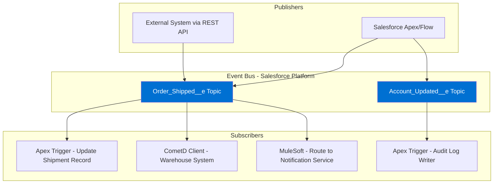
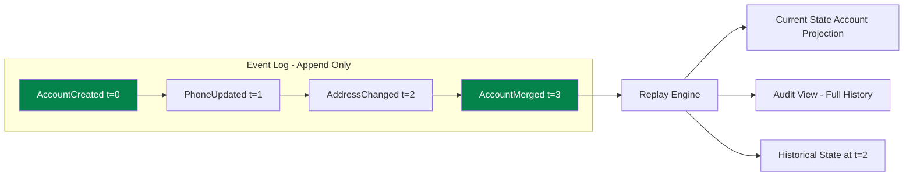

# Event-Driven Architecture

## Exam Domain
**Integration Problem Design — 26% | Integration Architecture Patterns — 22%**
Event-Driven Architecture spans two high-weight domains. Mastering this lecture improves your score across both.

---

## Foundations

### What Is an Event?

An **event** is a record of something that happened. It is a fact — immutable, past-tense, and owned by the publisher. The publisher does not know (or care) who reacts to the event.

"Account was updated" is an event.
"Update the ERP" is a command — it has intent, an implied recipient, and an expectation of execution.
"What is the Account balance?" is a query — it expects a response.

This distinction is the foundation of Event-Driven Architecture (EDA) and is tested on the exam.

### Events vs Commands vs Queries (CQRS Concepts)

| Concept | Description | Direction | Expected Response | Salesforce Example |
|---------|-------------|-----------|-------------------|-------------------|
| Event | Something that happened | Broadcast (no specific target) | None — publisher doesn't wait | OrderClosed__e Platform Event |
| Command | An instruction to do something | Directed (has a specific target) | Optional confirmation | Calling a REST endpoint to create a record |
| Query | A request for information | Point-to-point | Required — data returned | SOQL query, REST GET |

**CQRS (Command Query Responsibility Segregation)** is an architectural pattern that separates:
- **Command side**: writes, state changes, commands and events
- **Query side**: reads, optimized for query performance, may be a denormalized read model

In Salesforce context: CQRS is relevant when you have a high-volume write path (Platform Events, CDC publishing) and a separate optimized read path (Salesforce reporting, Analytics). The write and read models can be separate objects optimized for their respective purposes.

**Why this matters for the exam:** Questions about "an external system needs to react to Salesforce data changes without being tightly coupled to Salesforce" → events. Questions about "an external system needs to execute an operation in Salesforce" → commands (API call). Questions about "an external system needs to read Salesforce data" → queries (REST API GET / SOQL).

---

## Event Streaming vs Event Messaging

These terms are often confused. Understanding the distinction is critical for the exam.

### Event Messaging

- Messages are **directed** from producer to specific consumer(s)
- Messages are typically **consumed once** (point-to-point queue)
- After a consumer reads a message, it's usually removed from the queue
- Designed for work distribution (task queues)
- Examples: AWS SQS, RabbitMQ (in queue mode), Salesforce Queueable jobs

Use event messaging when:
- You have a specific consumer that must process each message exactly once
- You want to distribute work across multiple consumer instances (competing consumers)
- Order processing, task assignment, job scheduling

### Event Streaming

- Events are written to a **durable, ordered log** (the stream)
- Events are **not removed after consumption** — multiple consumers read independently
- Each consumer maintains its own position (offset/cursor) in the stream
- The stream is the system of record for what happened
- Examples: Apache Kafka, AWS Kinesis, Azure Event Hubs, Salesforce Platform Events (with replay)

Use event streaming when:
- Multiple independent systems need to react to the same event
- You need to replay past events (new subscriber catches up, error recovery)
- Event sourcing (the stream IS the data)
- Audit trail requirements

**Salesforce Platform Events are a hybrid:** They have 72-hour replay capability (streaming characteristic) but are also consumed in a pub/sub pattern (messaging characteristic).

---

## Event Sourcing Pattern

### What Is Event Sourcing?

In traditional systems, the current state of a record is stored (e.g., Account.Balance = 1500). In event sourcing, instead of storing current state, you store the **sequence of events that produced that state**.

```
Event 1: AccountCreated { balance: 0 }
Event 2: DepositMade { amount: 1000 }
Event 3: DepositMade { amount: 500 }
Event 4: WithdrawalMade { amount: -200 }
```
Current balance: 0 + 1000 + 500 - 200 = 1300

The event log is the source of truth. The current state is derived from replaying events.

### Benefits of Event Sourcing

- **Complete audit trail**: every state change is recorded, who did it, when
- **Temporal queries**: "What was the account balance 30 days ago?" — replay to that point
- **Replay**: rebuild derived state after bugs, add new derived views
- **Debugging**: reproduce any past state exactly

### Event Sourcing in Salesforce Context

Salesforce does not natively implement event sourcing for its core data model. However:
- **Change Data Capture (CDC)** gives a 3-day replay window of change events — this is event sourcing-adjacent
- **Platform Events** can be used to implement event sourcing patterns where the Platform Event log is the source of truth
- **Field History Tracking** and **Audit Trail** are lighter-weight versions of this concept
- For true event sourcing, an external event log (Kafka, EventBridge) is the right tool; Salesforce publishes to it

---

## Pub/Sub Model Deep Dive

### Core Components

**Publisher (Producer):** Generates events and publishes them to a topic. Does not know who the subscribers are.

**Topic (Channel):** Named category of events. Publishers write to topics; subscribers read from topics. Think of it as a TV channel — you publish to "channel 5"; anyone tuned to "channel 5" receives your broadcast.

**Subscriber (Consumer):** Expresses interest in a topic and receives events matching that subscription. Multiple subscribers can subscribe to the same topic independently.

**Message Broker:** The infrastructure that manages topics, stores events, and delivers them to subscribers. Decouples producers from consumers.

### Salesforce Pub/Sub Components

**Platform Events:**
- Custom events defined in Salesforce (like custom objects)
- Publisher: Apex, Flow, Process Builder, REST API
- Subscriber: Apex triggers (on the Platform Event object), CometD clients (external), Flow
- Topic: the Platform Event type (e.g., `Order_Shipped__e`)
- Retention: 72 hours (high-volume), 24 hours (standard)
- Replay: Yes — subscribers can request events from a specific replayId

**Change Data Capture (CDC):**
- Salesforce automatically publishes change events when records are created, updated, deleted, or undeleted
- Publisher: Salesforce platform itself (no code required)
- Subscriber: Apex triggers (on ChangeEvent objects), external CometD clients
- Topic: per-object change event channels (e.g., `/data/AccountChangeEvent`)
- Retention: 72 hours
- Contains: full changed fields, header with operation type (CREATE, UPDATE, DELETE, UNDELETE)

**Streaming API (Push Topics) — Legacy:**
- Allows external clients to subscribe to SOQL-based notifications
- Results from a SOQL query are pushed when records match
- Being superseded by Platform Events and CDC
- Retention: 24 hours
- Know for the exam as the legacy option — do not recommend for new implementations

### Subscription Models

**Fan-out:** One publisher, many subscribers. Each subscriber receives every event independently.

**Competing consumers:** Multiple instances of the same consumer type share the load. Each event is processed by exactly one consumer instance. Used for load balancing (e.g., multiple workers consuming from a task queue).

**Content-based subscription:** Subscribers filter events by content (e.g., only receive events where `region = 'EMEA'`). Reduces the event volume each subscriber must process.

---

## Eventual Consistency and What It Means for Salesforce

### Definition

In an eventually consistent system, when no new updates are made to a piece of data, eventually all nodes that store that data will converge to the same value. There is a window of time during which different systems may have different views of the same data.

### Why This Matters

In synchronous (ACID) systems: after a transaction commits, everyone sees the same data immediately. Consistent.

In event-driven systems: Salesforce publishes an event. The ERP subscriber processes it 2 seconds later. For those 2 seconds, Salesforce has the new data and the ERP has the old data. This is the eventual consistency window.

### Designing for Eventual Consistency in Salesforce

**Pattern 1: Idempotent Event Handlers**
Events may be delivered more than once (at-least-once delivery). Handlers must be idempotent — processing the same event twice must not cause incorrect state.

Implementation: Before processing an event, check if it has already been processed. Use a processed event log table or check for the existence of the record with the expected External ID.

**Pattern 2: Versioned Events**
Include a version number or timestamp in each event. If an older event arrives after a newer one (out-of-order delivery), discard the older event.

**Pattern 3: Saga Pattern for Distributed Transactions**
When a business transaction spans multiple services (Salesforce + ERP + payment system), use a saga: a sequence of local transactions, each publishing events for the next step. If any step fails, compensating events roll back prior steps.

**Pattern 4: Conflict Resolution**
When two systems update the same data concurrently, define conflict resolution:
- Last-Write-Wins (simple, loses data)
- Timestamp-based (keep the most recent update)
- Salesforce-wins or ERP-wins (designate a system of record)
- Merge fields (merge non-conflicting field changes)

---

## Delivery Semantics

### At-Most-Once Delivery

A message is delivered **zero or one** times. If the broker fails before delivery, the message is lost.

- Producer sends message, no acknowledgment required
- No persistence — if the consumer is unavailable, message is lost
- Lowest latency, highest performance
- Use when: data loss is acceptable (metrics, ephemeral notifications, UI activity streams)

### At-Least-Once Delivery

A message is delivered **one or more** times. If the broker doesn't receive acknowledgment, it retries.

- Producer sends; consumer acknowledges; broker retries on no-ACK
- Messages may be delivered multiple times (if ACK is lost after processing)
- **Consumer must be idempotent** — processing the same message twice must be safe
- Salesforce Platform Events: at-least-once delivery semantics
- Use when: message loss is unacceptable; duplicates are acceptable (and handled)

### Exactly-Once Delivery

A message is delivered **exactly one** time. No duplicates, no losses.

- Technically: exactly-once is a property of the end-to-end system (producer + broker + consumer), not just the broker
- Achieved through: idempotent producers (assign unique message ID) + transactional delivery + idempotent consumers
- High overhead, complex to implement
- Kafka Streams offers exactly-once semantics within the Kafka ecosystem
- **Salesforce does not natively offer exactly-once semantics** — consumers must implement idempotency to achieve the effect

### Exam Summary Table

| Semantic | Loss Risk | Duplicate Risk | Consumer Requirement | Use Case |
|----------|-----------|----------------|---------------------|---------|
| At-most-once | Yes | No | None | Telemetry, ephemeral events |
| At-least-once | No | Yes | Must be idempotent | Salesforce Platform Events, most production systems |
| Exactly-once | No | No | Complex coordination | Financial transactions, critical data sync |

---

## Replay / Rewind Capability

### Why Replay Matters

Consider a new integration consumer going live. Without replay, it only receives events published after it subscribes — it misses everything that happened before. With replay, the consumer can say "give me all events from 48 hours ago" and catch up.

Use cases:
- **New consumer onboarding**: catch up on events since a certain date
- **Error recovery**: a consumer crashed; replay events it missed
- **Testing**: replay production events in a staging environment
- **Audit**: replay events to reconstruct historical state

### Salesforce Replay IDs

Platform Events and CDC use ReplayId values. Each event has a monotonically increasing ReplayId.

When subscribing (CometD or Apex trigger), you can set the `replayId` to:
- `-1`: Receive only new events published after subscribing (default)
- `-2`: Replay all retained events (back to 72 hours), then continue with new events
- `{specific replayId}`: Replay from a specific event and forward

**Exam point:** The 72-hour replay window is the key number. If a consumer was unavailable for more than 72 hours, it CANNOT replay the missed events — they are gone. Design consumers with this in mind (monitoring, alerting on consumer downtime).

---

## Event Schema Evolution and Backward Compatibility

### The Problem

Events carry a schema (which fields are present, what types they have). When the schema changes, subscribers that were built against the old schema may break.

### Breaking vs Non-Breaking Schema Changes

| Change Type | Breaking? | Notes |
|-------------|-----------|-------|
| Add optional field | Non-breaking | Old consumers ignore the new field |
| Add required field | Breaking | Old producers don't set it; consumers expecting it fail |
| Remove field | Breaking | Consumers relying on it fail |
| Change field type (e.g., string → number) | Breaking | Deserialization fails |
| Rename field | Breaking | Old consumers look for old name |
| Change field semantics (same name, different meaning) | Breaking (subtle) | Logical break even if structure is valid |

### Schema Evolution Strategies

**Forward Compatibility:** New schema can be read by old consumers. Achieved by: only adding optional fields; never removing required fields; never changing field types.

**Backward Compatibility:** Old schema can be read by new consumers. Achieved by: new consumers handle missing optional fields gracefully (default values).

**Full Compatibility:** Both forward and backward. Most restrictive — only add optional fields, never change or remove.

**Schema Registry:** A centralized service that manages event schemas and enforces compatibility rules. Confluent Schema Registry (for Kafka) is the canonical example. Salesforce Platform Events provide schema versioning implicitly through the API version.

### Salesforce-Specific: Platform Event Schema Changes

- Adding a custom field to a Platform Event is a non-breaking change
- Removing or renaming a field breaks existing subscribers
- Platform Event API version is tied to the Salesforce API version
- Use API versioning when consuming Platform Events from external systems

---

## Ordering Guarantees

### Why Ordering Matters

If "AccountUpdated" events can arrive out of order, a subscriber processing them sequentially might overwrite a newer update with an older one.

### Ordering in Salesforce Platform Events

- Platform Events are delivered in order **within a single partition**
- High-volume events: ordering is NOT guaranteed across partitions
- Standard events: ordering is maintained per channel
- **ReplayId increases monotonically**: consumers can detect out-of-order delivery by comparing ReplayIds

### Design Pattern for Ordered Processing

If strict ordering is required:
1. Include a sequence number or timestamp in the event payload
2. Consumer checks: "is this the next expected event in sequence?"
3. If yes: process. If no: buffer until the expected event arrives (or set a timeout)
4. This is the "sequencer" or "resequencer" integration pattern

---

## Salesforce-Specific: Platform Events, CDC, and Streaming API

### Platform Events

**What they are:** Custom-defined event objects in Salesforce. Created like custom objects with custom fields. Published and consumed via Apex, Flow, or external CometD subscribers.

**Publishing:**
- Apex: `EventBus.publish(new Order_Shipped__e(OrderId__c='001...', Status__c='Shipped'))`
- Flow: Publish Platform Event action
- REST API: POST to `/services/data/v58.0/sobjects/Order_Shipped__e/`

**Consuming in Apex:**
```apex
trigger OrderShippedHandler on Order_Shipped__e (after insert) {
    for (Order_Shipped__e event : Trigger.new) {
        // process event
    }
}
```

**Transactional publish:** By default, events published in Apex are only committed to the event bus if the surrounding transaction commits. Use `EventBus.publish()` in a try-catch; the event is NOT published if the DML rolls back. For publish-regardless-of-transaction behavior, use `publishImmediately` flag (available in API v54.0+).

**Limits:**
- 250,000 event notifications/day (base org, can be purchased)
- 72-hour retention for high-volume; 24-hour for standard
- Max payload size: 1 MB per event

### Change Data Capture (CDC)

**What it is:** Salesforce automatically generates and publishes change events whenever records are created, updated, deleted, or undeleted. No code required to publish.

**Enable CDC:** Setup → Change Data Capture → select objects to track

**Change event structure:**
- `ChangeEventHeader`: metadata (entityName, changeType, changedFields, recordIds, transactionKey, sequenceNumber)
- Changed fields: only the fields that changed are included (not all fields — important!)
- `changeType`: CREATE, UPDATE, DELETE, UNDELETE

**Key CDC facts:**
- Only changed fields are in the payload — consumers must handle partial updates
- Up to 5 million change event delivery notifications/24 hours (base)
- External-facing — external systems can subscribe via CometD or Pub/Sub API
- The Pub/Sub API (gRPC-based, available in API v54+) is the modern way to consume CDC and Platform Events from external systems — more efficient than CometD

### Streaming API (Push Topics) — Legacy

**What it is:** Allows external clients to subscribe to record changes based on a SOQL query. If a record matches the query after a DML operation, an event is pushed.

**PushTopic creation:**
```apex
PushTopic pushTopic = new PushTopic();
pushTopic.Name = 'AccountUpdates';
pushTopic.Query = 'SELECT Id, Name FROM Account';
pushTopic.ApiVersion = 58.0;
pushTopic.NotifyForOperationCreate = true;
pushTopic.NotifyForOperationUpdate = true;
insert pushTopic;
```

**Key differences from Platform Events/CDC:**

| Feature | Streaming API (Push Topics) | Platform Events | CDC |
|---------|----|----|---|
| Triggered by | SOQL query match | Apex/Flow publish | Any DML on enabled objects |
| Retention | 24 hours | 72 hours (high-vol) | 72 hours |
| Custom payload | No (SObject fields only) | Yes (custom fields) | No (change data only) |
| External publisher | No | Yes | No |
| Status | Legacy — avoid for new | Recommended | Recommended |

---

## Architecture Diagrams

### Pub/Sub Topology



### Event Sourcing Flow



### Delivery Semantics Comparison

```mermaid
flowchart TD
    subgraph "At-Most-Once"
        AMO_P[Producer] --> |fire-and-forget| AMO_B[Broker]
        AMO_B --> |no retry| AMO_C[Consumer]
        AMO_B -. lost if broker fails .-> VOID1[Event Lost]
    end

    subgraph "At-Least-Once - Salesforce Default"
        ALO_P[Producer] --> |publish + persist| ALO_B[Broker]
        ALO_B --> |deliver + retry on no-ACK| ALO_C[Consumer]
        ALO_C --> |must be idempotent| ALO_OK[Processed safely]
        ALO_B --> |retry on timeout| ALO_C
    end

    subgraph "Exactly-Once"
        EO_P[Producer with unique messageId] --> EO_B[Broker with dedup]
        EO_B --> |transactional deliver| EO_C[Idempotent Consumer]
        EO_C --> |mark processed| EO_LOG[Processed ID Log]
    end

    style ALO_B fill:#0070d2,color:#fff
    style EO_B fill:#04844b,color:#fff
```



---

## PTA / SA Relevance

### When This Comes Up in Engagements

**"We need to know when a Salesforce record changes so we can update our system"**
This is CDC. Enable CDC for the relevant object, subscribe via Pub/Sub API or CometD. No code required on the Salesforce side. Critical discovery: do they need immediate notification (CDC) or can they poll (batch)?

**"We want Salesforce to notify our system when an Order is closed"**
This is Platform Events. Create an Order_Closed__e Platform Event. Publish from a trigger or Flow on Order stage change. The external system subscribes via CometD or Pub/Sub API.

**"Our integration misses events when our consumer service is restarted"**
This is the replay gap problem. The consumer must persist its last processed ReplayId before shutting down. On restart, it subscribes from that ReplayId. If it was down for more than 72 hours, events are lost — this is an architecture risk that must be communicated.

**"We keep getting duplicate records from the Platform Event subscriber"**
At-least-once delivery semantics. The subscriber must implement idempotency. Check if the record already exists (External ID) before creating it.

### Common Architecture Failures

**Failure 1: Commands disguised as events**
Team publishes a Platform Event called `CreateInvoiceInERP__e`. This is a command, not an event. If the ERP subscriber fails, the command is never executed — but Salesforce thinks it was "published" successfully. Events should be facts: `OrderClosed__e`. The ERP subscriber decides to create an invoice as a reaction.

**Failure 2: No ReplayId persistence**
External consumer subscribes to Platform Events with replayId=-1. Consumer service restarts frequently. Every restart means missed events. Fix: persist the last processed ReplayId in a durable store (database, Redis).

**Failure 3: Synchronous processing in Platform Event trigger**
Platform Event Apex trigger makes synchronous callouts or performs heavy processing. Platform Event triggers run in a system context with their own governor limits. Callouts from Platform Event triggers require special handling. Fix: use Queueable Apex from within the Platform Event trigger.

**Failure 4: No monitoring on event consumer lag**
Events accumulate on the Platform Events bus but the consumer is down or processing slowly. No alert fires. Business discovers hours later when data is out of sync. Fix: monitor consumer lag (time between event publish and event processing). Alert when lag exceeds SLA.

**Failure 5: Assuming CDC has full record state**
CDC events contain only the changed fields, not the full record. A subscriber that assumes it receives all fields will have null values for unchanged fields. Fix: if full record state is needed, the subscriber must fetch the record from Salesforce after receiving the CDC event.

### Enterprise Patterns

**Large Enterprise Pattern: Kafka as the Event Backbone**
Salesforce publishes Platform Events → MuleSoft connector consumes from Salesforce → MuleSoft publishes to enterprise Kafka cluster → Multiple downstream systems consume from Kafka. The Salesforce event bus is an edge event bus; Kafka is the enterprise backbone.

**Mid-Market Pattern: Direct CometD Subscription**
External application (Node.js, Java) connects directly to Salesforce via CometD and subscribes to Platform Events or CDC channels. Simple, no middleware, but the consumer application must handle reconnection, ReplayId management, and backpressure.

---

## Key Facts to Memorize

- **Event** = immutable fact (past tense); **Command** = directive to do something; **Query** = request for information
- **Platform Events**: 72-hour replay (high-volume), 250,000 delivery/day base allocation, published transactionally
- **CDC (Change Data Capture)**: Salesforce auto-publishes change events; only changed fields in payload; 72-hour retention
- **Streaming API (Push Topics)**: Legacy; 24-hour retention; avoid for new implementations
- **Pub/Sub API**: gRPC-based; modern way to consume Platform Events and CDC from external systems (API v54+)
- **ReplayId = -1**: only new events; **ReplayId = -2**: replay all retained events then continue
- **At-least-once delivery** = Salesforce Platform Event semantics → consumers MUST be idempotent
- **Exactly-once** = not natively provided by Salesforce; requires application-level idempotency
- **CDC payload**: contains only changed fields, NOT all fields — consumers must handle partial updates
- **Transactional publish**: Platform Event published in Apex is NOT committed if the DML transaction rolls back
- **PublishImmediately**: flag to publish event regardless of transaction outcome (API v54+)
- **Event sourcing** = store events, derive state by replaying — Salesforce CDC is event sourcing-adjacent
- **Eventual consistency** = the normal state in event-driven systems; design consumers accordingly
- **72-hour window**: if consumer is down > 72 hours, events are permanently lost — architect for this

---

## Exam Traps

**Trap 1: Platform Events are published immediately when the Apex code runs**
Wrong. Platform Events published via `EventBus.publish()` are committed to the event bus only when the surrounding transaction commits. If the transaction rolls back, the event is NOT published. Use `publishImmediately` if you need the event regardless of transaction outcome.

**Trap 2: CDC delivers the full record in each event**
Wrong. CDC delivers only the changed fields plus header metadata. If you need the full record, you must query Salesforce after receiving the event. This is a common exam trap that catches developers who assume CDC is like a full record snapshot.

**Trap 3: Streaming API and Platform Events are interchangeable**
They are different. Streaming API (Push Topics) is query-based (SOQL defines what you receive) and has 24-hour retention. Platform Events are schema-based (custom event types) with 72-hour retention. Platform Events are the recommended approach for new implementations.

**Trap 4: ReplayId = -1 means replay all events**
Wrong. ReplayId = -1 means receive only new events. ReplayId = -2 means replay all retained events then continue with new events.

**Trap 5: At-least-once delivery means messages can be lost**
Wrong. At-least-once means messages are guaranteed to be delivered at least one time — but may be delivered more than once. Messages can be lost with AT-MOST-ONCE delivery.

**Trap 6: Platform Events can be used for exactly-once processing natively**
Wrong. Platform Events provide at-least-once delivery. To achieve exactly-once processing semantics, your consumer must implement idempotency (check if you've already processed this event using the replayId or a business key).

---

## Practice Questions

**Q1.** A Salesforce org needs to notify an external warehouse management system (WMS) whenever an Order record's status changes to "Shipped." The WMS team will consume the notification via CometD. The solution must survive brief WMS downtime (up to 48 hours) without losing notifications. Which Salesforce feature is most appropriate?

A) Streaming API with a PushTopic on Order status
B) Apex trigger making a synchronous REST callout to the WMS
C) High-volume Platform Events published by an Apex trigger on Order status change
D) Outbound Messages with SOAP delivery to the WMS endpoint

**Correct Answer: C**
*Explanation: High-volume Platform Events have a 72-hour replay window, so the WMS can reconnect after 48 hours of downtime and replay missed events using the ReplayId. Option A (Streaming API Push Topics) only has a 24-hour retention window — 48 hours of downtime would lose events. Option B is synchronous and would fail if the WMS is unavailable. Option D (Outbound Messages) is legacy SOAP and has limited retry capabilities — it does not provide a 72-hour replay window.*

---

**Q2.** An Apex Platform Event trigger subscriber for the `Order_Shipped__e` event is creating duplicate shipment records in Salesforce. The investigation reveals that some events are being delivered and processed twice. What is the root cause and correct fix?

A) The Platform Event trigger fires twice because Platform Events use exactly-once delivery semantics
B) Platform Events use at-least-once delivery semantics; the trigger handler must be made idempotent (check if shipment record already exists before creating)
C) The trigger should be disabled and replaced with a scheduled Apex job that polls for shipped orders
D) The Platform Event must be changed to high-volume type which provides deduplication

**Correct Answer: B**
*Explanation: Platform Events use at-least-once delivery — an event may be delivered more than once (e.g., if the subscriber acknowledgment is lost). The consumer (Apex trigger) must be idempotent. The fix is to check whether the shipment record already exists (using a correlation identifier like the OrderId) before creating a new one. Option A is wrong — Platform Events are at-least-once, not exactly-once. Option D is wrong — high-volume events are about throughput limits, not deduplication.*

---

**Q3.** A team is using Change Data Capture to receive Account updates in an external integration system. After processing an AccountChangeEvent, they try to access the Account's BillingAddress field and find it is null, even though the Account has a billing address in Salesforce. What is the most likely explanation?

A) CDC events do not include custom fields; BillingAddress requires a special CDC configuration
B) The BillingAddress did not change in this particular update — CDC only includes changed fields, not all fields
C) CDC requires the integration user to have Field-Level Security access to BillingAddress
D) BillingAddress is a compound field that requires a separate CDC subscription

**Correct Answer: B**
*Explanation: CDC events contain only the fields that actually changed in the DML operation, plus the ChangeEventHeader. If BillingAddress was not modified in this update, it will not be present in the event payload. This is one of the most important CDC characteristics to understand. The integration consumer must handle partial record state — if it needs the full record, it should query Salesforce after receiving the event using the recordId from the header. Option C might be true but is not the primary reason for the null value; FLS would typically cause a security exception, not a null field.*

---

**Q4.** An enterprise customer is designing an event-driven integration between Salesforce and five downstream systems. They want all five systems to receive the same Account change events. The integration team proposes using one MuleSoft flow that receives a Platform Event and then makes five sequential HTTP calls to the downstream systems. What is the architectural problem with this design?

A) MuleSoft cannot consume Salesforce Platform Events
B) Platform Events only support one subscriber at a time
C) Sequential HTTP calls create a single point of failure and add latency — if one system is unavailable, subsequent calls may be delayed or skipped; use fan-out/parallel delivery pattern
D) Five downstream systems exceed the Platform Event delivery limit

**Correct Answer: C**
*Explanation: Sequential delivery means the total delivery time is the sum of all five call latencies. More critically, if one downstream system is unavailable or slow, it blocks notification to all subsequent systems. The correct pattern is fan-out: either five separate MuleSoft flows subscribing to the same Platform Event topic (true pub/sub), or a single MuleSoft flow that makes five parallel (scatter) calls. Option B is wrong — Platform Events support multiple independent subscribers.*

---

**Q5.** A company enables Change Data Capture for the Opportunity object. A developer wants to replay all Opportunity change events from the past 60 hours in their external consumer application. What is the correct approach?

A) Set the replayId to -2 when subscribing; this replays all retained events (up to 72 hours)
B) Set the replayId to -1; this replays all events from the beginning of time
C) Query the Salesforce OpportunityChangeEvent object via SOQL to retrieve past events
D) CDC events cannot be replayed; only Platform Events support replay functionality

**Correct Answer: A**
*Explanation: ReplayId = -2 instructs the Platform Events/CDC infrastructure to deliver all retained events (up to 72 hours back) before delivering new events. Since 60 hours is within the 72-hour window, this will successfully deliver the missed events. ReplayId = -1 (Option B) only delivers NEW events — nothing historical. Option C is wrong — you cannot query CDC events via SOQL; they are consumed via the streaming channel. Option D is wrong — CDC does support replay with the same 72-hour window as high-volume Platform Events.*

---

*Next: [Lecture 04 — Middleware and ESB Patterns](lecture-04-middleware-esb-patterns.md)*
