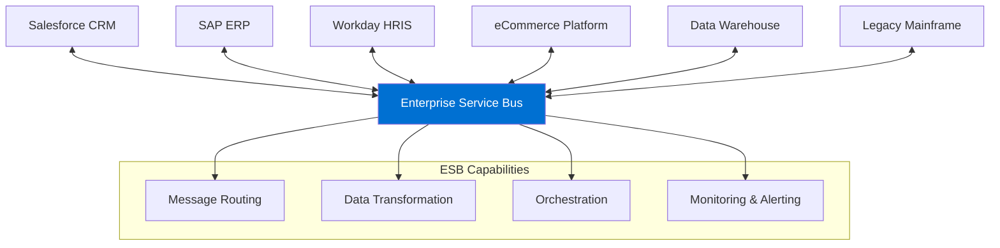
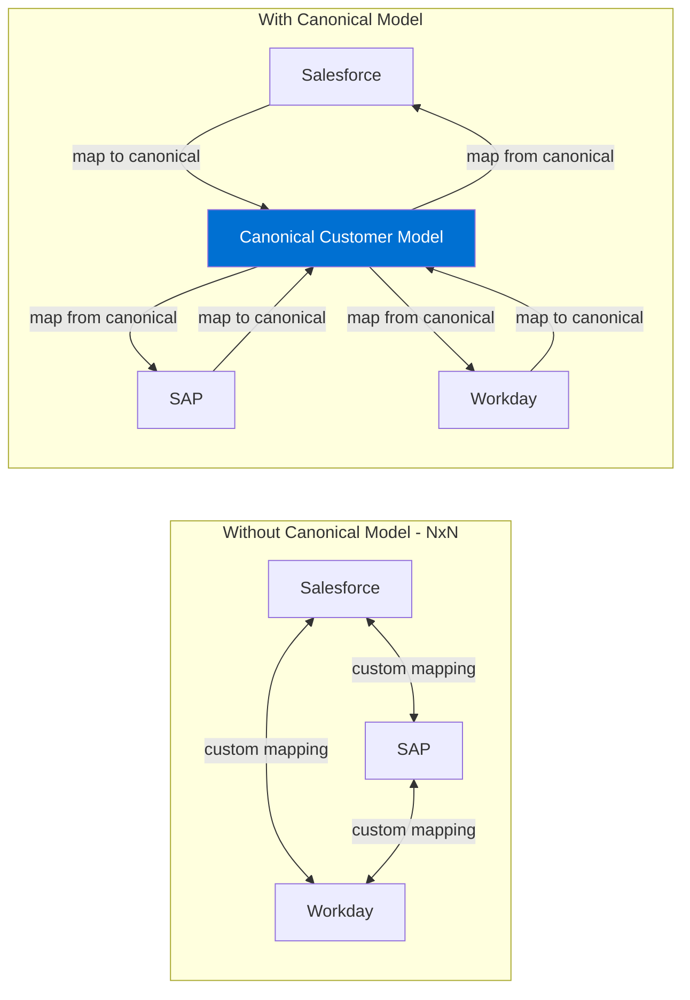
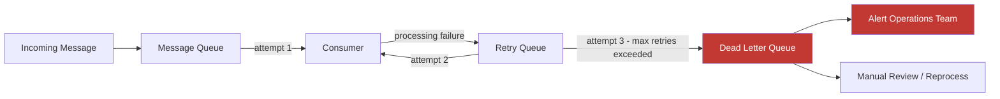
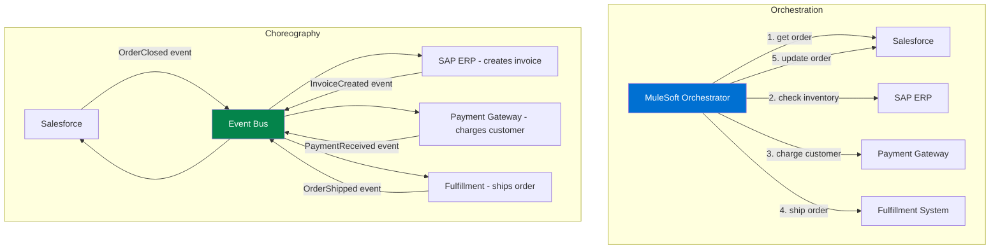
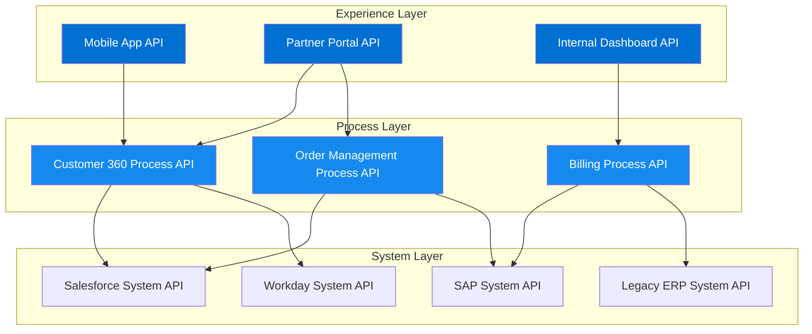
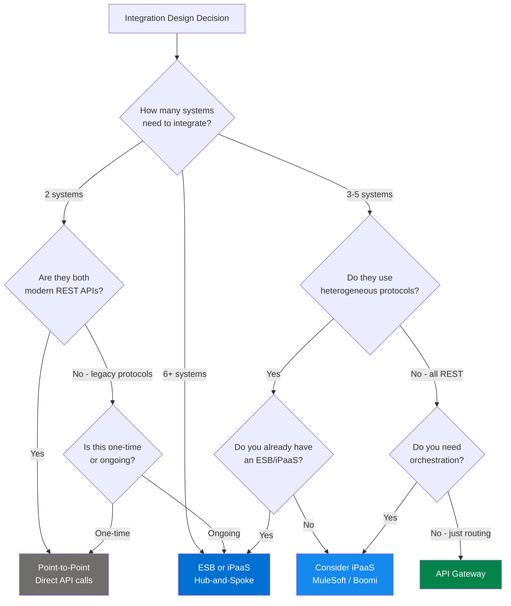

# Middleware and ESB Patterns

## Exam Domain
**Integration Architecture Patterns — 22% of exam weight**
Middleware and ESB knowledge is tested heavily in Domain 3. Expect 4-6 questions drawing from this lecture.

---

## Foundations

### What Is Middleware?

Middleware is software that sits between application systems to facilitate communication, data transformation, and process orchestration. It is the "plumbing" of enterprise integration — invisible when working well, catastrophic when not.

**Why middleware exists:**
1. **Protocol mediation**: System A speaks REST/JSON, System B speaks SOAP/XML, System C speaks JDBC. Middleware translates.
2. **Data transformation**: Customer object in Salesforce has 40 fields; Customer object in ERP has 80 fields with different names and data types. Middleware maps.
3. **Routing**: A payment event needs to go to accounting AND fraud detection AND analytics. Middleware routes.
4. **Decoupling**: Without middleware, System A must know System B's address, protocol, and schema. With middleware, A knows only the middleware's interface. Systems can be replaced without cascading changes.
5. **Resilience**: Middleware can queue messages when a target is unavailable, retry failed deliveries, and provide circuit breakers.
6. **Governance**: Centralized logging, monitoring, SLA enforcement, and rate limiting.

**Middleware does NOT:**
- Own business logic (it should be in the applications)
- Store the system of record for any data (it transforms and routes, it doesn't own)
- Replace a well-designed application API

### The Evolution of Middleware

```
1990s: Point-to-point — direct connections between systems
2000s: EAI (Enterprise Application Integration) — proprietary middleware, message brokers
2005-2015: SOA + ESB (Enterprise Service Bus) — service-oriented architecture
2010s: iPaaS (Integration Platform as a Service) — cloud-hosted middleware (MuleSoft, Boomi)
2020s: API-led connectivity, event mesh, service mesh
```

The CRT-404 exam tests knowledge of ESB, iPaaS, and modern API gateway patterns — all three are still in active use at enterprise Salesforce customers.

---

## Enterprise Service Bus (ESB)

### What Is an ESB?

An Enterprise Service Bus is a middleware architecture pattern that provides a centralized communication backbone for enterprise systems. All systems connect to the bus; the bus handles message routing, transformation, and delivery.

**Core ESB capabilities:**
- **Message routing**: Direct messages to the right destination based on content or header
- **Message transformation**: Convert between data formats (XML to JSON, Salesforce schema to ERP schema)
- **Protocol bridging**: Connect systems using different protocols (REST, SOAP, JMS, FTP)
- **Service orchestration**: Coordinate multi-step business processes
- **Publish/Subscribe**: Support multiple consumers for the same message
- **Error handling**: Dead-letter queues, retry policies, alert on failures
- **Security**: Authentication, authorization, message-level encryption
- **Monitoring**: Centralized logging and metrics across all integrations

### ESB Topology

In a hub-and-spoke ESB topology, all systems connect to the central bus:



### ESB Benefits

**Single integration layer:** Every system has one connection — to the bus. New systems are added by connecting to the bus, not by creating N new point-to-point connections.

**Canonical data model:** The ESB enforces a standard data format. Every system transforms TO the canonical model when sending; every system transforms FROM the canonical model when receiving.

**Centralized governance:** All integration flows are visible, logged, and monitored in one place. Compliance auditing is straightforward.

**Loose coupling:** Systems don't know about each other — only about the bus interface. System B can be replaced entirely without System A knowing.

### ESB Drawbacks

**Single point of failure:** If the ESB is down, no system can communicate with any other system. Requires high-availability ESB configuration (clustering, failover).

**Performance bottleneck:** Every message goes through the ESB. For high-frequency, low-latency scenarios, the ESB adds measurable latency.

**Complexity:** ESB configuration and maintenance requires specialized skills. The ESB becomes a critical piece of infrastructure that needs dedicated operations.

**"God object" anti-pattern:** When business logic creeps into the ESB (because it's convenient), the ESB becomes a maintenance nightmare. Business logic belongs in applications; the ESB should only route and transform.

**Vendor lock-in:** Traditional ESBs (TIBCO, IBM MQ, Oracle SOA Suite) are expensive and proprietary. Migrating away is painful.

### When ESB Is the Right Answer

On the exam: ESB is the right answer when:
- Many (5+) heterogeneous systems need to exchange data
- A canonical data model is required
- Central governance and audit trail are requirements
- The organization already has an ESB team and tooling
- Legacy protocols (JMS, MQ, FTP) are in the mix

ESB is the WRONG answer when:
- Only two systems need to integrate (point-to-point is simpler)
- Low latency is critical and the ESB adds unacceptable overhead
- The team has no ESB expertise
- All systems are cloud/REST native (API gateway is more appropriate)

---

## Message Transformation

### Canonical Data Model

The canonical data model (CDM) is a shared, neutral data format that all systems transform to/from. Instead of each system knowing how to transform to every other system's format, each system transforms to/from the canonical model only.

**Without canonical model:** N systems = N×(N-1) transformation mappings
**With canonical model:** N systems = N×2 transformation mappings (in and out of canonical)

For Salesforce integrations: the canonical model typically lives in the middleware layer, not in Salesforce or the ERP. The Salesforce Account may have 50 fields; the ERP has 80; the canonical Customer model has 30 — the intersection of what all systems actually exchange.



### Transformation Types

**Data format transformation:** Convert between JSON, XML, CSV, EDI, binary formats.

**Schema transformation (mapping):** Map field names and structures between systems. `Account.Name` (Salesforce) → `Organization.LegalName` (ERP). Many-to-one, one-to-many, conditional mappings.

**Data enrichment:** Add data to a message from a lookup (e.g., add the customer tier from a reference table based on the CustomerId in the incoming message).

**Data validation:** Apply business rules to message content. Reject or quarantine messages that fail validation before they reach the target.

**Data aggregation:** Combine multiple messages into one (collect 100 individual order items and combine into one batch message).

**Data splitting:** Split one message into multiple (receive one batch file, split into individual records for processing).

---

## Message Routing Patterns

### Content-Based Router

Routes a message to different destinations based on the message content (fields, values, payload characteristics).

**Example:** An Order message with `priority = 'URGENT'` is routed to the high-priority processing queue; other orders go to the standard queue.

**Salesforce relevance:** Flow decision elements implement content-based routing. MuleSoft Choice Router is the canonical iPaaS implementation.

### Message Filter

Filters out messages that don't meet a criterion. Only messages that pass the filter are forwarded.

**Example:** Subscribe to all AccountChangeEvents but only process events where `Industry = 'Healthcare'`.

**Salesforce relevance:** CDC subscriptions can be filtered. Platform Event triggers can filter by field value before processing.

### Dynamic Router

Routes based on routing tables that can be changed at runtime without redeploying the integration. The routing logic is externalized from the integration flow.

**Example:** A routing table in a database maps product categories to fulfillment centers. Changing the routing doesn't require an integration deployment.

### Recipient List

Sends a message to a predefined list of recipients. Unlike pub/sub (where the broker manages the subscriber list), the recipient list is explicit in the routing logic.

### Dead Letter Queue (DLQ)

Messages that cannot be delivered after N retries are moved to a dead letter queue. Operations teams review DLQ messages to diagnose failures and manually reprocess or discard them.

**Critical pattern for the exam:** Every production message queue should have a DLQ. Failing to implement a DLQ means failed messages are silently lost.



---

## Protocol Mediation

Protocol mediation is the conversion between different transport protocols. The ESB or middleware layer handles this transparently.

**Common protocol mediations for Salesforce:**
- HTTP/REST (Salesforce) ↔ JMS/MQ (legacy ERP)
- HTTP/REST (Salesforce) ↔ SOAP/XML (older enterprise systems)
- HTTP/REST (Salesforce) ↔ FTP/SFTP (file-based legacy systems)
- HTTP/REST (Salesforce) ↔ JDBC (direct database integration — use cautiously)

**Why protocol mediation matters on the exam:** When a legacy system only speaks SOAP and you're asked how Salesforce integrates with it, the answer is NOT "rewrite the legacy system to REST." The answer is protocol mediation via MuleSoft or an ESB that bridges SOAP to REST.

---

## Service Orchestration vs Choreography

This is one of the most conceptually important distinctions in integration architecture. Both solve the "multi-system process" problem differently.

### Orchestration

A central orchestrator coordinates the steps of a business process. The orchestrator knows the sequence, calls each service in order, and handles failures.

**Analogy:** A conductor directing an orchestra. The conductor knows the score; musicians follow the conductor's direction.

**Characteristics:**
- Centralized control: one process knows the entire workflow
- Easy to understand and debug: one place to look for the process logic
- Single point of failure: if the orchestrator fails, the process stops
- Tight coupling to the orchestrator: changing the process requires changing the orchestrator

**Salesforce example:**
- MuleSoft orchestration flow: call Salesforce to get order → call ERP to check inventory → call payment gateway to charge → call fulfillment system to ship → update Salesforce with result
- Salesforce Flow calling multiple external services in sequence

### Choreography

Each service knows what to do when it receives an event. There is no central coordinator — the process emerges from each service reacting to events.

**Analogy:** A flash mob. Everyone knows their role; they react to each other's movements without a central director.

**Characteristics:**
- Decentralized control: each service is autonomous
- More resilient: no single point of failure for process control
- Harder to understand and debug: the process is distributed across services
- Loose coupling: services don't know about each other; only about events

**Salesforce example:**
1. Salesforce publishes `Order_Closed__e` event
2. ERP subscribes, creates an invoice, publishes `Invoice_Created__e`
3. Payment system subscribes to `Invoice_Created__e`, charges the customer, publishes `Payment_Received__e`
4. Fulfillment subscribes to `Payment_Received__e`, ships the order, publishes `Order_Shipped__e`
5. Salesforce subscribes to `Order_Shipped__e`, updates the Order record



### Orchestration vs Choreography: When to Use Which

| Factor | Use Orchestration | Use Choreography |
|--------|-------------------|-----------------|
| Process visibility required | Yes | Harder to achieve |
| Services are owned by same team | Yes | Works either way |
| Services are owned by different teams | Harder | Yes — autonomy |
| Process changes frequently | Costly (change orchestrator) | Cheaper (add/remove subscribers) |
| Error handling clarity | Easy (centralized) | Hard (distributed) |
| Number of steps | Few (2-5) | Many (5+) works well |
| Salesforce as orchestrator | Possible via Flow/Apex | Natural with Platform Events |

**Exam answer key:** When the question describes a process with a clear sequence of steps and one team controls all systems → orchestration. When the question describes loosely coupled autonomous services reacting to events → choreography.

---

## iPaaS: Integration Platform as a Service

### What Is iPaaS?

iPaaS is a cloud-hosted integration platform that provides middleware capabilities as a managed service. Instead of deploying and managing ESB software on-premises, you configure integration flows in a cloud platform.

**Key iPaaS players relevant to Salesforce:**
- **MuleSoft Anypoint Platform** — owned by Salesforce; deeply integrated
- **Dell Boomi** — strong in SMB/mid-market
- **Informatica Intelligent Cloud Services (IICS)** — strong in data integration/ETL
- **Jitterbit** — popular in mid-market Salesforce implementations
- **Celigo** — native Salesforce integrations
- **MakeWith / Workato** — lighter-weight automation

### MuleSoft Architecture for Salesforce

MuleSoft Anypoint Platform consists of:
- **Anypoint Studio**: IDE for building integration flows
- **Anypoint Platform**: Cloud management, monitoring, API lifecycle management
- **CloudHub**: MuleSoft's cloud runtime (where flows are deployed)
- **Runtime Fabric**: MuleSoft runtime deployed on customer's infrastructure
- **Anypoint MQ**: MuleSoft's managed message queue service
- **Anypoint Connectors**: Pre-built connectors for Salesforce, SAP, Workday, etc.

**MuleSoft's API-led connectivity model:**
- **System APIs**: Expose raw system data (Salesforce API, SAP API, Workday API)
- **Process APIs**: Implement business logic, orchestration, transformation
- **Experience APIs**: Tailored APIs for specific consumer experiences (mobile app, partner portal, internal tooling)



---

## API Gateway Pattern

### What Is an API Gateway?

An API gateway is a server that acts as the single entry point for API consumers. All API calls go through the gateway before reaching the backend services.

**API Gateway responsibilities:**
- **Authentication/authorization**: Validate OAuth tokens, API keys
- **Rate limiting**: Prevent abuse; enforce quotas per client
- **Request routing**: Route to appropriate backend service
- **Load balancing**: Distribute traffic across multiple service instances
- **SSL termination**: Decrypt HTTPS at the gateway; backend traffic may be HTTP
- **Request/response transformation**: Add headers, transform payloads
- **Caching**: Cache common responses to reduce backend load
- **Logging and analytics**: Centralized request logging for all APIs
- **Circuit breaker**: Fail fast if backend is unhealthy; protect backend from overload

### API Gateway vs ESB

| Dimension | API Gateway | ESB |
|-----------|-------------|-----|
| Primary purpose | API management and security | Message routing and transformation |
| Protocol focus | HTTP/REST/GraphQL | Any protocol (HTTP, SOAP, JMS, FTP) |
| Transformation | Light (headers, basic payload) | Heavy (schema mapping, format conversion) |
| Orchestration | No (or minimal) | Yes — multi-step process flows |
| Real-time focus | Yes | Batch and real-time |
| Modern use case | Microservices, APIs | Legacy and heterogeneous integration |
| Salesforce context | Protecting REST APIs exposed to partners | Integrating Salesforce with legacy ERP/mainframe |

**Common exam question:** "What is the role of an API gateway vs a middleware ESB?" The answer distinguishes security/management (gateway) from transformation/routing/orchestration (ESB).

### API Gateway in Salesforce Context

When external partners call Salesforce APIs:
1. Partner sends request to API Gateway (MuleSoft API Manager, Apigee, Kong, AWS API Gateway)
2. Gateway validates OAuth token (may call Salesforce Authorization Server)
3. Gateway applies rate limiting, logging, request transformation
4. Gateway forwards authenticated request to Salesforce REST API
5. Salesforce returns response; Gateway transforms and returns to partner

Salesforce itself has no built-in API gateway for inbound calls from external systems. The gateway is typically provided by MuleSoft, Apigee, or cloud provider tools.

---

## Service Mesh Concepts

### What Is a Service Mesh?

A service mesh is a dedicated infrastructure layer for managing service-to-service communication in microservices architectures. Unlike an ESB (where integration logic is in the ESB), a service mesh pushes communication logic into sidecar proxies deployed alongside each service.

**Service mesh capabilities:**
- **Mutual TLS (mTLS)**: Encrypt all service-to-service communication
- **Service discovery**: Services find each other without hardcoded addresses
- **Load balancing**: Intelligent traffic distribution
- **Circuit breaking**: Automatic failure isolation
- **Observability**: Distributed tracing, metrics, logs across all services
- **Traffic management**: Canary deployments, A/B testing, traffic shifting

**Key service mesh technologies:** Istio, Linkerd, AWS App Mesh

### Service Mesh vs ESB for Salesforce

Service mesh is relevant when:
- The customer is running a microservices architecture (Kubernetes-based)
- Salesforce is one of many services in the mesh
- The concern is service-to-service security and observability within their own infrastructure

**Exam relevance:** Service mesh is a lower-level concept than most CRT-404 questions test. Know that it exists, know it's for microservices (not traditional enterprise integration), and know it is NOT an ESB replacement for Salesforce integration scenarios.

---

## Point-to-Point vs ESB vs API Gateway: Decision Framework



---

## PTA / SA Relevance

### When This Comes Up in Engagements

**"We have MuleSoft — how should Salesforce connect to it?"**
Salesforce is a node on the MuleSoft bus. Salesforce publishes Platform Events or CDC that MuleSoft consumes. MuleSoft calls Salesforce REST API for data reads and updates. Named Credentials in Salesforce manage the OAuth token for outbound MuleSoft → Salesforce calls.

**"Do we need MuleSoft if we only have Salesforce and SAP?"**
Not necessarily. Two-system integration can be done with Apex callouts (SOAP or REST) directly from Salesforce to SAP (or SAP to Salesforce via REST API). MuleSoft adds value at 3+ systems, complex transformations, or when the organization needs centralized governance.

**"The ESB team says we need to route everything through them"**
This is an organizational pattern, not just technical. Understand why: is it governance? Security? Canonical data model enforcement? Or is it bureaucracy? The architectural recommendation depends on the actual requirements — not all integrations need the ESB.

**"Our orchestration flows are getting complex in Salesforce Flow"**
Complex multi-step orchestrations that call multiple external systems are better handled in MuleSoft Process APIs than in Salesforce Flow. Flow is excellent for Salesforce-internal processes; external orchestration belongs in the integration layer.

### Common Architecture Failures

**Failure 1: Smart pipes, dumb endpoints**
Business logic is placed in the ESB/iPaaS (transformation rules, business decisions) because it's convenient. Over time, the ESB becomes the only place that understands the business rules. Nobody remembers why a transformation exists. The ESB becomes unmaintainable. Fix: keep the ESB focused on routing, transformation, and protocol mediation; business logic belongs in applications.

**Failure 2: ESB for two-system integration**
A team deploys a full ESB to connect Salesforce and one other system because "we might add more systems later." The ESB adds cost, complexity, and operational overhead for no current benefit. Fix: point-to-point for two systems; add ESB when the third system arrives.

**Failure 3: No canonical data model**
An iPaaS is deployed but each integration flow has custom field mappings. System A to Salesforce: custom mapping. System B to Salesforce: different custom mapping. When a Salesforce field changes, 12 mappings must be updated. Fix: define a canonical customer/order/product model before writing the first integration flow.

**Failure 4: Choreography without event ordering guarantees**
A multi-step business process is implemented as pure choreography. Events occasionally arrive out of order. An `OrderShipped` event arrives before the `PaymentReceived` event it depends on. Process breaks silently. Fix: implement a process state machine (saga pattern) that tracks which events have arrived for each transaction, or use orchestration for tightly coupled sequential processes.

**Failure 5: API gateway doing ESB work**
The team uses an API gateway (Apigee, Kong) and adds complex transformation logic and orchestration flows to it. The gateway becomes slow and hard to maintain. API gateways are optimized for authentication, rate limiting, and routing — not heavy transformation. Fix: move transformation to a proper integration layer (MuleSoft Process API, Lambda, or ESB).

### Enterprise Patterns

**Salesforce in an ESB architecture (enterprise):**
- Salesforce publishes via Platform Events → ESB (TIBCO/IBM MQ) consumes
- ESB transforms to canonical model → routes to ERP, HRIS, data warehouse
- ESB adapters for Salesforce REST API handle inbound updates
- Monitoring: ESB provides end-to-end message tracing across all systems

**Salesforce with MuleSoft (modern enterprise):**
- MuleSoft API-led connectivity: System API for Salesforce, Process APIs for business functions
- Platform Events as the primary Salesforce-to-MuleSoft channel
- Named Credentials in Salesforce for MuleSoft OAuth
- Anypoint API Manager for governance across all Salesforce APIs exposed to partners

**Mid-market with Celigo or Jitterbit:**
- Simpler orchestration needs
- Pre-built Salesforce connectors accelerate implementation
- Less governance but faster time to value
- The exam tests vendor-agnostic patterns, but MuleSoft-specific knowledge is a plus

---

## Key Facts to Memorize

- **ESB** = centralized message bus; hub-and-spoke topology; handles routing, transformation, orchestration, protocol mediation
- **ESB benefits**: loose coupling, canonical model enforcement, centralized governance, protocol bridging
- **ESB drawbacks**: single point of failure, performance bottleneck, requires specialized skills, expensive
- **Canonical Data Model** = neutral shared format; reduces N×(N-1) mappings to N×2
- **Content-Based Router** = routes messages based on content/field values — exam keyword
- **Dead Letter Queue (DLQ)** = messages that exceed retry limit; critical for production message queues
- **Orchestration** = central coordinator calls each service; easy to understand; single point of failure
- **Choreography** = services react to events autonomously; decentralized; harder to debug
- **iPaaS** = cloud-hosted middleware (MuleSoft, Boomi, Informatica)
- **MuleSoft API-led**: System APIs → Process APIs → Experience APIs (3-tier model)
- **API Gateway** = security, rate limiting, routing for REST APIs; NOT transformation/orchestration
- **Service Mesh** = microservices infrastructure (Istio, Linkerd); NOT an ESB alternative for Salesforce integration
- **Protocol mediation** = middleware converts between REST, SOAP, JMS, FTP — key for legacy integration
- **Smart pipes, dumb endpoints** = anti-pattern; business logic in middleware is a failure pattern
- **ESB for 2 systems** = over-engineering; point-to-point is appropriate for two systems

---

## Exam Traps

**Trap 1: ESB is always the right answer for enterprise integration**
Wrong. ESB is right for 5+ heterogeneous systems with governance requirements. For two modern REST systems, point-to-point is appropriate. The exam rewards architectural judgment — not always picking the most complex solution.

**Trap 2: API gateway = ESB**
These are different tools for different problems. API gateway: API security, rate limiting, routing for HTTP/REST. ESB: multi-protocol, heavy transformation, orchestration. Questions about "integrating Salesforce with a legacy mainframe" → ESB or iPaaS. Questions about "securing Salesforce APIs exposed to external partners" → API gateway.

**Trap 3: Orchestration is always better than choreography**
Wrong. Orchestration is simpler to understand but creates tight coupling to the orchestrator. Choreography is looser coupling and more resilient but harder to debug. The exam tests knowing WHEN to use each — not that one is universally superior.

**Trap 4: Canonical data model is optional**
In enterprise integrations with 5+ systems, the canonical data model is what prevents maintenance nightmares. The exam treats it as a best practice (effectively required) for multi-system integrations. If a question describes N systems and asks for the most maintainable approach, canonical data model is almost always part of the answer.

**Trap 5: MuleSoft is only for complex integrations**
MuleSoft's value proposition scales. The API-led connectivity model is applicable even for simple integrations because it enforces good architectural hygiene (separation of system, process, and experience layers).

**Trap 6: Service mesh replaces middleware**
Service mesh operates at the infrastructure layer (between microservices within a Kubernetes cluster). It does not replace ESB or iPaaS for Salesforce-to-enterprise-system integration. These are different layers of the architecture.

---

## Practice Questions

**Q1.** A large financial services enterprise has 12 systems that need to exchange data. The systems use a mix of REST, SOAP, JMS, and FTP protocols. The architecture team needs to minimize the number of integration points and enforce a canonical data model. Which integration architecture is most appropriate?

A) Point-to-point integration between each pair of systems
B) An API gateway for all systems
C) Enterprise Service Bus (ESB) or iPaaS with hub-and-spoke topology and a canonical data model
D) Each system publishes to a Salesforce Platform Event; other systems subscribe

**Correct Answer: C**
*Explanation: 12 systems with mixed protocols is the textbook case for ESB/iPaaS. Point-to-point (A) would require 12×11/2 = 66 integration points. API gateway (B) is for HTTP/REST APIs, not mixed protocols including JMS and FTP. Platform Events (D) is Salesforce-specific and appropriate for Salesforce as one node on the bus, but not as the integration hub for 12 enterprise systems. ESB with canonical data model reduces the N×N problem to N×2 and provides protocol mediation for all the heterogeneous protocols mentioned.*

---

**Q2.** A company is implementing a multi-step order fulfillment process: (1) Salesforce creates the order, (2) SAP allocates inventory, (3) a payment gateway charges the customer, (4) a fulfillment system ships the order, (5) Salesforce is updated with the tracking number. The steps must be executed in sequence, and if step 3 fails, steps 1 and 2 must be compensated (reversed). Which integration pattern best fits this scenario?

A) Choreography using Platform Events between each system
B) Orchestration via a central MuleSoft process flow that coordinates each step and handles compensation
C) Batch synchronization running nightly to align all system states
D) Point-to-point: Salesforce calls SAP, SAP calls the payment gateway, the payment gateway calls the fulfillment system

**Correct Answer: B**
*Explanation: This is a saga/orchestration scenario. The strict sequential dependency (step N depends on step N-1) combined with the compensation requirement (rollback of prior steps on failure) requires a central orchestrator that tracks process state and can invoke compensating transactions. Choreography (A) is difficult to implement compensation in — if step 3 fails, how does the event chain know to reverse steps 1 and 2? Option D (chain of direct calls) creates tight coupling between all systems and has no compensation mechanism. Batch (C) is for data sync, not process orchestration.*

---

**Q3.** An enterprise has deployed an API gateway in front of all Salesforce APIs. External partners authenticate through the gateway. An architect reviews the gateway configuration and finds complex field-level data transformation logic, custom business validation rules, and multi-system orchestration flows implemented in the gateway. What is the primary architectural concern?

A) API gateways cannot perform data transformation; this must be moved to Salesforce Apex
B) The API gateway is performing ESB-level work it is not designed for, creating a "smart pipes" anti-pattern that will become a maintenance and performance problem
C) Business validation rules are not allowed in an API gateway due to security requirements
D) Multi-system orchestration requires a service mesh, not an API gateway

**Correct Answer: B**
*Explanation: API gateways are optimized for authentication, rate limiting, SSL termination, logging, and simple routing. Complex transformation, business validation, and orchestration are ESB/iPaaS responsibilities. Loading this logic into the gateway creates the "smart pipes" anti-pattern: the gateway becomes a bottleneck and maintenance nightmare. The fix is to move business logic to a proper integration layer (MuleSoft Process API, dedicated microservice, or Apex) and keep the gateway focused on API management concerns.*

---

**Q4.** A development team is debating whether to use orchestration or choreography for a business process that spans Salesforce, a warehouse system, and a notification service. The three systems are owned by three different teams. The process flow is simple: when an order ships in the warehouse system, Salesforce should be updated and a customer notification should be sent. Which approach is recommended and why?

A) Orchestration: a central MuleSoft flow controls all three steps because it provides better error handling
B) Choreography: the warehouse system publishes an OrderShipped event; Salesforce subscribes and updates the order; the notification service subscribes and sends the email — this is preferred because three autonomous teams benefit from loose coupling
C) Point-to-point: the warehouse system calls Salesforce REST API and the notification service API directly
D) Batch: all three systems synchronize overnight

**Correct Answer: B**
*Explanation: Three autonomous teams owning three autonomous systems is the ideal choreography scenario. With choreography: the warehouse team only needs to publish one event; the Salesforce team builds their subscriber independently; the notification team builds their subscriber independently. None of the teams depend on each other's schedules or APIs — they only depend on the shared event schema. Option A (orchestration) would require one team to coordinate with all others and creates a dependency. Option C creates direct coupling between the warehouse system and two other systems.*

---

**Q5.** A company is designing a Salesforce integration with their ERP. The ERP team proposes connecting directly to the Salesforce SOAP API using the Enterprise WSDL. The Salesforce team has a MuleSoft instance. An architect evaluates both approaches. Which consideration favors routing through MuleSoft rather than connecting directly to Salesforce?

A) Salesforce SOAP API is deprecated; all integrations must use REST
B) The Enterprise WSDL changes whenever custom fields are added to Salesforce; routing through MuleSoft with a canonical model insulates the ERP from Salesforce schema changes
C) The SOAP API has a 24-hour rate limit that the MuleSoft connector bypasses
D) Direct SOAP connections to Salesforce are not permitted by Salesforce security policy

**Correct Answer: B**
*Explanation: The Enterprise WSDL is org-specific and changes when the Salesforce schema changes. If the ERP is directly coupled to the Enterprise WSDL, every Salesforce schema change potentially breaks the ERP integration. Routing through MuleSoft with a canonical model creates a decoupling layer: the MuleSoft System API adapter handles the Salesforce schema; the ERP talks to a stable MuleSoft interface (canonical model). When Salesforce changes, only the MuleSoft adapter needs updating — the ERP is insulated. Option A is wrong — SOAP API is not deprecated. Option C is wrong — there is no such bypass. Option D is wrong.*

---

*Previous: [Lecture 03 — Event-Driven Architecture](lecture-03-event-driven-architecture.md)*
*Next: [Lecture 05 — Salesforce REST API Deep Dive](../section-02-salesforce-integration/lecture-05-salesforce-rest-api.md)*
