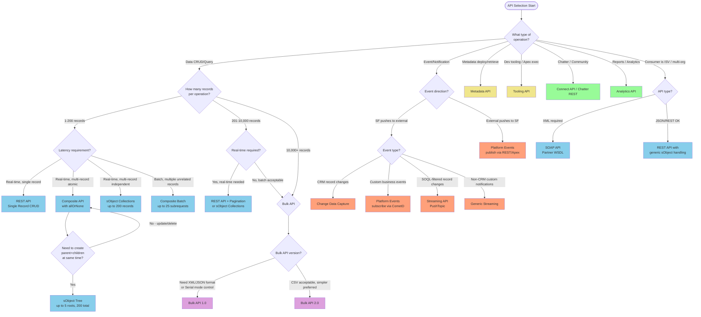

# Salesforce API Types

## Exam Domain
Integration Mechanisms — 24% of exam weight

## Foundations

Salesforce exposes more than a dozen distinct API surfaces. The architect's job is not to memorize every endpoint but to know which API fits which integration context — and why the wrong choice creates operational debt. Every API choice has downstream consequences: governor limits, security posture, operational complexity, and client maintenance burden.

The fundamental question for any integration: **Is data being moved, metadata being moved, or events being moved?** The answer narrows the field immediately.

---

## Core Concepts

### REST API

**What it is:** Salesforce's primary data API. HTTP-based, stateless, resource-oriented. Returns JSON by default (XML supported).

**Base URI pattern:**
```
https://<instance>.salesforce.com/services/data/vXX.0/
```
Current API version is determined by checking:
```
GET /services/data/
```
This returns a list of all supported API versions. Always version your integrations explicitly — never assume "latest."

**Core resource categories:**

| Resource path | Purpose |
|---|---|
| `/sobjects/` | List sObject types |
| `/sobjects/Account/` | Describe Account metadata |
| `/sobjects/Account/{id}` | CRUD on a single record |
| `/query/?q=SOQL` | Execute SOQL query |
| `/queryAll/?q=SOQL` | Query including deleted/archived records |
| `/search/?q=SOSL` | Execute SOSL search |
| `/composite/` | Composite requests (see Lecture 08) |
| `/limits/` | Current org API limits and usage |
| `/sobjects/Account/{id}/Contacts` | Related records |

**HTTP method mapping:**

| Operation | HTTP Method | Notes |
|---|---|---|
| Create | POST | Returns 201 + new record ID |
| Read | GET | Returns 200 |
| Update (full) | PUT | Rarely used in SF |
| Update (partial) | PATCH | Standard update |
| Delete | DELETE | Returns 204 No Content |
| Upsert | PATCH on `/sobjects/SObject/ExternalIdField/Value` | |

**Authentication:** OAuth 2.0 Bearer token in Authorization header:
```
Authorization: Bearer <access_token>
```

**Response format:** JSON by default. Set `Accept: application/xml` for XML. Use `Accept-Encoding: gzip` for compression — critical for large payloads over low-bandwidth connections.

**Governor Limits (REST API) — memorize these:**
- Enterprise Edition: 1,000 API calls per Salesforce license per 24 hours (rolling window)
- Performance/Unlimited: 5,000 API calls per license per 24 hours
- Developer: 15,000 API calls per 24 hours (flat, not per-license)
- Concurrent API request limit: 25 long-running requests (>20 seconds) per org
- Maximum record size via REST: 2,000 records per query page (use `nextRecordsUrl` for pagination)
- SOQL query character limit: 20,000 characters

**Important: The "250 calls/license/day" figure you see in some documentation refers to an older tier. Current Salesforce documentation uses the figures above. Exam questions may present 250 as a distractor — look for the edition context.**

**Query pagination:** REST API returns a `nextRecordsUrl` when result sets exceed 2,000 records. The integration must follow pagination links until `done: true`. This is a common source of integration bugs — failing to paginate results in incomplete data.

**API version strategy:** Salesforce supports previous API versions for 3 years after release. For integrations, the architect should standardize on a version 2-3 releases behind current to avoid edge-case bugs in newly released versions, while keeping a roadmap to upgrade before deprecation.

---

### SOAP API

**What it is:** XML-based API using WSDL contracts. Predates REST API. Still widely used in enterprise integrations, particularly with .NET, Java EE, and SAP middleware.

**Two WSDL types — critical exam distinction:**

**Enterprise WSDL:**
- Org-specific, strongly typed
- One class per sObject (Account, Contact, etc.)
- Must be regenerated when schema changes (new custom fields, objects)
- Used by integrations that should break when the schema changes (early error detection)
- Better for tightly coupled, org-specific integrations

**Partner WSDL:**
- Generic, weakly typed
- Uses `sObject` and `Field` generic types
- Does NOT need regeneration when schema changes
- Used by ISV packages, tooling, integrations that must work across multiple orgs
- More flexible but loses compile-time type safety

**The exam question pattern:** "An ISV is building a managed package that integrates with Salesforce. Which WSDL type should they use?" — Answer: Partner WSDL.

**SOAP Header options (exam-relevant):**

| Header | Purpose |
|---|---|
| `CallOptions` | `client` field for client ID; `defaultNamespace` for namespace-qualified field names |
| `QueryOptions` | Set `batchSize` (200-2000) for query result pages |
| `AllowFieldTruncationHeader` | Truncate string fields instead of error on overflow |
| `AssignmentRuleHeader` | Apply lead/case assignment rules |
| `EmailHeader` | Control email triggers on DML |
| `LocaleOptions` | Language setting for convertLead |
| `MruHeader` | Update/skip Most Recently Used list |
| `PackageVersionHeader` | Specify package version for managed packages |
| `UserTerritoryDeleteHeader` | Handling on territory delete |

**SOAP operations:**
- `query()` / `queryMore()` / `queryAll()` — query and paginate
- `create()`, `update()`, `upsert()`, `delete()`, `undelete()` — DML
- `merge()` — merge duplicate records (3 records max per call)
- `convertLead()` — Lead conversion with full options
- `describeSObjects()` / `describeGlobal()` — metadata operations
- `getServerTimestamp()` — useful for integration sync timestamps
- `resetPassword()`, `setPassword()` — user management

**SOAP vs REST — when to use each:**

| Factor | Use SOAP | Use REST |
|---|---|---|
| Language/platform | Java EE, .NET, older ESBs | Modern, any language |
| Payload format requirement | Must be XML | JSON preferred |
| Type safety needed | Yes (Enterprise WSDL) | No |
| ISV/multi-org | Partner WSDL | Generally REST |
| Legacy middleware | ESB with SOAP support only | N/A |
| Complex operations | merge(), convertLead() | Limited native support |
| Performance | Heavier (XML parsing) | Lighter |

---

### Bulk API 1.0 vs Bulk API 2.0

**The fundamental purpose of Bulk API:** Process large datasets asynchronously without consuming synchronous REST/SOAP API call quota at the per-record level. Bulk API calls are tracked separately from REST/SOAP API calls.

#### Bulk API 1.0

**Architecture:** Job → Batch model. A Job is a container for an operation on an sObject. Batches are subsets of records assigned to the job.

**Job lifecycle:**
1. Create job (`POST /services/async/XX.0/job`)
2. Add batches to job (`POST /services/async/XX.0/job/{jobId}/batch`)
3. Close job (sets state to `Closed`)
4. Monitor batch status (`GET /services/async/XX.0/job/{jobId}/batch`)
5. Retrieve results (`GET /services/async/XX.0/job/{jobId}/batch/{batchId}/result`)

**Data formats supported:** CSV, XML, JSON

**Key limits:**
- Max records per batch: 10,000
- Max file size per batch: 10 MB
- Max total records per 24 hours: 150,000,000 (data load context)
- Max batches per job: 250 (for V1 jobs)
- Processing mode: Serial (ordered, slower) or Parallel (default, faster but potential lock contention)

**Serial vs Parallel mode — exam trap:**
- Parallel (default): Multiple batches processed simultaneously. Risk: record lock contention on related records (e.g., loading Contacts that all relate to the same Account)
- Serial: Batches processed one at a time in order. Use when parent-child relationships or record locks cause errors in parallel

**When to use Serial mode:** Loading data with shared parent records, or when seeing UNABLE_TO_LOCK_ROW errors in parallel mode.

#### Bulk API 2.0

**Architecture:** Simplified. No separate Batch concept — you upload a single CSV file per job.

**Job lifecycle (simplified):**
1. Create ingest job (`POST /services/data/vXX.0/jobs/ingest`)
2. Upload data (`PUT /services/data/vXX.0/jobs/ingest/{jobId}/batches` with CSV body)
3. Close/abort job
4. Monitor (`GET /services/data/vXX.0/jobs/ingest/{jobId}`)
5. Get successful/failed results

**Key limits:**
- Max records per job: 150,000,000
- Max file size: 100 MB (unzipped), or split into multiple uploads
- No batch management needed

**Bulk API 2.0 advantages over 1.0:**
- Simpler: no batch tracking overhead
- Automatic batching by Salesforce
- Cleaner REST interface (under `/services/data/` not `/services/async/`)
- Better error reporting (failed record CSV includes original data + error message)
- PK chunking available natively

**Bulk API 2.0 limitations vs 1.0:**
- CSV only (no XML/JSON data format)
- Serial mode not explicitly user-controlled (Salesforce handles)
- Some legacy features only in 1.0 (Bulk Query with PK chunking has specific patterns)

**Bulk 2.0 Query Jobs:**
- `/services/data/vXX.0/jobs/query` for async SOQL queries
- Returns CSV results
- Useful for large data extracts without hitting REST query limits

**The 2,000-record threshold rule:**
- Fewer than 2,000 records AND real-time required → REST API with sObject Collections
- 2,000–10,000 records, batch context → sObject Collections (REST) or Bulk
- More than 10,000 records → Bulk API almost always correct
- More than 50,000 records → Bulk API mandatory (REST would exhaust API limits)

This threshold is a guideline for exam scenarios — the actual inflection point depends on call quota, latency requirements, and error-handling needs.

---

### Streaming API

**What it is:** Server-sent, push-based notification system. Salesforce pushes events to subscribed clients without polling. Built on the Bayeux protocol over long-polling (CometD).

**The problem it solves:** Without Streaming, an integration must poll Salesforce repeatedly ("give me all accounts updated in the last 30 seconds"). Polling wastes API calls, increases latency, and creates load. Streaming inverts this — Salesforce notifies on change.

#### PushTopic Streaming

**Definition:** A PushTopic is a Salesforce record (stored in the PushTopic sObject) that contains a SOQL query. When DML on matching records occurs, an event is pushed to subscribers.

**Creating a PushTopic:**
```apex
PushTopic pushTopic = new PushTopic();
pushTopic.Name = 'AccountUpdates';
pushTopic.Query = 'SELECT Id, Name, Industry FROM Account WHERE Industry = \'Technology\'';
pushTopic.ApiVersion = 59.0;
pushTopic.NotifyForOperationCreate = true;
pushTopic.NotifyForOperationUpdate = true;
pushTopic.NotifyForOperationUndelete = true;
pushTopic.NotifyForOperationDelete = true;
pushTopic.NotifyForFields = 'Referenced'; // Referenced | Where | All | Select
insert pushTopic;
```

**NotifyForFields values — important for exam:**
| Value | Behavior |
|---|---|
| `Referenced` | Notify when any field in the SELECT or WHERE clause changes |
| `Select` | Notify only when fields in SELECT clause change |
| `Where` | Notify only when fields in WHERE clause change |
| `All` | Notify when any field on the record changes |

**Subscription channel:** `/topic/AccountUpdates`

**Key limits (memorize):**
- Maximum active PushTopics per org: 50
- Maximum subscribers per PushTopic: 20 (per org, not per topic in older docs — verify with current limits)
- Maximum events per 24 hours: 50,000 (for PushTopics, Developer Edition)
- Durable subscription window: 24 hours (events available to replay within 24 hours using ReplayId)

**ReplayId for PushTopics:**
- `-1` = Subscribe from the tip (latest events only, starting now)
- `-2` = Subscribe from earliest available in 24-hour window
- Specific ReplayId = Resume from that event

#### Generic Streaming

**What it is:** Custom event channels not tied to sObject DML. You push events programmatically (from Apex or external REST call) to a named channel.

**Use case:** Push non-CRM events through the Streaming infrastructure. Example: notify browsers of a long-running batch process completing.

**Creating a StreamingChannel:**
```apex
StreamingChannel sc = new StreamingChannel();
sc.Name = '/u/notifications/ExampleUserChannel';
insert sc;
```

**Pushing an event via REST:**
```
POST /services/data/vXX.0/sobjects/StreamingChannel/{id}/push
{"pushEvents": [{"payload": "message text", "userIds": []}]}
```

**Limits:** 50,000 generic streaming events per 24 hours per org.

#### Bayeux Protocol / CometD

**Protocol mechanics:** Streaming API uses long-polling over HTTP/S via the Bayeux protocol. The CometD JavaScript library is the standard client-side implementation. Long-polling means the client makes an HTTP request, the server holds it open until an event is available or a timeout occurs, then the client immediately re-subscribes.

**Connection flow:**
1. Handshake (`/meta/handshake`)
2. Connect (`/meta/connect`)
3. Subscribe (`/meta/subscribe` to channel)
4. Receive events in connect response
5. Re-connect immediately

**EMP Connector:** Salesforce-provided Java library that wraps CometD for external app subscriptions. Better than raw CometD for server-side Java consumers.

---

### Composite API

The Composite API family reduces HTTP round trips by batching multiple operations into a single HTTP request. This is critical for high-volume integrations where network latency dominates response time.

**Why it matters architecturally:** Each HTTP round trip from an external system to Salesforce.com adds 50-200ms of latency (depending on geography and network). Five separate API calls = 250-1,000ms of accumulated wait time. One Composite call with 5 operations = one round trip.

#### Composite (Cross-Request References)

**Endpoint:** `POST /services/data/vXX.0/composite`

**Capabilities:**
- Up to 25 subrequests per call
- Results of earlier subrequests can be referenced in later subrequests via Reference IDs
- `allOrNone: true/false` — all succeed or all rollback (like a transaction)
- Subrequests execute in order

**Reference ID syntax:**
```json
{
  "compositeRequest": [
    {
      "method": "POST",
      "url": "/services/data/v59.0/sobjects/Account",
      "referenceId": "newAccount",
      "body": {"Name": "Acme Corp", "Industry": "Technology"}
    },
    {
      "method": "POST",
      "url": "/services/data/v59.0/sobjects/Contact",
      "referenceId": "newContact",
      "body": {
        "FirstName": "John",
        "LastName": "Doe",
        "AccountId": "@{newAccount.id}"
      }
    }
  ]
}
```

The `@{referenceId.fieldName}` syntax extracts a field from a previous response.

**Limits:**
- 25 subrequests maximum per call
- Maximum 5 query rows in a single Composite call
- A Composite call counts as 1 against the concurrent API limit

#### Composite Batch

**Endpoint:** `POST /services/data/vXX.0/composite/batch`

**Key differences from Composite:**
- Up to 25 independent subrequests
- No cross-request references
- `haltOnError: true/false` — stop on first error or continue
- Returns HTTP 207 Multi-Status (always 207, even if all fail)
- Subrequests are logically independent (no shared transaction by default)

**Use case:** You have 20 Account records to update, all unrelated. One HTTP call instead of 20. If one fails with `haltOnError: false`, the others still process.

#### sObject Tree

**Endpoint:** `POST /services/data/vXX.0/composite/sobjects/tree/Account`

**What it does:** Creates a tree of parent and child records in a single call. Perfect for creating an Account with related Contacts and Opportunities simultaneously.

**Limits:**
- Up to 5 root records per request
- Up to 200 total records (root + all nested)
- All records created in a single transaction (all-or-none)
- Only CREATE supported (not update)

**Structure:**
```json
{
  "records": [
    {
      "attributes": {"type": "Account", "referenceId": "ref1"},
      "Name": "Acme",
      "Contacts": {
        "records": [
          {
            "attributes": {"type": "Contact", "referenceId": "ref2"},
            "FirstName": "Jane", "LastName": "Smith"
          }
        ]
      }
    }
  ]
}
```

#### sObject Collections

**Endpoint:** `POST/PATCH/DELETE /services/data/vXX.0/composite/sobjects`

**What it does:** CRUD on up to 200 records of the same or mixed sObject types in a single HTTP call.

**Key attributes:**
- `allOrNone: true/false`
- Returns an array of results (success/failure per record)
- Mixed sObject types supported in a single call (unlike Bulk API)
- Synchronous (unlike Bulk API)

**The positioning vs Bulk API:** sObject Collections = synchronous, ≤200 records, mixed types. Bulk API = asynchronous, millions of records, single type per job.

---

### Metadata API

**What it is:** API for deploying and retrieving Salesforce configuration and customization (metadata). Not for data.

**WSDL:** `https://<instance>/services/Soap/m/XX.0` — separate from the data API WSDL.

**Core operations:**
- `retrieve()` — download metadata components as a .zip
- `deploy()` — upload a metadata .zip to deploy changes
- `checkRetrieveStatus()` / `checkDeployStatus()` — async polling for status
- `describeMetadata()` — list available metadata types
- `listMetadata()` — list components of a specific type

**Metadata component types:** ApexClass, ApexTrigger, CustomObject, CustomField, Layout, Profile, PermissionSet, FlexiPage, Flow, etc.

**Deployment properties (DeployOptions):**
- `checkOnly: true` — validate without deploying (dry run)
- `runAllTests` / `runSpecifiedTests` — test execution options
- `allowMissingFiles` — allow missing manifest entries
- `rollbackOnError` — rollback if any component fails
- `purgeOnDelete` — permanently delete rather than recycle bin

**When architects use Metadata API vs Tooling API:**
- Metadata API: CI/CD pipelines, release management, full deployments, DX-based development
- Tooling API: IDE features (syntax checking, field completion), anonymous Apex execution, running tests during development, executing SOQL in dev context

---

### Tooling API

**What it is:** A REST API (and SOAP) variant with access to development-time metadata and runtime dev tooling. Different from Metadata API — Tooling API surfaces Apex compilation, test results, code coverage, and runtime execution.

**Base endpoint:** `/services/data/vXX.0/tooling/`

**Key sObjects in Tooling API:**
- `ApexClass`, `ApexTrigger` — read/write Apex source
- `ApexExecutionOverlayAction` — set checkpoints
- `ApexLog` — retrieve debug logs
- `ApexTestQueueItem` — enqueue test classes
- `ApexTestResult` — get test results and coverage
- `MetadataContainer`, `ContainerAsyncRequest` — deploy Apex changes

**executeAnonymous via Tooling:**
```
GET /services/data/vXX.0/tooling/executeAnonymous/?anonymousBody=System.debug('test');
```

**Who uses Tooling API:** VSCode Salesforce Extension, Developer Console, SF CLI, IDEs, CI systems that run tests.

---

### Connect API (Chatter REST API)

**Base endpoint:** `/services/data/vXX.0/chatter/`

**Primary use cases:**
- Chatter feeds (post, like, comment on records)
- Communities (Experience Cloud) — user management, groups
- Files
- Topics
- Recommendations
- Approvals UI

**When it matters in architecture:** Experience Cloud portals that need programmatic Chatter integration, or custom mobile apps posting to Chatter feeds.

**Note:** Connect API is increasingly the API surface for Salesforce's collaboration features. Many of these endpoints are NOT available via standard REST API.

---

### Analytics API / Einstein APIs

**Analytics (Reports and Dashboards) API:**
- `GET /services/data/vXX.0/analytics/reports/{reportId}` — run a report
- `GET /services/data/vXX.0/analytics/dashboards/{dashboardId}` — get dashboard data
- Used for: embedding CRM Analytics data in external apps, scheduled extracts of report data

**Einstein APIs (AI):**
- Einstein Prediction Service: custom ML models
- Einstein Language: NLU classification, sentiment
- Einstein Vision: image classification
- Einstein Next Best Action: recommendation strategies

**For integration architects:** These APIs are relevant when designing AI-augmented integration flows — e.g., classifying incoming email case subjects using Einstein Language before routing to Salesforce.

---

### API Selection Decision Framework

**Primary selection criteria (in order of evaluation):**

1. **Volume:** How many records?
2. **Latency requirement:** Real-time or near-real-time? Batch window?
3. **Direction:** Into Salesforce, out of Salesforce, or bidirectional?
4. **Consumer type:** External app, ISV, internal tooling, event-driven?
5. **Payload type:** Data, metadata, events?

**Decision matrix:**

| Scenario | Recommended API |
|---|---|
| Single record CRUD from web app | REST API |
| ISV package integration | SOAP API (Partner WSDL) or REST |
| Load 500,000 records from ERP nightly | Bulk API 2.0 |
| Create Account + Contact + Opportunity atomically | Composite API |
| Update 150 records in one HTTP call | sObject Collections |
| Real-time notification on Opportunity close | Platform Events or Streaming API |
| Detect CRM changes for downstream sync | Change Data Capture |
| Deploy metadata in CI/CD pipeline | Metadata API |
| Run Apex tests and get coverage | Tooling API |
| Post to Chatter from external app | Connect API |
| Execute complex report for external BI | Analytics API |
| Load records with many same-parent relationships | Bulk API 1.0 (Serial mode) |
| Build IDE plugin with Apex syntax checking | Tooling API |

---

## PTA / SA Relevance

### When This Comes Up in Engagements

**ERP Integration Scoping:** When a customer says "we need to sync Accounts from SAP," the first architectural question is volume + frequency. Daily batch of 50K records = Bulk API 2.0. Real-time single-record updates via SAP events = REST API or Platform Events. Getting this wrong is expensive — a customer who discovers their real-time integration is using Bulk API (12-minute minimum processing time) after go-live is not happy.

**API Limit Planning:** Enterprise customers with many integrations routinely exhaust their daily API call budget. The architectural solution is: (a) consolidate calls with Composite/Collections, (b) move polling to Streaming/CDC, (c) move bulk operations to Bulk API (which has a separate quota), (d) purchase additional API call packs. The PTA should be able to estimate API consumption and red-flag potential limit breaches before they happen.

**ISV Architecture Reviews:** When reviewing a partner's integration design, the Partner WSDL vs Enterprise WSDL distinction is critical. An ISV using Enterprise WSDL is generating support tickets every time a customer changes their schema. This is a common finding in Salesforce Partner program reviews.

### Common Architecture Failures

1. **Polling instead of streaming:** Customer builds an integration that polls every 5 minutes for Opportunity changes. At 10,000 Opportunities this consumes ~2M API calls/month just on polling. CDC or Streaming API eliminates this.

2. **REST API for bulk loads:** Developer loads 500,000 records via REST API individual PATCH calls. Each call = 1 API credit. 500,000 credits in one run. Bulk API 2.0 = far fewer API credits and 10x faster throughput.

3. **Wrong WSDL for multi-org ISV:** ISV uses Enterprise WSDL in a managed package. Every org they install in has a different schema. Their generated proxy classes fail in orgs with differently configured fields. Should use Partner WSDL.

4. **Not handling pagination:** REST API query returns 2,000 records and `done: false`. Integration ignores `nextRecordsUrl`. Silent data loss — one of the most insidious integration bugs.

5. **Composite without allOrNone:** Using Composite API to create Account → Contact without `allOrNone: true`. Account creates successfully, Contact fails. Now you have an orphaned Account record and a confused user.

### Enterprise Patterns

**Facade Pattern:** External consumers never call Salesforce APIs directly. An API gateway layer (MuleSoft, Apigee, AWS API Gateway) acts as facade. This decouples Salesforce API version upgrades from consumer contracts, centralizes auth token management, and provides rate limiting / circuit breaker.

**Inbound Queue Pattern:** External system posts to a queue (MQ, Kafka, SQS). A middleware consumer reads from queue and calls Salesforce. This decouples the external system from Salesforce availability and API limits.

**Change-Driven Sync Pattern:** Replace polling with CDC. External system subscribes to CDC channel. Only changed records are transmitted. Reduces API consumption by 95%+ in typical CRM sync scenarios.

---

## Architecture

### API Selection Flowchart



**Limitations and Tradeoffs:**

- REST API scales poorly at >10,000 records without careful batching and pagination management. API call quota is consumed per-request.
- SOAP API has higher per-call overhead (XML parsing, larger payloads) but provides richer typed contract.
- Bulk API has minimum processing latency — even a 1-record bulk job takes 5-12 minutes. Never use for real-time scenarios.
- Streaming API requires persistent connections and CometD infrastructure. Firewalls and proxies that interrupt long-polling connections are a frequent operational issue.
- Composite API subrequests share governor limits. A Composite call with 25 subrequests all executing SOQL can hit the 100-SOQL-per-transaction limit.
- sObject Collections count against DML statement limits (150 DML per transaction) — one Collections call = 1 DML statement for all 200 records.

---

## Key Facts to Memorize

- REST API base path: `/services/data/vXX.0/`
- SOAP async base path: `/services/async/XX.0/`
- Concurrent REST API limit: 25 long-running requests (>20 seconds)
- Enterprise Edition daily API calls: 1,000 per Salesforce license
- Bulk API 1.0: max 10,000 records per batch, 250 batches per job
- Bulk API 2.0: CSV only, no batch management, max 100 MB file size
- Streaming PushTopic limit: 50 active PushTopics per org
- Streaming events: 50,000/day (PushTopic), 50,000/day (generic)
- Composite: 25 subrequests max, supports cross-request references, `allOrNone`
- Composite Batch: 25 subrequests max, NO cross-request references, `haltOnError`
- sObject Tree: 5 root records max, 200 total records max
- sObject Collections: 200 records max per call
- Partner WSDL: generic, for ISVs, no regen needed
- Enterprise WSDL: org-specific, typed, must regen on schema change
- Metadata API: config/customization deployment (not data)
- Tooling API: dev-time tools, Apex execution, test results
- Bulk API 2.0 uses `/services/data/` path (not `/services/async/`)

---

## Exam Traps

1. **"250 API calls per license per day"** — This is outdated. Current is 1,000 (Enterprise), 5,000 (P/U). If a question presents 250, look for the context. The exam may test if you know the current limits.

2. **Composite vs Composite Batch:** Composite = ordered, cross-references, single transaction option. Composite Batch = independent, no cross-references, 207 response. These are commonly confused.

3. **Bulk API 1.0 vs 2.0:** The exam tests which version to recommend. Key discriminators: XML/JSON format needed = 1.0. Simplicity preferred, CSV OK = 2.0. Serial mode explicit control = 1.0.

4. **Partner vs Enterprise WSDL:** "Which WSDL for a package that installs in multiple orgs?" = Partner WSDL. Every time.

5. **Streaming API concurrent user limit:** Exams sometimes test the subscriber limit (20 per org for PushTopics in some versions of docs). Know that limits vary by edition and check current documentation — but the concept that there IS a subscriber limit is the trap.

6. **Bulk API for real-time:** Any answer choice that uses Bulk API for "real-time" or "immediate" updates is wrong. Bulk is always async and has multi-minute processing latency.

7. **REST API query pagination:** A question about an integration returning incomplete data where the code makes one REST query call — the answer is almost always missing pagination / `nextRecordsUrl` handling.

8. **sObject Tree is CREATE only:** Cannot update or delete with sObject Tree. This is a distractor when an exam question asks about updating existing related records.

---

## Practice Questions

**Question 1**

A retail company needs to load 3 million customer records from their e-commerce platform into Salesforce nightly. Each customer record may update or create an Account. The loading window is 6 hours. Which API should be recommended?

A) REST API with sObject Collections  
B) Bulk API 2.0 with upsert operation  
C) SOAP API with update() calls  
D) Composite API with allOrNone  

**Answer: B**

Explanation: 3 million records is definitively in Bulk API territory. REST sObject Collections handles only 200 records per call — this would require 15,000 API calls and likely exhaust the daily limit. SOAP update() is a per-record operation, deeply inefficient. Composite API supports only 25 subrequests. Bulk API 2.0 with upsert handles this volume asynchronously, matches on external ID, and has a separate quota from REST/SOAP API calls. The 6-hour window is ample for a Bulk job of this size.

---

**Question 2**

An ISV is building a managed package that will integrate with multiple customer orgs. The integration uses SOAP API to create and update custom object records. The ISV's development team wants to minimize support burden when customers modify their Salesforce schemas. Which approach should be recommended?

A) Use the Enterprise WSDL downloaded from each customer's org  
B) Use the Partner WSDL to build a single generic integration  
C) Use the REST API instead of SOAP API  
D) Use the Tooling API for all DML operations  

**Answer: B**

Explanation: The Enterprise WSDL is org-specific and must be regenerated when the schema changes. Using it for a managed package means the package proxy classes break whenever any customer org changes its schema — a maintenance nightmare. The Partner WSDL is generic (weakly typed) and works across all orgs without regeneration. REST API is a valid alternative but the question specifies SOAP requirement context. Tooling API is not for general DML.

---

**Question 3**

An integration architect is designing a solution where an external order management system (OMS) needs to create an Account, a related Contact, and an Opportunity with a single transaction guarantee — meaning if any of the three fail, none should be created. The OMS is a modern REST client. What is the best approach?

A) Three separate REST API calls with client-side rollback logic  
B) Composite API with allOrNone: true and cross-request reference IDs  
C) sObject Tree API with up to 200 records  
D) Bulk API 2.0 with CSV containing all three record types  

**Answer: B**

Explanation: Composite API with `allOrNone: true` provides the transaction guarantee. Cross-request reference IDs allow the Contact and Opportunity to reference the Account ID returned from the first subrequest — this is exactly what Composite was designed for. Three separate REST calls with client-side rollback creates a distributed transaction problem (what if the rollback call fails?). sObject Tree is create-only and doesn't naturally handle three different sObject types in a mixed hierarchy this way. Bulk API is asynchronous and cannot provide synchronous transaction guarantees.

---

**Question 4**

A Salesforce org has an integration where an external ERP polls Salesforce every 5 minutes using SOQL queries to detect updated Account records. The org has 800,000 Account records. Integration architects review the design and identify it as problematic. Which replacement architecture best addresses the issues?

A) Reduce polling interval to every 2 minutes with more targeted SOQL  
B) Replace polling with Change Data Capture subscription for AccountChangeEvent  
C) Use Bulk API 2.0 query jobs every 5 minutes  
D) Implement a custom trigger that calls the ERP endpoint on Account update  

**Answer: B**

Explanation: Polling consumes API credits on every call regardless of whether data changed. At 5-minute intervals, that's 288 calls/day just for this one integration — multiplied by the query result volume. CDC inverts this: Salesforce pushes only the changed records when changes occur, consuming no API calls for the subscription itself. The ERP subscribes via CometD/EMP Connector and receives events only when Accounts actually change. Option A makes the polling problem worse. Bulk API 2.0 query jobs are even heavier than REST polling. Option D creates tight coupling and Apex callout governor limit exposure.

---

**Question 5**

A developer is building a connected app that will create 180 Case records in Salesforce in a single operation from an external customer portal. The records are all independent (no cross-record relationships). The operation must be synchronous and return success/failure status for each individual record. Which API is most appropriate?

A) Bulk API 1.0 with Parallel mode  
B) sObject Collections POST to /composite/sobjects  
C) Composite Batch with 25-record limit workaround  
D) Streaming API generic channel  

**Answer: B**

Explanation: sObject Collections supports CRUD on up to 200 records in a single synchronous call. It returns a per-record result array showing success or failure for each record. With `allOrNone: false`, successful records commit even if some fail. This is exactly the use case: synchronous, 180 records, per-record result status. Bulk API is asynchronous and overkill for 180 records. Composite Batch maxes at 25 subrequests. Streaming API is for event publishing, not record creation.
