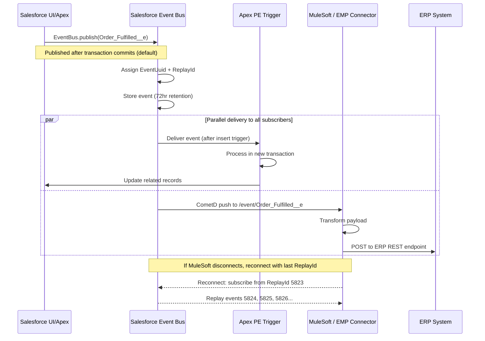
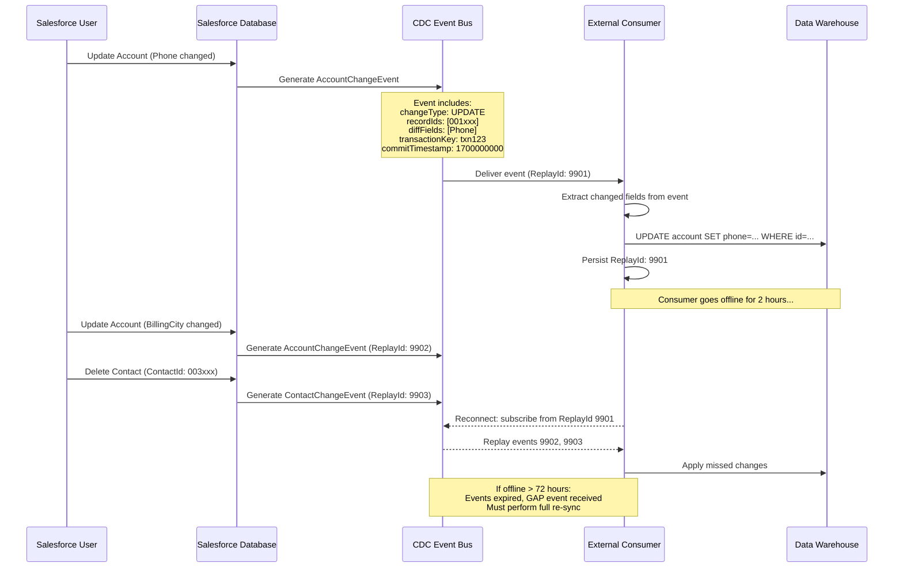
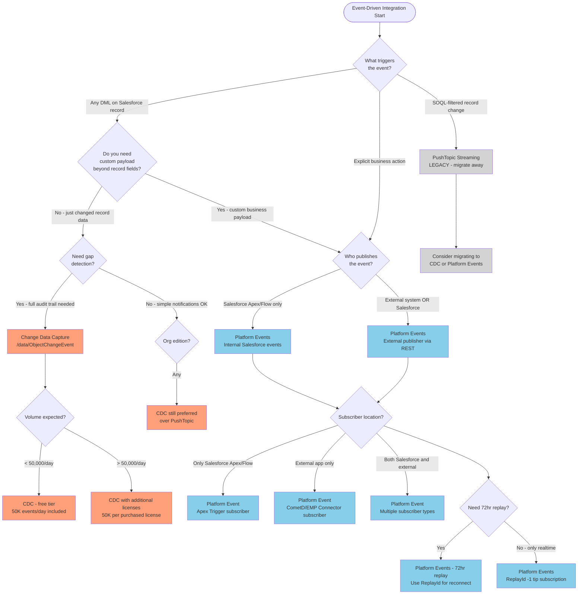

# Platform Events and Change Data Capture

## Exam Domain
Integration Mechanisms — 24% of exam weight (Event-Driven sub-domain)

## Foundations

Traditional integration is synchronous and request-driven: System A calls System B and waits. This creates tight coupling — A cannot function when B is unavailable, and A's performance is bounded by B's response time. Event-driven architecture inverts this. Systems publish events to a channel and subscribe to events from channels, with no direct dependency between publisher and subscriber.

Salesforce provides three event-driven mechanisms: **Streaming API (PushTopics)**, **Platform Events**, and **Change Data Capture (CDC)**. The exam tests your ability to distinguish these and select the correct one for a given scenario.

The fundamental mental model:
- **Platform Events** = Custom business events you define and publish. Like a message bus topic you own.
- **CDC** = Automatic record-level change notifications Salesforce generates for you. Like database binlog events.
- **PushTopic Streaming** = SOQL-filtered record change notifications. Legacy mechanism, largely superseded by CDC.

---

## Core Concepts

### Platform Events

**What they are:** Platform Events are a Salesforce-native publish-subscribe messaging mechanism. You define an Event schema (like defining an sObject), publish events, and any number of subscribers receive those events asynchronously.

Platform Events behave like sObjects in many ways — they have a schema, they can be created via Apex DML (`EventBus.publish()`), and they're accessible via SOQL (for monitoring, not for replay in production).

**When to use Platform Events over alternatives:**
- You need to communicate a business event (not just a data change) — e.g., "Order was fulfilled," "Payment was received," "Case was escalated"
- The event carries custom payload (not just which record changed)
- You need to cross the Salesforce transaction boundary (decouple synchronous processing from async side effects)
- You need to notify external systems of business process outcomes

#### Platform Event Schema

Every Platform Event has system-provided fields plus custom fields you define:

| Field | Type | Description |
|---|---|---|
| `EventUuid` | Text | Globally unique identifier for the event instance |
| `ReplayId` | Text | Durable replay identifier (used for resume after disconnect) |
| `CreatedDate` | DateTime | When the event was published |
| `CreatedById` | ID | User or process that published the event |
| Custom fields | Various | Business payload you define |

**Schema definition:** Platform Events are defined in Setup > Integrations > Platform Events. API name suffix is `__e` (e.g., `Order_Fulfilled__e`).

#### Publishing Platform Events

**From Apex:**
```apex
Order_Fulfilled__e evt = new Order_Fulfilled__e(
    Order_Id__c = orderId,
    Customer_Name__c = customerName,
    Fulfillment_Status__c = 'SHIPPED'
);
Database.SaveResult result = EventBus.publish(evt);
if (!result.isSuccess()) {
    for (Database.Error err : result.getErrors()) {
        System.debug('Error: ' + err.getMessage());
    }
}
```

**Publishing multiple events:**
```apex
List<Order_Fulfilled__e> events = new List<Order_Fulfilled__e>();
// ... populate list
List<Database.SaveResult> results = EventBus.publish(events);
```

**From REST API:**
```
POST /services/data/vXX.0/sobjects/Order_Fulfilled__e
{
    "Order_Id__c": "8013x000001ABC",
    "Customer_Name__c": "Acme Corp",
    "Fulfillment_Status__c": "SHIPPED"
}
```

**From Flow / Process Builder:** Both can publish Platform Events using the "Platform Event" action type in Flow.

**External systems publishing:** Any system with a valid Salesforce session can POST to `/services/data/vXX.0/sobjects/{EventName__e}`. This allows external systems (ERP, warehouse management, etc.) to inject events into the Salesforce event bus.

#### Publish Behavior: Transaction Boundary

This is a critical exam concept:

**publishImmediately = false (default):**  
The event is published only when the Apex transaction commits successfully. If the transaction rolls back, the event is NOT published. This is the correct behavior for events that signal "something happened successfully" — you don't want to notify downstream systems of an Order being fulfilled if the transaction that records the fulfillment fails.

**publishImmediately = true (High Volume events only):**  
The event is published immediately, regardless of whether the containing transaction commits. Used for high-throughput scenarios where transaction coupling is undesirable.

**Implementation with publishImmediately:**
```apex
// Must use EventBus.publish with high-volume events
// Normal events: published after commit
// High-volume events with publishImmediately:
EventBus.publish(highVolumeEvent); // publishes before transaction commits
```

#### Subscribing to Platform Events

**Apex Trigger on Platform Event:**
```apex
trigger OrderFulfilledTrigger on Order_Fulfilled__e (after insert) {
    for (Order_Fulfilled__e event : Trigger.New) {
        // Process event
        // Note: each event processed in a separate transaction
    }
}
```

Important: Apex triggers on Platform Events run in their own transaction context, separate from the publishing transaction. This is how you decouple synchronous Apex logic from async side effects.

**Flow:** Salesforce Flow has a trigger type of "Platform Event" — subscribe within Flow.

**CometD/EMP Connector (external apps):** External apps subscribe via the CometD Bayeux protocol on channel `/event/Order_Fulfilled__e`.

**MuleSoft:** MuleSoft's Salesforce connector natively supports Platform Event subscription.

**Important subscriber context:** Apex trigger subscribers run with the "Automated Process" user context, not the publishing user. Check Permission Set assignments for Automated Process if your trigger needs object access.

#### ReplayId for Platform Events

Platform Events store events for **72 hours** (3 days). Subscribers can replay missed events using ReplayId:

| ReplayId Value | Behavior |
|---|---|
| `-1` | Receive only new events (tip subscription) |
| `-2` | Replay all stored events from the earliest available (72-hour window) |
| Specific positive integer | Replay events after that specific ReplayId |

**Use case for replay:** An external subscriber goes offline for 4 hours. On reconnect, it subscribes with the last ReplayId it successfully processed. It receives all events published during the outage (up to 72-hour limit).

**Exam trap:** If the outage exceeds 72 hours, events are NOT replayed — they expire. The integration must have a reconciliation strategy for gaps exceeding 72 hours.

#### Delivery Guarantees

Platform Events provide **at-least-once delivery** — a subscriber may receive the same event more than once. Integrations must be idempotent (processing the same event twice produces the same result as processing it once).

**Idempotency implementation:** Use `EventUuid` as an idempotency key. Before processing, check if you've already processed an event with that UUID. This requires a processing log (custom object, external cache, etc.).

#### High-Volume vs Standard Platform Events

| Feature | Standard Platform Events | High-Volume Platform Events |
|---|---|---|
| Publication method | `EventBus.publish()` or REST | `EventBus.publish()` or REST |
| Max per 24 hours (Enterprise) | Included in allocation | Higher allocation |
| Transaction coupling | After commit (default) | `publishImmediately` available |
| Subscriber types | All | All |
| SOQL query access | Limited | Not queryable |
| Ordering | Per-channel FIFO | Best-effort |
| Use case | Business events | High-throughput operational events |

**Current limits (memorize for exam):**
- Performance/Unlimited Edition: 250,000 Platform Event publishes per 24 hours
- Enterprise Edition: 250,000 Platform Event publishes per 24 hours
- Developer Edition: 50,000 Platform Event publishes per 24 hours
- Concurrent connections (CometD subscribers): 1,000 per org (across all channels)
- Event storage / replay window: 72 hours

#### Ordering Guarantees

Platform Events are delivered in FIFO order within a channel for a given publisher. There is no global ordering guarantee across multiple publishers or channels. For scenarios requiring strict global ordering, additional coordination mechanisms are needed (sequence numbers in the event payload, for example).

#### Platform Event Apex Trigger — Deep Behavior

**Trigger context:** Platform Event Apex triggers fire after the publishing transaction commits. The trigger runs in a NEW transaction, separate from the publisher's transaction. This has important implications:

- The PE trigger has its own governor limits (not shared with publisher)
- The PE trigger runs under the **Automated Process** entity — not the user who published the event
- Database.SaveResult from EventBus.publish() does NOT indicate delivery — it indicates the event was accepted into the bus

**Retries on trigger failure:** If a Platform Event Apex trigger throws an unhandled exception, Salesforce retries the trigger delivery up to 9 additional times (10 attempts total). Retries use exponential backoff. After 10 failures, the event is dropped and an error is logged in the event delivery debug log.

**Implication:** Apex PE triggers must be idempotent. If the trigger creates a record and then fails on step 2, the retry will attempt to create the record again. Use `EventUuid` to detect and skip already-processed events:

```apex
trigger OrderFulfilledTrigger on Order_Fulfilled__e (after insert) {
    Set<String> processedUuids = new Set<String>();
    // Query custom object that tracks processed EventUuids
    for (Processed_Event__c pe : [SELECT EventUuid__c FROM Processed_Event__c 
                                   WHERE EventUuid__c IN :eventUuids LIMIT 200]) {
        processedUuids.add(pe.EventUuid__c);
    }
    
    List<Invoice__c> toCreate = new List<Invoice__c>();
    for (Order_Fulfilled__e event : Trigger.New) {
        if (!processedUuids.contains(event.EventUuid)) {
            toCreate.add(new Invoice__c(Order_Id__c = event.Order_Id__c));
        }
    }
    if (!toCreate.isEmpty()) insert toCreate;
}
```

**`EventBus.TriggerContext.currentReplayId()`:** Inside a Platform Event trigger, this method returns the ReplayId of the current event being processed. Useful for logging and monitoring.

**Pause and Resume:** An administrator can pause Platform Event triggers from Setup > Platform Events > [Event] > Pause. Useful during maintenance windows. Paused triggers queue events; they are resumed when unpaused (within the 72-hour retention window).

#### Platform Event Limits — Extended

**Per-event field limits:**
- Maximum custom fields per Platform Event: 50
- Maximum field name length: 40 characters
- No relationship fields to standard/custom objects (Platform Events are standalone records)
- Supported field types: Checkbox, Date, DateTime, Number, Text, TextArea, Long Text Area, Currency

**Event replay and the buffer:**
Events are stored in the Salesforce event bus for 72 hours. The storage is separate per event type and does not count against object storage limits. There is no charge for event storage within the retention window.

**Monitoring Platform Events:**
- Setup > Environments > Logs > Event Log Files: track Platform Event activity
- EventDeliveryDebugLog: tracks delivery failures to Apex triggers
- Event Bus Monitor (Subscriber Monitor in some releases): shows subscriber lag and ReplayId position

---

### Change Data Capture (CDC)

**What it is:** CDC automatically generates **change events** for Salesforce record DML operations (create, update, delete, undelete). Unlike Platform Events (which you publish explicitly), CDC events are generated automatically by the Salesforce platform whenever data changes.

**Why CDC exists and when to use it:** Any system that needs to keep an external data store in sync with Salesforce. Data warehouses, external CRM systems, analytics platforms, search indexes. Before CDC, these scenarios required either polling (wasteful, laggy) or custom trigger-based Platform Events (developer overhead). CDC is essentially database change data capture (like Debezium for Postgres) built natively into Salesforce.

#### Change Event Structure

A CDC event has a **ChangeEventHeader** compound field and then the changed field values.

**ChangeEventHeader fields (critical for exam):**

| Field | Description |
|---|---|
| `entityName` | API name of the sObject (e.g., `Account`) |
| `recordIds` | Array of record IDs affected by the change |
| `changeType` | Type of change (see below) |
| `changeOrigin` | Source of the change (UI, API, Apex, etc.) |
| `transactionKey` | Groups events from the same transaction |
| `sequenceNumber` | Order of this event within its transaction |
| `commitTimestamp` | Epoch timestamp when the transaction committed |
| `commitUser` | User ID who committed the transaction |
| `commitNumber` | Unique commit number for deduplication |
| `nulledFields` | Fields explicitly set to null |
| `diffFields` | Fields that were changed in an update |
| `changedFields` | Fields included in the event payload |

**Understanding `diffFields` vs `changedFields`:** In an UPDATE event, only modified fields are included in the event payload. `diffFields` lists which fields actually changed value. `changedFields` lists which fields are present in the event. For full record reconstruction, a subscriber must have the baseline record and apply the diff.

#### Change Types (memorize all of these)

| changeType | Meaning |
|---|---|
| `CREATE` | Record was created |
| `UPDATE` | Record was updated |
| `DELETE` | Record was deleted (moved to Recycle Bin) |
| `UNDELETE` | Record was restored from Recycle Bin |
| `GAP_CREATE` | Records were created but CDC couldn't generate events for all (gap) |
| `GAP_UPDATE` | Records were updated but CDC couldn't generate events for all (gap) |
| `GAP_DELETE` | Records were deleted but CDC couldn't generate events for all (gap) |
| `GAP_UNDELETE` | Records were undeleted but CDC couldn't generate events for all (gap) |
| `GAP_OVERFLOW` | Too many changes occurred in a short period; events were dropped |

**GAP events — exam critical concept:**

GAP events are CDC's way of saying: "Something happened, but I couldn't tell you exactly what for every record. Go re-sync." Gap events occur when:
- The event volume exceeds the CDC rate limits
- A data import/migration operation made bulk changes that outpaced CDC generation
- The subscriber was offline for more than 3 days (events expired)

**How to handle GAP events:** Upon receiving any GAP event, the subscriber must perform a full re-sync of the affected object — query all records (or records with specific criteria) and reconcile with local state. This is the "catch-up" pattern for CDC consumers.

`GAP_OVERFLOW` specifically means CDC dropped events entirely. The subscriber must assume any record of that sObject type may have changed.

#### Enriched Field Values

In CDC UPDATE events, **only changed fields are included** in the event payload. This is intentional for efficiency — transmitting only the delta.

Example: An Account has 50 fields. A user updates only the `Phone` field. The CDC UPDATE event includes:
- `ChangeEventHeader` (full)
- `Phone` (new value)
- All other fields: NOT included

**Implication for subscribers:** CDC subscribers maintaining a replica need to apply delta updates, not replace whole records. They must have the full record baseline and apply field-level updates. On initial setup, subscribers perform a full data extract from Salesforce, then apply CDC events going forward.

**Null fields:** The `nulledFields` header lists fields that were explicitly set to null in the update. This is important — a missing field in the payload means "unchanged," not "null."

#### Enabling CDC

**Setup path:** Setup > Integrations > Change Data Capture > select objects to enable

**Out-of-the-box:** All standard objects (Account, Contact, Lead, Opportunity, Case, etc.) and all custom objects support CDC. CDC is disabled by default — must be explicitly enabled per object.

**Custom objects:** Append `ChangeEvent` to the object name for the channel. E.g., `My_Object__c` generates `My_Object__ChangeEvent` events on channel `/data/My_Object__ChangeEvent`.

#### CDC Subscription Channels

| Channel | Subscribes to |
|---|---|
| `/data/ChangeEvents` | All CDC events for all enabled objects |
| `/data/AccountChangeEvent` | Account changes only |
| `/data/ContactChangeEvent` | Contact changes only |
| `/data/OpportunityChangeEvent` | Opportunity changes only |
| `/data/My_Custom_Object__ChangeEvent` | Custom object changes only |

**Recommendation:** Subscribe to individual object channels rather than `/data/ChangeEvents` for production integrations. The all-events channel creates high event volume and makes it difficult to route events to appropriate downstream consumers.

#### CDC Limits and Retention

| Metric | Value |
|---|---|
| Event retention (replay window) | 3 days (72 hours) |
| Max events per 24 hours (included free) | 50,000 |
| Additional events (purchasable) | 50,000 per CDC license |
| Objects enabled for CDC | All standard + custom objects |
| Max objects enabled simultaneously | Based on edition |

**The 3-day retention is the most important CDC limit for the exam.** If a subscriber is offline for more than 3 days, it must perform a full re-sync. Design integrations with monitoring that alerts when a CDC subscriber has been offline for >48 hours (giving 24 hours to recover before events expire).

#### CDC with External Applications

**EMP Connector:** Salesforce-provided open-source Java library for subscribing to Platform Events, CDC, and Streaming API from external Java applications. Wraps the CometD protocol. Handles reconnection, ReplayId management, and backpressure.

```java
BayeuxParameters params = new BayeuxParameters() {
    // ... auth configuration
};
EmpConnector connector = new EmpConnector(params);
connector.start().get(5, SECONDS);

long replayFrom = EmpConnector.REPLAY_FROM_TIP; // -1
Consumer<Map<String, Object>> consumer = event -> {
    System.out.println("Received: " + event);
};
TopicSubscription subscription = connector.subscribe(
    "/data/AccountChangeEvent", replayFrom, consumer
).get(5, SECONDS);
```

**EMP Connector — operational details:**

- Open source: available on GitHub (forcedotcom/EMP-Connector)
- Handles CometD handshake, connect, and re-connect automatically
- Manages ReplayId persistence (application must implement storage, EMP Connector handles the protocol)
- Thread-safe: can subscribe to multiple channels concurrently
- Does NOT handle backpressure on its own — if the consumer processes events slower than they arrive, the application must implement buffering (e.g., put events in an in-memory queue and process from a thread pool)
- Authentication: use OAuth access token in `BayeuxParameters.authorization()` method

**Non-Java external consumers:**
For Python, Node.js, or .NET consumers, options include:
- CometD libraries (many language implementations available)
- MuleSoft Salesforce Connector (handles all protocol details)
- Third-party libraries (e.g., `aiosfstream` for Python async CDC consumption)
- Custom HTTP long-polling implementation (advanced, not recommended)

**MuleSoft CDC Integration Pattern:**
MuleSoft's Salesforce Connector (part of MuleSoft Anypoint Platform) natively supports CDC subscription. Common pattern:

1. MuleSoft subscribes to `/data/AccountChangeEvent`
2. On event receive, MuleSoft routes the event to the appropriate downstream system (ERP, data warehouse, etc.)
3. MuleSoft transforms the CDC payload to the target format
4. MuleSoft persists the last processed ReplayId for reconnection
5. On startup, MuleSoft subscribes from the last ReplayId (or falls back to `-2` for full replay)

**Handling CDC enriched fields in downstream systems:**

CDC UPDATE events include only changed fields. A subscriber maintaining a replica must:
1. Receive CREATE event → store full record in replica
2. Receive UPDATE event → apply only the fields present in the event body; leave other fields unchanged
3. For fields in `nulledFields` header → explicitly set those fields to null
4. For fields NOT in the event payload AND NOT in `nulledFields` → leave unchanged (they weren't modified)

Example UPDATE event handling logic:
```python
def handle_cdc_event(event):
    change_type = event['ChangeEventHeader']['changeType']
    record_id = event['ChangeEventHeader']['recordIds'][0]
    
    if change_type == 'CREATE':
        # Full record — insert into replica
        db.insert_account(record_id, event)
    elif change_type == 'UPDATE':
        # Partial record — update only present fields
        changed_fields = {k: v for k, v in event.items() 
                         if k != 'ChangeEventHeader'}
        null_fields = event['ChangeEventHeader'].get('nulledFields', [])
        for field in null_fields:
            changed_fields[field] = None
        db.update_account(record_id, changed_fields)
    elif change_type in ('GAP_CREATE', 'GAP_UPDATE', 'GAP_DELETE', 'GAP_OVERFLOW'):
        # Trigger full re-sync
        trigger_full_resync(event['ChangeEventHeader']['entityName'])
```

**Streaming API — PushTopic Additional Details:**

**NotifyForOperationCreate/Update/Delete/Undelete:** Four separate boolean flags on PushTopic let you subscribe to only specific operation types. Example: `NotifyForOperationUpdate = true` and `NotifyForOperationCreate = false` means you receive updates but not new records.

**Performance considerations for PushTopic:**
- Each PushTopic evaluation runs the SOQL filter against the changed record
- Complex WHERE clauses or large SELECT lists increase processing time
- High-volume DML (e.g., during data loads) can cause event delivery delays
- Recommend CDC over PushTopic for high-volume change scenarios

**PushTopic SOQL limitations:**
- No aggregate functions (COUNT, SUM, etc.)
- No relationship queries that span multiple levels
- SELECT must include Id
- WHERE clause can reference standard indexed fields for better performance
- Maximum of 50 active PushTopics per org

---

### Comparison: Streaming API vs Platform Events vs CDC

| Feature | PushTopic Streaming | Platform Events | Change Data Capture |
|---|---|---|---|
| Trigger | SOQL-matched DML | Explicit publish | Any DML on enabled objects |
| Schema | SOQL-defined | Custom event schema | Auto-generated per sObject |
| Direction | SF → External | Any → Any | SF → External |
| Custom payload | No (SOQL fields only) | Yes (custom fields) | No (record fields only) |
| Replay window | 24 hours | 72 hours | 72 hours |
| Max events/day | 50,000 (PushTopic) | 250,000 | 50,000 (included) |
| Active topics/events | 50 PushTopics max | No hard limit on schemas | All enabled objects |
| Gap handling | No gap events | No gap events | Yes — GAP_* types |
| Ordering | Per-topic FIFO | Per-channel FIFO | Per-transaction ordered |
| Enriched payload | Full selected fields | Custom fields | Changed fields only |
| Setup effort | Code (SOQL) | Schema definition | Setup UI checkbox |
| Use for new projects | Not recommended (legacy) | Business events | Data sync |
| Supported in Apex trigger | No | Yes | No |

**Decision shortcut:**
- "Sync Salesforce data to external system" → CDC
- "Trigger external action on business event" → Platform Events
- "Legacy system needs SOQL-filtered real-time" → PushTopic (but migrate to CDC)

---

## PTA / SA Relevance

### When This Comes Up in Engagements

**Data Warehouse / Analytics Modernization:** Nearly every enterprise customer has a data warehouse (Snowflake, BigQuery, Redshift) that needs CRM data. The traditional ETL approach extracts nightly via Bulk API. CDC enables near-real-time sync — changes land in the warehouse within seconds rather than overnight. This is a high-impact architectural upgrade the PTA can position in discovery.

**System of Record (SOR) Conflicts:** When Salesforce and an ERP both claim to be the Account record master, CDC + Platform Events enable a conflict-detection pattern. CDC detects the Salesforce change, a middleware checks if the ERP has a conflicting update, and routing logic determines which wins.

**Decoupling Apex Logic:** Customers with massive, slow, failure-prone Apex triggers often have synchronous logic that should be async. Platform Events are the standard Salesforce-native pattern for moving heavy processing out of the transaction (create PE in trigger, process in PE trigger). This is the solution to the "my triggers are timing out" problem.

**Microservices Integration:** Event-driven architecture (EDA) is foundational to microservices. Platform Events serve as the Salesforce integration point for event-driven microservice architectures. A microservice publishes business events as Platform Events; Salesforce Flows or Apex consumes them.

### Common Architecture Failures

1. **Not handling GAP events in CDC consumers:** A subscriber receives a GAP_OVERFLOW event and ignores it because the code only handles CREATE/UPDATE/DELETE. Result: data inconsistency that surfaces weeks later when someone notices records are missing from the downstream system. Every CDC consumer must have explicit GAP event handling — trigger a full re-sync.

2. **Exceeded 72-hour replay window without alert:** A CDC consumer service restarts after a weekend (72+ hours). It tries to replay from the last ReplayId, but events have expired. The subscriber silently starts from tip, missing all changes made during the outage. No data reconciliation is triggered. The external system is now stale. Fix: monitor subscriber health and alert at 48 hours of disconnection.

3. **Non-idempotent Platform Event consumers:** A Platform Event is delivered twice (at-least-once guarantee). The Apex trigger creates a duplicate record. Fix: use `EventUuid` as an idempotency key before processing. Check if a record with this `EventUuid` was already processed.

4. **Transaction coupling assumption:** Developer publishes a Platform Event inside an Apex method, assuming the event is published immediately (even if the transaction fails). Default behavior publishes after commit. If the transaction rolls back, the event is never published. Downstream system never gets notified of an event that didn't actually complete.

5. **Subscribing to `/data/ChangeEvents` (all) instead of specific channels:** One subscriber consuming all CDC events tries to handle every object type. The event volume overwhelms the consumer, processing falls behind, ReplayId backup grows, and eventually the subscriber can't keep up with the 72-hour retention window. Subscribe to individual channels and route to separate consumers.

### Enterprise Patterns

**Outbox Pattern with Platform Events:** To guarantee event delivery even when Salesforce itself has issues, implement the transactional outbox pattern:
- Apex writes to an "Event Outbox" custom object AND publishes a Platform Event in the same transaction
- A monitoring process checks for outbox records not confirmed consumed
- If a Platform Event is lost, the outbox record triggers a retry

**Event Sourcing Hybrid:** For objects where full audit history matters, CDC events can be replayed to reconstruct the state of a Salesforce record at any point in time (within the 3-day window, or longer if events are archived to an external store). MuleSoft or a Lambda function can consume CDC events and write them to an event store (DynamoDB, Kafka) for long-term audit.

**Saga Pattern with Platform Events:** Long-running business processes spanning Salesforce and external systems can be coordinated with Platform Events as saga messages. Each step publishes a completion event; the next step subscribes to that event. Compensating events handle rollback of completed steps on failure.

**Dead Letter Queue:** External CDC/Platform Event subscribers should implement a dead letter queue. Events that fail processing are moved to the DLQ for manual inspection rather than dropped or causing infinite retry loops.

---

## Architecture

### Platform Events Publish/Subscribe Flow



### CDC Event Flow with ReplayId



### Decision Tree: Platform Events vs CDC vs Streaming API



**Limitations and Tradeoffs:**

- Platform Events: 72-hour retention is sufficient for most reconnection scenarios but requires operational monitoring. No guaranteed ordering across publishers. At-least-once delivery requires idempotent consumers.
- CDC: Only changed fields in UPDATE events — consumers must maintain full record state or query Salesforce for complete records. GAP events require reconciliation strategy. 3-day window limits recovery options.
- Streaming API (PushTopic): 24-hour replay window shorter than CDC/PE. 50 PushTopic limit constrains use in complex orgs. Being superseded by CDC for new projects — but many existing integrations still use it.
- All three: CometD long-polling can be disrupted by proxies, load balancers with short timeout settings, and firewalls. External subscribers need robust reconnection logic.
- EMP Connector: Java-only. Non-Java external subscribers must implement CometD client from scratch or use a wrapper library.

---

## Key Facts to Memorize

- Platform Event API name suffix: `__e`
- System fields on every Platform Event: `EventUuid`, `ReplayId`, `CreatedDate`, `CreatedById`
- ReplayId `-1` = tip (new events only), `-2` = earliest available events
- Platform Event retention: 72 hours
- CDC retention: 72 hours (3 days)
- Platform Event publish limit: 250,000/day (Performance/Unlimited/Enterprise)
- CDC included events: 50,000/day free; additional 50,000 per CDC license
- Platform Event delivery guarantee: at-least-once (idempotency required)
- Default publish behavior: after transaction commits
- `publishImmediately = true`: available on High-Volume Platform Events only
- CDC change types: CREATE, UPDATE, DELETE, UNDELETE + GAP variants
- GAP_OVERFLOW: events were dropped, full re-sync required
- CDC UPDATE events: only changed fields in payload; use `diffFields`, `nulledFields` headers
- CDC auto-enabled channels: `/data/ChangeEvents` (all), `/data/AccountChangeEvent` (specific)
- PushTopic replay window: 24 hours (shorter than PE/CDC)
- Apex PE trigger runs as Automated Process user
- CometD concurrent subscriber limit: 1,000 per org

---

## Exam Traps

1. **PushTopic replay = 24 hours, Platform Events/CDC = 72 hours.** The difference matters when a question involves subscriber outage duration.

2. **CDC events contain only changed fields in UPDATE events.** A distractor answer might suggest CDC events always contain the full record. They do not — subscribers need baseline state + apply delta.

3. **GAP events require full re-sync.** Don't choose an answer that says "subscribe from last ReplayId after a GAP_OVERFLOW event" — the correct answer is re-sync the entire object.

4. **publishImmediately = false is the default.** If a question describes a Platform Event not being published when a transaction rolls back, this is expected default behavior — not a bug.

5. **Apex triggers on Platform Events run as Automated Process user.** Access issues in PE Apex triggers are often caused by missing Permission Sets on the Automated Process user.

6. **Idempotency is mandatory for Platform Event consumers.** At-least-once delivery means duplicate events are possible. Any answer that doesn't account for idempotency in a platform event consumer is incomplete.

7. **CDC vs Platform Events for "sync external database":** Always CDC. Platform Events are for business events with custom schemas, not for change sync. The exam may offer Platform Events as a plausible distractor for a CDC use case.

8. **PushTopic StreamingChannel vs Platform Event channel naming:** PushTopic channels are `/topic/TopicName`. Platform Event channels are `/event/EventName__e`. CDC channels are `/data/ObjectChangeEvent`. Getting these mixed up on the exam costs marks.

---

## Practice Questions

**Question 1**

An integration architect is designing a solution to keep an external data warehouse synchronized with Salesforce Account and Opportunity records. Changes should be reflected in the warehouse within 5 minutes. The solution must handle cases where the warehouse consumer is temporarily offline and replay missed events. Which mechanism should the architect recommend?

A) PushTopic Streaming API with 24-hour replay  
B) Change Data Capture on Account and Opportunity with 72-hour replay  
C) REST API polling every 5 minutes with SystemModStamp filtering  
D) Platform Events published from Apex triggers on Account and Opportunity  

**Answer: B**

Explanation: CDC is purpose-built for data sync to external systems. It auto-generates change events for enabled objects without requiring custom Apex. The 72-hour replay window provides ample buffer for a consumer reconnecting after a brief outage. PushTopic has only 24 hours of replay and is considered legacy. REST API polling wastes API calls and has up to 5-minute latency regardless of change frequency. Platform Events from Apex triggers would require custom code to replicate what CDC provides out-of-the-box, and would add governor limit exposure.

---

**Question 2**

A Salesforce org receives a CDC event with `changeType: GAP_OVERFLOW` for the Account object. How should the external CDC consumer respond?

A) Ignore the event and continue subscribing from the current ReplayId  
B) Resubscribe from ReplayId `-2` to replay all available events from the past 72 hours  
C) Perform a full re-sync of all Account records from Salesforce and reconcile with the local data store  
D) Increase the event processing rate and wait for the gap to close  

**Answer: C**

Explanation: GAP_OVERFLOW indicates that CDC could not generate events for all record changes — events were dropped. The consumer cannot know which records were affected. Replaying from `-2` (option B) would only help if the events were retained, but GAP_OVERFLOW specifically means some events were never stored. The only safe response is a full re-sync — query all Account records from Salesforce and reconcile with the external system's current state. Ignoring the event leads to data inconsistency. You cannot "close" a gap by waiting.

---

**Question 3**

An order management application needs to notify multiple downstream systems (a billing service, a shipping service, and an analytics platform) when an Order is marked as "Confirmed" in Salesforce. The notification must include custom order metadata not present on the Order sObject. Which Salesforce event mechanism is most appropriate?

A) Change Data Capture on the Order object  
B) PushTopic Streaming API with SOQL filter on Order Status  
C) Platform Events with custom fields for order metadata  
D) Generic Streaming with a custom StreamingChannel  

**Answer: C**

Explanation: Platform Events support custom schema with user-defined fields, allowing the architect to include any business payload needed by downstream consumers. CDC auto-generates events from record DML but does not support custom payload — it only includes changed record fields. PushTopic fires on DML but payload is limited to SOQL-selected fields, with no custom metadata. Generic Streaming supports custom payload but is designed for simpler notification scenarios and doesn't provide the structured schema, replay guarantee, or enterprise patterns that Platform Events offer for business event integration.

---

**Question 4**

A Platform Event Apex trigger is processing Order_Completed__e events and creating Invoice records. During testing, it is discovered that when a transaction that publishes an Order_Completed__e event is rolled back (e.g., due to a validation rule failure), the Invoice is sometimes still being created. What is the most likely explanation?

A) The Platform Event trigger runs before the publishing transaction commits  
B) The Platform Event was published using `publishImmediately = true` on a High-Volume event  
C) Apex Platform Event triggers run in the same transaction as the publisher  
D) The Platform Event replay mechanism is delivering duplicate events  

**Answer: B**

Explanation: Default Platform Event publish behavior publishes the event only after the transaction commits. If an event is being published despite a transaction rollback, the event must be configured to publish immediately regardless of transaction outcome — the `publishImmediately = true` setting available on High-Volume Platform Events. Option A is backwards — the trigger runs AFTER the commit, not before. Option C is incorrect — PE triggers run in a new, separate transaction. Option D describes at-least-once delivery, not the behavior of publishing despite rollback.

---

**Question 5**

An external Java application subscribes to Salesforce Change Data Capture events on the `/data/ContactChangeEvent` channel. The application processes events and updates a downstream CRM system. After being offline for 80 hours due to a system outage, the application reconnects using the last saved ReplayId. The architect reviews the reconnection strategy. What critical issue must be addressed?

A) The application should resubscribe from ReplayId `-1` to receive only new events  
B) The 72-hour event retention window has expired; events from the outage period are gone and a full re-sync is required  
C) CDC does not support ReplayId-based replay; the application must use polling instead  
D) The application should resubscribe from ReplayId `-2` to guarantee all events are replayed  

**Answer: B**

Explanation: CDC retains events for 72 hours. An 80-hour outage exceeds this window — events from the first 8 hours of the outage have expired. Using the last saved ReplayId will fail (the event no longer exists) or will silently start from the earliest available event, missing all changes from the first 8 hours. The correct response is a full re-sync: query all Contact records from Salesforce and reconcile with the downstream CRM, then resume CDC subscription from the tip. Option A is correct for new tip subscriptions but doesn't address the missed events. Option C is false — CDC does support ReplayId. Option D cannot help because events before the 72-hour window are gone regardless of the ReplayId value used.
