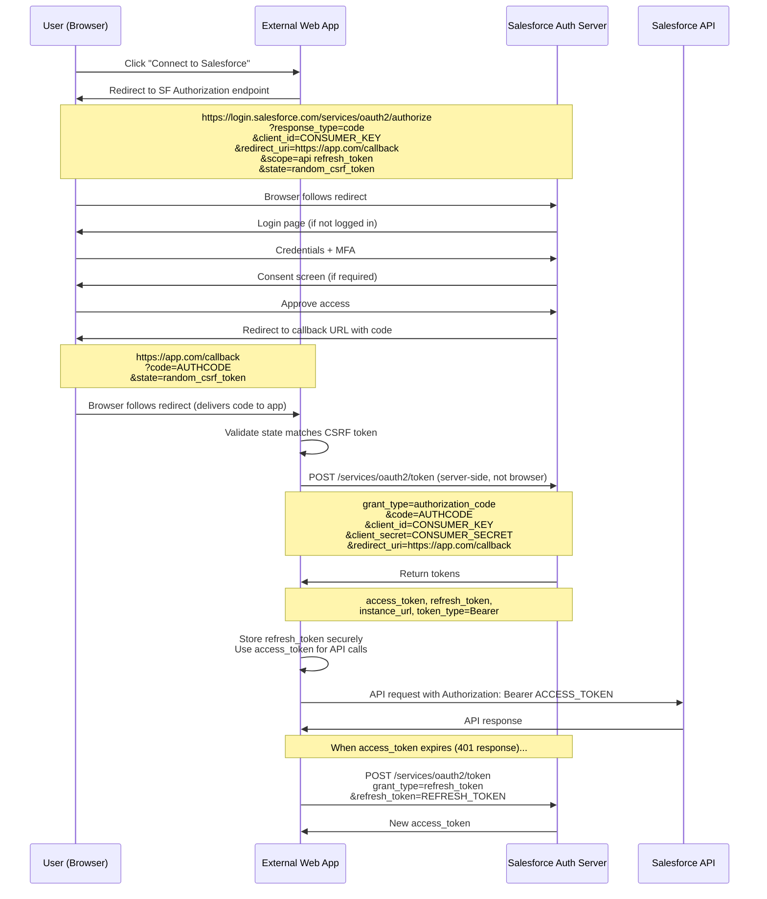
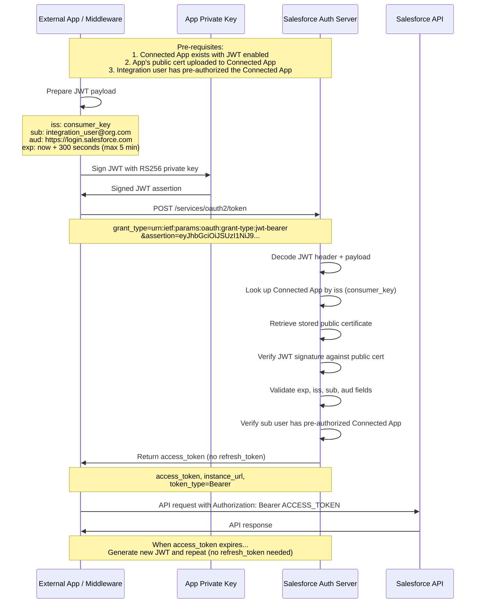
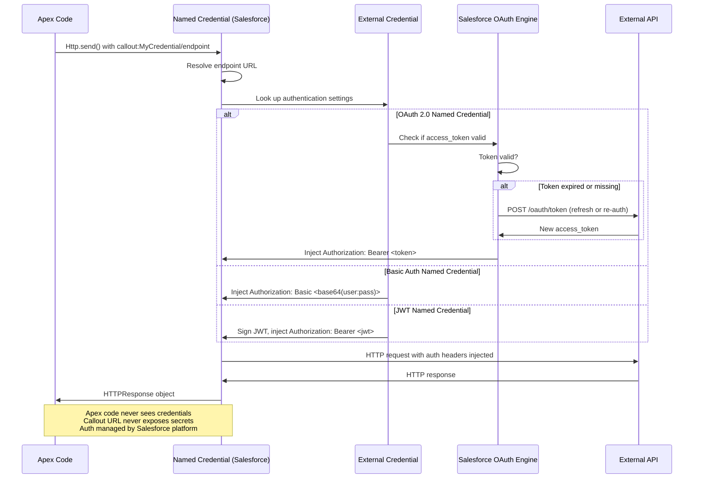

# Named Credentials and Authentication

## Exam Domain
Security Architecture — 16% of exam weight (heavily intersects with Integration Mechanisms)

## Foundations

Every integration has two security concerns: **authentication** (who are you?) and **authorization** (what are you allowed to do?). In Salesforce integration architecture, authentication failures are the #1 cause of integration outages. Getting auth right is not just a security concern — it is a reliability concern.

The architect must understand the full OAuth 2.0 protocol flows because the exam tests selection of the appropriate flow for a given scenario, and real-world advisory work involves guiding customers away from insecure patterns (like Username-Password flow in production integrations) toward appropriate ones (like JWT Bearer for server-to-server).

Named Credentials abstract the auth layer from the integration code, enabling secure credential management without hardcoding secrets in Apex or configuration.

---

## Core Concepts

### OAuth 2.0 Flows

OAuth 2.0 is an authorization framework, not just an authentication protocol. In Salesforce context, it is used for:
1. External apps authenticating TO Salesforce (Salesforce as resource server)
2. Salesforce authenticating TO external services (Salesforce as OAuth client)

#### Web Server Flow (Authorization Code Flow)

**What it is:** The standard OAuth 2.0 flow for web applications where a user grants an app permission to access Salesforce on their behalf. The classic "three-legged OAuth" flow.

**Actors:**
- Resource Owner: Salesforce user
- Client: External web application
- Authorization Server: Salesforce (login.salesforce.com)
- Resource Server: Salesforce APIs

**Step-by-step:**
1. User initiates action in external web app
2. App redirects user's browser to Salesforce authorization endpoint:
   ```
   https://login.salesforce.com/services/oauth2/authorize
     ?response_type=code
     &client_id=<consumer_key>
     &redirect_uri=<callback_url>
     &scope=api refresh_token
   ```
3. User authenticates to Salesforce (if not already logged in)
4. User sees consent screen (or auto-approves if pre-approved)
5. Salesforce redirects browser to callback URL with authorization code:
   ```
   https://yourapp.com/callback?code=<authorization_code>
   ```
6. App server (server-side, not browser) POSTs to token endpoint:
   ```
   POST https://login.salesforce.com/services/oauth2/token
   grant_type=authorization_code
   &code=<authorization_code>
   &client_id=<consumer_key>
   &client_secret=<consumer_secret>
   &redirect_uri=<callback_url>
   ```
7. Salesforce returns:
   ```json
   {
     "access_token": "...",
     "refresh_token": "...",
     "token_type": "Bearer",
     "instance_url": "https://yourorg.salesforce.com",
     "id": "https://login.salesforce.com/id/...",
     "issued_at": "...",
     "signature": "..."
   }
   ```
8. App stores refresh_token securely; uses access_token for API calls
9. When access_token expires, use refresh_token to get a new one

**When to use:** User-facing web applications, portals, any integration requiring individual user authorization and consent.

**Security characteristics:**
- Authorization code is short-lived (expires in minutes)
- Client secret never exposed to browser (server-side exchange)
- Refresh tokens can be rotated for enhanced security
- Supports per-user data scoping

**Key security requirement:** The authorization code exchange (step 6) MUST happen server-side. Never exchange the code in browser JavaScript — the client_secret would be exposed.

**PKCE (Proof Key for Code Exchange):** For mobile/SPA apps that can't store client_secret safely, PKCE adds a code_challenge/code_verifier mechanism that prevents authorization code interception attacks. Salesforce supports PKCE.

---

#### Username-Password Flow

**What it is:** Application submits username and password directly to Salesforce to obtain an access token. There is no user redirect or consent screen.

**Steps:**
1. App POSTs directly:
   ```
   POST https://login.salesforce.com/services/oauth2/token
   grant_type=password
   &client_id=<consumer_key>
   &client_secret=<consumer_secret>
   &username=<salesforce_username>
   &password=<password+security_token>
   ```
2. Salesforce returns access_token (no refresh_token by default)

**When to use:** NEVER in production. The exam still tests knowledge of this flow but current Salesforce documentation explicitly discourages it.

**Why it's dangerous:**
- Application must store Salesforce username AND password — two secrets instead of one
- No multi-factor authentication support (bypasses MFA)
- If the application is compromised, full Salesforce credentials are leaked
- Violates least-privilege — the app authenticates as a full user
- Salesforce has been phasing out Username-Password flow (restricted in some security policies)

**Legitimate use cases (narrow):** Internal scripts running in secure environments where MFA cannot be implemented; legacy system migration where no other option exists temporarily. Always document as technical debt.

**Note for exam:** When a question describes a server-to-server integration with "no user interaction required," the wrong answer is Username-Password (despite it fitting some criteria). The correct answer is JWT Bearer Token Flow.

---

#### JWT Bearer Token Flow

**What it is:** Server-to-server OAuth 2.0 flow using signed JSON Web Tokens. No user interaction required. No password stored. The application proves its identity via a cryptographic signature.

**Why it's the correct choice for server-to-server:** Instead of a password, the application has a private key. It creates a signed JWT assertion, sends it to Salesforce, and receives an access token. The private key never travels over the network.

**Prerequisites:**
1. A Connected App in Salesforce with JWT Bearer Token flow enabled
2. A certificate (public key) uploaded to the Connected App
3. The external application has the matching private key
4. Pre-authorization: the Salesforce user (often an integration user) must pre-authorize the Connected App (or an admin authorizes on behalf of all users)

**Step-by-step:**
1. Application creates a JWT assertion:
   ```json
   Header: { "alg": "RS256" }
   Payload: {
     "iss": "<consumer_key>",
     "sub": "<salesforce_username>",
     "aud": "https://login.salesforce.com",
     "exp": <unix_timestamp_5min_future>
   }
   ```
2. Application signs the JWT with its private key (RS256)
3. Application POSTs the assertion to Salesforce:
   ```
   POST https://login.salesforce.com/services/oauth2/token
   grant_type=urn:ietf:params:oauth:grant-type:jwt-bearer
   &assertion=<signed_jwt>
   ```
4. Salesforce validates the JWT signature using the public certificate on file
5. Salesforce returns an access_token
6. Application uses access_token for API calls
7. When token expires, generate a new JWT and repeat — no stored refresh_token needed

**When to use:**
- Server-to-server integrations with no user interaction
- Backend services, batch processes, microservices
- CI/CD pipelines accessing Salesforce
- Middleware (MuleSoft, Boomi) calling Salesforce APIs
- Any integration where storing a password is a security violation

**Security characteristics:**
- No password stored anywhere
- Private key rotatable without changing Salesforce configuration (just upload new certificate)
- JWT exp field limits token lifespan to maximum 5 minutes
- If private key is compromised, no Salesforce password is leaked
- Supports MFA-exempt integration users via specific policy configuration

**Common implementation mistake:** Setting `exp` too far in the future. Salesforce rejects JWTs with `exp` more than 5 minutes from current time. Clock skew between server and Salesforce can cause failures — synchronize server time with NTP.

---

#### Device Flow

**What it is:** OAuth 2.0 flow for devices that cannot display a web browser or accept user input directly (IoT devices, CLIs, Smart TVs, command-line tools).

**Steps:**
1. Device requests device code and user code:
   ```
   POST https://login.salesforce.com/services/oauth2/token
   response_type=device_code
   &client_id=<consumer_key>
   ```
2. Salesforce returns:
   ```json
   {
     "device_code": "...",
     "user_code": "BCDF-HKMP",
     "verification_uri": "https://login.salesforce.com/activate",
     "expires_in": 1800,
     "interval": 5
   }
   ```
3. Device displays `user_code` and `verification_uri` to user
4. User navigates to verification_uri on another device (phone, laptop) and enters user_code
5. Device polls the token endpoint every `interval` seconds:
   ```
   POST .../token
   grant_type=device
   &client_id=<consumer_key>
   &code=<device_code>
   ```
6. Once user completes authorization, poll returns access_token

**When to use:** CLI tools (SF CLI uses this for initial authentication), IoT devices with displays but no browsers, hardware terminals.

---

#### Client Credentials Flow

**What it is:** Machine-to-machine OAuth 2.0 flow where the application authenticates using only its client_id and client_secret (no user delegation). Salesforce added formal support for this flow in recent releases.

**Steps:**
1. Application POSTs:
   ```
   POST https://login.salesforce.com/services/oauth2/token
   grant_type=client_credentials
   &client_id=<consumer_key>
   &client_secret=<consumer_secret>
   ```
2. Salesforce returns access_token

**Difference from Username-Password:** Client Credentials authenticates the application itself, not a Salesforce user. The access_token represents the application, not a user identity. The Connected App must have a Run As user configured.

**When to use:** Preferred for simple machine-to-machine integration where JWT is overkill and there's no need to act as a specific user. Note: requires Salesforce to be configured for this flow (not available by default in all Connected App configurations).

**When JWT is better than Client Credentials:** When you need to act as a specific integration user (for record ownership, field history, etc.), JWT Bearer is cleaner. Client Credentials works when you simply need API access without user-level attribution.

---

#### Refresh Token Flow

**What it is:** Exchange a refresh_token for a new access_token when the current access_token expires.

**Steps:**
1. App detects 401 Unauthorized response from Salesforce API
2. App POSTs to token endpoint:
   ```
   POST https://login.salesforce.com/services/oauth2/token
   grant_type=refresh_token
   &client_id=<consumer_key>
   &client_secret=<consumer_secret>
   &refresh_token=<refresh_token>
   ```
3. Salesforce returns new access_token (and optionally new refresh_token if rotating)

**Access token lifetime:** Default is 2 hours (7,200 seconds), configurable on Connected App session policy.

**Refresh token lifetime:** Configurable — can be infinite or time-bounded. A session policy can expire the refresh token on a schedule (e.g., daily, weekly, or on each access).

**Refresh token security:** Store refresh tokens with the same security as passwords. If a refresh token is leaked, the attacker can generate access tokens indefinitely until the refresh token is revoked.

**Token revocation:** `POST /services/oauth2/revoke?token=<token>` — revokes access or refresh token.

---

### Named Credentials

**What they are:** Salesforce configuration objects that store the endpoint URL and authentication settings for an external service. When Apex callouts use Named Credentials, the auth header is automatically injected by Salesforce — no credentials stored in code or Custom Settings.

**The core security problem they solve:** Without Named Credentials, developers often:
- Hardcode API keys in Apex code (checked into source control — security violation)
- Store credentials in Custom Settings or Custom Metadata (visible to admins, included in sandbox copies)
- Store credentials in Named Values (requires manual management)

Named Credentials encrypt credentials at rest, restrict access via profile/permission set, and decouple auth management from code deployment.

**How to use in Apex:**
```apex
HttpRequest req = new HttpRequest();
req.setEndpoint('callout:MyNamedCredential/api/v1/orders');
// Note: path AFTER the named credential name is appended to the stored endpoint
req.setMethod('GET');
req.setHeader('Accept', 'application/json');
Http http = new Http();
HTTPResponse res = http.send(req);
```

The `callout:NamedCredentialName` syntax tells Salesforce to use the Named Credential. Authentication headers are automatically injected.

**Merge fields available in Named Credentials:**
- `{!$Credential.AuthTokenType}` — auth type
- `{!$Credential.AuthToken}` — the token (injected automatically, rarely used directly)
- `{!$Credential.UserName}` — authenticated username
- `{!$Credential.Password}` — password (for Password auth type)
- `{!$Credential.OAuthToken}` — OAuth access token (for OAuth type)

These merge fields can be used in Apex callout headers or as per-user identity injection.

#### Authentication Protocols Supported

| Protocol | Use case |
|---|---|
| No Authentication | Public endpoints |
| Password | Basic Auth (username/password) or API Key in custom header |
| OAuth 2.0 | User-level OAuth (per-user Named Credentials) |
| JWT | JWT Bearer flow for server-to-server |
| Certificate | mTLS client certificate |

#### Legacy Named Credentials vs External Credentials (Spring '23+)

**Legacy Named Credentials (pre-Spring '23):**
- Auth settings bundled with the endpoint URL in one record
- Limited to a single auth configuration per endpoint
- Per-user OAuth possible but limited UI

**External Credentials (new model, Spring '23+):**
- Separated concerns: External Credential (auth settings) + Named Credential (endpoint URL)
- One External Credential can serve multiple Named Credentials
- **Named Principal:** Org-wide identity (all Apex callouts use same auth)
- **Per-User Principal:** Each user's Apex callout uses their own OAuth session
- More granular Permission Set assignment: grant access to specific principals per group of users

**External Credential Principal types:**

| Principal Type | Behavior |
|---|---|
| Named Principal | Single identity for the entire org (service account equivalent) |
| Per-User Principal | Each user has their own auth tokens; user-specific data access |

**When per-user credentials matter:** A customer portal where each Salesforce user should call an external ERP API as themselves (not as a shared service account). Per-user principal stores individual OAuth tokens per user.

**Migration path:** Legacy Named Credentials continue to work. New implementations should use the External Credentials model for flexibility. The exam may test both models.

---

### Certificates and Keystores

**Self-signed certificates:**
- Generated within Salesforce (Setup > Certificate and Key Management)
- Valid for: Salesforce-controlled scenarios (JWT signing, outbound callout client cert)
- NOT valid for: External systems that require CA-signed certs for trust validation
- Self-signed certs can be used to sign JWTs for the JWT Bearer flow (the recipient — Salesforce — trusts the cert because you uploaded it to the Connected App)

**CA-signed certificates:**
- Signed by a trusted Certificate Authority
- Valid for: mTLS where the external service validates the Salesforce client certificate
- Required when the external endpoint enforces certificate chain validation
- Process: Generate CSR in Salesforce, submit to CA, upload signed cert back to Salesforce

**Mutual TLS (mTLS):**
- Standard TLS: client validates server's cert (one-way)
- mTLS: both sides validate each other's certs (two-way)
- When external service requires mTLS: Salesforce presents its client certificate during the TLS handshake
- Configuration: Named Credential with Certificate auth type
- Use case: Financial services APIs, government APIs, healthcare endpoints that mandate mTLS
- Common pitfall: Certificate expiry causes sudden integration outage. Implement certificate expiry monitoring (certificates have fixed validity periods — typically 1-3 years).

**JWT signing certificates:**
The private key stored in Salesforce keystore signs the JWT. The public certificate is uploaded to the Connected App. Key rotation: generate a new certificate, upload the new public cert to the Connected App, update the Named Credential or Apex code to reference the new cert. The old cert remains valid until expiry for any in-flight tokens.

**Certificate-based authentication TO Salesforce:**
External system connects to Salesforce using a client certificate instead of username/password. Configured via "Certificate and Key Management" and Connected App settings. The certificate's CN is mapped to a Salesforce user.

---

### Connected Apps

**What they are:** Salesforce configuration objects that represent OAuth 2.0 clients. Every external application that authenticates to Salesforce via OAuth needs a Connected App.

**Key configuration settings:**

| Setting | Options | Notes |
|---|---|---|
| OAuth Scopes | api, refresh_token, full, openid, offline_access, etc. | Least-privilege: grant only needed scopes |
| Callback URL | Must match redirect_uri in auth request | Multiple allowed, space-separated |
| IP Restrictions | IP ranges that can use this Connected App | Defense-in-depth |
| Session Policy | Access token timeout, refresh token policy | Control token lifetime |
| Admin Approval | Pre-authorized for all users OR user must approve | Controls consent screen behavior |
| Run As User | Required for Client Credentials flow | The user context for app-level auth |
| Certificate | Upload public cert for JWT Bearer flow | |

**OAuth Scopes — exam-relevant:**

| Scope | Access |
|---|---|
| `api` | Access Salesforce APIs as the logged-in user |
| `refresh_token` | Issue refresh token (required for offline access) |
| `full` | Full access (equivalent to user's permissions) |
| `openid` | Access user's basic profile (required for OpenID Connect) |
| `offline_access` | Synonym for refresh_token in OpenID Connect contexts |
| `wave_analytics` | Analytics API access |
| `chatter_api` | Chatter/Connect API access |
| `custom_permissions` | Access connected app custom permissions |

**Principle of least privilege in Connected Apps:** Grant only the scopes needed. A backend integration that only reads Opportunities does not need `full` scope — it needs `api`. If the app never needs to work offline, don't grant `refresh_token`.

**IP Restrictions on Connected Apps:**
- Restrict which IP ranges can use the Connected App
- Useful for ensuring only known middleware servers can authenticate
- Does not replace network-level controls but adds a Salesforce-side guard

---

### External Identity Providers / SSO

#### SAML SSO

**What it is:** Security Assertion Markup Language — XML-based standard for cross-domain single sign-on. An Identity Provider (IdP) authenticates the user and asserts their identity to Salesforce (Service Provider / SP).

**Two SAML flows:**

**IdP-Initiated:**
1. User logs into corporate IdP portal (Okta, Azure AD, Ping)
2. User clicks "Salesforce" icon in portal
3. IdP generates SAML assertion (XML document) with user attributes
4. IdP POSTs assertion to Salesforce's ACS (Assertion Consumer Service) URL
5. Salesforce validates the assertion signature (trusts the IdP's certificate)
6. Salesforce finds/creates the user record based on the federation identifier
7. User is logged in

**SP-Initiated:**
1. User navigates directly to Salesforce URL
2. Salesforce detects user is not authenticated
3. Salesforce redirects user to configured IdP with SAMLRequest
4. User authenticates at IdP
5. IdP POSTs SAML assertion to Salesforce ACS URL
6. Rest same as IdP-initiated from step 5

**SAML assertion components (exam-relevant):**
- `Issuer`: Identity of the IdP
- `NameID`: The federated identifier (usually email or employee ID) mapped to a Salesforce user
- `Conditions`: NotBefore, NotOnOrAfter (time-bound validity — clock skew issues here)
- `AttributeStatement`: Optional user attributes (first name, last name, role)
- `Signature`: Digital signature validating assertion integrity

**Salesforce SAML configuration:**
- Setup > Identity > Single Sign-On Settings
- Upload IdP certificate (for assertion validation)
- Set Federation ID on User records (matches NameID in assertion)
- Just-in-Time (JIT) provisioning: auto-create/update User records when SAML assertion received

**JIT Provisioning:** When SAML assertion contains attributes for a user that doesn't yet exist in Salesforce, JIT provisioning creates the user automatically. This eliminates manual user provisioning. Attributes in the SAML assertion map to User fields via an XSLT or attribute mapping configuration.

#### OpenID Connect

**What it is:** Authentication layer on top of OAuth 2.0. Adds an `id_token` (JWT containing user identity claims) to the OAuth token response. Used for: "Log in with Salesforce" (Salesforce as IdP to external app), and configuring an external OIDC provider as a Salesforce authentication method.

**Salesforce as OIDC Provider:**
- External app uses Salesforce as its identity provider
- Scopes: `openid` required, plus `profile`, `email`, `address`, `phone`
- `id_token` contains: `sub` (user ID), `email`, `name`, `iss` (Salesforce instance URL)

**External OIDC as Salesforce auth:**
- Salesforce accepts tokens from an OIDC IdP (Google, Azure AD, Auth0)
- Configured via Setup > Identity Providers
- Users log into Salesforce using their Google/Microsoft credentials

---

### Security Considerations by Auth Pattern

| Auth Pattern | Key Security Considerations |
|---|---|
| Web Server (Auth Code) | Protect client_secret; use HTTPS only; validate state parameter (CSRF prevention) |
| Username-Password | Never in production; MFA bypass; credential exposure risk; avoid |
| JWT Bearer | Protect private key; set short exp (max 5 min); rotate certificates on schedule |
| Device Flow | Short code expiry; secure polling; rate limit polling attempts |
| Client Credentials | Protect client_secret; restrict IP; assign minimal Connected App permissions |
| Named Credentials | No code-level secrets; uses Salesforce encryption; access via Permission Sets |
| mTLS | Certificate lifecycle management; expiry monitoring critical |
| SAML SSO | Clock sync critical; validate assertion Conditions; secure ACS URL |

---

## PTA / SA Relevance

### When This Comes Up in Engagements

**Integration Security Reviews:** Every integration architecture review should include an auth audit. PTAs at Salesforce frequently see Username-Password flow used in production "because the developer got it working quickly." The finding + remediation recommendation (migrate to JWT Bearer) is a high-value deliverable in any security-focused engagement.

**MuleSoft + Salesforce Auth Design:** MuleSoft Anypoint Platform connecting to Salesforce uses JWT Bearer flow for server-to-server (the MuleSoft Salesforce connector handles this natively). Understanding the certificate management lifecycle — including how to rotate certificates without downtime — is a common advisory need.

**Experience Cloud / Community Auth:** External users accessing Experience Cloud need an auth strategy. Options: self-registration with Salesforce credentials, SSO with corporate IdP via SAML, or social login via OIDC (Google, Facebook). The PTA helps customers choose based on user population, security requirements, and IdP capabilities.

**Regulated Industries:** Financial services, healthcare, and government customers often mandate mTLS for API integrations. The PTA must understand how to configure Salesforce's client certificate for mTLS outbound callouts and how to validate these setups.

**Sandbox Security:** Named Credentials created in production are copied to sandboxes — but the auth tokens/secrets are NOT copied (by design). The PTA must brief customers that integration testing in sandbox requires re-authentication and may use different Connected App configurations.

### Common Architecture Failures

1. **Username-Password flow in production with shared service account:** The service account's password expires or is changed, breaking all integrations simultaneously. No warning. Midnight outage. Root cause: should have been JWT Bearer with certificate-based auth.

2. **Refresh token expiry not monitored:** A Web Server flow integration stores a refresh token. The Connected App session policy has "Refresh Token valid until revoked" — but an admin changes this to "24-hour expiry" for a security initiative. All integrations start failing after 24 hours. The connected app settings change wasn't communicated to integration owners.

3. **Client_secret in source code:** Developer puts client_id and client_secret in a config file checked into GitHub. Secret is rotated by Salesforce admin, breaking the integration. AND the leaked secret is in git history forever. Fix: use Named Credentials or a secrets manager (AWS Secrets Manager, HashiCorp Vault).

4. **Wrong OAuth scopes (over-privileged):** Integration has `full` scope when it only needs `api`. A compromised access token has blast radius of the entire org. Apply least-privilege scope.

5. **Self-signed certificate for mTLS endpoint:** External partner requires CA-signed client certificate for mTLS. Integration team generates self-signed cert in Salesforce and can't understand why the connection is refused. Must obtain CA-signed certificate.

6. **JIT provisioning creating inactive users:** SAML JIT creates User records but forgets to map the Active field = true. Users get SAML assertions but can't log in because their Salesforce account is inactive.

### Enterprise Patterns

**Certificate Rotation Pipeline:** Automated process that:
1. Monitors certificate expiry dates (alert at 60 days, 30 days, 7 days)
2. Generates new certificate/key pair
3. Uploads new public cert to Connected App
4. Updates Named Credential or Apex JWT code to use new cert
5. Tests integration before retiring old cert
6. Documents rotation in change management system

**Secrets Management Integration:** For complex multi-system integrations, use a centralized secrets manager:
- HashiCorp Vault or AWS Secrets Manager stores the Salesforce OAuth tokens
- Integration middleware retrieves tokens from Vault at runtime
- Named Credentials in Salesforce handle the outbound callout secrets
- This creates a single secrets management plane across all integrations

**Zero-Trust Integration Architecture:** Every integration service authenticates individually with Salesforce. No shared credentials. JWT Bearer with per-service certificates. Access token validation at every API call. Network-level IP restrictions on Connected Apps matching middleware deployment IP ranges.

---

## Architecture

### OAuth Web Server Flow (Full Detail)



### JWT Bearer Token Flow



### Named Credentials Callout Flow



**Limitations and Tradeoffs:**

- Named Credentials resolve at callout time — if the Named Credential is misconfigured, the error surfaces at runtime, not deploy time. Implement integration tests in CI that verify Named Credential connectivity.
- Per-user Named Credentials require the user to authenticate to the external system at least once (to store their token). This creates a user-experience friction point for first-time use.
- JWT Bearer tokens expire in max 5 minutes. Systems that generate JWTs must handle clock skew (NTP sync critical). A 5-minute window is tight for applications with clock drift.
- SAML assertions have time-bound validity (NotBefore, NotOnOrAfter). If the Salesforce org server clock and the IdP clock differ by more than a few minutes, SAML assertions fail. Clock skew is the #1 cause of intermittent SAML failures.
- Client_secret for Web Server flow must be kept secret. If it's exposed, an attacker can exchange a stolen authorization code for tokens. Use PKCE for mobile apps to eliminate the client_secret requirement.

---

## Key Facts to Memorize

- Web Server Flow: 3-legged OAuth; user redirects; returns access_token + refresh_token
- Username-Password Flow: never in production; no MFA support; direct credential submission
- JWT Bearer Flow: server-to-server; no password stored; private key signs JWT; max 5-min exp
- Device Flow: for devices without browsers; user_code on separate device; polling
- Client Credentials Flow: app-level auth; no user delegation; requires Run As user on Connected App
- Named Credentials: `callout:NamedCredentialName` syntax in Apex; auth injected automatically
- External Credentials (Spring '23+): separates auth settings from endpoint URL; named vs per-user principal
- Enterprise WSDL: org-specific; must regen on schema change; NOT for ISVs
- Partner WSDL: generic; no regen needed; required for multi-org ISV
- mTLS: both sides present certificates; requires CA-signed client cert (self-signed often rejected)
- JWT exp max: 5 minutes (300 seconds)
- SAML federation ID on User record matches NameID in SAML assertion
- JIT provisioning: auto-creates/updates users from SAML assertions
- OAuth scopes: least privilege — grant only what's needed
- Token revocation endpoint: `/services/oauth2/revoke`
- SP-initiated SAML: Salesforce redirects to IdP; IdP-initiated: IdP posts to Salesforce ACS URL

---

## Exam Traps

1. **JWT Bearer vs Client Credentials for "server-to-server, no user."** Both work for server-to-server. JWT Bearer is preferred when acting as a specific Salesforce user. Client Credentials when no user context needed. The exam may force a choice — look for whether a "Run As user" is configured.

2. **Username-Password is never the right answer for production.** If an exam question describes a production server-to-server integration and lists Username-Password as an option, it is wrong. JWT Bearer or Client Credentials is correct.

3. **JWT exp = 5 minutes maximum.** Setting exp to 1 hour in a JWT Bearer flow results in Salesforce rejecting the token. Some answers may describe "long-lived JWT tokens" — this is a trap.

4. **Named Credentials and sandbox copies.** Named Credentials are copied to sandboxes but credentials/tokens are NOT. This causes integration test failures in sandboxes unless re-authenticated.

5. **SAML clock skew.** SAML assertion failures are almost always clock skew between IdP and Salesforce. The correct diagnostic is to check server time synchronization, not to debug the certificate.

6. **IdP-initiated vs SP-initiated SAML.** IdP-initiated: user starts at IdP portal. SP-initiated: user starts at Salesforce URL. Both result in the same SAML assertion exchange at the ACS URL, but the initiation path differs. Exam may test which flow applies to "user clicks Salesforce bookmark in browser."

7. **Connected App scopes are not permissions.** OAuth scopes gate what the token can access at a broad level (API access, Chatter, Analytics). The actual data access is still governed by the user's Salesforce permissions. A token with `api` scope but a read-only profile cannot create records.

8. **State parameter in Web Server Flow is CSRF protection.** The state parameter should be a random, session-specific value. Salesforce returns it unchanged. The app must validate that the returned state matches what was sent. Omitting state validation enables CSRF attacks on the OAuth callback.

---

## Practice Questions

**Question 1**

A company is implementing a server-to-server integration where a backend Java service must access Salesforce APIs on behalf of a dedicated integration user. The integration must work 24/7 without human interaction. The security team requires that no Salesforce password be stored in the integration service. Which OAuth flow should be implemented?

A) Web Server (Authorization Code) flow with a shared service account  
B) Username-Password flow with a dedicated integration user  
C) JWT Bearer Token flow with a certificate-based Connected App  
D) Device Flow with pre-stored authorization codes  

**Answer: C**

Explanation: JWT Bearer Token flow is designed exactly for this scenario — server-to-server, no human interaction, no password storage. The integration service holds only a private key (certificate). No Salesforce password exists; Salesforce validates the JWT signature against the uploaded public certificate. Web Server flow requires user redirect (human interaction). Username-Password stores a Salesforce password. Device Flow is for devices without browsers and requires periodic human interaction to re-authorize. JWT Bearer is the correct, secure choice.

---

**Question 2**

An architect is reviewing an Apex callout to an external payment API. The current implementation stores the API key in a Custom Setting and retrieves it in Apex before making the HTTP call. The security team flags this as a risk. What is the recommended remediation?

A) Move the API key to a Custom Metadata Type for better encryption  
B) Encrypt the API key using Apex Crypto class before storing in Custom Setting  
C) Implement a Named Credential with Password authentication type for the payment API endpoint  
D) Hash the API key in the Custom Setting so it cannot be reversed  

**Answer: C**

Explanation: Named Credentials provide platform-managed credential storage with encryption at rest, access control via Permission Sets, and automatic injection into callouts. The Apex code uses `callout:PaymentAPI/endpoint` — the API key is never visible in code or accessible to developers with data access. Custom Metadata and Custom Settings are visible to anyone with data access and are included in org exports. Encrypting with Apex Crypto moves the encryption problem — now you need to store the encryption key securely. Hashing is one-way and cannot be used for API authentication.

---

**Question 3**

A large enterprise uses Okta as their Identity Provider. They want Salesforce users to log into Salesforce using their Okta credentials (Single Sign-On). When a new employee is added to Okta, their Salesforce user should be automatically created. Which combination of Salesforce features implements this?

A) OAuth 2.0 Web Server flow with Okta + manual user creation  
B) SAML SSO with Okta as IdP + Just-in-Time (JIT) provisioning  
C) OpenID Connect with Okta as OIDC provider + SCIM provisioning only  
D) SAML SSO with Salesforce as IdP + delegated authentication  

**Answer: B**

Explanation: SAML SSO with Okta as the Identity Provider is the standard enterprise pattern for corporate identity integration. JIT provisioning automatically creates Salesforce User records when a user authenticates via SAML for the first time — the SAML assertion attributes (name, email, profile) map to Salesforce User fields. This eliminates manual user creation. Option A (OAuth Web Server) is for API access, not SSO. Option C (OIDC + SCIM) is technically possible but more complex and SCIM is a separate provisioning protocol not native to Salesforce. Option D reverses the roles — Okta is the corporate IdP, not Salesforce.

---

**Question 4**

A Salesforce integration to an external REST API uses the Web Server OAuth flow. The integration has been running successfully for 6 months. Suddenly, API calls start returning 401 Unauthorized errors. The access token in the logs shows as expired. The developer examines the code and confirms that the refresh token flow is implemented. What is the most likely root cause?

A) The Salesforce access token lifetime is only 15 minutes by default  
B) The Connected App's session policy was changed to expire the refresh token  
C) The OAuth Web Server flow does not support refresh tokens for server-to-server integrations  
D) The external API changed its token validation logic  

**Answer: B**

Explanation: If the access token refresh flow is implemented but tokens cannot be refreshed, the refresh token itself must have become invalid. Connected App session policies can expire refresh tokens on a schedule (e.g., "Refresh Token expires in 24 hours" or "after each use"). An admin changing this policy from "valid until revoked" to a time-bounded policy would cause existing refresh tokens to expire, breaking the integration after the next policy application. The access token default is 2 hours (not 15 minutes). Web Server flow does support refresh tokens — that is one of its features. The external API scenario doesn't explain why the Salesforce refresh is failing.

---

**Question 5**

A Salesforce-to-external-service integration uses Named Credentials. The Apex code uses `callout:ERPSystem/api/orders`. After a production deployment, the integration starts failing. The developer confirms the Named Credential exists and the endpoint URL is correct. The error message is "INVALID_ENDPOINT: Failed to send request." What should the architect investigate first?

A) The Named Credential's authentication protocol has changed from OAuth to No Auth  
B) The Remote Site Settings for the Named Credential endpoint has been removed  
C) Named Credentials bypass Remote Site Settings — investigate network/firewall changes  
D) The Apex code should use `Http.send()` with the full URL instead of Named Credential syntax  

**Answer: C**

Explanation: Named Credentials automatically bypass the requirement for Remote Site Settings (this is one of their advantages — you don't need to add the endpoint to Remote Site Settings). Therefore, removing a Remote Site Setting for a Named Credential endpoint has no effect. "INVALID_ENDPOINT" with Named Credentials typically indicates a network-level issue: the external endpoint is unreachable from Salesforce's IP ranges, the endpoint URL in the Named Credential has changed, or a firewall rule now blocks Salesforce's outbound traffic. The architect should verify: (1) endpoint URL in the Named Credential, (2) whether the external service is available, (3) whether Salesforce's outbound IP ranges are allowed by the external service's firewall. Option A would show an auth error, not INVALID_ENDPOINT. Option D is incorrect — Named Credentials are the correct pattern.
