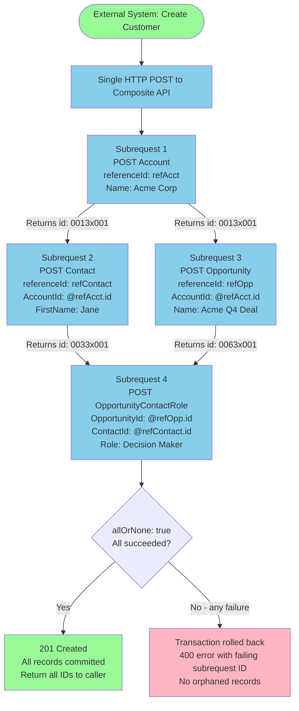
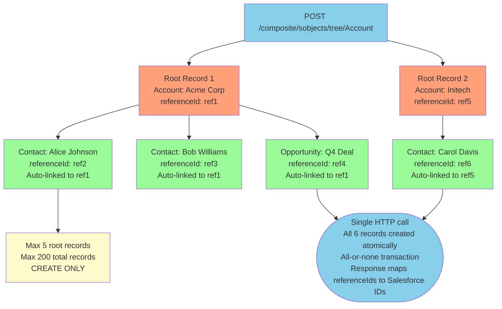
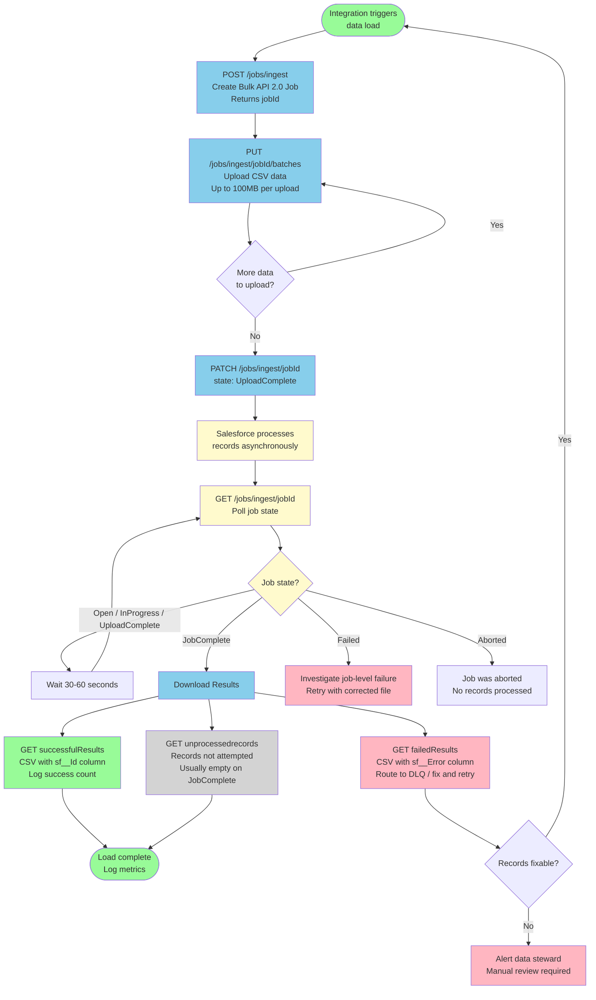

# Composite and Batch APIs

## Exam Domain
Integration Mechanisms — 24% of exam weight (Performance and Efficiency sub-domain)

## Foundations

Every HTTP request to Salesforce introduces latency. An external system making 25 individual REST API calls to create Account, Contact, and related records incurs 25 × (network RTT + Salesforce processing time). At 100ms per round trip, that is 2.5 seconds of sequential latency. The Composite API family exists to collapse multiple operations into single HTTP calls.

The architect's goal: **minimize round trips, maximize throughput, maintain transactional integrity where needed.**

The Composite API family has four members, each optimized for a different use case. The exam tests your ability to distinguish them precisely — the wrong choice creates either unnecessary complexity, missing transactional integrity, or limit violations.

---

## Core Concepts

### Composite API (Cross-Request References)

**The defining capability:** Composite API allows subrequests to reference the output of earlier subrequests in the same call. This is the key differentiator from Composite Batch.

**Endpoint:** `POST /services/data/vXX.0/composite`

**Request structure:**
```json
{
  "allOrNone": true,
  "collateSubrequests": true,
  "compositeRequest": [
    {
      "method": "POST",
      "url": "/services/data/v59.0/sobjects/Account",
      "referenceId": "refAccount",
      "body": {
        "Name": "Acme Corporation",
        "Industry": "Technology",
        "BillingCity": "San Francisco"
      }
    },
    {
      "method": "POST",
      "url": "/services/data/v59.0/sobjects/Contact",
      "referenceId": "refContact",
      "body": {
        "FirstName": "Jane",
        "LastName": "Smith",
        "Email": "jane@acme.com",
        "AccountId": "@{refAccount.id}"
      }
    },
    {
      "method": "POST",
      "url": "/services/data/v59.0/sobjects/Opportunity",
      "referenceId": "refOpportunity",
      "body": {
        "Name": "Acme - Q4 Deal",
        "AccountId": "@{refAccount.id}",
        "StageName": "Prospecting",
        "CloseDate": "2026-12-31",
        "Amount": 50000
      }
    },
    {
      "method": "GET",
      "url": "/services/data/v59.0/sobjects/Account/@{refAccount.id}",
      "referenceId": "refAccountRead"
    }
  ]
}
```

**Reference ID syntax:**
- `@{referenceId.fieldName}` — access a field from a previous subrequest response
- `@{refAccount.id}` — the `id` field from the Account creation response
- `@{refAccount.body}` — the entire response body
- `@{refAccount.httpHeaders.Location}` — a specific response header
- `@{refAccount.httpStatusCode}` — the HTTP status code

**The reference chain is forward-only:** Subrequest 3 can reference subrequests 1 and 2, but not subrequest 4.

#### allOrNone Parameter

**`allOrNone: true`** (recommended for most transactional use cases):
- If any subrequest fails, ALL subrequests are rolled back
- Provides ACID-like transaction semantics
- The response will show which subrequest failed and the reason
- Use when the records have logical dependency (Account must exist for Contact to be meaningful)

**`allOrNone: false`** (default):
- Each subrequest is independent
- A failed subrequest does not roll back successful ones
- The response shows success/failure per subrequest
- Use when partial success is acceptable (e.g., updating multiple unrelated records where some may not exist)

**Critical exam distinction:** `allOrNone` in Composite = **transaction control** (rollback on failure). `allOrNone` in Composite Batch = **halt behavior** (but there is no rollback — already-succeeded subrequests are not undone).

#### collateSubrequests

When `collateSubrequests: true`, Salesforce may execute independent subrequests in parallel for performance. When `false` (default), subrequests execute strictly in order.

**When to use `collateSubrequests: false`:** When subrequests have explicit or implicit ordering dependencies (e.g., subrequest 3 references subrequest 2's output). If using reference IDs, Salesforce respects the dependency regardless of collateSubrequests setting.

#### Composite API Limits

| Limit | Value |
|---|---|
| Max subrequests per call | 25 |
| Max query rows in a single Composite call | 2,000 (per the SOQL limit per request) |
| Max sObject Tree requests within a Composite | Nested sObject Tree is not supported; use standalone sObject Tree |
| Transaction boundary | `allOrNone: true` provides rollback |
| Counts against API limit | 1 call per Composite request (NOT 25) |
| Counts against concurrent API limit | 1 |

**Governor limits sharing:** All subrequests in a single Composite call share governor limits (DML statements, SOQL queries, heap size, CPU time). This is the most important operational consideration — if 25 subrequests each execute a SOQL query, that's 25 SOQL queries against the 100-query-per-transaction limit.

**Error handling pattern — reading the Composite response:**
```json
{
  "compositeResponse": [
    {
      "body": {"id": "0013x000...", "success": true},
      "httpHeaders": {"Location": "/services/data/v59.0/sobjects/Account/0013x000..."},
      "httpStatusCode": 201,
      "referenceId": "refAccount"
    },
    {
      "body": [{"message": "...", "errorCode": "REQUIRED_FIELD_MISSING", "fields": ["LastName"]}],
      "httpHeaders": {},
      "httpStatusCode": 400,
      "referenceId": "refContact"
    }
  ]
}
```

When `allOrNone: true` and a subrequest fails, the response includes `"message": "The transaction was rolled back since allOrNone is set to true and a subrequest failed."` for the subrequests that were rolled back.

#### Use Cases for Composite API

1. **Create parent + children atomically:** Create Account, then Contact referencing Account ID, then Opportunity referencing Account ID. With `allOrNone: true`.

2. **Read-after-write pattern:** Create a record, then immediately query to get the full record (with formula fields, auto-populated fields). Reference the new record's ID in the GET subrequest.

3. **Conditional chaining:** Create Account, read back the Account to get computed fields, then create Contact with data from the Account response.

4. **Upsert + update dependent record:** Upsert Account by external ID, then update a related Contact with the Account's ID.

---

### Composite Batch

**The defining capability:** Multiple independent subrequests in a single HTTP call. No cross-request references. No shared transaction.

**Endpoint:** `POST /services/data/vXX.0/composite/batch`

**Request structure:**
```json
{
  "haltOnError": false,
  "batchRequests": [
    {
      "method": "PATCH",
      "url": "/services/data/v59.0/sobjects/Account/0013x000001ABC",
      "richInput": {"BillingCity": "New York"}
    },
    {
      "method": "PATCH",
      "url": "/services/data/v59.0/sobjects/Account/0013x000001DEF",
      "richInput": {"BillingCity": "Los Angeles"}
    },
    {
      "method": "GET",
      "url": "/services/data/v59.0/sobjects/Contact/0033x000001GHI"
    },
    {
      "method": "DELETE",
      "url": "/services/data/v59.0/sobjects/Lead/00Q3x000001JKL"
    }
  ]
}
```

**Response:** Always HTTP 207 Multi-Status. Each `results` entry contains the HTTP status for that subrequest.

```json
{
  "hasErrors": true,
  "results": [
    {"statusCode": 204, "result": null},
    {"statusCode": 204, "result": null},
    {"statusCode": 200, "result": {"Id": "0033x000001GHI", "FirstName": "..."}},
    {"statusCode": 404, "result": [{"message": "...", "errorCode": "NOT_FOUND"}]}
  ]
}
```

#### haltOnError Parameter

**`haltOnError: false` (default):**
- Continue processing remaining subrequests even if one fails
- `hasErrors: true` in response if any subrequest failed
- Check each `statusCode` individually
- Use when operations are independent and partial success is acceptable

**`haltOnError: true`:**
- Stop processing at the first failure
- Remaining subrequests show `statusCode: 412` (Precondition Failed) with message "The request was aborted because haltOnError is set to true and a prior request failed."
- Already-completed subrequests are NOT rolled back (no transaction boundary)

**Critical distinction from Composite `allOrNone`:**
- Composite `allOrNone: true` = rollback on failure (transactional)
- Composite Batch `haltOnError: true` = stop on failure (NOT transactional, no rollback)

#### Composite Batch Limits

| Limit | Value |
|---|---|
| Max subrequests per call | 25 |
| Cross-request references | Not supported |
| Transaction guarantee | None |
| Response HTTP status | Always 207 Multi-Status |
| Counts against API limit | 1 call (NOT 25) |

#### Use Cases for Composite Batch

1. **Update multiple unrelated records:** Update 20 Accounts in different industries that have no relationship to each other. One HTTP call instead of 20.

2. **Mixed operations on independent records:** Update 10 Accounts, read 5 Contacts, delete 5 Leads — all in one HTTP call. No ordering dependency.

3. **UI performance optimization:** A Salesforce custom UI needs to load data from 5 different objects on page load. One Composite Batch call fetches all, rather than 5 sequential API calls.

4. **Parallel update confirmation:** After a bulk operation, confirm status of multiple records by GETing them in a single Composite Batch call.

---

### sObject Tree

**The defining capability:** Create a tree of parent and related child records in a single call, with referenceIds linking the hierarchy.

**Endpoint:** `POST /services/data/vXX.0/composite/sobjects/tree/{sObjectType}`

The `{sObjectType}` in the URL is the root object type.

**Request structure:**
```json
{
  "records": [
    {
      "attributes": {"type": "Account", "referenceId": "ref1"},
      "Name": "Acme Corp",
      "Industry": "Technology",
      "Contacts": {
        "records": [
          {
            "attributes": {"type": "Contact", "referenceId": "ref2"},
            "FirstName": "Alice",
            "LastName": "Johnson",
            "Email": "alice@acme.com"
          },
          {
            "attributes": {"type": "Contact", "referenceId": "ref3"},
            "FirstName": "Bob",
            "LastName": "Williams",
            "Email": "bob@acme.com"
          }
        ]
      },
      "Opportunities": {
        "records": [
          {
            "attributes": {"type": "Opportunity", "referenceId": "ref4"},
            "Name": "Acme Q4 Deal",
            "StageName": "Prospecting",
            "CloseDate": "2026-12-31",
            "Amount": 75000
          }
        ]
      }
    },
    {
      "attributes": {"type": "Account", "referenceId": "ref5"},
      "Name": "Initech Corp",
      "Industry": "Finance",
      "Contacts": {
        "records": [
          {
            "attributes": {"type": "Contact", "referenceId": "ref6"},
            "FirstName": "Carol",
            "LastName": "Davis",
            "Email": "carol@initech.com"
          }
        ]
      }
    }
  ]
}
```

**Response on success:**
```json
{
  "hasErrors": false,
  "results": [
    {"referenceId": "ref1", "id": "0013x000001AAA"},
    {"referenceId": "ref2", "id": "0033x000001BBB"},
    {"referenceId": "ref3", "id": "0033x000001CCC"},
    {"referenceId": "ref4", "id": "0063x000001DDD"},
    {"referenceId": "ref5", "id": "0013x000001EEE"},
    {"referenceId": "ref6", "id": "0033x000001FFF"}
  ]
}
```

#### sObject Tree Limits

| Limit | Value |
|---|---|
| Max root records | 5 |
| Max total records (all levels) | 200 |
| Operations supported | CREATE only (no update, no delete) |
| Transaction | All-or-none (any failure rolls back all) |
| Nesting depth | Limited by Salesforce relationship structure |

**"CREATE only" is the critical exam trap for sObject Tree.** If a question asks about updating existing records with their children, sObject Tree is wrong — use Composite API.

#### sObject Tree vs sObject Collections vs Composite

| Question | sObject Tree | sObject Collections | Composite |
|---|---|---|---|
| Need to create parent + auto-linked children? | Yes | No | Possible but complex |
| Need to UPDATE records? | No | Yes | Yes |
| Need more than 5 root records? | No | Yes (200) | Yes (25 subrequests) |
| Need cross-references in request? | Via referenceId | No | Yes (`@{ref.field}`) |
| Transaction guarantee? | Yes (all-or-none) | Optional (`allOrNone`) | Optional (`allOrNone`) |
| Mixed sObject types in single call? | Yes (parent + children) | Yes | Yes |

---

### sObject Collections

**The defining capability:** CRUD operations on up to 200 records of same or mixed sObject types in a single HTTP call. Synchronous. Per-record error reporting.

**Endpoints:**

| Operation | Method | Endpoint |
|---|---|---|
| Create | POST | `/services/data/vXX.0/composite/sobjects` |
| Update | PATCH | `/services/data/vXX.0/composite/sobjects` |
| Upsert | PATCH | `/services/data/vXX.0/composite/sobjects/{sObjectType}/{externalIdFieldName}` |
| Delete | DELETE | `/services/data/vXX.0/composite/sobjects?ids={id1},{id2}` |
| Read | GET | `/services/data/vXX.0/composite/sobjects?ids={id1},{id2}&fields={fields}` |

**Create request:**
```json
{
  "allOrNone": false,
  "records": [
    {
      "attributes": {"type": "Account"},
      "Name": "Acme Corp",
      "Industry": "Technology"
    },
    {
      "attributes": {"type": "Contact"},
      "FirstName": "Jane",
      "LastName": "Smith",
      "AccountId": "0013x000001XYZ"
    },
    {
      "attributes": {"type": "Lead"},
      "FirstName": "Bob",
      "LastName": "Jones",
      "Company": "Test Co",
      "Status": "New"
    }
  ]
}
```

Note: Mixed sObject types (Account, Contact, Lead) in a single request — this is unique to sObject Collections within the collection APIs.

**Update request:**
```json
{
  "allOrNone": true,
  "records": [
    {
      "attributes": {"type": "Account"},
      "id": "0013x000001AAA",
      "BillingCity": "Chicago"
    },
    {
      "attributes": {"type": "Account"},
      "id": "0013x000001BBB",
      "BillingCity": "Houston"
    }
  ]
}
```

**Response (per-record results):**
```json
[
  {"id": "0013x000001AAA", "success": true, "errors": []},
  {"id": "0013x000001BBB", "success": false, "errors": [
    {"statusCode": "FIELD_INTEGRITY_EXCEPTION", "message": "...", "fields": []}
  ]}
]
```

#### sObject Collections Limits

| Limit | Value |
|---|---|
| Max records per call | 200 |
| Transaction (allOrNone: true) | All fail or all succeed |
| Transaction (allOrNone: false) | Per-record commit/fail |
| Mixed sObject types | Supported |
| Returns HTTP | 200 with per-record results array |
| Counts against DML limit | 1 DML statement (not 200) |
| Counts against API limit | 1 API call |

**DML statement efficiency:** 200 records in one sObject Collections call = 1 DML statement. 200 individual REST calls = 200 API calls and more complex error handling. This is a critical architectural consideration when governor limits are a concern.

#### Use Cases for sObject Collections

1. **Bulk sync from external trigger:** An external event triggers an update to 80 Order records in Salesforce. One sObject Collections PATCH call instead of 80 individual REST calls.

2. **Mixed-type record creation:** Create 30 Accounts, 40 Contacts, and 30 Leads as part of a data import. One sObject Collections POST call (max 100 records, or split into batches of 200 max).

3. **Batch cleanup:** Delete 150 expired Lead records. One sObject Collections DELETE call.

4. **Read multiple known records:** GET specific fields from 100 known Opportunity IDs. One sObject Collections GET call.

---

### Bulk API Patterns (Revisited)

#### Bulk API 1.0 Job Lifecycle (Deep)

**State machine for a Bulk API 1.0 job:**

```
Open → Closed → Aborted
              ↓
         [Batches processing]
              ↓
       Batch States: Queued → InProgress → Completed / Failed / NotProcessed
```

**Step-by-step lifecycle:**

1. **Create Job:**
   ```
   POST /services/async/XX.0/job
   Content-Type: application/json
   {
     "operation": "upsert",
     "object": "Account",
     "externalIdFieldName": "External_Id__c",
     "contentType": "CSV",
     "concurrencyMode": "Parallel"
   }
   ```
   Returns `jobId`.

2. **Add Batches:**
   ```
   POST /services/async/XX.0/job/{jobId}/batch
   Content-Type: text/csv
   
   External_Id__c,Name,Industry
   EXT001,Acme Corp,Technology
   EXT002,Initech,Finance
   ```
   Returns `batchId`. Add multiple batches — each batch max 10,000 records, 10 MB.

3. **Close Job (triggers processing):**
   ```
   POST /services/async/XX.0/job/{jobId}
   {"state": "Closed"}
   ```
   Once closed, no more batches can be added. Processing begins.

4. **Monitor Job Status:**
   ```
   GET /services/async/XX.0/job/{jobId}
   ```
   Poll until `state` = `Closed` and all batches are `Completed` or `Failed`.

5. **Monitor Batch Status:**
   ```
   GET /services/async/XX.0/job/{jobId}/batch
   ```
   Returns all batches with their states and record counts.

6. **Retrieve Results:**
   ```
   GET /services/async/XX.0/job/{jobId}/batch/{batchId}/result
   ```
   Returns per-record result (success/failure, ID for successes, error message for failures).

7. **Close/Abort:**
   ```
   POST /services/async/XX.0/job/{jobId}
   {"state": "Aborted"}
   ```

**Bulk API 1.0 limits summary:**
| Parameter | Limit |
|---|---|
| Records per batch | 10,000 |
| File size per batch | 10 MB |
| Batches per job | 250 |
| Total records per 24 hours | 150,000,000 |
| Content types | CSV, XML, JSON |
| Concurrency modes | Parallel (default), Serial |

#### Bulk API 2.0 Simplified Flow

**Create Ingest Job:**
```
POST /services/data/vXX.0/jobs/ingest
{
  "operation": "upsert",
  "object": "Account",
  "externalIdFieldName": "External_Id__c",
  "contentType": "CSV",
  "lineEnding": "CRLF"
}
```

**Upload Data (PUT, not POST):**
```
PUT /services/data/vXX.0/jobs/ingest/{jobId}/batches
Content-Type: text/csv

External_Id__c,Name,Industry
EXT001,Acme Corp,Technology
EXT002,Initech,Finance
```
Multiple PUT calls can upload additional data. The data is accumulated until job is closed.

**Close Job:**
```
PATCH /services/data/vXX.0/jobs/ingest/{jobId}
{"state": "UploadComplete"}
```

**Monitor:**
```
GET /services/data/vXX.0/jobs/ingest/{jobId}
```
States: `Open` → `UploadComplete` → `InProgress` → `JobComplete`/`Aborted`/`Failed`

**Get Successful Records:**
```
GET /services/data/vXX.0/jobs/ingest/{jobId}/successfulResults
```
Returns CSV with original data + `sf__Id` column.

**Get Failed Records:**
```
GET /services/data/vXX.0/jobs/ingest/{jobId}/failedResults
```
Returns CSV with original data + `sf__Error` column describing the failure.

**Get Unprocessed Records:**
```
GET /services/data/vXX.0/jobs/ingest/{jobId}/unprocessedrecords
```

#### Bulk API 2.0 Query Jobs

For large data extracts:

```
POST /services/data/vXX.0/jobs/query
{
  "operation": "query",
  "query": "SELECT Id, Name, Industry FROM Account WHERE CreatedDate > 2026-01-01T00:00:00Z"
}
```

Poll until `state: JobComplete`, then retrieve results:
```
GET /services/data/vXX.0/jobs/query/{jobId}/results
```
Returns CSV with query results. For large result sets, `Sforce-Locator` header provides pagination for subsequent GET calls.

#### Failed Records Handling

In Bulk API 2.0, failed records are returned as a CSV from the `failedResults` endpoint. Each row includes:
- All original data fields
- `sf__Error` — error code and message
- `sf__Id` — empty (record was not created/updated)

**Retry strategy for failed records:**
1. Download failed records CSV
2. Fix the data errors (format issues, missing required fields, duplicate external IDs)
3. Upload corrected records in a new job

**Common failure causes:**
- `REQUIRED_FIELD_MISSING` — required fields empty in CSV
- `FIELD_INTEGRITY_EXCEPTION` — lookup field value doesn't exist
- `DUPLICATE_VALUE` — external ID collision
- `STRING_TOO_LONG` — field value exceeds max length
- `CANNOT_INSERT_UPDATE_ACTIVATE_ENTITY` — trigger/validation failure

---

### Comparison Table: All Composite and Batch APIs

| Feature | Composite | Composite Batch | sObject Tree | sObject Collections | Bulk API 1.0 | Bulk API 2.0 |
|---|---|---|---|---|---|---|
| Max records/call | 25 subrequests | 25 subrequests | 200 records | 200 records | 10K/batch, 250 batches | 150M/job |
| Cross-request refs | Yes | No | Via referenceId | No | No | No |
| Transaction control | allOrNone | No (haltOnError only) | All-or-none | allOrNone | Per-batch | Per-job |
| Synchronous? | Yes | Yes | Yes | Yes | No | No |
| Operations | CRUD, SOQL | Any REST | CREATE only | CRUD | CRUD, Upsert | CRUD, Upsert, Query |
| Mixed sObject types | Yes | Yes | Yes (parent + child) | Yes | No (one type per job) | No (one type per job) |
| API call cost | 1 call total | 1 call total | 1 call total | 1 call total | Multiple (job+batch calls) | Multiple (job+upload calls) |
| Response format | JSON with per-sub status | 207 Multi-Status | JSON with refs | Array of results | Async (poll for status) | Async (poll for status) |
| Endpoint prefix | `/composite` | `/composite/batch` | `/composite/sobjects/tree/` | `/composite/sobjects` | `/services/async/` | `/services/data/.../jobs/` |
| Use for real-time | Yes | Yes | Yes | Yes | No | No |
| Use for 10K+ records | Not appropriate | Not appropriate | Not appropriate | Not appropriate (200 max) | Yes | Yes |

---

### When to Use Which — Decision Framework

**Step 1: Volume gate**
- 200+ records per operation → Bulk API (no exception)
- 201–10,000 records, batch context → Bulk API
- 1–200 records, synchronous needed → sObject Collections or Composite
- 1–25 operations, mix of types → Composite or Composite Batch

**Step 2: Dependency check**
- Records depend on each other (parent before child, use parent ID) → Composite API
- Records are independent → Composite Batch or sObject Collections

**Step 3: Transaction requirement**
- All-or-nothing required → Composite (allOrNone: true) or sObject Collections (allOrNone: true)
- Partial success acceptable → Composite Batch (haltOnError: false) or sObject Collections (allOrNone: false)

**Step 4: Hierarchy creation**
- Creating parent + children in one shot, no existing parent → sObject Tree
- Updating existing parent + creating children → Composite API

**Step 5: Real-time vs batch**
- Response needed immediately (user is waiting) → All synchronous APIs
- Background processing OK → Bulk API

---

### Performance Considerations

#### HTTP Round Trips Saved

**Scenario:** Create 1 Account, 3 Contacts, 2 Opportunities (6 records total)

| Approach | HTTP Round Trips | API Calls Consumed |
|---|---|---|
| 6 individual REST calls | 6 | 6 |
| Composite API (6 subrequests) | 1 | 1 |
| sObject Tree (1 parent, 5 children) | 1 | 1 |
| sObject Collections (6 records) | 1 | 1 (but no parent-child auto-link) |

**Latency impact at 150ms per round trip:**
- 6 individual calls: ~900ms
- 1 Composite call: ~180ms
- Improvement: ~5x

At scale (1,000 such operations per hour), the savings become dramatic: 6,000 API calls/hour vs 1,000 API calls/hour. This directly impacts daily API limit consumption.

#### Governor Limits Impact

**Composite API governor limit sharing — exam-critical:**

All subrequests in a single Composite call share the same governor limits:

| Governor | Per-Transaction Limit | Implication |
|---|---|---|
| DML statements | 150 | 25 sObject CRUD subrequests = 25 DML statements |
| SOQL queries | 100 | 10 SOQL subrequests = 10 queries |
| Heap size | 6 MB (sync Apex context from triggers) | Large Composite payloads + trigger processing |
| CPU time | 10,000ms | Complex trigger chains per subrequest compound |

**Practical limit:** If each of 25 Composite subrequests triggers an Apex trigger that runs a SOQL query, that's 25 SOQL queries from triggers alone — plus any queries in the subrequests themselves. Complex trigger chains can exhaust limits within a single Composite call.

**Heap size with large payloads:**
- Each subrequest's request and response body consumes heap
- 25 subrequests each with 100KB payload = 2.5 MB of data
- Triggers processing those records add to heap consumption
- Monitor for HEAP_SIZE_LIMIT_EXCEEDED errors in high-volume Composite calls

#### Optimal Chunking Strategy

When dealing with more records than any single call supports:

**For sObject Collections (200-record limit):**
```
Total records: 1,500
Calls needed: Math.ceil(1500 / 200) = 8 calls
Each call: 200 records (except last: 100)
```

**For Composite API (25-subrequest limit):**
```
Total operations: 100 (50 Accounts, 50 Contacts each depending on an Account)
Pattern: 25 Composite calls, each creating 2 Account + 2 Contact pairs
Each call: Account[1] + Contact[1] + Account[2] + Contact[2] + ... (4 subrequests per pair)
```

**For Bulk API — determining batch size:**
Batch size = min(10,000, file_size_limit). Optimal is usually 5,000–7,500 records per batch for balance between processing efficiency and retry granularity (smaller batches = smaller retry scope when a batch fails).

---

## PTA / SA Relevance

### When This Comes Up in Engagements

**Integration Performance Reviews:** The most common finding in integration performance reviews is excessive API calls caused by record-by-record processing. The fix is almost always: move to sObject Collections or Composite API. The PTA can quantify the improvement: "Your current integration makes 3,000 API calls per batch run; with sObject Collections this becomes 15 calls (200 records each). Your daily API limit exposure drops by 99.5%."

**Salesforce-to-Salesforce (S2S) Integration:** When two Salesforce orgs integrate, each REST call from Org A to Org B consumes Org B's API limit. Using Composite and sObject Collections dramatically reduces this consumption. Composite Batch is ideal for the "sync N records" pattern that appears in many S2S integrations.

**Order-of-Operations Record Creation:** The most common real-world use of Composite API is the Account + Contact + Opportunity creation pattern from an external CRM, ERP, or CPQ tool. The PTA should be able to whiteboard this pattern from memory — it appears in architecture discussions, proof-of-concept builds, and exam scenarios.

**Data Migration Project Sizing:** When sizing a data migration (how long will it take?), the PTA needs to estimate:
- Record count per object
- Records per Bulk API batch (assume 7,500)
- Batch processing time (variable, typically 2-5 min per batch per object)
- Parallel job capacity (Salesforce limits concurrent Bulk jobs per org)

### Common Architecture Failures

1. **Using Composite for 200-record updates when sObject Collections is simpler:** Developer writes 25 subrequests per Composite call, chaining them, when all 200 records are independent Account updates. sObject Collections handles 200 records per call with less code and no subrequest management overhead.

2. **Missing allOrNone in Composite for dependent records:** Composite creates Account then Contact. `allOrNone: false`. Contact creation fails (missing required field). Account is committed to the database — orphaned Account with no Contact. `allOrNone: true` would have rolled back both.

3. **Treating Composite Batch haltOnError as a rollback:** Developer assumes `haltOnError: true` means failed operations are rolled back. It does not. Subrequests that already succeeded are committed. Only future subrequests are halted.

4. **Bulk API for real-time user-facing operations:** User submits a form; system starts a Bulk API job to save the data. User waits for a confirmation. Bulk API takes 5+ minutes. User thinks the system is broken. Correct pattern: sObject Collections for the immediate save, then Bulk API for the overnight bulk reconciliation.

5. **Not handling `failedResults` in Bulk API 2.0:** System runs Bulk API job, gets `JobComplete` status, assumes all records loaded successfully. Does not download `failedResults`. Silent data loss. Fix: always download and process both `successfulResults` and `failedResults` at the end of every Bulk job.

6. **sObject Tree for updates:** Developer designs a flow to update an Account and its Contacts together. Uses sObject Tree. System throws errors because sObject Tree is CREATE-only. Should use Composite API with PATCH subrequests.

### Enterprise Patterns

**Transactional API Facade Pattern:** An external system's "Create Customer" operation maps to Account + Contact + Contract in Salesforce. The integration middleware calls one internal endpoint; behind it, a single Composite API call with `allOrNone: true` creates all three records atomically. The external system never sees partial state.

**Incremental Sync with sObject Collections:** A nightly integration syncs changed records from an ERP. Change detection happens in the ERP. Records queued in memory. Every 200 records, an sObject Collections PATCH call fires. Progress checkpointed every batch. On failure, retry from last checkpoint (not from the beginning).

**Bulk ETL Pipeline Pattern:**
1. Extract from source system → staged in S3 or Azure Blob
2. Transform in AWS Lambda / Azure Function
3. Load: Bulk API 2.0 ingest job, CSV file from staged store
4. Monitor job status (polling every 60 seconds)
5. Download `failedResults`, route to error DLQ
6. Alert on success + failure counts

This is the standard cloud-native ETL pattern for Salesforce data loading.

---

## Architecture

### Composite API Reference ID Chain



### sObject Tree Structure Diagram



### Bulk API Job Lifecycle



**Limitations and Tradeoffs:**

**Composite API:**
- 25 subrequest limit constrains how much work can be done per call. Large operations must be chunked into multiple Composite calls.
- Governor limits are shared — complex trigger chains per subrequest can exhaust DML, SOQL, CPU limits within a single call.
- Reference ID chain means debugging failures requires mapping response errors back to the referenceId — more complex error handling than individual REST calls.
- `allOrNone: true` with retry: if the call fails and is retried, already-committed records (on `allOrNone: false` calls) may cause duplicate creation. Design idempotent operations.

**Composite Batch:**
- No transaction guarantee — partial success is the expected outcome on any error. Systems depending on Composite Batch must handle partial state.
- 207 Multi-Status is always returned (even on 100% failure). Middleware must parse response body, not just HTTP status code, to detect errors.
- No cross-references limits usefulness for dependent record creation patterns.

**sObject Tree:**
- CREATE only is the hardest constraint. Any update/upsert requirement disqualifies it immediately.
- 5 root record limit may seem restrictive but is sufficient for most "create customer" patterns.
- All-or-none transaction is actually an advantage but means any child record validation failure rolls back all parent records too.

**sObject Collections:**
- 200-record limit requires chunking for larger datasets. The chunking logic must be implemented by the integration middleware.
- Mixed sObject types work but all records must be sent in the correct DML-allowed combinations (e.g., can't mix objects with conflicting sharing rules in single operation).
- `allOrNone: false` requires per-record result checking — the integration must iterate the response array and handle individual failures.

**Bulk API:**
- Minimum latency of several minutes even for small files. Completely unsuitable for user-facing synchronous operations.
- Bulk API jobs consume governor limits on the processing side (Apex triggers fire, rules execute). High-volume loads can trigger org-wide performance degradation if not scheduled during off-peak hours.
- Bulk API 1.0 has complex batch management; Bulk API 2.0 simplifies this but CSV-only format may require format conversion from source systems.

---

## Key Facts to Memorize

- Composite endpoint: `/composite`, max 25 subrequests, supports cross-references (`@{ref.field}`), `allOrNone`
- Composite Batch endpoint: `/composite/batch`, max 25, NO cross-references, `haltOnError`, returns 207
- sObject Tree endpoint: `/composite/sobjects/tree/{Type}`, max 5 root records, max 200 total, CREATE ONLY, all-or-none
- sObject Collections endpoint: `/composite/sobjects`, max 200 records, CRUD, `allOrNone`, mixed types
- Composite `allOrNone: true` = transaction rollback on failure
- Composite Batch `haltOnError: true` = stop, no rollback
- sObject Collections = 1 DML statement (not 200) against governor limit
- Bulk API 1.0: job/batch model, CSV/XML/JSON, 10K records/batch, 250 batches/job, Serial/Parallel
- Bulk API 2.0: simplified, CSV only, single upload, `UploadComplete` state, `/jobs/ingest` path
- Bulk API 2.0 query jobs: `/jobs/query`, Sforce-Locator header for pagination
- Bulk API result endpoints: `successfulResults`, `failedResults`, `unprocessedrecords`
- All Composite family calls = 1 API call (not per-subrequest billing)
- sObject Tree is all-or-none by design (not configurable)
- Composite Batch response body: `hasErrors` + `results` array with per-subrequest `statusCode`

---

## Exam Traps

1. **sObject Tree is CREATE only.** If the question mentions updating, patching, or upserting existing records, sObject Tree is wrong.

2. **Composite allOrNone vs Composite Batch haltOnError are different mechanisms.** `allOrNone` provides true rollback. `haltOnError` just stops — already-completed subrequests remain committed. This distinction determines correctness for transactional scenarios.

3. **Composite Batch always returns 207.** A common distractor is saying Composite Batch returns 200 on success. It always returns 207 Multi-Status — even when all subrequests succeed. The `hasErrors: false` in the body indicates full success.

4. **sObject Collections max 200 records, not 25.** Composite and Composite Batch have the 25 subrequest limit. sObject Collections goes up to 200 records. These limits are mixed up in many exam questions.

5. **Bulk API is never real-time.** Any exam scenario requiring immediate response to a user, real-time notification, or synchronous confirmation eliminates Bulk API.

6. **API call cost:** One Composite call with 25 subrequests = 1 API call against the daily limit, not 25. This is explicitly stated in Salesforce documentation and a common exam differentiation.

7. **sObject Tree nesting depth.** sObject Tree nests by relationship. You cannot create two levels of children arbitrarily — the nesting must follow Salesforce's actual parent-child relationships. If a question describes creating Account > Contact > ContactRelation where the last level isn't a child of Contact in Salesforce schema, sObject Tree can't do it.

8. **Bulk API 1.0 vs 2.0 path difference.** Bulk API 1.0 uses `/services/async/XX.0/`. Bulk API 2.0 uses `/services/data/vXX.0/jobs/`. Exam may test which endpoint is correct for a described scenario.

---

## Practice Questions

**Question 1**

An integration architect is designing a solution for an e-commerce platform that needs to create a customer record in Salesforce for each new order. Each customer creation must result in one Account, one Contact linked to that Account, and one Order__c (custom object) linked to both. All three records must be created atomically — if any record creation fails, none should be committed. The operation must complete synchronously within 2 seconds. Which API is most appropriate?

A) Composite API with allOrNone: true and cross-request reference IDs  
B) sObject Tree API for Account with nested Contact and Order__c  
C) Composite Batch with haltOnError: true  
D) Bulk API 2.0 with a single-record CSV file  

**Answer: A**

Explanation: Composite API with `allOrNone: true` provides the atomic transaction guarantee. Cross-request reference IDs allow Contact and Order__c to reference the Account ID returned from the first subrequest — without this, you'd need two round trips (first create Account, then create the others). sObject Tree (option B) is CREATE-only and could work for Account + Contact, but Order__c may not be a standard child relationship supported by sObject Tree, and the tree structure doesn't accommodate three-way references. Composite Batch `haltOnError: true` stops on failure but does NOT roll back already-committed records — not atomic. Bulk API 2.0 is asynchronous and cannot complete within 2 seconds.

---

**Question 2**

A middleware integration receives a batch of 180 updated Account records from an ERP system every hour. The integration must update these Accounts in Salesforce as quickly as possible. Partial success is acceptable — if some records fail, the successful ones should still be updated. Which API provides the most efficient implementation?

A) Composite Batch with multiple calls (7 × 25 subrequests + 1 × 5 subrequests)  
B) Individual PATCH calls for each Account in a loop  
C) sObject Collections PATCH with allOrNone: false, up to 200 records per call  
D) Bulk API 2.0 upsert job with the 180 records as a CSV  

**Answer: C**

Explanation: sObject Collections PATCH handles up to 200 records in a single synchronous HTTP call with `allOrNone: false` for partial success. 180 records fits in one call — no chunking needed. Per-record result status is returned in the response array. Composite Batch would require 8 calls (7 × 25 + 5) versus 1 call for sObject Collections. Individual PATCH calls consume 180 API credits. Bulk API 2.0 is asynchronous and has multi-minute latency — the "as quickly as possible" requirement eliminates it.

---

**Question 3**

An integration architect reviews a Composite API implementation. The call has 25 subrequests. Six of the subrequests execute SOQL queries. The other 19 perform DML on different sObjects, all of which have Apex triggers. The triggers each execute 3 SOQL queries. The architect identifies a potential issue. What is it?

A) Composite API only supports 5 SOQL queries per call  
B) The 19 DML subrequests exceed the 15-DML-statement limit  
C) Trigger SOQL queries count against the shared governor limit — 6 subrequest queries + 57 trigger queries = 63, risking the 100-query limit with any additional trigger overhead  
D) Composite API cannot mix SOQL query subrequests with DML subrequests  

**Answer: C**

Explanation: All subrequests in a Composite call share a single transaction's governor limits. The 6 SOQL query subrequests use 6 queries. Each of the 19 DML subrequests triggers an Apex trigger running 3 SOQL queries = 57 trigger queries. Total: 63 SOQL queries from known code paths. If any trigger has additional queries (e.g., helper methods, validation queries), the 100-query limit could be exceeded. Option A is incorrect — there's no 5-SOQL limit for Composite (there is a query row limit, but not a 5-query limit). Option B is incorrect — 19 DML statements is within the 150 limit, and sObject Collections reduces this further. Option D is incorrect — Composite supports mixed subrequest types.

---

**Question 4**

A data operations team runs a weekly Bulk API 2.0 job that loads 500,000 updated Contact records. After a recent run, the team notices that 12,000 records failed. The `failedResults` CSV shows `FIELD_INTEGRITY_EXCEPTION` errors for the `AccountId` field. How should the architect guide the team to resolve this?

A) Retry the entire job — Bulk API 2.0 will automatically retry failed records  
B) Download the failedResults CSV, identify the invalid AccountIds, correct them in the source system, and submit a new ingest job with only the corrected records  
C) Change the `allOrNone` setting to false so failed records don't block successful ones  
D) Switch to Bulk API 1.0 Serial mode to avoid record lock issues  

**Answer: B**

Explanation: `FIELD_INTEGRITY_EXCEPTION` on `AccountId` means the Contact records reference AccountIds that don't exist in Salesforce. Bulk API 2.0 does not automatically retry — the job is complete with failures. The correct process is to download the `failedResults` CSV, identify which AccountIds are invalid (source data error), fix the source data (ensure Accounts exist), and submit a new ingest job with only the corrected records. Option A is wrong — no automatic retry. Option C (`allOrNone: false` is already the default in Bulk API) is irrelevant since the successful records already committed. Option D is wrong — `FIELD_INTEGRITY_EXCEPTION` is a data quality issue, not a record lock issue — Serial mode doesn't help.

---

**Question 5**

An architect is designing an integration where a CPQ (Configure-Price-Quote) system needs to update 300 Opportunity records in Salesforce after a pricing calculation completes. The update must be synchronous (the CPQ system waits for confirmation). The records are independent of each other. Which approach is recommended?

A) Composite API with 25 subrequests per call, 12 calls total  
B) Bulk API 2.0 upsert job  
C) sObject Collections PATCH calls: 2 calls of 150 records each  
D) sObject Tree API for Opportunities  

**Answer: C**

Explanation: sObject Collections PATCH handles up to 200 records per call synchronously. 300 records requires 2 calls (150 + 150, or 200 + 100). The records are independent updates (no cross-record references), so Composite API's cross-reference feature isn't needed. Two sObject Collections calls is simpler to implement and returns synchronous confirmation per record. Composite API (option A) would require 12 calls with 25 subrequests each — more HTTP round trips and more complex code. Bulk API 2.0 is asynchronous — the CPQ system can't wait for it. sObject Tree is CREATE-only and cannot update existing Opportunities.
