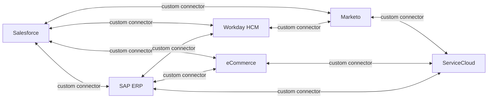
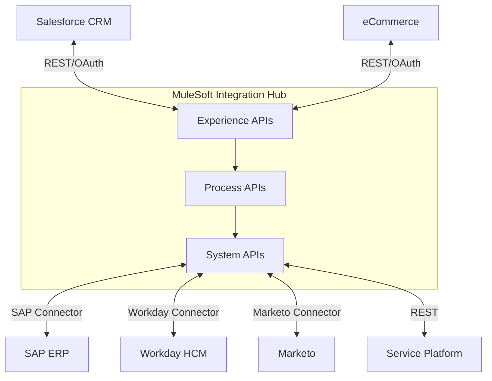
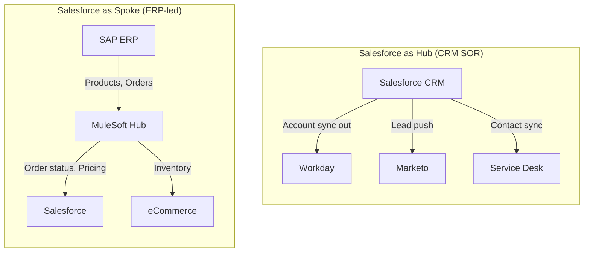

# Point-to-Point vs Hub-and-Spoke Integration Architecture

## Exam Domain
Integration Architecture Patterns — ~20% of exam weight (Integration Architecture Design domain)

## Foundations

### What Integration Architecture Solves

Modern enterprises run dozens to hundreds of systems: CRM, ERP, HCM, marketing automation, eCommerce, data warehouse, custom apps. These systems must share data and trigger processes across boundaries. Integration architecture defines *how* those connections are structured — not just technically, but organizationally and operationally.

The two dominant topology models are **Point-to-Point (P2P)** and **Hub-and-Spoke**. Choosing between them — or migrating from one to the other — is one of the most consequential architectural decisions in enterprise software.

---

## Core Concepts

### Point-to-Point (P2P) Integration

**Definition**: Each system integrates directly with every other system it needs to communicate with. There is no intermediary — System A calls System B's API, System B calls System C's API, and so on.

**How it works**:
- System A has a connector/adapter built specifically to talk to System B
- The connector handles authentication, data transformation, protocol negotiation, and error handling
- Each connection is bespoke — built and maintained independently

**The n*(n-1) Problem**:

With `n` systems, P2P requires `n*(n-1)` directional connections (or `n*(n-1)/2` bidirectional pairs).

| Systems | Connections (P2P) | Connections (Hub-and-Spoke) |
|---------|------------------|----------------------------|
| 2       | 2                | 2                          |
| 5       | 20               | 5                          |
| 10      | 90               | 10                         |
| 20      | 380              | 20                         |
| 50      | 2,450            | 50                         |

This is the fundamental business case for middleware. At 10 systems, you have 9x more connections to build and maintain with P2P vs hub-and-spoke. At 50 systems, that's 49x.

**When P2P is acceptable**:
- 2–3 stable systems with infrequent changes
- One-off migration that runs once and is decommissioned
- Internal team owns both endpoints and can coordinate changes
- No regulatory requirement for integration governance/audit
- Startup-phase companies where speed matters more than scalability
- Low-risk, read-only data flows

**Benefits of P2P**:
- Simple to understand and explain
- No middleware dependency — reduces single points of failure for that connection
- Faster initial delivery (no platform setup)
- Lower initial cost (no middleware license)
- Direct connection = lower latency for synchronous flows

**Drawbacks of P2P**:
- Exponential complexity as systems grow
- No central monitoring — each integration must be separately instrumented
- Schema changes in one system require updating all connecting systems
- No reusability — each connector is one-off
- Impossible to enforce consistent security policies, rate limits, or SLAs
- Error handling is duplicated across all connectors
- Onboarding a new system requires N new connectors
- Testing and deployment are uncoordinated
- Integration knowledge is siloed in individual teams
- "Spaghetti architecture" — difficult to reason about data flow

---

### Hub-and-Spoke Architecture

**Definition**: All systems connect to a central hub (integration platform), which is responsible for routing, transforming, and delivering messages between systems. Systems (spokes) only need to know how to talk to the hub, not to each other.

**How it works**:
1. Spoke A publishes a message to the hub (or the hub polls Spoke A)
2. The hub applies business rules: routing, transformation, enrichment, filtering
3. The hub delivers the message to one or more target spokes
4. Spokes receive messages in their native format

**The n connections model**:
- Each spoke connects to the hub once
- The hub handles all routing logic centrally
- Adding a new spoke = 1 new connection, regardless of how many other spokes exist

**Hub responsibilities**:
- **Message routing**: determining where messages should go
- **Protocol mediation**: REST → SOAP, HTTP → JMS, etc.
- **Data transformation**: canonical model mapping, field mapping
- **Security enforcement**: OAuth validation, IP filtering, encryption
- **Reliability**: retry logic, dead letter queues, acknowledgment
- **Monitoring**: centralized logging, alerting, dashboards
- **Governance**: API versioning, SLA enforcement, audit trails

**Canonical Data Model (CDM)**:
A key concept in hub-and-spoke. Instead of each spoke translating directly to every other spoke's format, each spoke translates to/from a *canonical* (standard) format. The hub speaks canonical; spokes translate at the boundary.

Benefits of CDM:
- Adding a new spoke = write 2 transformations (to canonical, from canonical), not N transformations
- Schema changes in one system only affect that system's transformation layer
- Canonical model serves as enterprise data dictionary

**Single Point of Failure (SPOF) Concern**:
The hub is both the hub's strength and its risk. If the hub goes down, all integrations stop.

Mitigation strategies:
- Active-active hub clustering
- Geographic redundancy
- Circuit breaker patterns at spoke level (fail fast, queue locally)
- Asynchronous messaging with durable queues so messages survive hub restarts
- SLA monitoring and automated failover
- Well-defined hub maintenance windows with spoke retry buffers

---

### Synchronous vs. Asynchronous Spokes

**Synchronous spokes**:
- Request-response pattern
- Spoke waits for hub to respond before proceeding
- Use cases: real-time data retrieval, transactional operations where confirmation is required
- Failure mode: hub unavailability blocks the calling process

**Asynchronous spokes**:
- Fire-and-forget pattern
- Spoke publishes to hub's message queue; hub processes when ready
- Use cases: event-driven notifications, batch processing, decoupled systems
- Failure mode: message queued even if hub is temporarily unavailable; eventual consistency

**Star Topology vs. Hub-and-Spoke**:
These terms are often used interchangeably but have a subtle difference:
- **Star topology**: describes the *physical/logical connection pattern* — one central node, all others connect to it
- **Hub-and-spoke**: describes the *functional pattern* — the hub has active intelligence (routing, transformation); pure star could be passive
In enterprise integration, hub-and-spoke is star topology *with* business logic at the center.

---

### Service Bus vs. Message Broker vs. API Gateway

These three are often confused. They serve overlapping but distinct purposes:

| Component | Primary Purpose | Protocol Focus | Examples |
|-----------|----------------|---------------|---------|
| **Enterprise Service Bus (ESB)** | Heavy transformation, orchestration, protocol mediation | SOAP, JMS, AMQP, HTTP | MuleSoft, IBM App Connect, Oracle SOA Suite |
| **Message Broker** | Reliable async message delivery, pub/sub, queuing | AMQP, MQTT, Kafka protocol | RabbitMQ, Apache Kafka, AWS SQS/SNS |
| **API Gateway** | API management, security enforcement, rate limiting | HTTP/REST | AWS API Gateway, Kong, Apigee, MuleSoft API Manager |

**Key distinction for the exam**:
- ESB = full integration platform (can do everything, heavy)
- Message Broker = focused on reliable delivery, not transformation
- API Gateway = focused on security and traffic management, not transformation or routing logic
- Modern iPaaS (MuleSoft, Boomi, Informatica) blends all three

---

### Federated Integration Pattern

**Definition**: No central hub. Each system exposes APIs; consumers call those APIs directly, but through a shared API catalog or service mesh.

**How it differs from P2P**:
- APIs are discoverable (API catalog)
- Consistent security standards (service mesh enforces mTLS)
- Consistent observability (service mesh collects telemetry)
- But: no central transformation, no orchestration logic

**When to use**:
- Microservices architectures where services are owned by independent teams
- Cloud-native environments with mature API standards
- When transformation needs are minimal (systems speak compatible formats)
- API economy scenarios where you're exposing to external consumers

**Risk**: Can devolve into P2P spaghetti if API catalog is not maintained and standards are not enforced.

---

### Salesforce as Hub vs. Salesforce as Spoke

This is a critical architectural decision that comes up in every enterprise integration conversation.

**Salesforce as Hub (System of Record)**:
- Salesforce owns the canonical version of customer/account/contact data
- Other systems (marketing automation, service desk, partner portals) pull from Salesforce
- Salesforce is the source of truth; changes in Salesforce propagate outward
- CRM data flows outward from Salesforce to downstream systems
- Use when: Salesforce is the primary business system, customer data is Salesforce-native

**Salesforce as Spoke (Consumer)**:
- Another system (ERP, data warehouse, HCM) is the master
- Salesforce receives data from the hub
- Salesforce displays data but doesn't own it
- Use when: ERP owns financial/order data; Salesforce needs visibility but shouldn't be the source

**Mixed Architecture (most common in enterprise)**:
- Salesforce is hub for *some* domains: accounts, contacts, opportunities, cases
- Salesforce is spoke for *other* domains: products (owned by ERP), employees (owned by HCM), financials (owned by ERP)
- The hub (MuleSoft/Boomi) mediates between all domains

**Real enterprise pattern**:

```
Salesforce (CRM SOR) <-> MuleSoft (Integration Hub) <-> SAP S/4HANA (Finance/Order SOR)
                                    ^
                            Workday (HCM SOR)
                                    ^
                            Marketo (Marketing SOR)
```

---

### Migration Path: P2P to Hub-and-Spoke

A common engagement scenario: customer has 15+ P2P integrations (built over 5–10 years) and wants to modernize.

**Discovery approach**:
1. Integration inventory: document all existing integrations (source, target, direction, protocol, volume, SLA, owner)
2. Dependency mapping: which systems change most frequently? Which have the most connections?
3. Pain point analysis: which integrations break most often? What's the operational cost?
4. Prioritization matrix: high pain + high connection count = first candidates to migrate

**Migration strategy**:
- **Strangler fig pattern**: route traffic through hub progressively, retire P2P connections as hub connections are proven
- **High-value first**: migrate the most painful P2P connections first (quick wins + de-risk)
- **Platform-as-router**: introduce the hub as a pass-through first (no transformation), then gradually add intelligence
- **Canonical model last**: don't design the perfect canonical model before migrating — let it emerge from the first 3–5 integrations

**What to avoid**:
- Big bang migration (high risk, long runway)
- Designing the canonical model in a committee for 6 months before building anything
- Migrating low-value stable integrations first (no business benefit, no risk reduction)

---

## PTA / SA Relevance

### When This Comes Up in Engagements

- **Discovery workshops**: when a customer says "we have integrations everywhere and nothing talks to each other properly" — this is P2P spaghetti
- **Architecture reviews**: auditing existing integration topology before proposing a new system (e.g., adding Salesforce to an existing landscape)
- **MuleSoft proposals**: the business case for MuleSoft almost always starts with the P2P → hub-and-spoke story
- **Data quality conversations**: P2P architectures often cause duplicate/inconsistent data because each system syncs differently
- **Digital transformation programs**: the hub-and-spoke architecture is foundational to multi-cloud, API economy strategies

### How to Identify P2P Spaghetti in Customer Discovery

Ask these questions:
- "How many integrations do you have? Who owns each one?"
- "When System X changes (e.g., ERP upgrade), how many integrations break?"
- "Who monitors integration failures? How do you find out when an integration stops working?"
- "How long does it take to add a new system to the landscape?"
- "Do you have documentation for all your integrations?"

Red flags:
- "We have spreadsheets somewhere with the integration list"
- "Each team built their own"
- "The SAP team and Salesforce team don't talk to each other"
- "We have a lot of custom code in Salesforce calling external systems"
- Large number of Salesforce Apex callouts to different endpoints

### Common Architecture Failures

1. **Ignoring the SPOF risk** of the hub: deploying a single-node MuleSoft instance in production
2. **No canonical model**: hub-and-spoke in topology only; each integration still does custom mapping
3. **Hub as dump**: using the hub as a pass-through with no governance — same spaghetti, just routed through one place
4. **Async/sync mismatch**: using synchronous integration where async would be more resilient
5. **Overloading the hub**: putting too much business logic in the hub, making it a monolith
6. **No versioning strategy**: hub APIs change and break all spokes simultaneously

### Enterprise Patterns

**Pattern 1: MuleSoft as integration hub**
- MuleSoft sits between Salesforce, SAP, Workday
- System APIs expose each backend
- Process APIs implement business processes (e.g., order-to-cash, hire-to-retire)
- Experience APIs serve Salesforce, mobile, web consumers
- All spokes connect to MuleSoft; MuleSoft owns the canonical model

**Pattern 2: Event-driven hub-and-spoke**
- Hub is Apache Kafka or AWS EventBridge
- Spokes publish/subscribe to topics
- Salesforce publishes via Platform Events or Change Data Capture
- Asynchronous, highly scalable, but complex to debug and govern

**Pattern 3: API Management layer over P2P**
- First step in modernization: put API Gateway (Apigee, Kong) in front of existing P2P connections
- Adds security, monitoring, rate limiting without replacing connections
- Doesn't solve canonical model or routing problems, but reduces operational pain
- Buy time while full hub-and-spoke is designed and built

---

## Architecture

### Before: P2P Complexity



### After: Hub-and-Spoke with MuleSoft



### Salesforce as Hub vs. Spoke



**Limitations & Tradeoffs:**

| Aspect | P2P | Hub-and-Spoke |
|--------|-----|---------------|
| Initial cost | Low | High (platform + design) |
| Long-term cost | Very high (maintenance) | Lower (centralized) |
| Latency | Low (direct) | Slightly higher (hub overhead) |
| Scalability | Poor (exponential) | Good (linear) |
| Resilience | No SPOF, but brittle | SPOF risk at hub, mitigated by HA |
| Governance | None | Centralized |
| Visibility | Poor | Excellent |
| Canonical model | Not possible | Natural fit |
| Time to first integration | Fast | Slower |
| Time to nth integration | Very slow | Fast |

---

## Key Facts to Memorize

- `n*(n-1)` connections for P2P with n systems
- Hub-and-spoke uses `n` connections
- 10 systems = 90 P2P connections vs 10 hub-and-spoke connections
- Canonical Data Model: each spoke translates to/from hub format, not to each other
- ESB = transformation + orchestration + routing; API Gateway = security + traffic; Message Broker = reliable async delivery
- Salesforce can be hub (CRM SOR) or spoke (ERP-led landscapes) — most enterprises have both roles
- SPOF risk of hub mitigated by: HA clustering, durable queues, circuit breakers
- Federated pattern = no central hub, shared API catalog + service mesh governance
- Strangler fig = migration approach for P2P → hub-and-spoke: incremental, not big-bang

---

## Exam Traps

1. **"Hub-and-spoke eliminates single points of failure"** — FALSE. Hub is a SPOF; must be mitigated with HA.
2. **"P2P is always wrong"** — FALSE. For 2–3 stable integrations, P2P is fine.
3. **"API Gateway is an ESB"** — FALSE. API Gateway does security/traffic; ESB does transformation/orchestration.
4. **"Salesforce is always the hub"** — FALSE. In ERP-centric landscapes, Salesforce is a spoke.
5. **"Hub-and-spoke means all integrations are synchronous"** — FALSE. Hub can handle both sync and async.
6. **"Federated integration = P2P"** — NOT exactly. Federated has governance (API catalog, service mesh); P2P has none.
7. **"Canonical model must be designed first before any integration"** — FALSE. Best practice is to let it emerge iteratively.

---

## Practice Questions

**Question 1**
A large enterprise has 15 systems that all need to share data. Their current architecture has direct API connections between systems. A new system needs to be onboarded. What is the maximum number of new connections that would need to be built in a P2P architecture to fully connect the new system to all existing systems?

A) 1
B) 15
C) 30
D) 105

**Answer: B — 15**

With 15 existing systems, onboarding a 16th in P2P requires connecting it to all 15 existing systems (one connection per existing system = 15 connections). Total connections would go from 15*14=210 to 16*15=240, an increase of 30 if counting directional connections. The 15 represents the new connections to/from the new system in each direction. In hub-and-spoke, onboarding the 16th system = 1 connection to the hub. This tests understanding of the n-1 part of the n*(n-1) formula.

---

**Question 2**
A customer is deciding between a Message Broker and an API Gateway for their integration layer. Their primary requirements are: enforce OAuth 2.0 on all API calls, rate limit by consumer, and provide an API catalog. Which component best meets these needs?

A) Message Broker (Apache Kafka)
B) Enterprise Service Bus
C) API Gateway
D) Point-to-point REST connectors

**Answer: C — API Gateway**

OAuth enforcement, rate limiting, and API catalog are API management capabilities — these are the core features of an API Gateway (e.g., Apigee, MuleSoft API Manager, Kong). A Message Broker focuses on reliable async delivery, not API security policies. An ESB could do this but is over-engineered for the stated need. The API catalog capability (often via a developer portal) is a native feature of API Gateway platforms.

---

**Question 3**
A company is implementing a hub-and-spoke architecture with MuleSoft. The architect wants to ensure that when the SAP system changes its product data schema, it only impacts one transformation layer, not all consuming systems. What pattern achieves this?

A) Point-to-point connectors with version control
B) Canonical Data Model at the hub
C) Direct API calls from all spokes to SAP
D) GraphQL federation

**Answer: B — Canonical Data Model at the hub**

The Canonical Data Model pattern means each spoke transforms to/from the hub's canonical format. When SAP changes its schema, only the SAP System API adapter (the SAP-to-canonical transformation) needs updating. All other spokes and Process APIs remain unchanged because they only know the canonical format. This is the core value proposition of CDM in hub-and-spoke — N transformations instead of N*(N-1).

---

**Question 4**
A Salesforce architect is reviewing a customer's integration landscape. Salesforce has direct callouts to 8 different external systems via Apex. The customer wants to add 3 more external systems. What is the most significant risk of continuing with this approach?

A) Salesforce governor limits on callouts
B) Lack of central monitoring and exponentially increasing maintenance complexity
C) REST protocol incompatibility
D) OAuth token management

**Answer: B — Lack of central monitoring and exponentially increasing maintenance complexity**

While governor limits (A) are a real Salesforce concern, the *most significant architectural risk* of P2P spaghetti is the maintenance complexity and lack of governance. With 11 systems, each change to any external system potentially requires updates to Salesforce callouts. There's no central monitoring, no retry logic, no versioning. This is the architectural anti-pattern the question is testing. Option A is a valid concern but secondary to the architectural question being asked.

---

**Question 5**
A customer currently uses Salesforce as the system of record for customer accounts. They are implementing SAP S/4HANA as their ERP and want SAP to be the system of record for financial data. They ask: "Should Salesforce be the hub?" What is the correct architectural guidance?

A) Yes, Salesforce should always be the hub because it has the most users
B) No, the hub should be a dedicated integration platform; Salesforce and SAP should both be spokes
C) Yes, because Salesforce owns the Account object
D) No, SAP should be the hub because it handles financial data

**Answer: B — A dedicated integration platform (MuleSoft/iPaaS) should be the hub; Salesforce and SAP are both spokes**

Neither Salesforce nor SAP is designed to be an integration hub. Salesforce is the system of record for CRM data (accounts, contacts, opportunities); SAP is the SOR for financial/order data. A dedicated integration platform (MuleSoft, Boomi, etc.) should sit in the middle, mediating between both. This is the standard enterprise architecture pattern. Option A conflates user count with integration role; Option D puts transformation logic in a transactional system.
