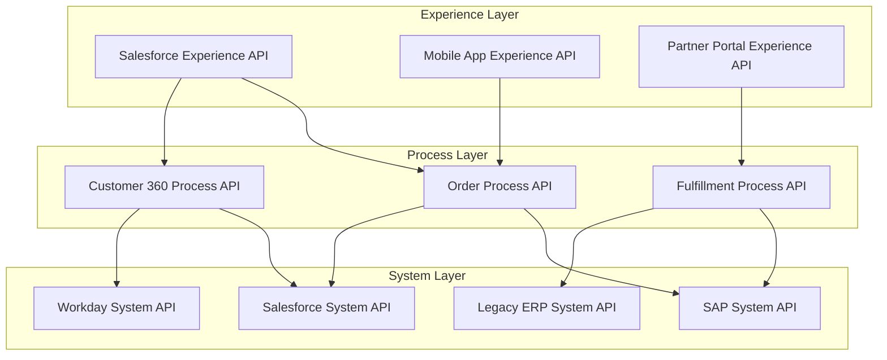
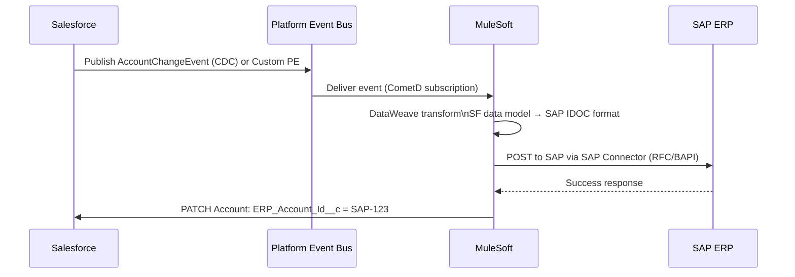
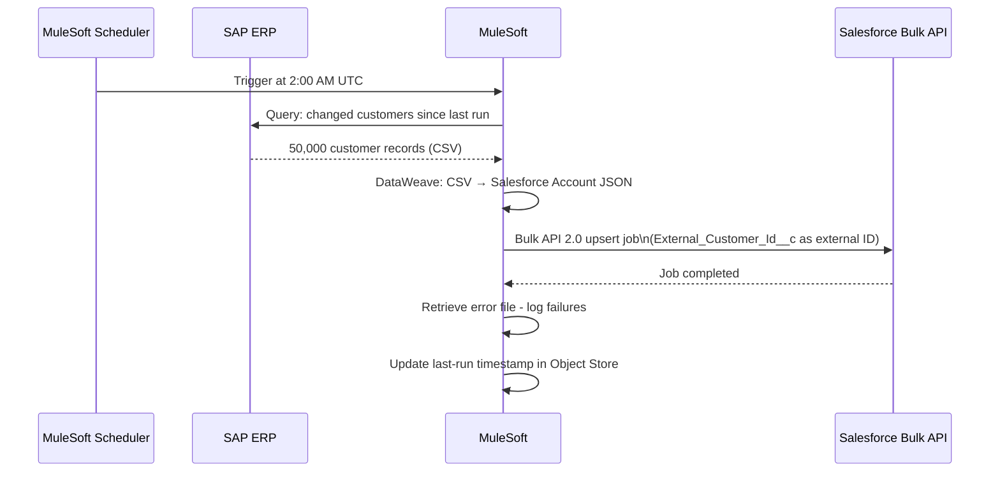
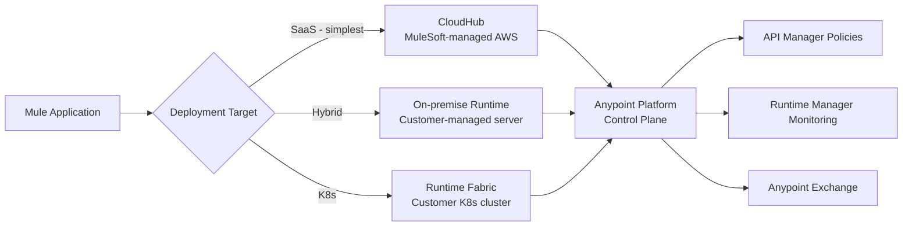
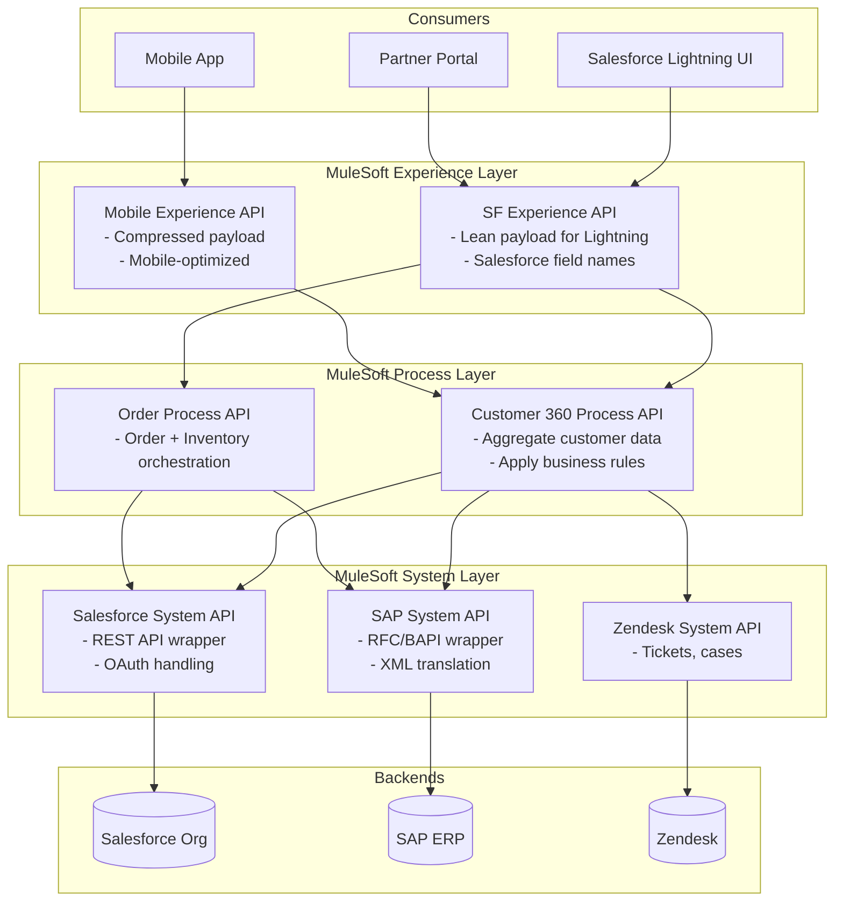
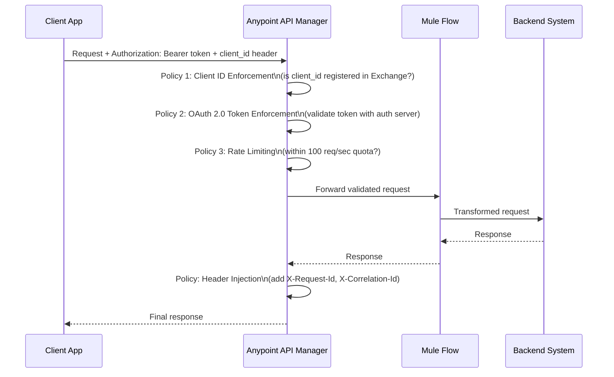

# MuleSoft and API-Led Connectivity

## Exam Domain
Integration Architecture Patterns — 22% | Integration Problem Design — 26%

## Foundations

MuleSoft is Salesforce's enterprise integration platform, acquired in 2018 for $6.5 billion. It is the most prominent middleware platform in the Salesforce ecosystem and is heavily represented on the CRT-404 exam. Understanding MuleSoft is not optional for this certification.

MuleSoft's core architectural philosophy is **API-led connectivity**: every integration capability is exposed as a managed, discoverable, reusable API. Instead of point-to-point integrations or custom middleware scripts, organizations build a portfolio of layered APIs that any system can consume. The result is an "API economy" inside the enterprise — integration becomes a product, not a project.

For architects, MuleSoft occupies the "hub" in a hub-and-spoke integration architecture. It enforces policies, transforms data, routes messages, handles errors, and provides observability across all integration flows.

## Core Concepts

### API-Led Connectivity — Three Layers

This is the single most tested MuleSoft concept on the CRT-404 exam.



**System Layer** (bottom tier):
- Direct wrappers around backend systems
- Expose backend data and capabilities via standardized REST/JSON APIs
- Stable, rarely change
- Handle: authentication to backend, protocol translation, basic error handling
- Examples: "SAP System API" wraps SAP BAPI/RFC; "Salesforce System API" wraps Salesforce REST API
- Built once, reused by many process APIs
- NO business logic here — just expose raw capabilities

**Process Layer** (middle tier):
- Orchestrate multiple System APIs to implement business processes
- Contain business logic: "An Order requires inventory check from SAP AND customer credit check from Salesforce"
- Transform and combine data from multiple systems
- Examples: "Order Process API" calls SAP System API + Salesforce System API + Payment System API
- Reused by multiple experience layers (mobile app, web app, Salesforce UI)

**Experience Layer** (top tier):
- Tailor data for specific consumers — NOT all data, only what the consumer needs
- Transform data into consumer-specific format (mobile needs lean payload; Salesforce UI needs field names)
- Handle consumer-specific auth (Salesforce user token vs. mobile anonymous vs. partner OAuth)
- Examples: "Salesforce Lightning Experience API" returns exactly the JSON Salesforce needs; "Mobile Experience API" returns compressed JSON for bandwidth efficiency
- Never contain business logic — call process APIs

**Why this matters architecturally**:
- **Agility**: When SAP is replaced with Oracle, only the SAP System API changes. All Process and Experience APIs are unaffected.
- **Reuse**: "Customer 360" Process API is built once, consumed by Salesforce Lightning AND mobile AND partner portal.
- **Governance**: Each API layer can have different policies (rate limits, auth) appropriate for its consumers.
- **Discoverability**: Every API is published to Anypoint Exchange. Any developer can find and reuse it.

**Anti-patterns** (exam traps):
- Calling a System API directly from an Experience API (skips process layer — business logic leaks into experience layer or gets duplicated)
- Building all logic in one giant "integration API" (no layering — can't reuse, can't change independently)
- Point-to-point connections between systems instead of going through layers

### Anypoint Platform Components

**Anypoint Studio**: Eclipse-based IDE for designing and building Mule applications. Drag-and-drop connectors, visual flow designer, DataWeave editor.

**Anypoint Exchange**: The API catalog/marketplace.
- Publish API specs (RAML/OAS), connectors, templates
- Consumers subscribe to APIs from Exchange
- Documentation, ratings, usage analytics
- Integration with API Manager for policy enforcement
- "API as a product" concept: publish, version, retire APIs in Exchange

**API Manager**: Runtime policy enforcement layer.
- Apply policies to APIs: rate limiting, OAuth 2.0 token validation, IP allowlist, header injection, logging
- Auto-discovery: MuleSoft runtime registers with API Manager at startup
- Per-environment policies (dev/staging/production have different configs)
- Client management: consumers register their apps, receive client_id/client_secret
- Contract enforcement: only registered consumers can call the API

**Runtime Manager**: Operations console.
- Deploy Mule applications to CloudHub or on-premise servers
- Monitor: status, throughput, error rate, JVM metrics
- Alerts: configure threshold-based alerts (error rate >5%, CPU >80%)
- Log management: view and search application logs

**CloudHub 1.0 / CloudHub 2.0**: MuleSoft's managed cloud hosting.
- vCores (virtual cores): unit of compute. 0.1 vCore = shared; 1 vCore = dedicated.
- Automatic load balancing, multi-region support
- CloudHub 2.0: container-based (Kubernetes internally), more granular scaling
- Shared vs. dedicated load balancers

**On-premise Runtime**: MuleSoft Mule Engine running on customer-managed servers.
- Required when integration must access private network resources (SAP on-prem, legacy mainframe)
- Connects to Anypoint Platform control plane via outbound HTTPS only (no inbound firewall rules needed)

**Runtime Fabric (RTF)**: MuleSoft on Kubernetes.
- Run Mule applications on customer-managed K8s clusters (on AWS, Azure, GCP, or on-prem)
- Combines cloud-native scaling with data residency control
- Most complex deployment model but most flexible

**MuleSoft Composer**: Low-code integration tool built into Salesforce.
- Separate product from Anypoint Platform
- No-code UI for building simple integrations
- Limited connectors (Salesforce, Slack, Stripe, Google Sheets, etc.)
- Not suitable for complex transformations, custom logic, or high-volume scenarios
- Best for business users building departmental integrations

**Positioning Composer vs. MuleSoft Platform**:
| | MuleSoft Composer | Anypoint Platform |
|-|------------------|-------------------|
| Users | Admins, business analysts | Integration developers |
| Complexity | Simple, linear | Complex orchestration |
| Volume | Low-medium | High volume, millions/day |
| Custom code | No | Yes (Java, DataWeave) |
| Governance | Limited | Full API Manager governance |
| Price | Included with some Salesforce licenses | Separate MuleSoft license |

### MuleSoft + Salesforce Integration Patterns

**Pattern 1: Real-time outbound (Salesforce → External)**



**Pattern 2: Batch sync (External → Salesforce)**



**Pattern 3: Request-reply (Salesforce calling MuleSoft)**

Salesforce calls MuleSoft's Experience API to retrieve aggregated data:
```
Salesforce Lightning → callout:MuleSoftCustomer360/customers/{id}
MuleSoft Process API → Salesforce System API (SF data)
                    → SAP System API (purchase history)
                    → Zendesk System API (support tickets)
MuleSoft aggregates → returns Customer 360 JSON to Salesforce
```

Salesforce Named Credential points to the MuleSoft Experience API endpoint. MuleSoft API Manager validates the OAuth token before the call reaches the Mule flow.

### API Manager Policies

Policies are enforcement rules applied to APIs at runtime, without changing the API implementation code:

| Policy | Purpose | Example |
|--------|---------|---------|
| Rate Limiting | Limit requests per time window | 100 req/second per consumer |
| Spike Control | Queue requests during spikes | Buffer up to 200 req, drain at 100/sec |
| OAuth 2.0 Token Enforcement | Validate bearer tokens | Reject requests without valid token |
| IP Allowlist | Allow only specific IP ranges | Only allow 10.0.0.0/8 |
| IP Blocklist | Block specific IPs | Block known malicious IPs |
| Header Injection | Add headers to requests/responses | Add `X-Request-Id` to all responses |
| CORS | Cross-origin resource sharing | Allow calls from specific domains |
| JSON Threat Protection | Block malicious JSON payloads | Max depth 10, max string length 1000 |
| Client ID Enforcement | Require registered client ID | Only Exchange-registered apps |
| Logging | Log all requests to external system | Send to Splunk |

**Policy enforcement order**: Policies execute in a defined order. Authentication policies (OAuth, Client ID) execute before Rate Limiting, which executes before the API implementation.

### DataWeave — Transformation Language

DataWeave is MuleSoft's built-in transformation language. Architects need conceptual understanding, not syntax mastery.

**What it does**: Transforms data between formats (JSON, XML, CSV, Java, COBOL flat files, EDI, etc.) using a functional programming paradigm.

**Example**: Transform Salesforce Account JSON to SAP Customer XML:
```dataweave
%dw 2.0
output application/xml
---
{
  Customer: {
    CustomerNumber: payload.External_Customer_Id__c,
    Name: payload.Name,
    Address: {
      Street: payload.BillingStreet,
      City: payload.BillingCity,
      Country: payload.BillingCountryCode
    }
  }
}
```

**Key concepts**:
- `payload`: the input data
- `output application/json` or `output application/xml`: controls output format
- `map`: transform each element in an array
- `filter`: filter array elements by condition
- `reduce`: aggregate array to single value
- `++`: concatenate strings or arrays
- `when`/`otherwise`: conditional logic

### Deployment Models



**When to recommend each**:
- **CloudHub**: New projects, no legacy system access needed, want managed infrastructure. Fastest to deploy.
- **On-premise Runtime**: Must access on-prem SAP, mainframe, or database not exposed to internet. Company policy prohibits cloud data processing.
- **Runtime Fabric**: Already using Kubernetes, want container-native deployment, data residency requirements, need auto-scaling beyond CloudHub limits.

---

## PTA / SA Relevance

### When This Comes Up in Engagements

MuleSoft conversations happen at multiple levels:

**Strategic**: "We have 50 point-to-point integrations. Should we consolidate on MuleSoft?" → API-led connectivity conversation, ROI on reuse, governance model.

**Project**: "We're building 10 new integrations for our Salesforce implementation. Should we use MuleSoft?" → License availability, complexity, team skills, timeline.

**Operational**: "Our MuleSoft integrations are slow and unreliable." → Monitoring, tuning, CloudHub vCore sizing, error handling gaps.

**Discovery questions**:
- "Do you have a MuleSoft license? Which tier — Starter, Growth, Premium?"
- "Do you have an Anypoint Exchange set up? Are APIs cataloged and reused, or is each integration built from scratch?"
- "When SAP was upgraded last year, how many integrations broke? How long to fix?"
- "Who built your current MuleSoft flows — an SI, internal team, or MuleSoft PS?"
- "Are you using MuleSoft Composer or Anypoint Platform? (Often both exist, often uncoordinated)"

### Common Architecture Failures

1. **API-led connectivity on paper only**: Customer bought MuleSoft, all integrations are built in the Process layer bypassing System layer. No reuse. System layer is empty. "API-led" means nothing.

2. **All logic in System layer**: Business rules (credit limit checks, order validation) built in the System API that wraps SAP. Now every consumer of the SAP System API gets those rules applied, even when they shouldn't.

3. **MuleSoft Composer and Anypoint Platform both running same integration**: A business analyst built a Composer flow, a developer built the same integration in Anypoint Platform. Two versions running, sometimes conflicting.

4. **Undiscovered APIs**: Anypoint Exchange has 50 published APIs. Developers don't know they exist. New projects build integrations from scratch instead of reusing existing system APIs. ROI never materializes.

5. **No API Manager governance**: All APIs deployed with no policies. No rate limiting, no authentication validation, no consumer registration. Any internal service can call any other at unlimited rate.

6. **Wrong deployment model**: On-premise runtime deployed for an integration that only connects cloud services (Salesforce + Workday + Slack). CloudHub would be simpler, cheaper, and more reliable.

### Enterprise Patterns

**The API CoE (Center of Excellence)**: Large enterprises investing in MuleSoft appoint an API CoE team responsible for:
- Setting API design standards (RAML/OAS templates)
- Reviewing new APIs before Anypoint Exchange publication
- Building and maintaining system APIs that everyone reuses
- Training developers on DataWeave and API-led patterns
- Governing Composer usage (keeping it separated from Anypoint Platform scope)

**MuleSoft RACI for Salesforce projects**:
- Salesforce team: responsible for Platform Events schema, Named Credentials pointing to MuleSoft, Apex callouts
- MuleSoft team: responsible for Experience API design, Process orchestration, System API wrappers
- Enterprise Architecture: approves API design, sets reuse policies

**ROI argument for API reuse**:
- System API built once: 40 hours
- Each reuse of System API vs. rebuilding point-to-point: saves 30 hours
- With 10 consumers of the same SAP System API: 40 + (10 × 5 hours to integrate) vs. 10 × 40 hours = 90 hours vs. 400 hours
- Plus: when SAP is upgraded, update 1 System API vs. fix 10 integrations

---

## Architecture

### API-Led Connectivity Full Stack with Salesforce



### API Manager Policy Enforcement Flow



**Limitations & Tradeoffs:**

| Approach | Benefit | Tradeoff |
|----------|---------|----------|
| API-led connectivity | Maximum reuse, agility | Requires discipline; skipping layers kills ROI |
| CloudHub deployment | Managed, auto-scale | Outbound data goes through AWS; data residency concern |
| On-premise runtime | Data stays on-prem | Customer manages infrastructure; patching, HA |
| Composer (no-code) | Fast, admin-friendly | Very limited; cannot handle complex scenarios |
| DataWeave transformation | All in Mule, no ETL tool | Learning curve for DataWeave syntax |

---

## Key Facts to Memorize

- **Three layers**: System (wraps backends) → Process (orchestration) → Experience (consumer-tailored)
- **System APIs**: stable, protocol translation, auth to backend. NO business logic.
- **Process APIs**: business logic, multi-system orchestration, data aggregation
- **Experience APIs**: consumer-specific format, lean payloads, consumer auth. NO business logic.
- **Anypoint Exchange**: API catalog where APIs are published and discovered
- **API Manager**: runtime policy enforcement (rate limit, OAuth, IP rules)
- **Runtime Manager**: deploy and monitor Mule applications
- **CloudHub**: MuleSoft's managed iPaaS on AWS
- **Runtime Fabric**: MuleSoft on customer-managed Kubernetes
- **MuleSoft Composer**: low-code, separate from Anypoint Platform, limited capability
- **DataWeave**: MuleSoft's transformation language — format-agnostic, functional
- **Anti-pattern**: calling System API directly from Experience API (skip Process layer)
- **Anti-pattern**: all logic in one layer
- Salesforce Connector in MuleSoft: supports CRUD, Bulk API, Platform Events subscribe, CDC subscribe
- Anypoint MQ: MuleSoft's message queue for async processing and DLQ
- API-led connectivity ROI: reuse reduces total integration cost; one change in system layer vs. many

---

## Exam Traps

1. **"MuleSoft Composer is the same as Anypoint Platform"**: They are separate products. Composer = low-code, limited. Anypoint Platform = full iPaaS. The exam may describe a complex integration scenario and offer "MuleSoft Composer" as an option — it's wrong for anything complex.

2. **"Business logic in System API"**: The exam may describe a scenario where business rules need to be applied during integration. The correct layer for business logic is the PROCESS layer, not the System layer.

3. **"Experience API can call System API directly"**: No. Experience → Process → System is the correct call chain. Direct Experience → System bypasses business logic and kills reusability.

4. **"API Manager is the same as Runtime Manager"**: API Manager = policy enforcement. Runtime Manager = deploy/monitor operations. Different tools in the Anypoint Platform.

5. **"CloudHub is always the right deployment"**: Not when there are on-prem backend systems behind a firewall. On-premise runtime or Runtime Fabric is needed when Mule must connect to internal network resources.

6. **"DataWeave is optional"**: Every MuleSoft integration that connects Salesforce to a non-Salesforce system involves data transformation. DataWeave is how MuleSoft does it. Understanding that DataWeave handles format translation is required even if you don't know the syntax.

7. **"MuleSoft can subscribe to Platform Events"**: Yes, this is a key integration pattern. The Salesforce Connector in MuleSoft supports CometD subscription to Platform Events and CDC channels.

---

## Practice Questions

**Question 1**
A large enterprise has Salesforce, SAP, Workday, and Oracle as core systems. They have a MuleSoft license and are designing a new integration layer. The architect wants to ensure that when SAP is upgraded next year, minimum integration rework is required. Which design pattern best achieves this?

A. Build a single "Master Integration API" that handles all integration logic for all systems
B. Build direct point-to-point connections between Salesforce and each backend system
C. Implement API-led connectivity with SAP System API, Process APIs for orchestration, and Experience APIs for Salesforce
D. Use MuleSoft Composer to build connections between all four systems

**Answer: C**
**Explanation:** API-led connectivity with a SAP System API creates an isolation layer. When SAP is upgraded, only the SAP System API changes — all Process APIs and Experience APIs that use it are unaffected. This is the core value proposition of the System layer: change insulation.

**Why the others are wrong:**
- A: A monolithic "Master Integration API" becomes a God object — impossible to change safely, no reuse, worse than P2P.
- B: Point-to-point means SAP upgrade breaks every direct connection to SAP. N integrations need rework.
- D: MuleSoft Composer is a low-code tool insufficient for complex multi-system enterprise integration with SAP.

---

**Question 2**
An architect is designing an integration where Salesforce needs to display a Customer 360 view aggregating data from Salesforce, SAP, and Zendesk. Using API-led connectivity, which layer should contain the logic to call all three system APIs and combine the results?

A. Experience Layer — Salesforce Experience API
B. System Layer — Salesforce System API
C. Process Layer — Customer 360 Process API
D. A single API that calls all three systems directly

**Answer: C**
**Explanation:** The Process Layer is where business logic and multi-system orchestration lives. The Customer 360 Process API calls the Salesforce System API, SAP System API, and Zendesk System API in parallel or sequence, aggregates the results, and returns a unified customer view. The Experience Layer then tailors this for Salesforce's specific format requirements.

**Why the others are wrong:**
- A: Experience Layer should contain NO business logic. It tailors the output for a specific consumer; it doesn't orchestrate multiple backends.
- B: System Layer is a thin wrapper around ONE backend system. It cannot call other system APIs.
- D: A single API calling everything would be a monolithic pattern — no layer separation, no reuse.

---

**Question 3**
A developer asks whether to use MuleSoft Composer or Anypoint Platform for a new integration that must sync 500,000 Contacts from Salesforce to Marketo daily, apply 15 data transformation rules, and handle duplicate detection. What should the architect recommend?

A. MuleSoft Composer — it's simpler and built into Salesforce
B. Anypoint Platform — Composer cannot handle the volume, transformation complexity, or custom logic
C. Either will work — choose based on developer preference
D. Use Salesforce Flow instead of either MuleSoft product

**Answer: B**
**Explanation:** Composer is designed for simple, low-volume integrations by non-developers. 500,000 records/day with complex transformations and deduplication logic exceeds Composer's capabilities. Anypoint Platform with DataWeave, Bulk API connector, and a properly designed batch job is required for this scale and complexity.

**Why the others are wrong:**
- A: Composer's simplicity comes at the cost of capability. It cannot handle 500K record volumes or complex multi-step transformations.
- C: They are not equivalent choices for complex scenarios. Composer would fail at this scale.
- D: Salesforce Flow has no native capability to connect to Marketo's API with complex transformations and bulk operations. External Services could expose a Marketo API but the orchestration layer would still need to be built somewhere.

---

**Question 4**
A company's MuleSoft Experience API receives 5,000 requests per minute during business hours. The backend system can only handle 100 requests per minute. Requests above this rate return 503 errors. Which MuleSoft API Manager policy configuration addresses this?

A. Apply a Rate Limiting policy of 100 req/minute — excess requests receive 429 immediately
B. Apply a Spike Control policy that queues excess requests and drains at 100 req/minute
C. Deploy more CloudHub workers to increase backend capacity
D. Apply an OAuth 2.0 Token Enforcement policy to limit unauthorized access

**Answer: B**
**Explanation:** Spike Control queues excess requests rather than rejecting them. The queue drains at the configured rate (100 req/minute), protecting the backend. Requests are delayed but not lost — they eventually process. Rate Limiting (option A) would reject 98% of traffic with 429 errors, which is not the goal when requests are legitimate but the backend is constrained.

**Why the others are wrong:**
- A: Rate Limiting at 100/min would reject 4,900/minute of legitimate traffic with 429. This doesn't protect the backend while serving consumers — it just refuses them.
- C: Adding CloudHub workers scales MuleSoft's capacity but the bottleneck is the BACKEND system, not MuleSoft.
- D: OAuth enforcement controls who can call the API, not how many requests the backend can handle.

---

**Question 5**
A Salesforce Platform Event is published when a high-value Lead is created. A MuleSoft flow subscribes to the event and calls an enrichment API. After a deployment issue, the MuleSoft subscriber was down for 6 hours. Which statement is correct about event recovery?

A. The events published during the 6-hour outage are permanently lost
B. MuleSoft can replay events using ReplayId, but only if the 6-hour outage is within the 72-hour Platform Events retention window
C. Salesforce automatically re-publishes all missed events when MuleSoft reconnects
D. MuleSoft must query Salesforce via REST API to find leads created during the outage

**Answer: B**
**Explanation:** Platform Events retain published events for 72 hours. When MuleSoft reconnects, it can specify a ReplayId from before the outage began to replay all missed events. Since 6 hours is well within the 72-hour window, recovery is automatic once MuleSoft reconnects with the correct ReplayId configured (stored in Anypoint Object Store before the outage).

**Why the others are wrong:**
- A: Events are NOT lost if within the 72-hour retention window. Only events older than 72 hours are gone.
- C: Salesforce does NOT automatically re-push events. The subscriber must reconnect and request replay using ReplayId.
- D: REST API query for leads is a fallback for when event replay is not available (beyond 72 hours). Within the window, ReplayId replay is the correct and simpler approach.
