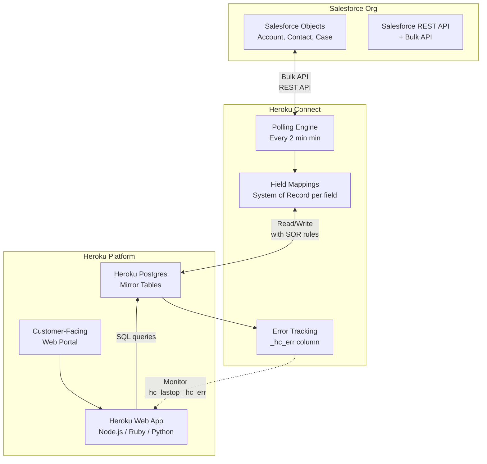
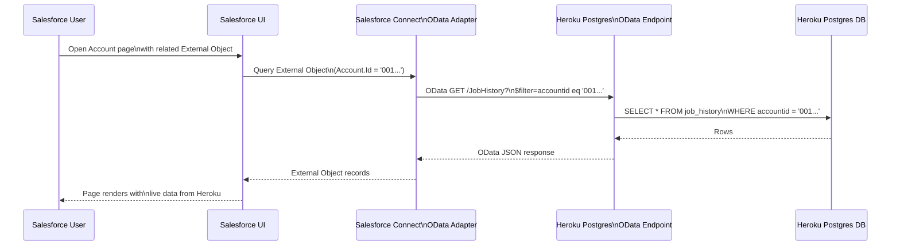
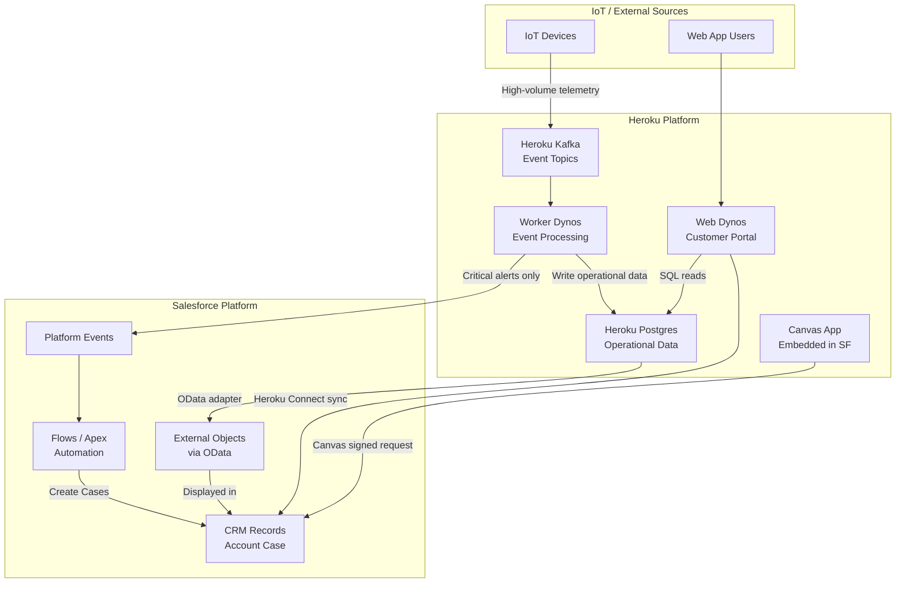

# Heroku Integration Patterns

## Exam Domain
Integration Architecture Patterns — ~15% of exam weight (Integration Architecture Design domain)

## Foundations

### What Heroku Is

Heroku is a Platform-as-a-Service (PaaS) owned by Salesforce (acquired 2010 for $212M). It runs on Amazon Web Services and abstracts away infrastructure management, letting developers focus on application code.

**Core Heroku building blocks**:
- **Dynos**: lightweight Linux containers running application processes. Types include web dynos (handle HTTP requests), worker dynos (background jobs), and one-off dynos (ad hoc tasks). Dynos scale horizontally.
- **Heroku Postgres**: fully managed PostgreSQL database service. The primary persistent storage for Heroku apps.
- **Heroku Redis**: fully managed Redis service for caching, queuing, and real-time data.
- **Heroku Kafka**: Apache Kafka as a managed service on Heroku. For high-throughput event streaming.
- **Heroku Data Clips**: share query results from Heroku Postgres via URL.
- **Heroku Add-ons**: marketplace of third-party services (monitoring, logging, search, etc.).

**12-Factor App Methodology**: Heroku popularized this. Key principles relevant to integration:
- Config in environment variables (not code)
- Stateless processes (state in backing services like Postgres/Redis)
- Port binding for service exposure
- Disposability (fast startup/shutdown for scaling)

**Heroku's role in Salesforce ecosystem**: Heroku is Salesforce's answer to "what if the customer needs a custom web application, high-compute processing, or a large-volume operational database that Salesforce is not designed for?" Heroku provides the flexibility of a custom app platform with native bridges back to Salesforce.

---

## Core Concepts

### Heroku Connect

**What it is**: A managed data synchronization service that creates a bi-directional sync between Heroku Postgres and a Salesforce org. It is the primary integration bridge between Heroku and Salesforce.

**How it works**:
1. Heroku Connect is provisioned as an add-on to a Heroku app
2. A Salesforce Connected App is created; Heroku Connect authenticates via OAuth
3. The administrator selects Salesforce objects and fields to sync
4. Heroku Connect creates mirror tables in Heroku Postgres corresponding to each Salesforce object
5. Data flows between Salesforce and Heroku Postgres according to the configured sync direction and polling interval

**Polling Interval**:
- Minimum polling interval: **2 minutes**
- This is a critical exam fact — Heroku Connect is NOT real-time. There is always at least a 2-minute lag.
- This makes it unsuitable for use cases requiring real-time data consistency
- For near-real-time requirements, use Salesforce REST API or Platform Events instead

**Sync Directions (Write Scopes)**:
- **Salesforce to Heroku (Read)**: Data flows from Salesforce → Heroku Postgres only. Heroku app reads Salesforce data; changes made in Heroku Postgres are NOT written back to Salesforce.
- **Salesforce to Heroku + Heroku to Salesforce (Read/Write)**: Bi-directional. Changes in either system propagate to the other. More complex; requires conflict resolution strategy.

**Special Columns in Heroku Postgres**:
Heroku Connect adds metadata columns to synced tables:
- `sfid`: the Salesforce record ID (18-character). Primary key for the Salesforce record.
- `_hc_lastop`: last operation performed by Heroku Connect on this row. Values: `SYNCED`, `PENDING_INSERT`, `PENDING_UPDATE`, `PENDING_DELETE`, `FAILED`.
- `_hc_err`: error message if the last sync operation failed. NULL if no error.
- `createddate`, `systemmodstamp`: synced from Salesforce timestamps
- `isdeleted`: boolean for soft-deletes (when Salesforce record is deleted)

**System of Record per Field**:
In bi-directional sync, each field can have a designated system of record:
- **Salesforce is SOR**: Salesforce value overwrites Heroku value on sync
- **Heroku is SOR**: Heroku Postgres value overwrites Salesforce value on sync
- This is configured at the field-mapping level in Heroku Connect UI

**Conflict Resolution**:
When both systems modify the same field between sync cycles:
- **Salesforce wins** (default): Salesforce value is preserved; Heroku change is overwritten
- **Heroku wins**: Heroku Postgres value is written to Salesforce, overwriting Salesforce change
- There is no built-in "last write wins" timestamp comparison; it's system-of-record designation
- For complex conflict resolution, use Salesforce triggers or Apex to implement custom logic

**What Can/Cannot Sync**:

Can sync:
- Standard and custom Salesforce objects
- Standard and custom fields (most types)
- Bi-directional changes

Cannot sync:
- **Formula fields**: computed at runtime in Salesforce; not stored; excluded from Heroku Connect sync
- **Rich text area fields**: content may not sync reliably
- **Encrypted fields**: depends on encryption configuration
- **Attachments and files**: Heroku Connect syncs metadata only; Salesforce Files content is not synced
- **Relationship fields**: parent-child relationships require careful mapping order (parents before children)

**Limits**:
- Depends on Heroku Connect plan (Standard, Premium, Enterprise)
- Number of mapped objects and rows vary by plan
- API calls consumed for sync operations count against Salesforce API limits — high-volume customers must plan accordingly

**When to use Heroku Connect**:
- Web app or mobile backend running on Heroku needs access to Salesforce CRM data
- Customer portal built on Heroku needs to display/update Salesforce accounts and cases
- Avoiding Salesforce API rate limits by reading from Postgres replica instead of hitting Salesforce API directly
- When the Heroku app is polyglot (Ruby, Node.js, Python) and SQL is the natural interface

**When NOT to use Heroku Connect**:
- Real-time sync requirements (< 2-minute latency) — use REST API or Platform Events
- Very high write volumes that would consume excessive Salesforce API calls
- When data volume in Heroku Postgres would be extremely large (Heroku Connect sync doesn't scale to tens of millions of rows efficiently)
- When transformations are needed during sync — Heroku Connect does field-to-field mapping only, no transformation logic

---

### Heroku External Objects (Salesforce Connect)

**What it is**: A pattern where Heroku Postgres data is surfaced inside Salesforce as **External Objects** — Salesforce objects that query an external data source in real time rather than storing data in Salesforce.

**How Salesforce Connect works**:
1. An External Data Source is configured in Salesforce pointing to the OData endpoint
2. Heroku exposes a Heroku Postgres table (or custom query) as an OData feed
3. Salesforce syncs external object metadata (field definitions) from the OData endpoint
4. When a user views an External Object record or runs a SOQL query against it, Salesforce queries the OData endpoint in real time
5. Data is not stored in Salesforce — it lives in Heroku Postgres

**OData Adapter Types in Salesforce Connect**:
- **OData 2.0**: older protocol; wider compatibility
- **OData 4.0**: newer; more features (aggregation, functions)
- **Cross-Org Adapter**: queries another Salesforce org via REST API
- **Custom Adapter**: build your own connector with Apex; can call any HTTP endpoint

**External Objects vs. External Data Sources**:
- **External Data Source**: the connection configuration (URL, auth, adapter type) — the source definition
- **External Object**: the Salesforce object definition that maps to a table in the external data source — the data model in Salesforce

**Key Limitations of External Objects**:
- No triggers on External Objects (cannot write Apex triggers)
- No workflow rules on External Objects
- Limited SOQL: no GROUP BY, no aggregate functions on external object fields
- No SOSL (full-text search) on External Objects
- No standard reports on External Objects (can use with Report Builder via join to standard objects)
- Cannot be used in Apex DML (INSERT/UPDATE/DELETE via Apex are possible for writable external objects but limited)
- Indirect lookup relationships: External Objects use Indirect Lookup or External Lookup, not standard Master-Detail
- Read performance depends on the external data source's response time — slow source = slow Salesforce page

**Writable External Objects**:
- Salesforce Connect supports write-back to external data sources
- OData 4.0 supports create/update/delete operations
- Custom adapters can implement full CRUD
- Useful when Salesforce users need to update data that lives in Heroku without a full Heroku Connect setup

**When to use External Objects (Salesforce Connect)**:
- Data is too large to copy into Salesforce (regulatory, cost, or volume reasons)
- Data must always be current (real-time query; no sync lag like Heroku Connect)
- Data resides in Heroku Postgres (or another OData-compatible source)
- Need to show data in Salesforce UI without actually loading it into Salesforce
- Cross-org data access (Cross-Org adapter)

**When NOT to use External Objects**:
- High-frequency access patterns (every external object access hits the external source — could overload it)
- When Salesforce features like triggers, workflows, or reports are needed on the data
- When relationships to standard objects are complex (indirect lookups only)

---

### Heroku Kafka → Salesforce Patterns

**Heroku Kafka as event backbone**:
- For high-volume event streaming (IoT data, clickstreams, real-time analytics, order events)
- Producers publish to Kafka topics; consumers subscribe
- Retention period: configurable (hours to days)
- Partitioning: parallel processing of high-volume streams

**Heroku Kafka → Salesforce via Platform Events**:
1. IoT device or web app publishes events to Heroku Kafka topic
2. Heroku worker dyno consumes from Kafka topic
3. Worker publishes to Salesforce Platform Events via REST API
4. Salesforce Platform Event triggers Apex, Flow, or other Salesforce automation
5. Salesforce processes event and updates records, sends notifications, or triggers workflows

**Volume consideration**: Salesforce Platform Events have governor limits (per-org event delivery limits). For very high-volume Kafka streams, consider:
- Batching Kafka messages before publishing to Platform Events
- Pre-filtering in the Heroku worker to only send events that Salesforce needs to act on
- Using Bulk API instead of Platform Events for high-volume record creation

**Alternative**: Heroku Kafka → direct Salesforce REST API → record creation (bypassing Platform Events)

---

### Canvas Apps

**What Canvas is**: A Salesforce framework for embedding external web applications inside the Salesforce UI (inside a Visualforce page, Lightning component, or record page).

**How it works**:
1. External app (running on Heroku or any server) is registered as a Canvas app in Salesforce
2. Salesforce provides a signed request when loading the Canvas app
3. The Canvas app validates the signed request using the shared secret
4. The Canvas SDK provides JavaScript methods to interact with the Salesforce host
5. Canvas app can call Salesforce APIs using the token provided in the signed request

**Key features**:
- Single sign-on: user doesn't re-authenticate; Salesforce passes user context
- Context passing: Salesforce passes record ID, user info, org info to Canvas app
- UI integration: Canvas app renders within Salesforce page, looks native
- API access: Canvas SDK provides OAuth token; app can call Salesforce REST API

**Canvas vs. Lightning Web Components**:
- Canvas: for external apps/systems that need to embed inside Salesforce (Heroku apps, third-party tools)
- LWC: for building native Salesforce UI components
- Canvas is useful when the app is already built on Heroku in a non-Salesforce framework

---

### Integration Architecture Patterns

#### Pattern 1: Web App + Salesforce CRM
**Scenario**: Customer-facing web application (e-commerce, customer portal, community) runs on Heroku; Salesforce manages CRM data.
- Heroku app reads/writes account, case, and order data via Heroku Connect (Postgres mirror)
- Web app uses Postgres SQL queries for performance (avoids Salesforce API calls at scale)
- Heroku Connect syncs changes back to Salesforce at 2-minute intervals
- Canvas app embeds Salesforce UI components inside the Heroku web app where needed
- **Use case**: Large-scale customer portal where Salesforce API rate limits would be exceeded

#### Pattern 2: High-Compute Offload
**Scenario**: Computationally intensive operations (ML inference, complex pricing calculations, document generation, data processing) are too slow or resource-intensive for Salesforce Apex.
- Salesforce triggers/flows call Heroku REST API (via external callout) when compute is needed
- Heroku runs the computation on Dynos (can scale horizontally)
- Result is posted back to Salesforce via REST API (updating the originating record)
- Pattern: Salesforce → Callout → Heroku → Compute → Heroku REST callback → Salesforce
- **Use case**: CPQ pricing engine offloaded to Heroku, AI/ML model inference, PDF generation

#### Pattern 3: Operational Data + CRM Reporting
**Scenario**: High-volume operational data (transaction logs, sensor readings, event logs) needs to be associated with Salesforce CRM records for reporting.
- Operational data written to Heroku Postgres (high write volume, low latency)
- Salesforce External Objects (OData adapter) surface aggregate views from Heroku Postgres in Salesforce
- Dashboards in Salesforce show CRM data alongside operational data without ETL
- **Use case**: Service technician app writes work order details to Heroku; Salesforce shows CRM account with linked External Object showing job history

#### Pattern 4: IoT Data Collection → Salesforce
**Scenario**: Connected devices send high-frequency telemetry data.
- Devices publish to Heroku Kafka topics
- Heroku worker dynos consume Kafka, aggregate/filter, and write to Heroku Postgres
- Salesforce External Objects query Heroku Postgres for device history
- Critical alerts (threshold exceeded) trigger Salesforce Platform Events via REST API
- Salesforce Case creation on critical alerts
- **Use case**: Manufacturing IoT, fleet management, smart building sensors

---

## PTA / SA Relevance

### When This Comes Up in Engagements

- **Customer portal requirements**: any time a customer wants a branded web portal that uses Salesforce CRM data — Heroku is one of the standard recommendations
- **API rate limit concerns**: customers with very high-volume data access patterns who are hitting Salesforce API limits — Heroku Connect as a Postgres read replica is a common solution
- **Custom computation**: complex pricing, ML models, document generation — Heroku as compute layer
- **Integration discovery**: understanding that a customer already uses Heroku (common in Salesforce ecosystem) and leveraging Heroku Connect vs. building custom API integrations

### When to Recommend Heroku Connect vs. API Integration vs. CDC

| Criterion | Heroku Connect | REST API Integration | CDC / Platform Events |
|-----------|---------------|---------------------|----------------------|
| Latency tolerance | 2+ minutes OK | Near-real-time | Real-time event driven |
| Heroku app language | Any (SQL interface) | Any (HTTP client) | Any (HTTP client) |
| Data volume | Medium | Low-medium | Low-medium (event-based) |
| Transformation needed | No | Yes (in MuleSoft/code) | Yes (in consumer) |
| Heroku Postgres native | Yes | No | No |
| Ease of setup | Very easy (UI-driven) | Moderate | Moderate |
| Best for | Portal/app with CRM data | Transactional sync | Event-driven processes |

### Heroku vs. MuleSoft for Specific Use Cases

| Use Case | Heroku | MuleSoft |
|----------|--------|---------|
| Web/mobile app platform | Yes (PaaS for custom apps) | No |
| SAP ↔ Salesforce sync | No | Yes |
| High-compute processing | Yes (Dynos scale) | No |
| API-Led Connectivity | No | Yes |
| Salesforce data portal | Yes (Heroku Connect) | Possible but overkill |
| Complex transformation | No (limited) | Yes (DataWeave) |
| IoT event streaming | Yes (Heroku Kafka) | Possible |
| Multi-system orchestration | No | Yes |

### Common Customer Misuse of Heroku Connect

1. **Treating Heroku Connect as real-time**: designing workflows that depend on < 2-minute latency, then being surprised when data is stale
2. **Formula fields in sync mapping**: customers map formula fields, then wonder why they don't sync
3. **Ignoring API consumption**: Heroku Connect uses Salesforce API calls; customers near API limits get throttled
4. **Over-syncing objects**: syncing every object and field "just in case" instead of only what the Heroku app needs — wastes API calls and Postgres storage
5. **No error handling for _hc_err**: sync failures are silently written to `_hc_err` column; customers don't monitor it and wonder why data is missing

---

## Architecture

### Heroku Connect Bi-Directional Sync Architecture

### External Objects Query Flow Through OData Adapter

### Heroku + Salesforce Composite Architecture

**Limitations & Tradeoffs:**

| Aspect | Detail |
|--------|--------|
| Heroku Connect latency | Minimum 2-minute polling. Not suitable for real-time requirements. |
| External Objects limitations | No triggers, no GROUP BY SOQL, no SOSL. Read performance tied to external source speed. |
| API consumption | Heroku Connect sync consumes Salesforce API calls. Impacts orgs near API limits. |
| Heroku Postgres scaling | Standard Postgres; for very large data volumes or high write throughput, consider sharding or switching to purpose-built databases. |
| Canvas deprecation risk | Salesforce Canvas is older technology; LWC + CORS-enabled endpoints may replace in some scenarios. |
| Heroku pricing | Dynos and add-ons are per-resource pricing; can become expensive at scale vs. other PaaS options. |

---

## Key Facts to Memorize

- **Heroku Connect polling minimum: 2 minutes** — not real-time
- `_hc_lastop` and `_hc_err`: Heroku Connect metadata columns in Heroku Postgres
- `sfid`: Salesforce record ID stored in Heroku Postgres via Heroku Connect
- Formula fields **cannot** be synced by Heroku Connect
- External Objects: real-time query via OData; data not stored in Salesforce
- No Apex triggers on External Objects
- No GROUP BY, no SOSL on External Objects
- OData adapter types: OData 2.0, OData 4.0, Cross-Org, Custom Apex
- Canvas: embed external apps in Salesforce UI; signed request for SSO
- Heroku Kafka → Platform Events → Salesforce for IoT/streaming → CRM patterns
- Heroku Connect uses Salesforce API calls — counts against org limits
- Heroku Connect conflict resolution: Salesforce wins (default) or Heroku wins (per field SOR)

---

## Exam Traps

1. **"Heroku Connect is real-time"** — FALSE. Minimum 2-minute polling interval.
2. **"Formula fields sync via Heroku Connect"** — FALSE. Formula fields are excluded.
3. **"External Objects can have Apex triggers"** — FALSE. No triggers on External Objects.
4. **"Heroku Connect API calls don't count against Salesforce limits"** — FALSE. They do.
5. **"External Objects store data in Salesforce"** — FALSE. Data stays in the external source; queried on demand.
6. **"Canvas apps require users to log in separately"** — FALSE. Canvas uses signed requests for SSO.
7. **"SOSL works on External Objects"** — FALSE. SOSL not supported.
8. **"Heroku Connect can transform data during sync"** — FALSE. Field-to-field mapping only; no transformation logic.

---

## Practice Questions

**Question 1**
A customer is building a customer portal on Heroku where portal users can view and update their Salesforce Account information. They expect up to 10,000 concurrent users and are concerned about Salesforce API limits. Which Heroku-Salesforce integration approach best addresses this?

A) Have the Heroku app call Salesforce REST API directly for each user request  
B) Use Heroku Connect to sync Account data to Heroku Postgres; the app reads/writes to Postgres  
C) Use Salesforce External Objects (OData) to surface Heroku data inside Salesforce  
D) Use MuleSoft to mediate all requests between Heroku and Salesforce  

**Answer: B — Heroku Connect**
With 10,000 concurrent users, direct Salesforce API calls would quickly exhaust API limits. Heroku Connect creates a Postgres mirror of Salesforce Account data; the app reads/writes to Postgres (which scales to high concurrency) and Heroku Connect syncs changes back to Salesforce in batches. This dramatically reduces Salesforce API consumption. Option C (External Objects) is the reverse pattern — surfacing Heroku data in Salesforce, not Salesforce data in Heroku.

---

**Question 2**
A Salesforce admin notices that Account data updated in a Heroku customer portal is not appearing in Salesforce for up to 5 minutes after the update. The integration uses Heroku Connect. Is this expected behavior, and what should be communicated to stakeholders?

A) This is a bug in Heroku Connect; the minimum should be 30 seconds  
B) This is expected; Heroku Connect has a minimum 2-minute polling interval, and actual sync time can exceed this  
C) This is unexpected; Heroku Connect should sync in real time  
D) The polling interval needs to be reduced to 1 minute in settings  

**Answer: B — Expected behavior; minimum polling is 2 minutes**
Heroku Connect is not a real-time sync mechanism. The minimum polling interval is 2 minutes, and actual latency can be higher depending on volume, API availability, and queue depth. This should be clearly communicated to stakeholders during design. If real-time sync is required, the architecture should use direct Salesforce REST API calls or Platform Events instead of Heroku Connect.

---

**Question 3**
A Salesforce architect is designing an integration where Salesforce users need to see job history data stored in Heroku Postgres directly on the Account record page. The data is large (50 million rows) and should never be copied into Salesforce. Which approach is correct?

A) Heroku Connect with bi-directional sync  
B) Salesforce External Objects via OData adapter pointing to Heroku Postgres  
C) Platform Events from Heroku to Salesforce  
D) Apex callout from Salesforce to Heroku REST API  

**Answer: B — Salesforce External Objects via OData**
External Objects are purpose-built for this scenario: large data that lives in an external system (Heroku Postgres) needs to be surfaced in Salesforce without copying it in. The OData adapter queries Heroku Postgres in real time when the record page loads. The data is never stored in Salesforce. Heroku Connect (A) would attempt to copy all 50M rows into Salesforce, which is impractical. Option D (Apex callout) would work but requires custom development and doesn't give declarative External Object behavior (related lists, etc.).

---

**Question 4**
A manufacturing customer has IoT devices sending 10,000 sensor readings per minute. Critical threshold alerts (approximately 50/minute) need to create Salesforce Cases. High-frequency raw readings need to be queryable from Salesforce for maintenance engineers. What is the optimal architecture?

A) Each sensor reading calls Salesforce REST API to create a record  
B) All readings stored in Heroku Kafka → Heroku worker writes to Heroku Postgres → External Objects for query; worker publishes critical alerts as Platform Events → Salesforce creates Cases  
C) Heroku Connect syncs all readings from Heroku Postgres to Salesforce every 2 minutes  
D) MuleSoft receives all sensor data and writes all 10,000 readings/minute to Salesforce  

**Answer: B — Kafka → Postgres (External Objects) + Platform Events for alerts**
This is the correct tiered architecture for IoT + Salesforce. Raw high-volume readings go to Kafka → Postgres (queryable via External Objects in Salesforce without consuming Salesforce storage). Only the critical 50 alerts/minute become Platform Events → Cases. Option A would exhaust Salesforce API limits instantly. Option C would bring 10K records/minute through Heroku Connect, consuming massive API limits and Salesforce storage. Option D puts all write load directly into Salesforce.

---

**Question 5**
A developer is syncing Salesforce Accounts to Heroku Postgres via Heroku Connect. After some updates in Heroku, the developer checks `_hc_lastop` for certain rows and sees the value `FAILED`. `_hc_err` contains "INVALID_FIELD: No such column 'AnnualRevenue__c'". What does this indicate, and what is the resolution?

A) The field AnnualRevenue__c was deleted from Salesforce; remove it from Heroku Connect mapping  
B) The Heroku Postgres schema is corrupt; run a full resync  
C) Heroku Connect requires admin approval to sync custom fields  
D) The Salesforce API version needs to be updated  

**Answer: A — The field was deleted or renamed in Salesforce; update the Heroku Connect mapping**
The `_hc_lastop = FAILED` and `_hc_err` message indicate a sync failure for that specific row. The error "INVALID_FIELD: No such column 'AnnualRevenue__c'" means the mapped field no longer exists in Salesforce — it was deleted or renamed. The resolution is to update the Heroku Connect field mapping to remove or remap the deleted field. This is a common operational issue — Salesforce schema changes (field deletions) must be coordinated with Heroku Connect mappings. Monitoring `_hc_err` proactively prevents silent data sync failures.
