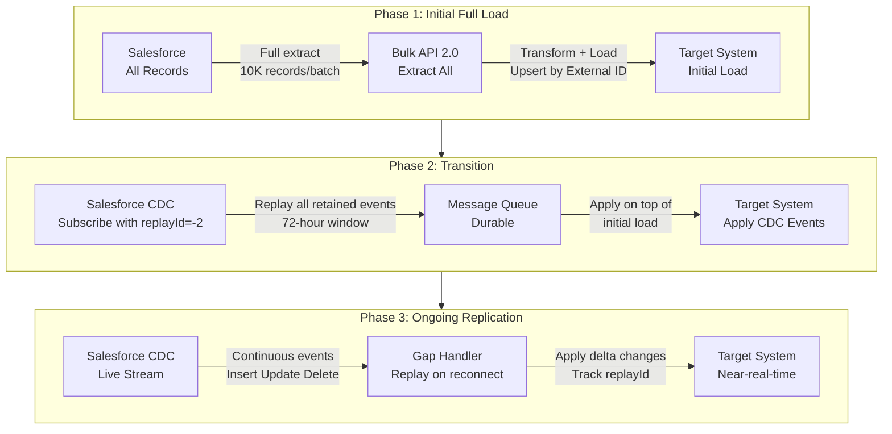
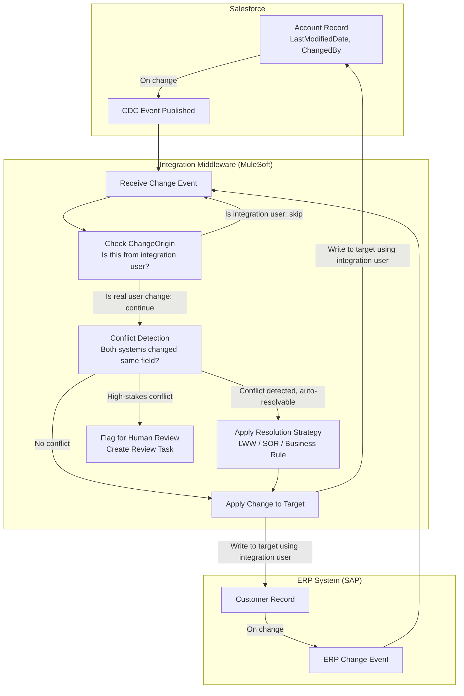
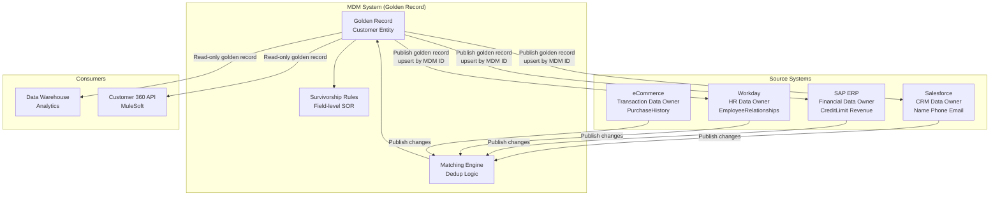

# Data Replication and Synchronization Patterns

## Exam Domain
Data Management and Integration — ~20% of exam weight (Data Architecture domain intersects with Integration Architecture)

## Foundations

### Why Data Replication Matters in Integration Architecture

Enterprise systems don't share a single database. CRM data lives in Salesforce, financial data in SAP, HR data in Workday, operational data in custom databases. When these systems need consistent, current views of shared data (customer records, products, pricing), replication is required.

Replication is distinct from integration in scope:
- **Integration**: systems exchange data and trigger processes
- **Replication**: a dataset is maintained in multiple locations, staying consistent over time

Poor replication design is the root cause of many common enterprise problems: duplicate customer records, stale pricing, orders failing due to mismatched data, reports showing conflicting numbers.

---

## Core Concepts

### Data Replication Fundamentals

#### Full Replication
- **Definition**: The entire dataset is re-copied from source to target on each replication cycle
- **Process**: Truncate target → load all source records → done
- **When appropriate**: Small datasets (< 100K records), initial data loads, reference/lookup data that changes infrequently
- **Drawbacks**: Expensive for large datasets; causes database load on source; creates gap where target has no data (during truncate); time-consuming

#### Incremental Replication
- **Definition**: Only records modified since the last successful replication run are copied
- **Mechanism**: Filter source records by `LastModifiedDate > :lastSuccessfulRunTimestamp`
- **Advantages**: Lower volume, faster, scalable to large datasets
- **Critical limitation**: Does not capture deletes. If a record is deleted in the source, it still exists in the target.
- **Workaround for deletes**: Use a separate delete detection pass (query Deleted records via Salesforce `queryAll()` API or Recycle Bin), or use soft deletes (IsDeleted flag)

#### Change Data Capture (CDC) / Delta Replication
- **Definition**: The source system publishes a stream of changes (inserts, updates, deletes) as events; the target subscribes and applies each change
- **Mechanism**: Database transaction log tailing, or platform-level change events (Salesforce CDC)
- **Advantages**: Near-real-time, captures all change types (including deletes), minimal source load, no polling
- **Drawbacks**: Requires event infrastructure (message bus, event store); events can be missed (gap events); ordering guarantees matter; replay complexity

#### Unidirectional vs. Bi-Directional Replication

**Unidirectional**:
- One system is the source of record; data flows one way
- Simpler to implement; no conflict resolution needed
- Use when: one system clearly owns the data

**Bi-Directional**:
- Both systems can modify data; changes flow in both directions
- Requires conflict detection and resolution strategy
- High risk of sync loops (A updates → B receives → B updates → A receives → infinite loop)
- Use only when: two systems legitimately need to independently modify the same dataset

**Master Data vs. Transactional Data Considerations**:
- **Master data** (accounts, contacts, products): replicated widely; stability expected; strong conflict resolution needed
- **Transactional data** (orders, invoices, service tickets): typically owned by one system; replicated for reporting, not for modification

**Replication Lag and Eventual Consistency**:
- There is always a lag between source change and target reflection
- Systems must tolerate eventual consistency: for a window of time, systems hold different values for the same data
- Design: document acceptable lag (SLA) per data domain
- Failure: treating eventually consistent data as immediately consistent leads to race conditions and business errors

---

### Salesforce-Specific Replication Approaches

#### LastModifiedDate Incremental Pull

**Pattern**:
```sql
-- SOQL for incremental extraction
SELECT Id, Name, AccountNumber, Phone, BillingCity, LastModifiedDate
FROM Account
WHERE LastModifiedDate > 2025-01-01T00:00:00Z
ORDER BY LastModifiedDate ASC
```

**Implementation steps**:
1. Maintain a `lastRunTimestamp` stored persistently (in the integration middleware or a database)
2. On each run: query Salesforce with `WHERE LastModifiedDate > :lastRunTimestamp`
3. Process results
4. On success: update `lastRunTimestamp` to the current time (or the latest `LastModifiedDate` in the result set)
5. On failure: keep `lastRunTimestamp` at previous value; retry will re-process the same window

**Timezone considerations**:
- Salesforce stores `LastModifiedDate` in UTC
- Always use ISO 8601 format with timezone offset in SOQL: `2025-01-01T00:00:00.000Z`
- If the integration middleware is in a different timezone, convert before comparison
- Clock skew: if source and target clocks differ, records modified in the skew window may be missed; add a safety buffer (e.g., subtract 5 minutes from lastRunTimestamp)

**Limitation — deletes**:
- A deleted record no longer appears in standard SOQL queries
- To detect deletes: use `queryAll()` REST API endpoint (includes soft-deleted records in Recycle Bin)
- Or: query `DeletedRecords` resource via REST API for a time window
- Or: use CDC, which explicitly publishes DELETE events

#### External IDs for Upsert-Based Replication

**What an External ID is**:
- A custom field on a Salesforce object with "External ID" checkbox enabled
- Stores the unique identifier from an external system (e.g., SAP Customer ID, Workday Employee ID, MDM Global ID)
- Indexed in Salesforce for performance
- Used in upsert operations: if a record with this External ID exists, update it; if not, insert it

**Setting up External IDs**:
1. Create a custom field (Text, Number, or Email type)
2. Enable "External ID" checkbox
3. Optionally enable "Unique" to prevent duplicates
4. Use in Bulk API upsert operations as the upsert key

**Why External IDs are critical for replication**:
- Replication runs are not guaranteed to run in perfect order
- On retry, the same record might be sent twice
- Without External ID + upsert: duplicate records in Salesforce
- With External ID + upsert: idempotent operation — safe to re-send

**External ID as idempotency key**:
- Any record with the same External ID value is treated as the same record
- Parallel processing: multiple batches can safely process the same record (idempotency ensures no corruption)
- Failure recovery: restart from any point; previously processed records are simply re-upserted (no duplicates)

**Naming convention**: Store the source system's primary key as the External ID. Example: SAP_Customer_Id__c = 'CUST-123456'.

#### Change Data Capture (CDC) for Replication

Salesforce CDC publishes change events to the `/data/[ObjectName]ChangeEvent` channel whenever records are created, updated, deleted, or undeleted.

**Gap Events**:
- When the subscriber (e.g., MuleSoft) is offline, CDC events accumulate in the Salesforce event bus
- **72-hour replay window**: Salesforce retains CDC events for 72 hours
- Gap events handling: on reconnect, replay from the last known `replayId` to catch all missed events
- After 72 hours: events are gone; a gap fill strategy is required (incremental pull for the gap period)

**Delete Events**:
- When a Salesforce record is hard-deleted, CDC publishes a delete event
- The event includes the record ID and key field values (but not all fields)
- Subscriber receives the delete event and removes the corresponding record in the target system
- Soft deletes (moving to Recycle Bin): CDC publishes a delete event when the record moves to Recycle Bin, and an undelete event if restored

**Best Practice Pattern: Bulk API Initial Load + CDC Ongoing**:
1. **Phase 1 — Initial load**: Use Bulk API 2.0 to extract all records from Salesforce; load into target system. This is a one-time full extract.
2. **Phase 2 — Transition**: Subscribe to CDC channel with `replayId = -2` (replay all retained events); apply changes on top of initial load.
3. **Phase 3 — Ongoing**: CDC subscription maintains real-time replication. Monitor `replayId` continuously; handle gap events.

This is the recommended pattern because:
- Full load via CDC would be impractical (CDC only goes back 72 hours, can't replay all history)
- Ongoing polling via LastModifiedDate is less efficient and misses deletes
- Bulk API + CDC is efficient, complete, and near-real-time

---

### Conflict Resolution Strategies

When bi-directional replication is used, conflicts occur when both systems modify the same record between sync cycles.

#### Last-Write-Wins (LWW)
- **Strategy**: Compare timestamps; the most recent modification wins
- **Implementation**: Each system stores `LastModifiedDate` / `UpdatedAt` timestamps; compare on sync
- **Risk**: Clock skew between systems can cause incorrect resolution; the "last write" may not be the intended one
- **Best for**: Low-risk data where any valid value is acceptable (e.g., non-critical status fields)

#### Source-of-Record Designation per Field
- **Strategy**: Define which system owns each field; that system always wins
- **Implementation**: Field-level SOR mapping (e.g., Salesforce owns `AccountName`; SAP owns `CreditLimit`)
- **Risk**: Requires careful upfront design; systems may contain stale non-SOR fields
- **Best for**: Well-defined domain boundaries (CRM owns customer info; ERP owns financial data)

#### Timestamp-Based Resolution
- Similar to LWW but applied per-field rather than per-record
- Each field has its own `LastModifiedDate` in a shadow table
- More granular; avoids overwriting an unchanged field with an older version
- Requires more infrastructure to track per-field modification times

#### Business-Rule-Based Resolution
- **Strategy**: Apply domain-specific logic to determine the correct value
- Example: if Salesforce has "Gold" tier and SAP has "Silver" tier, promote to the higher tier; if one system has NULL and other has a value, take the non-NULL value
- **Most correct but most complex**: requires custom code for each field
- **Best for**: High-value master data (customer tier, credit limit, regulatory classification)

#### Conflict Flagging for Human Review
- **Strategy**: Detect conflict; set a flag; route to a review queue for human resolution
- **Implementation**: Integration middleware detects both systems changed the same field; sets `Sync_Conflict__c = true` and creates a Task or Case for review
- **Best for**: High-stakes data (financial data, legal classifications, MDM golden records) where automated resolution risk is high
- **Drawback**: creates operational burden; backlog can grow if not monitored

---

### Master Data Management (MDM)

**What MDM is**:
Master Data Management is the discipline of creating and maintaining a single, authoritative, consistent record of key business entities (customers, products, locations, employees) across the enterprise.

Without MDM: customer "Acme Corp" exists as "ACME CORP" in SAP, "Acme Corporation" in Salesforce, "Acme Corp." in the data warehouse — three "different" records for the same entity. Reports, integrations, and AI all suffer.

**MDM Styles**:

**Registry Style**:
- No central record; each system keeps its own copy
- MDM maintains an index of cross-system IDs (SAP ID ↔ Salesforce ID ↔ Workday ID)
- Queries resolve to source system data
- Lowest disruption to existing systems
- Risk: systems still hold inconsistent data; MDM index can drift

**Consolidation Style**:
- MDM creates a read-only "golden record" by consolidating data from source systems
- Source systems keep their own records
- Consumers read from MDM for reporting and analytics
- Does not affect source system operations
- Risk: golden record may lag source systems; not authoritative for transactions

**Coexistence Style**:
- MDM maintains a golden record AND publishes it back to source systems
- Source systems can have local attributes; MDM governs shared attributes
- Most common in Salesforce-centric MDM
- Requires strong governance and change management

**Salesforce as MDM Hub for Customer/Contact Data**:
- Salesforce is naturally positioned as the customer MDM system (Account and Contact objects)
- Duplicate Rules: match rules define what constitutes a duplicate; duplicate rules define what happens when a duplicate is detected (alert, block, or allow)
- Matching Rules: define algorithms for identifying potential duplicates (exact match, fuzzy match on name, email, phone)
- Duplicate Jobs (Duplicate Management): batch job to find and merge duplicates in existing data

**Duplicate Management Components**:
1. **Matching Rules**: how to compare records. Standard rules available for Account, Contact, Lead. Custom rules can use fuzzy name matching, email, phone, address.
2. **Duplicate Rules**: what to do when a match is found. Block save, allow with alert, report only, merge.
3. **Duplicate Record Sets**: when Duplicate Rule runs in report mode, creates a Duplicate Record Set grouping potential duplicates for review.
4. **Merge**: Salesforce has native merge for Account, Contact, Lead. Up to 3 records at a time via UI; Merge REST API for programmatic merges.

**External MDM Systems integrating with Salesforce**:
- **Informatica MDM**: enterprise MDM; integrates via REST API or Informatica IICS
- **Reltio**: cloud-native MDM; API-first integration
- **Stibo STEP**: product MDM and customer MDM
- Pattern: External MDM is the system of record for the golden record; publishes to Salesforce via Salesforce REST API / Bulk API upsert; Salesforce stores the MDM Global ID as External ID

---

### Data Quality in Integration

#### Schema Mismatch Handling
- Source schema ≠ target schema is the norm, not the exception
- Integration layer (MuleSoft DataWeave, Informatica mapping) is responsible for translation
- Common mismatches:
  - Field names differ ("CustomerName" vs "AcctName")
  - Data types differ (Number in SAP vs Text in Salesforce)
  - Date formats differ (MM/DD/YYYY vs ISO 8601)
  - Enumeration values differ ("Active" vs "1" vs "ACT")

#### Required Field Conflicts
- A field required in the target may be optional in the source
- If source is null for a required field: the integration will fail on insert
- Resolution options: default value strategy (use a predefined default), enrichment (look up from another system), rejection with error logging (reject the record, alert for manual fix)

#### Null Handling and Default Values
- Define explicit null handling per field in the integration design
- Don't propagate nulls blindly: a null update from a source system can overwrite a valid value in Salesforce
- Pattern: null = no-op (don't update the field if source is null); vs. null = intentional blank (update to null)
- Upsert operations: include only non-null fields in the upsert payload to avoid overwriting with null

#### Field Length Mismatches
- ERP systems (SAP, Oracle) often have longer text fields than Salesforce
- SAP description fields: up to 1000+ characters
- Salesforce Text fields: limited (255 by default; Long Text Area up to 131,072)
- Integration must handle truncation gracefully: truncate with notification, or split into multiple fields

#### Date/Time Format Normalization
- Canonical format in integration: **ISO 8601** (`2025-01-15T14:30:00.000Z`)
- SAP: date fields often YYYYMMDD (no separator); time fields HHMMSS
- Salesforce: ISO 8601 with UTC
- Legacy systems: MM/DD/YYYY, unix timestamps, Julian dates
- Integration middleware is responsible for all date normalization

---

### ETL vs. ELT

#### ETL (Extract, Transform, Load)
- **Process**: Extract from source → Transform in middleware → Load into target
- **Where transformation happens**: In the integration layer (middleware, ETL tool)
- **Traditional approach**: Informatica PowerCenter, SSIS, DataStage
- **Salesforce context**: Transform Salesforce data in MuleSoft before loading into data warehouse
- **Best for**: Complex transformations, data quality rules, schema differences, privacy masking before load

#### ELT (Extract, Load, Transform)
- **Process**: Extract from source → Load raw into target → Transform in place (in the target database)
- **Where transformation happens**: In the target database (data warehouse, data lake)
- **Modern approach**: Snowflake, BigQuery, Databricks; dbt for transformations
- **Salesforce context**: Extract Salesforce data raw (via Bulk API, CRM Analytics connector) → load into Snowflake → dbt transforms for analytics
- **Best for**: Data lake patterns, analytics, when target database has powerful compute (Snowflake, BigQuery)

#### Which applies to Salesforce integrations

| Use Case | Approach |
|----------|---------|
| Salesforce ↔ SAP operational sync | ETL (real-time transformation needed) |
| Salesforce → Data Warehouse for analytics | ELT (load raw; transform in DW) |
| Salesforce → MuleSoft → ERP | ETL (DataWeave transforms in-flight) |
| Salesforce → Snowflake via CRM Analytics | ELT |
| Initial data migration to Salesforce | ETL (cleanse and transform before Salesforce import) |

---

### Replication Performance

#### Upsert vs. Insert+Update Split
- **Upsert**: single operation; Salesforce determines insert vs update based on External ID match
- **Insert+Update split**: pre-query to determine which records exist; send inserts and updates separately
- **Recommendation**: Use upsert with External ID — simpler, idempotent, lower risk
- Split is only useful when insert/update have different field requirements or validations

#### Bulk API 2.0 Optimal Configuration
- Batch size: **10,000 records per batch** is the recommended optimum
- Too small (< 1,000): API overhead per batch dominates; slow
- Too large (> 10,000): longer processing time before errors surface; harder to isolate failures
- Parallel batches: Bulk API 2.0 supports parallel job processing; test for optimal parallelism
- Serial vs. parallel mode: Serial mode processes one batch at a time (safer for data with interdependencies); Parallel mode processes batches concurrently (faster for independent records)

#### Chunking Strategy
- For very large datasets (millions of records), chunk by date range: process one month at a time
- Chunking by ID range: less reliable (IDs are not sequential in Salesforce)
- Chunking by record type or geography: useful for distributing load

---

### Data Archival Patterns

#### Big Objects for Historical Salesforce Data
- Salesforce Big Objects: store and access massive datasets natively in Salesforce (billions of records)
- Use cases: audit logs, interaction history, high-volume transaction history
- Limitations: no standard reports, limited SOQL (must query by index fields), no triggers, no workflows
- Access via standard SOQL with Big Object limitations, or via Async SOQL (large result sets)
- **Index fields**: must define composite index on Big Object; queries must use index fields

#### External Data Archival to Data Lake
- Pattern: active data stays in Salesforce; old data archived to S3/Azure Data Lake/Google Cloud Storage
- Archive trigger: records older than N years, closed/lost records, completed cases
- Process: Bulk API extract → compress → store in data lake → optionally create placeholder External Object or Big Object record in Salesforce
- Retrieval: ad hoc queries via Snowflake/Databricks against the data lake

#### Archive-and-Delete Pattern
- Most aggressive: archive to external store, then delete from Salesforce
- Reduces Salesforce data storage costs significantly
- Requires: legal hold check before delete, audit trail of what was archived
- Re-materialization: process to bring archived data back into Salesforce on demand (when a closed account is reactivated, restore record from archive)
- **Salesforce Storage**: Standard Object storage costs money; archiving reduces costs but adds operational complexity

---

## PTA / SA Relevance

### When This Comes Up in Engagements

- **Data migration projects**: every migration involves replication design (ETL, External IDs, duplicate handling)
- **System consolidation**: two companies merging, or moving from legacy CRM to Salesforce — MDM and conflict resolution are critical
- **Reporting and analytics**: customers asking why Salesforce numbers don't match ERP numbers — replication lag, conflict resolution, or no single SOR
- **API limit concerns**: customers hitting Salesforce API limits because of inefficient replication (full loads instead of incremental; no Bulk API)
- **Storage cost conversations**: customers with millions of old records asking how to reduce storage — archival patterns

### Discovery Questions for Data Replication Projects

Ask during discovery:
- "Who owns this data? Which system is the system of record?"
- "When a customer updates their address — in which system do they update it? Who wins?"
- "How often does this data change? What's the acceptable lag before it appears in Salesforce?"
- "Do you have External IDs on your Salesforce objects today?"
- "How do you handle deletes? Do you need soft deletes?"
- "What's your current approach to duplicate records? How many duplicates do you have today?"
- "What are your data retention requirements? Do you need records in Salesforce after X years?"

### Common Failures in Data Replication Projects

1. **No External ID strategy**: teams load data without External IDs; on retry or re-run, duplicates proliferate. Fix requires a retroactive deduplication project.
2. **Sync loops in bi-directional sync**: A updates Salesforce → CDC triggers → MuleSoft receives → MuleSoft updates target → target triggers update → loop. Must design loop prevention from the start.
3. **Ignoring deletes**: incremental pull with LastModifiedDate does not capture deletes; deleted records accumulate in the target, causing business errors.
4. **Full load on every run**: teams use full load instead of incremental for large datasets; Salesforce API limits exhausted; batches take hours.
5. **No conflict resolution design**: bi-directional sync deployed without conflict strategy; random winner based on which system synced last.
6. **MDM as an afterthought**: duplicate records in Salesforce are treated as a data quality problem rather than an architecture problem; reactive dedup never catches up with the rate of new duplicates.
7. **Timezone bugs**: integration middleware in EST runs against Salesforce UTC fields; records updated in the last hour of each day are double-processed or missed.

### Build vs. Buy for MDM

| Approach | When to Use | Risk |
|----------|------------|------|
| Salesforce Duplicate Rules (native) | Simple matching, single org, < 10M records | Limited matching algorithms |
| Salesforce-native + custom Apex | Medium complexity, need custom matching | Maintenance overhead |
| External MDM (Informatica, Reltio) | Multi-system, complex survivorship rules, > 10M records | License cost, implementation complexity |
| DIY in data warehouse (dbt + Snowflake) | Analytics MDM only (not operational) | No write-back to source systems |

---

## Architecture

### Full Load → CDC Hybrid Replication Pattern



### Bi-Directional Sync with Conflict Resolution



### MDM Hub-and-Spoke Data Ownership Model



**Limitations & Tradeoffs:**

| Aspect | Detail |
|--------|--------|
| Incremental replication + LastModifiedDate | Does not capture deletes; requires supplementary delete detection |
| CDC replay window | 72 hours only; gap > 72 hours requires incremental pull as fallback |
| Upsert with External ID | Requires External ID field to be set up in advance; retroactive setup is operational overhead |
| Bi-directional sync complexity | Sync loops, conflict resolution, and loop detection add significant design and operational complexity |
| MDM implementation cost | Enterprise MDM systems (Informatica, Reltio) are expensive; native Salesforce Duplicate Rules may be sufficient for simpler cases |
| Big Objects limitations | No standard reports, limited SOQL, no triggers — visibility into archived data is limited |
| ELT vs ETL choice | ELT requires powerful target database (Snowflake/BigQuery); ETL requires capable middleware; wrong choice leads to performance or cost problems |

---

## Key Facts to Memorize

- **Full replication**: entire dataset every run; simple but expensive; doesn't scale
- **Incremental replication**: `WHERE LastModifiedDate > :lastRun`; doesn't capture deletes
- **CDC**: near-real-time, captures deletes; 72-hour replay window; requires gap handling
- **Best pattern**: Bulk API initial load + CDC ongoing
- **External ID**: custom field + External ID checkbox; used for upsert idempotency; required before bulk loads
- **Conflict resolution strategies**: Last-Write-Wins, Source-of-Record per field, Business Rule, Conflict Flag for human review
- **Bulk API 2.0 optimal batch**: 10,000 records per batch
- **Upsert**: insert-or-update using External ID; idempotent; always prefer over insert + update split
- **MDM styles**: Registry (index only), Consolidation (read-only golden record), Coexistence (golden record published back to sources)
- **Salesforce Duplicate Rules**: block, allow with alert, or report; use Matching Rules to define match criteria
- **Big Objects**: massive scale, no triggers, no reports, must query by index fields
- **ETL**: transform before load (middleware); **ELT**: load raw, transform in target (data warehouse)
- **Timezone**: always use UTC/ISO 8601 in SOQL; clock skew requires safety buffer on lastRunTimestamp

---

## Exam Traps

1. **"LastModifiedDate-based incremental replication captures all changes including deletes"** — FALSE. Deletes require supplementary detection (queryAll, CDC, Recycle Bin query).
2. **"External IDs are automatically created on all Salesforce objects"** — FALSE. They must be explicitly created as custom fields with External ID checkbox.
3. **"CDC events are stored indefinitely for replay"** — FALSE. 72-hour retention only.
4. **"Upsert requires pre-querying to check if records exist"** — FALSE. Upsert + External ID handles this automatically.
5. **"Conflict resolution always uses last-write-wins"** — FALSE. LWW is one of several strategies; Source-of-Record designation is often better.
6. **"MDM always requires an external MDM system"** — FALSE. Salesforce Duplicate Rules + Matching Rules is a valid MDM approach for Salesforce-centric landscapes.
7. **"Big Objects support Apex triggers and standard reports"** — FALSE. No triggers, no workflows, no standard reports on Big Objects.
8. **"ELT requires transformations to happen before loading"** — FALSE. ELT loads raw first; transformations happen in the target.
9. **"Bulk API 2.0 processes all records synchronously"** — FALSE. Bulk API 2.0 is asynchronous; you submit a job and poll for completion.
10. **"Heroku Connect can be used for real-time replication"** — FALSE. Minimum 2-minute polling interval.

---

## Practice Questions

**Question 1**
An integration team has been using an incremental replication pattern based on `LastModifiedDate` to sync Salesforce Accounts to a data warehouse nightly. A data analyst reports that some Account records in the data warehouse reference customers that were deleted from Salesforce 3 months ago. What is the root cause, and what is the recommended fix?

A) The `LastModifiedDate` query has a timezone error; fix the UTC offset  
B) Incremental replication using `LastModifiedDate` does not capture deletes; add a delete detection step using the Salesforce Recycle Bin or CDC  
C) The data warehouse is caching old records; flush the cache  
D) Use Full replication instead of incremental  

**Answer: B — Incremental replication doesn't capture deletes; add delete detection**
This is the fundamental limitation of LastModifiedDate-based incremental replication. Deleted records disappear from standard SOQL queries and are never processed. Options: query the `deletedRecords` REST resource for a time window, use `queryAll()` to include soft-deleted records, or switch to CDC which publishes explicit delete events. Option D (full replication) would work but is expensive and doesn't scale. Option A is unrelated to the delete problem.

---

**Question 2**
A company is performing an initial data load of 5 million Account records from an ERP into Salesforce. They don't want duplicates if the load is retried. They also want ongoing delta syncs after the initial load. What is the recommended architecture?

A) Load via SOAP API; use LastModifiedDate for deltas  
B) Set up an External ID field (SAP_Account_Id__c) on Account; use Bulk API 2.0 upsert for initial load; switch to CDC for ongoing delta replication  
C) Load all records via Salesforce Data Loader; rebuild the full load on each sync  
D) Use Heroku Connect for both initial load and ongoing sync  

**Answer: B — External ID + Bulk API 2.0 upsert for initial load, then CDC for ongoing**
This is the recommended pattern explicitly: External ID enables idempotent upsert (safe retries, no duplicates); Bulk API 2.0 handles 5M records efficiently (10K records/batch); CDC handles ongoing real-time delta replication. Option A (SOAP API) doesn't scale to 5M records. Option C (full reload) would exhaust API limits and take too long. Option D (Heroku Connect) is for Heroku Postgres ↔ Salesforce sync, not ERP ↔ Salesforce.

---

**Question 3**
A customer has bi-directional sync between Salesforce and SAP for Account/Customer records. After deploying the integration, the team discovers records are being continuously updated — Account names keep toggling between "Acme Corp" and "ACME CORPORATION". What is most likely causing this?

A) External ID mismatch between systems  
B) A sync loop: Salesforce writes to SAP → SAP CDC fires → MuleSoft writes back to Salesforce → Salesforce CDC fires → MuleSoft writes back to SAP  
C) Conflict resolution is set to "last write wins" with a 1-second window  
D) Duplicate Matching Rules are triggering on each sync  

**Answer: B — Sync loop**
The classic bi-directional sync loop: each write in one system triggers an event that causes a write in the other system, which triggers an event back. The symptom — records toggling between two values — is diagnostic. The fix is loop prevention: use a dedicated integration user in Salesforce and filter out CDC events where `CreatedById` = integration user; and/or check `ChangeOrigin` field on the CDC event. Option A would cause failures, not loops. Option C might cause oscillation but not continuously.

---

**Question 4**
A Salesforce architect is designing an MDM strategy for a company that has customer records in Salesforce (CRM), SAP (financial), and a legacy mainframe (contract data). The company needs a 360-degree customer view where Salesforce is the owner of Name/Contact data, SAP owns Credit data, and the mainframe owns Contract data. What MDM style is most appropriate?

A) Registry style — maintain only a cross-reference index  
B) Consolidation style — read-only golden record in a separate MDM system  
C) Coexistence style — MDM publishes field-level golden record updates back to each system based on SOR designation  
D) Full Salesforce-native MDM using only Duplicate Rules  

**Answer: C — Coexistence style**
Coexistence MDM is designed for exactly this: multiple systems of record per field, with MDM managing the survivorship rules and publishing governed values back to each system. Salesforce owns Name/Contact → MDM publishes those fields back to SAP and mainframe. SAP owns Credit → MDM publishes Credit fields back to Salesforce and mainframe. Registry style (A) doesn't resolve data inconsistencies across systems. Consolidation style (B) only creates a read-only analytics record, not operational consistency. Duplicate Rules alone (D) handle deduplication within Salesforce only.

---

**Question 5**
An architect needs to store 10 years of customer interaction history (approximately 2 billion records) in Salesforce for compliance and service lookup purposes. Users need to look up a specific customer's history by customer ID and date range. Standard reports are not required. What is the recommended storage approach?

A) Standard Salesforce custom object with archival policy  
B) Salesforce Big Objects with a composite index on Customer_Id__c and Interaction_Date__c  
C) Heroku Postgres with External Objects in Salesforce  
D) Salesforce Files with JSON payload per record  

**Answer: B — Salesforce Big Objects with composite index**
Big Objects are purpose-built for storing massive datasets (billions of records) natively in Salesforce at low storage cost. Queries must use the composite index fields — Customer_Id__c + Interaction_Date__c as the index is exactly the access pattern described (lookup by customer ID and date range). Standard reports aren't needed (requirement explicitly says so), which aligns with Big Object limitations. Option C (External Objects) would work but requires maintaining a separate Heroku Postgres database; Big Objects is the Salesforce-native answer. Option A (standard custom object) would be prohibitively expensive for 2 billion records. Option D (Files) is inappropriate for structured query access.
