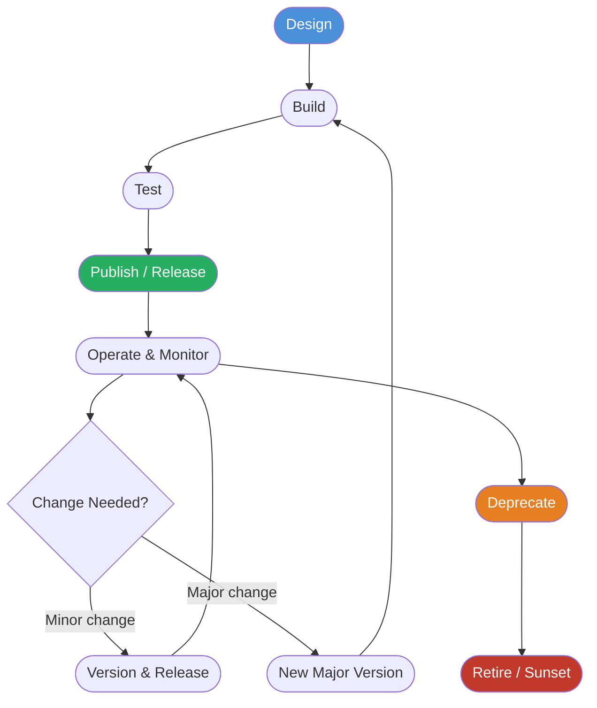
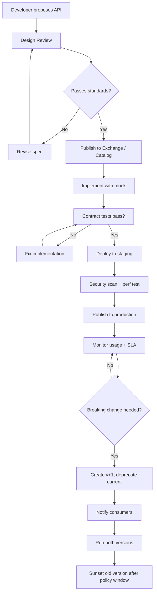
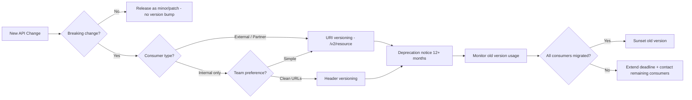
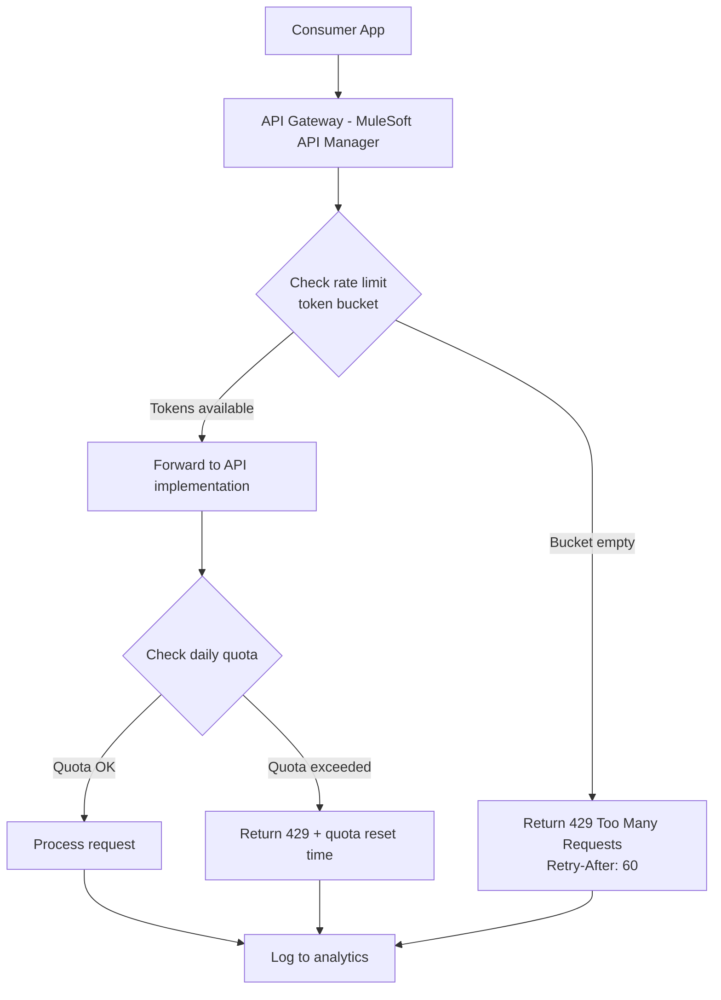

# API Governance and Versioning

## Exam Domain
Integration Problem Design — 26% | Security Considerations — 17%

## Foundations

Every enterprise integration landscape eventually faces the same crisis: APIs proliferate, consumers multiply, changes break things, and no one knows who owns what. API governance is the discipline that prevents this — the set of policies, processes, and standards that control how APIs are designed, published, consumed, and retired.

For the CRT-404 exam, governance questions tend to be scenario-based: a company has 50 integrations and a developer wants to change an endpoint — what process and tooling should exist? An API v1 is being deprecated — how long must it remain available? A third-party consumer is hammering the API — what controls exist?

Understanding governance also frames every other topic in this exam: naming conventions affect API discoverability, versioning strategy affects change management, rate limiting affects performance design, and lifecycle management affects error handling.

## Core Concepts

### What API Governance Is

API governance is the set of rules, policies, and processes that an organization applies across the full lifecycle of its APIs. It answers:

- **Who can create APIs?** (design authority, standards boards)
- **How must APIs be designed?** (naming, error formats, auth requirements)
- **How are APIs published and discovered?** (catalog, documentation)
- **How are APIs changed?** (versioning, deprecation, consumer notification)
- **How are APIs secured?** (required auth, encryption, rate limits)
- **How are APIs monitored?** (SLAs, alerting, usage analytics)
- **How are APIs retired?** (sunset timelines, consumer migration)

Governance is NOT bureaucracy for its own sake — it exists to enable speed by creating guardrails that prevent expensive rework, security incidents, and consumer-breaking changes.

### The API Lifecycle

APIs pass through well-defined stages:



**Design phase**: OpenAPI spec first, peer review, governance checklist approval before any code is written.

**Build phase**: Implementation follows the agreed spec. Mock server available for consumers.

**Test phase**: Contract testing (Pact), integration testing, security scanning, performance baseline.

**Publish**: Registered in API catalog (Anypoint Exchange, MuleSoft API Manager, internal portal). Documentation auto-generated from spec. SLA tier assigned.

**Operate**: Runtime policies enforced (rate limit, auth validation, TLS). Metrics dashboards active.

**Deprecate**: Minimum deprecation notice period (typically 6-12 months for external APIs). Sunset header added to responses. Consumer migration tracked.

**Retire**: Endpoint removed. 410 Gone returned if any remaining traffic.

### API Design Standards

A governance framework mandates consistent design. Key standards for Salesforce integration architects to know:

**Resource naming**:
- Use nouns, not verbs: `/accounts` not `/getAccounts`
- Plural nouns: `/orders` not `/order`
- Lowercase with hyphens: `/order-lines` not `/OrderLines`
- Hierarchical for relationships: `/accounts/{id}/contacts`

**HTTP method semantics**:
- GET: read, idempotent, cacheable
- POST: create, NOT idempotent
- PUT: full replace, idempotent
- PATCH: partial update, idempotent (when implemented correctly)
- DELETE: remove, idempotent

**Standard error response format** (governance mandates consistency):
```json
{
  "errorCode": "VALIDATION_ERROR",
  "message": "The field 'email' is required",
  "details": [
    { "field": "email", "issue": "missing_required_field" }
  ],
  "requestId": "a3f2c1d8-...",
  "timestamp": "2025-03-15T10:30:00Z"
}
```

**Pagination standard**: Cursor-based or offset-based. Governance picks ONE approach org-wide.

```json
{
  "data": [...],
  "pagination": {
    "nextCursor": "eyJpZCI6MTIzfQ==",
    "hasMore": true,
    "pageSize": 50
  }
}
```

**Date/time**: Always ISO 8601, always UTC: `2025-03-15T10:30:00Z`

**Idempotency-Key header**: Required for all POST/PATCH operations in the standard.

### API Versioning Strategies

Versioning is one of the most exam-tested governance topics. Four approaches:

#### 1. URI Path Versioning (Most Common)

```
GET /v1/accounts
GET /v2/accounts
```

- **Pros**: Explicit, visible in logs/URLs, easy to route at load balancer, easy for consumers to understand
- **Cons**: "Dirty" URLs philosophically (REST purists object), multiple base URLs to document
- **Salesforce uses this**: `/services/data/v58.0/`
- **MuleSoft recommends this** for Experience and Process APIs
- **Best for**: Public APIs, external partners, most enterprise scenarios

#### 2. Request Header Versioning

```
GET /accounts
Accept: application/vnd.company.accounts.v2+json
```

- **Pros**: Clean URLs, pure REST
- **Cons**: Not visible in logs, harder to test in browser, consumers often forget the header
- **Best for**: Internal APIs where consumers are controlled

#### 3. Query Parameter Versioning

```
GET /accounts?version=2
```

- **Pros**: Simple for clients, visible in URL
- **Cons**: Query parameters are semantically for filtering, not versioning; pollutes query space; can conflict with caching
- **Best for**: Rarely recommended; sometimes used for embedded script-tag APIs

#### 4. No Explicit Versioning (Content Negotiation)

Consumer sends `Accept` header and server responds with whatever it supports. Only appropriate for truly immutable APIs.

**Exam guidance**: URI path versioning is the correct answer for most Salesforce integration scenarios unless the question specifically describes a constraint that eliminates it.

### Breaking vs. Non-Breaking Changes

This distinction is critical for exam questions about deprecation and versioning:

**Non-breaking changes** (can release without version bump):
- Adding new optional fields to a response
- Adding new optional request parameters
- Adding new API endpoints
- Adding new values to an enum (risky but often acceptable)
- Performance improvements with no interface change
- Adding new HTTP methods to an existing resource

**Breaking changes** (REQUIRE a new version):
- Removing any field from request or response
- Renaming a field
- Changing a field's data type (string → integer)
- Making an optional field required
- Changing authentication method
- Changing URL path structure
- Changing error response format
- Removing an endpoint
- Changing behavior of an existing operation

**Semantic Versioning for APIs** (SemVer): `MAJOR.MINOR.PATCH`
- MAJOR: breaking change — consumers must migrate
- MINOR: new capability, backward compatible
- PATCH: bug fix, backward compatible

In URI versioning, typically only the MAJOR version appears in the URL. MINOR and PATCH versions are transparent to consumers.

### Deprecation Policy

A well-governed API deprecation policy includes:

1. **Deprecation notice period**: Typically 6 months (internal) to 24 months (external/partner)
2. **`Deprecation` response header**: `Deprecation: Sat, 31 Dec 2025 23:59:59 GMT`
3. **`Sunset` response header**: `Sunset: Sat, 31 Dec 2025 23:59:59 GMT` (RFC 8594)
4. **`Link` header pointing to new version**: `Link: <https://api.example.com/v2/accounts>; rel="successor-version"`
5. **Consumer notification**: Email, API portal alert, developer portal banner
6. **Usage monitoring**: Track calls to deprecated version to identify who still needs to migrate
7. **Hard cutoff date** in SLA/contract: legal clarity on when support ends

Salesforce supports old API versions for a minimum of 3 years and typically longer. As of 2025, the oldest supported version is v21.0 (released Spring 2011).

### API Contract-First Design

Contract-first means writing the OpenAPI specification BEFORE implementing the API. Benefits:

- Consumers can start building against a mock immediately
- Spec review catches design issues before code is written (cheaper to fix)
- Documentation is always accurate (generated from spec, not written after)
- Contract tests (Pact) can verify consumer-producer compatibility

**OpenAPI 3.0 structure** (architects need to know, not write from memory):
```yaml
openapi: 3.0.3
info:
  title: Account API
  version: 2.1.0
paths:
  /accounts:
    get:
      summary: List accounts
      parameters:
        - name: limit
          in: query
          schema:
            type: integer
      responses:
        '200':
          description: Success
          content:
            application/json:
              schema:
                $ref: '#/components/schemas/AccountList'
```

**External Services in Salesforce**: Salesforce can consume external APIs described with OpenAPI specs via External Services (Setup > Integrations > External Services). This generates invocable actions usable in Flow, dramatically simplifying integration without code.

### Rate Limiting and Throttling

Governance mandates rate limiting to protect APIs from abuse and ensure fair usage.

**Token Bucket Algorithm**:
- Bucket holds N tokens (capacity = burst limit)
- Tokens regenerate at rate R (steady-state rate)
- Each request consumes 1 token
- Request rejected (429) when bucket is empty
- Allows bursting up to capacity, then enforces steady rate

**Leaky Bucket Algorithm**:
- Requests enter queue (bucket)
- Queue drains at fixed rate R regardless of input rate
- Smooths out bursts — no bursting allowed above rate R
- Request rejected when queue is full

**Sliding Window**:
- Tracks exact timestamps of last N requests
- More accurate than fixed window but more memory-intensive

**Quota vs. Rate Limit**:
- **Rate limit**: requests per second/minute (short-term, burst control)
- **Quota**: requests per day/month (long-term, consumption control)
- Both can apply simultaneously: 100 req/sec AND 1,000,000 req/day

**HTTP 429 Too Many Requests**:
- Should include `Retry-After` header: `Retry-After: 60` (seconds) or `Retry-After: Thu, 15 Mar 2025 10:31:00 GMT`
- Consumers must implement backoff on 429

**MuleSoft API Manager Policies**:
- Rate Limiting policy: per API, per consumer
- Spike Control: soft limit with queuing before hard reject
- Throttling: queue requests rather than reject (slower but not dropped)

### Salesforce API Version Support

Key facts for the exam:
- Salesforce deprecates (not immediately removes) API versions in Winter releases
- Typically 3-year support window minimum
- After deprecation, version is "end-of-life" but may still work
- Recommendation: always use latest or latest minus 1 API version
- SOAP API and REST API follow same version scheme
- Metadata API versions align with core API versions

### Anypoint Exchange as API Catalog

MuleSoft Anypoint Exchange is the API catalog/marketplace for organizations using MuleSoft. Key governance capabilities:
- Publish API specs (OAS/RAML) for discovery
- Version management — all versions of an API visible
- Ratings, documentation, usage analytics
- Governed publishing: only approved APIs can be published
- Consumer subscription management
- Integration with API Manager for policy enforcement

### API Governance Maturity Model

For PTA conversations with customers:

| Level | Description | Characteristics |
|-------|-------------|-----------------|
| 0 — Chaos | No governance | Ad-hoc APIs, no standards, P2P spaghetti |
| 1 — Aware | Basic standards | REST naming conventions, some documentation |
| 2 — Managed | Defined process | Versioning policy, API catalog, review process |
| 3 — Optimized | Automated governance | Linting in CI/CD, contract testing, automated policy enforcement, API as product |

---

## PTA / SA Relevance

### When This Comes Up in Engagements

Governance conversations happen at three trigger points:

1. **Pre-implementation**: Customer wants to build 20 new integrations. Governance assessment first — what standards will govern these? Prevents future rework.

2. **Crisis**: Customer has broken an integration by changing an API without notice. Now they want a process. Perfect teachable moment.

3. **Modernization**: Customer is replacing a legacy ESB. Governance design is central to the migration strategy — how will APIs from the old system map to new governed APIs?

**Discovery questions to ask**:
- "When a developer changes a REST endpoint, what's the notification process to consumers?"
- "Do you have an API catalog? Can any developer find all available APIs?"
- "What happens when two teams both need the same backend data — do they build separate integrations?"
- "What's your versioning strategy — how do you handle breaking changes?"
- "Who approves new integration patterns before implementation begins?"

### Common Architecture Failures

1. **No versioning strategy**: Developer renames a field, downstream consumer breaks at 2 AM. No rollback path. Root cause: no governance policy on breaking changes.

2. **Phantom APIs**: APIs that were built for a specific project, developer left, no documentation, nobody knows what they do. Found only when they start failing. Root cause: no API catalog requirement.

3. **Rate limit surprise**: An integration hammers Salesforce API until daily limit is exhausted. Root cause: no rate limiting governance on the consumer side, no quota monitoring.

4. **Version sprawl**: v1, v2, v3, v4 all running simultaneously because no deprecation enforcement. Maintenance cost scales with version count. Root cause: no sunset policy.

5. **API as code, not contract**: Spec is generated from code (Swagger annotations), not the other way around. Spec is always slightly wrong. Consumers build on wrong assumptions.

### Enterprise Patterns

**Large enterprises (F500)**: Typically have a dedicated API Center of Excellence (CoE). MuleSoft's Anypoint Exchange is the catalog. API design board reviews new APIs. CI/CD pipeline includes OAS linting (Spectral), contract tests (Pact), and policy enforcement validation.

**Mid-market**: Lighter governance. Usually a shared team wiki with API standards, a manual review process via pull request, and MuleSoft API Manager for runtime policies. No formal design board.

**Salesforce-specific**: Many customers treat Salesforce as a black-box and only govern their custom integration layer. Best practice: govern the integration layer (MuleSoft/middleware) even if Salesforce's own APIs are consumed as-is.

---

## Architecture

### API Lifecycle Governance Process



### Versioning Strategy Decision Tree



### Rate Limiting Architecture in MuleSoft



**Limitations & Tradeoffs:**

| Versioning Strategy | Pros | Cons |
|---------------------|------|------|
| URI path | Visible, loggable, route-able | "Impure" REST; multiple base URLs |
| Request header | Clean URLs, semantically correct | Invisible in logs; harder to test |
| Query parameter | Easy for clients | Pollutes query space; caching issues |
| None | Simple | Breaks consumers on any change |

| Rate Limit Algorithm | Burst Handling | Memory | Accuracy |
|----------------------|---------------|--------|----------|
| Token bucket | Allows burst to capacity | Low | Medium |
| Leaky bucket | No burst — fixed drain rate | Low | High |
| Sliding window | No burst — exact window | High | Highest |

---

## Key Facts to Memorize

- Salesforce API versioning uses URI path: `/services/data/vXX.0/`
- Salesforce supports API versions for **minimum 3 years**
- Non-breaking change examples: adding optional fields, new endpoints, new enum values
- Breaking change examples: removing fields, changing types, changing required params, changing auth
- **HTTP 429** = Too Many Requests (rate limit hit)
- `Retry-After` header specifies when to retry after a 429
- `Sunset` header (RFC 8594) communicates API retirement date
- Token bucket allows burst; leaky bucket enforces smooth rate
- Quota = long-term (daily/monthly); Rate limit = short-term (per second/minute)
- OpenAPI 3.0 is the standard for API specification
- External Services in Salesforce uses OpenAPI spec to generate Flow actions
- Anypoint Exchange = MuleSoft's API catalog
- Contract-first design: spec before code
- SemVer: MAJOR.MINOR.PATCH — only MAJOR appears in URI

---

## Exam Traps

1. **"Add a required field to request" is a breaking change** — exams often imply it's minor because "it's just adding." Adding required = breaking.

2. **Salesforce versioning** — the exam may test whether you know SF uses URI versioning (`/vXX.0/`). Don't confuse with header versioning.

3. **Quota vs rate limit**: The exam may describe a scenario where a customer is hitting a DAILY limit (quota) and ask what type of control is needed — answer is quota management, not rate limiting.

4. **Deprecation ≠ Removal**: Salesforce deprecates versions but they continue to work for years. "Deprecated" does not mean "removed."

5. **External Services imports OpenAPI spec** — not RAML, not WSDL (for REST). WSDL is for SOAP/External Services SOAP support.

6. **API governance maturity questions**: If an organization has no process for handling breaking changes, it's Level 0/1. The recommendation is not "just add versioning" — it's a governance framework.

7. **Token bucket vs leaky bucket**: Token bucket allows bursting, leaky bucket smooths traffic. The exam may describe a scenario where burst traffic is causing issues — leaky bucket (or spike control) is the answer.

---

## Practice Questions

**Question 1**
A financial services company has 40 API consumers integrated with their Salesforce org via a custom REST API built on MuleSoft. A developer wants to rename the `accountNumber` field to `acct_num` in the response to match a new naming convention. Which governance action must occur before this change is deployed?

A. Deploy the change immediately since it is a minor naming improvement
B. Create a new major API version with the renamed field, maintain the old version during a migration window, and notify all 40 consumers
C. Use a request header flag to toggle between old and new field names
D. Update the field name in staging first, then deploy to production after 48 hours

**Answer: B**
**Explanation:** Renaming a response field is a breaking change — any consumer reading `accountNumber` will fail if it becomes `acct_num`. A new major version must be created, the old version maintained during a deprecation/migration window, and consumers notified. This is fundamental API versioning governance.

**Why the others are wrong:**
- A: Renaming a field IS a breaking change, not a minor improvement. Deployed without versioning, 40 consumers would break immediately.
- C: Toggling via request header is a workaround, not governance. It creates an undocumented feature and doubles maintenance.
- D: Staging/prod timing is irrelevant — the problem is the breaking change, not where it's deployed first.

---

**Question 2**
An architect is designing an API governance policy for a large enterprise. The policy must specify how long deprecated APIs must remain available before being removed. External partners integrate with these APIs. What is the MOST appropriate deprecation window?

A. 30 days
B. 90 days
C. 6 months
D. 12-24 months

**Answer: D**
**Explanation:** External partner integrations typically have long change management cycles — they may need budget approval, development sprints, testing, and their own release schedules. A 12-24 month window is industry best practice for external-facing APIs. Salesforce itself maintains API versions for a minimum of 3 years.

**Why the others are wrong:**
- A: 30 days is far too short for external partners to plan, develop, test, and deploy API changes.
- B: 90 days may be acceptable for internal APIs but is insufficient for external partners.
- C: 6 months may work for some partners but is still below the standard for enterprise external APIs where release cycles can be 6 months alone.

---

**Question 3**
A MuleSoft API is receiving bursts of traffic from a consumer during business hours — 500 req/sec for 10 seconds, then quiet for minutes. The average rate is well within limits, but the bursts are overwhelming the backend. Which rate limiting strategy should the architect apply?

A. Token bucket with capacity 500 and refill rate 50/sec
B. Leaky bucket (fixed drain rate of 50/sec)
C. Daily quota of 100,000 requests
D. Sliding window of 50 requests per second

**Answer: B**
**Explanation:** The problem is bursty traffic overwhelming the backend even though the average rate is fine. A leaky bucket enforces a fixed drain rate (e.g., 50/sec), smoothing out bursts. Requests queue at the bucket rather than flooding the backend at 500/sec. A token bucket would ALLOW the burst (that's its feature), which is not what's needed here.

**Why the others are wrong:**
- A: Token bucket ALLOWS bursting up to capacity, so the 500 req/sec burst would still hit the backend. This makes the problem worse, not better.
- C: A daily quota addresses long-term consumption, not burst spikes within a minute.
- D: A sliding window rate limit would reject requests over 50/sec but the question implies the backend is being overwhelmed — queuing (leaky bucket) is better than rejecting.

---

**Question 4**
A Salesforce developer asks: "Can I add a new optional field `phoneExtension` to the response of the `/contacts` v2 API without creating a v3?" What is the correct architectural guidance?

A. No — any change to a response requires a new version
B. Yes — adding an optional field to a response is a non-breaking change and does not require a new version
C. Yes — but only if all consumers confirm they can handle unknown fields
D. No — response changes always require a version bump regardless of breaking status

**Answer: B**
**Explanation:** Adding an optional field to a response is a non-breaking change. Well-designed consumers follow Postel's Law (be liberal in what you accept) and ignore unknown fields. This is a standard non-breaking enhancement that can be released as a minor version without bumping the major version.

**Why the others are wrong:**
- A: This is overly restrictive. Non-breaking additions (new optional fields, new endpoints) do not require major version bumps.
- C: While consumer confirmation is good practice, technically this change is non-breaking. Architecturally, requiring explicit consumer confirmation for every optional field addition would make API evolution impossibly slow.
- D: Incorrect. Only breaking changes require a version bump.

---

**Question 5**
A company's API consumers are receiving HTTP 429 responses and complaining about integration failures. The architect investigates and finds consumers are hitting the daily quota limit, not the per-second rate limit. What is the MOST appropriate solution?

A. Increase the per-second rate limit
B. Implement exponential backoff in the consumer on 429 responses
C. Review consumer usage patterns, implement quota increase or enforce daily quota tiers per consumer, and add quota monitoring with alerts
D. Switch from URI versioning to header versioning

**Answer: C**
**Explanation:** The problem is quota exhaustion (daily limit), not rate spiking. The solution requires understanding WHY consumers are exhausting the quota (over-consumption, bugs, unbounded queries), implementing proper quota tiers by consumer, and adding monitoring so the team is alerted before quota exhaustion rather than after. Backoff (option B) helps the consumer fail gracefully but doesn't solve the root cause.

**Why the others are wrong:**
- A: The problem is daily quota, not per-second rate limiting. Increasing rate limit doesn't help with daily quota exhaustion.
- B: Exponential backoff is good practice for handling 429s but doesn't address root cause quota exhaustion — the consumer will just fail more slowly.
- D: Versioning strategy is irrelevant to quota issues.
