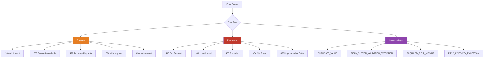
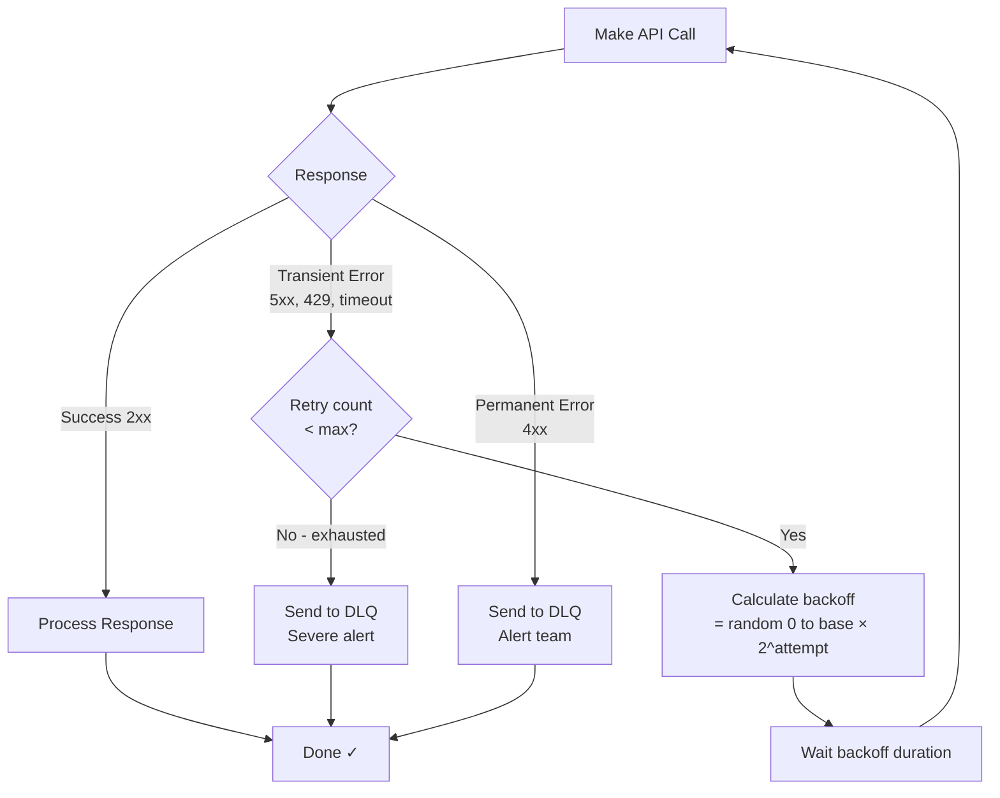
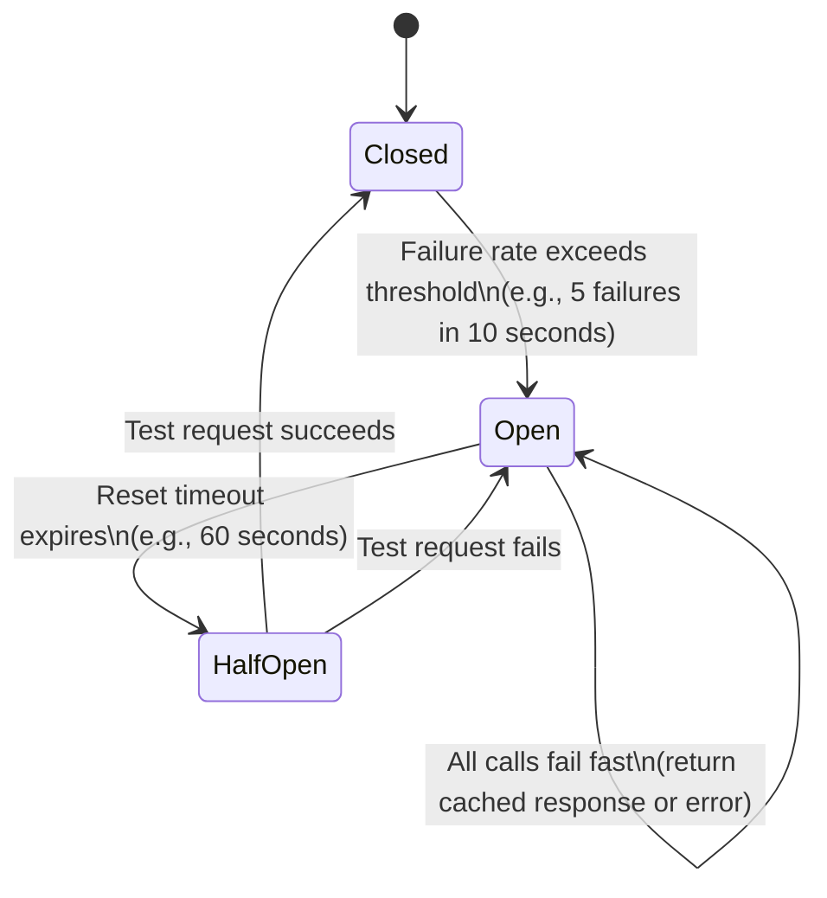
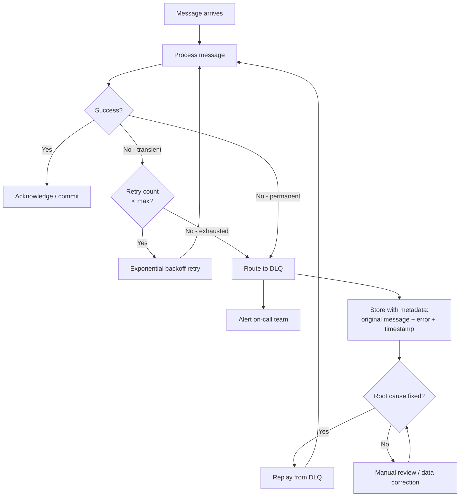
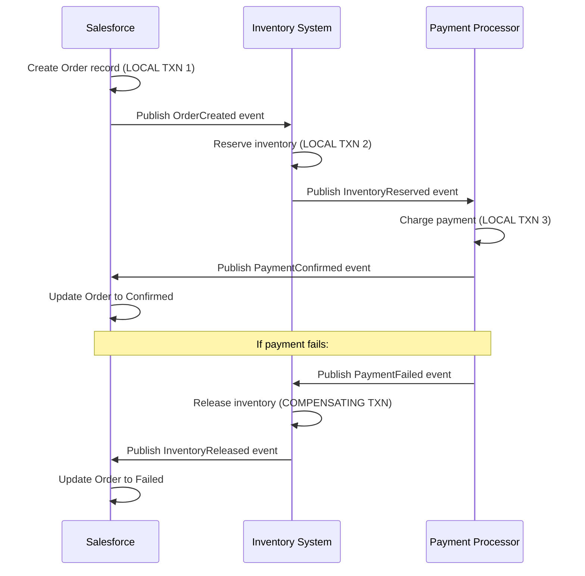
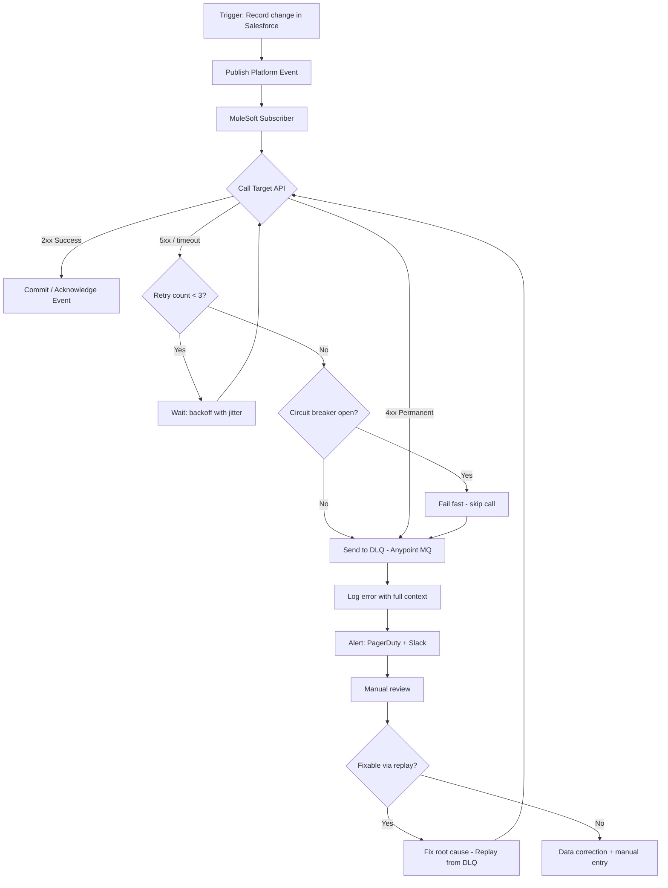
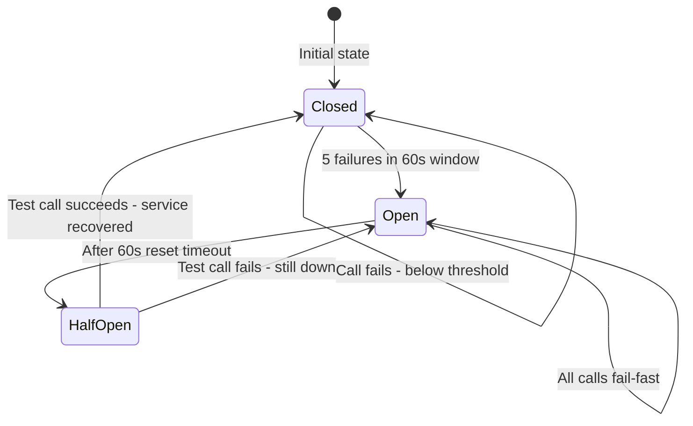
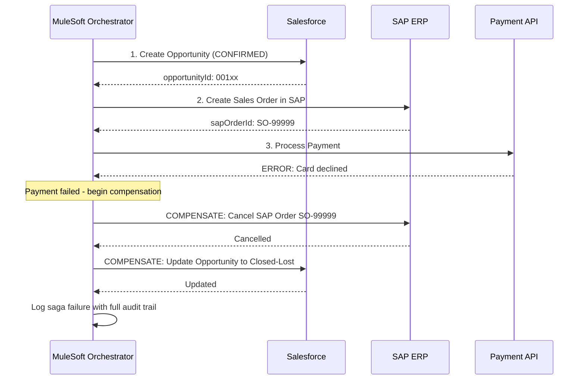

# Error Handling and Retry Patterns

## Exam Domain
Problem-Solving Integration Issues — 13% | Integration Architecture Patterns — 22%

## Foundations

Integration failures are inevitable. Networks drop packets, third-party APIs go down, rate limits get exceeded, data validation fails. The difference between a resilient integration and a fragile one is not whether failures happen — it's how the system responds when they do.

For the CRT-404 exam, error handling questions are predominantly scenario-based: "An integration occasionally fails with a 503 — what should the architect do?" or "A Platform Event subscriber crashes mid-processing — how is the message recovery handled?" The exam tests whether you know the right pattern for each failure type, understand Salesforce-specific error behaviors, and can identify which approach prevents data loss vs. data duplication.

The key mental model: classify the error first (transient vs. permanent), then choose the response (retry with backoff, reject, DLQ, circuit break, compensate).

## Core Concepts

### Error Classification

Before choosing a recovery strategy, classify the error:



**Transient errors**: Temporary conditions. Retrying after a delay will likely succeed. Examples: network blip, temporary service overload, rate limit (retry after window resets).

**Permanent errors**: The request itself is wrong. Retrying without fixing the request will always fail. Examples: malformed JSON, invalid field value, missing required field, record not found.

**Business logic errors**: The system worked correctly but rejected the data based on rules. Requires human review or data correction, not retry. Examples: Salesforce validation rule failure, duplicate record detection, field integrity violation.

**Critical rule**: Never retry permanent or business logic errors. Doing so wastes resources, creates noise in logs, and delays alerting to the real problem.

### Salesforce-Specific Error Codes

These appear in Salesforce REST/SOAP API error responses and are exam-relevant:

| Error Code | Meaning | Retryable? |
|------------|---------|------------|
| `LIMIT_EXCEEDED` | Hit a governor limit (API calls, SOQL, etc.) | Yes — after reset |
| `UNABLE_TO_LOCK_ROW` | Record lock contention | Yes — short backoff |
| `DUPLICATE_VALUE` | Duplicate record detected | No — fix data |
| `FIELD_CUSTOM_VALIDATION_EXCEPTION` | Validation rule failed | No — fix data |
| `REQUIRED_FIELD_MISSING` | Required field not in request | No — fix request |
| `INVALID_FIELD` | Field name doesn't exist | No — fix request |
| `INSUFFICIENT_ACCESS_ON_CROSS_REFERENCE_OBJECT` | Permission issue | No — fix permissions |
| `FIELD_INTEGRITY_EXCEPTION` | Picklist value invalid, etc. | No — fix data |
| `REQUEST_LIMIT_EXCEEDED` | API daily limit hit | Yes — next day / buy more |
| `QUERY_TIMEOUT` | SOQL query took too long | Yes — optimize query |

REST API error format:
```json
[
  {
    "message": "The value 'INVALID_STATUS' is not valid for field StatusCode.",
    "errorCode": "FIELD_INTEGRITY_EXCEPTION",
    "fields": ["StatusCode"]
  }
]
```

### Retry Patterns

#### Pattern 1: Simple Immediate Retry

Retry immediately on failure. Appropriate only for transient errors caused by a fleeting network glitch.

```
attempt 1 → fail → attempt 2 → fail → attempt 3 → succeed
(no delay)
```

**When to use**: Very brief, isolated network blips where the issue resolves in milliseconds. Almost never the right choice in production.

**Problem**: If the remote service is overloaded, immediate retries add MORE load and make recovery harder (thundering herd problem).

#### Pattern 2: Fixed Interval Retry

Retry after a fixed wait period.

```
attempt 1 → fail → wait 30s → attempt 2 → fail → wait 30s → attempt 3
```

**When to use**: When the failure has a known minimum recovery time (e.g., a scheduled maintenance window of exactly 30 minutes).

**Problem**: Multiple consumers retrying at the same fixed interval create synchronized load spikes.

#### Pattern 3: Exponential Backoff

Each retry waits exponentially longer:

`delay = base × 2^(attempt - 1)`

Example with base = 1 second:
- Attempt 1 fails → wait 1s
- Attempt 2 fails → wait 2s
- Attempt 3 fails → wait 4s
- Attempt 4 fails → wait 8s
- Attempt 5 fails → wait 16s
- Give up after N attempts

**Why it works**: Gives the failing system time to recover. Load naturally decreases as consumers back off.

**Problem**: Multiple consumers all backing off by the same schedule will still retry simultaneously — they just do so at exponential intervals instead of a fixed one.

#### Pattern 4: Exponential Backoff with Jitter (Best Practice)

Add randomness to the backoff delay to spread retries across time:

`delay = random(0, base × 2^(attempt - 1))`

Or the "full jitter" variant:
`delay = random(0, min(max_delay, base × 2^attempt))`

This is the **recommended production pattern** for all integration retries.



**Maximum retries**: Typically 3-5 for synchronous calls. Async processing may retry more (Platform Events default: 9 retries).

**Max delay cap**: Always cap the max delay to prevent indefinitely growing wait times. Common cap: 5-30 minutes.

### Idempotency

Idempotency is the property of an operation where executing it multiple times produces the same result as executing it once. This is essential for safe retry.

**Why it matters for retries**: If a POST to create an Order succeeded on the server but the response was lost in transit, the client doesn't know if the order was created. If you retry without idempotency, you create a duplicate order.

**Making operations idempotent**:

1. **Idempotency Key header**: Client sends a unique ID with the request. Server stores (key → result). On duplicate request with same key, server returns cached result without re-processing.

```
POST /orders
Idempotency-Key: 7f3a1b2c-4d5e-6f7a-8b9c-0d1e2f3a4b5c
```

2. **External ID upsert in Salesforce**: Instead of INSERT (not idempotent), use UPSERT with an external ID. If the record already exists, it updates; if not, it inserts. Same request, same outcome every time.

```
PATCH /services/data/v58.0/sobjects/Order__c/External_Order_Id__c/ORD-12345
```

3. **Deduplication by correlation ID**: Store the correlation/transaction ID on the target record. Before processing, check if a record with this ID already exists.

**HTTP method idempotency**:
- GET: naturally idempotent
- PUT/PATCH: idempotent by design (updates existing state)
- DELETE: idempotent (deleting an already-deleted record returns 404, not an error)
- POST: NOT inherently idempotent (each call creates a new resource)

### Circuit Breaker Pattern

The circuit breaker prevents an integration from repeatedly trying to call a service that is clearly down, wasting resources and holding up threads.

**States**:



**Closed state**: Normal operation. Calls pass through. Failure rate is monitored.

**Open state**: Circuit tripped. All calls fail immediately without attempting the remote call (fail fast). Returns a cached response or graceful error to the caller. Caller is not kept waiting.

**Half-Open state**: After the reset timeout, one test request is allowed through. If it succeeds, circuit closes (service recovered). If it fails, circuit re-opens (service still down).

**Configuration parameters**:
- Failure threshold: how many failures (or what failure rate %) to trip the breaker
- Observation window: the time window for counting failures
- Reset timeout: how long the circuit stays open before trying half-open

**MuleSoft implementation**: API Manager includes a Circuit Breaker policy. Resilience4j is common for Java-based integrations. Apex doesn't have built-in circuit breaker — implement via Custom Metadata that tracks failure counts.

**Why architects care**: Without circuit breaker, an integration calling a down service will exhaust thread pools, slow down unrelated operations, and cause cascading failures across the system.

### Dead Letter Queue (DLQ)

A Dead Letter Queue is where messages go after all retry attempts have been exhausted. Instead of silently discarding failed messages, they are routed to a holding area for:

1. **Alerting**: Ops team notified that messages require attention
2. **Analysis**: Why did these messages fail? Data issue? Service bug?
3. **Replay**: Once root cause is fixed, messages can be reprocessed



**DLQ for Salesforce Platform Events**: Platform Events retry 9 times by default in Apex triggers. After 9 failures, the event is discarded. To implement a DLQ:
- Create a custom `Integration_Error_Log__c` object
- In the trigger's catch block, write the failed event payload + error message to the log object
- Create a monitoring dashboard on this object
- Process can be a Flow or Batch Apex that re-publishes events from the log

**DLQ for MuleSoft**: On-error-continue flow writes failed message to a persistent queue (Anypoint MQ or JMS). Separate error handling flow processes the DLQ.

**Key DLQ metadata to store**:
- Original message payload (JSON/XML)
- Error message and stack trace
- Number of retry attempts
- Timestamps (first attempt, last attempt, DLQ time)
- Source system and target system
- Correlation ID / external reference ID

### Saga Pattern (Distributed Transactions)

Traditional database transactions use ACID guarantees with rollback. In distributed systems spanning multiple services (Salesforce + ERP + Payment processor), there's no global transaction manager. The Saga pattern handles this.

A saga is a sequence of local transactions. If one step fails, compensating transactions are executed to undo the previous steps.

**Example**: Create a Sales Order spanning Salesforce, inventory system, and payment processor.

**Choreography-based Saga** (event-driven):



**Orchestration-based Saga** (central coordinator):
- A central orchestrator (often a MuleSoft flow or Apex class) calls each service in sequence
- On failure, the orchestrator explicitly calls compensating APIs
- Easier to visualize and debug, but the orchestrator becomes a dependency

**When Salesforce needs sagas**:
- Multi-org Salesforce scenarios (Sales Cloud + Service Cloud + separate Finance org)
- Salesforce + ERP + payment processor transactions
- Any scenario where partial failure of a multi-step process leaves data inconsistent

### Error Logging and Alerting Architecture

Resilient integrations are observable integrations. Design requirements:

**Log everything at the integration layer**:
- Request sent (endpoint, payload summary, timestamp)
- Response received (status code, response time)
- Error details when applicable (error code, message, retry count)
- Correlation ID that traces across systems

**Salesforce-side logging** (if Apex is the integration layer):
```apex
try {
    HttpResponse res = http.send(req);
    if (res.getStatusCode() != 200) {
        logIntegrationError('Account Sync', req, res, 0);
    }
} catch (CalloutException e) {
    logIntegrationError('Account Sync', req, null, 0);
}
```

Custom `Integration_Log__c` object fields: `Direction__c`, `Endpoint__c`, `Status_Code__c`, `Error_Message__c`, `Payload__c` (Long Text), `Duration_ms__c`, `Correlation_Id__c`, `Retry_Count__c`.

**Alerting thresholds**:
- Error rate >5% in 5 minutes → warning alert
- Error rate >20% in 5 minutes → critical alert (PagerDuty/Slack)
- DLQ depth >10 unprocessed messages → alert
- Circuit breaker opened → immediate alert

**MuleSoft error handling scopes**:
- `on-error-continue`: handles error, flow continues (use for non-critical errors)
- `on-error-propagate`: handles error, propagates to parent error handler (use for critical errors)

---

## PTA / SA Relevance

### When This Comes Up in Engagements

Error handling surfaces in every integration engagement but often as an afterthought. Watch for these signals:

- **"It works fine in testing"** — testing happy path only. Error scenarios not tested.
- **"We monitor it manually"** — no automated alerting. Failures discovered by angry business users.
- **"It failed but we don't know why"** — no logging. Debugging requires code inspection and logs from multiple systems.
- **"We just restart it"** — no retry logic. Manual restart is the recovery mechanism.

**Discovery questions**:
- "What happens when the ERP API returns a 500 error? Does the integration retry?"
- "Have you ever lost a message in transit? How would you know if you had?"
- "How do you know when an integration is failing right now, before business users complain?"
- "If a Platform Event subscriber fails, where does that message go?"
- "Do you test your integrations against API rate limits?"

### Common Architecture Failures

1. **Silent failure**: Integration catches exceptions, logs nothing, returns success. Business-critical records silently not created in the target system. Discovered weeks later during audit.

2. **Retry storm**: On mass failure (e.g., target system down for 1 hour), all queued retries fire simultaneously when the system comes back, overwhelming it and causing another outage.

3. **No DLQ**: After max retries, messages are discarded. No record of what failed. Recovery requires full re-run of the source data. Often impossible for event streams.

4. **Retrying permanent errors**: An Apex trigger retries 9 times on a record that has a validation rule failure. Wastes 9 callouts, alerts fire 9 times. The fix is to classify the error correctly and fail fast.

5. **No idempotency + retry = duplicates**: Apex trigger makes a callout to create an order in ERP. Callout succeeds but times out before Salesforce gets the response. Trigger retries, creating a duplicate order in ERP. No external ID upsert in place.

6. **Circuit breaker absent**: SAP is down for 6 hours. Integration threads keep hammering SAP every 30 seconds for 6 hours. SAP recovery is delayed because it's getting battered by retries from all consumers the moment it restarts.

### Enterprise Patterns

Large enterprises implement integration error handling as a platform capability:

- **Centralized error dashboard**: Custom Salesforce object or Splunk/Datadog dashboard showing all integration errors across all integration points
- **On-call rotation**: PagerDuty alerts routing to integration team
- **Runbook per integration**: For each error type, a documented resolution procedure
- **SLA monitoring**: Integration error rate and latency tracked against SLAs
- **Chaos engineering**: Deliberately inject failures to test recovery mechanisms

---

## Architecture

### Full Resilience Pattern with DLQ



### Circuit Breaker State Machine



### Saga Compensating Transaction Flow



**Limitations & Tradeoffs:**

| Pattern | Best For | Weakness |
|---------|----------|----------|
| Exponential backoff + jitter | All transient errors | Still fails if service is down for hours |
| Circuit breaker | Protecting overloaded downstream | May block valid requests during recovery |
| DLQ | Preventing data loss on max-retry | Requires operational process to drain DLQ |
| Saga (choreography) | Decoupled multi-system transactions | Hard to track saga state; complex debugging |
| Saga (orchestration) | Visibility into saga state | Orchestrator is a single point of failure |
| Idempotency key | POST operations with retry | Requires key storage; adds latency |

---

## Key Facts to Memorize

- **Transient errors** (5xx, 429, timeout): retry with exponential backoff + jitter
- **Permanent errors** (4xx): do NOT retry — send to DLQ immediately
- **Platform Events**: Apex trigger retries **9 times** before the event is dropped
- **Exponential backoff formula**: `delay = base × 2^attempt`
- **Jitter**: adds randomness to prevent thundering herd on retry
- **Circuit breaker states**: Closed → Open → Half-Open → Closed
- **DLQ**: where messages go after max retries — must have process to drain it
- **Idempotency key**: enables safe POST retry without duplicates
- **Salesforce upsert with external ID** = idempotent create/update
- **`UNABLE_TO_LOCK_ROW`**: retryable — record locking contention
- **`FIELD_CUSTOM_VALIDATION_EXCEPTION`**: not retryable — fix the data
- **`REQUEST_LIMIT_EXCEEDED`**: retryable after daily limit resets (midnight GMT)
- Saga pattern handles distributed transactions with compensating transactions
- MuleSoft: `on-error-continue` vs `on-error-propagate` — know the difference
- Circuit breaker prevents cascade failure when downstream service is down

---

## Exam Traps

1. **"Platform Events retry automatically" — HOW MANY TIMES?** The answer is 9 retry attempts before the event is dropped. If the question asks about preventing message loss, the answer involves DLQ / error logging, not just "Platform Events retry automatically."

2. **Retry on 400/401/422 is wrong**. The exam may describe a solution that retries on ALL errors. Identify that retrying permanent errors is wasteful and masks the real problem.

3. **Circuit breaker vs. retry**: These work together, not instead of each other. Circuit breaker fires AFTER retries are exhausted (or on a separate failure rate monitor). Don't say "use circuit breaker instead of retry."

4. **Idempotency question**: If a scenario describes a POST that might be sent twice (network retry, duplicate webhook), the answer involves idempotency key OR external ID upsert — not "use GET instead of POST."

5. **Jitter purpose**: The exam may ask WHY jitter is added to backoff. The answer is to prevent thundering herd (many consumers retrying simultaneously). Not "to make retries faster."

6. **Saga vs. rollback**: The exam may offer "use database transaction rollback" as an option for a multi-system integration failure. The answer is saga + compensating transactions — database rollback cannot span multiple independent services.

7. **DLQ question**: If the scenario says "messages are being dropped after repeated failures," the correct fix is implement a DLQ. Not "increase retry count" (which just delays the drop).

---

## Practice Questions

**Question 1**
An Apex trigger publishes a Platform Event when a Contract is signed. The subscriber is a MuleSoft flow that calls an external DocuSign API to send for e-signature. Occasionally, the DocuSign API returns 503 Service Unavailable. The integration team reports that signed Contracts are sometimes not sent to DocuSign. What is the MOST likely root cause?

A. Platform Events do not support retry
B. The MuleSoft flow has no error handling and is dropping messages after the first 503 failure with no retry or DLQ
C. The Apex trigger should use a Future method instead of Platform Events
D. DocuSign does not support HTTP 503 responses

**Answer: B**
**Explanation:** HTTP 503 is a transient error — Service Unavailable is temporary. Without retry logic and a DLQ in the MuleSoft flow, a 503 causes the message to be silently dropped. The contract event is consumed (acknowledged) by MuleSoft but never successfully delivered to DocuSign. Proper error handling would retry with backoff on 503 and route to DLQ after max retries.

**Why the others are wrong:**
- A: Platform Events DO support retry — Apex trigger subscribers retry 9 times. MuleSoft subscribers have configurable retry.
- C: Future methods are for async callouts directly from Apex; they don't fix error handling in MuleSoft.
- D: HTTP 503 is a standard response code. All HTTP clients support receiving it.

---

**Question 2**
An integration between Salesforce and an ERP system uses an Apex trigger to call a REST API when Opportunities are Closed Won. The ERP team reports that duplicate orders are appearing. Investigation shows that the Apex callout sometimes succeeds at the ERP but times out before the response reaches Salesforce, causing the trigger to retry. What is the BEST solution?

A. Remove the retry logic from the trigger
B. Use a scheduled batch job instead of a trigger
C. Implement idempotency in the ERP API using an external ID, and use Salesforce's Opportunity ID as the idempotency key
D. Switch from REST to SOAP

**Answer: C**
**Explanation:** The root cause is that a successful ERP call followed by a timeout causes Apex to retry, creating duplicates. The solution is idempotency: send the Opportunity ID as an idempotency key (or use upsert with external ID). The ERP checks if an order with this Salesforce ID already exists before creating a new one — if it does, it returns the existing order instead of creating a duplicate.

**Why the others are wrong:**
- A: Removing retry means that genuine failures (where the ERP never received the call) result in lost orders. Worse outcome.
- B: Scheduled batch reduces the window for duplicates but doesn't eliminate the fundamental problem — duplicate creation on retry is still possible.
- D: SOAP vs. REST is irrelevant to the idempotency problem.

---

**Question 3**
A MuleSoft integration calls a legacy payment processing API that tends to fail completely (return 500 errors) for 5-10 minutes during daily batch windows. During these outages, the MuleSoft flow exhausts its thread pool waiting for payment responses and begins failing other unrelated integrations. What pattern addresses this?

A. Implement a DLQ for the payment integration
B. Implement a Circuit Breaker on the payment API call that opens after 3 consecutive 500 errors
C. Increase the connection timeout on the payment API call
D. Add exponential backoff retries to the payment API call

**Answer: B**
**Explanation:** Thread pool exhaustion from a slow/failing downstream service is the classic circuit breaker use case. When the breaker opens (after 3 consecutive 500s), payment calls fail fast without consuming threads. This protects the thread pool and prevents cascade failure to unrelated integrations. The breaker half-opens after the reset timeout to test recovery.

**Why the others are wrong:**
- A: A DLQ handles what to do with failed messages — it doesn't prevent thread exhaustion.
- C: Increasing timeout makes the problem WORSE — threads are held longer, exhausting the pool faster.
- D: Exponential backoff slows the rate of calls but threads are still held during the retry wait. The core problem (thread exhaustion) persists.

---

**Question 4**
A company uses Platform Events to notify a MuleSoft flow when Order records are updated in Salesforce. The MuleSoft flow crashes mid-processing due to a bug. The team fixes the bug and restarts the flow. Which feature ensures that events published while the flow was down are not lost?

A. Salesforce automatically re-publishes all Platform Events every 24 hours
B. MuleSoft can replay Platform Events using the ReplayId, retrieving events from the last 72 hours
C. The Apex trigger will republish the events automatically upon flow restart
D. Platform Events are stored in Salesforce forever and can always be replayed

**Answer: B**
**Explanation:** Platform Events retain events for 72 hours (3 days). Each event has a ReplayId. A subscriber can reconnect and specify the ReplayId from before the crash (or use -2 for earliest available) to replay all missed events within the retention window. MuleSoft's Salesforce Connector supports this replay capability natively.

**Why the others are wrong:**
- A: Salesforce does not automatically re-publish events. Retention is passive — the subscriber must actively replay.
- C: Apex triggers are publishers, not replay agents. They fire on record changes only. They don't re-publish historical events.
- D: Platform Events are NOT stored forever. The retention window is 72 hours. Events older than 72 hours are gone.

---

**Question 5**
An integration process creates an Opportunity in Salesforce, then an Order in SAP, then initiates a credit check in a third-party system. The credit check fails. What pattern ensures the Opportunity and SAP Order are cleaned up?

A. Two-phase commit across all three systems
B. Saga pattern with compensating transactions: cancel the SAP Order, then set the Opportunity to Closed-Lost
C. Place all three operations in a single Apex transaction with a try-catch and rollback
D. Re-run the entire process from scratch after fixing the credit check issue

**Answer: B**
**Explanation:** Two-phase commit is not feasible across independent external systems (Salesforce, SAP, third-party). A single Apex transaction cannot span external callouts — DML and callouts have strict governor rules. The saga pattern handles multi-system distributed transactions by executing compensating transactions in reverse order: cancel credit check (already failed), cancel SAP Order, update Salesforce Opportunity to Closed-Lost.

**Why the others are wrong:**
- A: Two-phase commit requires all systems to support a distributed transaction coordinator. Most enterprise systems (SAP, third-party APIs) do not.
- C: Salesforce Apex cannot roll back external callouts. The `try-catch` can roll back Salesforce DML, but the SAP Order was already committed in SAP. Apex Savepoints do not affect external systems.
- D: Re-running is not cleanup — it would create a second attempt, potentially leaving the SAP Order in a failed state indefinitely.
