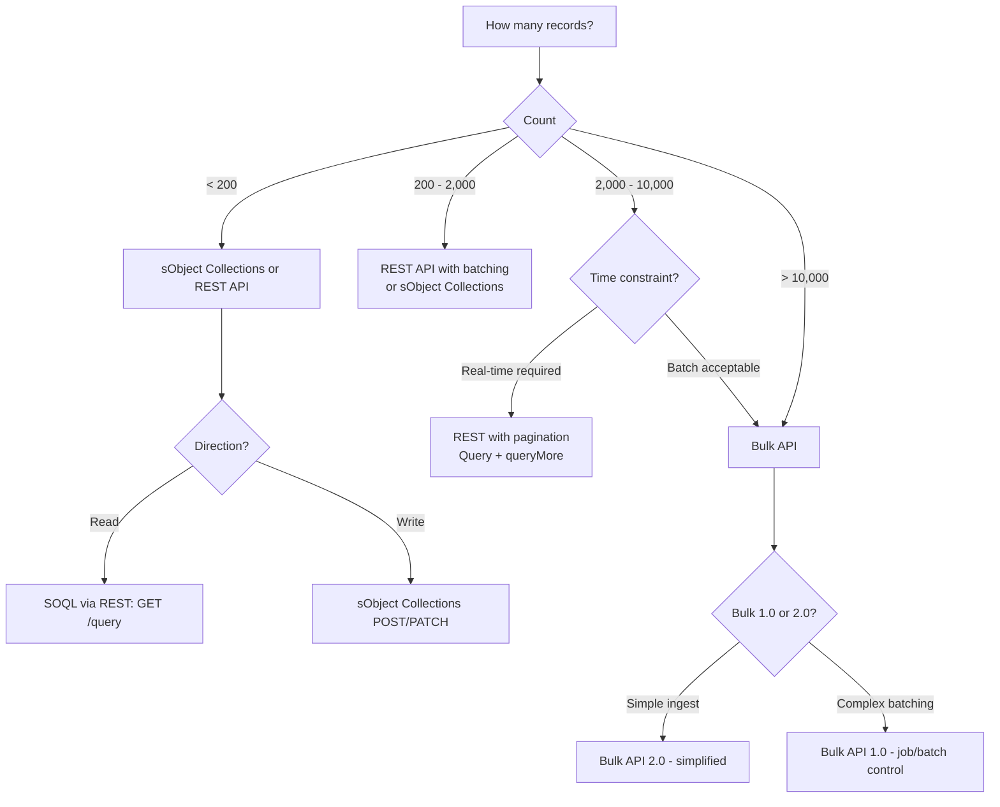
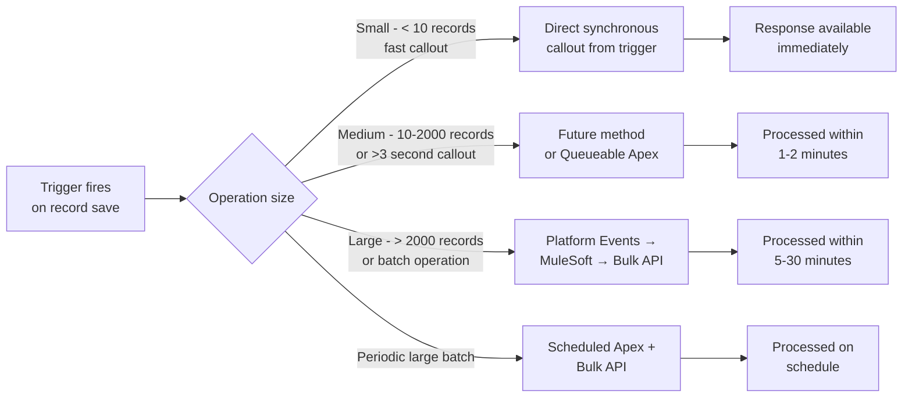
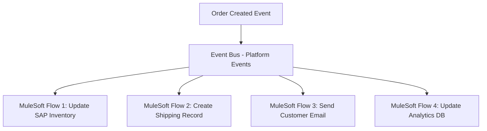
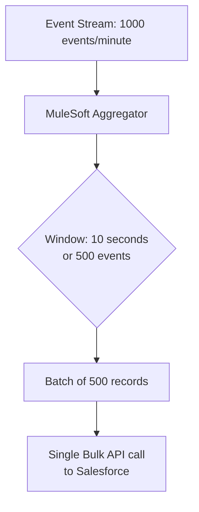
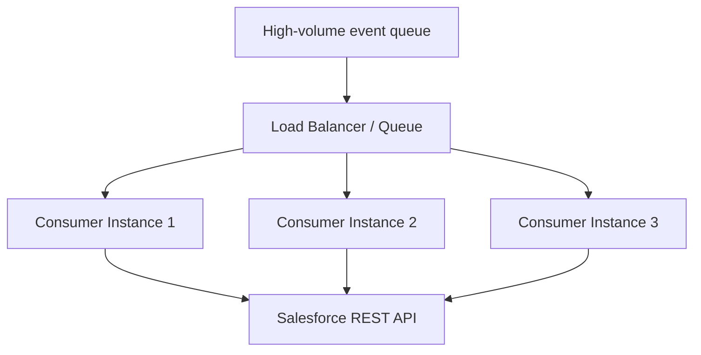
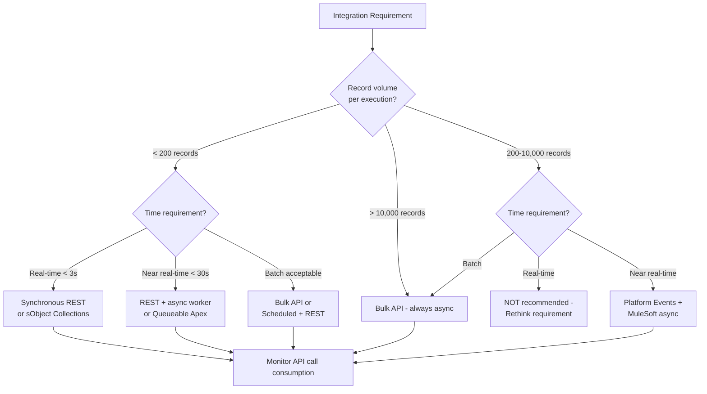
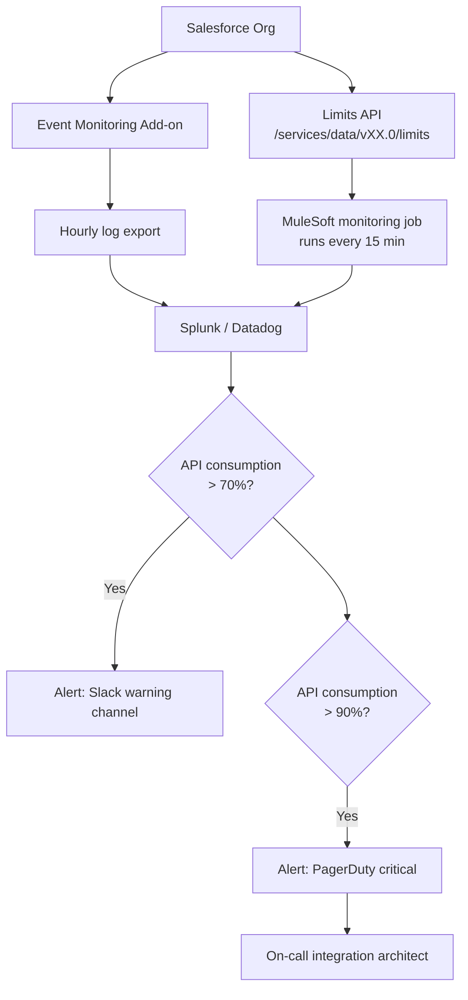
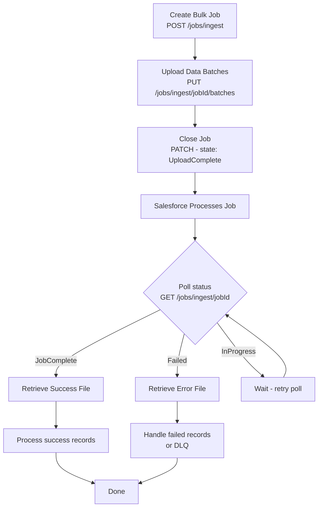

# Integration Performance and Scalability

## Exam Domain
Problem-Solving Integration Issues — 13% | Salesforce API Use — 22%

## Foundations

Performance and scalability are the most quantitative topics on the CRT-404 exam. The exam expects you to know specific Salesforce API limits, understand how to diagnose performance bottlenecks in integrations, and recommend architectural changes that improve throughput without hitting governor limits.

The fundamental principle: **Salesforce is not a database**. It is a SaaS platform with enforced multi-tenant limits. Every integration decision must account for these limits. Unlike a dedicated database where you can fire 10,000 queries per second, Salesforce has hard daily API call limits, concurrent request limits, and query row limits that affect every integration pattern.

A secondary principle: **async beats sync at scale**. The moment an integration needs to process more than a few hundred records or takes longer than a few seconds, the architecture should shift from synchronous REST calls to asynchronous patterns (Bulk API, Platform Events, queued processing).

## Core Concepts

### Salesforce API Limits — The Numbers You Must Know

These are the most frequently tested facts in performance questions:

#### Daily API Call Limits

| Edition | Daily API Calls |
|---------|----------------|
| Developer | 15,000 |
| Professional | 1,000 per license (min 5,000) |
| Enterprise | 1,000 per license (min 1,000,000) |
| Unlimited | 2,000 per license |
| Performance | 2,000 per license |

**Example**: An Enterprise org with 200 users = 200,000 calls/day minimum (some orgs get a higher floor). An org with 2,000 users = 2,000,000 calls/day.

**How to monitor**: Setup > Company Information > API Requests, Last 24 Hours. Also visible in the API Usage report.

**What counts as an API call**: REST API calls, SOAP API calls, Bulk API job/batch operations, Streaming API connections (not per-event), Tooling API calls, Metadata API calls, Reports and Dashboards API calls.

**What does NOT count**: Internal Apex operations (SOQL, DML), Lightning component data requests, Salesforce mobile app internal calls.

#### Concurrent API Request Limits

| Type | Limit |
|------|-------|
| Long-running requests (>20 seconds) | 25 per org |
| Short requests (<20 seconds) | No hard limit, but rate-limited |

**Critical for exam**: If an integration makes REST API calls that take more than 20 seconds to respond (large SOQL queries, slow middleware), and more than 25 run concurrently, subsequent calls are rejected with `REQUEST_LIMIT_EXCEEDED`.

#### Bulk API Limits

| Limit | Value |
|-------|-------|
| Bulk API 2.0 jobs created per 24 hours | 10,000 |
| Records processed per 24 hours | 50,000,000 |
| Max file size per upload (Bulk 2.0) | 100 MB |
| Max records per CSV batch (Bulk 1.0) | 10,000 |
| Concurrent Bulk API jobs | 5 per client, 15 per org |

#### Streaming API Limits

| Feature | Limit |
|---------|-------|
| PushTopic channels | 50 per org |
| PushTopic subscribers per topic | 1,000 per topic |
| Generic streaming channels | 20 per org |
| Generic streaming subscribers per topic | 10 per topic |
| Platform Events delivered (Enterprise) | 100,000/day |
| Platform Events delivered (Unlimited/Performance) | 250,000/day |
| CDC event deliveries (included) | 50,000/day |
| CDC event deliveries (with add-on) | Up to 50M/day |
| Event retention window (replay) | 72 hours (3 days) |

#### Composite API Limits

| API | Limit |
|-----|-------|
| Composite requests (subrequests per call) | 25 |
| Composite Batch subrequests per call | 25 |
| sObject Tree root records per call | 5 |
| sObject Tree total records per call | 200 |
| sObject Collections records per call | 200 |

#### SOQL Query Limits (via API)

| Limit | Value |
|-------|-------|
| Records returned by SOQL query | 50,000 per query |
| Records returned by queryMore | 50,000 per call |
| Characters in SOQL query | 20,000 |

### The API Selection Decision by Volume

This is the single most useful framework for performance-related exam questions:



**The 2,000-record threshold**: This is the commonly cited guideline where REST API becomes less efficient than Bulk API. Below 2,000, REST is faster (no job overhead). Above 2,000, Bulk API is more efficient.

**Actual factor is more nuanced**: Consider:
- Real-time requirement (Bulk is async — minutes to hours)
- Available API calls (Bulk uses fewer calls for same volume)
- Error handling (Bulk provides per-record error files)
- Transformation needs (Bulk is raw data; REST allows conditional logic)

### Performance Optimization Techniques

#### Field Selection

Only query/return the fields you need:

**BAD**:
```
GET /services/data/v58.0/sobjects/Account/001xx
```
Returns all ~100 fields, including rich text and formula fields.

**GOOD**:
```
GET /services/data/v58.0/sobjects/Account/001xx?fields=Id,Name,Phone,BillingCity
```
Returns 4 fields. Response is 10x smaller, faster to serialize, faster to parse.

For SOQL:
```
SELECT Id, Name, Phone FROM Account WHERE Industry = 'Technology'
```
Not `SELECT * FROM Account` (not even valid in SOQL, but the habit of selecting all translates to `SELECT Id, ... (all fields)`).

#### Response Compression

For large payloads, enable gzip compression:
- Request header: `Accept-Encoding: gzip`
- Salesforce responds with compressed body
- Reduces payload size by 60-80% for JSON
- Reduces API bandwidth costs and latency

#### Pagination

For queries returning >2,000 records, use the `nextRecordsUrl` in the query response:

```json
{
  "totalSize": 15000,
  "done": false,
  "nextRecordsUrl": "/services/data/v58.0/query/01gxx-2000",
  "records": [...]
}
```

Call `nextRecordsUrl` to retrieve the next page. Repeat until `done: true`.

**Exam trap**: Many integrations fail to implement pagination and silently only retrieve the first 2,000 records. The symptom: "only some records sync."

#### Caching Reference Data

If your integration repeatedly queries the same lookup data (e.g., currency exchange rates, pricebook IDs, record type IDs), cache it:

- At the middleware layer (MuleSoft object store with TTL)
- In a named credential or custom setting
- In a Heroku Redis cache

**Rule of thumb**: Any data that changes less often than hourly and is read more than 100 times per day is a cache candidate.

#### Batching Write Operations

Instead of making individual REST calls per record, use sObject Collections:

**BAD**: 200 individual PATCH calls = 200 API calls
```
PATCH /sobjects/Contact/003xx — 1 API call
PATCH /sobjects/Contact/003xy — 1 API call
... × 200
```

**GOOD**: 1 sObject Collections call = 1 API call
```
PATCH /composite/sobjects
Body: { "records": [ {...}, {...}, ... ] }  ← up to 200 records
```

Saves 199 API calls, reduces latency from 200 × (network round trip) to 1 × (network round trip).

### Asynchronous Processing — When and Why

The key threshold: **if processing takes >30 seconds or involves >2,000 records, use async**.

Salesforce governor limits that drive this decision:

| Governor Limit | Value | Why It Matters |
|----------------|-------|----------------|
| Maximum Apex execution time | 10 seconds (synchronous) | Callout + processing must finish in 10s |
| HTTP callout timeout | 120 seconds maximum | But synchronous Apex has a 10s total limit |
| Future method execution | 60 seconds | More time for async callouts |
| Queueable Apex execution | No hard time limit | Best for long-running integration |
| Batch Apex execution per batch | 10 minutes | For large volume processing |

**Synchronous to asynchronous shift**:



**Platform Events for decoupling**: Publishing a Platform Event from a trigger is synchronous (the publish is instant), but the subscriber processing is asynchronous. This gives you:
- Trigger completes fast (no synchronous callout blocking)
- Processing happens asynchronously
- Natural buffer between producer and consumer

### Scalability Patterns

#### Fan-Out Pattern

One event triggers multiple downstream processes. Instead of a single subscriber doing multiple things sequentially:



Each subscriber operates independently. If one fails, others continue. Adding a new subscriber doesn't require changing the publisher.

**Limit consideration**: Platform Events have a subscriber limit. Generic streaming channels have 10 subscribers max; Platform Events support many more consumers (via CometD, Apex triggers, Flows).

#### Aggregator Pattern

Multiple events are collected and processed as a batch:



**When to use**: When the event rate is too high for individual processing but Bulk API can handle batched loads efficiently. Reduces API call consumption dramatically.

#### Competing Consumers Pattern

Multiple instances of the same subscriber process events from a shared queue in parallel:



**Constraint**: Be careful with competing consumers writing to Salesforce. Record locking (`UNABLE_TO_LOCK_ROW`) can occur if multiple consumers try to update the same record simultaneously. Design so each consumer works on distinct record sets.

### Monitoring and Observability

Knowing performance is degrading before users complain requires monitoring:

**Salesforce built-in monitoring**:
- **Setup > System Overview**: API calls used today vs. limit. Organization storage. Active users.
- **API Usage Report**: API calls by type, by user, over time. Identify which integration is consuming the most calls.
- **Event Monitoring** (add-on): Detailed event logs for every API call, SOQL query, page view. Can identify slow queries, large payload transfers.

**Key metrics to monitor**:

| Metric | Warning Threshold | Critical Threshold |
|--------|------------------|-------------------|
| Daily API consumption | >70% of limit | >90% of limit |
| API call rate (per minute) | Sustained >1,000/min | Sustained >5,000/min |
| Concurrent long-running requests | >15 | >20 |
| Bulk API records/day | >30M | >45M |
| Platform Event delivery failures | Any | >10% |
| Integration error rate | >1% | >5% |
| P95 integration latency | >2 seconds | >10 seconds |

**MuleSoft Anypoint Monitoring**:
- Request/response times by API
- Error rates by endpoint
- JVM memory and CPU for Mule runtime
- Custom dashboards and alerting
- Log management (Anypoint Logging)

**External tools**:
- Splunk: Salesforce add-on for Event Monitoring data
- Datadog: API monitoring integration
- New Relic: APM for MuleSoft applications
- PagerDuty: On-call alerting

### Query Performance

Slow SOQL queries are a common integration performance problem:

**Selective queries** (use indexed fields to avoid full table scan):

Salesforce indexes: `Id`, `Name`, `OwnerId`, `CreatedDate`, `LastModifiedDate`, `SystemModstamp`, `RecordTypeId`, fields marked "External ID", fields marked "Unique", custom index (support ticket required).

**Good selective filter** (uses indexed field):
```sql
SELECT Id, Name FROM Account WHERE CreatedDate >= LAST_N_DAYS:30
```

**Bad non-selective filter** (full table scan on large objects):
```sql
SELECT Id, Name FROM Account WHERE Industry = 'Technology'
-- Industry is not indexed by default on large orgs
```

**Query plan**: Use the Query Plan tool in Salesforce Inspector or Workbench to see if a query will use an index or do a full table scan. Look for "TableScan" in the plan — that's the warning sign.

**SOQL query limits in integration context**:
- 50,000 rows per query result
- `queryMore` for additional pages
- Total rows retrieved in single Apex transaction: 50,000 (relevant if Apex is making API calls)

### Salesforce Shield Performance Considerations

**Platform Encryption**: Encrypting fields with Salesforce Shield Platform Encryption adds processing overhead:
- Encrypted fields cannot be used in SOQL WHERE clauses (no deterministic encryption for standard encryption)
- Integration that relies on querying encrypted fields must use deterministic encryption or search differently
- Indexing encrypted fields requires Salesforce Support engagement

**Field Audit Trail**: Storing historical field values increases data volume. Queries against the FieldHistoryArchive big object have different performance characteristics than standard SOQL.

### API Limit Consumption Strategies

When a customer is approaching their API limit:

**Reduce consumption**:
1. Switch individual REST calls to sObject Collections (200 records per call)
2. Switch large data volumes to Bulk API (fewer total calls)
3. Cache reference data at middleware layer (eliminate repeat lookups)
4. Use CDC or Platform Events instead of polling (polling uses calls every N minutes; events only fire on change)
5. Review integration schedules — stagger batch jobs so they don't all run at midnight

**Shift to async**:
- Replace polling patterns with event-driven (dramatically reduces API calls)
- Example: polling Account changes every 5 minutes = 288 API calls per day, just for the poll. CDC delivers only actual changes at no API call cost.

**Increase the limit**:
- Purchase additional API call packs from Salesforce (Usage-Based Entitlements)
- Upgrade edition (Enterprise → Unlimited doubles calls per user)
- Purchase more licenses (API limit scales with license count)

---

## PTA / SA Relevance

### When This Comes Up in Engagements

Performance concerns emerge in three scenarios:

1. **Pre-build**: Customer describes a high-volume integration (nightly sync of 500,000 records). Without performance design, this will fail or exhaust API limits.

2. **Post-launch crisis**: Integration was fine with 50,000 records; now at 500,000 it takes 4 hours and intermittently fails. Usually: wrong API choice, no Bulk API, not enough batching.

3. **Steady-state degradation**: Customer started hitting API limits 6 months after go-live because the number of integration consumers grew. Nobody monitored API consumption.

**Discovery questions**:
- "How many records does this integration process per day? At peak?"
- "How often does this integration run? Real-time, near-real-time, batch?"
- "What's your Salesforce org's daily API limit? How much are you currently using?"
- "Do you monitor API consumption? When did you last check the System Overview?"
- "Do any of your integrations poll Salesforce on a schedule?"

### Common Architecture Failures

1. **Polling when events would suffice**: A customer polls Salesforce every 5 minutes for new Accounts. 288 API calls per day just to check "anything new?" Using CDC or Platform Events eliminates this entirely.

2. **No Bulk API for large volumes**: A nightly sync loads 200,000 records via individual REST calls. Each record = 1 API call = 200,000 calls/day, consuming 20% of daily limit on one integration. Bulk API would use ~20 job calls total.

3. **No pagination**: Integration retrieves only first 2,000 records of a 50,000-record query. Silently misses 48,000 records. Discovered months later when discrepancy is noticed.

4. **Synchronous callout in trigger**: An Apex trigger makes a synchronous REST callout for every record save. When 500 records are imported at once, 500 concurrent API callouts overwhelm both Salesforce governor limits and the target system.

5. **No API consumption monitoring**: Daily limit exhausted because a new integration was deployed without limit analysis. All integrations for the rest of the day fail.

### Enterprise Patterns

**API governance program** at enterprise scale:
- Monthly API consumption review (which integrations use most calls)
- API budget allocation per integration team
- Automated alerts at 70% and 90% daily limit consumption
- Quarterly optimization reviews (identify high-consumption patterns that could be converted to event-driven)

**Performance testing for integrations**:
- Test at 10× expected peak volume
- Simulate concurrent connections
- Verify retry behavior under load
- Validate Bulk API job success rate at full volume
- Test query performance with production-representative data volume

---

## Architecture

### Sync-to-Async Decision Framework



### API Limit Monitoring Architecture



### Bulk API Job Lifecycle



**Limitations & Tradeoffs:**

| Optimization | Benefit | Tradeoff |
|-------------|---------|----------|
| sObject Collections | 200× fewer API calls | Still synchronous; 200-record limit |
| Bulk API | Handles millions of records | Async — 5-30 min turnaround; no real-time |
| CDC vs. polling | Eliminates polling API calls | 72-hour replay window; gap events possible |
| Caching reference data | Reduces API calls | Stale data risk; cache invalidation complexity |
| Field selection | Smaller payload; less serialization | Developer discipline required |
| Aggregation in middleware | Reduces individual API calls | Adds complexity; potential message delay |

---

## Key Facts to Memorize

- **Developer org**: 15,000 API calls/day
- **Enterprise**: 1,000 × licenses/day (min 1,000,000)
- **Unlimited/Performance**: 2,000 × licenses/day
- **Concurrent long-running limit**: 25 requests >20 seconds
- **Bulk API records/day**: 50,000,000 maximum
- **Platform Events (Unlimited)**: 250,000 events/day
- **Platform Events (Enterprise)**: 100,000 events/day
- **CDC included**: 50,000 event deliveries/day
- **sObject Collections**: max 200 records per call
- **Composite API**: max 25 subrequests per call
- **SOQL query rows**: 50,000 per query
- **Event retention window**: 72 hours (3 days)
- **2,000-record threshold**: REST → Bulk API crossover point
- **>20 second API call** = consumes from the 25-concurrent limit
- **Polling uses API calls; CDC/Platform Events do not (for the change events themselves)**
- Use `nextRecordsUrl` for paginating large SOQL results
- Bulk API 2.0 is simpler than 1.0 (no batch concept, streaming upload)
- Bulk 1.0: job/batch model; Bulk 2.0: job/upload/ingest model

---

## Exam Traps

1. **"200 records" threshold for sObject Collections** — many students confuse this with the Bulk API threshold (2,000). sObject Collections max is 200. Bulk API threshold is typically 2,000+.

2. **"CDC doesn't use API calls"** — technically CDC event delivery does count against the CDC event delivery limit, NOT the REST API call limit. It's a separate counter. Polling SOQL queries DO count against REST API calls.

3. **Platform Events limit: Unlimited vs. Enterprise** — 250,000 vs 100,000. The exam may present a scenario where a customer is hitting their limit and you need to identify their edition or upgrade path.

4. **Concurrent API limit**: The 25-concurrent limit applies to requests that take >20 seconds, NOT all API calls. Short requests (<20 seconds) have no explicit concurrent limit (but are rate-limited).

5. **Bulk API is async — not for real-time**: If a scenario requires immediate response (sub-second), Bulk API is never the answer regardless of record count.

6. **Pagination**: If a question mentions an integration "only getting some records" or data discrepancy, always consider whether pagination is missing. The symptom of no pagination is exactly 2,000 records (the default page size).

7. **API limit resets**: Daily API limits reset at midnight GMT, not midnight in the customer's time zone.

8. **Event Monitoring is an add-on**: It is NOT included in base Salesforce licenses. This matters when a customer asks why they can't see detailed API usage logs.

---

## Practice Questions

**Question 1**
A large Salesforce Enterprise org with 500 users runs a nightly integration that loads 300,000 Account records from a data warehouse. The integration currently uses the REST API with individual PATCH calls. The team reports the integration takes 8 hours and frequently fails before completing. What is the BEST solution?

A. Increase the number of Salesforce user licenses to increase the daily API limit
B. Migrate the integration to use Bulk API 2.0, which processes 300,000 records in a single async job
C. Break the 300,000 records into 300 batches of 1,000 using sObject Collections
D. Schedule the integration to run during off-peak hours to avoid rate limits

**Answer: B**
**Explanation:** 300,000 individual REST PATCH calls consume 300,000 API calls, takes hours due to network overhead per call, and risks hitting the concurrent limit. Bulk API 2.0 processes millions of records asynchronously, uses minimal API calls (1 job creation + polling + 1 results retrieval), and completes in minutes instead of hours. It's purpose-built for this use case.

**Why the others are wrong:**
- A: Adding licenses increases the daily limit but doesn't fix the underlying architecture problem. 300,000 REST calls is still inefficient regardless of limit headroom.
- C: sObject Collections max out at 200 records per call. 300,000 records ÷ 200 = 1,500 API calls — still synchronous, still slow, still subject to concurrent limits.
- D: Off-peak scheduling avoids rate conflicts but doesn't fix the 8-hour runtime or architecture inefficiency.

---

**Question 2**
A Salesforce org with the Enterprise edition has 1,000 users. An architect is designing an integration that needs to sync any Account changes to an external CRM in near real-time. The current proposal is to poll Salesforce every 1 minute using SOQL via the REST API. What is the concern with this approach?

A. REST API cannot be used for polling
B. Polling every minute uses 1,440 REST API calls per day just for this integration, consuming 0.14% of the daily limit, which compounds across many similar integrations
C. SOQL queries cannot use LastModifiedDate as a filter
D. The REST API does not support querying Account objects

**Answer: B**
**Explanation:** An Enterprise org with 1,000 users has 1,000,000 API calls/day. Polling every minute = 1,440 calls/day for this one integration. While that seems small, enterprises typically have dozens of integrations. 20 polling integrations at the same rate = 28,800 calls/day (2.9% of limit), and this compounds. The better architecture is CDC or Platform Events — no API calls for the change detection itself, events delivered only when data changes.

**Why the others are wrong:**
- A: REST API absolutely supports polling. It's technically valid but architecturally suboptimal.
- C: LastModifiedDate is an indexed field in Salesforce and is commonly used in polling SOQL queries.
- D: REST API fully supports querying Account objects.

---

**Question 3**
An integration using the Salesforce REST API is failing with the error code `REQUEST_LIMIT_EXCEEDED`. The error occurs starting at 6 PM UTC and resolves at midnight UTC. What is happening and what should the architect recommend?

A. The org is hitting the concurrent long-running request limit; recommend reducing query complexity
B. The org is exhausting its daily API call limit; the limit resets at midnight GMT; recommend API consumption audit and optimization
C. The org's connection pool is exhausted; recommend adding more MuleSoft workers
D. The integration has a memory leak causing performance degradation after 6 hours

**Answer: B**
**Explanation:** `REQUEST_LIMIT_EXCEEDED` on the daily API limit resets at midnight GMT. The pattern — failing from 6 PM until midnight — indicates daily limit exhaustion. The 18-hour period of failures (6 PM to midnight) suggests the limit is consumed in the first 18 hours of the day. The architect should audit API consumption (which integrations use the most calls), optimize high-consumption patterns (switch polling to CDC, use Bulk API, use sObject Collections), and potentially purchase additional API call capacity.

**Why the others are wrong:**
- A: Concurrent long-running limit applies to requests >20 seconds active simultaneously (max 25). The daily reset at midnight is the giveaway that this is a daily quota issue.
- C: MuleSoft worker count affects throughput but `REQUEST_LIMIT_EXCEEDED` is a Salesforce-side limit, not a MuleSoft capacity issue.
- D: Memory leaks would cause MuleSoft/middleware to fail, not Salesforce to return `REQUEST_LIMIT_EXCEEDED`.

---

**Question 4**
A developer is using the Salesforce REST API to query all Opportunities modified in the last 30 days. The org has 80,000 such Opportunities. The developer's code only receives the first 2,000 records despite 80,000 matching. What is the issue and fix?

A. The SOQL WHERE clause is too complex; simplify the filter
B. REST API queries return a maximum of 2,000 records per page; the code must check `done` and follow `nextRecordsUrl` to retrieve all pages
C. Increase the SOQL row limit using a custom setting
D. Switch to Bulk API — REST API cannot return more than 2,000 records total

**Answer: B**
**Explanation:** Salesforce REST API SOQL queries return up to 2,000 records per page by default. The response includes `done: false` and a `nextRecordsUrl` when more records exist. The developer's code must loop: while `done != true`, follow `nextRecordsUrl` to get the next page. The SOQL row limit of 50,000 applies per API call/page, and total rows can be retrieved via multiple pages.

**Why the others are wrong:**
- A: Query complexity doesn't affect the records-per-page limit.
- C: There is no custom setting to increase SOQL rows; the 50,000 limit per query is a hard governor limit.
- D: REST API CAN return more than 2,000 records total — just via pagination. Bulk API would work but is not required for 80,000 records with pagination. REST + pagination is the correct fix.

---

**Question 5**
An architect is designing a real-time integration where Salesforce publishes an event every time a high-priority Case is created. A customer portal (external web app) needs to display these updates within 2 seconds. The volume is approximately 50 high-priority cases per hour. Which approach best meets the requirements?

A. Bulk API query job scheduled every 2 minutes
B. REST API polling from the portal every 2 seconds
C. Platform Events subscribed via CometD from the portal
D. Heroku Connect syncing Case records to Heroku Postgres

**Answer: C**
**Explanation:** Platform Events with CometD subscription provides true real-time delivery (sub-second from event publish to subscriber notification). The volume (50 events/hour) is well within Platform Events limits. The portal subscribes using the CometD/EMP Connector, maintaining a persistent connection that receives push notifications. This is exactly the use case Platform Events were designed for.

**Why the others are wrong:**
- A: Bulk API has job processing overhead (minutes). Not suitable for 2-second real-time requirement.
- B: REST polling every 2 seconds = 43,200 API calls/day from just this one feature. Technically works but burns API quota and adds latency (up to 2 seconds lag from polling interval).
- D: Heroku Connect syncs on a 2-minute polling interval minimum. Cannot meet the 2-second requirement. Also introduces Heroku Postgres as an unnecessary intermediary.
