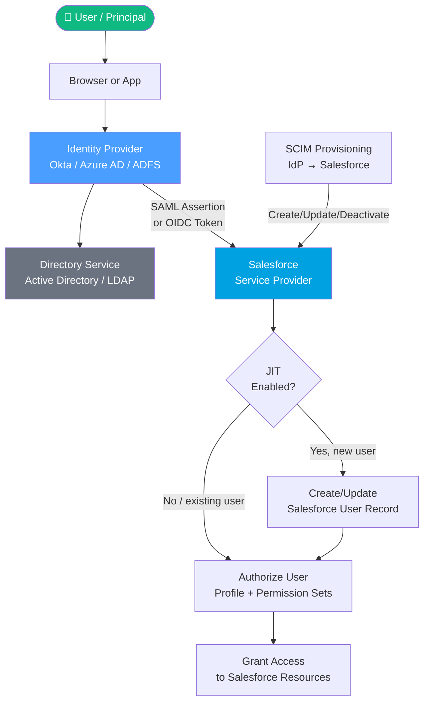
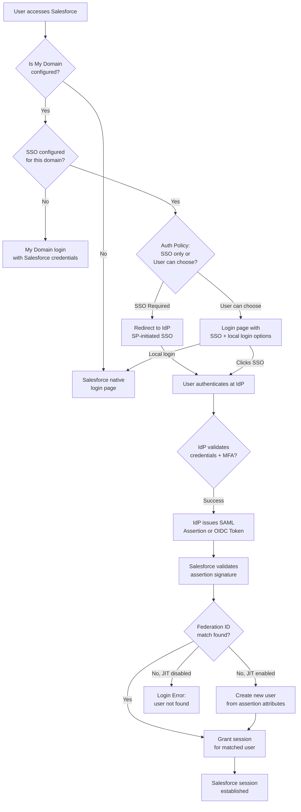

# Identity Management Concepts

## Exam Domain
Identity Management Concepts — **17% of exam weight** (~10 questions)

This domain tests foundational vocabulary and conceptual understanding. It underpins every other domain — if you are fuzzy on what an "assertion" is, you will struggle on the SAML questions. If you confuse authentication with authorization, you will miss scenario questions that hinge on that distinction.

---

## Foundations

### What Is Identity?

In a computing context, **identity** is the set of attributes that uniquely describes a person, system, or entity and allows others to make access decisions about it.

An identity answers three questions:
1. **Who are you?** (identification / authentication)
2. **What are you allowed to do?** (authorization)
3. **What did you do?** (accounting / audit)

These three questions form the **AAA framework** — the foundation of every access control system.

### Authentication vs. Authorization vs. Accounting (AAA)

These three terms are consistently confused in architecture discussions and on the exam. Get them precisely right.

| Term | Question | Example | Salesforce Analog |
|---|---|---|---|
| **Authentication (AuthN)** | Who are you? Prove it. | You enter username + password; system verifies against directory | Login page, SSO, MFA verification |
| **Authorization (AuthZ)** | What are you allowed to access? | Logged-in user tries to open a record; system checks permissions | Profiles, Permission Sets, Sharing Rules, OWD |
| **Accounting (Audit)** | What did you do and when? | Every API call logged with timestamp, IP, outcome | Login History, Setup Audit Trail, Event Monitoring |

**Critical distinction for the exam:**

> OAuth 2.0 is an **authorization** protocol, not an authentication protocol. It was designed to delegate access to resources, not to prove who a user is. OpenID Connect (OIDC) is the identity layer built on top of OAuth 2.0 that adds authentication.

This distinction trips up many candidates. A question may ask: "A customer wants to allow users to log in with their Google accounts. Which protocol should be used?" The correct answer involves OpenID Connect, not plain OAuth 2.0 — because authentication requires identity claims, which OAuth alone does not provide.

### Identification vs. Authentication

- **Identification** is simply asserting an identity: "I am user@example.com"
- **Authentication** is *proving* that identity: "Here is evidence that I am user@example.com"

A username alone is identification. A username + password, or a biometric, or a hardware key — that is authentication.

---

## Core Concepts

### The Principal

A **principal** is any entity that can be authenticated and whose actions can be authorized. In identity systems, principals include:

- **Human users** — employees, partners, customers
- **Service accounts** — automated processes, applications, scheduled jobs
- **Devices** — IoT sensors, workstations, mobile devices (in device-based trust models)
- **Applications** — when an app authenticates to another app (machine-to-machine)

In Salesforce, principals are represented by User records, but the concept extends to Connected Apps, Named Credentials, and OAuth clients — all of which can authenticate to Salesforce APIs.

### Credentials

A **credential** is something a principal presents to prove its identity. Credential types map directly to authentication factors:

| Credential Type | Factor | Example |
|---|---|---|
| Password, PIN | Something you **know** | Salesforce password, security question |
| OTP, TOTP code, push notification | Something you **have** | Authenticator app, SMS code, hardware token |
| Biometric | Something you **are** | Fingerprint, Face ID |
| Certificate / private key | Something you **have** (cryptographic) | X.509 certificate, JWT signed with private key |
| IP range, device | Somewhere you **are** / Something you **have** | Trusted IP range, registered device |

**Multi-factor authentication (MFA)** requires two or more factors from *different* categories. A password + a security question is NOT MFA — both are "something you know." A password + an authenticator code IS MFA.

### Claims

A **claim** is a statement about a principal, made by an authority (usually an Identity Provider). Claims answer questions like:

- "This user's email is user@example.com" (attribute claim)
- "This user authenticated at 14:30 UTC using password + MFA" (authentication claim)
- "This user is a member of the Sales group" (entitlement claim)

Claims are bundled together in assertions (SAML) or tokens (OAuth/OIDC). They are only as trustworthy as the authority that issued them — which is why the trust model between IdP and SP matters.

### Assertions vs. Tokens

| Format | Protocol | Structure | Used For |
|---|---|---|---|
| **SAML Assertion** | SAML 2.0 | XML | SSO, enterprise federation |
| **ID Token** | OpenID Connect | JWT (JSON) | Proving identity in OIDC flows |
| **Access Token** | OAuth 2.0 | Opaque string or JWT | Authorizing API access |
| **Refresh Token** | OAuth 2.0 | Opaque string | Obtaining new access tokens |

The key difference: SAML assertions are for **browser-based SSO** (they are meant to be carried by HTTP and browsers can handle XML POST forms). OAuth/OIDC tokens are for **API access and modern application authentication** (JSON is easier to handle in JavaScript, mobile apps, and REST APIs).

### Identity Providers (IdP) and Service Providers (SP)

This is the fundamental trust model underlying all federation:

- An **Identity Provider (IdP)** is the authority that authenticates the user and issues assertions/tokens. The IdP "knows who you are."
- A **Service Provider (SP)** is the application that the user wants to access. It trusts the IdP and accepts its assertions.

The SP never sees the user's credentials — it only sees the assertion the IdP provides. This is the security benefit of federation: credentials are never exposed to the SP.

**Real-world examples:**

| Scenario | IdP | SP |
|---|---|---|
| Employee SSO via Azure AD to Salesforce | Azure Active Directory | Salesforce |
| Salesforce powering SSO for a custom app | Salesforce | Custom application |
| Google login to a Salesforce Experience Cloud site | Google | Salesforce Experience Cloud |
| Salesforce authenticating to an external API | Salesforce (as OAuth client using JWT Bearer) | External REST API |

The **trust relationship** between IdP and SP is established out-of-band (before authentication occurs) by exchanging metadata:
- SP tells the IdP: "My entityID is X, send assertions to URL Y, here is what attributes I need"
- IdP tells the SP: "My entityID is A, here is my signing certificate B, here is my SSO endpoint C"
- Both sides configure their systems based on this metadata exchange

### Federated Identity

**Federated identity** means a user's identity created and managed in one system (the IdP) is accepted by another system (the SP) without the SP maintaining its own copy of credentials.

This is distinct from **local identity**, where the application manages its own credential store (usernames and passwords in its own database).

Benefits of federation:
- Single set of credentials (one password to remember, one place to change it)
- Centralized lifecycle management (deactivate in one place, access everywhere is revoked)
- Reduced attack surface (fewer credential stores to protect)
- Supports compliance requirements (centralized audit of all authentications)

Salesforce supports both models:
- **Federated identity (SAML/OIDC SSO):** Salesforce trusts an external IdP; users authenticate at the IdP
- **Local identity:** Salesforce manages the username and password directly

In enterprise deployments, the answer is almost always federated identity via the corporate directory.

### SSO (Single Sign-On)

**Single Sign-On (SSO)** allows a user to authenticate once and then access multiple applications without re-authenticating. The IdP maintains the **authentication session** and issues assertions/tokens to each SP the user navigates to.

SSO is only possible when all participating applications trust the same IdP. This is the concept of a **Circle of Trust** in SAML terminology.

**SSO session vs. application session:**
- The **SSO session** lives at the IdP (e.g., a browser cookie at identity.company.com)
- Each **SP session** is established when the SP receives a valid assertion
- Revoking the SSO session does not automatically revoke all SP sessions (this is why SLO is complex)

### SLO (Single Log-Out)

**Single Log-Out (SLO)** is the process of ending all application sessions when a user logs out. It is significantly more complex than SSO.

There are two SLO directions:
1. **SP-initiated SLO:** User logs out of an SP; the SP notifies the IdP; the IdP propagates logout to all other SPs with active sessions
2. **IdP-initiated SLO:** User logs out at the IdP; the IdP propagates logout to all SPs

Challenges with SLO in practice:
- Not all SPs implement SLO correctly (many ignore logout requests)
- Long-lived SP sessions persist even after IdP session is terminated
- Token-based systems (OAuth) have their own revocation mechanism separate from SAML SLO

**In Salesforce:** Salesforce supports SLO in both SP and IdP roles, but it requires configuration. In practice, many customers rely on short session timeouts rather than full SLO implementation.

---

### Protocol Overview

Every identity protocol solves the same fundamental problem — how does a system verify who you are and what you can do — but each was designed for different contexts and trade-offs.

#### SAML 2.0 (Security Assertion Markup Language)

- **Designed for:** Enterprise browser-based SSO (circa 2005)
- **Format:** XML assertions, typically transported via HTTP POST or HTTP Redirect
- **Strengths:** Widely supported by enterprise IdPs (AD FS, Okta, Azure AD, PingFederate); rich attribute statement support; signing and encryption standards
- **Weaknesses:** XML verbosity; not designed for APIs or mobile; complex to debug; requires browser involvement
- **Use it when:** Enterprise users with corporate IdP need SSO into Salesforce; legacy systems require SAML

#### OAuth 2.0

- **Designed for:** Authorization delegation — allowing apps to access resources on behalf of users without sharing passwords
- **Format:** HTTP redirects and tokens (access tokens, refresh tokens)
- **Strengths:** Designed for APIs and mobile apps; multiple flows for different contexts; widely supported
- **Weaknesses:** Not an authentication protocol (no user identity by itself); complex grant type selection; many security pitfalls in implementation
- **Use it when:** Mobile apps or web apps need API access to Salesforce; machine-to-machine integrations; Connected App scenarios

#### OpenID Connect (OIDC)

- **Designed for:** Authentication layer on top of OAuth 2.0
- **Format:** JWT ID tokens, UserInfo endpoint (JSON)
- **Strengths:** Modern, lightweight, designed for mobile and web; provides user identity claims; leverages OAuth ecosystem
- **Weaknesses:** Newer — some older systems only support SAML; requires understanding of JWT
- **Use it when:** Modern SSO with a Google/Okta/Azure AD IdP; social login; you need authentication + API access in one flow

#### WS-Federation

- **Designed for:** Microsoft ecosystem SSO (Active Directory, Azure AD, .NET applications)
- **Format:** XML tokens (similar to SAML but in WS-Trust framework)
- **Strengths:** Deep Windows/Office integration; supported by ADFS
- **Weaknesses:** Proprietary to Microsoft ecosystem; declining in favor of SAML/OIDC
- **Use it when:** Microsoft-heavy customers using ADFS want to federate to Salesforce

#### SCIM (System for Cross-domain Identity Management)

- **Designed for:** Automated user provisioning/deprovisioning between identity systems
- **Format:** REST API with JSON payloads
- **Strengths:** Standardized CRUD operations for user accounts; works with Okta, Azure AD, OneLogin
- **Weaknesses:** Not an authentication protocol — purely provisioning; requires IdP support
- **Use it when:** Automating the creation/update/deactivation of Salesforce user records from an identity governance system

#### LDAP (Lightweight Directory Access Protocol)

- **Designed for:** Reading and writing directory service data (users, groups, attributes)
- **Format:** Binary protocol over TCP
- **Strengths:** Extremely common in enterprise (Active Directory is LDAP-based); fast attribute lookup
- **Weaknesses:** Not HTTP-based; not directly supported by Salesforce; requires middleware
- **Use it when:** You need to understand the source of truth for user attributes that feed into JIT or SCIM provisioning

---

### Directory Services

#### Active Directory (AD)

Microsoft Active Directory is the most common enterprise directory system in large organizations. It stores:
- User accounts and credentials (hashed passwords, Kerberos tickets)
- Groups and group memberships
- Organizational Units (OUs) that organize users by department/function
- Group Policy Objects (GPOs) that apply settings to users/computers

Active Directory is typically accessed by:
- Applications within the corporate network using Kerberos authentication
- LDAP for attribute lookups (e.g., email, department, manager)
- AD FS (Active Directory Federation Services) for SAML/WS-Federation to external apps

**Relationship to Salesforce:**
- AD is typically the source of truth for internal user identities
- AD FS or Azure AD acts as the SAML/OIDC IdP that issues assertions to Salesforce
- User attributes (email, username, department) flow from AD to Salesforce via SAML attributes, SCIM, or JIT provisioning

#### Azure Active Directory (Azure AD / Entra ID)

Azure AD is Microsoft's cloud-based identity platform. It:
- Supports both SAML 2.0 and OIDC for SSO
- Includes conditional access policies (IP-based, device-based, risk-based access)
- Provides SCIM provisioning to Salesforce
- Is the dominant enterprise IdP in modern cloud deployments

When customers say "we use Microsoft for SSO," they almost always mean Azure AD (Entra ID).

#### LDAP (Standalone Directory)

Some organizations use OpenLDAP or Oracle Directory Server as their directory. Salesforce does not directly support LDAP authentication — these systems typically require:
- A SAML adapter/gateway that reads from LDAP and issues SAML assertions
- Delegated Authentication, where Salesforce calls an LDAP-validating web service on login

---

### MFA Concepts

#### Authentication Factors

| Factor | Category | Description |
|---|---|---|
| Password | Know | Something only the user knows |
| PIN | Know | Short numeric password |
| Security question | Know | Pre-configured answer (weak — consider "know") |
| TOTP code | Have | Time-based one-time password from authenticator app |
| SMS OTP | Have | One-time code sent to registered phone |
| Push notification | Have | Approval push to authenticator app |
| Hardware token (FIDO2/WebAuthn) | Have | Physical security key (YubiKey) |
| Smart card / PIV | Have | Cryptographic card |
| Fingerprint | Are | Biometric |
| Face recognition | Are | Biometric |
| Retinal scan | Are | Biometric |

#### TOTP (Time-Based One-Time Password)

TOTP (RFC 6238) generates a 6-digit code that changes every 30 seconds using:
- A shared secret (seeded when you scan the QR code during enrollment)
- The current time (synced between authenticator app and server)
- HMAC-SHA1 hash function

This is how Google Authenticator, Microsoft Authenticator, and Salesforce Authenticator work. Because the code expires every 30 seconds, intercepting a single code provides very limited attack window (and codes cannot be reused — servers track used codes).

**In Salesforce:** Salesforce Authenticator and any TOTP-compatible authenticator app can be used for MFA. Salesforce requires MFA for all direct Salesforce logins as of 2022.

#### Push Authentication

Instead of reading a code, the user receives a push notification on their registered mobile device and taps Approve. Salesforce Authenticator uses this model. Push is generally considered more phishing-resistant than SMS OTP (no code to be socially engineered), though it is vulnerable to "push fatigue" attacks (bombard user with pushes until they accidentally approve).

#### Hardware Keys (FIDO2 / WebAuthn)

The strongest commercially available second factor. Hardware keys (YubiKey, Google Titan):
- Generate cryptographic proof of presence (require physical touch)
- Are phishing-resistant by design (bound to a specific domain — a phishing site cannot trigger the key for the real site)
- Support passwordless authentication in FIDO2 mode

Salesforce supports WebAuthn/FIDO2 security keys as a verification method for MFA.

---

### Zero Trust Architecture

#### The Traditional Perimeter Model

The old security model assumed:
- Everything inside the corporate network is trusted
- Everything outside is untrusted
- A firewall at the perimeter is sufficient protection

This model fails in the cloud era because:
- Employees work from anywhere (no fixed perimeter)
- Applications live in the cloud (SaaS) — there is no "inside"
- Breaches from inside the perimeter are just as common as external attacks

#### Zero Trust Principles

**"Never trust, always verify"** — regardless of where a request originates (inside or outside the network), every access request must be:
1. Authenticated (verify the identity of the principal)
2. Authorized (verify the principal has permission for this specific resource)
3. Inspected (check device posture, IP reputation, time of access)
4. Logged (audit every access)

The five pillars of Zero Trust:
1. **Identity** — Strong authentication (MFA), identity governance, least privilege
2. **Device** — Device health and compliance checking before granting access
3. **Network** — Micro-segmentation, encrypted channels (TLS everywhere)
4. **Application** — Application-layer security, least privilege access to APIs
5. **Data** — Data classification, data loss prevention, encryption at rest and in transit

#### Zero Trust in Salesforce Implementations

When a customer asks "how do we implement Zero Trust for Salesforce?", the answer involves:

| Zero Trust Pillar | Salesforce Implementation |
|---|---|
| Identity | MFA enforced, SSO with corporate IdP, conditional access |
| Device | Device registration, IP restrictions, High Assurance session policy |
| Network | IP allowlists (Trusted IP Ranges), network-based login hours |
| Application | Minimum necessary OAuth scopes, Connected App policies |
| Data | Field-Level Security, Sharing Rules, platform encryption |

**Salesforce-specific Zero Trust features:**
- **High Assurance session level** — requires step-up authentication (MFA) before accessing sensitive operations
- **Trusted IP Ranges** — combined with login hours, creates a network-based access boundary
- **Transaction Security Policies** — real-time event monitoring and blocking based on behavior
- **Login Forensics / Event Monitoring** — provides the "inspect and log" layer

---

### Identity Lifecycle Management

#### The Four Stages

1. **Provisioning** — Creating the user account with appropriate access
2. **Maintenance** — Updating access as the user's role changes
3. **Deprovisioning** — Removing access when the user leaves or changes role
4. **Recertification** — Periodic review to verify access is still appropriate

#### Provisioning Methods in Salesforce

| Method | Description | Best For |
|---|---|---|
| Manual | Admin creates user in Setup | Small orgs, occasional onboarding |
| JIT (Just-In-Time) | Salesforce creates user on first SSO login based on SAML attributes | Medium to large orgs with SAML SSO |
| SCIM API | External identity governance system manages users via REST API | Enterprise orgs with Okta/Azure AD/SailPoint |
| Data Loader / API | Bulk user creation via CSV or custom API scripts | Large migrations |
| Connected App (OAuth) | Delegated user management via API | Custom HR integrations |

#### JIT Provisioning

**Just-In-Time (JIT) provisioning** creates or updates a Salesforce user record automatically at the moment of first login via SSO. The IdP includes user attributes in the SAML assertion (email, name, profile, role, etc.) and Salesforce uses these to populate the User record.

JIT advantages:
- No need to pre-create users in Salesforce before they can log in
- User attributes automatically reflect the IdP directory on each login
- Reduces administrative overhead for large user populations

JIT requirements:
- SAML SSO must be configured
- `Federation ID` must be included in the SAML assertion (as the NameID or as an attribute)
- A `Profile` must be specified (either via SAML attribute or default SSO profile)
- JIT must be enabled in the SSO settings

JIT limitations:
- Only triggered on SAML login (not OAuth, not direct Salesforce login)
- Cannot deprovision users (JIT creates/updates, not deletes)
- Attribute mapping must be carefully tested — missing required fields cause login failures

#### Deprovisioning — The Most Common Governance Failure

**Orphaned accounts** are active Salesforce user accounts that belong to former employees or contractors. They represent:
- **Security risk:** Former employees may retain access to sensitive data
- **License cost:** Salesforce licenses are consumed even if the account is unused
- **Compliance failure:** SOC 2, ISO 27001, and SOX require timely deprovisioning

Deprovisioning challenges:
- Manual deprovisioning requires coordination between HR, IT, and Salesforce admins
- SCIM can automate deprovisioning (when HR system is connected to identity governance)
- SAML JIT cannot deprovision — a separate mechanism is always needed

**Best practice:** Implement a deprovisioning workflow triggered by HR system off-boarding that:
1. Deactivates the Salesforce user (or freezes the account)
2. Revokes OAuth refresh tokens (via Connected App management)
3. Removes the user from groups/permission sets
4. Logs the deprovisioning action for audit purposes

---

## PTA / SA Relevance

### When This Comes Up in Engagements

Identity is not an afterthought — it is one of the first topics in any enterprise discovery. As a PTA, you will encounter identity questions in:

**Technical discovery calls:**
- "We have Active Directory — how does that connect to Salesforce?"
- "We need SSO for our 5,000 employees — how does that work?"
- "Our security team requires MFA for all cloud applications — does Salesforce support that?"
- "What's the difference between SAML and OAuth? Our architect keeps talking about OAuth."

**Architecture review boards:**
- Security architects reviewing the federation trust model
- Compliance officers asking about MFA and audit logs
- Enterprise architects asking about centralized identity governance

**Post-go-live incidents:**
- "An employee left three months ago and still had Salesforce access — how did that happen?"
- "We had a phishing attack — how do we prevent credential compromise from affecting Salesforce?"
- "Our users are getting logged out too frequently — can we tune the session settings?"

### Common Architecture Failures

**Failure 1: No deprovisioning process**
The most common identity governance failure in Salesforce implementations. Customers provision via JIT or manual admin creation, but never define the deprovisioning workflow. Result: orphaned accounts accumulate.
- Diagnosis: Run a Salesforce report of active users by last login date. Users inactive for 90+ days are candidates for review.
- Remedy: Implement SCIM provisioning from the HR system, or at minimum a process that triggers Salesforce deactivation from the Joiner/Mover/Leaver (JML) workflow.

**Failure 2: No MFA enforcement**
Many customers treat MFA as optional or allow users to bypass it. This violates Salesforce's mandatory MFA policy (effective Feb 2022) and creates compliance gaps.
- Diagnosis: Check Login History for logins without MFA verification.
- Remedy: Enable MFA at the org level (enforced, not just enabled). Use login flows for step-up authentication in high-risk scenarios.

**Failure 3: Overly broad OAuth scopes**
Connected Apps are configured with `full` or `api` scope when they only need `refresh_token api` for specific objects. This violates least privilege.
- Diagnosis: Audit Connected App OAuth scopes. Any app with `full` scope needs justification.
- Remedy: Restrict scopes in the Connected App. Use Named Credentials with specific permissions where possible.

**Failure 4: Federation ID mismatch**
After an SSO migration (e.g., company changes email domain), SAML assertions start using new email format but Salesforce Federation IDs still hold old values. Users cannot log in.
- Diagnosis: Compare Federation ID field values in Salesforce against what the IdP is sending as NameID.
- Remedy: Update Federation ID values in bulk. Alternatively, reconfigure SSO to use username rather than email as the identifier.

**Failure 5: JIT provisioning assigns wrong profile**
JIT creates users with the default SSO profile instead of the intended profile, because SAML attribute mapping for profile was not configured. Users have incorrect access from day one.
- Diagnosis: Review JIT-provisioned users' profiles and compare to intended access.
- Remedy: Configure the `ProfileName` attribute in SAML JIT attribute mapping. Test with SAML-tracer before production rollout.

### Enterprise Patterns

**Pattern 1: Azure AD as IdP with SAML to Salesforce (Internal Users)**
- Azure AD configured with Salesforce Enterprise App from Microsoft App Gallery
- SAML assertion uses email as NameID; Federation ID in Salesforce matches corporate email
- Conditional Access Policy in Azure AD enforces MFA before issuing assertion
- SCIM provisioning from Azure AD to Salesforce handles user lifecycle
- Internal users authenticate at Azure AD; Salesforce trusts Azure AD's assertion

**Pattern 2: Okta as Universal IdP**
- Okta configured as IdP for all cloud applications including Salesforce
- Okta uses SAML for Salesforce internal login; OIDC for Experience Cloud social login
- Okta Lifecycle Management handles provisioning/deprovisioning via SCIM
- Okta Adaptive MFA provides risk-based authentication (step-up MFA for unusual locations)
- Single Okta deactivation automatically propagates to Salesforce via SCIM

**Pattern 3: Dual-Population (Internal + External)**
- Internal employees: SAML SSO via Azure AD
- External customers: Local Salesforce credentials + optional social login via OIDC
- Experience Cloud site uses separate Auth. Provider configuration for social logins
- Different session policies for internal (shorter session, high assurance) vs. external (longer session, standard assurance)
- Separate license types (Salesforce full license vs. External Identity license) track costs

**Pattern 4: Zero Trust Implementation**
- Conditional Access / Adaptive MFA at IdP (Azure AD / Okta)
- Device compliance check required before SSO assertion is issued
- Trusted IP Ranges in Salesforce as secondary network control
- Transaction Security Policies block data export from unrecognized countries
- High Assurance session required for reports, dashboards, and mass update operations
- Event Monitoring streams all events to SIEM (Splunk, Datadog) in real time

---

## Architecture

### Identity Ecosystem Diagram

### Authentication Decision Flow

### Identity Lifecycle Diagram

```mermaid
flowchart LR
    subgraph Provisioning
        A[Employee hired\nin HR system] --> B[Joiner workflow\ntriggered]
        B --> C[Azure AD account\ncreated]
        C --> D[SCIM pushes user\nto Salesforce]
        D --> E[Salesforce user\nactive]
    end
    
    subgraph Maintenance
        F[Role change\nin HR system] --> G[Mover workflow]
        G --> H[AD group\nmembership updated]
        H --> I[SCIM updates\nSalesforce profile/role]
    end
    
    subgraph Deprovisioning
        J[Employee terminated] --> K[Leaver workflow]
        K --> L[AD account\ndisabled]
        L --> M[SCIM deactivates\nSalesforce user]
        M --> N[OAuth tokens\nrevoked]
        N --> O[Access removed\nwithin minutes]
    end
    
    E --> F
    I --> J
```

**Limitations & Tradeoffs:**

| Approach | Trade-off |
|---|---|
| SAML JIT only (no SCIM) | Can provision, cannot deprovision automatically |
| SCIM without JIT | Users must be pre-provisioned before first login |
| Manual provisioning | Low overhead at small scale; does not scale past ~200 users |
| SCIM + JIT together | Most robust; JIT handles attribute updates on login; SCIM handles lifecycle |
| Local identity (no SSO) | Simple to implement; poor governance; password sprawl |

---

## Key Facts to Memorize

1. **AAA = Authentication (who you are), Authorization (what you can do), Accounting (what you did)**
2. **OAuth 2.0 is authorization delegation, NOT authentication** — OIDC adds authentication to OAuth
3. **IdP issues assertions; SP consumes them** — The SP never sees user credentials
4. **MFA requires factors from TWO DIFFERENT CATEGORIES** — password + security question is NOT MFA
5. **TOTP = HMAC-SHA1 + shared secret + current 30-second time window** (RFC 6238)
6. **Federated identity = credentials stay at IdP, SP only receives assertion**
7. **JIT provisioning creates/updates users on SAML login — it does NOT deprovision**
8. **SCIM is a REST API for provisioning, not for authentication**
9. **Zero Trust = Never Trust, Always Verify — regardless of network location**
10. **Federation ID is the Salesforce field that links SAML NameID to a Salesforce user**
11. **SLO is much more complex than SSO — SP sessions may persist after IdP logout**
12. **SAML is browser-based XML; OAuth/OIDC is API/mobile-friendly JSON**

---

## Exam Traps

**Trap 1: "OAuth is for authentication"**
> OAuth 2.0 by itself is an authorization protocol. It does not define how to authenticate users or prove their identity. OpenID Connect (OIDC) is the identity layer. If a question asks about logging in users and proving who they are, the answer is OIDC, not plain OAuth.

**Trap 2: "JIT provisioning handles user termination"**
> JIT only creates or updates users at login time. It has no mechanism to detect that a user should be deactivated. Deprovisioning requires a separate process — SCIM, a triggered workflow, or manual action.

**Trap 3: "My Domain is optional for SSO"**
> My Domain is required before SSO can be configured. Without My Domain, the SSO settings page does not appear in Setup. Always check this prerequisite.

**Trap 4: "SAML is better than OIDC"**
> Neither is universally better. SAML is appropriate for enterprise browser-based SSO with legacy IdPs. OIDC is appropriate for modern applications, APIs, and mobile. The exam will present a scenario and you must pick the right one for that context.

**Trap 5: "MFA = two passwords"**
> MFA requires factors from different categories (know, have, are). Two passwords = two "something you know" factors = not MFA. Watch for trick questions that present this scenario.

**Trap 6: "Zero Trust means blocking all external access"**
> Zero Trust does not mean blocking external access. It means verifying every access request regardless of source. The principle is "verify explicitly" — more authentication and authorization checks, not fewer access points.

---

## Practice Questions

**Question 1**

A company has 3,000 employees who authenticate to Salesforce using corporate credentials. The company's security policy requires that no Salesforce-managed passwords exist for these users. What is the MOST appropriate solution?

A. Enable password expiration policies in Salesforce to force password resets  
B. Configure SAML SSO with the corporate IdP and set the authentication policy to SSO-required  
C. Configure SAML SSO with the corporate IdP and leave Salesforce login as an option  
D. Use delegated authentication to validate credentials against an internal web service  

**Answer: B**

*Explanation:* The requirement is that NO Salesforce-managed passwords exist. Setting SSO-required in the authentication policy prevents users from setting or using a Salesforce password entirely. Option C allows Salesforce login as a fallback, which would still allow Salesforce-managed passwords. Option D (Delegated Authentication) validates credentials via a web service but Salesforce still maintains the account structure; the question implies credentials should NOT be in Salesforce at all. Option A is the wrong direction entirely.

---

**Question 2**

A customer's security architect asks: "When our Okta users log out of Okta, how do we ensure their Salesforce session is also terminated?" What feature does this describe?

A. Session timeout configuration  
B. Single Log-Out (SLO)  
C. OAuth token revocation  
D. Login hours configuration  

**Answer: B**

*Explanation:* Single Log-Out (SLO) is the protocol-level mechanism for propagating logout from the IdP to all SPs with active sessions. Session timeout (A) handles idle sessions but is passive, not triggered by logout. OAuth token revocation (C) applies to API access tokens, not SSO browser sessions. Login hours (D) prevent login during certain hours but don't respond to an explicit logout event.

---

**Question 3**

During discovery, a new customer explains: "We create Salesforce users automatically when employees log in for the first time using our SSO system. We include the employee's profile, role, and department in the login data." Which Salesforce feature is the customer describing?

A. SCIM provisioning  
B. Connected App user provisioning  
C. Just-In-Time (JIT) provisioning  
D. Salesforce Identity Connect  

**Answer: C**

*Explanation:* JIT provisioning creates or updates Salesforce users at the time of first SSO login using attributes from the SAML assertion. SCIM (A) is a separate provisioning mechanism via REST API that happens outside the login flow. Connected App user provisioning (B) is a different feature for provisioning to connected apps, not users logging in. Identity Connect (D) is a specific product (discontinued) that synced AD to Salesforce.

---

**Question 4**

A user authenticates using their password and then answers a security question. The security team says this is not compliant with their MFA policy. They are correct because:

A. Security questions are not a supported Salesforce verification method  
B. Both password and security question are "something you know" factors — MFA requires factors from two different categories  
C. MFA requires at least three factors  
D. Security questions can only be used as a backup method, not a primary MFA factor  

**Answer: B**

*Explanation:* MFA requires factors from at least two different factor categories: something you know, something you have, and/or something you are. A password and a security question are both "something you know" — combining two factors of the same type does not constitute MFA. Option A is a distractor — Salesforce actually does support security questions in some contexts, but that is irrelevant to why this isn't MFA. Option C is incorrect — MFA requires two or more factors, not three. Option D is incorrect and fabricated.

---

**Question 5**

A customer wants to implement Zero Trust security for their Salesforce environment. A colleague suggests "just put Salesforce behind a VPN." Why is this NOT sufficient for a Zero Trust approach?

A. Zero Trust requires all traffic to be on the public internet  
B. VPNs are not supported by Salesforce  
C. Zero Trust requires continuous verification of identity, device health, and access context regardless of network location — VPN alone only verifies network location  
D. Zero Trust requires Salesforce Shield encryption, which VPN cannot provide  

**Answer: C**

*Explanation:* Zero Trust's core principle is "never trust, always verify" — the network location is not sufficient proof of trustworthiness. VPN verifies that the user is on the correct network segment, but does not verify the user's identity (with MFA), device health, or whether the specific access request is authorized. Options A and B are factually incorrect. Option D confuses Zero Trust with data encryption.
