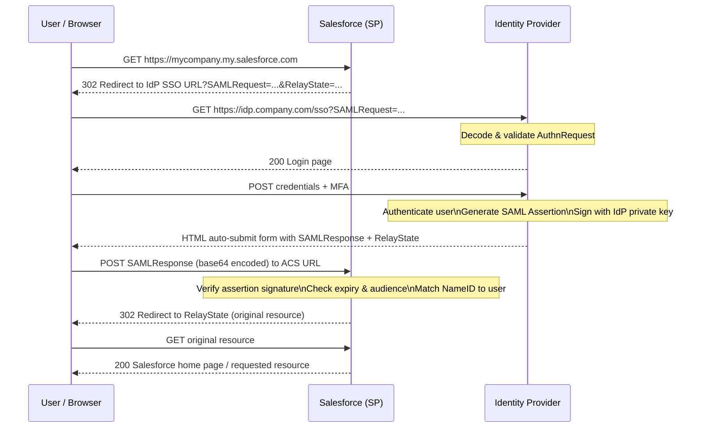
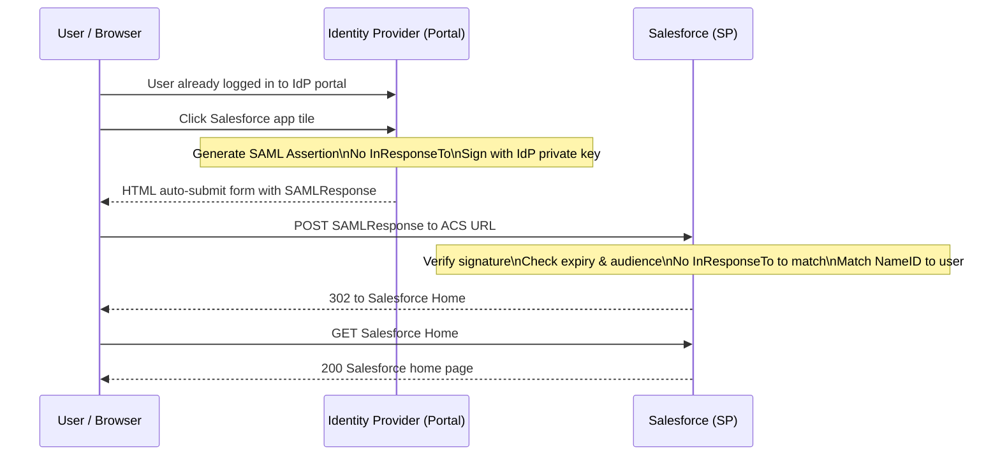
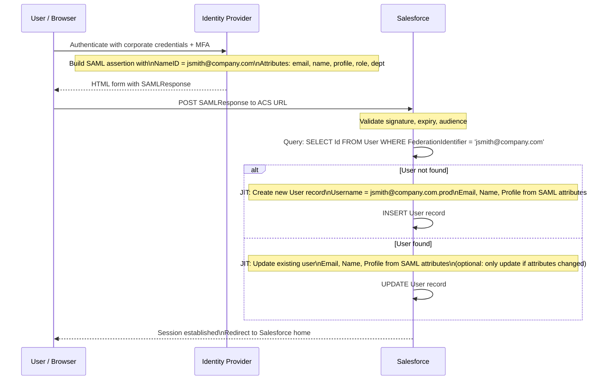

# SAML SSO Deep Dive

## Exam Domain
Federation, SSO & Delegated Authentication — **22% of exam weight** (~13 questions)

SAML is the single most-tested technology on the CRT-405 exam. You must know it at the protocol level — not just what buttons to click in Setup, but what is actually happening in the XML assertions, the HTTP redirects, and the browser's cookie jar. This lecture covers SAML 2.0 end-to-end.

---

## Foundations

### What Problem Does SAML Solve?

Before federation protocols, the enterprise had what is called the **password proliferation problem**:
- Every application maintained its own user database
- Users had a different username and password for each system
- When employees left, IT had to remember to deactivate accounts in every system
- Security teams could not get a unified view of who accessed what

**SAML 2.0 (Security Assertion Markup Language, version 2.0)** was published in 2005 by OASIS. It solves this by creating a trusted intermediary model:

1. One authoritative system (the **Identity Provider**) authenticates users and vouches for them
2. Applications (the **Service Providers**) delegate authentication to the IdP
3. The IdP issues cryptographically-signed XML documents called **assertions** that prove identity
4. Service Providers trust these assertions without re-verifying credentials

The SP never sees the user's password. The user authenticates once at the IdP (SSO). When the user is deactivated at the IdP, all SP access is blocked at the next authentication attempt.

### SAML 2.0 vs. SAML 1.0/1.1

SAML 2.0 is the current standard. SAML 1.1 is obsolete. When the exam says "SAML," it means 2.0. Key improvements in 2.0:
- Multiple bindings (HTTP Redirect, HTTP POST, Artifact)
- SP-initiated flow (1.1 only supported IdP-initiated)
- Better attribute profile standardization
- Single Logout (SLO) service defined

---

## Core Concepts

### SAML Key Roles

**Identity Provider (IdP)**
The system that:
- Maintains the user directory (directly or by connecting to AD/LDAP)
- Authenticates the user (validates credentials, enforces MFA)
- Issues the SAML assertion (XML document attesting to the user's identity)
- Signs the assertion with its private key
- Common examples: Okta, Azure AD, ADFS, PingFederate, OneLogin, Salesforce itself

**Service Provider (SP)**
The system that:
- Hosts the application the user wants to access
- Trusts the IdP (has the IdP's public key/certificate configured)
- Receives and validates SAML assertions
- Grants access based on assertion content
- Common examples: Salesforce, Google Workspace, ServiceNow, Workday

**User / Principal**
The entity whose identity is being asserted. Typically a human user with a browser, but could also be a system in headless SAML scenarios (rare).

### The Trust Relationship

Before any SSO can happen, the IdP and SP must establish a bilateral trust relationship **out of band** (before any authentication flow occurs). This is done by exchanging **SAML metadata**.

**IdP metadata** contains:
- `entityID` — unique identifier for the IdP (typically a URL)
- `SingleSignOnService` endpoint — the URL where the SP sends AuthnRequests
- `SingleLogoutService` endpoint — the URL where SLO messages are sent
- X.509 certificate — the public key the SP uses to verify assertion signatures

**SP metadata** contains:
- `entityID` — unique identifier for the SP (Salesforce's entityID is the My Domain URL)
- `AssertionConsumerService` (ACS) URL — where the IdP should POST the SAML response
- `SingleLogoutService` URL — for SLO
- X.509 certificate — the public key the IdP uses to verify encrypted assertions

**In Salesforce Setup:**
When you configure SSO Settings in Salesforce, you are essentially providing:
- The IdP's entityID → "Issuer" field
- The ACS URL → pre-populated by Salesforce (e.g., `https://yourorg.my.salesforce.com/login`)
- The IdP's signing certificate → uploaded to the SSO Settings record

---

### SAML Assertion Structure

A SAML assertion is an XML document. It contains three types of statements:

#### 1. AuthnStatement
The authentication statement proves the user authenticated at the IdP and provides context about how.

```xml
<saml:AuthnStatement AuthnInstant="2024-01-15T14:30:00Z"
                     SessionNotOnOrAfter="2024-01-15T22:30:00Z">
  <saml:AuthnContext>
    <saml:AuthnContextClassRef>
      urn:oasis:names:tc:SAML:2.0:ac:classes:PasswordProtectedTransport
    </saml:AuthnContextClassRef>
  </saml:AuthnContext>
</saml:AuthnStatement>
```

Key elements:
- `AuthnInstant` — when the authentication occurred
- `SessionNotOnOrAfter` — when the IdP session expires (SP should re-authenticate after this)
- `AuthnContextClassRef` — what authentication method was used (password, MFA, Kerberos, etc.)

Common AuthnContextClassRef values:
| Value | Meaning |
|---|---|
| `...PasswordProtectedTransport` | Username + password over HTTPS |
| `...MobileTwoFactorUnregistered` | Mobile OTP/push MFA |
| `...X509` | Smart card / certificate |
| `...Kerberos` | Windows Integrated Authentication |

#### 2. AttributeStatement
Carries attributes (claims) about the user. These are critical for JIT provisioning.

```xml
<saml:AttributeStatement>
  <saml:Attribute Name="email"
    NameFormat="urn:oasis:names:tc:SAML:2.0:attrname-format:basic">
    <saml:AttributeValue>jsmith@company.com</saml:AttributeValue>
  </saml:Attribute>
  <saml:Attribute Name="firstName">
    <saml:AttributeValue>John</saml:AttributeValue>
  </saml:Attribute>
  <saml:Attribute Name="lastName">
    <saml:AttributeValue>Smith</saml:AttributeValue>
  </saml:Attribute>
  <saml:Attribute Name="salesforceProfile">
    <saml:AttributeValue>Sales User</saml:AttributeValue>
  </saml:Attribute>
</saml:AttributeStatement>
```

For Salesforce JIT provisioning, the IdP must include attributes that map to Salesforce User fields. The JIT attribute mapping in the SSO Settings configuration defines which SAML attribute maps to which Salesforce field.

#### 3. AuthzDecisionStatement
An authorization statement — rarely used in modern SAML deployments. Most systems handle authorization separately from the SAML assertion.

#### The Full Assertion Envelope

The complete SAML assertion is wrapped in a **SAML Response** document:

```xml
<samlp:Response xmlns:samlp="..." ID="_abc123" Version="2.0"
                IssueInstant="2024-01-15T14:30:00Z"
                Destination="https://org.my.salesforce.com/login"
                InResponseTo="_requestid456">
  <saml:Issuer>https://idp.company.com/saml</saml:Issuer>
  <samlp:Status>
    <samlp:StatusCode Value="urn:oasis:names:tc:SAML:2.0:status:Success"/>
  </samlp:Status>
  <saml:Assertion xmlns:saml="..." ID="_def789" Version="2.0"
                  IssueInstant="2024-01-15T14:30:00Z">
    <saml:Issuer>https://idp.company.com/saml</saml:Issuer>
    <ds:Signature>... assertion signature ...</ds:Signature>
    <saml:Subject>
      <saml:NameID Format="urn:oasis:names:tc:SAML:1.1:nameid-format:emailAddress">
        jsmith@company.com
      </saml:NameID>
      <saml:SubjectConfirmation Method="urn:oasis:names:tc:SAML:2.0:cm:bearer">
        <saml:SubjectConfirmationData
          NotOnOrAfter="2024-01-15T14:35:00Z"
          Recipient="https://org.my.salesforce.com/login"
          InResponseTo="_requestid456"/>
      </saml:SubjectConfirmation>
    </saml:Subject>
    <saml:Conditions NotBefore="2024-01-15T14:29:55Z"
                     NotOnOrAfter="2024-01-15T14:35:00Z">
      <saml:AudienceRestriction>
        <saml:Audience>https://org.my.salesforce.com</saml:Audience>
      </saml:AudienceRestriction>
    </saml:Conditions>
    <saml:AuthnStatement ...> ... </saml:AuthnStatement>
    <saml:AttributeStatement> ... </saml:AttributeStatement>
  </saml:Assertion>
</samlp:Response>
```

**Critical assertion elements for the exam:**

| Element | Purpose | Salesforce Relevance |
|---|---|---|
| `Issuer` | IdP's entityID | Must match the "Issuer" field in Salesforce SSO Settings |
| `NameID` | The user identifier | Salesforce uses this to match to Federation ID, Username, or Email |
| `Conditions/NotBefore & NotOnOrAfter` | Assertion time window (~5 min) | Clock skew between IdP and SP causes "assertion expired" errors |
| `Audience` | Intended recipient's entityID | Must match Salesforce's entityID or login will fail |
| `Signature` | Cryptographic proof from IdP | Salesforce verifies this using IdP's certificate |
| `Recipient` | ACS URL of SP | Must match the configured ACS URL in Salesforce |
| `InResponseTo` | Ties response to original AuthnRequest | Used in SP-initiated flow; absent in IdP-initiated flow |

---

### SAML Flows

#### SP-Initiated SSO (Most Common)

The user starts at the Service Provider (Salesforce) and is redirected to the IdP.

**Step-by-step:**

1. **User visits SP:** User navigates to `https://mycompany.my.salesforce.com`
2. **SP detects no session:** Salesforce sees no valid session cookie
3. **SP generates AuthnRequest:** Salesforce creates an XML AuthnRequest that says "I need a SAML assertion for a user — please authenticate them"
4. **Redirect to IdP:** Salesforce redirects the browser to the IdP's SSO endpoint, with the AuthnRequest encoded in the URL (HTTP Redirect binding) or as a form POST (HTTP POST binding)
5. **User authenticates at IdP:** The IdP presents its login page; user enters credentials + MFA
6. **IdP creates assertion:** IdP generates a SAML Response containing the assertion, signs it with its private key
7. **POST back to SP:** IdP instructs the browser to HTTP POST the SAMLResponse to Salesforce's ACS URL
8. **SP validates assertion:** Salesforce:
   - Verifies the signature using the IdP's certificate
   - Checks the Issuer matches the configured entityID
   - Checks the assertion is not expired (Conditions/NotOnOrAfter)
   - Checks the Audience matches Salesforce's entityID
   - Checks the InResponseTo matches the AuthnRequest ID
9. **SP matches user:** Salesforce extracts the NameID and looks up the matching user by Federation ID (or Username or Email depending on configuration)
10. **Session established:** Salesforce creates a session and the user sees their home page



**RelayState** is a parameter passed through the entire flow. It typically contains the URL the user originally wanted to visit, so after SSO completes Salesforce can redirect the user to their original destination (deep link support).

#### IdP-Initiated SSO

The user starts at the IdP (e.g., clicks a Salesforce tile in the Okta dashboard) and the IdP directly POSTs an assertion without a prior AuthnRequest.

**Step-by-step:**

1. **User is at IdP portal:** User is already logged into Okta/Azure AD app portal
2. **User clicks app tile:** User clicks the Salesforce tile in their app portal
3. **IdP generates assertion:** IdP creates a SAML Response with an unsolicited assertion (no InResponseTo — there was no AuthnRequest)
4. **POST to SP:** IdP POSTs the SAMLResponse directly to Salesforce's ACS URL
5. **SP validates:** Salesforce validates the assertion (same checks, minus the InResponseTo check)
6. **Session established:** User sees Salesforce



**SP-initiated vs IdP-initiated comparison:**

| Aspect | SP-Initiated | IdP-Initiated |
|---|---|---|
| Where user starts | Application (Salesforce) | IdP portal / app launcher |
| AuthnRequest | Yes — SP generates and sends | No — unsolicited assertion |
| InResponseTo in assertion | Yes — matches AuthnRequest ID | No — absent |
| Security | Higher (request tracked, replay harder) | Slightly lower (no request validation) |
| Deep linking | Supported via RelayState | Not supported (unless IdP includes target URL) |
| Use case | Users bookmark Salesforce URL | App portal / intranet launch |

---

### SAML Bindings

Bindings define how SAML messages are transported over HTTP.

#### HTTP Redirect Binding
- The SAML message is URL-encoded and included as a query parameter in an HTTP 302 redirect
- Used primarily for the AuthnRequest (SP → IdP), because requests are smaller
- The message is base64-encoded and deflate-compressed
- The URL signature is in the `SigAlg` and `Signature` query parameters (the message body is NOT signed in redirect binding — the URL query string is signed)
- Limited to ~2000 characters in older browsers; large assertions cannot use this binding

#### HTTP POST Binding
- The SAML message is base64-encoded and placed in an HTML form field
- The IdP returns an HTML page with a hidden form and JavaScript that auto-submits
- Used for the SAML Response (IdP → SP), because responses are larger (contain assertions)
- The assertion itself is signed (XML signature inside the response body)
- No size limit constraints from URL length

#### HTTP Artifact Binding
- Instead of carrying the assertion in the browser, the IdP sends a short "artifact" (reference pointer) to the SP via redirect
- The SP then makes a direct back-channel SOAP call to the IdP's Artifact Resolution Service to retrieve the actual assertion
- The assertion never passes through the browser (higher security for sensitive assertions)
- Higher complexity; less commonly used
- Salesforce supports artifact binding

**Which binding does Salesforce use?**
- SP to IdP (AuthnRequest): HTTP Redirect binding (default)
- IdP to SP (Response): HTTP POST binding (default)
- SLO requests: HTTP Redirect or HTTP POST (configurable)

---

### Signature and Encryption

#### Signing

SAML signatures use XML Digital Signatures (XMLDSig). There are two places signatures can appear:

**Response-level signing:** The entire `<samlp:Response>` element is signed.
```xml
<samlp:Response>
  <ds:Signature>... response-level signature ...</ds:Signature>
  <saml:Assertion>
    <!-- assertion is unsigned -->
  </saml:Assertion>
</samlp:Response>
```

**Assertion-level signing:** Only the `<saml:Assertion>` element is signed.
```xml
<samlp:Response>
  <saml:Assertion>
    <ds:Signature>... assertion-level signature ...</ds:Signature>
    ...
  </saml:Assertion>
</samlp:Response>
```

**Both can be signed simultaneously** — the assertion is signed, then the response wrapping the assertion is signed.

**Security recommendation:** Sign at the **assertion level** (or both levels). Response-level-only signing has been associated with XML wrapping attacks where an attacker inserts a malicious unsigned assertion into a signed response envelope.

Salesforce default: Salesforce expects the **assertion to be signed** (assertion-level). Many IdPs sign both the response and the assertion.

Signature algorithms (weak to strong):
- SHA-1 (RSA-SHA1) — Legacy, should not be used
- SHA-256 (RSA-SHA256) — Current standard ✓
- SHA-512 — Higher security, slight performance overhead

#### Encryption

SAML supports encrypting the assertion to prevent intermediaries from reading it:

```xml
<saml:EncryptedAssertion>
  <xenc:EncryptedData>
    <!-- The assertion encrypted with a symmetric key -->
    <!-- The symmetric key encrypted with the SP's public key -->
  </xenc:EncryptedData>
</saml:EncryptedAssertion>
```

Encryption uses a hybrid approach:
1. The assertion is encrypted with a random symmetric key (AES-128 or AES-256)
2. The symmetric key is encrypted with the SP's public key (RSA)
3. Only the SP (holding the private key) can decrypt the symmetric key and thus the assertion

**In Salesforce:** Encryption is optional. If the IdP encrypts assertions, Salesforce must have the corresponding private key in its keystore. Most enterprise deployments rely on TLS for transport security and do not encrypt at the assertion level, unless there are specific compliance requirements.

---

### NameID and User Matching

The **NameID** is how the IdP identifies the user in the assertion. Salesforce must match this NameID to an existing user record.

#### NameID Formats

| Format URI | Description |
|---|---|
| `urn:oasis:names:tc:SAML:1.1:nameid-format:emailAddress` | Email address |
| `urn:oasis:names:tc:SAML:1.1:nameid-format:unspecified` | Opaque value (any format) |
| `urn:oasis:names:tc:SAML:2.0:nameid-format:persistent` | Persistent opaque identifier |
| `urn:oasis:names:tc:SAML:2.0:nameid-format:transient` | Temporary, per-session identifier |

#### Salesforce NameID Matching Options

In Salesforce SSO Settings, you configure how the NameID maps to a Salesforce user:

| Salesforce Config | What It Does | NameID Value Must Match |
|---|---|---|
| **Federation ID** | Matches NameID to `FederationIdentifier` field on User | The Federation ID value |
| **Username** | Matches NameID to `Username` field on User | The Salesforce username |
| **Email** | Matches NameID to `Email` field on User | The user's email address |
| **Salesforce Username** | NameID must be exactly the Salesforce username | Full Salesforce username (user@company.com.sandbox) |

**Best practice: Use Federation ID.** It decouples the user identifier from the Salesforce username (which may have sandbox/environment suffixes) and from the email (which may change when someone gets married). The Federation ID can be set to the user's corporate employee ID or AD objectGUID for maximum stability.

---

### Just-In-Time (JIT) Provisioning

JIT provisioning allows Salesforce to create or update a user record automatically at the moment of first SAML login. No pre-provisioning is required.

#### How JIT Works

When JIT is enabled in the SSO Settings, at assertion processing time Salesforce:

1. Extracts the NameID from the assertion
2. Looks for a User with matching Federation ID (or Username/Email depending on config)
3. **If no user found:**
   - Reads attribute values from the AttributeStatement
   - Creates a new User record using those attributes
   - The user is now provisioned
4. **If user found:**
   - Updates the User record with current attribute values from the assertion
   - This keeps Salesforce in sync with the IdP directory
5. Grants the session for the user

#### Required JIT Attributes

For Salesforce JIT provisioning, the SAML assertion must include at minimum:
- `User.Username` (or it can be derived from the NameID)
- `User.Email`
- `User.FirstName`
- `User.LastName`
- `User.ProfileName` (or `User.ProfileId`) — if not provided, uses the default SSO profile

Optional but commonly included:
- `User.Title`
- `User.Department`
- `User.CompanyName`
- `User.Phone`
- `User.MobilePhone`
- `User.UserRoleName` — to assign a Role
- `User.LocaleSidKey` — locale
- `User.TimeZoneSidKey` — time zone
- `User.LanguageLocaleKey` — language

#### JIT Sequence Diagram



**JIT vs. Pre-provisioning comparison:**

| | JIT Only | SCIM Pre-provisioning | JIT + SCIM |
|---|---|---|---|
| User exists before first login | No | Yes | Yes |
| Can provision users who never log in | No | Yes | Yes |
| Can deprovision (deactivate) | No | Yes | Via SCIM |
| Attribute sync on login | Yes (always current) | On SCIM event | Redundant (both) |
| License management | Complicated | Better (pre-assigned) | Best |

---

### SAML Single Logout (SLO)

SAML SLO is the mechanism for propagating logout across all SP sessions when a user logs out.

#### SLO Flow (SP-Initiated)

1. User clicks "Log Out" in Salesforce (SP)
2. Salesforce sends a `LogoutRequest` to the IdP's SLO endpoint
3. IdP receives the request, terminates the user's SSO session
4. IdP notifies all other SPs that have active sessions (by sending each a LogoutRequest)
5. Each SP terminates its local session and sends a `LogoutResponse` back to IdP
6. IdP sends a final `LogoutResponse` to the originating SP (Salesforce)
7. Salesforce shows the "You are logged out" page

**Challenges:**
- Not all SPs implement SLO correctly — they may ignore the LogoutRequest
- Active Salesforce sessions from other browsers/tabs may persist
- Mobile apps using OAuth tokens are unaffected by SAML SLO

**In Salesforce:** SLO is configured in the SSO Settings by providing the IdP's SLO endpoint URL. When configured, Salesforce sends a LogoutRequest when users log out via the Salesforce logout button.

---

### Salesforce SAML Configuration Reference

When configuring SAML SSO in Salesforce Setup > Single Sign-On Settings:

| Salesforce Field | Description | Maps To |
|---|---|---|
| Name | Display name for this SSO config | Internal label |
| API Name | Programmatic name | Used in API / login URL |
| Issuer | IdP's entityID | Must match `<saml:Issuer>` in assertion |
| Identity Provider Certificate | IdP's signing certificate (public key) | Used to verify assertion signature |
| SAML Identity Type | Federation ID / Username / Email | How NameID maps to Salesforce user |
| SAML Identity Location | Subject (NameID) or Attribute element | Where in the assertion the identifier lives |
| Identity Provider Login URL | IdP's SSO endpoint | Where Salesforce sends AuthnRequest |
| Identity Provider Logout URL | IdP's SLO endpoint | Where Salesforce sends LogoutRequest |
| Custom Error URL | Redirect on SSO failure | Optional UX improvement |
| Entity ID | Salesforce's entityID for IdP | Auto-populated from My Domain URL |
| ACS URL | Where IdP sends SAML Response | Auto-populated by Salesforce |
| JIT Enabled | Whether to create/update users on login | Checkbox |
| JIT Handler | Custom Apex class for JIT | Optional — overrides default JIT behavior |
| Request Signing Certificate | Salesforce's cert for signing AuthnRequests | Optional — not all IdPs require it |

#### My Domain — The Prerequisite

**My Domain must be deployed before SSO can be configured.** Without My Domain:
- The "Single Sign-On Settings" menu may not appear (depending on org type)
- The Entity ID and ACS URL are not properly formed
- Users cannot be redirected to the correct SSO login URL

My Domain also enables:
- Setting the authentication policy (SSO required / SSO optional)
- Custom login page branding
- Subdomain isolation for cookies and sessions

---

### SAML Troubleshooting

#### Common SAML Errors and Root Causes

| Error Message | Root Cause | Fix |
|---|---|---|
| "We can't log you in because of an issue with your Single Sign-On configuration" | Generic catch-all | Use SAML Validator tool in Setup to see specific error |
| Assertion expired / NotOnOrAfter in past | Clock skew between IdP and SP servers | Synchronize clocks (NTP); increase assertion window slightly |
| Audience restriction failure | Audience in assertion doesn't match Salesforce entityID | Configure IdP to use Salesforce My Domain URL as audience |
| Invalid signature | Wrong certificate in Salesforce, or IdP changed certificate | Update IdP certificate in Salesforce SSO Settings |
| NameID not matched | Federation ID value doesn't match NameID in assertion | Check Federation ID field values; check SAML Identity Type setting |
| Response status: Requester error | IdP rejected the AuthnRequest | Check Issuer/entityID in AuthnRequest; check request signing config |
| JIT provisioning failed | Missing required attribute in assertion | Check attribute mapping; ensure Profile attribute is included |
| InResponseTo not found | Replay attempt or assertion cached | Check assertion time windows; check for session replay |

#### SAML-Tracer Tool

SAML-tracer is a browser extension (Chrome/Firefox) that intercepts and decodes SAML messages in real time. Use it to:
- See the raw SAMLRequest and SAMLResponse
- Decode the base64 to read the XML
- Verify the NameID value, assertion expiry, and attribute values
- Verify the Issuer and Audience
- Check whether the response is signed at response level, assertion level, or both

**Salesforce SAML Validator:** In Setup > Single Sign-On Settings, there is a "SAML Assertion Validator" tool. You can paste a base64-encoded SAML Response and Salesforce will tell you specifically what passed and what failed validation.

---

## PTA / SA Relevance

### When SAML Comes Up in Engagements

SAML is discussed in almost every enterprise Salesforce deployment with >50 internal users. The conversation typically goes:

**Discovery:** "We have Active Directory / Azure AD / Okta. How does SSO work?"
**Your answer:** Explain SP-initiated flow, mention that we need their IdP metadata, that we configure Salesforce as an SAML SP, and that users will authenticate at their existing IdP.

**Architecture review:** "What attributes do we need to include in the SAML assertion for JIT provisioning?"
**Your answer:** At minimum — email, firstName, lastName, profile. Recommended — role, department, title, locale, timezone, languageLocale. Provide the attribute name mapping Salesforce expects.

**Go-live blocker:** "Our users get an error when trying to log in via SSO."
**Your answer:** Get a SAML-tracer capture. Check the assertion XML. Focus on: Is the Issuer correct? Is the assertion expired? Does the NameID match a Federation ID? Is the signature valid?

**Post-go-live audit:** "Our security team wants to know how Salesforce handles SSO session termination when a user is deactivated."
**Your answer:** Deactivating the user in the IdP prevents new assertions from being issued. Existing Salesforce sessions persist until they expire (based on session settings). For immediate revocation, use SCIM to deactivate the Salesforce user AND use "Logout from all sessions" in Salesforce (or transaction security policies).

### When to Use SAML vs. OAuth

This is a critical exam question and a real customer question:

| Use SAML When | Use OAuth/OIDC When |
|---|---|
| Enterprise internal SSO with AD/Okta/ADFS | Modern web app or mobile app authentication |
| Browser-based authentication | API access (no browser) |
| Legacy IdP only supports SAML | Machine-to-machine (M2M) integrations |
| Rich enterprise user attributes needed at login | Scoped API access delegation |
| You need deep JIT provisioning from directory | User wants to "Login with Google" |

**Hybrid scenario:** Many enterprises use SAML for internal employee login AND OAuth for third-party app integrations. Salesforce supports both simultaneously.

### Common SAML Misconfigurations

**Misconfiguration 1: Wrong entityID**
The Salesforce entityID is the My Domain URL (e.g., `https://mycompany.my.salesforce.com`). Many customers accidentally configure the IdP with the org ID or the login URL. The Audience in the assertion must exactly match the entityID.

**Misconfiguration 2: Sandbox suffixes in username**
When testing in a sandbox, Salesforce usernames have the sandbox name appended (e.g., `user@company.com.uat`). If the IdP sends `user@company.com` as the NameID and SAML Identity Type is "Username," the match fails. Solution: Use Federation ID instead of Username.

**Misconfiguration 3: Certificate mismatch after IdP rotation**
IdPs rotate signing certificates periodically. When they do, the old certificate in Salesforce becomes invalid and all SSO logins fail. Solution: Update the IdP certificate in Salesforce SSO Settings. Some IdPs support uploading both old and new cert during rotation window.

**Misconfiguration 4: JIT creates users with wrong profile**
If the SAML assertion does not include a `ProfileName` attribute (or the attribute name is wrong), JIT uses the default SSO profile — which may be overly permissive or restrictive. Test JIT with SAML-tracer before go-live.

### Enterprise Patterns

**Pattern: Azure AD → Salesforce SAML SSO**
- Azure AD configured with Salesforce app from the Azure Gallery (pre-configured templates)
- Attribute mapping in Azure AD: UPN → NameID (emailAddress format)
- Salesforce SSO Settings: SAML Identity Type = Federation ID; Federation ID = corporate email
- Azure AD Conditional Access: MFA required, device compliance required → before assertion issued
- User lifecycle: Azure AD SCIM provisioner → Salesforce (deactivates users when AD account disabled)

**Pattern: ADFS → Salesforce (Legacy on-premises)**
- ADFS configured as Claims Provider with Relying Party Trust for Salesforce
- Claims rule transforms AD attributes to SAML attributes
- WS-Federation or SAML protocol (ADFS supports both)
- Increasingly being migrated to Azure AD + SAML or Azure AD + OIDC

**Pattern: Okta → Multi-org Salesforce**
- Okta configured as IdP for multiple Salesforce orgs (production + multiple sandboxes)
- Each org has its own SSO Settings record with a different ACS URL and entityID
- Okta app assignments control which users have access to which Salesforce orgs
- Single Okta instance manages SSO + SCIM for all orgs

---

## Architecture

### SP-Initiated SSO — Detailed

```mermaid
sequenceDiagram
    participant U as User / Browser
    participant SF as Salesforce (SP)
    participant IdP as Okta / Azure AD (IdP)
    participant AD as Active Directory

    U->>SF: GET https://acme.my.salesforce.com (no session cookie)
    SF->>SF: Generate AuthnRequest XML\nID="_req123" Issuer="https://acme.my.salesforce.com"\nAssertionConsumerServiceURL="https://acme.my.salesforce.com/login"
    SF-->>U: 302 Redirect to IdP SSO URL\n?SAMLRequest=deflate+base64(AuthnRequest)\n&RelayState=https://acme.my.salesforce.com/home\n&SigAlg=...&Signature=...
    U->>IdP: GET https://idp.acme.com/sso?SAMLRequest=...
    Note over IdP: Decode AuthnRequest\nValidate SP entityID\nCheck ACS URL whitelist
    IdP-->>U: 200 Corporate login page
    U->>IdP: POST username + password + TOTP
    IdP->>AD: LDAP bind: validate credentials
    AD-->>IdP: Authentication success\nUser attributes: email, groups, dept
    Note over IdP: Build SAML Assertion\nNameID = jsmith@acme.com\nAttributes: email, firstName, lastName, dept\nSign with RSA-SHA256 private key
    IdP-->>U: 200 HTML auto-submit form\n<form action="https://acme.my.salesforce.com/login" method="post">\n<input name="SAMLResponse" value="base64encoded...">\n<input name="RelayState" value="...">
    U->>SF: POST SAMLResponse + RelayState to ACS URL
    Note over SF: Decode base64 SAMLResponse\nVerify XML signature (IdP public cert)\nCheck Issuer == "https://idp.acme.com"\nCheck Audience == "https://acme.my.salesforce.com"\nCheck NotOnOrAfter > now\nCheck InResponseTo == "_req123"\nExtract NameID = "jsmith@acme.com"\nQuery User WHERE FederationIdentifier = "jsmith@acme.com"\nCreate session for matched user
    SF-->>U: 302 Redirect to RelayState (original URL)
    U->>SF: GET https://acme.my.salesforce.com/home
    SF-->>U: 200 Salesforce Home Page
```



**Limitations & Tradeoffs:**

| Aspect | Detail |
|---|---|
| Clock sensitivity | Assertion validity window is typically 5 minutes. If IdP and SP clocks differ by >5 min, SSO fails. NTP sync is critical. |
| Browser dependency | SAML is fundamentally browser-based. Works for web UI but not for API access or mobile apps. |
| SP-initiated security | More secure than IdP-initiated because the SP tracks the request ID (InResponseTo), making replay attacks harder. |
| IdP-initiated security risk | Slightly higher risk: no AuthnRequest to validate against. Some orgs disable IdP-initiated SSO for this reason. |
| Metadata management | Certificate rotations require coordinated updates on both IdP and SP. Plan rotation procedures in advance. |

---

## Key Facts to Memorize

1. **SAML 2.0 is XML-based; published by OASIS; designed for browser-based enterprise SSO**
2. **Three statement types: AuthnStatement, AttributeStatement, AuthzDecisionStatement**
3. **SP-Initiated: User starts at SP → AuthnRequest to IdP → Assertion back to SP's ACS URL**
4. **IdP-Initiated: User starts at IdP portal → Assertion POST directly to SP (no AuthnRequest)**
5. **InResponseTo is present in SP-initiated flow; ABSENT in IdP-initiated flow**
6. **Salesforce default binding: HTTP Redirect (AuthnRequest) + HTTP POST (Response)**
7. **Sign at assertion level for security; response-level-only signing is vulnerable to XML wrapping**
8. **ACS URL = Assertion Consumer Service URL — where IdP sends the SAML Response POST**
9. **entityID = unique identifier for the SP; for Salesforce = My Domain URL**
10. **Federation ID is the Salesforce User field that maps to the SAML NameID (recommended)**
11. **JIT: enabled in SSO Settings; creates/updates users on login; CANNOT deprovision**
12. **My Domain must be deployed before configuring SSO in Salesforce**
13. **Audience restriction in assertion must match Salesforce entityID or login fails**
14. **Clock skew > assertion validity window = "assertion expired" error**
15. **SAML-tracer decodes SAMLRequest/Response in browser; Salesforce SAML Validator in Setup**

---

## Exam Traps

**Trap 1: "The NameID must always be an email address"**
> NameID can use many formats: email, unspecified, persistent, transient. Salesforce can match on Federation ID (not necessarily email) using any NameID value. The NameID format and the SAML Identity Type in Salesforce must align.

**Trap 2: "SAML assertions are encrypted by default"**
> SAML assertions are SIGNED by default (to verify integrity and authenticity), but NOT encrypted by default. Encryption is optional and must be explicitly configured. TLS provides transport security but not message-level encryption.

**Trap 3: "IdP-initiated SSO is more secure because the IdP controls it"**
> SP-initiated SSO is more secure because the SP generates an AuthnRequest with a unique ID, and the assertion must include InResponseTo matching that ID. This prevents replay attacks. IdP-initiated assertions have no prior request to validate against.

**Trap 4: "JIT provisioning can deactivate users"**
> JIT only fires on SAML login. It can create or update users, but it has no mechanism to detect that a user should be deactivated (because a deactivated user would never attempt to log in). Deprovisioning requires a separate mechanism (SCIM, API, or manual).

**Trap 5: "You can configure SSO in Salesforce without My Domain"**
> My Domain is a hard prerequisite. Without a My Domain, the SSO Settings configuration is unavailable or incomplete. This is a common trap question.

**Trap 6: "SAML Response is signed, so we don't need to sign the Assertion"**
> Response-level signing can be vulnerable to XML Signature Wrapping (XSW) attacks. Best practice is to sign the assertion (not just the response), or sign both. Some exam questions test this distinction.

---

## Practice Questions

**Question 1**

A customer is configuring SP-initiated SAML SSO between Azure AD (IdP) and Salesforce. After configuration, users receive an "invalid audience" error. What is the most likely cause?

A. The IdP certificate has expired  
B. The Audience element in the SAML assertion does not match Salesforce's Entity ID  
C. The SAML binding is set to HTTP Artifact instead of HTTP POST  
D. JIT provisioning is not enabled in the SSO Settings  

**Answer: B**

*Explanation:* The "invalid audience" error occurs when the `<saml:Audience>` value in the assertion does not match the SP's entityID. In Salesforce, the entityID is the My Domain URL. The IdP must be configured to use the exact Salesforce entityID as the Audience. Option A would cause a signature failure, not an audience error. Option C would change the transport mechanism but not cause an audience mismatch. Option D would cause user-not-found errors for new users, not an audience restriction error.

---

**Question 2**

In a SAML SP-initiated SSO flow, what is the purpose of the `InResponseTo` attribute in the SAML Response?

A. It identifies which Salesforce user profile should be assigned  
B. It links the SAML Response to the original AuthnRequest, enabling the SP to verify the response was not replayed  
C. It specifies the URL the user should be redirected to after login  
D. It contains the session duration for the Salesforce session  

**Answer: B**

*Explanation:* `InResponseTo` contains the ID of the original `<samlp:AuthnRequest>` generated by the SP. When Salesforce receives the SAML Response, it checks that InResponseTo matches a recent AuthnRequest ID that it generated. This prevents replay attacks — an attacker cannot reuse an old SAML assertion because the original request ID is no longer tracked. Option A describes a different attribute (ProfileName). Option C describes RelayState. Option D is not a SAML concept.

---

**Question 3**

A company wants to use SAML JIT provisioning to automatically create Salesforce users on first login. Which of the following attributes MUST be included in the SAML assertion for JIT to succeed? (Select two)

A. User.FederationIdentifier  
B. User.Email  
C. User.Department  
D. User.LastName  
E. User.PermissionSetAssignment  

**Answer: B and D**

*Explanation:* For JIT provisioning, Salesforce requires at minimum: Email (User.Email) and Last Name (User.LastName) to create a valid user record. First Name is also commonly required (though technically nullable). FederationIdentifier (A) is the NameID — it's used to identify the user but is derived from the NameID element, not necessarily an AttributeStatement attribute. Department (C) is optional. PermissionSetAssignment (E) is not a JIT-supported attribute in standard configuration.

---

**Question 4**

A customer calls because their users started receiving "assertion expired" errors three days after a successful SSO configuration. No changes were made to Salesforce or the IdP configuration. What is the MOST likely cause?

A. The IdP certificate was rotated and the new certificate was not uploaded to Salesforce  
B. The SAML assertion validity window was exceeded due to clock drift between the IdP and Salesforce servers  
C. The user's session timeout is set too short  
D. JIT provisioning failed to update the user records  

**Answer: B**

*Explanation:* SAML assertions have a validity window defined by `NotBefore` and `NotOnOrAfter` in the Conditions element (typically 5 minutes). If the clocks on the IdP and SP drift apart by more than this window, assertions arrive appearing to be already expired. This can happen gradually over days without any configuration change. The fix is to ensure both servers synchronize with NTP. Option A would cause a signature verification failure, not an expiry error. Options C and D describe different types of errors.

---

**Question 5**

Which SAML component is responsible for defining where the Identity Provider should send the SAML Response after successful authentication?

A. Entity ID  
B. RelayState  
C. Assertion Consumer Service (ACS) URL  
D. SingleSignOnService URL  

**Answer: C**

*Explanation:* The **Assertion Consumer Service (ACS) URL** is the SP's endpoint where the IdP must POST the SAML Response. It is configured in both the SP metadata and in the IdP configuration for that SP. In Salesforce, the ACS URL is auto-populated based on the My Domain URL (e.g., `https://mycompany.my.salesforce.com/login`). Entity ID (A) uniquely identifies the SP but is not the destination URL. RelayState (B) carries the deep-link URL for post-login redirect, not the assertion destination. SingleSignOnService URL (D) belongs to the IdP — it's where the SP sends the AuthnRequest.
