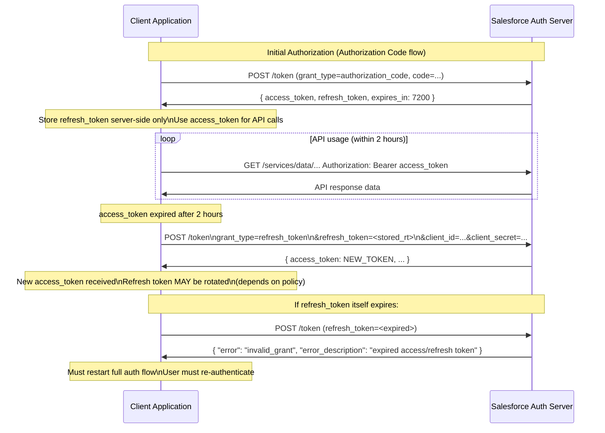
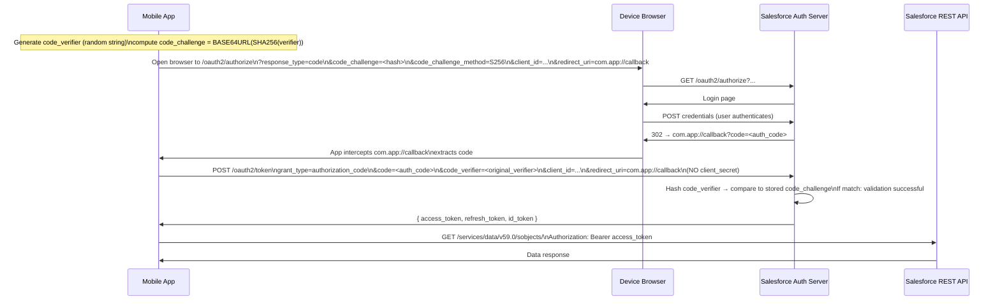
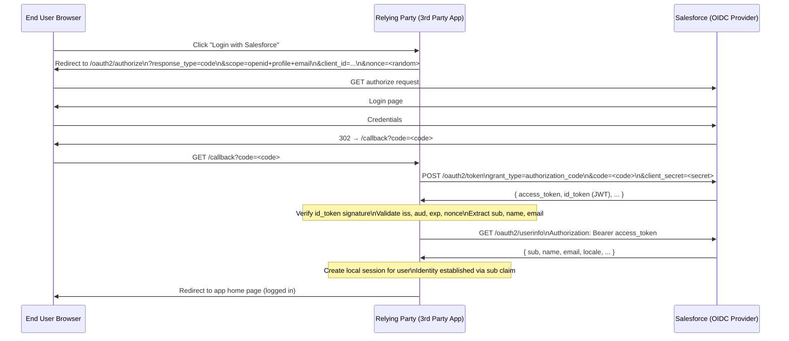

# OAuth 2.0 & OpenID Connect

## Exam Domain
Federation, SSO & Delegated Authentication — **22% of exam weight** (~13 questions)

OAuth 2.0 and OpenID Connect are the modern successors to password-based API access. The exam tests you on grant type selection, token types, flow mechanics, and security tradeoffs — not just surface-level definitions. You must understand when each grant type is appropriate and why the others are wrong.

---

## Foundations

### What Problem Does OAuth 2.0 Solve?

Before OAuth, integrations accessed protected APIs using the resource owner's actual credentials — the username and password of a real user were stored in the integration and transmitted on every API call. This created cascading problems:

- **Credential exposure**: Every integration that stored a password became an attack target
- **Scope creep**: A password grants full access; there was no way to limit an integration to "read-only contacts"
- **Revocation impossibility**: To revoke an integration's access you had to change the user's password, breaking every other integration using it
- **Audit blindness**: API call logs showed activity from one user account shared by many systems

**OAuth 2.0 (RFC 6749, published 2012)** solves this through **delegated authorization**: the resource owner (user) grants a client application a limited, scoped access token without ever sharing their credentials. The token is time-limited and can be revoked without affecting the user's password.

**Critical distinction**: OAuth 2.0 is an **authorization** framework, NOT an authentication protocol. It answers "what can this application do on behalf of this user?" It does NOT answer "who is this user?" That is what OpenID Connect adds.

### OAuth 2.0 Roles

| Role | Description | Salesforce Example |
|---|---|---|
| **Resource Owner** | The user who owns the data | Salesforce user whose Account records are being accessed |
| **Client** | The application requesting access | External web app, mobile app, or MuleSoft integration |
| **Authorization Server** | Issues tokens after authenticating the resource owner | Salesforce acting as Auth Server; `login.salesforce.com` token endpoint |
| **Resource Server** | Hosts the protected API | Salesforce REST/SOAP API |

In Salesforce implementations, the Authorization Server and Resource Server are often the same Salesforce org. When Salesforce is the Authorization Server, the Connected App is the OAuth client configuration.

---

## Core Concepts

### OAuth 2.0 Grant Types

Grant types define the protocol by which a client obtains an access token. Selecting the correct grant type for a scenario is one of the most tested topics on the exam.

#### 1. Authorization Code Grant (Web Server Flow)

**RFC 6749 §4.1 | Best for: Server-side web applications with a secure backend**

The authorization code is a short-lived, one-time code exchanged for tokens on the server side. The client secret never touches the browser.

**Flow overview:**
1. Client redirects user's browser to the Authorization Server with `response_type=code`
2. User authenticates and consents
3. Authorization Server redirects back to the client's `redirect_uri` with a short-lived `code`
4. Client's **backend server** exchanges the `code` for tokens using `client_id` + `client_secret`
5. Tokens returned directly to the backend server — never touch the browser

**Why it's secure**: The authorization code travels through the browser (insecure channel), but the actual tokens are only exchanged on the backend server-to-server call where the client secret is available. An attacker who intercepts the code cannot use it without the client secret.

**Salesforce endpoint:**
```
Step 1 — Authorization:
GET https://[domain].my.salesforce.com/services/oauth2/authorize
?response_type=code
&client_id=<consumer_key>
&redirect_uri=<registered_callback_url>
&scope=api+refresh_token
&state=<random_csrf_token>

Step 2 — Token Exchange:
POST https://[domain].my.salesforce.com/services/oauth2/token
Content-Type: application/x-www-form-urlencoded

grant_type=authorization_code
&code=<authorization_code>
&client_id=<consumer_key>
&client_secret=<consumer_secret>
&redirect_uri=<same_registered_callback_url>
```

**Token response:**
```json
{
  "access_token": "00Dxx...!ARs...",
  "refresh_token": "5Aep...",
  "instance_url": "https://mycompany.my.salesforce.com",
  "id": "https://login.salesforce.com/id/00Dxx.../005xx...",
  "token_type": "Bearer",
  "issued_at": "1693000000000",
  "scope": "api refresh_token",
  "signature": "..."
}
```

---

#### 2. Authorization Code + PKCE Extension

**RFC 7636 | Best for: Mobile apps, Single-Page Apps (SPAs), any public client that CANNOT keep a client secret**

PKCE (Proof Key for Code Exchange, pronounced "pixy") extends the Authorization Code flow to work securely without a client secret. It solves the problem that mobile apps and browser-based SPAs cannot safely store a consumer secret (they can be decompiled or inspected).

**How PKCE Works:**

Before the authorization request, the client generates:
- `code_verifier`: A cryptographically random string (43-128 characters)
- `code_challenge`: `BASE64URL(SHA256(code_verifier))`

**Step 1** — Authorization request (includes the challenge):
```
GET /services/oauth2/authorize
?response_type=code
&client_id=<consumer_key>
&redirect_uri=com.myapp://oauth/callback
&code_challenge=<BASE64URL(SHA256(code_verifier))>
&code_challenge_method=S256
&scope=api+refresh_token
```

**Step 2** — Token exchange (includes the verifier):
```
POST /services/oauth2/token

grant_type=authorization_code
&code=<auth_code>
&client_id=<consumer_key>
&redirect_uri=com.myapp://oauth/callback
&code_verifier=<original_verifier>
```
Notice: no `client_secret` is required.

**Why it's secure**: The Authorization Server hashes the `code_verifier` at token exchange time and compares it to the `code_challenge` it received at authorization time. Only the client that generated the `code_verifier` can complete the exchange. Even if an attacker intercepts the authorization code, they cannot exchange it without the `code_verifier` — which never left the client device.

**Salesforce Support**: PKCE is fully supported in Salesforce. For Connected Apps used by mobile apps or SPAs, omit the Consumer Secret from the mobile code and use PKCE instead.

---

#### 3. Implicit Grant (Deprecated for New Implementations)

**RFC 6749 §4.2 | Legacy: Single-page apps before PKCE existed**

The implicit flow returns an `access_token` directly in the browser URL fragment (`#access_token=...`) — no authorization code, no backend exchange, no client secret.

**Why it was built**: Before PKCE, SPAs had no secure way to use Authorization Code flow (no client secret). Implicit was the compromise.

**Why it's deprecated (RFC 9700)**: The access token appears in the browser history, server logs, and can be leaked via the `Referer` header. There is no `refresh_token` issued. Modern implementations should use Authorization Code + PKCE.

**Salesforce**: Salesforce still supports Implicit flow (User-Agent flow in Salesforce terminology) but it should not be used for new implementations.

```
GET /services/oauth2/authorize
?response_type=token
&client_id=<consumer_key>
&redirect_uri=https://app.example.com/callback
&scope=api

→ Redirect to: https://app.example.com/callback#access_token=00D...&token_type=Bearer&...
```

---

#### 4. Client Credentials Grant

**RFC 6749 §4.4 | Best for: Machine-to-machine with no user context (Salesforce API v53+)**

The client authenticates directly with its own credentials — no user involved. The identity of the "user" is the application itself.

```
POST /services/oauth2/token
Content-Type: application/x-www-form-urlencoded

grant_type=client_credentials
&client_id=<consumer_key>
&client_secret=<consumer_secret>
```

**Salesforce-specific requirements:**
- The Connected App must have "Enable Client Credentials Flow" checked
- A **Run As User** must be configured in the Connected App's OAuth Policies
- The Run As User's permissions define what data the token can access

**No refresh token is issued** — the client re-authenticates for each new access token.

---

#### 5. Resource Owner Password Credentials (ROPC) — Deprecated

**RFC 6749 §4.3 | Legacy: Avoid in production**

The client collects the user's username and password directly and sends them to the token endpoint.

```
POST /services/oauth2/token

grant_type=password
&username=user@example.com
&password=<password><security_token>
&client_id=<consumer_key>
&client_secret=<consumer_secret>
```

Note the Salesforce quirk: the `password` parameter is the password concatenated with the security token (unless the user's IP is in trusted ranges).

**Why to avoid:**
- The client application sees the user's password — defeating the core purpose of OAuth
- Bypasses MFA — Salesforce MFA requirements are enforced on browser sessions; ROPC bypasses them
- OAuth 2.1 (in progress) removes this grant type entirely
- Salesforce does not recommend ROPC for production use; JWT Bearer is the replacement for automated access

---

#### 6. Device Authorization Grant (Device Flow)

**RFC 8628 | Best for: Devices with limited input capability — IoT, CLI tools, smart TVs**

The device cannot open a browser. Instead, it displays a code and asks the user to visit a URL on a different device (their phone or laptop) to authorize.

**Flow:**
1. Device posts to `/services/oauth2/token` with `grant_type=device_code`, gets back a `device_code` and `user_code`
2. Device displays: "Visit https://[org].my.salesforce.com/activate and enter code: BWXF-8572"
3. User authorizes on their phone/laptop
4. Device polls the token endpoint until the user completes authorization or the `device_code` expires

**Salesforce Support:** Salesforce supports Device Flow. The device polls:
```
POST /services/oauth2/token
grant_type=urn:ietf:params:oauth:grant-type:device_code
&device_code=<device_code>
&client_id=<consumer_key>
```

---

#### 7. JWT Bearer Token Grant

**RFC 7523 | Best for: Machine-to-machine where the integration system can hold an X.509 private key**

The client creates a signed JWT and presents it as an assertion in exchange for an access token. No user interaction, no password transmission.

**JWT Structure:**
```
Header: { "alg": "RS256", "typ": "JWT" }

Payload:
{
  "iss": "<Consumer Key of the Connected App>",
  "sub": "<Salesforce username of the user being impersonated>",
  "aud": "https://login.salesforce.com",
  "exp": <current_unix_timestamp + 180 seconds>
}
```

The JWT is signed using the integration system's **RSA private key**. The corresponding **public key certificate** is uploaded to the Connected App in Salesforce. Salesforce verifies the signature — no password ever transmitted.

```
POST /services/oauth2/token
grant_type=urn:ietf:params:oauth:grant-type:jwt-bearer
&assertion=<signed_JWT>
```

**Prerequisites:**
1. Connected App has "Use Digital Signatures" enabled with the public certificate uploaded
2. Connected App policy: "Admin approved users are pre-authorized"
3. The `sub` user has the Connected App's Permission Set assigned

---

### Grant Type Decision Matrix

| Scenario | Correct Grant Type |
|---|---|
| Server-side web app with secure backend, user interactive login | Authorization Code |
| Mobile app, SPA — no secure client secret storage | Authorization Code + PKCE |
| Batch job, ETL, M2M, no user interaction, has X.509 cert | JWT Bearer |
| M2M, no user context needed at all, no cert infra | Client Credentials |
| IoT device, CLI tool, limited browser capability | Device Authorization |
| Legacy system, no other option, evaluate carefully | ROPC (avoid if possible) |
| User wants to "Login with Salesforce" — identity only | Authorization Code + `openid` scope |

---

### Token Types

#### Access Token

- Short-lived credential used to access the Resource Server (Salesforce API)
- Default lifetime: **2 hours** (configurable in Session Settings)
- Opaque string (in Salesforce; not a JWT by default — do not attempt to decode it)
- Sent in every API request as `Authorization: Bearer <access_token>`
- If the access token expires, the client must either use the refresh token to get a new one, or re-authenticate

#### Refresh Token

- Long-lived credential used to obtain new access tokens without re-authenticating
- Only issued when `refresh_token` (or `offline_access`) scope is requested
- NOT issued for JWT Bearer flow or Client Credentials flow (those flows re-assert)
- Lifetime is governed by the Connected App's Refresh Token Policy
- Default: **valid until revoked** (indefinite — change this!)
- Must be stored server-side; never exposed to a browser or client-side code
- Single-use if "Immediately expire refresh token" policy is set (rotation model)

#### ID Token (OpenID Connect)

- JWT that contains identity claims about the authenticated user
- Only issued when `openid` scope is requested
- Contains: `sub` (user identifier), `iss` (issuer), `aud` (audience), `exp`, `iat`
- Additional claims added by scopes: `profile` (name, locale, timezone), `email` (email address)
- Signed by the Authorization Server (Salesforce) — the client can verify the signature
- Used by the client to establish identity; NOT used to call APIs

---

### Token Endpoint

All token grants use the same token endpoint:

**Production/My Domain:**
```
POST https://[domain].my.salesforce.com/services/oauth2/token
```

**Sandbox:**
```
POST https://test.salesforce.com/services/oauth2/token
```

**Login.salesforce.com (legacy):**
```
POST https://login.salesforce.com/services/oauth2/token
```

The token response always includes `instance_url` — the specific Salesforce instance URL that all subsequent API calls should be directed to.

---

### OpenID Connect on Top of OAuth

OAuth 2.0 alone cannot tell you WHO the user is — only that they authorized access. OpenID Connect (OIDC) is a thin identity layer built on top of OAuth 2.0 that adds authentication semantics.

**Three additions OIDC makes to OAuth:**

1. **`id_token`**: A signed JWT containing identity claims. Issued alongside the `access_token` when `openid` scope is requested.

2. **UserInfo endpoint**: A protected resource (`/services/oauth2/userinfo` in Salesforce) that returns claims about the user. The client uses the `access_token` to call this endpoint.

3. **Standard claims**: Defined claim names (sub, name, given_name, family_name, email, locale, zoneinfo, etc.) that client applications can rely on across different OIDC providers.

#### `id_token` vs `access_token`

| | `access_token` | `id_token` |
|---|---|---|
| **Purpose** | Authorize API calls | Prove user identity |
| **Format** | Opaque string (Salesforce) | Signed JWT |
| **Where used** | API calls as Bearer token | Client-side identity assertion |
| **Who validates** | Resource Server (Salesforce API) | Client application |
| **Claims contain** | Scope, expiry, user context | User identity: sub, name, email, etc. |
| **Scope required** | `api` or specific resource scope | `openid` (+ `profile`, `email`) |

#### OIDC in Salesforce

When a Connected App includes the `openid` scope, Salesforce acts as an OIDC Provider. The token response includes `id_token`:

```json
{
  "access_token": "00D...",
  "refresh_token": "5Ae...",
  "id_token": "eyJhbGciOiJSUzI1NiIsInR5cCI6IkpXVCJ9...",
  "instance_url": "https://company.my.salesforce.com",
  "id": "https://login.salesforce.com/id/00Dxx.../005xx...",
  "token_type": "Bearer",
  "scope": "openid api refresh_token"
}
```

**Decoding the `id_token` (example payload):**
```json
{
  "sub": "https://login.salesforce.com/id/00Dxx.../005xx...",
  "iss": "https://company.my.salesforce.com",
  "aud": "3MVG9xyz...",
  "exp": 1693003600,
  "iat": 1693000000,
  "auth_time": 1693000000,
  "name": "John Smith",
  "given_name": "John",
  "family_name": "Smith",
  "email": "jsmith@company.com",
  "locale": "en_US",
  "zoneinfo": "America/New_York"
}
```

Note: `sub` in Salesforce OIDC is the Identity URL, not just the user ID.

#### UserInfo Endpoint

```
GET https://[domain].my.salesforce.com/services/oauth2/userinfo
Authorization: Bearer <access_token>
```

Returns a JSON object with claims about the authenticated user. The `access_token` must have `openid` scope. The response overlaps with (but may be more current than) the `id_token`.

---

### OAuth Scopes in Detail

| Scope | What It Grants |
|---|---|
| `api` | Access Salesforce REST, SOAP, Bulk, and Metadata APIs |
| `web` | Web SSO — allows access_token to function as a session; used in Lightning and Visualforce SSO |
| `full` | All permissions the authorizing user has (not more than their profile/PS; does not equal admin access) |
| `chatter_api` | Chatter REST API only |
| `visualforce` | Visualforce page access via SSO |
| `content` | Salesforce Files / Content Library |
| `custom_permissions` | Include custom permission membership in token claims |
| `openid` | OpenID Connect — enables `id_token` issuance |
| `profile` | OIDC profile claims: name, given_name, family_name, locale, zoneinfo |
| `email` | OIDC email claims: email, email_verified |
| `address` | OIDC address claim |
| `phone` | OIDC phone claims |
| `refresh_token` / `offline_access` | Issue a refresh token (both are functionally identical in Salesforce) |
| `pardot_api` | Pardot / Account Engagement API |
| `wave_api` | Tableau CRM / Einstein Analytics API |

---

### Token Introspection (RFC 7662)

Token Introspection allows a Resource Server (or any authorized party) to validate a token and retrieve its metadata without maintaining local state.

**Endpoint:** `POST /services/oauth2/introspect`

**Request:**
```
POST https://[instance].salesforce.com/services/oauth2/introspect
Content-Type: application/x-www-form-urlencoded
Authorization: Bearer <caller_access_token>  (or use client_id/client_secret)

token=<access_token_to_introspect>
token_type_hint=access_token
```

**Response (active):**
```json
{
  "active": true,
  "scope": "api refresh_token",
  "client_id": "3MVG9...",
  "username": "user@company.com",
  "sub": "https://login.salesforce.com/id/00D.../005...",
  "token_type": "access_token",
  "exp": 1693003600,
  "iat": 1693000000
}
```

**Response (inactive):**
```json
{ "active": false }
```

The introspecting client must authenticate — anonymous introspection is rejected. This endpoint is used by external resource servers (Heroku, MuleSoft, third-party APIs) that receive Salesforce-issued tokens and need to validate them.

---

### Refresh Token Lifecycle



---

## PTA / SA Relevance

### When This Comes Up in Engagements

**API Integration Architecture Reviews**
Almost every Salesforce integration uses OAuth. As a PTA, you will review and recommend grant types. The most common mistakes you will find:
- Using ROPC (Username-Password) for batch jobs because "it was easy to set up"
- Using Authorization Code flow for M2M because the developer copy-pasted from a web app example
- Infinite refresh token lifetime on all Connected Apps
- Consumer Secrets hardcoded in application.properties or committed to Git

**"Salesforce as Identity Provider for Third-Party Apps"**
When a customer wants employees to "Login with Salesforce" on a third-party app, the solution is Authorization Code + OpenID Connect. The third-party app becomes the OAuth client; Salesforce is the Authorization Server and OIDC Provider. The `id_token` carries the employee's identity to the third-party app.

**Mobile App Integration**
When a customer is building a native Salesforce mobile integration: Authorization Code + PKCE. No consumer secret in the app binary. Custom URL scheme for the callback (`com.company.app://oauth`). Refresh token with 30-90 day inactivity timeout.

### Common Architecture Failures

**Failure 1: ROPC in Production Batch Jobs**
The customer's batch job uses `grant_type=password`. When MFA enforcement is enabled org-wide, the batch job breaks because ROPC bypasses MFA. Emergency: migrate to JWT Bearer before MFA deadline.

**Failure 2: SPA Using Implicit Grant**
An older customer portal uses Implicit flow. The access token appears in browser history and server logs. Security audit flags it. Migration: move to Authorization Code + PKCE (PKCE support is in Salesforce; no backend changes needed; only the authorization request must add `code_challenge`).

**Failure 3: id_token Used as API Token**
A developer is confused about the difference between `id_token` and `access_token` and sends `id_token` in the `Authorization: Bearer` header for API calls. API returns 401. Explanation: `id_token` is for identity verification at the client; `access_token` is the API credential.

**Failure 4: Token Introspection Without Authentication**
Integration team builds a token validation endpoint that calls Salesforce introspection. They forget to include authentication. Salesforce returns 400. They must include their own `access_token` (or `client_id`/`client_secret`) when calling the introspect endpoint.

### Enterprise Patterns

**Pattern: Hub-and-Spoke Integration via JWT Bearer**
A MuleSoft Anypoint platform manages integrations with 3 different Salesforce orgs. Each org has its own Connected App. MuleSoft holds a single private key and separate public cert uploads per org. JWT Bearer assertions are constructed per-org with the correct `iss` (consumer key per org). Token cache prevents re-assertion on every API call. JWT exp is 3 minutes; access token cached for 115 minutes (2-hour lifetime minus 5-minute buffer).

**Pattern: Customer Portal OIDC SSO**
An Experience Cloud site exposes a portal. A companion web application (Node.js/React) uses "Login with Salesforce" as the authentication mechanism. The companion app uses Authorization Code + PKCE (no backend secret needed since the frontend handles auth). The `id_token` is verified and the `sub` claim is used as the user identifier in the Node.js session. The `access_token` is used to call Salesforce APIs for portal data.

---

## Architecture

### OAuth 2.0 Authorization Code + PKCE (Mobile)



### OpenID Connect Identity Flow



**Limitations & Tradeoffs:**

| Aspect | Detail |
|---|---|
| OAuth 2.0 is not authentication | OAuth answers "what can this app do?" not "who is this user?" OIDC must be explicitly added via the `openid` scope. Using OAuth for authentication without OIDC is an anti-pattern. |
| Access token opacity | Salesforce access tokens are opaque strings, not JWTs. Do not attempt to decode them for claims — use the UserInfo endpoint or token introspection. |
| Refresh token security | A stolen refresh token is functionally equivalent to the user's credentials for the authorized scopes. Treat with the same security posture as passwords. |
| PKCE does not replace all secrets | PKCE eliminates the client secret for public clients. Confidential clients (server-side apps) should still use client secrets IN ADDITION to PKCE for defense in depth. |
| OIDC nonce | The `nonce` claim in the `id_token` should be validated to prevent replay attacks in OIDC flows. Salesforce includes the `nonce` in the `id_token` if it was included in the authorization request. |

---

## Key Facts to Memorize

1. **OAuth 2.0 is AUTHORIZATION, not authentication. OIDC adds authentication on top.**
2. **Authorization Code flow: code exchanged server-side — access token never touches browser.**
3. **PKCE is Authorization Code without a client secret — for mobile and SPAs.**
4. **JWT Bearer: sign JWT with private key; no password transmitted; best M2M pattern.**
5. **Client Credentials: requires Run As User in Connected App; no user assertion.**
6. **ROPC: transmits the password; bypasses MFA; avoid in production; being removed from OAuth 2.1.**
7. **Device Flow: for input-limited devices; user authorizes on a separate device.**
8. **`id_token` is a JWT for identity; `access_token` is opaque and used for API calls.**
9. **`openid` scope = id_token issuance; `profile` = name claims; `email` = email claim.**
10. **Refresh tokens are not issued by JWT Bearer or Client Credentials flows.**
11. **Token Introspection validates token metadata; requires the caller to authenticate.**
12. **UserInfo endpoint: `GET /services/oauth2/userinfo` with access_token bearing `openid` scope.**
13. **Salesforce access tokens default to 2-hour lifetime; configurable in Session Settings.**
14. **Refresh token default policy: valid until revoked (infinite) — must be explicitly changed.**
15. **PKCE `code_challenge` = BASE64URL(SHA256(code_verifier)); `code_challenge_method=S256`.**

---

## Exam Traps

**Trap 1: "OAuth 2.0 authenticates users"**
> OAuth 2.0 authorizes clients to access resources on behalf of users. It does not authenticate users. Only when OIDC is layered on top (via the `openid` scope and `id_token`) does it provide authentication. A system using only `access_token` cannot determine who the user is from OAuth alone.

**Trap 2: "PKCE requires no Connected App"**
> PKCE is an extension to the Authorization Code flow within a Connected App. You still need a Connected App in Salesforce. PKCE changes how the token exchange is secured (no client secret needed), but the Connected App, consumer key, and registered callback URL are all still required.

**Trap 3: "Implicit flow is appropriate for single-page apps"**
> Implicit flow is deprecated. SPAs should use Authorization Code + PKCE. The exam may present Implicit as an option for a mobile or SPA scenario — it is not the correct modern answer.

**Trap 4: "`full` scope grants System Administrator level access"**
> `full` scope grants the authorizing user's complete access — no more, no less. A Standard User with `full` scope cannot access admin-only Setup pages. The scope name is misleading.

**Trap 5: "JWT Bearer flow uses the consumer secret"**
> JWT Bearer uses a signed JWT and an X.509 certificate pair. The Consumer Secret is NOT used. The JWT is signed with the integration system's private key; Salesforce verifies with the uploaded public key certificate. If a question mentions JWT Bearer and asks about credential storage, the answer is about certificate management, not secret storage.

**Trap 6: "The `id_token` can be used as an API Bearer token"**
> Wrong. The `id_token` is a JWT for identity assertion, validated by the relying party. The `access_token` is the API credential. Using `id_token` in an API Authorization header will result in 401 errors.

**Trap 7: "Device Flow requires the device to have a browser"**
> No. Device Flow specifically solves the case where the device has NO browser. The user uses a DIFFERENT device (phone/laptop) to authorize. The device itself just displays the user code and polls for completion.

---

## Practice Questions

**Question 1**

A development team is building a native iOS application that allows sales representatives to access Salesforce Account data. The team cannot store a Consumer Secret securely in the app binary. Which OAuth 2.0 grant type should the architect recommend?

A. Resource Owner Password Credentials — the app collects the user's Salesforce credentials directly  
B. Implicit Grant — returns the access token directly to the mobile app without requiring a client secret  
C. Authorization Code with PKCE — exchanges a code for tokens using a dynamically generated code verifier instead of a client secret  
D. Client Credentials — the app uses only the Consumer Key without a Consumer Secret  

**Answer: C**

*Explanation:* Authorization Code + PKCE is the current best practice for public clients (mobile apps, SPAs) that cannot securely store a client secret. PKCE replaces the client secret with a dynamically generated code verifier/challenge pair that is unique to each authorization request. B (Implicit) is deprecated — access tokens appear in the URL fragment and there is no refresh token. A transmits the user's password. D (Client Credentials) is for machine-to-machine with no user context, not user-facing apps.

---

**Question 2**

A Salesforce architect is reviewing an integration that uses `grant_type=password` for a batch data synchronization job. The company is planning to enforce MFA for all users. What problem will occur and what is the recommended remediation?

A. MFA enforcement does not affect API integrations; no change is needed  
B. The batch job will fail because ROPC bypasses MFA; migrate to JWT Bearer Token flow  
C. The batch job will be prompted for MFA on each run; implement a TOTP library in the batch application  
D. The batch job will need to use the Device Flow to complete MFA on a separate device  

**Answer: B**

*Explanation:* ROPC (Username-Password) flow sends credentials directly to the token endpoint and bypasses MFA enforcement — but this creates a compliance gap. More practically, when Salesforce enforces MFA and the profile has "High Assurance session required," ROPC may fail or be blocked by security policies. The recommended replacement is JWT Bearer Token flow, which uses asymmetric key authentication (no password transmitted) and is not subject to MFA prompts for automated systems. Device Flow (D) is for input-limited devices, not for eliminating MFA in automated batch jobs.

---

**Question 3**

A third-party SaaS application integrates with Salesforce. When users click "Connect to Salesforce," they are redirected to Salesforce to log in, authorize the app, and are then returned to the SaaS app. The SaaS app later needs to verify the identity of each user (not just access data). Which combination of requirements must be met?

A. Request `api` scope only; use the access token to call `/services/oauth2/userinfo`  
B. Request `openid`, `profile`, and `email` scopes; validate the `id_token`; use `/services/oauth2/userinfo` for fresher claims  
C. Request `full` scope; decode the access token to extract user claims  
D. Request `web` scope; the browser session contains all user identity information  

**Answer: B**

*Explanation:* OIDC identity requires the `openid` scope to get an `id_token`. The `profile` scope adds name claims; `email` adds email claims. The `id_token` is validated at the relying party. The UserInfo endpoint (`/services/oauth2/userinfo`) can be called with the access token to get up-to-date identity claims. A is wrong because `api` scope alone does not enable identity; UserInfo requires `openid` scope. C is wrong — Salesforce access tokens are opaque, not JWTs. D is wrong — `web` scope enables session-based access, not identity claims.

---

**Question 4**

An architect is designing an integration where Salesforce needs to call an external REST API. The external API accepts OAuth 2.0 tokens issued by an OIDC provider (not Salesforce). Which Salesforce feature enables Salesforce to obtain OAuth tokens from an external provider for use in outbound callouts?

A. Connected App with JWT Bearer flow  
B. Named Credentials with OAuth 2.0 authentication  
C. Auth Provider configured for the external provider  
D. External Credentials with JWT Token authentication  

**Answer: B**

*Explanation:* Named Credentials in Salesforce can be configured to use OAuth 2.0 authentication to automatically obtain and manage OAuth tokens for outbound API callouts. The Named Credential stores the endpoint URL and handles the OAuth token lifecycle. Auth Providers (C) are related but are specifically for configuring inbound authentication (users logging into Salesforce via external providers). A (Connected App + JWT Bearer) is for external systems calling Salesforce, not Salesforce calling external systems. D (External Credentials) is the newer Salesforce feature (available in recent API versions) that also supports this, but B is the more established and commonly tested answer.

---

**Question 5**

A Connected App is configured with `openid` and `profile` scopes. A user authorizes the app. The client application decodes the `id_token` and finds the user's `sub` claim is a URL, not just a user ID. The client needs the user's email address. What must be done?

A. The `email` scope must be added to the Connected App and the user must re-authorize; the email will then appear in the `id_token`  
B. The `full` scope already includes email; the client application needs to look in the `access_token` claims  
C. Email is always included in the `sub` URL; parse the URL to extract the email  
D. Call the Salesforce SOAP API with the access token to query the User object for the email address  

**Answer: A**

*Explanation:* The `email` scope must be explicitly requested to include `email` and `email_verified` claims in the `id_token` and UserInfo response. With only `openid` and `profile`, the `id_token` contains identity and profile claims but NOT email. The user must re-authorize with the updated scope set. B is wrong — `full` scope is about data access, not OIDC claims; access tokens are opaque. C is wrong — the `sub` URL (Identity URL) is not the user's email address. D works functionally but is architecturally incorrect — the purpose of OIDC is to provide identity information via standardized claims without needing to make additional API calls.
