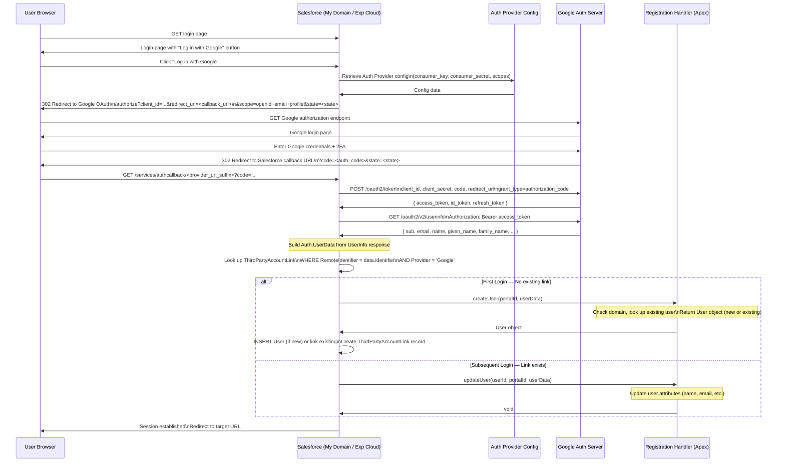

# Authentication Providers

## Exam Domain
Federation, SSO & Delegated Authentication — **22% of exam weight**

Authentication Providers (Auth Providers) are Salesforce's mechanism for connecting user login to an external OAuth/OIDC identity provider. They are the answer when a customer wants users to log in with Google, log in with Azure AD using OIDC (not SAML), or authenticate via any OAuth 2.0 compliant provider. Understanding the distinction between Auth Providers and SSO Settings, and the role of the Registration Handler Apex class, is essential for the exam and for real implementations.

---

## Foundations

### What Is an Authentication Provider?

An **Authentication Provider** (Auth Provider) is a Salesforce configuration record that defines:
1. An external OAuth 2.0 / OpenID Connect system that can authenticate users
2. The Connected App credentials (Consumer Key/Secret) that Salesforce uses to call that external system
3. A Registration Handler Apex class that Salesforce calls after successful external authentication to map the external identity to a Salesforce user

From the user's perspective: instead of entering a Salesforce username and password, the user is redirected to the external provider (Google, Facebook, Azure AD, etc.), authenticates there, and is returned to Salesforce with a session established.

### Auth Provider vs. SSO Settings — The Critical Distinction

This distinction is tested heavily on the exam. Candidates consistently confuse these two configuration areas.

| | **Single Sign-On Settings** | **Authentication Provider** |
|---|---|---|
| **Protocol** | SAML 2.0 | OAuth 2.0 / OpenID Connect |
| **What Salesforce acts as** | SAML Service Provider | OAuth Client |
| **What the external system provides** | SAML assertions | OAuth/OIDC tokens |
| **User attribute exchange** | SAML AttributeStatement | UserInfo endpoint / token claims |
| **Setup location** | Setup > Single Sign-On Settings | Setup > Auth. Providers |
| **Common providers** | ADFS, Okta (SAML), Azure AD (SAML), PingFederate | Google, Facebook, Azure AD (OIDC), Salesforce, custom OAuth |
| **Registration Handler** | No Apex required (JIT is built-in) | Apex Registration Handler **required** |
| **URL to trigger login** | My Domain SSO login URL | Auth Provider Start URL |
| **Use case** | Enterprise employee SSO | Social login, custom OAuth providers, consumer-facing communities |

**Rule of thumb:** If the external system speaks **SAML**, use **SSO Settings**. If it speaks **OAuth 2.0 / OIDC**, use **Auth Providers**.

---

## Core Concepts

### Built-In Auth Provider Types

Salesforce provides pre-built Auth Provider types that handle the OAuth flow mechanics for common providers:

| Auth Provider Type | External Provider | Pre-configured Fields |
|---|---|---|
| **Salesforce** | Another Salesforce org | Authorize endpoint, token endpoint, userinfo endpoint |
| **Facebook** | Facebook | Graph API endpoints, standard OAuth app fields |
| **Google** | Google (OIDC) | Google Authorization/Token endpoints |
| **Twitter** | Twitter | OAuth 1.0a (legacy — Twitter uses OAuth 1.0, not 2.0) |
| **LinkedIn** | LinkedIn | LinkedIn OAuth 2.0 endpoints |
| **Open ID Connect** | Any OIDC-compliant provider | Configure endpoints manually; supports discovery URL |
| **Custom** | Any OAuth 2.0 provider | Full manual configuration; Apex-based provider class |

### Creating an Auth Provider — Step by Step

**Location:** Setup > Auth. Providers > New

Required configuration:

| Field | Description |
|---|---|
| **Provider Type** | Select the built-in type or Custom |
| **Name** | Display name (shown on login page if enabled) |
| **URL Suffix** | Used in the Salesforce callback URL (e.g., `google` → callback URL ends in `/services/authcallback/google`) |
| **Consumer Key** | OAuth Client ID registered with the external provider |
| **Consumer Secret** | OAuth Client Secret from the external provider |
| **Registration Handler** | Apex class implementing `Auth.RegistrationHandler` interface |
| **Execute Registration As** | A Salesforce user whose execution context the Registration Handler runs in |
| **Default Scopes** | Space-separated OAuth scopes to request (e.g., `openid profile email`) |

After creating the Auth Provider, Salesforce displays two auto-generated URLs:
- **Test-Only Initialization URL**: For testing the Auth Provider configuration without affecting users
- **Callback URL**: The URL you must register as a redirect URI in the external provider's OAuth app settings
- **Single Sign-On Initialization URL**: The URL that triggers the SSO flow when linked from a login page
- **Existing User Linking URL**: URL to link a Salesforce user to an external account
- **OAuth-Only Initialization URL**: Obtains OAuth access token only (no Salesforce login session)

---

### The Registration Handler Apex Class

The Registration Handler is the most architecturally important aspect of Auth Providers. It is an Apex class that implements the `Auth.RegistrationHandler` interface and contains the logic for:

1. **Determining what Salesforce user to create/update** when an external authentication event occurs
2. **Handling new users** (social signup, self-registration)
3. **Handling existing users** (updating profile attributes from the external identity)
4. **Enforcing business rules** (e.g., only allow users with @company.com email)

#### Registration Handler Interface

```apex
global class MyRegistrationHandler implements Auth.RegistrationHandler {
    
    // Called when a NEW user authenticates via the Auth Provider
    // for the first time and no linked Salesforce user exists
    global User createUser(Id portalId, Auth.UserData data) {
        // data.identifier   = external provider's unique user ID
        // data.firstName    = first name from external provider
        // data.lastName     = last name
        // data.email        = email address
        // data.username     = suggested username
        // data.locale       = user's locale from external provider
        // data.provider     = name of the Auth Provider (e.g., 'Google')
        // data.siteLoginUrl = Experience Cloud site login URL (if applicable)
        // data.attributeMap = map of all additional claims from the provider
        
        // Business rule: only allow corporate email domain
        if (!data.email.endsWith('@company.com')) {
            throw new Auth.AuthProviderPluginException('Unauthorized email domain');
        }
        
        // Check if user already exists (e.g., by email) to prevent duplicates
        List<User> existingUsers = [
            SELECT Id FROM User 
            WHERE Email = :data.email 
            AND IsActive = true 
            LIMIT 1
        ];
        if (!existingUsers.isEmpty()) {
            // Link to existing user instead of creating a new one
            return existingUsers[0];
        }
        
        // Create new user
        Profile p = [SELECT Id FROM Profile WHERE Name = 'Standard User' LIMIT 1];
        User u = new User();
        u.FirstName = data.firstName;
        u.LastName = data.lastName;
        u.Email = data.email;
        u.Username = data.email + '.sfdc';  // Ensure uniqueness
        u.Alias = data.firstName.substring(0, 1) + data.lastName.substring(0, Math.min(4, data.lastName.length()));
        u.ProfileId = p.Id;
        u.EmailEncodingKey = 'UTF-8';
        u.LanguageLocaleKey = 'en_US';
        u.LocaleSidKey = data.locale != null ? data.locale : 'en_US';
        u.TimeZoneSidKey = 'America/New_York';
        return u;
    }
    
    // Called when an EXISTING linked user authenticates via the Auth Provider
    // Use this to keep Salesforce user attributes in sync with the external provider
    global void updateUser(Id userId, Id portalId, Auth.UserData data) {
        User u = new User();
        u.Id = userId;
        u.FirstName = data.firstName;
        u.LastName = data.lastName;
        u.Email = data.email;
        // Only update what you want to sync — be selective
        update u;
    }
}
```

#### Auth.UserData Properties

| Property | Type | Description |
|---|---|---|
| `identifier` | String | Unique user ID from the external provider (e.g., Google's `sub` claim) |
| `firstName` | String | First name from the provider |
| `lastName` | String | Last name from the provider |
| `email` | String | Email address |
| `fullName` | String | Display name (may differ from first+last combination) |
| `username` | String | Suggested username (Salesforce may derive this from email) |
| `locale` | String | User's locale from the provider |
| `provider` | String | Name of the Auth Provider configuration |
| `siteLoginUrl` | String | Experience Cloud site URL (null for internal org logins) |
| `attributeMap` | Map<String, String> | All additional claims/attributes from the external provider's UserInfo response |

**`attributeMap` usage:** For Google, this might contain `hd` (hosted domain), `email_verified`, `picture` (profile photo URL). For custom OIDC providers, all custom claims appear here. Access via `data.attributeMap.get('claim_name')`.

#### Registration Handler — Two Methods, Different Scenarios

| Method | When Called | Must Return |
|---|---|---|
| `createUser()` | New user — no linked Salesforce user exists for this external identity | A `User` object (either new or existing) |
| `updateUser()` | Existing linked user — previously authenticated via this provider | Nothing (void); update the user as needed |

**Important**: `createUser()` can return an **existing** User (by looking up a User by email, federation ID, etc.) to link the external identity to an existing account. You do not have to create a brand-new user.

If `createUser()` is called for an Experience Cloud (community) login, `portalId` contains the site ID, allowing handler logic to differentiate between internal org users and community users.

---

### Linked Accounts — Connecting External Identity to Salesforce User

Once an Auth Provider is configured, users can link their Salesforce account to the external identity. After linking, subsequent logins via the Auth Provider flow directly to the user's Salesforce account without creating duplicates.

**Linking Process:**
1. Admin enables the Auth Provider on the My Domain login page (or the Experience Cloud login page)
2. User first logs in via the external provider
3. Registration Handler's `createUser()` is called; if it returns an **existing** User ID, Salesforce stores the `ThirdPartyAccountLink` record linking the external `identifier` to the Salesforce user
4. On subsequent logins, Salesforce finds the `ThirdPartyAccountLink` and calls `updateUser()` instead of `createUser()`

**ThirdPartyAccountLink object:**
```
SELECT Id, UserId, Handle, Provider, RemoteIdentifier
FROM ThirdPartyAccountLink
WHERE UserId = '005xx...'
```
- `Handle` = the display identifier (often email)
- `RemoteIdentifier` = the external provider's user ID
- `Provider` = Auth Provider Developer Name

**Delinking:** Users can remove the link from their User Settings > Connected Accounts. Admins can delete ThirdPartyAccountLink records programmatically.

---

### Configuring Social Login (Google, Facebook)

#### Google Auth Provider Setup

1. **Create Google OAuth App:**
   - Go to Google Cloud Console > APIs & Services > Credentials
   - Create OAuth 2.0 Client ID (Web Application)
   - Authorized redirect URI: copy from Salesforce after creating the Auth Provider (it's the Callback URL)

2. **Create Salesforce Auth Provider:**
   - Provider Type: Google
   - Consumer Key: Client ID from Google
   - Consumer Secret: Client Secret from Google
   - Default Scopes: `openid email profile`
   - Registration Handler: your Apex class

3. **Enable on My Domain login page:**
   - Setup > My Domain > Authentication Configuration > Edit
   - Check the Google Auth Provider
   - Optionally enable "Include login hint" to pre-populate the Google login form

4. **Users see a "Log in with Google" button on the Salesforce login page**

#### Facebook Auth Provider Setup

1. **Create Facebook App:**
   - Facebook for Developers > Create App > Business
   - Add "Facebook Login" product
   - Add the Salesforce Callback URL to Valid OAuth Redirect URIs

2. **Salesforce Auth Provider:**
   - Provider Type: Facebook
   - Consumer Key: App ID
   - Consumer Secret: App Secret
   - Scopes: `email public_profile`

3. **Registration Handler:** Must map Facebook's `id` (numeric) to a Salesforce user. Facebook does not provide the email in all cases — you may need to explicitly request the `email` permission and handle users who deny email sharing.

---

### Custom OAuth 2.0 Auth Provider (Custom Type)

When the external provider is not in the built-in list, use a **Custom Auth Provider** implemented in Apex:

```apex
global class CustomOAuthProvider extends Auth.AuthProviderPluginClass {
    
    private String CLIENT_ID;
    private String CLIENT_SECRET;
    private String AUTH_URL = 'https://external-idp.company.com/oauth2/authorize';
    private String TOKEN_URL = 'https://external-idp.company.com/oauth2/token';
    private String USERINFO_URL = 'https://external-idp.company.com/oauth2/userinfo';
    
    global String getCustomMetadataType() {
        // Return the API name of Custom Metadata Type used for configuration
        return 'Custom_Auth_Provider_Settings__mdt';
    }
    
    global PageReference initiate(Map<String, String> authProviderConfig, String stateToPropagate) {
        // Build the authorization URL to redirect the user to
        String url = AUTH_URL 
            + '?response_type=code'
            + '&client_id=' + EncodingUtil.urlEncode(CLIENT_ID, 'UTF-8')
            + '&redirect_uri=' + EncodingUtil.urlEncode(authProviderConfig.get('callbackUrl'), 'UTF-8')
            + '&scope=openid+profile+email'
            + '&state=' + stateToPropagate;
        return new PageReference(url);
    }
    
    global Auth.AuthProviderTokenResponse handleCallback(
        Map<String, String> authProviderConfig, 
        Auth.AuthProviderCallbackState state
    ) {
        // Exchange authorization code for tokens
        String code = state.queryParameters.get('code');
        HttpRequest req = new HttpRequest();
        req.setEndpoint(TOKEN_URL);
        req.setMethod('POST');
        req.setHeader('Content-Type', 'application/x-www-form-urlencoded');
        req.setBody('grant_type=authorization_code'
            + '&code=' + code
            + '&client_id=' + CLIENT_ID
            + '&client_secret=' + CLIENT_SECRET
            + '&redirect_uri=' + authProviderConfig.get('callbackUrl'));
        
        Http http = new Http();
        HttpResponse res = http.send(req);
        Map<String, Object> tokenResponse = (Map<String, Object>) JSON.deserializeUntyped(res.getBody());
        
        String accessToken = (String) tokenResponse.get('access_token');
        String refreshToken = (String) tokenResponse.get('refresh_token');
        return new Auth.AuthProviderTokenResponse(
            'CustomOAuthProvider', accessToken, refreshToken, state.state
        );
    }
    
    global Auth.UserData getUserInfo(
        Map<String, String> authProviderConfig, 
        Auth.AuthProviderTokenResponse response
    ) {
        // Call UserInfo endpoint to get user details
        HttpRequest req = new HttpRequest();
        req.setEndpoint(USERINFO_URL);
        req.setMethod('GET');
        req.setHeader('Authorization', 'Bearer ' + response.oauthToken);
        
        Http http = new Http();
        HttpResponse res = http.send(req);
        Map<String, Object> userInfo = (Map<String, Object>) JSON.deserializeUntyped(res.getBody());
        
        return new Auth.UserData(
            (String) userInfo.get('sub'),        // identifier
            (String) userInfo.get('given_name'), // firstName  
            (String) userInfo.get('family_name'),// lastName
            (String) userInfo.get('name'),       // fullName
            (String) userInfo.get('email'),      // email
            null,                                // link
            (String) userInfo.get('email'),      // username (use email as username hint)
            (String) userInfo.get('locale'),     // locale
            'CustomOAuthProvider',               // provider
            null,                                // siteLoginUrl
            userInfo                             // attributeMap
        );
    }
    
    global Object refreshToken(Map<String, String> authProviderConfig, String refreshToken) {
        // Implement refresh token exchange if needed
        return null;
    }
}
```

---

### Auth Provider for Named Credentials (Outbound OAuth)

Auth Providers are also used in a different context: configuring **Named Credentials** for outbound OAuth calls from Salesforce to an external system.

In this case:
- Salesforce acts as the OAuth **client**
- The external system is the OAuth **resource server**
- The Named Credential uses the Auth Provider for token management

This means Auth Providers serve TWO purposes:
1. **Inbound authentication**: Users log into Salesforce via external provider
2. **Outbound authorization**: Salesforce calls external APIs using OAuth tokens

For exam questions, identify the context. If the question is about users logging in, it's Registration Handler + login flow. If the question is about Salesforce calling an external API, it's Named Credentials + Auth Provider (outbound).

---

### "Execute Registration As" User

The Registration Handler Apex runs in the execution context of the **Execute Registration As** user. This user:
- Must have the necessary permissions to create/update User records
- Should have Manage Users permission (or at minimum the ability to create users in the target profile)
- Should NOT be a System Administrator for security reasons
- Should be a dedicated API/automation user

If the Execute Registration As user lacks permission to create users with a particular Profile, the registration will fail with a FIELD_INTEGRITY_EXCEPTION.

---

## PTA / SA Relevance

### When This Comes Up in Engagements

**Community / Experience Cloud with Social Login**
Customer wants their B2C community to support "Log in with Google" and "Log in with Facebook." This is Auth Providers. You need: OAuth apps at each provider, a single Registration Handler that handles multiple providers (check `data.provider`), and the Auth Provider enabled on the Experience Cloud login page.

**Azure AD OIDC (vs. SAML)**
Some customers prefer Azure AD via OIDC instead of SAML. Auth Provider (type: Open ID Connect) handles this. The distinction: SAML → SSO Settings; OIDC → Auth Provider. Both ultimately log the user in, but the underlying protocol and configuration are different.

**Linked Accounts — Preventing Duplicate User Creation**
A common registration handler error: every time a user logs in via Google, a new Salesforce user is created. Root cause: the handler's `createUser()` method doesn't check for existing users with the same email. Fix: always query for an existing user by email (or Federation ID) in `createUser()` before creating a new record.

**Testing Auth Providers**
Use the **Test-Only Initialization URL** to test the Auth Provider flow in a browser without affecting production users. This URL is shown in the Auth Provider detail page in Setup. It logs you in but flags the session as test-only and does not create permanent `ThirdPartyAccountLink` records.

### Common Architecture Failures

**Failure 1: No Domain Validation in Registration Handler**
The handler creates a Salesforce user for any Google account that authenticates. A person with a personal Gmail account can self-register. Fix: validate `data.email` domain or `data.attributeMap.get('hd')` (Google's hosted domain claim) in `createUser()`.

**Failure 2: Registration Handler Runs as System Administrator**
The Execute Registration As user is the System Administrator. The handler creates users with broad permissions. A security audit flags this. Fix: create a dedicated user with Manage Users permission and minimum other permissions. Set this user as the Execute Registration As user.

**Failure 3: Null Pointer in attributeMap**
The handler references `data.attributeMap.get('custom_claim')` without null-checking. When the provider doesn't return that claim, the map value is null and downstream logic throws a NullPointerException, blocking all logins. Fix: always null-check attributeMap values.

**Failure 4: Callback URL Mismatch**
The Auth Provider's Callback URL in Salesforce (auto-generated) is not registered in the external provider's OAuth app. Salesforce sends this URL as `redirect_uri`; the external provider rejects it. Fix: copy the Callback URL from the Auth Provider detail page and register it exactly in the external provider app settings.

### Enterprise Patterns

**Pattern: Multi-Provider Registration Handler**
One Apex class handles multiple Auth Providers (Google, LinkedIn, internal SSO) by switching on `data.provider`:
```apex
global User createUser(Id portalId, Auth.UserData data) {
    if (data.provider == 'Google') {
        return handleGoogleUser(data);
    } else if (data.provider == 'LinkedIn') {
        return handleLinkedInUser(data);
    } else {
        return handleDefaultUser(data);
    }
}
```

**Pattern: JIT-Like Attribute Sync via updateUser()**
`updateUser()` is called on every subsequent login. Use it to sync attributes from the external provider to Salesforce (title, department, phone from the OIDC UserInfo endpoint). This mirrors JIT behavior for SAML but for OAuth-based Auth Providers.

**Pattern: Auth Provider for Experience Cloud B2B Self-Registration**
External partners register via LinkedIn OAuth. Registration Handler checks the LinkedIn company claim (`data.attributeMap.get('company')`), looks up the corresponding Salesforce Account, creates a Partner Community User linked to a Contact under that Account. One handler manages the entire self-registration + account linking flow.

---

## Architecture

### Auth Provider Login Flow — Social SSO



**Limitations & Tradeoffs:**

| Aspect | Detail |
|---|---|
| Apex DML in createUser | The Registration Handler is called in a system context; DML limits apply. Creating users with complex related records (Contact, Account for communities) can hit DML row limits if not carefully designed. |
| External callouts in handler | The handler can make HTTP callouts (to look up external data), but this extends the login latency. Complex callout chains can cause login timeouts. |
| Provider outages | If the external provider (Google, Facebook) is down, users cannot log in. Auth Provider logins have no fallback unless users also have a Salesforce username+password configured. |
| Social provider API changes | Provider APIs change. Google deprecated certain UserInfo fields; Facebook restricts permissions after policy changes. Registration handlers must be maintained as provider APIs evolve. |
| Self-registration control | Without domain validation, ANY external account can trigger user creation. Registration Handlers MUST implement business rules — Salesforce doesn't add them automatically. |

---

## Key Facts to Memorize

1. **Auth Providers = OAuth 2.0 / OIDC external identity; SSO Settings = SAML external identity**
2. **Registration Handler Apex class: two methods — `createUser()` for new users, `updateUser()` for returning users**
3. **`createUser()` can return an EXISTING user to link (not just create a new one)**
4. **Auth.UserData.identifier = external provider's unique user ID (like Google's `sub`)**
5. **Auth.UserData.attributeMap = Map of all claims from the provider's UserInfo endpoint**
6. **Execute Registration As user must have Manage Users permission**
7. **Callback URL: auto-generated by Salesforce; MUST be registered in the external provider's OAuth app**
8. **ThirdPartyAccountLink: the Salesforce object that records the link between external identity and Salesforce user**
9. **Test-Only Initialization URL: tests the Auth Provider flow without creating permanent links**
10. **Auth Providers also power Named Credentials for outbound OAuth calls from Salesforce**
11. **Auth Providers are used for Experience Cloud social login — enabled on the Experience Cloud login page, not just My Domain**
12. **URL Suffix determines the Callback URL path: `/services/authcallback/<URL_Suffix>`**
13. **Default Scopes: space-separated; `openid email profile` for OIDC providers**
14. **Custom Auth Provider type extends `Auth.AuthProviderPluginClass`; implements `initiate()`, `handleCallback()`, `getUserInfo()`**
15. **"Single Sign-On Initialization URL" triggers the Auth Provider login; configured on the login page**

---

## Exam Traps

**Trap 1: Auth Providers use SAML protocol**
> Auth Providers are OAuth 2.0 / OpenID Connect only. SAML integrations use Single Sign-On Settings. This confusion appears in almost every practice exam. If the question mentions "OAuth tokens" or "OIDC" for user login, think Auth Provider. If it mentions "SAML assertion," think SSO Settings.

**Trap 2: Registration Handler is optional for Auth Providers**
> The Registration Handler is MANDATORY for Auth Providers. Salesforce will not complete the login flow without a Registration Handler Apex class. You cannot configure an Auth Provider without specifying one (or using a system-generated default which you must explicitly select/create).

**Trap 3: `createUser()` always creates a new user**
> `createUser()` can return an existing User record. This is how you link an external identity to a pre-existing Salesforce user (e.g., an employee who already has a Salesforce account and now wants to link their Google account). Return the existing User object; Salesforce creates the ThirdPartyAccountLink.

**Trap 4: JIT provisioning and Auth Providers are the same mechanism**
> JIT provisioning is the SAML mechanism for auto-creating users from assertion attributes. Auth Provider Registration Handlers are the OAuth equivalent. They achieve the same outcome (creating users at login time) but via different paths. JIT is configured in SSO Settings; Registration Handler is Apex code.

**Trap 5: The Callback URL for Auth Providers should be customized**
> The Callback URL is system-generated and follows a fixed format: `https://[domain]/services/authcallback/[URL_Suffix]`. Do not change this. What you MUST do is register this exact URL in the external OAuth provider's app configuration. The common mistake is editing the Salesforce side — you shouldn't; configure the external side.

**Trap 6: Auth Providers for Named Credentials = login flow**
> When Auth Providers are used with Named Credentials for outbound callouts, there is NO user login flow. The Named Credential uses the Auth Provider's OAuth configuration to manage tokens for server-to-server calls. This is distinct from the inbound login use case.

---

## Practice Questions

**Question 1**

A company wants to allow Experience Cloud community users to register and log in using their Google accounts. After authentication, Salesforce should create a community user linked to the appropriate Account. Which Salesforce feature enables this capability?

A. Single Sign-On Settings with Google as the Identity Provider  
B. Authentication Provider with a custom Registration Handler Apex class  
C. Connected App with Authorization Code + PKCE grant type  
D. Delegated Authentication with Google Workspace as the backend  

**Answer: B**

*Explanation:* Authentication Providers handle OAuth 2.0 / OIDC external login. Google uses OAuth/OIDC, so an Auth Provider (not SSO Settings, which are for SAML) is correct. The Registration Handler Apex class handles the user creation logic — looking up the Account and creating the community user linked to it. A (SSO Settings) is for SAML, not OAuth. C (Connected App) is for Salesforce acting as an OAuth server to external apps, not for users logging into Salesforce via Google. D (Delegated Authentication) is a mechanism where Salesforce calls a customer-hosted web service to validate credentials — not a Google integration pattern.

---

**Question 2**

A developer implements a Registration Handler for a Google Auth Provider. During testing, every time a user logs in with Google for the second time, a new Salesforce user is created instead of linking to the existing account. What is the most likely cause?

A. The `updateUser()` method is not implemented in the Registration Handler  
B. The `createUser()` method is not querying for an existing user before creating a new one — returning a new User object every time instead of checking for a ThirdPartyAccountLink  
C. The ThirdPartyAccountLink records are being deleted after each login  
D. The Auth Provider's URL Suffix has been changed, breaking the callback URL  

**Answer: B**

*Explanation:* The `updateUser()` method is called only when a ThirdPartyAccountLink already exists for the user. If `createUser()` always creates a new User without checking for existing accounts, each login triggers `createUser()` again (because no link was stored from the first "create"). The fix: in `createUser()`, first query User records by email (or other unique identifier). If found, return the existing User — Salesforce will create the link. Only create a new User if no existing record is found. A is wrong because `updateUser()` is only called after a link exists. C is possible but not the "most likely" cause. D would break the entire callback flow, not cause duplicates.

---

**Question 3**

An Auth Provider for an OIDC-compliant partner identity provider has been configured. Users can log in successfully. The Registration Handler needs to read the `department` claim from the OIDC token to set the user's Department field. How is this claim accessed?

A. `data.department` — UserData has a built-in property for all OIDC claims  
B. `data.attributeMap.get('department')` — additional claims are in the attributeMap  
C. Make a separate API call from the Registration Handler to the partner IdP's SCIM endpoint  
D. Configure a custom field mapping in the Auth Provider settings to map `department` to `User.Department`  

**Answer: B**

*Explanation:* The `Auth.UserData` object has a fixed set of standard properties (identifier, firstName, lastName, email, etc.) and an `attributeMap` (Map<String,String>) that contains all additional claims from the provider's UserInfo response. Custom claims like `department` are accessed via `data.attributeMap.get('department')`. Always null-check before using: `String dept = data.attributeMap?.get('department');`. A is wrong — `Auth.UserData` does not have dynamic properties for arbitrary claims. C is unnecessary complexity. D is not a feature of Auth Provider configuration — custom claim mapping is done in the Registration Handler Apex code.

---

**Question 4**

A Salesforce administrator is configuring an Auth Provider. After creating the Auth Provider configuration in Setup, what must be done in the external OAuth provider's application settings before users can log in?

A. Upload the Salesforce Auth Provider's SAML certificate to the external provider  
B. Register the Salesforce-generated Callback URL as an authorized redirect URI in the external OAuth app  
C. Configure the external provider's SCIM endpoint in Salesforce Identity Provider settings  
D. Set the Auth Provider's Consumer Key to match the Salesforce org's Entity ID  

**Answer: B**

*Explanation:* After creating an Auth Provider in Salesforce, the system auto-generates a Callback URL (format: `https://[domain]/services/authcallback/[URL_Suffix]`). This URL must be registered as an authorized redirect URI in the external provider's OAuth app settings (Google Cloud Console, Facebook Developer portal, Azure App Registration, etc.). Without this, the external provider will reject Salesforce's authorization request with "redirect_uri_mismatch." A is wrong — Auth Providers use OAuth, not SAML certificates. C is for SCIM provisioning, not Auth Provider setup. D is incorrect — the Consumer Key is a value obtained FROM the external provider, not something set to match Salesforce's entityID.

---

**Question 5**

A company uses an Auth Provider configured with "Execute Registration As" set to a dedicated automation user. During testing, the Registration Handler fails with INSUFFICIENT_ACCESS_ON_CROSS_REFERENCE_ENTITY when trying to create a new user with a specific Profile. What is the most likely cause?

A. The Registration Handler code has a syntax error that prevents Profile lookup  
B. The Execute Registration As user does not have permission to assign the target Profile to new users  
C. The target Profile is not visible in the Auth Provider configuration  
D. Custom Profiles cannot be used with Auth Provider-created users  

**Answer: B**

*Explanation:* When the Registration Handler creates a User record, it runs in the context of the "Execute Registration As" user. If this automation user's Profile does not include "Manage Users" permission, or if the Profile being assigned to the new user is restricted (e.g., the automation user cannot assign admin profiles to others), Salesforce throws an access exception. The fix: ensure the Execute Registration As user has the Manage Users system permission, and verify they have access to assign the target Profile. A is a code issue, not an access issue. C is not a real constraint. D is false — custom Profiles work with Auth Provider users.
