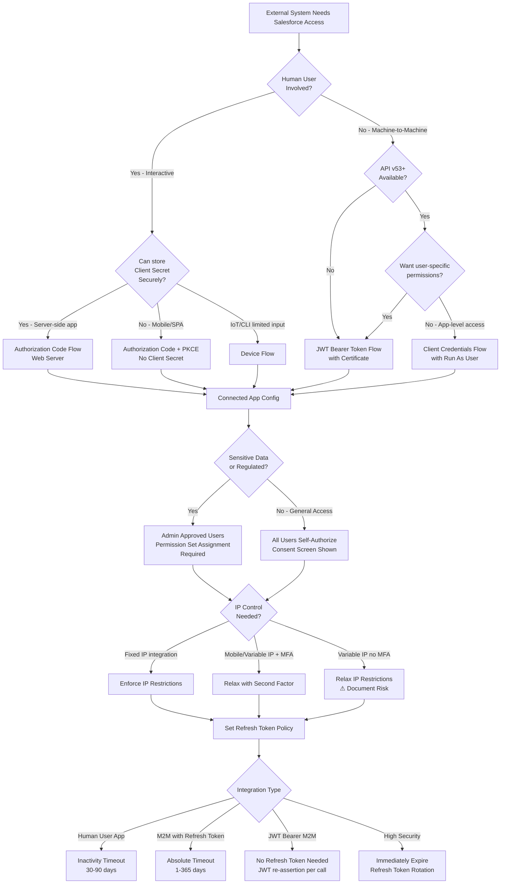
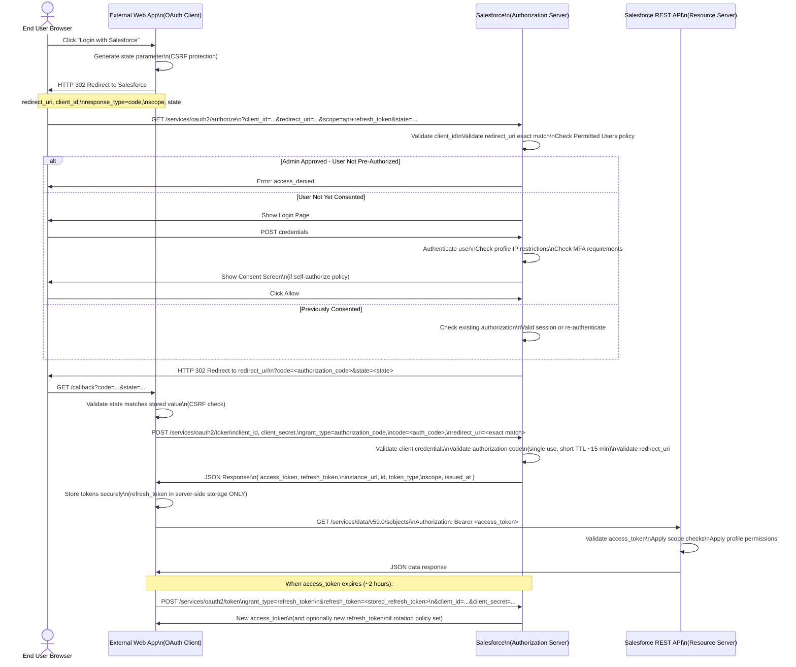
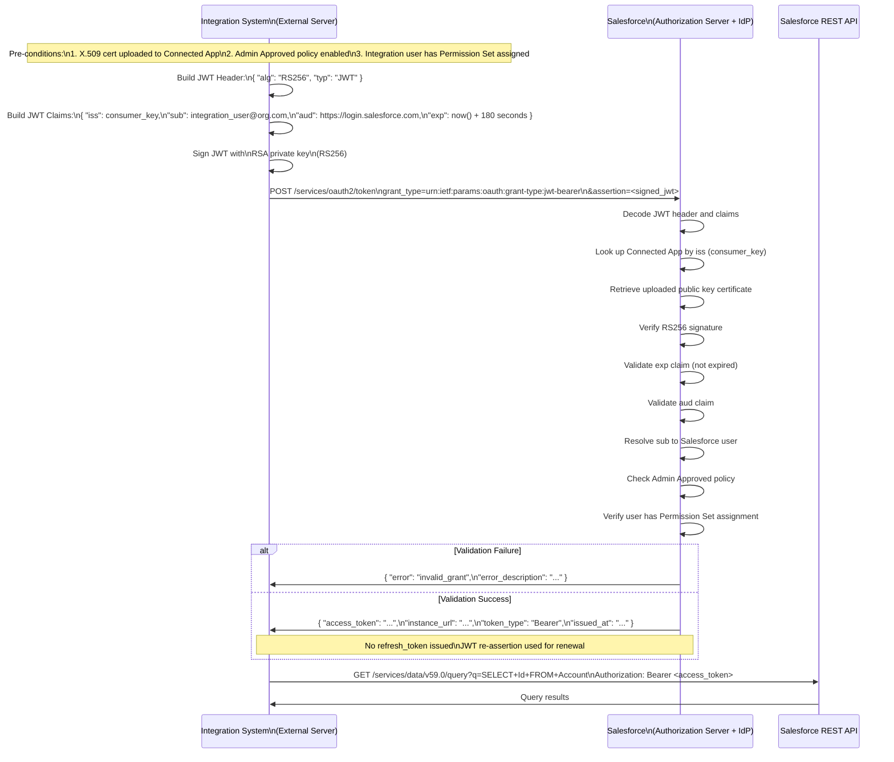

# Connected Apps & OAuth Policies

## Exam Domain
Salesforce Identity — 25% of exam weight

---

## Foundations

### What Is a Connected App?

A **Connected App** is a framework that enables an external application to integrate with Salesforce using open standards — OAuth 2.0, OpenID Connect, and SAML 2.0. It is the trust anchor between Salesforce acting as an Authorization Server (and Identity Provider) and any external consumer of Salesforce APIs or identity assertions.

Every time an external system needs to access Salesforce data or authenticate users through Salesforce, a Connected App is the registered OAuth client or SAML Service Provider that defines *how* that access is allowed, *who* can authorize it, and *what* policies govern the tokens and sessions that result.

Connected Apps are the policy enforcement point: they do not open access — they define constraints on access that already exists through profiles and permission sets.

### Why Connected Apps Exist

Before Connected Apps, Salesforce API access relied on username/password authentication in every API call. Connected Apps replaced this with:

- **OAuth 2.0 token-based access** — credentials are exchanged once; subsequent calls use short-lived access tokens and long-lived refresh tokens
- **Delegated authorization** — users grant specific scopes of access without sharing passwords
- **Centralized policy control** — Administrators control timeout, IP restrictions, and user eligibility from a single configuration object
- **Audit and revocation** — Administrators can see which users have authorized a Connected App and revoke individual or all tokens

### Connected App Use Cases

**Mobile Applications (Native Apps)**
A native iOS or Android app that calls the Salesforce REST API uses OAuth 2.0 User-Agent Flow (Implicit) or, preferably for security, the Authorization Code + PKCE Flow. The Connected App defines the allowed callback URL (custom URL scheme like `myapp://callback`), permitted OAuth scopes, and token lifetime.

**Web Applications (Web Server Apps)**
A customer portal, a middleware layer like MuleSoft, or a third-party SaaS product uses the Authorization Code (Web Server) Flow. The Connected App stores a Consumer Key and Consumer Secret that the server uses in the token exchange step. Callback URLs are HTTPS URLs on the external server.

**API Integrations (Server-to-Server / Machine-to-Machine)**
Batch jobs, ETL processes, and integration platforms that run without user interaction use either the OAuth 2.0 Username-Password Flow (legacy, avoid in production) or the **JWT Bearer Token Flow** (preferred for M2M). The Connected App holds or references an X.509 certificate. There is no interactive login prompt — the integration authenticates via a signed assertion.

**Device Flow**
IoT devices or command-line tools with limited input capability use the OAuth 2.0 Device Authentication Flow. The device gets a device code and user code; the user visits a separate browser to authorize; the device polls for the token.

**Single Sign-On (SAML Service Provider)**
When Salesforce is the IdP and an external application is the SP, the Connected App defines the SAML SP metadata: Entity ID, ACS URL, certificate for assertion encryption, and attribute mapping.

**Canvas Apps**
An older Salesforce integration pattern that renders an external web application inside Salesforce UI using a signed request mechanism. Canvas apps are configured as Connected Apps with the Canvas App Settings section enabled.

---

## Core Concepts

### Creating a Connected App

**Location:** Setup > App Manager > New Connected App (Lightning) or Setup > Create > Apps > Connected Apps (Classic)

#### Required Fields

| Field | Purpose | Architect Notes |
|---|---|---|
| Connected App Name | Display name, shown in authorization dialogs | Choose descriptively — this is what users see when prompted to authorize |
| API Name | Unique developer name, used in Apex and metadata | Cannot change after creation without consequences to dependent automation |
| Contact Email | Used for AppExchange review and admin notifications | Must be a monitored address for ISV apps |
| Enable OAuth Settings | Toggle to expose OAuth 2.0 configuration | Without this, the app is only SAML or Canvas |
| Callback URL | One or more redirect_uri values | Line-separated list; ALL production and sandbox/scratch org values must be listed |
| Selected OAuth Scopes | The scopes this app may request | Principle of least privilege — only select what the app actually needs |

#### Callback URL Depth

The callback URL is the `redirect_uri` parameter in OAuth flows. Salesforce validates the value passed at runtime against this list using **exact string match** — there is no wildcard support in standard Salesforce. This means:

- `https://app.example.com/callback` is different from `https://app.example.com/callback/`
- Production org URLs and sandbox org URLs must both be listed if the same Connected App record is used across environments
- Custom domain URLs (My Domain) may differ from standard `*.salesforce.com` URLs
- For mobile apps, use a custom URL scheme: `com.example.myapp://oauth/callback`

If the `redirect_uri` at runtime does not match any listed value, Salesforce returns `error=redirect_uri_mismatch` and the flow fails.

---

### OAuth Scopes in Salesforce

OAuth scopes define what data and capabilities the access token grants. Selecting a scope in the Connected App does not grant it automatically — users (and admins for admin-approved apps) must consent.

#### Full Scope Reference

| Scope Label (UI) | Scope String (API) | What It Grants |
|---|---|---|
| Access and manage your data (api) | `api` | Access REST API, SOAP API, Bulk API, Metadata API — the core data access scope |
| Access and manage your Chatter data (chatter_api) | `chatter_api` | Chatter REST API only, not full data access |
| Perform requests at any time (refresh_token, offline_access) | `refresh_token` | Allows issuance of a refresh token; required for any app that needs persistent access without re-authentication |
| Access your basic information (openid, profile) | `openid` | OpenID Connect — required for identity tokens (id_token); adds subject, name, preferred_username, locale, timezone, updated_at |
| Access your unique user identifier (openid) | `openid` | Minimum OpenID scope, just the subject claim |
| Access your email address (email) | `email` | Adds email and email_verified to the UserInfo response and id_token |
| Access your address (address) | `address` | Adds formatted address to the UserInfo response |
| Access your phone number (phone) | `phone` | Adds phone_number and phone_number_verified |
| Provide access to your data via the Web (web) | `web` | Enables web-based SSO; allows using access_token as session cookie — used by Visualforce and Lightning Experience SSO flows |
| Manage user data via APIs (api) + Allow access to custom permissions (custom_permissions) | `custom_permissions` | Includes custom permission membership in the UserInfo response and token introspection |
| Access unique user identifiers (openid) | `openid` | As above |
| Full access (full) | `full` | Grants all permissions the user has; does NOT grant more than the user's profile/permissions allow; equivalent to a logged-in session |
| Perform ANSI SQL queries on Einstein Analytics Data (wave_api) | `wave_api` | Einstein Analytics / Tableau CRM API access |
| Access the Pardot API (pardot_api) | `pardot_api` | Pardot / Account Engagement API; requires Pardot-specific setup |
| Access the Salesforce Einstein Platform (einstein_analytics) | `einstein_analytics` | Alternative label for Tableau CRM scopes in some API versions |
| Access Visualforce applications (visualforce) | `visualforce` | Specific scope for Visualforce page access via SSO |
| Access content resources (content) | `content` | Salesforce Files / Content Library API |
| Access Lightning Platform Apex REST web services (api) | `api` | Apex REST is covered by the standard `api` scope |
| Perform requests on your behalf at any time (refresh_token, offline_access) | `offline_access` | OIDC-standard alternative name for `refresh_token`; functionally identical in Salesforce |

#### Scope Selection Strategy for Architects

- **Minimum viable scopes**: Only request `api` if you need data; only add `refresh_token` if the integration runs unattended
- **OpenID Connect apps**: Must include `openid`; add `profile` and `email` only if the app uses those claims
- **Avoid `full`**: It appears unrestricted, but it creates implicit dependency on the authorizing user's current permissions. If the user's access changes, token behavior changes unpredictably
- **`refresh_token` is the highest-risk scope**: It enables long-lived access. Combine with tight refresh token timeout policies

---

### OAuth Policies Tab

The OAuth Policies section is where security behavior is defined. This tab controls four major dimensions.

#### 1. Permitted Users

This is the most architecturally significant policy.

**All users may self-authorize**
- Any user in the org (subject to profile API access) can authorize the app
- The user sees a consent screen the first time they use the app
- Suitable for enterprise apps deployed to all employees
- Risk: any user with API access can grant the app their full API scope without admin knowledge

**Admin approved users are pre-authorized**
- The app is not accessible to any user until an admin explicitly assigns it
- Assignment is done via **Permission Sets**: navigate to Setup > Permission Sets > [Permission Set] > Assigned Connected Apps, or navigate to Setup > Connected Apps > Manage > Edit Policies > Manage Permission Sets
- The Permission Set itself must be assigned to users via Permission Set Assignment or Permission Set Group
- This is the recommended posture for sensitive integrations, ISV apps, and any M2M integration

**Architectural Rule**: If the integration is machine-to-machine (JWT Bearer, Client Credentials), always use Admin Approved. There are no human users to consent — the admin is pre-authorizing on behalf of the org.

#### 2. IP Relaxation

Controls whether the Connected App enforces org-level IP restrictions (Login IP Ranges on the Profile) and whether it applies its own IP checks.

| Setting | Behavior |
|---|---|
| Enforce IP restrictions | Token requests and API calls through this app must come from IPs within the user's Profile Login IP Ranges |
| Relax IP restrictions with second factor | IP restriction is bypassed IF the user has completed MFA. Used for mobile users on variable IPs |
| Relax IP restrictions | IP restrictions are completely bypassed for this app. Any IP can use the token. Only appropriate for scenarios where the calling IP is genuinely variable and cannot be predicted |

**Critical distinction**: Connected App IP Relaxation applies to token-based (OAuth) access. Org-level IP restrictions on the Profile apply to browser-based (session) logins. A user who cannot log in from a restricted IP via browser CAN potentially authorize an OAuth app and call APIs if Relax IP restrictions is set — unless Enforce IP Restrictions is chosen.

#### 3. Refresh Token Policy

Controls how long refresh tokens remain valid.

| Policy | Description |
|---|---|
| Refresh token is valid until revoked | Infinite lifetime — the token never expires unless explicitly revoked |
| Immediately expire refresh token | The refresh token is single-use only; after use, a new refresh token is issued (rotation). This limits the window of exposure if a refresh token is stolen |
| Expire refresh token if not used for [N] days | Inactivity timeout — token is invalidated if not used within N days |
| Expire refresh token after [N] days | Absolute timeout — token expires N days after issuance regardless of usage |

**Architect Recommendation**:
- For user-facing apps with human interaction: "Expire if not used for 30-90 days" balances security with user experience
- For M2M integrations: Use JWT Bearer (which does not use refresh tokens) or set an appropriate absolute timeout and build in token refresh logic
- Production ISV apps submitted to AppExchange: Security Review requires that infinite lifetime NOT be used unless there is a documented business justification

#### 4. Session Policy (Related)

The Session Policy section (visible when clicking Manage on a Connected App) controls:
- **Session Timeout**: How long an access token-derived session remains active
- **High Assurance**: Require MFA/step-up before access

---

### Admin-Approved Connected Apps: Deep Dive

When **Admin approved users are pre-authorized** is selected, the access model changes fundamentally:

1. No consent screen is shown to the user — consent is given by the administrator
2. The user must have the Connected App assigned via a Permission Set
3. Attempting to authorize without the Permission Set assignment returns `error=access_denied`

**Assignment Path:**
```
Setup > Permission Sets > [Target PS] > Assigned Connected Apps > Edit > Move app to Enabled > Save
Setup > Users > [User] > Permission Set Assignments > Add [Target PS]
```

**Why This Matters for M2M:**
The JWT Bearer flow pre-authorizes on behalf of a user. The "user" in that case is often a dedicated integration user (a technical account). For Admin Approved apps, that integration user must have the Connected App's Permission Set assigned. Without this, even a perfectly constructed JWT assertion will be rejected.

**AppExchange Consideration:**
ISV apps installed via AppExchange can set a post-install script that automatically creates a Permission Set and assigns the Connected App. However, the end-customer admin still needs to assign the Permission Set to users. ISV documentation must clearly explain this.

---

### "Run As" User

The **Run As User** concept applies specifically to the **OAuth 2.0 Client Credentials Flow** (also called the two-legged flow, available since API v53.0).

In Client Credentials Flow:
- There is no user context — the app authenticates with Consumer Key and Consumer Secret only
- Salesforce needs a user identity to apply permissions, generate tokens with appropriate data access, and log activity
- The **Run As User** is the Salesforce user account whose permissions are used for token generation and API calls

**Run As User Requirements:**
- Must be an active Salesforce user
- Should be a dedicated integration user, not a named human user
- Must be assigned API Enabled permission
- The Connected App must have Admin Approved policy enabled and the Run As User must be assigned

**Security Implication**: The Run As User's profile and permission sets define what data the client credentials flow token can access. Architects should provision a minimally-scoped integration user profile and never use a System Administrator as the Run As User.

---

### Connected App Certificates

#### Use Cases for Certificates

1. **JWT Bearer Token Flow**: The external app signs a JWT with its private key. Salesforce verifies the signature using the corresponding public key certificate uploaded to the Connected App.
2. **Mutual TLS (mTLS)**: Certificate-bound tokens; the client presents a certificate during the TLS handshake, and Salesforce binds the token to that certificate fingerprint.
3. **SAML Signed Assertions**: When the Connected App is used as a SAML SP, certificates are used for assertion signing and encryption.

#### Certificate Configuration in Connected App

Navigate to: Setup > Connected Apps > [App Name] > Edit > OAuth Settings > **Use Digital Signatures**

Steps:
1. Generate an RSA key pair (2048-bit minimum; 4096-bit recommended for long-lived integrations)
2. Create a self-signed certificate or obtain one from a CA
3. Export the public key as a `.crt` or `.pem` file
4. Upload the certificate to the Connected App under "Use Digital Signatures"

For Salesforce-generated certificates: Setup > Certificate and Key Management > Create Self-Signed Certificate. This creates the cert and private key inside Salesforce, which can then be referenced by Connected Apps for outbound calls or used in named credentials.

#### Self-Signed vs. CA-Signed

| Type | When to Use | Risk |
|---|---|---|
| Self-Signed | Internal integrations, development, cost-sensitive scenarios | No chain of trust validation; expiry management is manual |
| CA-Signed | Production integrations, ISV apps, regulated industries | Cost and renewal overhead; provides chain of trust |

**Expiry Management**: JWT Bearer flows fail immediately when the certificate expires. This is a common production incident. Implement certificate expiry monitoring (certificate expires, then JWT assertion signing fails, then all API calls from the integration break simultaneously).

---

### Consumer Key and Consumer Secret

When a Connected App is created with OAuth enabled, Salesforce generates:

- **Consumer Key** (also called `client_id` in OAuth 2.0 terminology): A public identifier for the app. Safe to embed in client-side code for Authorization Code + PKCE flows. NOT a secret.
- **Consumer Secret** (also called `client_secret`): A shared secret. Must be protected. Used in Authorization Code flow token exchanges on the server side.

#### Security Implications

**Consumer Key (client_id)**:
- Can be embedded in mobile app binaries, JavaScript, and client-side code
- If someone obtains the Consumer Key, they can initiate authorization flows, but they cannot complete them without the user's credentials (for Authorization Code) or the private key (for JWT Bearer)

**Consumer Secret (client_secret)**:
- Must NEVER be embedded in mobile app binaries, JavaScript, or any client-side code
- Must NEVER be committed to version control
- Should be stored in secure credential stores (AWS Secrets Manager, HashiCorp Vault, Salesforce Named Credentials, etc.)
- If exposed: rotate immediately

#### Rotation Process

1. Navigate to Connected App > Manage > Click **Reset Consumer Secret** (or Generate Consumer Secret)
2. The old secret is immediately invalidated
3. All integrations using the old secret will fail immediately
4. Update all integration configurations with the new secret before or simultaneously with rotation
5. Coordinate rotation with integration owners — there is no grace period

**Architect Advice**: Build secret rotation into your integration deployment pipeline. Never allow Consumer Secrets to persist in plain text in any system configuration file. Treat it with the same security posture as a database password or API key.

---

### Managing OAuth Tokens

#### Setup > Connected Apps OAuth Usage

Navigate: Setup > Connected Apps OAuth Usage

This page shows all Connected Apps in the org and the count of users who have authorized each app. It provides a high-level inventory of OAuth grants.

Actions available:
- **Block**: Immediately revoke all active tokens for this app and prevent new authorizations
- **Unblock**: Re-enable authorizations

#### Setup > Manage Connected Apps

Navigate: Setup > Manage Connected Apps > [App] > OAuth Usage

This provides user-level granularity:
- Which specific users have authorized the app
- When the token was issued
- Actions: Revoke individual user tokens

#### Revoking Access

**Individual User Token Revocation:**
- Setup > Manage Connected Apps > [App] > OAuth Usage > Revoke (next to user)
- Via API: `POST /services/oauth2/revoke` with `token=<access_token_or_refresh_token>`
- Via user self-service: User Profile > Connected Apps (if enabled) > Revoke

**Bulk/All Tokens for an App:**
- Setup > Connected Apps OAuth Usage > Block (revokes all and prevents new)

**API Token Revocation Endpoint:**
```
POST https://login.salesforce.com/services/oauth2/revoke
Content-Type: application/x-www-form-urlencoded

token=<access_token_or_refresh_token>
```
The revocation endpoint accepts both access tokens and refresh tokens. Revoking a refresh token also invalidates all access tokens derived from it.

---

### OAuth Token Introspection

Salesforce implements the OAuth 2.0 Token Introspection endpoint as defined in RFC 7662.

**Endpoint:**
```
POST https://[instance].salesforce.com/services/oauth2/introspect
```

**Request (form-encoded):**
```
token=<access_token_or_refresh_token>
token_type_hint=access_token
client_id=<consumer_key>
client_secret=<consumer_secret>
```

**Response (active token):**
```json
{
  "active": true,
  "scope": "api refresh_token",
  "client_id": "3MVG9...",
  "username": "user@example.com",
  "sub": "https://login.salesforce.com/id/00Dxx.../005xx...",
  "token_type": "access_token",
  "exp": 1693000000,
  "iat": 1692996400,
  "nbf": 1692996400
}
```

**Response (inactive/expired token):**
```json
{
  "active": false
}
```

**Use Cases for Introspection:**
- Resource servers (APIs built on Heroku or external platforms) that receive Salesforce-issued tokens need to validate them without maintaining local session state
- Audit tooling that needs to determine token metadata
- Zero-trust architectures where token validity must be confirmed on every request

**Introspection Authentication:**
The introspecting client must authenticate with `client_id` and `client_secret` (or a valid access token). Anonymous introspection is not permitted.

---

### Canvas Apps and Connected Apps

Canvas is a Salesforce mechanism for surfacing external web applications inside Salesforce UI (Visualforce pages, Lightning components, the Chatter feed, the App Launcher).

**How Canvas Uses Connected Apps:**
1. A Connected App is created with Canvas App Settings enabled
2. The Canvas app is exposed via Salesforce-signed request or OAuth
3. When a user views the Canvas component, Salesforce sends a signed POST request to the Canvas URL containing a signed request payload
4. The external application verifies the signature using the Consumer Secret and extracts the user context and OAuth access token from the payload

**Signed Request Flow:**
```
User views Salesforce page containing Canvas app
  -> Salesforce generates signed request: base64(HMAC-SHA256(ConsumerSecret, body)) + "." + base64(JSON_payload)
  -> POST sent to Canvas URL
  -> Canvas app verifies signature using Consumer Secret
  -> Canvas app uses embedded OAuth token to call Salesforce APIs
```

**Canvas Access Methods:**
- **Signed Request (POST)**: Salesforce initiates; external app gets token as part of the signed request
- **OAuth**: Standard OAuth flow; user is redirected through OAuth before Canvas renders

**Canvas Placement Options:** Chatter Feed, Chatter Tab, App Launcher, Visualforce Page, Lightning Component, Mobile (Salesforce app), Open CTI

---

### Connected App as OAuth Client in M2M Scenarios

Machine-to-machine (M2M) integrations are the most common enterprise pattern for Salesforce Connected Apps. The two primary flows are:

#### JWT Bearer Token Flow (Preferred for M2M)

The external system authenticates by creating a signed JWT assertion. No user interaction required.

**JWT Structure:**
```json
Header: { "alg": "RS256", "typ": "JWT" }

Payload:
{
  "iss": "<Consumer Key>",
  "sub": "<Salesforce username of the user to impersonate>",
  "aud": "https://login.salesforce.com",
  "exp": <unix timestamp, max 3 minutes from now>
}

Signature: RS256(private_key, base64(header) + "." + base64(payload))
```

**Token Request:**
```
POST https://login.salesforce.com/services/oauth2/token
Content-Type: application/x-www-form-urlencoded

grant_type=urn:ietf:params:oauth:grant-type:jwt-bearer
&assertion=<signed_jwt>
```

**Prerequisites:**
1. Connected App has "Use Digital Signatures" enabled with the public key certificate uploaded
2. Connected App has "Admin approved users are pre-authorized" enabled
3. The `sub` username has the Connected App's Permission Set assigned

**Advantages over Username-Password flow:**
- No password transmitted over the network
- No password rotation dependency
- Supports integration users with "No Password" auth policy
- Tokens are short-lived (default 2 hours); refresh is automatic via new JWT assertion

#### Client Credentials Flow (API v53.0+)

Introduced in Spring '22, Client Credentials is a pure client-to-server flow with no user identity in the assertion.

**Token Request:**
```
POST https://[domain].my.salesforce.com/services/oauth2/token
Content-Type: application/x-www-form-urlencoded

grant_type=client_credentials
&client_id=<consumer_key>
&client_secret=<consumer_secret>
```

**Prerequisites:**
1. Connected App must have "Enable Client Credentials Flow" enabled in OAuth settings
2. A Run As User must be configured in the Connected App's OAuth Policies
3. The Run As User must be active and have appropriate permissions

**Key Difference from JWT Bearer:**
- No user-specific scoping: the Run As User's permissions apply uniformly
- Simpler implementation — no JWT library required
- Slightly broader attack surface — Consumer Secret compromise directly enables impersonation of Run As User

---

## PTA / SA Relevance

### When This Comes Up in Engagements

**Integration Architecture Reviews**
Every customer who integrates Salesforce with external systems has Connected Apps. In integration architecture reviews, PTAs must evaluate:
- Which OAuth flows are in use and whether they are appropriate for the use case
- Whether Consumer Secrets are stored securely (not in config files, not in Git)
- Whether refresh token policies create unbounded access windows
- Whether integration users are minimally scoped (dedicated integration user profile, not Sys Admin)
- Whether admin-approved vs. self-authorize policy matches the sensitivity of the data being accessed

**AppExchange / ISV Partner App Patterns**
ISV apps installed via AppExchange use Connected Apps. PTAs who advise ISV partners must understand:
- The AppExchange Security Review requires demonstrating token handling, secret storage, and access revocation capability
- ISV apps must document their Connected App policies for customer security teams
- Post-install scripts can automate Permission Set assignment but cannot grant admin approval automatically
- Managed packages include Connected Apps as metadata; the Consumer Secret is never stored in the package (it's generated per-org on install)

**Customer Security Reviews and Assessments**
When customers ask "what apps have access to our Salesforce data?", PTAs should guide them to:
1. Setup > Connected Apps OAuth Usage — inventory of authorized apps
2. Setup > Manage Connected Apps — user-level token inventory
3. Session Settings — global session timeout and token policies
4. Salesforce Shield Event Monitoring — OAuth event logs for anomaly detection

**My Domain and Connected Apps**
Post-My Domain activation, the `login.salesforce.com` token endpoint still works, but production instances use `[domain].my.salesforce.com`. Connected App callback URLs may need updating after My Domain configuration changes. After Enhanced Domains activation (required as of Spring '23), instance-based URLs are deprecated.

**Multi-Org Architectures**
In multi-org Salesforce architectures (hub-and-spoke, B2B Commerce with multiple experience sites, Vlocity/Industry Cloud deployments), each org requires its own Connected App registration. PTAs must design Connected App governance: naming conventions, permission set standards, integration user provisioning, and token revocation procedures across orgs.

---

### Common Architecture Failures

**1. Infinite Refresh Token Lifetime**
The default Refresh Token Policy is "Refresh token is valid until revoked." This means a token issued in 2020 is still valid in 2028 unless explicitly revoked. When an employee leaves, their OAuth tokens persist. When an integration is decommissioned, its tokens persist.

*Remediation*: Set absolute timeout matching business continuity requirements (e.g., 365 days for annual re-authorization). Implement a token audit process. For regulated industries, align to NIST 800-63B or equivalent.

**2. Consumer Secret in Source Control**
PTAs frequently discover Consumer Secrets committed to GitHub, BitBucket, or JIRA. This is a critical vulnerability because anyone with repository access can impersonate the application.

*Remediation*: Immediately rotate the Consumer Secret. Implement pre-commit hooks (git-secrets, truffleHog) to detect secrets. Use environment variables or secrets managers (AWS Secrets Manager, Azure Key Vault) at runtime.

**3. Overly Permissive OAuth Scopes**
Connected Apps configured with `full` scope because "it's easier than figuring out which scopes we need." This grants the token the equivalent of a full user session.

*Remediation*: Audit scope selections. `api` scope is sufficient for 95% of data integration use cases. Remove `full` unless there is an explicit documented requirement.

**4. Self-Authorize Policy for Sensitive Integrations**
Using "All users may self-authorize" for an integration that accesses sensitive data (health records, financial data, PII). Any user can grant the app access to their data without admin visibility.

*Remediation*: Switch to Admin Approved and create a Permission Set for authorized users. Document the change management process for access requests.

**5. Integration User is a System Administrator**
The JWT Bearer flow `sub` is a System Administrator username. The integration runs with Sys Admin privileges. When the admin leaves and their account is deactivated, the integration breaks. When security reviews flag it, emergency remediation is required.

*Remediation*: Create a dedicated integration user with a custom profile that has only the minimum permissions required. API Enabled + specific object CRUD rights. No UI access needed.

**6. Single Connected App for Multiple Integrations**
Multiple integration systems share one Consumer Key and Consumer Secret. When one integration is compromised, all integrations must be disrupted simultaneously to rotate credentials.

*Remediation*: One Connected App per integration system. This enables independent rotation, independent revocation, and independent scope tuning.

**7. Certificate Expiry Not Monitored**
JWT Bearer flow certificates expire silently. The integration works for years, then fails on a specific date with no warning. Incident management treats it as an outage.

*Remediation*: Add certificate expiry dates to the team's operational calendar or monitoring system. Salesforce Setup > Certificate and Key Management shows expiry dates. Rotate at least 30 days before expiry.

---

### Enterprise Patterns

**Pattern 1: Centralized Integration User Governance**
- One integration user per integration system (not per Connected App)
- Integration users follow naming convention: `svc_[system]_[env]@[company].com`
- Integration users have custom profiles with minimal permissions
- Connected Apps follow naming convention: `[System]-[Environment]-[Purpose]`
- All integration Connected Apps use Admin Approved policy
- Token revocation runbook documented for each integration

**Pattern 2: Secret Rotation as Code**
- Consumer Secrets stored in secrets manager (AWS, Azure, GCP, HashiCorp)
- Rotation scripts triggered on schedule (90-day cycle)
- Post-rotation: test suite validates integration connectivity
- Rotation events logged to SIEM
- Rollback procedure: previous secret stored temporarily with a 24-hour grace period (requires custom implementation; Salesforce does not natively support dual-active secrets)

**Pattern 3: Tiered Refresh Token Policy**
- Consumer-facing mobile apps: 30-day inactivity timeout (user re-authenticates after 30 days of non-use)
- Employee-facing web apps: 8-hour absolute timeout (re-authentication each workday)
- M2M batch integrations: No refresh token (JWT Bearer re-asserts on each run)
- M2M real-time integrations: 24-hour absolute timeout with automated renewal

**Pattern 4: AppExchange ISV Connected App**
- Connected App delivered in managed package
- Consumer Secret generated per customer org at install time
- Post-install script creates Permission Set and assigns Connected App
- ISV documentation covers: required Permission Set assignment, IP relaxation recommendation, token revocation procedure
- AppExchange Security Review submission includes: Connected App configuration screenshots, secret handling code review, penetration test evidence

**Pattern 5: Zero-Trust API Gateway Integration**
- External API Gateway (Apigee, MuleSoft, AWS API GW) acts as OAuth client
- Gateway obtains Salesforce access token via JWT Bearer
- Gateway validates token metadata via Token Introspection before each upstream call
- Token binding (mTLS) used to prevent token theft
- All token events sent to Event Monitoring for SIEM correlation

---

## Architecture

### Connected App Policy Decision Tree



### Web Server Authorization Code Flow Through Salesforce Connected App



### JWT Bearer Token Flow (M2M)



**Limitations & Tradeoffs:**

**Authorization Code Flow:**
- Requires interactive user login; cannot be used for fully automated M2M scenarios
- Authorization codes are single-use and expire within ~10 minutes; implementation must handle race conditions
- Refresh tokens introduce long-lived credential risk; must be stored server-side only

**JWT Bearer Flow:**
- Certificate management overhead; expiry is a production risk
- The `sub` claim specifies a specific user — if that user is deactivated, all integrations using that sub fail simultaneously
- JWT `exp` must be within 3 minutes of issuance; clock skew between the integration server and Salesforce causes `invalid_grant` errors. Solution: synchronize server time with NTP

**Client Credentials Flow:**
- Run As User's permissions apply to all calls, regardless of which calling system initiated them. No per-caller granularity.
- Consumer Secret must be protected on the integration server — same risk as traditional username/password
- Less auditable than JWT Bearer (no per-user attribution in API logs)

---

## Key Facts to Memorize

1. **Callback URL match is exact**: No wildcards, no trailing-slash tolerance. The `redirect_uri` in the OAuth request must exactly match one of the listed values character for character.

2. **Admin Approved = Permission Set required**: Without the Permission Set assignment, users (including integration users for JWT Bearer) receive `access_denied` even with correct credentials.

3. **JWT Bearer does not issue refresh tokens**: The integration re-asserts a new JWT each time an access token is needed. This is by design — JWT Bearer is meant for automated systems that can assert on demand.

4. **`full` scope ≠ admin access**: `full` scope grants only what the authorizing user's profile and permission sets allow. It does not elevate privileges beyond existing access.

5. **IP Relaxation on Connected App is independent of Profile Login IP Ranges**: Profile IP ranges apply to browser sessions. Connected App IP Relaxation applies to OAuth token-based access. A user can be blocked from browser login but still use an OAuth token if IP Relaxation is set to Relax.

6. **Refresh Token Policy default is unlimited lifetime**: Salesforce does NOT automatically expire refresh tokens. This must be explicitly configured.

7. **Consumer Secret rotation is immediate and irreversible**: There is no grace period. All systems using the old secret fail at the moment of rotation.

8. **Token Introspection requires authentication**: The introspecting client must authenticate with `client_id` and `client_secret`. Anonymous introspection is rejected.

9. **Connected App metadata is org-specific**: Consumer Keys and Consumer Secrets are generated per org. A managed package Connected App gets a new Consumer Key in every org where the package is installed.

10. **JWT `exp` claim maximum window is 3 minutes**: The assertion expires 3 minutes after the `exp` timestamp. This prevents replay attacks. Integration servers must have accurate clocks.

11. **`offline_access` and `refresh_token` scopes are functionally identical in Salesforce**: `offline_access` is the OIDC standard; `refresh_token` is the Salesforce legacy name. Both result in refresh token issuance.

12. **Client Credentials Flow requires a Run As User**: Unlike other M2M flows, Client Credentials has no user assertion. The Run As User provides the identity context that Salesforce requires.

13. **Revoking a refresh token invalidates derived access tokens**: When a refresh token is revoked via the revocation endpoint, all access tokens that were issued using that refresh token also become invalid.

14. **Canvas apps use Connected App Consumer Secret for signed request verification**: The external Canvas endpoint validates the Salesforce-generated HMAC-SHA256 signature using the Consumer Secret. Exposure of the Consumer Secret breaks Canvas app integrity verification.

15. **AppExchange Security Review evaluates Connected App configuration**: Reviewers check for overly broad scopes, infinite refresh token lifetime, and secret handling. Non-compliance results in security review failure.

---

## Exam Traps

**Trap 1: "Admin Approved users are pre-authorized" means no consent screen for anyone**
This is true — but the trap is that it also means users WITHOUT the Permission Set get `access_denied`, not just "no consent screen." The exam may describe a scenario where users cannot authorize an app and ask for the cause. If Admin Approved is set but the Permission Set is not assigned, that is the answer.

**Trap 2: Confusing IP Relaxation levels**
"Relax IP restrictions with second factor" does NOT relax restrictions unconditionally. MFA must be completed. If a question says "mobile users on variable IPs and MFA is enabled," the answer is "Relax with second factor." If MFA is not mentioned and the IP must be relaxed, the answer is "Relax IP restrictions." If IP enforcement is required, "Enforce IP restrictions" is the answer regardless of MFA.

**Trap 3: JWT Bearer flow and the "sub" user must have the Permission Set**
The exam tests whether you know that JWT Bearer is affected by the Admin Approved policy. Candidates assume that because there is no user interaction, the policy doesn't apply. It does. The `sub` user must have the Connected App's Permission Set assigned.

**Trap 4: `full` scope grants System Administrator access**
Wrong. `full` scope grants the authorizing user's full access — constrained by their profile and permission sets. A Community User with `full` scope has community-level access. The exam may describe a scenario where a user with limited permissions authorizes an app with `full` scope and ask what data the app can access. The answer is: only what the user can access.

**Trap 5: Consumer Key is secret**
The Consumer Key (client_id) is a public identifier and can be included in client-side code. The Consumer Secret (client_secret) must never be on the client side. Exam questions may ask which credential is safe to embed in a mobile app. The answer is Consumer Key only.

**Trap 6: Refresh Token Policy "Immediately expire" means no refresh token is issued**
Wrong. "Immediately expire refresh token" means the refresh token is single-use — after it is used to get a new access token, the refresh token itself expires. A new refresh token is typically issued at the same time (rotation). The app still receives a refresh token; it just cannot reuse the same one twice.

**Trap 7: Revoking a Connected App from "Manage Connected Apps" page only revokes one user's token**
The "Manage Connected Apps > OAuth Usage" page has per-user revoke. The "Connected Apps OAuth Usage" page has a "Block" action that revokes ALL users' tokens for the app. The exam distinguishes between targeted revocation (per user) and bulk revocation (entire app).

**Trap 8: The `openid` scope alone does not return name or email**
The `openid` scope alone returns only the `sub` claim (user identifier). To get name and email, you also need `profile` and `email` scopes respectively. Exam questions may list scenarios requiring email address from the token and ask which scope is needed. The answer is `email` in addition to `openid`.

---

## Practice Questions

---

**Question 1**

A developer at an ISV company is building a Salesforce integration that runs as a nightly batch job to synchronize data from an external ERP system. The job runs without user interaction. The customer's security policy prohibits storing passwords in configuration files. The Connected App is configured with "Admin approved users are pre-authorized."

Which OAuth flow and Connected App configuration will satisfy all requirements?

**A.** Authorization Code flow; store Consumer Key and Consumer Secret in an encrypted configuration file; assign the batch job's service account to a Permission Set that includes the Connected App.

**B.** Username-Password flow; use a dedicated integration user's credentials; store credentials in HashiCorp Vault; assign the Connected App Permission Set to the integration user.

**C.** JWT Bearer Token flow; upload the integration system's public key certificate to the Connected App; assign the Connected App's Permission Set to the integration user configured as the JWT `sub` claim.

**D.** Client Credentials flow; configure a Run As User in the Connected App OAuth Policies; store Consumer Key and Consumer Secret in HashiCorp Vault.

**Correct Answer: C**

**Explanation:** JWT Bearer Token flow is the recommended approach for M2M integrations that prohibit password storage. The integration system signs a JWT with its private key; Salesforce verifies against the uploaded public certificate. No password or Consumer Secret is transmitted. The `sub` user must have the Permission Set assigned due to the Admin Approved policy.

**Why A is wrong:** Authorization Code requires interactive user authentication — it cannot be used for unattended batch jobs.

**Why B is wrong:** Username-Password flow transmits credentials in every token request. While storing in Vault is better than config files, the flow itself transmits passwords over the network — violating the spirit of the security policy. Additionally, Username-Password flow bypasses MFA.

**Why D is wrong:** Client Credentials flow would technically work, but it requires storing and transmitting the Consumer Secret (equivalent to a password) in every request. JWT Bearer is preferred for M2M because no long-lived secret is transmitted. D is the second-best answer, but C is the specifically correct answer for the "no passwords in config files" requirement when Certificate-based auth is available.

---

**Question 2**

An administrator notices that a Connected App called "Legacy ERP Integration" has not been used in over two years but still shows 47 active OAuth tokens in Setup > Connected Apps OAuth Usage. The administrator needs to immediately prevent any further API access through this app and invalidate all existing tokens.

What is the most efficient action?

**A.** Navigate to Setup > Manage Connected Apps > Legacy ERP Integration > OAuth Usage and click Revoke next to each of the 47 users individually.

**B.** Navigate to Setup > Connected Apps OAuth Usage, find "Legacy ERP Integration," and click Block.

**C.** Delete the Connected App record from Setup > App Manager.

**D.** Navigate to Setup > Connected Apps > Manage > Edit Policies and change Permitted Users to "Admin approved users are pre-authorized."

**Correct Answer: B**

**Explanation:** The Block action on the Connected Apps OAuth Usage page immediately revokes all active tokens for the app and prevents new authorizations. It is a single action that achieves both goals.

**Why A is wrong:** Revoking 47 tokens individually accomplishes the same result but is inefficient. It also does not prevent new tokens from being issued. The question asks for the "most efficient" action.

**Why C is wrong:** Deleting the Connected App record may not immediately revoke existing tokens depending on token caching, and deletion is a destructive action that cannot be undone. The question does not indicate the app should be permanently deleted — just that access should be stopped.

**Why D is wrong:** Switching to Admin Approved prevents new tokens from being issued to non-approved users, but it does NOT revoke the 47 existing active tokens. Those tokens remain valid until they expire or are explicitly revoked.

---

**Question 3**

A Connected App is configured with the following settings:
- Permitted Users: All users may self-authorize
- IP Relaxation: Enforce IP restrictions
- Selected OAuth Scopes: api, refresh_token
- Refresh Token Policy: Expire refresh token after 90 days

A sales representative who works remotely from home (IP: 198.51.100.25) tries to authorize the app. The user's Profile has Login IP Ranges set to allow only 203.0.113.0/24 (the corporate network). The authorization attempt fails with "access_denied."

What is the cause of the failure?

**A.** The refresh_token scope is not permitted for remote users. The user must be on the corporate network to obtain refresh tokens.

**B.** The Connected App's IP Relaxation is set to "Enforce IP restrictions," which applies the user's Profile Login IP Ranges to the OAuth authorization request. The user's home IP is outside the allowed range.

**C.** The user has not been assigned a Permission Set for the Connected App. "All users may self-authorize" still requires Permission Set assignment for token issuance.

**D.** The 90-day refresh token policy is incompatible with remote access. Refresh tokens can only be issued to users on approved IP ranges regardless of the app's IP relaxation setting.

**Correct Answer: B**

**Explanation:** "Enforce IP restrictions" causes the Connected App to honor the user's Profile Login IP Ranges for OAuth token access. The user's home IP (198.51.100.25) is not within 203.0.113.0/24, so the authorization is rejected. If IP Relaxation were set to "Relax IP restrictions" or "Relax with second factor," the user could authorize from the home IP.

**Why A is wrong:** The `refresh_token` scope has no IP-based restriction. It controls whether a refresh token is issued, not from which IP the authorization can occur.

**Why C is wrong:** "All users may self-authorize" does NOT require Permission Set assignment. Permission Set assignment is only required when "Admin approved users are pre-authorized" is selected. With self-authorize, any user with API access can authorize.

**Why D is wrong:** There is no such incompatibility. Refresh token policy (90-day timeout) is independent of IP settings. The 90-day policy governs expiry after issuance, not issuance eligibility.

---

**Question 4**

A company uses Salesforce as an identity provider. An external partner application needs to verify the identity of users who log in with their Salesforce credentials. The partner application receives an `id_token` from Salesforce. The partner application also needs to display the user's full name and email address from the token claims.

Which OAuth scopes must the Connected App include to support this requirement?

**A.** `api`, `web`

**B.** `openid`, `profile`, `email`

**C.** `openid`, `full`

**D.** `api`, `openid`

**Correct Answer: B**

**Explanation:** The `openid` scope enables OpenID Connect and causes Salesforce to issue an `id_token`. However, `openid` alone only provides the `sub` (subject identifier) claim. The `profile` scope adds user profile claims including `name`, `given_name`, `family_name`, `preferred_username`, `locale`, and `zoneinfo`. The `email` scope adds the `email` and `email_verified` claims. All three are required to display full name and email from the token.

**Why A is wrong:** `api` provides REST API access; `web` enables web SSO session cookies. Neither causes an `id_token` to be issued, and neither contains name or email claims.

**Why C is wrong:** `full` scope grants data access equivalent to the user's full permissions. It does not add name or email claims to the `id_token`. The `id_token` claims depend on OIDC-specific scopes, not data scopes.

**Why D is wrong:** `openid` enables the `id_token` and provides the `sub` claim, but does not include name or email. `api` adds data access, not identity claims. Name and email require `profile` and `email` scopes respectively.

---

**Question 5**

An architect is reviewing a Connected App used by a mobile application. The Connected App is currently configured as:
- OAuth Flow: Authorization Code (the mobile app redirects to a browser)
- Consumer Secret: Stored in the mobile app binary
- Callback URL: `https://api.example.com/callback`
- IP Relaxation: Relax IP restrictions
- Refresh Token Policy: Refresh token is valid until revoked

The security team has identified multiple vulnerabilities. Which combination of changes addresses the most critical security issues?

**A.** Switch to Authorization Code + PKCE flow; remove the Consumer Secret from the app binary (PKCE eliminates the need for it); change the callback URL to a custom URL scheme; set a refresh token absolute timeout.

**B.** Switch to JWT Bearer flow; upload a certificate to the Connected App; change the callback URL to a custom URL scheme; set IP Relaxation to Enforce IP restrictions.

**C.** Keep Authorization Code flow; move the Consumer Secret to a backend proxy server that handles the token exchange; add MFA requirement to the Connected App; set Refresh Token Policy to "Expire if not used for 30 days."

**D.** Switch to Username-Password flow; remove the callback URL (not needed for this flow); store credentials in the device keychain; set Admin Approved policy.

**Correct Answer: A**

**Explanation:** This question tests knowledge of multiple Connected App security dimensions simultaneously.

The critical vulnerabilities are:
1. Consumer Secret in mobile binary — extractable by reverse engineering; PKCE eliminates the need for a client secret in public clients (mobile apps)
2. Callback URL is an HTTPS URL on a backend server — for a mobile app, this is wrong; mobile apps should use custom URL schemes (e.g., `com.example.app://callback`) to prevent redirect interception
3. Infinite refresh token lifetime — no expiry means tokens are valid indefinitely even after a device is lost or stolen

Answer A addresses all three: PKCE removes the client secret requirement, custom URL scheme secures the redirect, and absolute timeout limits token lifetime.

**Why B is wrong:** JWT Bearer is a machine-to-machine flow, not appropriate for user-interactive mobile applications. Mobile apps have users who must authenticate interactively; JWT Bearer has no interactive login step. This would change the fundamental nature of the integration.

**Why C is wrong:** Moving the Consumer Secret to a backend proxy is a valid approach, but it changes the architecture from a pure mobile app to one with a backend-for-frontend. It does not address the callback URL issue or refresh token lifetime as completely as A. Additionally, a backend proxy for a mobile app that just wraps the OAuth token exchange adds latency and complexity. PKCE is the modern standard for public clients precisely to avoid needing a backend secret proxy.

**Why D is wrong:** Username-Password flow is deprecated for production use and transmits credentials with every token request. Moving to this flow would be a security regression, not an improvement. Additionally, storing credentials in the device keychain does not address the fundamental issue of password-based authentication.
